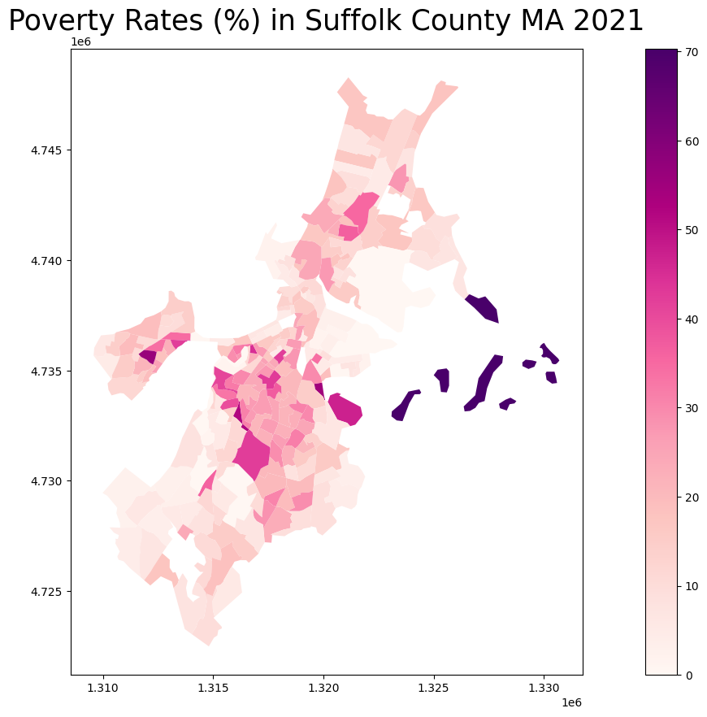
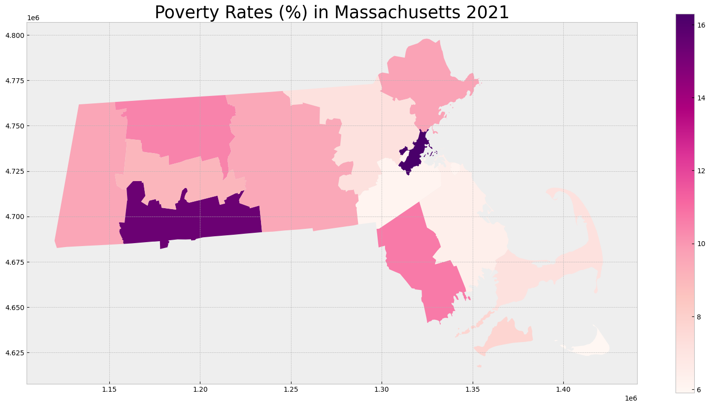

```python
# Import modules
import matplotlib.pyplot as plt
import pandas as pd
import geopandas as gpd
from census import Census
from us import states
import os
```


```python
# Set API key
c = Census("db2656e1bd54bfaf8cdf938e5ebb1534c881fb7d")
```


```python
ma_census = c.acs5.state_county_tract(fields = ('NAME', 'C17002_001E', 'C17002_002E', 'C17002_003E', 'B01003_001E'),
                                      state_fips = states.MA.fips,
                                      county_fips = "*",
                                      tract = "*",
                                      year = 2021)
```


```python
# Create a dataframe from the census data
ma_df = pd.DataFrame(ma_census)

# Show the dataframe
print(ma_df.head(5))
print('Shape: ', ma_df.shape)
ma_df.style
```

                                                    NAME  C17002_001E  \
    0  Census Tract 101, Barnstable County, Massachus...       3552.0   
    1  Census Tract 102.06, Barnstable County, Massac...       4258.0   
    2  Census Tract 102.08, Barnstable County, Massac...       1575.0   
    3  Census Tract 103.04, Barnstable County, Massac...       2929.0   
    4  Census Tract 103.06, Barnstable County, Massac...       2735.0   
    
       C17002_002E  C17002_003E  B01003_001E state county   tract  
    0        184.0        238.0       3582.0    25    001  010100  
    1        244.0        242.0       4305.0    25    001  010206  
    2          2.0         88.0       1575.0    25    001  010208  
    3         80.0         51.0       2939.0    25    001  010304  
    4         26.0        229.0       2735.0    25    001  010306  
    Shape:  (1620, 8)
    


<style type="text/css">
</style>
<table id="T_d785a">
  <thead>
    <tr>
      <th class="blank level0" >&nbsp;</th>
      <th id="T_d785a_level0_col0" class="col_heading level0 col0" >NAME</th>
      <th id="T_d785a_level0_col1" class="col_heading level0 col1" >C17002_001E</th>
      <th id="T_d785a_level0_col2" class="col_heading level0 col2" >C17002_002E</th>
      <th id="T_d785a_level0_col3" class="col_heading level0 col3" >C17002_003E</th>
      <th id="T_d785a_level0_col4" class="col_heading level0 col4" >B01003_001E</th>
      <th id="T_d785a_level0_col5" class="col_heading level0 col5" >state</th>
      <th id="T_d785a_level0_col6" class="col_heading level0 col6" >county</th>
      <th id="T_d785a_level0_col7" class="col_heading level0 col7" >tract</th>
    </tr>
  </thead>
  <tbody>
    <tr>
      <th id="T_d785a_level0_row0" class="row_heading level0 row0" >0</th>
      <td id="T_d785a_row0_col0" class="data row0 col0" >Census Tract 101, Barnstable County, Massachusetts</td>
      <td id="T_d785a_row0_col1" class="data row0 col1" >3552.000000</td>
      <td id="T_d785a_row0_col2" class="data row0 col2" >184.000000</td>
      <td id="T_d785a_row0_col3" class="data row0 col3" >238.000000</td>
      <td id="T_d785a_row0_col4" class="data row0 col4" >3582.000000</td>
      <td id="T_d785a_row0_col5" class="data row0 col5" >25</td>
      <td id="T_d785a_row0_col6" class="data row0 col6" >001</td>
      <td id="T_d785a_row0_col7" class="data row0 col7" >010100</td>
    </tr>
    <tr>
      <th id="T_d785a_level0_row1" class="row_heading level0 row1" >1</th>
      <td id="T_d785a_row1_col0" class="data row1 col0" >Census Tract 102.06, Barnstable County, Massachusetts</td>
      <td id="T_d785a_row1_col1" class="data row1 col1" >4258.000000</td>
      <td id="T_d785a_row1_col2" class="data row1 col2" >244.000000</td>
      <td id="T_d785a_row1_col3" class="data row1 col3" >242.000000</td>
      <td id="T_d785a_row1_col4" class="data row1 col4" >4305.000000</td>
      <td id="T_d785a_row1_col5" class="data row1 col5" >25</td>
      <td id="T_d785a_row1_col6" class="data row1 col6" >001</td>
      <td id="T_d785a_row1_col7" class="data row1 col7" >010206</td>
    </tr>
    <tr>
      <th id="T_d785a_level0_row2" class="row_heading level0 row2" >2</th>
      <td id="T_d785a_row2_col0" class="data row2 col0" >Census Tract 102.08, Barnstable County, Massachusetts</td>
      <td id="T_d785a_row2_col1" class="data row2 col1" >1575.000000</td>
      <td id="T_d785a_row2_col2" class="data row2 col2" >2.000000</td>
      <td id="T_d785a_row2_col3" class="data row2 col3" >88.000000</td>
      <td id="T_d785a_row2_col4" class="data row2 col4" >1575.000000</td>
      <td id="T_d785a_row2_col5" class="data row2 col5" >25</td>
      <td id="T_d785a_row2_col6" class="data row2 col6" >001</td>
      <td id="T_d785a_row2_col7" class="data row2 col7" >010208</td>
    </tr>
    <tr>
      <th id="T_d785a_level0_row3" class="row_heading level0 row3" >3</th>
      <td id="T_d785a_row3_col0" class="data row3 col0" >Census Tract 103.04, Barnstable County, Massachusetts</td>
      <td id="T_d785a_row3_col1" class="data row3 col1" >2929.000000</td>
      <td id="T_d785a_row3_col2" class="data row3 col2" >80.000000</td>
      <td id="T_d785a_row3_col3" class="data row3 col3" >51.000000</td>
      <td id="T_d785a_row3_col4" class="data row3 col4" >2939.000000</td>
      <td id="T_d785a_row3_col5" class="data row3 col5" >25</td>
      <td id="T_d785a_row3_col6" class="data row3 col6" >001</td>
      <td id="T_d785a_row3_col7" class="data row3 col7" >010304</td>
    </tr>
    <tr>
      <th id="T_d785a_level0_row4" class="row_heading level0 row4" >4</th>
      <td id="T_d785a_row4_col0" class="data row4 col0" >Census Tract 103.06, Barnstable County, Massachusetts</td>
      <td id="T_d785a_row4_col1" class="data row4 col1" >2735.000000</td>
      <td id="T_d785a_row4_col2" class="data row4 col2" >26.000000</td>
      <td id="T_d785a_row4_col3" class="data row4 col3" >229.000000</td>
      <td id="T_d785a_row4_col4" class="data row4 col4" >2735.000000</td>
      <td id="T_d785a_row4_col5" class="data row4 col5" >25</td>
      <td id="T_d785a_row4_col6" class="data row4 col6" >001</td>
      <td id="T_d785a_row4_col7" class="data row4 col7" >010306</td>
    </tr>
    <tr>
      <th id="T_d785a_level0_row5" class="row_heading level0 row5" >5</th>
      <td id="T_d785a_row5_col0" class="data row5 col0" >Census Tract 104, Barnstable County, Massachusetts</td>
      <td id="T_d785a_row5_col1" class="data row5 col1" >3274.000000</td>
      <td id="T_d785a_row5_col2" class="data row5 col2" >134.000000</td>
      <td id="T_d785a_row5_col3" class="data row5 col3" >346.000000</td>
      <td id="T_d785a_row5_col4" class="data row5 col4" >3309.000000</td>
      <td id="T_d785a_row5_col5" class="data row5 col5" >25</td>
      <td id="T_d785a_row5_col6" class="data row5 col6" >001</td>
      <td id="T_d785a_row5_col7" class="data row5 col7" >010400</td>
    </tr>
    <tr>
      <th id="T_d785a_level0_row6" class="row_heading level0 row6" >6</th>
      <td id="T_d785a_row6_col0" class="data row6 col0" >Census Tract 105, Barnstable County, Massachusetts</td>
      <td id="T_d785a_row6_col1" class="data row6 col1" >2967.000000</td>
      <td id="T_d785a_row6_col2" class="data row6 col2" >89.000000</td>
      <td id="T_d785a_row6_col3" class="data row6 col3" >89.000000</td>
      <td id="T_d785a_row6_col4" class="data row6 col4" >2967.000000</td>
      <td id="T_d785a_row6_col5" class="data row6 col5" >25</td>
      <td id="T_d785a_row6_col6" class="data row6 col6" >001</td>
      <td id="T_d785a_row6_col7" class="data row6 col7" >010500</td>
    </tr>
    <tr>
      <th id="T_d785a_level0_row7" class="row_heading level0 row7" >7</th>
      <td id="T_d785a_row7_col0" class="data row7 col0" >Census Tract 106, Barnstable County, Massachusetts</td>
      <td id="T_d785a_row7_col1" class="data row7 col1" >3001.000000</td>
      <td id="T_d785a_row7_col2" class="data row7 col2" >107.000000</td>
      <td id="T_d785a_row7_col3" class="data row7 col3" >33.000000</td>
      <td id="T_d785a_row7_col4" class="data row7 col4" >3142.000000</td>
      <td id="T_d785a_row7_col5" class="data row7 col5" >25</td>
      <td id="T_d785a_row7_col6" class="data row7 col6" >001</td>
      <td id="T_d785a_row7_col7" class="data row7 col7" >010600</td>
    </tr>
    <tr>
      <th id="T_d785a_level0_row8" class="row_heading level0 row8" >8</th>
      <td id="T_d785a_row8_col0" class="data row8 col0" >Census Tract 107, Barnstable County, Massachusetts</td>
      <td id="T_d785a_row8_col1" class="data row8 col1" >3392.000000</td>
      <td id="T_d785a_row8_col2" class="data row8 col2" >219.000000</td>
      <td id="T_d785a_row8_col3" class="data row8 col3" >53.000000</td>
      <td id="T_d785a_row8_col4" class="data row8 col4" >3412.000000</td>
      <td id="T_d785a_row8_col5" class="data row8 col5" >25</td>
      <td id="T_d785a_row8_col6" class="data row8 col6" >001</td>
      <td id="T_d785a_row8_col7" class="data row8 col7" >010700</td>
    </tr>
    <tr>
      <th id="T_d785a_level0_row9" class="row_heading level0 row9" >9</th>
      <td id="T_d785a_row9_col0" class="data row9 col0" >Census Tract 108, Barnstable County, Massachusetts</td>
      <td id="T_d785a_row9_col1" class="data row9 col1" >4672.000000</td>
      <td id="T_d785a_row9_col2" class="data row9 col2" >207.000000</td>
      <td id="T_d785a_row9_col3" class="data row9 col3" >176.000000</td>
      <td id="T_d785a_row9_col4" class="data row9 col4" >4785.000000</td>
      <td id="T_d785a_row9_col5" class="data row9 col5" >25</td>
      <td id="T_d785a_row9_col6" class="data row9 col6" >001</td>
      <td id="T_d785a_row9_col7" class="data row9 col7" >010800</td>
    </tr>
    <tr>
      <th id="T_d785a_level0_row10" class="row_heading level0 row10" >10</th>
      <td id="T_d785a_row10_col0" class="data row10 col0" >Census Tract 109, Barnstable County, Massachusetts</td>
      <td id="T_d785a_row10_col1" class="data row10 col1" >5304.000000</td>
      <td id="T_d785a_row10_col2" class="data row10 col2" >46.000000</td>
      <td id="T_d785a_row10_col3" class="data row10 col3" >290.000000</td>
      <td id="T_d785a_row10_col4" class="data row10 col4" >5497.000000</td>
      <td id="T_d785a_row10_col5" class="data row10 col5" >25</td>
      <td id="T_d785a_row10_col6" class="data row10 col6" >001</td>
      <td id="T_d785a_row10_col7" class="data row10 col7" >010900</td>
    </tr>
    <tr>
      <th id="T_d785a_level0_row11" class="row_heading level0 row11" >11</th>
      <td id="T_d785a_row11_col0" class="data row11 col0" >Census Tract 110.02, Barnstable County, Massachusetts</td>
      <td id="T_d785a_row11_col1" class="data row11 col1" >4204.000000</td>
      <td id="T_d785a_row11_col2" class="data row11 col2" >107.000000</td>
      <td id="T_d785a_row11_col3" class="data row11 col3" >296.000000</td>
      <td id="T_d785a_row11_col4" class="data row11 col4" >4337.000000</td>
      <td id="T_d785a_row11_col5" class="data row11 col5" >25</td>
      <td id="T_d785a_row11_col6" class="data row11 col6" >001</td>
      <td id="T_d785a_row11_col7" class="data row11 col7" >011002</td>
    </tr>
    <tr>
      <th id="T_d785a_level0_row12" class="row_heading level0 row12" >12</th>
      <td id="T_d785a_row12_col0" class="data row12 col0" >Census Tract 111, Barnstable County, Massachusetts</td>
      <td id="T_d785a_row12_col1" class="data row12 col1" >5210.000000</td>
      <td id="T_d785a_row12_col2" class="data row12 col2" >32.000000</td>
      <td id="T_d785a_row12_col3" class="data row12 col3" >72.000000</td>
      <td id="T_d785a_row12_col4" class="data row12 col4" >5229.000000</td>
      <td id="T_d785a_row12_col5" class="data row12 col5" >25</td>
      <td id="T_d785a_row12_col6" class="data row12 col6" >001</td>
      <td id="T_d785a_row12_col7" class="data row12 col7" >011100</td>
    </tr>
    <tr>
      <th id="T_d785a_level0_row13" class="row_heading level0 row13" >13</th>
      <td id="T_d785a_row13_col0" class="data row13 col0" >Census Tract 112, Barnstable County, Massachusetts</td>
      <td id="T_d785a_row13_col1" class="data row13 col1" >3721.000000</td>
      <td id="T_d785a_row13_col2" class="data row13 col2" >68.000000</td>
      <td id="T_d785a_row13_col3" class="data row13 col3" >113.000000</td>
      <td id="T_d785a_row13_col4" class="data row13 col4" >3763.000000</td>
      <td id="T_d785a_row13_col5" class="data row13 col5" >25</td>
      <td id="T_d785a_row13_col6" class="data row13 col6" >001</td>
      <td id="T_d785a_row13_col7" class="data row13 col7" >011200</td>
    </tr>
    <tr>
      <th id="T_d785a_level0_row14" class="row_heading level0 row14" >14</th>
      <td id="T_d785a_row14_col0" class="data row14 col0" >Census Tract 113, Barnstable County, Massachusetts</td>
      <td id="T_d785a_row14_col1" class="data row14 col1" >2538.000000</td>
      <td id="T_d785a_row14_col2" class="data row14 col2" >41.000000</td>
      <td id="T_d785a_row14_col3" class="data row14 col3" >46.000000</td>
      <td id="T_d785a_row14_col4" class="data row14 col4" >2538.000000</td>
      <td id="T_d785a_row14_col5" class="data row14 col5" >25</td>
      <td id="T_d785a_row14_col6" class="data row14 col6" >001</td>
      <td id="T_d785a_row14_col7" class="data row14 col7" >011300</td>
    </tr>
    <tr>
      <th id="T_d785a_level0_row15" class="row_heading level0 row15" >15</th>
      <td id="T_d785a_row15_col0" class="data row15 col0" >Census Tract 114, Barnstable County, Massachusetts</td>
      <td id="T_d785a_row15_col1" class="data row15 col1" >3214.000000</td>
      <td id="T_d785a_row15_col2" class="data row15 col2" >173.000000</td>
      <td id="T_d785a_row15_col3" class="data row15 col3" >82.000000</td>
      <td id="T_d785a_row15_col4" class="data row15 col4" >3214.000000</td>
      <td id="T_d785a_row15_col5" class="data row15 col5" >25</td>
      <td id="T_d785a_row15_col6" class="data row15 col6" >001</td>
      <td id="T_d785a_row15_col7" class="data row15 col7" >011400</td>
    </tr>
    <tr>
      <th id="T_d785a_level0_row16" class="row_heading level0 row16" >16</th>
      <td id="T_d785a_row16_col0" class="data row16 col0" >Census Tract 115, Barnstable County, Massachusetts</td>
      <td id="T_d785a_row16_col1" class="data row16 col1" >4022.000000</td>
      <td id="T_d785a_row16_col2" class="data row16 col2" >32.000000</td>
      <td id="T_d785a_row16_col3" class="data row16 col3" >346.000000</td>
      <td id="T_d785a_row16_col4" class="data row16 col4" >4109.000000</td>
      <td id="T_d785a_row16_col5" class="data row16 col5" >25</td>
      <td id="T_d785a_row16_col6" class="data row16 col6" >001</td>
      <td id="T_d785a_row16_col7" class="data row16 col7" >011500</td>
    </tr>
    <tr>
      <th id="T_d785a_level0_row17" class="row_heading level0 row17" >17</th>
      <td id="T_d785a_row17_col0" class="data row17 col0" >Census Tract 116, Barnstable County, Massachusetts</td>
      <td id="T_d785a_row17_col1" class="data row17 col1" >2737.000000</td>
      <td id="T_d785a_row17_col2" class="data row17 col2" >324.000000</td>
      <td id="T_d785a_row17_col3" class="data row17 col3" >143.000000</td>
      <td id="T_d785a_row17_col4" class="data row17 col4" >2747.000000</td>
      <td id="T_d785a_row17_col5" class="data row17 col5" >25</td>
      <td id="T_d785a_row17_col6" class="data row17 col6" >001</td>
      <td id="T_d785a_row17_col7" class="data row17 col7" >011600</td>
    </tr>
    <tr>
      <th id="T_d785a_level0_row18" class="row_heading level0 row18" >18</th>
      <td id="T_d785a_row18_col0" class="data row18 col0" >Census Tract 117, Barnstable County, Massachusetts</td>
      <td id="T_d785a_row18_col1" class="data row18 col1" >2056.000000</td>
      <td id="T_d785a_row18_col2" class="data row18 col2" >85.000000</td>
      <td id="T_d785a_row18_col3" class="data row18 col3" >97.000000</td>
      <td id="T_d785a_row18_col4" class="data row18 col4" >2056.000000</td>
      <td id="T_d785a_row18_col5" class="data row18 col5" >25</td>
      <td id="T_d785a_row18_col6" class="data row18 col6" >001</td>
      <td id="T_d785a_row18_col7" class="data row18 col7" >011700</td>
    </tr>
    <tr>
      <th id="T_d785a_level0_row19" class="row_heading level0 row19" >19</th>
      <td id="T_d785a_row19_col0" class="data row19 col0" >Census Tract 118.01, Barnstable County, Massachusetts</td>
      <td id="T_d785a_row19_col1" class="data row19 col1" >2260.000000</td>
      <td id="T_d785a_row19_col2" class="data row19 col2" >83.000000</td>
      <td id="T_d785a_row19_col3" class="data row19 col3" >41.000000</td>
      <td id="T_d785a_row19_col4" class="data row19 col4" >2260.000000</td>
      <td id="T_d785a_row19_col5" class="data row19 col5" >25</td>
      <td id="T_d785a_row19_col6" class="data row19 col6" >001</td>
      <td id="T_d785a_row19_col7" class="data row19 col7" >011801</td>
    </tr>
    <tr>
      <th id="T_d785a_level0_row20" class="row_heading level0 row20" >20</th>
      <td id="T_d785a_row20_col0" class="data row20 col0" >Census Tract 118.02, Barnstable County, Massachusetts</td>
      <td id="T_d785a_row20_col1" class="data row20 col1" >4714.000000</td>
      <td id="T_d785a_row20_col2" class="data row20 col2" >227.000000</td>
      <td id="T_d785a_row20_col3" class="data row20 col3" >181.000000</td>
      <td id="T_d785a_row20_col4" class="data row20 col4" >4722.000000</td>
      <td id="T_d785a_row20_col5" class="data row20 col5" >25</td>
      <td id="T_d785a_row20_col6" class="data row20 col6" >001</td>
      <td id="T_d785a_row20_col7" class="data row20 col7" >011802</td>
    </tr>
    <tr>
      <th id="T_d785a_level0_row21" class="row_heading level0 row21" >21</th>
      <td id="T_d785a_row21_col0" class="data row21 col0" >Census Tract 120.01, Barnstable County, Massachusetts</td>
      <td id="T_d785a_row21_col1" class="data row21 col1" >5699.000000</td>
      <td id="T_d785a_row21_col2" class="data row21 col2" >60.000000</td>
      <td id="T_d785a_row21_col3" class="data row21 col3" >95.000000</td>
      <td id="T_d785a_row21_col4" class="data row21 col4" >5829.000000</td>
      <td id="T_d785a_row21_col5" class="data row21 col5" >25</td>
      <td id="T_d785a_row21_col6" class="data row21 col6" >001</td>
      <td id="T_d785a_row21_col7" class="data row21 col7" >012001</td>
    </tr>
    <tr>
      <th id="T_d785a_level0_row22" class="row_heading level0 row22" >22</th>
      <td id="T_d785a_row22_col0" class="data row22 col0" >Census Tract 120.02, Barnstable County, Massachusetts</td>
      <td id="T_d785a_row22_col1" class="data row22 col1" >2666.000000</td>
      <td id="T_d785a_row22_col2" class="data row22 col2" >238.000000</td>
      <td id="T_d785a_row22_col3" class="data row22 col3" >111.000000</td>
      <td id="T_d785a_row22_col4" class="data row22 col4" >2728.000000</td>
      <td id="T_d785a_row22_col5" class="data row22 col5" >25</td>
      <td id="T_d785a_row22_col6" class="data row22 col6" >001</td>
      <td id="T_d785a_row22_col7" class="data row22 col7" >012002</td>
    </tr>
    <tr>
      <th id="T_d785a_level0_row23" class="row_heading level0 row23" >23</th>
      <td id="T_d785a_row23_col0" class="data row23 col0" >Census Tract 121.01, Barnstable County, Massachusetts</td>
      <td id="T_d785a_row23_col1" class="data row23 col1" >6239.000000</td>
      <td id="T_d785a_row23_col2" class="data row23 col2" >119.000000</td>
      <td id="T_d785a_row23_col3" class="data row23 col3" >155.000000</td>
      <td id="T_d785a_row23_col4" class="data row23 col4" >6260.000000</td>
      <td id="T_d785a_row23_col5" class="data row23 col5" >25</td>
      <td id="T_d785a_row23_col6" class="data row23 col6" >001</td>
      <td id="T_d785a_row23_col7" class="data row23 col7" >012101</td>
    </tr>
    <tr>
      <th id="T_d785a_level0_row24" class="row_heading level0 row24" >24</th>
      <td id="T_d785a_row24_col0" class="data row24 col0" >Census Tract 121.02, Barnstable County, Massachusetts</td>
      <td id="T_d785a_row24_col1" class="data row24 col1" >3051.000000</td>
      <td id="T_d785a_row24_col2" class="data row24 col2" >145.000000</td>
      <td id="T_d785a_row24_col3" class="data row24 col3" >156.000000</td>
      <td id="T_d785a_row24_col4" class="data row24 col4" >3091.000000</td>
      <td id="T_d785a_row24_col5" class="data row24 col5" >25</td>
      <td id="T_d785a_row24_col6" class="data row24 col6" >001</td>
      <td id="T_d785a_row24_col7" class="data row24 col7" >012102</td>
    </tr>
    <tr>
      <th id="T_d785a_level0_row25" class="row_heading level0 row25" >25</th>
      <td id="T_d785a_row25_col0" class="data row25 col0" >Census Tract 122, Barnstable County, Massachusetts</td>
      <td id="T_d785a_row25_col1" class="data row25 col1" >4898.000000</td>
      <td id="T_d785a_row25_col2" class="data row25 col2" >1.000000</td>
      <td id="T_d785a_row25_col3" class="data row25 col3" >4.000000</td>
      <td id="T_d785a_row25_col4" class="data row25 col4" >4913.000000</td>
      <td id="T_d785a_row25_col5" class="data row25 col5" >25</td>
      <td id="T_d785a_row25_col6" class="data row25 col6" >001</td>
      <td id="T_d785a_row25_col7" class="data row25 col7" >012200</td>
    </tr>
    <tr>
      <th id="T_d785a_level0_row26" class="row_heading level0 row26" >26</th>
      <td id="T_d785a_row26_col0" class="data row26 col0" >Census Tract 125.02, Barnstable County, Massachusetts</td>
      <td id="T_d785a_row26_col1" class="data row26 col1" >3663.000000</td>
      <td id="T_d785a_row26_col2" class="data row26 col2" >124.000000</td>
      <td id="T_d785a_row26_col3" class="data row26 col3" >482.000000</td>
      <td id="T_d785a_row26_col4" class="data row26 col4" >3742.000000</td>
      <td id="T_d785a_row26_col5" class="data row26 col5" >25</td>
      <td id="T_d785a_row26_col6" class="data row26 col6" >001</td>
      <td id="T_d785a_row26_col7" class="data row26 col7" >012502</td>
    </tr>
    <tr>
      <th id="T_d785a_level0_row27" class="row_heading level0 row27" >27</th>
      <td id="T_d785a_row27_col0" class="data row27 col0" >Census Tract 126.01, Barnstable County, Massachusetts</td>
      <td id="T_d785a_row27_col1" class="data row27 col1" >3439.000000</td>
      <td id="T_d785a_row27_col2" class="data row27 col2" >88.000000</td>
      <td id="T_d785a_row27_col3" class="data row27 col3" >77.000000</td>
      <td id="T_d785a_row27_col4" class="data row27 col4" >3508.000000</td>
      <td id="T_d785a_row27_col5" class="data row27 col5" >25</td>
      <td id="T_d785a_row27_col6" class="data row27 col6" >001</td>
      <td id="T_d785a_row27_col7" class="data row27 col7" >012601</td>
    </tr>
    <tr>
      <th id="T_d785a_level0_row28" class="row_heading level0 row28" >28</th>
      <td id="T_d785a_row28_col0" class="data row28 col0" >Census Tract 126.02, Barnstable County, Massachusetts</td>
      <td id="T_d785a_row28_col1" class="data row28 col1" >6018.000000</td>
      <td id="T_d785a_row28_col2" class="data row28 col2" >257.000000</td>
      <td id="T_d785a_row28_col3" class="data row28 col3" >721.000000</td>
      <td id="T_d785a_row28_col4" class="data row28 col4" >6018.000000</td>
      <td id="T_d785a_row28_col5" class="data row28 col5" >25</td>
      <td id="T_d785a_row28_col6" class="data row28 col6" >001</td>
      <td id="T_d785a_row28_col7" class="data row28 col7" >012602</td>
    </tr>
    <tr>
      <th id="T_d785a_level0_row29" class="row_heading level0 row29" >29</th>
      <td id="T_d785a_row29_col0" class="data row29 col0" >Census Tract 127, Barnstable County, Massachusetts</td>
      <td id="T_d785a_row29_col1" class="data row29 col1" >5044.000000</td>
      <td id="T_d785a_row29_col2" class="data row29 col2" >97.000000</td>
      <td id="T_d785a_row29_col3" class="data row29 col3" >177.000000</td>
      <td id="T_d785a_row29_col4" class="data row29 col4" >5044.000000</td>
      <td id="T_d785a_row29_col5" class="data row29 col5" >25</td>
      <td id="T_d785a_row29_col6" class="data row29 col6" >001</td>
      <td id="T_d785a_row29_col7" class="data row29 col7" >012700</td>
    </tr>
    <tr>
      <th id="T_d785a_level0_row30" class="row_heading level0 row30" >30</th>
      <td id="T_d785a_row30_col0" class="data row30 col0" >Census Tract 128, Barnstable County, Massachusetts</td>
      <td id="T_d785a_row30_col1" class="data row30 col1" >4039.000000</td>
      <td id="T_d785a_row30_col2" class="data row30 col2" >241.000000</td>
      <td id="T_d785a_row30_col3" class="data row30 col3" >154.000000</td>
      <td id="T_d785a_row30_col4" class="data row30 col4" >4131.000000</td>
      <td id="T_d785a_row30_col5" class="data row30 col5" >25</td>
      <td id="T_d785a_row30_col6" class="data row30 col6" >001</td>
      <td id="T_d785a_row30_col7" class="data row30 col7" >012800</td>
    </tr>
    <tr>
      <th id="T_d785a_level0_row31" class="row_heading level0 row31" >31</th>
      <td id="T_d785a_row31_col0" class="data row31 col0" >Census Tract 129, Barnstable County, Massachusetts</td>
      <td id="T_d785a_row31_col1" class="data row31 col1" >4461.000000</td>
      <td id="T_d785a_row31_col2" class="data row31 col2" >294.000000</td>
      <td id="T_d785a_row31_col3" class="data row31 col3" >52.000000</td>
      <td id="T_d785a_row31_col4" class="data row31 col4" >4461.000000</td>
      <td id="T_d785a_row31_col5" class="data row31 col5" >25</td>
      <td id="T_d785a_row31_col6" class="data row31 col6" >001</td>
      <td id="T_d785a_row31_col7" class="data row31 col7" >012900</td>
    </tr>
    <tr>
      <th id="T_d785a_level0_row32" class="row_heading level0 row32" >32</th>
      <td id="T_d785a_row32_col0" class="data row32 col0" >Census Tract 130.02, Barnstable County, Massachusetts</td>
      <td id="T_d785a_row32_col1" class="data row32 col1" >2906.000000</td>
      <td id="T_d785a_row32_col2" class="data row32 col2" >69.000000</td>
      <td id="T_d785a_row32_col3" class="data row32 col3" >55.000000</td>
      <td id="T_d785a_row32_col4" class="data row32 col4" >2906.000000</td>
      <td id="T_d785a_row32_col5" class="data row32 col5" >25</td>
      <td id="T_d785a_row32_col6" class="data row32 col6" >001</td>
      <td id="T_d785a_row32_col7" class="data row32 col7" >013002</td>
    </tr>
    <tr>
      <th id="T_d785a_level0_row33" class="row_heading level0 row33" >33</th>
      <td id="T_d785a_row33_col0" class="data row33 col0" >Census Tract 131, Barnstable County, Massachusetts</td>
      <td id="T_d785a_row33_col1" class="data row33 col1" >5593.000000</td>
      <td id="T_d785a_row33_col2" class="data row33 col2" >29.000000</td>
      <td id="T_d785a_row33_col3" class="data row33 col3" >57.000000</td>
      <td id="T_d785a_row33_col4" class="data row33 col4" >5593.000000</td>
      <td id="T_d785a_row33_col5" class="data row33 col5" >25</td>
      <td id="T_d785a_row33_col6" class="data row33 col6" >001</td>
      <td id="T_d785a_row33_col7" class="data row33 col7" >013100</td>
    </tr>
    <tr>
      <th id="T_d785a_level0_row34" class="row_heading level0 row34" >34</th>
      <td id="T_d785a_row34_col0" class="data row34 col0" >Census Tract 132, Barnstable County, Massachusetts</td>
      <td id="T_d785a_row34_col1" class="data row34 col1" >4638.000000</td>
      <td id="T_d785a_row34_col2" class="data row34 col2" >65.000000</td>
      <td id="T_d785a_row34_col3" class="data row34 col3" >112.000000</td>
      <td id="T_d785a_row34_col4" class="data row34 col4" >4638.000000</td>
      <td id="T_d785a_row34_col5" class="data row34 col5" >25</td>
      <td id="T_d785a_row34_col6" class="data row34 col6" >001</td>
      <td id="T_d785a_row34_col7" class="data row34 col7" >013200</td>
    </tr>
    <tr>
      <th id="T_d785a_level0_row35" class="row_heading level0 row35" >35</th>
      <td id="T_d785a_row35_col0" class="data row35 col0" >Census Tract 133, Barnstable County, Massachusetts</td>
      <td id="T_d785a_row35_col1" class="data row35 col1" >2885.000000</td>
      <td id="T_d785a_row35_col2" class="data row35 col2" >149.000000</td>
      <td id="T_d785a_row35_col3" class="data row35 col3" >41.000000</td>
      <td id="T_d785a_row35_col4" class="data row35 col4" >3010.000000</td>
      <td id="T_d785a_row35_col5" class="data row35 col5" >25</td>
      <td id="T_d785a_row35_col6" class="data row35 col6" >001</td>
      <td id="T_d785a_row35_col7" class="data row35 col7" >013300</td>
    </tr>
    <tr>
      <th id="T_d785a_level0_row36" class="row_heading level0 row36" >36</th>
      <td id="T_d785a_row36_col0" class="data row36 col0" >Census Tract 134, Barnstable County, Massachusetts</td>
      <td id="T_d785a_row36_col1" class="data row36 col1" >4027.000000</td>
      <td id="T_d785a_row36_col2" class="data row36 col2" >115.000000</td>
      <td id="T_d785a_row36_col3" class="data row36 col3" >290.000000</td>
      <td id="T_d785a_row36_col4" class="data row36 col4" >4054.000000</td>
      <td id="T_d785a_row36_col5" class="data row36 col5" >25</td>
      <td id="T_d785a_row36_col6" class="data row36 col6" >001</td>
      <td id="T_d785a_row36_col7" class="data row36 col7" >013400</td>
    </tr>
    <tr>
      <th id="T_d785a_level0_row37" class="row_heading level0 row37" >37</th>
      <td id="T_d785a_row37_col0" class="data row37 col0" >Census Tract 135, Barnstable County, Massachusetts</td>
      <td id="T_d785a_row37_col1" class="data row37 col1" >7267.000000</td>
      <td id="T_d785a_row37_col2" class="data row37 col2" >128.000000</td>
      <td id="T_d785a_row37_col3" class="data row37 col3" >109.000000</td>
      <td id="T_d785a_row37_col4" class="data row37 col4" >7283.000000</td>
      <td id="T_d785a_row37_col5" class="data row37 col5" >25</td>
      <td id="T_d785a_row37_col6" class="data row37 col6" >001</td>
      <td id="T_d785a_row37_col7" class="data row37 col7" >013500</td>
    </tr>
    <tr>
      <th id="T_d785a_level0_row38" class="row_heading level0 row38" >38</th>
      <td id="T_d785a_row38_col0" class="data row38 col0" >Census Tract 136, Barnstable County, Massachusetts</td>
      <td id="T_d785a_row38_col1" class="data row38 col1" >5923.000000</td>
      <td id="T_d785a_row38_col2" class="data row38 col2" >217.000000</td>
      <td id="T_d785a_row38_col3" class="data row38 col3" >1.000000</td>
      <td id="T_d785a_row38_col4" class="data row38 col4" >6004.000000</td>
      <td id="T_d785a_row38_col5" class="data row38 col5" >25</td>
      <td id="T_d785a_row38_col6" class="data row38 col6" >001</td>
      <td id="T_d785a_row38_col7" class="data row38 col7" >013600</td>
    </tr>
    <tr>
      <th id="T_d785a_level0_row39" class="row_heading level0 row39" >39</th>
      <td id="T_d785a_row39_col0" class="data row39 col0" >Census Tract 137, Barnstable County, Massachusetts</td>
      <td id="T_d785a_row39_col1" class="data row39 col1" >3999.000000</td>
      <td id="T_d785a_row39_col2" class="data row39 col2" >121.000000</td>
      <td id="T_d785a_row39_col3" class="data row39 col3" >187.000000</td>
      <td id="T_d785a_row39_col4" class="data row39 col4" >4336.000000</td>
      <td id="T_d785a_row39_col5" class="data row39 col5" >25</td>
      <td id="T_d785a_row39_col6" class="data row39 col6" >001</td>
      <td id="T_d785a_row39_col7" class="data row39 col7" >013700</td>
    </tr>
    <tr>
      <th id="T_d785a_level0_row40" class="row_heading level0 row40" >40</th>
      <td id="T_d785a_row40_col0" class="data row40 col0" >Census Tract 138, Barnstable County, Massachusetts</td>
      <td id="T_d785a_row40_col1" class="data row40 col1" >5543.000000</td>
      <td id="T_d785a_row40_col2" class="data row40 col2" >30.000000</td>
      <td id="T_d785a_row40_col3" class="data row40 col3" >173.000000</td>
      <td id="T_d785a_row40_col4" class="data row40 col4" >5834.000000</td>
      <td id="T_d785a_row40_col5" class="data row40 col5" >25</td>
      <td id="T_d785a_row40_col6" class="data row40 col6" >001</td>
      <td id="T_d785a_row40_col7" class="data row40 col7" >013800</td>
    </tr>
    <tr>
      <th id="T_d785a_level0_row41" class="row_heading level0 row41" >41</th>
      <td id="T_d785a_row41_col0" class="data row41 col0" >Census Tract 139, Barnstable County, Massachusetts</td>
      <td id="T_d785a_row41_col1" class="data row41 col1" >4719.000000</td>
      <td id="T_d785a_row41_col2" class="data row41 col2" >53.000000</td>
      <td id="T_d785a_row41_col3" class="data row41 col3" >156.000000</td>
      <td id="T_d785a_row41_col4" class="data row41 col4" >4719.000000</td>
      <td id="T_d785a_row41_col5" class="data row41 col5" >25</td>
      <td id="T_d785a_row41_col6" class="data row41 col6" >001</td>
      <td id="T_d785a_row41_col7" class="data row41 col7" >013900</td>
    </tr>
    <tr>
      <th id="T_d785a_level0_row42" class="row_heading level0 row42" >42</th>
      <td id="T_d785a_row42_col0" class="data row42 col0" >Census Tract 140.02, Barnstable County, Massachusetts</td>
      <td id="T_d785a_row42_col1" class="data row42 col1" >4646.000000</td>
      <td id="T_d785a_row42_col2" class="data row42 col2" >209.000000</td>
      <td id="T_d785a_row42_col3" class="data row42 col3" >145.000000</td>
      <td id="T_d785a_row42_col4" class="data row42 col4" >4646.000000</td>
      <td id="T_d785a_row42_col5" class="data row42 col5" >25</td>
      <td id="T_d785a_row42_col6" class="data row42 col6" >001</td>
      <td id="T_d785a_row42_col7" class="data row42 col7" >014002</td>
    </tr>
    <tr>
      <th id="T_d785a_level0_row43" class="row_heading level0 row43" >43</th>
      <td id="T_d785a_row43_col0" class="data row43 col0" >Census Tract 141, Barnstable County, Massachusetts</td>
      <td id="T_d785a_row43_col1" class="data row43 col1" >780.000000</td>
      <td id="T_d785a_row43_col2" class="data row43 col2" >0.000000</td>
      <td id="T_d785a_row43_col3" class="data row43 col3" >39.000000</td>
      <td id="T_d785a_row43_col4" class="data row43 col4" >847.000000</td>
      <td id="T_d785a_row43_col5" class="data row43 col5" >25</td>
      <td id="T_d785a_row43_col6" class="data row43 col6" >001</td>
      <td id="T_d785a_row43_col7" class="data row43 col7" >014100</td>
    </tr>
    <tr>
      <th id="T_d785a_level0_row44" class="row_heading level0 row44" >44</th>
      <td id="T_d785a_row44_col0" class="data row44 col0" >Census Tract 143, Barnstable County, Massachusetts</td>
      <td id="T_d785a_row44_col1" class="data row44 col1" >3919.000000</td>
      <td id="T_d785a_row44_col2" class="data row44 col2" >89.000000</td>
      <td id="T_d785a_row44_col3" class="data row44 col3" >37.000000</td>
      <td id="T_d785a_row44_col4" class="data row44 col4" >3993.000000</td>
      <td id="T_d785a_row44_col5" class="data row44 col5" >25</td>
      <td id="T_d785a_row44_col6" class="data row44 col6" >001</td>
      <td id="T_d785a_row44_col7" class="data row44 col7" >014300</td>
    </tr>
    <tr>
      <th id="T_d785a_level0_row45" class="row_heading level0 row45" >45</th>
      <td id="T_d785a_row45_col0" class="data row45 col0" >Census Tract 144.02, Barnstable County, Massachusetts</td>
      <td id="T_d785a_row45_col1" class="data row45 col1" >7203.000000</td>
      <td id="T_d785a_row45_col2" class="data row45 col2" >397.000000</td>
      <td id="T_d785a_row45_col3" class="data row45 col3" >194.000000</td>
      <td id="T_d785a_row45_col4" class="data row45 col4" >7203.000000</td>
      <td id="T_d785a_row45_col5" class="data row45 col5" >25</td>
      <td id="T_d785a_row45_col6" class="data row45 col6" >001</td>
      <td id="T_d785a_row45_col7" class="data row45 col7" >014402</td>
    </tr>
    <tr>
      <th id="T_d785a_level0_row46" class="row_heading level0 row46" >46</th>
      <td id="T_d785a_row46_col0" class="data row46 col0" >Census Tract 145, Barnstable County, Massachusetts</td>
      <td id="T_d785a_row46_col1" class="data row46 col1" >5744.000000</td>
      <td id="T_d785a_row46_col2" class="data row46 col2" >62.000000</td>
      <td id="T_d785a_row46_col3" class="data row46 col3" >376.000000</td>
      <td id="T_d785a_row46_col4" class="data row46 col4" >5786.000000</td>
      <td id="T_d785a_row46_col5" class="data row46 col5" >25</td>
      <td id="T_d785a_row46_col6" class="data row46 col6" >001</td>
      <td id="T_d785a_row46_col7" class="data row46 col7" >014500</td>
    </tr>
    <tr>
      <th id="T_d785a_level0_row47" class="row_heading level0 row47" >47</th>
      <td id="T_d785a_row47_col0" class="data row47 col0" >Census Tract 146, Barnstable County, Massachusetts</td>
      <td id="T_d785a_row47_col1" class="data row47 col1" >4448.000000</td>
      <td id="T_d785a_row47_col2" class="data row47 col2" >63.000000</td>
      <td id="T_d785a_row47_col3" class="data row47 col3" >283.000000</td>
      <td id="T_d785a_row47_col4" class="data row47 col4" >4448.000000</td>
      <td id="T_d785a_row47_col5" class="data row47 col5" >25</td>
      <td id="T_d785a_row47_col6" class="data row47 col6" >001</td>
      <td id="T_d785a_row47_col7" class="data row47 col7" >014600</td>
    </tr>
    <tr>
      <th id="T_d785a_level0_row48" class="row_heading level0 row48" >48</th>
      <td id="T_d785a_row48_col0" class="data row48 col0" >Census Tract 147, Barnstable County, Massachusetts</td>
      <td id="T_d785a_row48_col1" class="data row48 col1" >3625.000000</td>
      <td id="T_d785a_row48_col2" class="data row48 col2" >131.000000</td>
      <td id="T_d785a_row48_col3" class="data row48 col3" >98.000000</td>
      <td id="T_d785a_row48_col4" class="data row48 col4" >3625.000000</td>
      <td id="T_d785a_row48_col5" class="data row48 col5" >25</td>
      <td id="T_d785a_row48_col6" class="data row48 col6" >001</td>
      <td id="T_d785a_row48_col7" class="data row48 col7" >014700</td>
    </tr>
    <tr>
      <th id="T_d785a_level0_row49" class="row_heading level0 row49" >49</th>
      <td id="T_d785a_row49_col0" class="data row49 col0" >Census Tract 148, Barnstable County, Massachusetts</td>
      <td id="T_d785a_row49_col1" class="data row49 col1" >3526.000000</td>
      <td id="T_d785a_row49_col2" class="data row49 col2" >307.000000</td>
      <td id="T_d785a_row49_col3" class="data row49 col3" >349.000000</td>
      <td id="T_d785a_row49_col4" class="data row49 col4" >3623.000000</td>
      <td id="T_d785a_row49_col5" class="data row49 col5" >25</td>
      <td id="T_d785a_row49_col6" class="data row49 col6" >001</td>
      <td id="T_d785a_row49_col7" class="data row49 col7" >014800</td>
    </tr>
    <tr>
      <th id="T_d785a_level0_row50" class="row_heading level0 row50" >50</th>
      <td id="T_d785a_row50_col0" class="data row50 col0" >Census Tract 149, Barnstable County, Massachusetts</td>
      <td id="T_d785a_row50_col1" class="data row50 col1" >3696.000000</td>
      <td id="T_d785a_row50_col2" class="data row50 col2" >108.000000</td>
      <td id="T_d785a_row50_col3" class="data row50 col3" >104.000000</td>
      <td id="T_d785a_row50_col4" class="data row50 col4" >3848.000000</td>
      <td id="T_d785a_row50_col5" class="data row50 col5" >25</td>
      <td id="T_d785a_row50_col6" class="data row50 col6" >001</td>
      <td id="T_d785a_row50_col7" class="data row50 col7" >014900</td>
    </tr>
    <tr>
      <th id="T_d785a_level0_row51" class="row_heading level0 row51" >51</th>
      <td id="T_d785a_row51_col0" class="data row51 col0" >Census Tract 150.01, Barnstable County, Massachusetts</td>
      <td id="T_d785a_row51_col1" class="data row51 col1" >4540.000000</td>
      <td id="T_d785a_row51_col2" class="data row51 col2" >85.000000</td>
      <td id="T_d785a_row51_col3" class="data row51 col3" >49.000000</td>
      <td id="T_d785a_row51_col4" class="data row51 col4" >4628.000000</td>
      <td id="T_d785a_row51_col5" class="data row51 col5" >25</td>
      <td id="T_d785a_row51_col6" class="data row51 col6" >001</td>
      <td id="T_d785a_row51_col7" class="data row51 col7" >015001</td>
    </tr>
    <tr>
      <th id="T_d785a_level0_row52" class="row_heading level0 row52" >52</th>
      <td id="T_d785a_row52_col0" class="data row52 col0" >Census Tract 150.02, Barnstable County, Massachusetts</td>
      <td id="T_d785a_row52_col1" class="data row52 col1" >4107.000000</td>
      <td id="T_d785a_row52_col2" class="data row52 col2" >213.000000</td>
      <td id="T_d785a_row52_col3" class="data row52 col3" >117.000000</td>
      <td id="T_d785a_row52_col4" class="data row52 col4" >4107.000000</td>
      <td id="T_d785a_row52_col5" class="data row52 col5" >25</td>
      <td id="T_d785a_row52_col6" class="data row52 col6" >001</td>
      <td id="T_d785a_row52_col7" class="data row52 col7" >015002</td>
    </tr>
    <tr>
      <th id="T_d785a_level0_row53" class="row_heading level0 row53" >53</th>
      <td id="T_d785a_row53_col0" class="data row53 col0" >Census Tract 151, Barnstable County, Massachusetts</td>
      <td id="T_d785a_row53_col1" class="data row53 col1" >3864.000000</td>
      <td id="T_d785a_row53_col2" class="data row53 col2" >219.000000</td>
      <td id="T_d785a_row53_col3" class="data row53 col3" >104.000000</td>
      <td id="T_d785a_row53_col4" class="data row53 col4" >3903.000000</td>
      <td id="T_d785a_row53_col5" class="data row53 col5" >25</td>
      <td id="T_d785a_row53_col6" class="data row53 col6" >001</td>
      <td id="T_d785a_row53_col7" class="data row53 col7" >015100</td>
    </tr>
    <tr>
      <th id="T_d785a_level0_row54" class="row_heading level0 row54" >54</th>
      <td id="T_d785a_row54_col0" class="data row54 col0" >Census Tract 152, Barnstable County, Massachusetts</td>
      <td id="T_d785a_row54_col1" class="data row54 col1" >2342.000000</td>
      <td id="T_d785a_row54_col2" class="data row54 col2" >75.000000</td>
      <td id="T_d785a_row54_col3" class="data row54 col3" >18.000000</td>
      <td id="T_d785a_row54_col4" class="data row54 col4" >2358.000000</td>
      <td id="T_d785a_row54_col5" class="data row54 col5" >25</td>
      <td id="T_d785a_row54_col6" class="data row54 col6" >001</td>
      <td id="T_d785a_row54_col7" class="data row54 col7" >015200</td>
    </tr>
    <tr>
      <th id="T_d785a_level0_row55" class="row_heading level0 row55" >55</th>
      <td id="T_d785a_row55_col0" class="data row55 col0" >Census Tract 153, Barnstable County, Massachusetts</td>
      <td id="T_d785a_row55_col1" class="data row55 col1" >3602.000000</td>
      <td id="T_d785a_row55_col2" class="data row55 col2" >229.000000</td>
      <td id="T_d785a_row55_col3" class="data row55 col3" >422.000000</td>
      <td id="T_d785a_row55_col4" class="data row55 col4" >3602.000000</td>
      <td id="T_d785a_row55_col5" class="data row55 col5" >25</td>
      <td id="T_d785a_row55_col6" class="data row55 col6" >001</td>
      <td id="T_d785a_row55_col7" class="data row55 col7" >015300</td>
    </tr>
    <tr>
      <th id="T_d785a_level0_row56" class="row_heading level0 row56" >56</th>
      <td id="T_d785a_row56_col0" class="data row56 col0" >Census Tract 9900, Barnstable County, Massachusetts</td>
      <td id="T_d785a_row56_col1" class="data row56 col1" >0.000000</td>
      <td id="T_d785a_row56_col2" class="data row56 col2" >0.000000</td>
      <td id="T_d785a_row56_col3" class="data row56 col3" >0.000000</td>
      <td id="T_d785a_row56_col4" class="data row56 col4" >0.000000</td>
      <td id="T_d785a_row56_col5" class="data row56 col5" >25</td>
      <td id="T_d785a_row56_col6" class="data row56 col6" >001</td>
      <td id="T_d785a_row56_col7" class="data row56 col7" >990000</td>
    </tr>
    <tr>
      <th id="T_d785a_level0_row57" class="row_heading level0 row57" >57</th>
      <td id="T_d785a_row57_col0" class="data row57 col0" >Census Tract 9001, Berkshire County, Massachusetts</td>
      <td id="T_d785a_row57_col1" class="data row57 col1" >3225.000000</td>
      <td id="T_d785a_row57_col2" class="data row57 col2" >331.000000</td>
      <td id="T_d785a_row57_col3" class="data row57 col3" >437.000000</td>
      <td id="T_d785a_row57_col4" class="data row57 col4" >3225.000000</td>
      <td id="T_d785a_row57_col5" class="data row57 col5" >25</td>
      <td id="T_d785a_row57_col6" class="data row57 col6" >003</td>
      <td id="T_d785a_row57_col7" class="data row57 col7" >900100</td>
    </tr>
    <tr>
      <th id="T_d785a_level0_row58" class="row_heading level0 row58" >58</th>
      <td id="T_d785a_row58_col0" class="data row58 col0" >Census Tract 9002, Berkshire County, Massachusetts</td>
      <td id="T_d785a_row58_col1" class="data row58 col1" >4712.000000</td>
      <td id="T_d785a_row58_col2" class="data row58 col2" >617.000000</td>
      <td id="T_d785a_row58_col3" class="data row58 col3" >510.000000</td>
      <td id="T_d785a_row58_col4" class="data row58 col4" >4738.000000</td>
      <td id="T_d785a_row58_col5" class="data row58 col5" >25</td>
      <td id="T_d785a_row58_col6" class="data row58 col6" >003</td>
      <td id="T_d785a_row58_col7" class="data row58 col7" >900200</td>
    </tr>
    <tr>
      <th id="T_d785a_level0_row59" class="row_heading level0 row59" >59</th>
      <td id="T_d785a_row59_col0" class="data row59 col0" >Census Tract 9003, Berkshire County, Massachusetts</td>
      <td id="T_d785a_row59_col1" class="data row59 col1" >2552.000000</td>
      <td id="T_d785a_row59_col2" class="data row59 col2" >149.000000</td>
      <td id="T_d785a_row59_col3" class="data row59 col3" >13.000000</td>
      <td id="T_d785a_row59_col4" class="data row59 col4" >2651.000000</td>
      <td id="T_d785a_row59_col5" class="data row59 col5" >25</td>
      <td id="T_d785a_row59_col6" class="data row59 col6" >003</td>
      <td id="T_d785a_row59_col7" class="data row59 col7" >900300</td>
    </tr>
    <tr>
      <th id="T_d785a_level0_row60" class="row_heading level0 row60" >60</th>
      <td id="T_d785a_row60_col0" class="data row60 col0" >Census Tract 9004, Berkshire County, Massachusetts</td>
      <td id="T_d785a_row60_col1" class="data row60 col1" >4593.000000</td>
      <td id="T_d785a_row60_col2" class="data row60 col2" >181.000000</td>
      <td id="T_d785a_row60_col3" class="data row60 col3" >57.000000</td>
      <td id="T_d785a_row60_col4" class="data row60 col4" >4593.000000</td>
      <td id="T_d785a_row60_col5" class="data row60 col5" >25</td>
      <td id="T_d785a_row60_col6" class="data row60 col6" >003</td>
      <td id="T_d785a_row60_col7" class="data row60 col7" >900400</td>
    </tr>
    <tr>
      <th id="T_d785a_level0_row61" class="row_heading level0 row61" >61</th>
      <td id="T_d785a_row61_col0" class="data row61 col0" >Census Tract 9005, Berkshire County, Massachusetts</td>
      <td id="T_d785a_row61_col1" class="data row61 col1" >3139.000000</td>
      <td id="T_d785a_row61_col2" class="data row61 col2" >91.000000</td>
      <td id="T_d785a_row61_col3" class="data row61 col3" >95.000000</td>
      <td id="T_d785a_row61_col4" class="data row61 col4" >3407.000000</td>
      <td id="T_d785a_row61_col5" class="data row61 col5" >25</td>
      <td id="T_d785a_row61_col6" class="data row61 col6" >003</td>
      <td id="T_d785a_row61_col7" class="data row61 col7" >900500</td>
    </tr>
    <tr>
      <th id="T_d785a_level0_row62" class="row_heading level0 row62" >62</th>
      <td id="T_d785a_row62_col0" class="data row62 col0" >Census Tract 9006, Berkshire County, Massachusetts</td>
      <td id="T_d785a_row62_col1" class="data row62 col1" >3375.000000</td>
      <td id="T_d785a_row62_col2" class="data row62 col2" >582.000000</td>
      <td id="T_d785a_row62_col3" class="data row62 col3" >837.000000</td>
      <td id="T_d785a_row62_col4" class="data row62 col4" >3391.000000</td>
      <td id="T_d785a_row62_col5" class="data row62 col5" >25</td>
      <td id="T_d785a_row62_col6" class="data row62 col6" >003</td>
      <td id="T_d785a_row62_col7" class="data row62 col7" >900600</td>
    </tr>
    <tr>
      <th id="T_d785a_level0_row63" class="row_heading level0 row63" >63</th>
      <td id="T_d785a_row63_col0" class="data row63 col0" >Census Tract 9007, Berkshire County, Massachusetts</td>
      <td id="T_d785a_row63_col1" class="data row63 col1" >2870.000000</td>
      <td id="T_d785a_row63_col2" class="data row63 col2" >76.000000</td>
      <td id="T_d785a_row63_col3" class="data row63 col3" >69.000000</td>
      <td id="T_d785a_row63_col4" class="data row63 col4" >2987.000000</td>
      <td id="T_d785a_row63_col5" class="data row63 col5" >25</td>
      <td id="T_d785a_row63_col6" class="data row63 col6" >003</td>
      <td id="T_d785a_row63_col7" class="data row63 col7" >900700</td>
    </tr>
    <tr>
      <th id="T_d785a_level0_row64" class="row_heading level0 row64" >64</th>
      <td id="T_d785a_row64_col0" class="data row64 col0" >Census Tract 9008, Berkshire County, Massachusetts</td>
      <td id="T_d785a_row64_col1" class="data row64 col1" >5124.000000</td>
      <td id="T_d785a_row64_col2" class="data row64 col2" >100.000000</td>
      <td id="T_d785a_row64_col3" class="data row64 col3" >1.000000</td>
      <td id="T_d785a_row64_col4" class="data row64 col4" >5132.000000</td>
      <td id="T_d785a_row64_col5" class="data row64 col5" >25</td>
      <td id="T_d785a_row64_col6" class="data row64 col6" >003</td>
      <td id="T_d785a_row64_col7" class="data row64 col7" >900800</td>
    </tr>
    <tr>
      <th id="T_d785a_level0_row65" class="row_heading level0 row65" >65</th>
      <td id="T_d785a_row65_col0" class="data row65 col0" >Census Tract 9009, Berkshire County, Massachusetts</td>
      <td id="T_d785a_row65_col1" class="data row65 col1" >5374.000000</td>
      <td id="T_d785a_row65_col2" class="data row65 col2" >47.000000</td>
      <td id="T_d785a_row65_col3" class="data row65 col3" >841.000000</td>
      <td id="T_d785a_row65_col4" class="data row65 col4" >5413.000000</td>
      <td id="T_d785a_row65_col5" class="data row65 col5" >25</td>
      <td id="T_d785a_row65_col6" class="data row65 col6" >003</td>
      <td id="T_d785a_row65_col7" class="data row65 col7" >900900</td>
    </tr>
    <tr>
      <th id="T_d785a_level0_row66" class="row_heading level0 row66" >66</th>
      <td id="T_d785a_row66_col0" class="data row66 col0" >Census Tract 9011, Berkshire County, Massachusetts</td>
      <td id="T_d785a_row66_col1" class="data row66 col1" >3462.000000</td>
      <td id="T_d785a_row66_col2" class="data row66 col2" >86.000000</td>
      <td id="T_d785a_row66_col3" class="data row66 col3" >131.000000</td>
      <td id="T_d785a_row66_col4" class="data row66 col4" >3649.000000</td>
      <td id="T_d785a_row66_col5" class="data row66 col5" >25</td>
      <td id="T_d785a_row66_col6" class="data row66 col6" >003</td>
      <td id="T_d785a_row66_col7" class="data row66 col7" >901100</td>
    </tr>
    <tr>
      <th id="T_d785a_level0_row67" class="row_heading level0 row67" >67</th>
      <td id="T_d785a_row67_col0" class="data row67 col0" >Census Tract 9111, Berkshire County, Massachusetts</td>
      <td id="T_d785a_row67_col1" class="data row67 col1" >3043.000000</td>
      <td id="T_d785a_row67_col2" class="data row67 col2" >169.000000</td>
      <td id="T_d785a_row67_col3" class="data row67 col3" >9.000000</td>
      <td id="T_d785a_row67_col4" class="data row67 col4" >3043.000000</td>
      <td id="T_d785a_row67_col5" class="data row67 col5" >25</td>
      <td id="T_d785a_row67_col6" class="data row67 col6" >003</td>
      <td id="T_d785a_row67_col7" class="data row67 col7" >911100</td>
    </tr>
    <tr>
      <th id="T_d785a_level0_row68" class="row_heading level0 row68" >68</th>
      <td id="T_d785a_row68_col0" class="data row68 col0" >Census Tract 9121, Berkshire County, Massachusetts</td>
      <td id="T_d785a_row68_col1" class="data row68 col1" >6265.000000</td>
      <td id="T_d785a_row68_col2" class="data row68 col2" >79.000000</td>
      <td id="T_d785a_row68_col3" class="data row68 col3" >367.000000</td>
      <td id="T_d785a_row68_col4" class="data row68 col4" >6356.000000</td>
      <td id="T_d785a_row68_col5" class="data row68 col5" >25</td>
      <td id="T_d785a_row68_col6" class="data row68 col6" >003</td>
      <td id="T_d785a_row68_col7" class="data row68 col7" >912100</td>
    </tr>
    <tr>
      <th id="T_d785a_level0_row69" class="row_heading level0 row69" >69</th>
      <td id="T_d785a_row69_col0" class="data row69 col0" >Census Tract 9131, Berkshire County, Massachusetts</td>
      <td id="T_d785a_row69_col1" class="data row69 col1" >4714.000000</td>
      <td id="T_d785a_row69_col2" class="data row69 col2" >140.000000</td>
      <td id="T_d785a_row69_col3" class="data row69 col3" >141.000000</td>
      <td id="T_d785a_row69_col4" class="data row69 col4" >5089.000000</td>
      <td id="T_d785a_row69_col5" class="data row69 col5" >25</td>
      <td id="T_d785a_row69_col6" class="data row69 col6" >003</td>
      <td id="T_d785a_row69_col7" class="data row69 col7" >913100</td>
    </tr>
    <tr>
      <th id="T_d785a_level0_row70" class="row_heading level0 row70" >70</th>
      <td id="T_d785a_row70_col0" class="data row70 col0" >Census Tract 9141, Berkshire County, Massachusetts</td>
      <td id="T_d785a_row70_col1" class="data row70 col1" >5629.000000</td>
      <td id="T_d785a_row70_col2" class="data row70 col2" >53.000000</td>
      <td id="T_d785a_row70_col3" class="data row70 col3" >147.000000</td>
      <td id="T_d785a_row70_col4" class="data row70 col4" >5784.000000</td>
      <td id="T_d785a_row70_col5" class="data row70 col5" >25</td>
      <td id="T_d785a_row70_col6" class="data row70 col6" >003</td>
      <td id="T_d785a_row70_col7" class="data row70 col7" >914100</td>
    </tr>
    <tr>
      <th id="T_d785a_level0_row71" class="row_heading level0 row71" >71</th>
      <td id="T_d785a_row71_col0" class="data row71 col0" >Census Tract 9201.01, Berkshire County, Massachusetts</td>
      <td id="T_d785a_row71_col1" class="data row71 col1" >3250.000000</td>
      <td id="T_d785a_row71_col2" class="data row71 col2" >81.000000</td>
      <td id="T_d785a_row71_col3" class="data row71 col3" >131.000000</td>
      <td id="T_d785a_row71_col4" class="data row71 col4" >4727.000000</td>
      <td id="T_d785a_row71_col5" class="data row71 col5" >25</td>
      <td id="T_d785a_row71_col6" class="data row71 col6" >003</td>
      <td id="T_d785a_row71_col7" class="data row71 col7" >920101</td>
    </tr>
    <tr>
      <th id="T_d785a_level0_row72" class="row_heading level0 row72" >72</th>
      <td id="T_d785a_row72_col0" class="data row72 col0" >Census Tract 9201.02, Berkshire County, Massachusetts</td>
      <td id="T_d785a_row72_col1" class="data row72 col1" >1816.000000</td>
      <td id="T_d785a_row72_col2" class="data row72 col2" >96.000000</td>
      <td id="T_d785a_row72_col3" class="data row72 col3" >90.000000</td>
      <td id="T_d785a_row72_col4" class="data row72 col4" >2951.000000</td>
      <td id="T_d785a_row72_col5" class="data row72 col5" >25</td>
      <td id="T_d785a_row72_col6" class="data row72 col6" >003</td>
      <td id="T_d785a_row72_col7" class="data row72 col7" >920102</td>
    </tr>
    <tr>
      <th id="T_d785a_level0_row73" class="row_heading level0 row73" >73</th>
      <td id="T_d785a_row73_col0" class="data row73 col0" >Census Tract 9213, Berkshire County, Massachusetts</td>
      <td id="T_d785a_row73_col1" class="data row73 col1" >4006.000000</td>
      <td id="T_d785a_row73_col2" class="data row73 col2" >448.000000</td>
      <td id="T_d785a_row73_col3" class="data row73 col3" >188.000000</td>
      <td id="T_d785a_row73_col4" class="data row73 col4" >4983.000000</td>
      <td id="T_d785a_row73_col5" class="data row73 col5" >25</td>
      <td id="T_d785a_row73_col6" class="data row73 col6" >003</td>
      <td id="T_d785a_row73_col7" class="data row73 col7" >921300</td>
    </tr>
    <tr>
      <th id="T_d785a_level0_row74" class="row_heading level0 row74" >74</th>
      <td id="T_d785a_row74_col0" class="data row74 col0" >Census Tract 9214, Berkshire County, Massachusetts</td>
      <td id="T_d785a_row74_col1" class="data row74 col1" >1319.000000</td>
      <td id="T_d785a_row74_col2" class="data row74 col2" >108.000000</td>
      <td id="T_d785a_row74_col3" class="data row74 col3" >41.000000</td>
      <td id="T_d785a_row74_col4" class="data row74 col4" >1333.000000</td>
      <td id="T_d785a_row74_col5" class="data row74 col5" >25</td>
      <td id="T_d785a_row74_col6" class="data row74 col6" >003</td>
      <td id="T_d785a_row74_col7" class="data row74 col7" >921400</td>
    </tr>
    <tr>
      <th id="T_d785a_level0_row75" class="row_heading level0 row75" >75</th>
      <td id="T_d785a_row75_col0" class="data row75 col0" >Census Tract 9215, Berkshire County, Massachusetts</td>
      <td id="T_d785a_row75_col1" class="data row75 col1" >2726.000000</td>
      <td id="T_d785a_row75_col2" class="data row75 col2" >249.000000</td>
      <td id="T_d785a_row75_col3" class="data row75 col3" >156.000000</td>
      <td id="T_d785a_row75_col4" class="data row75 col4" >2735.000000</td>
      <td id="T_d785a_row75_col5" class="data row75 col5" >25</td>
      <td id="T_d785a_row75_col6" class="data row75 col6" >003</td>
      <td id="T_d785a_row75_col7" class="data row75 col7" >921500</td>
    </tr>
    <tr>
      <th id="T_d785a_level0_row76" class="row_heading level0 row76" >76</th>
      <td id="T_d785a_row76_col0" class="data row76 col0" >Census Tract 9221, Berkshire County, Massachusetts</td>
      <td id="T_d785a_row76_col1" class="data row76 col1" >2558.000000</td>
      <td id="T_d785a_row76_col2" class="data row76 col2" >364.000000</td>
      <td id="T_d785a_row76_col3" class="data row76 col3" >83.000000</td>
      <td id="T_d785a_row76_col4" class="data row76 col4" >2568.000000</td>
      <td id="T_d785a_row76_col5" class="data row76 col5" >25</td>
      <td id="T_d785a_row76_col6" class="data row76 col6" >003</td>
      <td id="T_d785a_row76_col7" class="data row76 col7" >922100</td>
    </tr>
    <tr>
      <th id="T_d785a_level0_row77" class="row_heading level0 row77" >77</th>
      <td id="T_d785a_row77_col0" class="data row77 col0" >Census Tract 9222, Berkshire County, Massachusetts</td>
      <td id="T_d785a_row77_col1" class="data row77 col1" >3698.000000</td>
      <td id="T_d785a_row77_col2" class="data row77 col2" >194.000000</td>
      <td id="T_d785a_row77_col3" class="data row77 col3" >315.000000</td>
      <td id="T_d785a_row77_col4" class="data row77 col4" >3698.000000</td>
      <td id="T_d785a_row77_col5" class="data row77 col5" >25</td>
      <td id="T_d785a_row77_col6" class="data row77 col6" >003</td>
      <td id="T_d785a_row77_col7" class="data row77 col7" >922200</td>
    </tr>
    <tr>
      <th id="T_d785a_level0_row78" class="row_heading level0 row78" >78</th>
      <td id="T_d785a_row78_col0" class="data row78 col0" >Census Tract 9223, Berkshire County, Massachusetts</td>
      <td id="T_d785a_row78_col1" class="data row78 col1" >1895.000000</td>
      <td id="T_d785a_row78_col2" class="data row78 col2" >63.000000</td>
      <td id="T_d785a_row78_col3" class="data row78 col3" >81.000000</td>
      <td id="T_d785a_row78_col4" class="data row78 col4" >1895.000000</td>
      <td id="T_d785a_row78_col5" class="data row78 col5" >25</td>
      <td id="T_d785a_row78_col6" class="data row78 col6" >003</td>
      <td id="T_d785a_row78_col7" class="data row78 col7" >922300</td>
    </tr>
    <tr>
      <th id="T_d785a_level0_row79" class="row_heading level0 row79" >79</th>
      <td id="T_d785a_row79_col0" class="data row79 col0" >Census Tract 9231, Berkshire County, Massachusetts</td>
      <td id="T_d785a_row79_col1" class="data row79 col1" >3243.000000</td>
      <td id="T_d785a_row79_col2" class="data row79 col2" >123.000000</td>
      <td id="T_d785a_row79_col3" class="data row79 col3" >47.000000</td>
      <td id="T_d785a_row79_col4" class="data row79 col4" >3243.000000</td>
      <td id="T_d785a_row79_col5" class="data row79 col5" >25</td>
      <td id="T_d785a_row79_col6" class="data row79 col6" >003</td>
      <td id="T_d785a_row79_col7" class="data row79 col7" >923100</td>
    </tr>
    <tr>
      <th id="T_d785a_level0_row80" class="row_heading level0 row80" >80</th>
      <td id="T_d785a_row80_col0" class="data row80 col0" >Census Tract 9241, Berkshire County, Massachusetts</td>
      <td id="T_d785a_row80_col1" class="data row80 col1" >1759.000000</td>
      <td id="T_d785a_row80_col2" class="data row80 col2" >128.000000</td>
      <td id="T_d785a_row80_col3" class="data row80 col3" >121.000000</td>
      <td id="T_d785a_row80_col4" class="data row80 col4" >1827.000000</td>
      <td id="T_d785a_row80_col5" class="data row80 col5" >25</td>
      <td id="T_d785a_row80_col6" class="data row80 col6" >003</td>
      <td id="T_d785a_row80_col7" class="data row80 col7" >924100</td>
    </tr>
    <tr>
      <th id="T_d785a_level0_row81" class="row_heading level0 row81" >81</th>
      <td id="T_d785a_row81_col0" class="data row81 col0" >Census Tract 9251.01, Berkshire County, Massachusetts</td>
      <td id="T_d785a_row81_col1" class="data row81 col1" >1551.000000</td>
      <td id="T_d785a_row81_col2" class="data row81 col2" >26.000000</td>
      <td id="T_d785a_row81_col3" class="data row81 col3" >0.000000</td>
      <td id="T_d785a_row81_col4" class="data row81 col4" >1598.000000</td>
      <td id="T_d785a_row81_col5" class="data row81 col5" >25</td>
      <td id="T_d785a_row81_col6" class="data row81 col6" >003</td>
      <td id="T_d785a_row81_col7" class="data row81 col7" >925101</td>
    </tr>
    <tr>
      <th id="T_d785a_level0_row82" class="row_heading level0 row82" >82</th>
      <td id="T_d785a_row82_col0" class="data row82 col0" >Census Tract 9251.02, Berkshire County, Massachusetts</td>
      <td id="T_d785a_row82_col1" class="data row82 col1" >4714.000000</td>
      <td id="T_d785a_row82_col2" class="data row82 col2" >240.000000</td>
      <td id="T_d785a_row82_col3" class="data row82 col3" >107.000000</td>
      <td id="T_d785a_row82_col4" class="data row82 col4" >5571.000000</td>
      <td id="T_d785a_row82_col5" class="data row82 col5" >25</td>
      <td id="T_d785a_row82_col6" class="data row82 col6" >003</td>
      <td id="T_d785a_row82_col7" class="data row82 col7" >925102</td>
    </tr>
    <tr>
      <th id="T_d785a_level0_row83" class="row_heading level0 row83" >83</th>
      <td id="T_d785a_row83_col0" class="data row83 col0" >Census Tract 9261, Berkshire County, Massachusetts</td>
      <td id="T_d785a_row83_col1" class="data row83 col1" >3318.000000</td>
      <td id="T_d785a_row83_col2" class="data row83 col2" >165.000000</td>
      <td id="T_d785a_row83_col3" class="data row83 col3" >139.000000</td>
      <td id="T_d785a_row83_col4" class="data row83 col4" >3318.000000</td>
      <td id="T_d785a_row83_col5" class="data row83 col5" >25</td>
      <td id="T_d785a_row83_col6" class="data row83 col6" >003</td>
      <td id="T_d785a_row83_col7" class="data row83 col7" >926100</td>
    </tr>
    <tr>
      <th id="T_d785a_level0_row84" class="row_heading level0 row84" >84</th>
      <td id="T_d785a_row84_col0" class="data row84 col0" >Census Tract 9311, Berkshire County, Massachusetts</td>
      <td id="T_d785a_row84_col1" class="data row84 col1" >1744.000000</td>
      <td id="T_d785a_row84_col2" class="data row84 col2" >39.000000</td>
      <td id="T_d785a_row84_col3" class="data row84 col3" >54.000000</td>
      <td id="T_d785a_row84_col4" class="data row84 col4" >1750.000000</td>
      <td id="T_d785a_row84_col5" class="data row84 col5" >25</td>
      <td id="T_d785a_row84_col6" class="data row84 col6" >003</td>
      <td id="T_d785a_row84_col7" class="data row84 col7" >931100</td>
    </tr>
    <tr>
      <th id="T_d785a_level0_row85" class="row_heading level0 row85" >85</th>
      <td id="T_d785a_row85_col0" class="data row85 col0" >Census Tract 9313, Berkshire County, Massachusetts</td>
      <td id="T_d785a_row85_col1" class="data row85 col1" >1469.000000</td>
      <td id="T_d785a_row85_col2" class="data row85 col2" >85.000000</td>
      <td id="T_d785a_row85_col3" class="data row85 col3" >52.000000</td>
      <td id="T_d785a_row85_col4" class="data row85 col4" >1491.000000</td>
      <td id="T_d785a_row85_col5" class="data row85 col5" >25</td>
      <td id="T_d785a_row85_col6" class="data row85 col6" >003</td>
      <td id="T_d785a_row85_col7" class="data row85 col7" >931300</td>
    </tr>
    <tr>
      <th id="T_d785a_level0_row86" class="row_heading level0 row86" >86</th>
      <td id="T_d785a_row86_col0" class="data row86 col0" >Census Tract 9314, Berkshire County, Massachusetts</td>
      <td id="T_d785a_row86_col1" class="data row86 col1" >1725.000000</td>
      <td id="T_d785a_row86_col2" class="data row86 col2" >49.000000</td>
      <td id="T_d785a_row86_col3" class="data row86 col3" >36.000000</td>
      <td id="T_d785a_row86_col4" class="data row86 col4" >1728.000000</td>
      <td id="T_d785a_row86_col5" class="data row86 col5" >25</td>
      <td id="T_d785a_row86_col6" class="data row86 col6" >003</td>
      <td id="T_d785a_row86_col7" class="data row86 col7" >931400</td>
    </tr>
    <tr>
      <th id="T_d785a_level0_row87" class="row_heading level0 row87" >87</th>
      <td id="T_d785a_row87_col0" class="data row87 col0" >Census Tract 9322, Berkshire County, Massachusetts</td>
      <td id="T_d785a_row87_col1" class="data row87 col1" >2653.000000</td>
      <td id="T_d785a_row87_col2" class="data row87 col2" >162.000000</td>
      <td id="T_d785a_row87_col3" class="data row87 col3" >94.000000</td>
      <td id="T_d785a_row87_col4" class="data row87 col4" >2653.000000</td>
      <td id="T_d785a_row87_col5" class="data row87 col5" >25</td>
      <td id="T_d785a_row87_col6" class="data row87 col6" >003</td>
      <td id="T_d785a_row87_col7" class="data row87 col7" >932200</td>
    </tr>
    <tr>
      <th id="T_d785a_level0_row88" class="row_heading level0 row88" >88</th>
      <td id="T_d785a_row88_col0" class="data row88 col0" >Census Tract 9323, Berkshire County, Massachusetts</td>
      <td id="T_d785a_row88_col1" class="data row88 col1" >1866.000000</td>
      <td id="T_d785a_row88_col2" class="data row88 col2" >30.000000</td>
      <td id="T_d785a_row88_col3" class="data row88 col3" >170.000000</td>
      <td id="T_d785a_row88_col4" class="data row88 col4" >1866.000000</td>
      <td id="T_d785a_row88_col5" class="data row88 col5" >25</td>
      <td id="T_d785a_row88_col6" class="data row88 col6" >003</td>
      <td id="T_d785a_row88_col7" class="data row88 col7" >932300</td>
    </tr>
    <tr>
      <th id="T_d785a_level0_row89" class="row_heading level0 row89" >89</th>
      <td id="T_d785a_row89_col0" class="data row89 col0" >Census Tract 9332, Berkshire County, Massachusetts</td>
      <td id="T_d785a_row89_col1" class="data row89 col1" >1334.000000</td>
      <td id="T_d785a_row89_col2" class="data row89 col2" >77.000000</td>
      <td id="T_d785a_row89_col3" class="data row89 col3" >32.000000</td>
      <td id="T_d785a_row89_col4" class="data row89 col4" >1334.000000</td>
      <td id="T_d785a_row89_col5" class="data row89 col5" >25</td>
      <td id="T_d785a_row89_col6" class="data row89 col6" >003</td>
      <td id="T_d785a_row89_col7" class="data row89 col7" >933200</td>
    </tr>
    <tr>
      <th id="T_d785a_level0_row90" class="row_heading level0 row90" >90</th>
      <td id="T_d785a_row90_col0" class="data row90 col0" >Census Tract 9333, Berkshire County, Massachusetts</td>
      <td id="T_d785a_row90_col1" class="data row90 col1" >1537.000000</td>
      <td id="T_d785a_row90_col2" class="data row90 col2" >43.000000</td>
      <td id="T_d785a_row90_col3" class="data row90 col3" >17.000000</td>
      <td id="T_d785a_row90_col4" class="data row90 col4" >1573.000000</td>
      <td id="T_d785a_row90_col5" class="data row90 col5" >25</td>
      <td id="T_d785a_row90_col6" class="data row90 col6" >003</td>
      <td id="T_d785a_row90_col7" class="data row90 col7" >933300</td>
    </tr>
    <tr>
      <th id="T_d785a_level0_row91" class="row_heading level0 row91" >91</th>
      <td id="T_d785a_row91_col0" class="data row91 col0" >Census Tract 9334, Berkshire County, Massachusetts</td>
      <td id="T_d785a_row91_col1" class="data row91 col1" >2297.000000</td>
      <td id="T_d785a_row91_col2" class="data row91 col2" >28.000000</td>
      <td id="T_d785a_row91_col3" class="data row91 col3" >60.000000</td>
      <td id="T_d785a_row91_col4" class="data row91 col4" >2361.000000</td>
      <td id="T_d785a_row91_col5" class="data row91 col5" >25</td>
      <td id="T_d785a_row91_col6" class="data row91 col6" >003</td>
      <td id="T_d785a_row91_col7" class="data row91 col7" >933400</td>
    </tr>
    <tr>
      <th id="T_d785a_level0_row92" class="row_heading level0 row92" >92</th>
      <td id="T_d785a_row92_col0" class="data row92 col0" >Census Tract 9342, Berkshire County, Massachusetts</td>
      <td id="T_d785a_row92_col1" class="data row92 col1" >1164.000000</td>
      <td id="T_d785a_row92_col2" class="data row92 col2" >113.000000</td>
      <td id="T_d785a_row92_col3" class="data row92 col3" >32.000000</td>
      <td id="T_d785a_row92_col4" class="data row92 col4" >1164.000000</td>
      <td id="T_d785a_row92_col5" class="data row92 col5" >25</td>
      <td id="T_d785a_row92_col6" class="data row92 col6" >003</td>
      <td id="T_d785a_row92_col7" class="data row92 col7" >934200</td>
    </tr>
    <tr>
      <th id="T_d785a_level0_row93" class="row_heading level0 row93" >93</th>
      <td id="T_d785a_row93_col0" class="data row93 col0" >Census Tract 9343, Berkshire County, Massachusetts</td>
      <td id="T_d785a_row93_col1" class="data row93 col1" >2147.000000</td>
      <td id="T_d785a_row93_col2" class="data row93 col2" >40.000000</td>
      <td id="T_d785a_row93_col3" class="data row93 col3" >89.000000</td>
      <td id="T_d785a_row93_col4" class="data row93 col4" >2147.000000</td>
      <td id="T_d785a_row93_col5" class="data row93 col5" >25</td>
      <td id="T_d785a_row93_col6" class="data row93 col6" >003</td>
      <td id="T_d785a_row93_col7" class="data row93 col7" >934300</td>
    </tr>
    <tr>
      <th id="T_d785a_level0_row94" class="row_heading level0 row94" >94</th>
      <td id="T_d785a_row94_col0" class="data row94 col0" >Census Tract 9351, Berkshire County, Massachusetts</td>
      <td id="T_d785a_row94_col1" class="data row94 col1" >2440.000000</td>
      <td id="T_d785a_row94_col2" class="data row94 col2" >66.000000</td>
      <td id="T_d785a_row94_col3" class="data row94 col3" >141.000000</td>
      <td id="T_d785a_row94_col4" class="data row94 col4" >2440.000000</td>
      <td id="T_d785a_row94_col5" class="data row94 col5" >25</td>
      <td id="T_d785a_row94_col6" class="data row94 col6" >003</td>
      <td id="T_d785a_row94_col7" class="data row94 col7" >935100</td>
    </tr>
    <tr>
      <th id="T_d785a_level0_row95" class="row_heading level0 row95" >95</th>
      <td id="T_d785a_row95_col0" class="data row95 col0" >Census Tract 9352, Berkshire County, Massachusetts</td>
      <td id="T_d785a_row95_col1" class="data row95 col1" >4697.000000</td>
      <td id="T_d785a_row95_col2" class="data row95 col2" >70.000000</td>
      <td id="T_d785a_row95_col3" class="data row95 col3" >160.000000</td>
      <td id="T_d785a_row95_col4" class="data row95 col4" >4704.000000</td>
      <td id="T_d785a_row95_col5" class="data row95 col5" >25</td>
      <td id="T_d785a_row95_col6" class="data row95 col6" >003</td>
      <td id="T_d785a_row95_col7" class="data row95 col7" >935200</td>
    </tr>
    <tr>
      <th id="T_d785a_level0_row96" class="row_heading level0 row96" >96</th>
      <td id="T_d785a_row96_col0" class="data row96 col0" >Census Tract 9353, Berkshire County, Massachusetts</td>
      <td id="T_d785a_row96_col1" class="data row96 col1" >3885.000000</td>
      <td id="T_d785a_row96_col2" class="data row96 col2" >210.000000</td>
      <td id="T_d785a_row96_col3" class="data row96 col3" >299.000000</td>
      <td id="T_d785a_row96_col4" class="data row96 col4" >3973.000000</td>
      <td id="T_d785a_row96_col5" class="data row96 col5" >25</td>
      <td id="T_d785a_row96_col6" class="data row96 col6" >003</td>
      <td id="T_d785a_row96_col7" class="data row96 col7" >935300</td>
    </tr>
    <tr>
      <th id="T_d785a_level0_row97" class="row_heading level0 row97" >97</th>
      <td id="T_d785a_row97_col0" class="data row97 col0" >Census Tract 6001, Bristol County, Massachusetts</td>
      <td id="T_d785a_row97_col1" class="data row97 col1" >3962.000000</td>
      <td id="T_d785a_row97_col2" class="data row97 col2" >75.000000</td>
      <td id="T_d785a_row97_col3" class="data row97 col3" >152.000000</td>
      <td id="T_d785a_row97_col4" class="data row97 col4" >4186.000000</td>
      <td id="T_d785a_row97_col5" class="data row97 col5" >25</td>
      <td id="T_d785a_row97_col6" class="data row97 col6" >005</td>
      <td id="T_d785a_row97_col7" class="data row97 col7" >600100</td>
    </tr>
    <tr>
      <th id="T_d785a_level0_row98" class="row_heading level0 row98" >98</th>
      <td id="T_d785a_row98_col0" class="data row98 col0" >Census Tract 6002.02, Bristol County, Massachusetts</td>
      <td id="T_d785a_row98_col1" class="data row98 col1" >4876.000000</td>
      <td id="T_d785a_row98_col2" class="data row98 col2" >82.000000</td>
      <td id="T_d785a_row98_col3" class="data row98 col3" >216.000000</td>
      <td id="T_d785a_row98_col4" class="data row98 col4" >4876.000000</td>
      <td id="T_d785a_row98_col5" class="data row98 col5" >25</td>
      <td id="T_d785a_row98_col6" class="data row98 col6" >005</td>
      <td id="T_d785a_row98_col7" class="data row98 col7" >600202</td>
    </tr>
    <tr>
      <th id="T_d785a_level0_row99" class="row_heading level0 row99" >99</th>
      <td id="T_d785a_row99_col0" class="data row99 col0" >Census Tract 6002.03, Bristol County, Massachusetts</td>
      <td id="T_d785a_row99_col1" class="data row99 col1" >6066.000000</td>
      <td id="T_d785a_row99_col2" class="data row99 col2" >27.000000</td>
      <td id="T_d785a_row99_col3" class="data row99 col3" >231.000000</td>
      <td id="T_d785a_row99_col4" class="data row99 col4" >6066.000000</td>
      <td id="T_d785a_row99_col5" class="data row99 col5" >25</td>
      <td id="T_d785a_row99_col6" class="data row99 col6" >005</td>
      <td id="T_d785a_row99_col7" class="data row99 col7" >600203</td>
    </tr>
    <tr>
      <th id="T_d785a_level0_row100" class="row_heading level0 row100" >100</th>
      <td id="T_d785a_row100_col0" class="data row100 col0" >Census Tract 6002.04, Bristol County, Massachusetts</td>
      <td id="T_d785a_row100_col1" class="data row100 col1" >4261.000000</td>
      <td id="T_d785a_row100_col2" class="data row100 col2" >42.000000</td>
      <td id="T_d785a_row100_col3" class="data row100 col3" >15.000000</td>
      <td id="T_d785a_row100_col4" class="data row100 col4" >4363.000000</td>
      <td id="T_d785a_row100_col5" class="data row100 col5" >25</td>
      <td id="T_d785a_row100_col6" class="data row100 col6" >005</td>
      <td id="T_d785a_row100_col7" class="data row100 col7" >600204</td>
    </tr>
    <tr>
      <th id="T_d785a_level0_row101" class="row_heading level0 row101" >101</th>
      <td id="T_d785a_row101_col0" class="data row101 col0" >Census Tract 6101, Bristol County, Massachusetts</td>
      <td id="T_d785a_row101_col1" class="data row101 col1" >5561.000000</td>
      <td id="T_d785a_row101_col2" class="data row101 col2" >79.000000</td>
      <td id="T_d785a_row101_col3" class="data row101 col3" >60.000000</td>
      <td id="T_d785a_row101_col4" class="data row101 col4" >5561.000000</td>
      <td id="T_d785a_row101_col5" class="data row101 col5" >25</td>
      <td id="T_d785a_row101_col6" class="data row101 col6" >005</td>
      <td id="T_d785a_row101_col7" class="data row101 col7" >610100</td>
    </tr>
    <tr>
      <th id="T_d785a_level0_row102" class="row_heading level0 row102" >102</th>
      <td id="T_d785a_row102_col0" class="data row102 col0" >Census Tract 6102.02, Bristol County, Massachusetts</td>
      <td id="T_d785a_row102_col1" class="data row102 col1" >5735.000000</td>
      <td id="T_d785a_row102_col2" class="data row102 col2" >115.000000</td>
      <td id="T_d785a_row102_col3" class="data row102 col3" >175.000000</td>
      <td id="T_d785a_row102_col4" class="data row102 col4" >5742.000000</td>
      <td id="T_d785a_row102_col5" class="data row102 col5" >25</td>
      <td id="T_d785a_row102_col6" class="data row102 col6" >005</td>
      <td id="T_d785a_row102_col7" class="data row102 col7" >610202</td>
    </tr>
    <tr>
      <th id="T_d785a_level0_row103" class="row_heading level0 row103" >103</th>
      <td id="T_d785a_row103_col0" class="data row103 col0" >Census Tract 6102.03, Bristol County, Massachusetts</td>
      <td id="T_d785a_row103_col1" class="data row103 col1" >6608.000000</td>
      <td id="T_d785a_row103_col2" class="data row103 col2" >20.000000</td>
      <td id="T_d785a_row103_col3" class="data row103 col3" >0.000000</td>
      <td id="T_d785a_row103_col4" class="data row103 col4" >6632.000000</td>
      <td id="T_d785a_row103_col5" class="data row103 col5" >25</td>
      <td id="T_d785a_row103_col6" class="data row103 col6" >005</td>
      <td id="T_d785a_row103_col7" class="data row103 col7" >610203</td>
    </tr>
    <tr>
      <th id="T_d785a_level0_row104" class="row_heading level0 row104" >104</th>
      <td id="T_d785a_row104_col0" class="data row104 col0" >Census Tract 6102.04, Bristol County, Massachusetts</td>
      <td id="T_d785a_row104_col1" class="data row104 col1" >5824.000000</td>
      <td id="T_d785a_row104_col2" class="data row104 col2" >176.000000</td>
      <td id="T_d785a_row104_col3" class="data row104 col3" >165.000000</td>
      <td id="T_d785a_row104_col4" class="data row104 col4" >5833.000000</td>
      <td id="T_d785a_row104_col5" class="data row104 col5" >25</td>
      <td id="T_d785a_row104_col6" class="data row104 col6" >005</td>
      <td id="T_d785a_row104_col7" class="data row104 col7" >610204</td>
    </tr>
    <tr>
      <th id="T_d785a_level0_row105" class="row_heading level0 row105" >105</th>
      <td id="T_d785a_row105_col0" class="data row105 col0" >Census Tract 6111.01, Bristol County, Massachusetts</td>
      <td id="T_d785a_row105_col1" class="data row105 col1" >5426.000000</td>
      <td id="T_d785a_row105_col2" class="data row105 col2" >173.000000</td>
      <td id="T_d785a_row105_col3" class="data row105 col3" >107.000000</td>
      <td id="T_d785a_row105_col4" class="data row105 col4" >5442.000000</td>
      <td id="T_d785a_row105_col5" class="data row105 col5" >25</td>
      <td id="T_d785a_row105_col6" class="data row105 col6" >005</td>
      <td id="T_d785a_row105_col7" class="data row105 col7" >611101</td>
    </tr>
    <tr>
      <th id="T_d785a_level0_row106" class="row_heading level0 row106" >106</th>
      <td id="T_d785a_row106_col0" class="data row106 col0" >Census Tract 6111.02, Bristol County, Massachusetts</td>
      <td id="T_d785a_row106_col1" class="data row106 col1" >3387.000000</td>
      <td id="T_d785a_row106_col2" class="data row106 col2" >170.000000</td>
      <td id="T_d785a_row106_col3" class="data row106 col3" >123.000000</td>
      <td id="T_d785a_row106_col4" class="data row106 col4" >5252.000000</td>
      <td id="T_d785a_row106_col5" class="data row106 col5" >25</td>
      <td id="T_d785a_row106_col6" class="data row106 col6" >005</td>
      <td id="T_d785a_row106_col7" class="data row106 col7" >611102</td>
    </tr>
    <tr>
      <th id="T_d785a_level0_row107" class="row_heading level0 row107" >107</th>
      <td id="T_d785a_row107_col0" class="data row107 col0" >Census Tract 6112.01, Bristol County, Massachusetts</td>
      <td id="T_d785a_row107_col1" class="data row107 col1" >2976.000000</td>
      <td id="T_d785a_row107_col2" class="data row107 col2" >119.000000</td>
      <td id="T_d785a_row107_col3" class="data row107 col3" >22.000000</td>
      <td id="T_d785a_row107_col4" class="data row107 col4" >3012.000000</td>
      <td id="T_d785a_row107_col5" class="data row107 col5" >25</td>
      <td id="T_d785a_row107_col6" class="data row107 col6" >005</td>
      <td id="T_d785a_row107_col7" class="data row107 col7" >611201</td>
    </tr>
    <tr>
      <th id="T_d785a_level0_row108" class="row_heading level0 row108" >108</th>
      <td id="T_d785a_row108_col0" class="data row108 col0" >Census Tract 6112.02, Bristol County, Massachusetts</td>
      <td id="T_d785a_row108_col1" class="data row108 col1" >5490.000000</td>
      <td id="T_d785a_row108_col2" class="data row108 col2" >169.000000</td>
      <td id="T_d785a_row108_col3" class="data row108 col3" >114.000000</td>
      <td id="T_d785a_row108_col4" class="data row108 col4" >5564.000000</td>
      <td id="T_d785a_row108_col5" class="data row108 col5" >25</td>
      <td id="T_d785a_row108_col6" class="data row108 col6" >005</td>
      <td id="T_d785a_row108_col7" class="data row108 col7" >611202</td>
    </tr>
    <tr>
      <th id="T_d785a_level0_row109" class="row_heading level0 row109" >109</th>
      <td id="T_d785a_row109_col0" class="data row109 col0" >Census Tract 6121, Bristol County, Massachusetts</td>
      <td id="T_d785a_row109_col1" class="data row109 col1" >4563.000000</td>
      <td id="T_d785a_row109_col2" class="data row109 col2" >157.000000</td>
      <td id="T_d785a_row109_col3" class="data row109 col3" >176.000000</td>
      <td id="T_d785a_row109_col4" class="data row109 col4" >4607.000000</td>
      <td id="T_d785a_row109_col5" class="data row109 col5" >25</td>
      <td id="T_d785a_row109_col6" class="data row109 col6" >005</td>
      <td id="T_d785a_row109_col7" class="data row109 col7" >612100</td>
    </tr>
    <tr>
      <th id="T_d785a_level0_row110" class="row_heading level0 row110" >110</th>
      <td id="T_d785a_row110_col0" class="data row110 col0" >Census Tract 6122.01, Bristol County, Massachusetts</td>
      <td id="T_d785a_row110_col1" class="data row110 col1" >4459.000000</td>
      <td id="T_d785a_row110_col2" class="data row110 col2" >338.000000</td>
      <td id="T_d785a_row110_col3" class="data row110 col3" >469.000000</td>
      <td id="T_d785a_row110_col4" class="data row110 col4" >4459.000000</td>
      <td id="T_d785a_row110_col5" class="data row110 col5" >25</td>
      <td id="T_d785a_row110_col6" class="data row110 col6" >005</td>
      <td id="T_d785a_row110_col7" class="data row110 col7" >612201</td>
    </tr>
    <tr>
      <th id="T_d785a_level0_row111" class="row_heading level0 row111" >111</th>
      <td id="T_d785a_row111_col0" class="data row111 col0" >Census Tract 6122.02, Bristol County, Massachusetts</td>
      <td id="T_d785a_row111_col1" class="data row111 col1" >5721.000000</td>
      <td id="T_d785a_row111_col2" class="data row111 col2" >76.000000</td>
      <td id="T_d785a_row111_col3" class="data row111 col3" >178.000000</td>
      <td id="T_d785a_row111_col4" class="data row111 col4" >5891.000000</td>
      <td id="T_d785a_row111_col5" class="data row111 col5" >25</td>
      <td id="T_d785a_row111_col6" class="data row111 col6" >005</td>
      <td id="T_d785a_row111_col7" class="data row111 col7" >612202</td>
    </tr>
    <tr>
      <th id="T_d785a_level0_row112" class="row_heading level0 row112" >112</th>
      <td id="T_d785a_row112_col0" class="data row112 col0" >Census Tract 6131, Bristol County, Massachusetts</td>
      <td id="T_d785a_row112_col1" class="data row112 col1" >7066.000000</td>
      <td id="T_d785a_row112_col2" class="data row112 col2" >351.000000</td>
      <td id="T_d785a_row112_col3" class="data row112 col3" >362.000000</td>
      <td id="T_d785a_row112_col4" class="data row112 col4" >7239.000000</td>
      <td id="T_d785a_row112_col5" class="data row112 col5" >25</td>
      <td id="T_d785a_row112_col6" class="data row112 col6" >005</td>
      <td id="T_d785a_row112_col7" class="data row112 col7" >613100</td>
    </tr>
    <tr>
      <th id="T_d785a_level0_row113" class="row_heading level0 row113" >113</th>
      <td id="T_d785a_row113_col0" class="data row113 col0" >Census Tract 6133, Bristol County, Massachusetts</td>
      <td id="T_d785a_row113_col1" class="data row113 col1" >7271.000000</td>
      <td id="T_d785a_row113_col2" class="data row113 col2" >273.000000</td>
      <td id="T_d785a_row113_col3" class="data row113 col3" >104.000000</td>
      <td id="T_d785a_row113_col4" class="data row113 col4" >7381.000000</td>
      <td id="T_d785a_row113_col5" class="data row113 col5" >25</td>
      <td id="T_d785a_row113_col6" class="data row113 col6" >005</td>
      <td id="T_d785a_row113_col7" class="data row113 col7" >613300</td>
    </tr>
    <tr>
      <th id="T_d785a_level0_row114" class="row_heading level0 row114" >114</th>
      <td id="T_d785a_row114_col0" class="data row114 col0" >Census Tract 6134, Bristol County, Massachusetts</td>
      <td id="T_d785a_row114_col1" class="data row114 col1" >3607.000000</td>
      <td id="T_d785a_row114_col2" class="data row114 col2" >61.000000</td>
      <td id="T_d785a_row114_col3" class="data row114 col3" >163.000000</td>
      <td id="T_d785a_row114_col4" class="data row114 col4" >3607.000000</td>
      <td id="T_d785a_row114_col5" class="data row114 col5" >25</td>
      <td id="T_d785a_row114_col6" class="data row114 col6" >005</td>
      <td id="T_d785a_row114_col7" class="data row114 col7" >613400</td>
    </tr>
    <tr>
      <th id="T_d785a_level0_row115" class="row_heading level0 row115" >115</th>
      <td id="T_d785a_row115_col0" class="data row115 col0" >Census Tract 6136, Bristol County, Massachusetts</td>
      <td id="T_d785a_row115_col1" class="data row115 col1" >3839.000000</td>
      <td id="T_d785a_row115_col2" class="data row115 col2" >323.000000</td>
      <td id="T_d785a_row115_col3" class="data row115 col3" >390.000000</td>
      <td id="T_d785a_row115_col4" class="data row115 col4" >3847.000000</td>
      <td id="T_d785a_row115_col5" class="data row115 col5" >25</td>
      <td id="T_d785a_row115_col6" class="data row115 col6" >005</td>
      <td id="T_d785a_row115_col7" class="data row115 col7" >613600</td>
    </tr>
    <tr>
      <th id="T_d785a_level0_row116" class="row_heading level0 row116" >116</th>
      <td id="T_d785a_row116_col0" class="data row116 col0" >Census Tract 6137, Bristol County, Massachusetts</td>
      <td id="T_d785a_row116_col1" class="data row116 col1" >4110.000000</td>
      <td id="T_d785a_row116_col2" class="data row116 col2" >285.000000</td>
      <td id="T_d785a_row116_col3" class="data row116 col3" >164.000000</td>
      <td id="T_d785a_row116_col4" class="data row116 col4" >4294.000000</td>
      <td id="T_d785a_row116_col5" class="data row116 col5" >25</td>
      <td id="T_d785a_row116_col6" class="data row116 col6" >005</td>
      <td id="T_d785a_row116_col7" class="data row116 col7" >613700</td>
    </tr>
    <tr>
      <th id="T_d785a_level0_row117" class="row_heading level0 row117" >117</th>
      <td id="T_d785a_row117_col0" class="data row117 col0" >Census Tract 6138, Bristol County, Massachusetts</td>
      <td id="T_d785a_row117_col1" class="data row117 col1" >5675.000000</td>
      <td id="T_d785a_row117_col2" class="data row117 col2" >462.000000</td>
      <td id="T_d785a_row117_col3" class="data row117 col3" >1413.000000</td>
      <td id="T_d785a_row117_col4" class="data row117 col4" >5819.000000</td>
      <td id="T_d785a_row117_col5" class="data row117 col5" >25</td>
      <td id="T_d785a_row117_col6" class="data row117 col6" >005</td>
      <td id="T_d785a_row117_col7" class="data row117 col7" >613800</td>
    </tr>
    <tr>
      <th id="T_d785a_level0_row118" class="row_heading level0 row118" >118</th>
      <td id="T_d785a_row118_col0" class="data row118 col0" >Census Tract 6139.01, Bristol County, Massachusetts</td>
      <td id="T_d785a_row118_col1" class="data row118 col1" >3070.000000</td>
      <td id="T_d785a_row118_col2" class="data row118 col2" >395.000000</td>
      <td id="T_d785a_row118_col3" class="data row118 col3" >421.000000</td>
      <td id="T_d785a_row118_col4" class="data row118 col4" >3106.000000</td>
      <td id="T_d785a_row118_col5" class="data row118 col5" >25</td>
      <td id="T_d785a_row118_col6" class="data row118 col6" >005</td>
      <td id="T_d785a_row118_col7" class="data row118 col7" >613901</td>
    </tr>
    <tr>
      <th id="T_d785a_level0_row119" class="row_heading level0 row119" >119</th>
      <td id="T_d785a_row119_col0" class="data row119 col0" >Census Tract 6139.02, Bristol County, Massachusetts</td>
      <td id="T_d785a_row119_col1" class="data row119 col1" >4796.000000</td>
      <td id="T_d785a_row119_col2" class="data row119 col2" >57.000000</td>
      <td id="T_d785a_row119_col3" class="data row119 col3" >130.000000</td>
      <td id="T_d785a_row119_col4" class="data row119 col4" >4859.000000</td>
      <td id="T_d785a_row119_col5" class="data row119 col5" >25</td>
      <td id="T_d785a_row119_col6" class="data row119 col6" >005</td>
      <td id="T_d785a_row119_col7" class="data row119 col7" >613902</td>
    </tr>
    <tr>
      <th id="T_d785a_level0_row120" class="row_heading level0 row120" >120</th>
      <td id="T_d785a_row120_col0" class="data row120 col0" >Census Tract 6140, Bristol County, Massachusetts</td>
      <td id="T_d785a_row120_col1" class="data row120 col1" >4924.000000</td>
      <td id="T_d785a_row120_col2" class="data row120 col2" >362.000000</td>
      <td id="T_d785a_row120_col3" class="data row120 col3" >1138.000000</td>
      <td id="T_d785a_row120_col4" class="data row120 col4" >4938.000000</td>
      <td id="T_d785a_row120_col5" class="data row120 col5" >25</td>
      <td id="T_d785a_row120_col6" class="data row120 col6" >005</td>
      <td id="T_d785a_row120_col7" class="data row120 col7" >614000</td>
    </tr>
    <tr>
      <th id="T_d785a_level0_row121" class="row_heading level0 row121" >121</th>
      <td id="T_d785a_row121_col0" class="data row121 col0" >Census Tract 6141.01, Bristol County, Massachusetts</td>
      <td id="T_d785a_row121_col1" class="data row121 col1" >6889.000000</td>
      <td id="T_d785a_row121_col2" class="data row121 col2" >357.000000</td>
      <td id="T_d785a_row121_col3" class="data row121 col3" >84.000000</td>
      <td id="T_d785a_row121_col4" class="data row121 col4" >6889.000000</td>
      <td id="T_d785a_row121_col5" class="data row121 col5" >25</td>
      <td id="T_d785a_row121_col6" class="data row121 col6" >005</td>
      <td id="T_d785a_row121_col7" class="data row121 col7" >614101</td>
    </tr>
    <tr>
      <th id="T_d785a_level0_row122" class="row_heading level0 row122" >122</th>
      <td id="T_d785a_row122_col0" class="data row122 col0" >Census Tract 6141.02, Bristol County, Massachusetts</td>
      <td id="T_d785a_row122_col1" class="data row122 col1" >7093.000000</td>
      <td id="T_d785a_row122_col2" class="data row122 col2" >396.000000</td>
      <td id="T_d785a_row122_col3" class="data row122 col3" >190.000000</td>
      <td id="T_d785a_row122_col4" class="data row122 col4" >7097.000000</td>
      <td id="T_d785a_row122_col5" class="data row122 col5" >25</td>
      <td id="T_d785a_row122_col6" class="data row122 col6" >005</td>
      <td id="T_d785a_row122_col7" class="data row122 col7" >614102</td>
    </tr>
    <tr>
      <th id="T_d785a_level0_row123" class="row_heading level0 row123" >123</th>
      <td id="T_d785a_row123_col0" class="data row123 col0" >Census Tract 6151, Bristol County, Massachusetts</td>
      <td id="T_d785a_row123_col1" class="data row123 col1" >7960.000000</td>
      <td id="T_d785a_row123_col2" class="data row123 col2" >264.000000</td>
      <td id="T_d785a_row123_col3" class="data row123 col3" >26.000000</td>
      <td id="T_d785a_row123_col4" class="data row123 col4" >8003.000000</td>
      <td id="T_d785a_row123_col5" class="data row123 col5" >25</td>
      <td id="T_d785a_row123_col6" class="data row123 col6" >005</td>
      <td id="T_d785a_row123_col7" class="data row123 col7" >615100</td>
    </tr>
    <tr>
      <th id="T_d785a_level0_row124" class="row_heading level0 row124" >124</th>
      <td id="T_d785a_row124_col0" class="data row124 col0" >Census Tract 6161, Bristol County, Massachusetts</td>
      <td id="T_d785a_row124_col1" class="data row124 col1" >6704.000000</td>
      <td id="T_d785a_row124_col2" class="data row124 col2" >95.000000</td>
      <td id="T_d785a_row124_col3" class="data row124 col3" >43.000000</td>
      <td id="T_d785a_row124_col4" class="data row124 col4" >6724.000000</td>
      <td id="T_d785a_row124_col5" class="data row124 col5" >25</td>
      <td id="T_d785a_row124_col6" class="data row124 col6" >005</td>
      <td id="T_d785a_row124_col7" class="data row124 col7" >616100</td>
    </tr>
    <tr>
      <th id="T_d785a_level0_row125" class="row_heading level0 row125" >125</th>
      <td id="T_d785a_row125_col0" class="data row125 col0" >Census Tract 6171.01, Bristol County, Massachusetts</td>
      <td id="T_d785a_row125_col1" class="data row125 col1" >4952.000000</td>
      <td id="T_d785a_row125_col2" class="data row125 col2" >120.000000</td>
      <td id="T_d785a_row125_col3" class="data row125 col3" >245.000000</td>
      <td id="T_d785a_row125_col4" class="data row125 col4" >5013.000000</td>
      <td id="T_d785a_row125_col5" class="data row125 col5" >25</td>
      <td id="T_d785a_row125_col6" class="data row125 col6" >005</td>
      <td id="T_d785a_row125_col7" class="data row125 col7" >617101</td>
    </tr>
    <tr>
      <th id="T_d785a_level0_row126" class="row_heading level0 row126" >126</th>
      <td id="T_d785a_row126_col0" class="data row126 col0" >Census Tract 6171.02, Bristol County, Massachusetts</td>
      <td id="T_d785a_row126_col1" class="data row126 col1" >4128.000000</td>
      <td id="T_d785a_row126_col2" class="data row126 col2" >69.000000</td>
      <td id="T_d785a_row126_col3" class="data row126 col3" >74.000000</td>
      <td id="T_d785a_row126_col4" class="data row126 col4" >4152.000000</td>
      <td id="T_d785a_row126_col5" class="data row126 col5" >25</td>
      <td id="T_d785a_row126_col6" class="data row126 col6" >005</td>
      <td id="T_d785a_row126_col7" class="data row126 col7" >617102</td>
    </tr>
    <tr>
      <th id="T_d785a_level0_row127" class="row_heading level0 row127" >127</th>
      <td id="T_d785a_row127_col0" class="data row127 col0" >Census Tract 6301.01, Bristol County, Massachusetts</td>
      <td id="T_d785a_row127_col1" class="data row127 col1" >3576.000000</td>
      <td id="T_d785a_row127_col2" class="data row127 col2" >109.000000</td>
      <td id="T_d785a_row127_col3" class="data row127 col3" >258.000000</td>
      <td id="T_d785a_row127_col4" class="data row127 col4" >3576.000000</td>
      <td id="T_d785a_row127_col5" class="data row127 col5" >25</td>
      <td id="T_d785a_row127_col6" class="data row127 col6" >005</td>
      <td id="T_d785a_row127_col7" class="data row127 col7" >630101</td>
    </tr>
    <tr>
      <th id="T_d785a_level0_row128" class="row_heading level0 row128" >128</th>
      <td id="T_d785a_row128_col0" class="data row128 col0" >Census Tract 6301.02, Bristol County, Massachusetts</td>
      <td id="T_d785a_row128_col1" class="data row128 col1" >4475.000000</td>
      <td id="T_d785a_row128_col2" class="data row128 col2" >56.000000</td>
      <td id="T_d785a_row128_col3" class="data row128 col3" >300.000000</td>
      <td id="T_d785a_row128_col4" class="data row128 col4" >4588.000000</td>
      <td id="T_d785a_row128_col5" class="data row128 col5" >25</td>
      <td id="T_d785a_row128_col6" class="data row128 col6" >005</td>
      <td id="T_d785a_row128_col7" class="data row128 col7" >630102</td>
    </tr>
    <tr>
      <th id="T_d785a_level0_row129" class="row_heading level0 row129" >129</th>
      <td id="T_d785a_row129_col0" class="data row129 col0" >Census Tract 6302.01, Bristol County, Massachusetts</td>
      <td id="T_d785a_row129_col1" class="data row129 col1" >3074.000000</td>
      <td id="T_d785a_row129_col2" class="data row129 col2" >82.000000</td>
      <td id="T_d785a_row129_col3" class="data row129 col3" >33.000000</td>
      <td id="T_d785a_row129_col4" class="data row129 col4" >3074.000000</td>
      <td id="T_d785a_row129_col5" class="data row129 col5" >25</td>
      <td id="T_d785a_row129_col6" class="data row129 col6" >005</td>
      <td id="T_d785a_row129_col7" class="data row129 col7" >630201</td>
    </tr>
    <tr>
      <th id="T_d785a_level0_row130" class="row_heading level0 row130" >130</th>
      <td id="T_d785a_row130_col0" class="data row130 col0" >Census Tract 6302.02, Bristol County, Massachusetts</td>
      <td id="T_d785a_row130_col1" class="data row130 col1" >5219.000000</td>
      <td id="T_d785a_row130_col2" class="data row130 col2" >212.000000</td>
      <td id="T_d785a_row130_col3" class="data row130 col3" >39.000000</td>
      <td id="T_d785a_row130_col4" class="data row130 col4" >5255.000000</td>
      <td id="T_d785a_row130_col5" class="data row130 col5" >25</td>
      <td id="T_d785a_row130_col6" class="data row130 col6" >005</td>
      <td id="T_d785a_row130_col7" class="data row130 col7" >630202</td>
    </tr>
    <tr>
      <th id="T_d785a_level0_row131" class="row_heading level0 row131" >131</th>
      <td id="T_d785a_row131_col0" class="data row131 col0" >Census Tract 6303.01, Bristol County, Massachusetts</td>
      <td id="T_d785a_row131_col1" class="data row131 col1" >5821.000000</td>
      <td id="T_d785a_row131_col2" class="data row131 col2" >39.000000</td>
      <td id="T_d785a_row131_col3" class="data row131 col3" >100.000000</td>
      <td id="T_d785a_row131_col4" class="data row131 col4" >5821.000000</td>
      <td id="T_d785a_row131_col5" class="data row131 col5" >25</td>
      <td id="T_d785a_row131_col6" class="data row131 col6" >005</td>
      <td id="T_d785a_row131_col7" class="data row131 col7" >630301</td>
    </tr>
    <tr>
      <th id="T_d785a_level0_row132" class="row_heading level0 row132" >132</th>
      <td id="T_d785a_row132_col0" class="data row132 col0" >Census Tract 6303.02, Bristol County, Massachusetts</td>
      <td id="T_d785a_row132_col1" class="data row132 col1" >2916.000000</td>
      <td id="T_d785a_row132_col2" class="data row132 col2" >54.000000</td>
      <td id="T_d785a_row132_col3" class="data row132 col3" >1.000000</td>
      <td id="T_d785a_row132_col4" class="data row132 col4" >2916.000000</td>
      <td id="T_d785a_row132_col5" class="data row132 col5" >25</td>
      <td id="T_d785a_row132_col6" class="data row132 col6" >005</td>
      <td id="T_d785a_row132_col7" class="data row132 col7" >630302</td>
    </tr>
    <tr>
      <th id="T_d785a_level0_row133" class="row_heading level0 row133" >133</th>
      <td id="T_d785a_row133_col0" class="data row133 col0" >Census Tract 6304, Bristol County, Massachusetts</td>
      <td id="T_d785a_row133_col1" class="data row133 col1" >5327.000000</td>
      <td id="T_d785a_row133_col2" class="data row133 col2" >86.000000</td>
      <td id="T_d785a_row133_col3" class="data row133 col3" >125.000000</td>
      <td id="T_d785a_row133_col4" class="data row133 col4" >5327.000000</td>
      <td id="T_d785a_row133_col5" class="data row133 col5" >25</td>
      <td id="T_d785a_row133_col6" class="data row133 col6" >005</td>
      <td id="T_d785a_row133_col7" class="data row133 col7" >630400</td>
    </tr>
    <tr>
      <th id="T_d785a_level0_row134" class="row_heading level0 row134" >134</th>
      <td id="T_d785a_row134_col0" class="data row134 col0" >Census Tract 6311.01, Bristol County, Massachusetts</td>
      <td id="T_d785a_row134_col1" class="data row134 col1" >3142.000000</td>
      <td id="T_d785a_row134_col2" class="data row134 col2" >465.000000</td>
      <td id="T_d785a_row134_col3" class="data row134 col3" >46.000000</td>
      <td id="T_d785a_row134_col4" class="data row134 col4" >3150.000000</td>
      <td id="T_d785a_row134_col5" class="data row134 col5" >25</td>
      <td id="T_d785a_row134_col6" class="data row134 col6" >005</td>
      <td id="T_d785a_row134_col7" class="data row134 col7" >631101</td>
    </tr>
    <tr>
      <th id="T_d785a_level0_row135" class="row_heading level0 row135" >135</th>
      <td id="T_d785a_row135_col0" class="data row135 col0" >Census Tract 6311.02, Bristol County, Massachusetts</td>
      <td id="T_d785a_row135_col1" class="data row135 col1" >4608.000000</td>
      <td id="T_d785a_row135_col2" class="data row135 col2" >121.000000</td>
      <td id="T_d785a_row135_col3" class="data row135 col3" >88.000000</td>
      <td id="T_d785a_row135_col4" class="data row135 col4" >4616.000000</td>
      <td id="T_d785a_row135_col5" class="data row135 col5" >25</td>
      <td id="T_d785a_row135_col6" class="data row135 col6" >005</td>
      <td id="T_d785a_row135_col7" class="data row135 col7" >631102</td>
    </tr>
    <tr>
      <th id="T_d785a_level0_row136" class="row_heading level0 row136" >136</th>
      <td id="T_d785a_row136_col0" class="data row136 col0" >Census Tract 6312, Bristol County, Massachusetts</td>
      <td id="T_d785a_row136_col1" class="data row136 col1" >8281.000000</td>
      <td id="T_d785a_row136_col2" class="data row136 col2" >135.000000</td>
      <td id="T_d785a_row136_col3" class="data row136 col3" >307.000000</td>
      <td id="T_d785a_row136_col4" class="data row136 col4" >8294.000000</td>
      <td id="T_d785a_row136_col5" class="data row136 col5" >25</td>
      <td id="T_d785a_row136_col6" class="data row136 col6" >005</td>
      <td id="T_d785a_row136_col7" class="data row136 col7" >631200</td>
    </tr>
    <tr>
      <th id="T_d785a_level0_row137" class="row_heading level0 row137" >137</th>
      <td id="T_d785a_row137_col0" class="data row137 col0" >Census Tract 6313, Bristol County, Massachusetts</td>
      <td id="T_d785a_row137_col1" class="data row137 col1" >5222.000000</td>
      <td id="T_d785a_row137_col2" class="data row137 col2" >125.000000</td>
      <td id="T_d785a_row137_col3" class="data row137 col3" >112.000000</td>
      <td id="T_d785a_row137_col4" class="data row137 col4" >5222.000000</td>
      <td id="T_d785a_row137_col5" class="data row137 col5" >25</td>
      <td id="T_d785a_row137_col6" class="data row137 col6" >005</td>
      <td id="T_d785a_row137_col7" class="data row137 col7" >631300</td>
    </tr>
    <tr>
      <th id="T_d785a_level0_row138" class="row_heading level0 row138" >138</th>
      <td id="T_d785a_row138_col0" class="data row138 col0" >Census Tract 6314, Bristol County, Massachusetts</td>
      <td id="T_d785a_row138_col1" class="data row138 col1" >2781.000000</td>
      <td id="T_d785a_row138_col2" class="data row138 col2" >359.000000</td>
      <td id="T_d785a_row138_col3" class="data row138 col3" >387.000000</td>
      <td id="T_d785a_row138_col4" class="data row138 col4" >2781.000000</td>
      <td id="T_d785a_row138_col5" class="data row138 col5" >25</td>
      <td id="T_d785a_row138_col6" class="data row138 col6" >005</td>
      <td id="T_d785a_row138_col7" class="data row138 col7" >631400</td>
    </tr>
    <tr>
      <th id="T_d785a_level0_row139" class="row_heading level0 row139" >139</th>
      <td id="T_d785a_row139_col0" class="data row139 col0" >Census Tract 6315, Bristol County, Massachusetts</td>
      <td id="T_d785a_row139_col1" class="data row139 col1" >3098.000000</td>
      <td id="T_d785a_row139_col2" class="data row139 col2" >23.000000</td>
      <td id="T_d785a_row139_col3" class="data row139 col3" >478.000000</td>
      <td id="T_d785a_row139_col4" class="data row139 col4" >3098.000000</td>
      <td id="T_d785a_row139_col5" class="data row139 col5" >25</td>
      <td id="T_d785a_row139_col6" class="data row139 col6" >005</td>
      <td id="T_d785a_row139_col7" class="data row139 col7" >631500</td>
    </tr>
    <tr>
      <th id="T_d785a_level0_row140" class="row_heading level0 row140" >140</th>
      <td id="T_d785a_row140_col0" class="data row140 col0" >Census Tract 6316, Bristol County, Massachusetts</td>
      <td id="T_d785a_row140_col1" class="data row140 col1" >3618.000000</td>
      <td id="T_d785a_row140_col2" class="data row140 col2" >276.000000</td>
      <td id="T_d785a_row140_col3" class="data row140 col3" >167.000000</td>
      <td id="T_d785a_row140_col4" class="data row140 col4" >3742.000000</td>
      <td id="T_d785a_row140_col5" class="data row140 col5" >25</td>
      <td id="T_d785a_row140_col6" class="data row140 col6" >005</td>
      <td id="T_d785a_row140_col7" class="data row140 col7" >631600</td>
    </tr>
    <tr>
      <th id="T_d785a_level0_row141" class="row_heading level0 row141" >141</th>
      <td id="T_d785a_row141_col0" class="data row141 col0" >Census Tract 6317, Bristol County, Massachusetts</td>
      <td id="T_d785a_row141_col1" class="data row141 col1" >6797.000000</td>
      <td id="T_d785a_row141_col2" class="data row141 col2" >156.000000</td>
      <td id="T_d785a_row141_col3" class="data row141 col3" >189.000000</td>
      <td id="T_d785a_row141_col4" class="data row141 col4" >7033.000000</td>
      <td id="T_d785a_row141_col5" class="data row141 col5" >25</td>
      <td id="T_d785a_row141_col6" class="data row141 col6" >005</td>
      <td id="T_d785a_row141_col7" class="data row141 col7" >631700</td>
    </tr>
    <tr>
      <th id="T_d785a_level0_row142" class="row_heading level0 row142" >142</th>
      <td id="T_d785a_row142_col0" class="data row142 col0" >Census Tract 6318, Bristol County, Massachusetts</td>
      <td id="T_d785a_row142_col1" class="data row142 col1" >7976.000000</td>
      <td id="T_d785a_row142_col2" class="data row142 col2" >597.000000</td>
      <td id="T_d785a_row142_col3" class="data row142 col3" >112.000000</td>
      <td id="T_d785a_row142_col4" class="data row142 col4" >8210.000000</td>
      <td id="T_d785a_row142_col5" class="data row142 col5" >25</td>
      <td id="T_d785a_row142_col6" class="data row142 col6" >005</td>
      <td id="T_d785a_row142_col7" class="data row142 col7" >631800</td>
    </tr>
    <tr>
      <th id="T_d785a_level0_row143" class="row_heading level0 row143" >143</th>
      <td id="T_d785a_row143_col0" class="data row143 col0" >Census Tract 6321, Bristol County, Massachusetts</td>
      <td id="T_d785a_row143_col1" class="data row143 col1" >6448.000000</td>
      <td id="T_d785a_row143_col2" class="data row143 col2" >64.000000</td>
      <td id="T_d785a_row143_col3" class="data row143 col3" >49.000000</td>
      <td id="T_d785a_row143_col4" class="data row143 col4" >6474.000000</td>
      <td id="T_d785a_row143_col5" class="data row143 col5" >25</td>
      <td id="T_d785a_row143_col6" class="data row143 col6" >005</td>
      <td id="T_d785a_row143_col7" class="data row143 col7" >632100</td>
    </tr>
    <tr>
      <th id="T_d785a_level0_row144" class="row_heading level0 row144" >144</th>
      <td id="T_d785a_row144_col0" class="data row144 col0" >Census Tract 6322, Bristol County, Massachusetts</td>
      <td id="T_d785a_row144_col1" class="data row144 col1" >8865.000000</td>
      <td id="T_d785a_row144_col2" class="data row144 col2" >270.000000</td>
      <td id="T_d785a_row144_col3" class="data row144 col3" >177.000000</td>
      <td id="T_d785a_row144_col4" class="data row144 col4" >8865.000000</td>
      <td id="T_d785a_row144_col5" class="data row144 col5" >25</td>
      <td id="T_d785a_row144_col6" class="data row144 col6" >005</td>
      <td id="T_d785a_row144_col7" class="data row144 col7" >632200</td>
    </tr>
    <tr>
      <th id="T_d785a_level0_row145" class="row_heading level0 row145" >145</th>
      <td id="T_d785a_row145_col0" class="data row145 col0" >Census Tract 6331, Bristol County, Massachusetts</td>
      <td id="T_d785a_row145_col1" class="data row145 col1" >5942.000000</td>
      <td id="T_d785a_row145_col2" class="data row145 col2" >250.000000</td>
      <td id="T_d785a_row145_col3" class="data row145 col3" >173.000000</td>
      <td id="T_d785a_row145_col4" class="data row145 col4" >5988.000000</td>
      <td id="T_d785a_row145_col5" class="data row145 col5" >25</td>
      <td id="T_d785a_row145_col6" class="data row145 col6" >005</td>
      <td id="T_d785a_row145_col7" class="data row145 col7" >633100</td>
    </tr>
    <tr>
      <th id="T_d785a_level0_row146" class="row_heading level0 row146" >146</th>
      <td id="T_d785a_row146_col0" class="data row146 col0" >Census Tract 6332, Bristol County, Massachusetts</td>
      <td id="T_d785a_row146_col1" class="data row146 col1" >6335.000000</td>
      <td id="T_d785a_row146_col2" class="data row146 col2" >115.000000</td>
      <td id="T_d785a_row146_col3" class="data row146 col3" >112.000000</td>
      <td id="T_d785a_row146_col4" class="data row146 col4" >6446.000000</td>
      <td id="T_d785a_row146_col5" class="data row146 col5" >25</td>
      <td id="T_d785a_row146_col6" class="data row146 col6" >005</td>
      <td id="T_d785a_row146_col7" class="data row146 col7" >633200</td>
    </tr>
    <tr>
      <th id="T_d785a_level0_row147" class="row_heading level0 row147" >147</th>
      <td id="T_d785a_row147_col0" class="data row147 col0" >Census Tract 6401, Bristol County, Massachusetts</td>
      <td id="T_d785a_row147_col1" class="data row147 col1" >5617.000000</td>
      <td id="T_d785a_row147_col2" class="data row147 col2" >388.000000</td>
      <td id="T_d785a_row147_col3" class="data row147 col3" >281.000000</td>
      <td id="T_d785a_row147_col4" class="data row147 col4" >5617.000000</td>
      <td id="T_d785a_row147_col5" class="data row147 col5" >25</td>
      <td id="T_d785a_row147_col6" class="data row147 col6" >005</td>
      <td id="T_d785a_row147_col7" class="data row147 col7" >640100</td>
    </tr>
    <tr>
      <th id="T_d785a_level0_row148" class="row_heading level0 row148" >148</th>
      <td id="T_d785a_row148_col0" class="data row148 col0" >Census Tract 6402.01, Bristol County, Massachusetts</td>
      <td id="T_d785a_row148_col1" class="data row148 col1" >2838.000000</td>
      <td id="T_d785a_row148_col2" class="data row148 col2" >634.000000</td>
      <td id="T_d785a_row148_col3" class="data row148 col3" >256.000000</td>
      <td id="T_d785a_row148_col4" class="data row148 col4" >2838.000000</td>
      <td id="T_d785a_row148_col5" class="data row148 col5" >25</td>
      <td id="T_d785a_row148_col6" class="data row148 col6" >005</td>
      <td id="T_d785a_row148_col7" class="data row148 col7" >640201</td>
    </tr>
    <tr>
      <th id="T_d785a_level0_row149" class="row_heading level0 row149" >149</th>
      <td id="T_d785a_row149_col0" class="data row149 col0" >Census Tract 6402.02, Bristol County, Massachusetts</td>
      <td id="T_d785a_row149_col1" class="data row149 col1" >3531.000000</td>
      <td id="T_d785a_row149_col2" class="data row149 col2" >442.000000</td>
      <td id="T_d785a_row149_col3" class="data row149 col3" >384.000000</td>
      <td id="T_d785a_row149_col4" class="data row149 col4" >3655.000000</td>
      <td id="T_d785a_row149_col5" class="data row149 col5" >25</td>
      <td id="T_d785a_row149_col6" class="data row149 col6" >005</td>
      <td id="T_d785a_row149_col7" class="data row149 col7" >640202</td>
    </tr>
    <tr>
      <th id="T_d785a_level0_row150" class="row_heading level0 row150" >150</th>
      <td id="T_d785a_row150_col0" class="data row150 col0" >Census Tract 6403, Bristol County, Massachusetts</td>
      <td id="T_d785a_row150_col1" class="data row150 col1" >4156.000000</td>
      <td id="T_d785a_row150_col2" class="data row150 col2" >493.000000</td>
      <td id="T_d785a_row150_col3" class="data row150 col3" >508.000000</td>
      <td id="T_d785a_row150_col4" class="data row150 col4" >4156.000000</td>
      <td id="T_d785a_row150_col5" class="data row150 col5" >25</td>
      <td id="T_d785a_row150_col6" class="data row150 col6" >005</td>
      <td id="T_d785a_row150_col7" class="data row150 col7" >640300</td>
    </tr>
    <tr>
      <th id="T_d785a_level0_row151" class="row_heading level0 row151" >151</th>
      <td id="T_d785a_row151_col0" class="data row151 col0" >Census Tract 6404, Bristol County, Massachusetts</td>
      <td id="T_d785a_row151_col1" class="data row151 col1" >3071.000000</td>
      <td id="T_d785a_row151_col2" class="data row151 col2" >341.000000</td>
      <td id="T_d785a_row151_col3" class="data row151 col3" >248.000000</td>
      <td id="T_d785a_row151_col4" class="data row151 col4" >3071.000000</td>
      <td id="T_d785a_row151_col5" class="data row151 col5" >25</td>
      <td id="T_d785a_row151_col6" class="data row151 col6" >005</td>
      <td id="T_d785a_row151_col7" class="data row151 col7" >640400</td>
    </tr>
    <tr>
      <th id="T_d785a_level0_row152" class="row_heading level0 row152" >152</th>
      <td id="T_d785a_row152_col0" class="data row152 col0" >Census Tract 6405, Bristol County, Massachusetts</td>
      <td id="T_d785a_row152_col1" class="data row152 col1" >4730.000000</td>
      <td id="T_d785a_row152_col2" class="data row152 col2" >462.000000</td>
      <td id="T_d785a_row152_col3" class="data row152 col3" >447.000000</td>
      <td id="T_d785a_row152_col4" class="data row152 col4" >4817.000000</td>
      <td id="T_d785a_row152_col5" class="data row152 col5" >25</td>
      <td id="T_d785a_row152_col6" class="data row152 col6" >005</td>
      <td id="T_d785a_row152_col7" class="data row152 col7" >640500</td>
    </tr>
    <tr>
      <th id="T_d785a_level0_row153" class="row_heading level0 row153" >153</th>
      <td id="T_d785a_row153_col0" class="data row153 col0" >Census Tract 6406, Bristol County, Massachusetts</td>
      <td id="T_d785a_row153_col1" class="data row153 col1" >4714.000000</td>
      <td id="T_d785a_row153_col2" class="data row153 col2" >262.000000</td>
      <td id="T_d785a_row153_col3" class="data row153 col3" >632.000000</td>
      <td id="T_d785a_row153_col4" class="data row153 col4" >4728.000000</td>
      <td id="T_d785a_row153_col5" class="data row153 col5" >25</td>
      <td id="T_d785a_row153_col6" class="data row153 col6" >005</td>
      <td id="T_d785a_row153_col7" class="data row153 col7" >640600</td>
    </tr>
    <tr>
      <th id="T_d785a_level0_row154" class="row_heading level0 row154" >154</th>
      <td id="T_d785a_row154_col0" class="data row154 col0" >Census Tract 6407, Bristol County, Massachusetts</td>
      <td id="T_d785a_row154_col1" class="data row154 col1" >2400.000000</td>
      <td id="T_d785a_row154_col2" class="data row154 col2" >215.000000</td>
      <td id="T_d785a_row154_col3" class="data row154 col3" >84.000000</td>
      <td id="T_d785a_row154_col4" class="data row154 col4" >2412.000000</td>
      <td id="T_d785a_row154_col5" class="data row154 col5" >25</td>
      <td id="T_d785a_row154_col6" class="data row154 col6" >005</td>
      <td id="T_d785a_row154_col7" class="data row154 col7" >640700</td>
    </tr>
    <tr>
      <th id="T_d785a_level0_row155" class="row_heading level0 row155" >155</th>
      <td id="T_d785a_row155_col0" class="data row155 col0" >Census Tract 6408, Bristol County, Massachusetts</td>
      <td id="T_d785a_row155_col1" class="data row155 col1" >3901.000000</td>
      <td id="T_d785a_row155_col2" class="data row155 col2" >290.000000</td>
      <td id="T_d785a_row155_col3" class="data row155 col3" >125.000000</td>
      <td id="T_d785a_row155_col4" class="data row155 col4" >3901.000000</td>
      <td id="T_d785a_row155_col5" class="data row155 col5" >25</td>
      <td id="T_d785a_row155_col6" class="data row155 col6" >005</td>
      <td id="T_d785a_row155_col7" class="data row155 col7" >640800</td>
    </tr>
    <tr>
      <th id="T_d785a_level0_row156" class="row_heading level0 row156" >156</th>
      <td id="T_d785a_row156_col0" class="data row156 col0" >Census Tract 6409.01, Bristol County, Massachusetts</td>
      <td id="T_d785a_row156_col1" class="data row156 col1" >5859.000000</td>
      <td id="T_d785a_row156_col2" class="data row156 col2" >689.000000</td>
      <td id="T_d785a_row156_col3" class="data row156 col3" >526.000000</td>
      <td id="T_d785a_row156_col4" class="data row156 col4" >5915.000000</td>
      <td id="T_d785a_row156_col5" class="data row156 col5" >25</td>
      <td id="T_d785a_row156_col6" class="data row156 col6" >005</td>
      <td id="T_d785a_row156_col7" class="data row156 col7" >640901</td>
    </tr>
    <tr>
      <th id="T_d785a_level0_row157" class="row_heading level0 row157" >157</th>
      <td id="T_d785a_row157_col0" class="data row157 col0" >Census Tract 6410, Bristol County, Massachusetts</td>
      <td id="T_d785a_row157_col1" class="data row157 col1" >2469.000000</td>
      <td id="T_d785a_row157_col2" class="data row157 col2" >314.000000</td>
      <td id="T_d785a_row157_col3" class="data row157 col3" >415.000000</td>
      <td id="T_d785a_row157_col4" class="data row157 col4" >2474.000000</td>
      <td id="T_d785a_row157_col5" class="data row157 col5" >25</td>
      <td id="T_d785a_row157_col6" class="data row157 col6" >005</td>
      <td id="T_d785a_row157_col7" class="data row157 col7" >641000</td>
    </tr>
    <tr>
      <th id="T_d785a_level0_row158" class="row_heading level0 row158" >158</th>
      <td id="T_d785a_row158_col0" class="data row158 col0" >Census Tract 6411.01, Bristol County, Massachusetts</td>
      <td id="T_d785a_row158_col1" class="data row158 col1" >1505.000000</td>
      <td id="T_d785a_row158_col2" class="data row158 col2" >77.000000</td>
      <td id="T_d785a_row158_col3" class="data row158 col3" >498.000000</td>
      <td id="T_d785a_row158_col4" class="data row158 col4" >1505.000000</td>
      <td id="T_d785a_row158_col5" class="data row158 col5" >25</td>
      <td id="T_d785a_row158_col6" class="data row158 col6" >005</td>
      <td id="T_d785a_row158_col7" class="data row158 col7" >641101</td>
    </tr>
    <tr>
      <th id="T_d785a_level0_row159" class="row_heading level0 row159" >159</th>
      <td id="T_d785a_row159_col0" class="data row159 col0" >Census Tract 6412, Bristol County, Massachusetts</td>
      <td id="T_d785a_row159_col1" class="data row159 col1" >3317.000000</td>
      <td id="T_d785a_row159_col2" class="data row159 col2" >273.000000</td>
      <td id="T_d785a_row159_col3" class="data row159 col3" >461.000000</td>
      <td id="T_d785a_row159_col4" class="data row159 col4" >3317.000000</td>
      <td id="T_d785a_row159_col5" class="data row159 col5" >25</td>
      <td id="T_d785a_row159_col6" class="data row159 col6" >005</td>
      <td id="T_d785a_row159_col7" class="data row159 col7" >641200</td>
    </tr>
    <tr>
      <th id="T_d785a_level0_row160" class="row_heading level0 row160" >160</th>
      <td id="T_d785a_row160_col0" class="data row160 col0" >Census Tract 6413, Bristol County, Massachusetts</td>
      <td id="T_d785a_row160_col1" class="data row160 col1" >5991.000000</td>
      <td id="T_d785a_row160_col2" class="data row160 col2" >671.000000</td>
      <td id="T_d785a_row160_col3" class="data row160 col3" >1388.000000</td>
      <td id="T_d785a_row160_col4" class="data row160 col4" >6000.000000</td>
      <td id="T_d785a_row160_col5" class="data row160 col5" >25</td>
      <td id="T_d785a_row160_col6" class="data row160 col6" >005</td>
      <td id="T_d785a_row160_col7" class="data row160 col7" >641300</td>
    </tr>
    <tr>
      <th id="T_d785a_level0_row161" class="row_heading level0 row161" >161</th>
      <td id="T_d785a_row161_col0" class="data row161 col0" >Census Tract 6414, Bristol County, Massachusetts</td>
      <td id="T_d785a_row161_col1" class="data row161 col1" >3013.000000</td>
      <td id="T_d785a_row161_col2" class="data row161 col2" >656.000000</td>
      <td id="T_d785a_row161_col3" class="data row161 col3" >203.000000</td>
      <td id="T_d785a_row161_col4" class="data row161 col4" >3083.000000</td>
      <td id="T_d785a_row161_col5" class="data row161 col5" >25</td>
      <td id="T_d785a_row161_col6" class="data row161 col6" >005</td>
      <td id="T_d785a_row161_col7" class="data row161 col7" >641400</td>
    </tr>
    <tr>
      <th id="T_d785a_level0_row162" class="row_heading level0 row162" >162</th>
      <td id="T_d785a_row162_col0" class="data row162 col0" >Census Tract 6415, Bristol County, Massachusetts</td>
      <td id="T_d785a_row162_col1" class="data row162 col1" >2641.000000</td>
      <td id="T_d785a_row162_col2" class="data row162 col2" >51.000000</td>
      <td id="T_d785a_row162_col3" class="data row162 col3" >339.000000</td>
      <td id="T_d785a_row162_col4" class="data row162 col4" >2641.000000</td>
      <td id="T_d785a_row162_col5" class="data row162 col5" >25</td>
      <td id="T_d785a_row162_col6" class="data row162 col6" >005</td>
      <td id="T_d785a_row162_col7" class="data row162 col7" >641500</td>
    </tr>
    <tr>
      <th id="T_d785a_level0_row163" class="row_heading level0 row163" >163</th>
      <td id="T_d785a_row163_col0" class="data row163 col0" >Census Tract 6416, Bristol County, Massachusetts</td>
      <td id="T_d785a_row163_col1" class="data row163 col1" >2341.000000</td>
      <td id="T_d785a_row163_col2" class="data row163 col2" >277.000000</td>
      <td id="T_d785a_row163_col3" class="data row163 col3" >181.000000</td>
      <td id="T_d785a_row163_col4" class="data row163 col4" >2341.000000</td>
      <td id="T_d785a_row163_col5" class="data row163 col5" >25</td>
      <td id="T_d785a_row163_col6" class="data row163 col6" >005</td>
      <td id="T_d785a_row163_col7" class="data row163 col7" >641600</td>
    </tr>
    <tr>
      <th id="T_d785a_level0_row164" class="row_heading level0 row164" >164</th>
      <td id="T_d785a_row164_col0" class="data row164 col0" >Census Tract 6417, Bristol County, Massachusetts</td>
      <td id="T_d785a_row164_col1" class="data row164 col1" >4965.000000</td>
      <td id="T_d785a_row164_col2" class="data row164 col2" >78.000000</td>
      <td id="T_d785a_row164_col3" class="data row164 col3" >169.000000</td>
      <td id="T_d785a_row164_col4" class="data row164 col4" >5126.000000</td>
      <td id="T_d785a_row164_col5" class="data row164 col5" >25</td>
      <td id="T_d785a_row164_col6" class="data row164 col6" >005</td>
      <td id="T_d785a_row164_col7" class="data row164 col7" >641700</td>
    </tr>
    <tr>
      <th id="T_d785a_level0_row165" class="row_heading level0 row165" >165</th>
      <td id="T_d785a_row165_col0" class="data row165 col0" >Census Tract 6418, Bristol County, Massachusetts</td>
      <td id="T_d785a_row165_col1" class="data row165 col1" >1900.000000</td>
      <td id="T_d785a_row165_col2" class="data row165 col2" >150.000000</td>
      <td id="T_d785a_row165_col3" class="data row165 col3" >91.000000</td>
      <td id="T_d785a_row165_col4" class="data row165 col4" >1925.000000</td>
      <td id="T_d785a_row165_col5" class="data row165 col5" >25</td>
      <td id="T_d785a_row165_col6" class="data row165 col6" >005</td>
      <td id="T_d785a_row165_col7" class="data row165 col7" >641800</td>
    </tr>
    <tr>
      <th id="T_d785a_level0_row166" class="row_heading level0 row166" >166</th>
      <td id="T_d785a_row166_col0" class="data row166 col0" >Census Tract 6419, Bristol County, Massachusetts</td>
      <td id="T_d785a_row166_col1" class="data row166 col1" >2319.000000</td>
      <td id="T_d785a_row166_col2" class="data row166 col2" >370.000000</td>
      <td id="T_d785a_row166_col3" class="data row166 col3" >207.000000</td>
      <td id="T_d785a_row166_col4" class="data row166 col4" >2327.000000</td>
      <td id="T_d785a_row166_col5" class="data row166 col5" >25</td>
      <td id="T_d785a_row166_col6" class="data row166 col6" >005</td>
      <td id="T_d785a_row166_col7" class="data row166 col7" >641900</td>
    </tr>
    <tr>
      <th id="T_d785a_level0_row167" class="row_heading level0 row167" >167</th>
      <td id="T_d785a_row167_col0" class="data row167 col0" >Census Tract 6420, Bristol County, Massachusetts</td>
      <td id="T_d785a_row167_col1" class="data row167 col1" >3117.000000</td>
      <td id="T_d785a_row167_col2" class="data row167 col2" >414.000000</td>
      <td id="T_d785a_row167_col3" class="data row167 col3" >549.000000</td>
      <td id="T_d785a_row167_col4" class="data row167 col4" >3117.000000</td>
      <td id="T_d785a_row167_col5" class="data row167 col5" >25</td>
      <td id="T_d785a_row167_col6" class="data row167 col6" >005</td>
      <td id="T_d785a_row167_col7" class="data row167 col7" >642000</td>
    </tr>
    <tr>
      <th id="T_d785a_level0_row168" class="row_heading level0 row168" >168</th>
      <td id="T_d785a_row168_col0" class="data row168 col0" >Census Tract 6421, Bristol County, Massachusetts</td>
      <td id="T_d785a_row168_col1" class="data row168 col1" >4445.000000</td>
      <td id="T_d785a_row168_col2" class="data row168 col2" >436.000000</td>
      <td id="T_d785a_row168_col3" class="data row168 col3" >172.000000</td>
      <td id="T_d785a_row168_col4" class="data row168 col4" >4445.000000</td>
      <td id="T_d785a_row168_col5" class="data row168 col5" >25</td>
      <td id="T_d785a_row168_col6" class="data row168 col6" >005</td>
      <td id="T_d785a_row168_col7" class="data row168 col7" >642100</td>
    </tr>
    <tr>
      <th id="T_d785a_level0_row169" class="row_heading level0 row169" >169</th>
      <td id="T_d785a_row169_col0" class="data row169 col0" >Census Tract 6422, Bristol County, Massachusetts</td>
      <td id="T_d785a_row169_col1" class="data row169 col1" >3495.000000</td>
      <td id="T_d785a_row169_col2" class="data row169 col2" >410.000000</td>
      <td id="T_d785a_row169_col3" class="data row169 col3" >353.000000</td>
      <td id="T_d785a_row169_col4" class="data row169 col4" >3903.000000</td>
      <td id="T_d785a_row169_col5" class="data row169 col5" >25</td>
      <td id="T_d785a_row169_col6" class="data row169 col6" >005</td>
      <td id="T_d785a_row169_col7" class="data row169 col7" >642200</td>
    </tr>
    <tr>
      <th id="T_d785a_level0_row170" class="row_heading level0 row170" >170</th>
      <td id="T_d785a_row170_col0" class="data row170 col0" >Census Tract 6423, Bristol County, Massachusetts</td>
      <td id="T_d785a_row170_col1" class="data row170 col1" >2077.000000</td>
      <td id="T_d785a_row170_col2" class="data row170 col2" >46.000000</td>
      <td id="T_d785a_row170_col3" class="data row170 col3" >31.000000</td>
      <td id="T_d785a_row170_col4" class="data row170 col4" >2098.000000</td>
      <td id="T_d785a_row170_col5" class="data row170 col5" >25</td>
      <td id="T_d785a_row170_col6" class="data row170 col6" >005</td>
      <td id="T_d785a_row170_col7" class="data row170 col7" >642300</td>
    </tr>
    <tr>
      <th id="T_d785a_level0_row171" class="row_heading level0 row171" >171</th>
      <td id="T_d785a_row171_col0" class="data row171 col0" >Census Tract 6424, Bristol County, Massachusetts</td>
      <td id="T_d785a_row171_col1" class="data row171 col1" >3053.000000</td>
      <td id="T_d785a_row171_col2" class="data row171 col2" >129.000000</td>
      <td id="T_d785a_row171_col3" class="data row171 col3" >165.000000</td>
      <td id="T_d785a_row171_col4" class="data row171 col4" >3060.000000</td>
      <td id="T_d785a_row171_col5" class="data row171 col5" >25</td>
      <td id="T_d785a_row171_col6" class="data row171 col6" >005</td>
      <td id="T_d785a_row171_col7" class="data row171 col7" >642400</td>
    </tr>
    <tr>
      <th id="T_d785a_level0_row172" class="row_heading level0 row172" >172</th>
      <td id="T_d785a_row172_col0" class="data row172 col0" >Census Tract 6425, Bristol County, Massachusetts</td>
      <td id="T_d785a_row172_col1" class="data row172 col1" >4644.000000</td>
      <td id="T_d785a_row172_col2" class="data row172 col2" >64.000000</td>
      <td id="T_d785a_row172_col3" class="data row172 col3" >119.000000</td>
      <td id="T_d785a_row172_col4" class="data row172 col4" >4867.000000</td>
      <td id="T_d785a_row172_col5" class="data row172 col5" >25</td>
      <td id="T_d785a_row172_col6" class="data row172 col6" >005</td>
      <td id="T_d785a_row172_col7" class="data row172 col7" >642500</td>
    </tr>
    <tr>
      <th id="T_d785a_level0_row173" class="row_heading level0 row173" >173</th>
      <td id="T_d785a_row173_col0" class="data row173 col0" >Census Tract 6441.01, Bristol County, Massachusetts</td>
      <td id="T_d785a_row173_col1" class="data row173 col1" >5908.000000</td>
      <td id="T_d785a_row173_col2" class="data row173 col2" >36.000000</td>
      <td id="T_d785a_row173_col3" class="data row173 col3" >280.000000</td>
      <td id="T_d785a_row173_col4" class="data row173 col4" >5991.000000</td>
      <td id="T_d785a_row173_col5" class="data row173 col5" >25</td>
      <td id="T_d785a_row173_col6" class="data row173 col6" >005</td>
      <td id="T_d785a_row173_col7" class="data row173 col7" >644101</td>
    </tr>
    <tr>
      <th id="T_d785a_level0_row174" class="row_heading level0 row174" >174</th>
      <td id="T_d785a_row174_col0" class="data row174 col0" >Census Tract 6441.02, Bristol County, Massachusetts</td>
      <td id="T_d785a_row174_col1" class="data row174 col1" >4940.000000</td>
      <td id="T_d785a_row174_col2" class="data row174 col2" >154.000000</td>
      <td id="T_d785a_row174_col3" class="data row174 col3" >75.000000</td>
      <td id="T_d785a_row174_col4" class="data row174 col4" >4940.000000</td>
      <td id="T_d785a_row174_col5" class="data row174 col5" >25</td>
      <td id="T_d785a_row174_col6" class="data row174 col6" >005</td>
      <td id="T_d785a_row174_col7" class="data row174 col7" >644102</td>
    </tr>
    <tr>
      <th id="T_d785a_level0_row175" class="row_heading level0 row175" >175</th>
      <td id="T_d785a_row175_col0" class="data row175 col0" >Census Tract 6442, Bristol County, Massachusetts</td>
      <td id="T_d785a_row175_col1" class="data row175 col1" >7108.000000</td>
      <td id="T_d785a_row175_col2" class="data row175 col2" >43.000000</td>
      <td id="T_d785a_row175_col3" class="data row175 col3" >233.000000</td>
      <td id="T_d785a_row175_col4" class="data row175 col4" >7340.000000</td>
      <td id="T_d785a_row175_col5" class="data row175 col5" >25</td>
      <td id="T_d785a_row175_col6" class="data row175 col6" >005</td>
      <td id="T_d785a_row175_col7" class="data row175 col7" >644200</td>
    </tr>
    <tr>
      <th id="T_d785a_level0_row176" class="row_heading level0 row176" >176</th>
      <td id="T_d785a_row176_col0" class="data row176 col0" >Census Tract 6451.01, Bristol County, Massachusetts</td>
      <td id="T_d785a_row176_col1" class="data row176 col1" >4786.000000</td>
      <td id="T_d785a_row176_col2" class="data row176 col2" >104.000000</td>
      <td id="T_d785a_row176_col3" class="data row176 col3" >295.000000</td>
      <td id="T_d785a_row176_col4" class="data row176 col4" >4831.000000</td>
      <td id="T_d785a_row176_col5" class="data row176 col5" >25</td>
      <td id="T_d785a_row176_col6" class="data row176 col6" >005</td>
      <td id="T_d785a_row176_col7" class="data row176 col7" >645101</td>
    </tr>
    <tr>
      <th id="T_d785a_level0_row177" class="row_heading level0 row177" >177</th>
      <td id="T_d785a_row177_col0" class="data row177 col0" >Census Tract 6451.02, Bristol County, Massachusetts</td>
      <td id="T_d785a_row177_col1" class="data row177 col1" >5917.000000</td>
      <td id="T_d785a_row177_col2" class="data row177 col2" >128.000000</td>
      <td id="T_d785a_row177_col3" class="data row177 col3" >3.000000</td>
      <td id="T_d785a_row177_col4" class="data row177 col4" >5999.000000</td>
      <td id="T_d785a_row177_col5" class="data row177 col5" >25</td>
      <td id="T_d785a_row177_col6" class="data row177 col6" >005</td>
      <td id="T_d785a_row177_col7" class="data row177 col7" >645102</td>
    </tr>
    <tr>
      <th id="T_d785a_level0_row178" class="row_heading level0 row178" >178</th>
      <td id="T_d785a_row178_col0" class="data row178 col0" >Census Tract 6451.03, Bristol County, Massachusetts</td>
      <td id="T_d785a_row178_col1" class="data row178 col1" >6098.000000</td>
      <td id="T_d785a_row178_col2" class="data row178 col2" >21.000000</td>
      <td id="T_d785a_row178_col3" class="data row178 col3" >157.000000</td>
      <td id="T_d785a_row178_col4" class="data row178 col4" >6190.000000</td>
      <td id="T_d785a_row178_col5" class="data row178 col5" >25</td>
      <td id="T_d785a_row178_col6" class="data row178 col6" >005</td>
      <td id="T_d785a_row178_col7" class="data row178 col7" >645103</td>
    </tr>
    <tr>
      <th id="T_d785a_level0_row179" class="row_heading level0 row179" >179</th>
      <td id="T_d785a_row179_col0" class="data row179 col0" >Census Tract 6461.01, Bristol County, Massachusetts</td>
      <td id="T_d785a_row179_col1" class="data row179 col1" >7692.000000</td>
      <td id="T_d785a_row179_col2" class="data row179 col2" >55.000000</td>
      <td id="T_d785a_row179_col3" class="data row179 col3" >527.000000</td>
      <td id="T_d785a_row179_col4" class="data row179 col4" >7692.000000</td>
      <td id="T_d785a_row179_col5" class="data row179 col5" >25</td>
      <td id="T_d785a_row179_col6" class="data row179 col6" >005</td>
      <td id="T_d785a_row179_col7" class="data row179 col7" >646101</td>
    </tr>
    <tr>
      <th id="T_d785a_level0_row180" class="row_heading level0 row180" >180</th>
      <td id="T_d785a_row180_col0" class="data row180 col0" >Census Tract 6461.03, Bristol County, Massachusetts</td>
      <td id="T_d785a_row180_col1" class="data row180 col1" >5792.000000</td>
      <td id="T_d785a_row180_col2" class="data row180 col2" >79.000000</td>
      <td id="T_d785a_row180_col3" class="data row180 col3" >199.000000</td>
      <td id="T_d785a_row180_col4" class="data row180 col4" >5803.000000</td>
      <td id="T_d785a_row180_col5" class="data row180 col5" >25</td>
      <td id="T_d785a_row180_col6" class="data row180 col6" >005</td>
      <td id="T_d785a_row180_col7" class="data row180 col7" >646103</td>
    </tr>
    <tr>
      <th id="T_d785a_level0_row181" class="row_heading level0 row181" >181</th>
      <td id="T_d785a_row181_col0" class="data row181 col0" >Census Tract 6461.04, Bristol County, Massachusetts</td>
      <td id="T_d785a_row181_col1" class="data row181 col1" >2745.000000</td>
      <td id="T_d785a_row181_col2" class="data row181 col2" >9.000000</td>
      <td id="T_d785a_row181_col3" class="data row181 col3" >85.000000</td>
      <td id="T_d785a_row181_col4" class="data row181 col4" >2750.000000</td>
      <td id="T_d785a_row181_col5" class="data row181 col5" >25</td>
      <td id="T_d785a_row181_col6" class="data row181 col6" >005</td>
      <td id="T_d785a_row181_col7" class="data row181 col7" >646104</td>
    </tr>
    <tr>
      <th id="T_d785a_level0_row182" class="row_heading level0 row182" >182</th>
      <td id="T_d785a_row182_col0" class="data row182 col0" >Census Tract 6501.01, Bristol County, Massachusetts</td>
      <td id="T_d785a_row182_col1" class="data row182 col1" >5382.000000</td>
      <td id="T_d785a_row182_col2" class="data row182 col2" >348.000000</td>
      <td id="T_d785a_row182_col3" class="data row182 col3" >429.000000</td>
      <td id="T_d785a_row182_col4" class="data row182 col4" >5765.000000</td>
      <td id="T_d785a_row182_col5" class="data row182 col5" >25</td>
      <td id="T_d785a_row182_col6" class="data row182 col6" >005</td>
      <td id="T_d785a_row182_col7" class="data row182 col7" >650101</td>
    </tr>
    <tr>
      <th id="T_d785a_level0_row183" class="row_heading level0 row183" >183</th>
      <td id="T_d785a_row183_col0" class="data row183 col0" >Census Tract 6501.02, Bristol County, Massachusetts</td>
      <td id="T_d785a_row183_col1" class="data row183 col1" >4930.000000</td>
      <td id="T_d785a_row183_col2" class="data row183 col2" >269.000000</td>
      <td id="T_d785a_row183_col3" class="data row183 col3" >375.000000</td>
      <td id="T_d785a_row183_col4" class="data row183 col4" >4930.000000</td>
      <td id="T_d785a_row183_col5" class="data row183 col5" >25</td>
      <td id="T_d785a_row183_col6" class="data row183 col6" >005</td>
      <td id="T_d785a_row183_col7" class="data row183 col7" >650102</td>
    </tr>
    <tr>
      <th id="T_d785a_level0_row184" class="row_heading level0 row184" >184</th>
      <td id="T_d785a_row184_col0" class="data row184 col0" >Census Tract 6502.01, Bristol County, Massachusetts</td>
      <td id="T_d785a_row184_col1" class="data row184 col1" >3361.000000</td>
      <td id="T_d785a_row184_col2" class="data row184 col2" >134.000000</td>
      <td id="T_d785a_row184_col3" class="data row184 col3" >139.000000</td>
      <td id="T_d785a_row184_col4" class="data row184 col4" >3361.000000</td>
      <td id="T_d785a_row184_col5" class="data row184 col5" >25</td>
      <td id="T_d785a_row184_col6" class="data row184 col6" >005</td>
      <td id="T_d785a_row184_col7" class="data row184 col7" >650201</td>
    </tr>
    <tr>
      <th id="T_d785a_level0_row185" class="row_heading level0 row185" >185</th>
      <td id="T_d785a_row185_col0" class="data row185 col0" >Census Tract 6502.02, Bristol County, Massachusetts</td>
      <td id="T_d785a_row185_col1" class="data row185 col1" >2181.000000</td>
      <td id="T_d785a_row185_col2" class="data row185 col2" >169.000000</td>
      <td id="T_d785a_row185_col3" class="data row185 col3" >51.000000</td>
      <td id="T_d785a_row185_col4" class="data row185 col4" >2181.000000</td>
      <td id="T_d785a_row185_col5" class="data row185 col5" >25</td>
      <td id="T_d785a_row185_col6" class="data row185 col6" >005</td>
      <td id="T_d785a_row185_col7" class="data row185 col7" >650202</td>
    </tr>
    <tr>
      <th id="T_d785a_level0_row186" class="row_heading level0 row186" >186</th>
      <td id="T_d785a_row186_col0" class="data row186 col0" >Census Tract 6503, Bristol County, Massachusetts</td>
      <td id="T_d785a_row186_col1" class="data row186 col1" >3405.000000</td>
      <td id="T_d785a_row186_col2" class="data row186 col2" >147.000000</td>
      <td id="T_d785a_row186_col3" class="data row186 col3" >144.000000</td>
      <td id="T_d785a_row186_col4" class="data row186 col4" >3405.000000</td>
      <td id="T_d785a_row186_col5" class="data row186 col5" >25</td>
      <td id="T_d785a_row186_col6" class="data row186 col6" >005</td>
      <td id="T_d785a_row186_col7" class="data row186 col7" >650300</td>
    </tr>
    <tr>
      <th id="T_d785a_level0_row187" class="row_heading level0 row187" >187</th>
      <td id="T_d785a_row187_col0" class="data row187 col0" >Census Tract 6504, Bristol County, Massachusetts</td>
      <td id="T_d785a_row187_col1" class="data row187 col1" >3779.000000</td>
      <td id="T_d785a_row187_col2" class="data row187 col2" >310.000000</td>
      <td id="T_d785a_row187_col3" class="data row187 col3" >268.000000</td>
      <td id="T_d785a_row187_col4" class="data row187 col4" >3779.000000</td>
      <td id="T_d785a_row187_col5" class="data row187 col5" >25</td>
      <td id="T_d785a_row187_col6" class="data row187 col6" >005</td>
      <td id="T_d785a_row187_col7" class="data row187 col7" >650400</td>
    </tr>
    <tr>
      <th id="T_d785a_level0_row188" class="row_heading level0 row188" >188</th>
      <td id="T_d785a_row188_col0" class="data row188 col0" >Census Tract 6505, Bristol County, Massachusetts</td>
      <td id="T_d785a_row188_col1" class="data row188 col1" >3409.000000</td>
      <td id="T_d785a_row188_col2" class="data row188 col2" >208.000000</td>
      <td id="T_d785a_row188_col3" class="data row188 col3" >308.000000</td>
      <td id="T_d785a_row188_col4" class="data row188 col4" >3409.000000</td>
      <td id="T_d785a_row188_col5" class="data row188 col5" >25</td>
      <td id="T_d785a_row188_col6" class="data row188 col6" >005</td>
      <td id="T_d785a_row188_col7" class="data row188 col7" >650500</td>
    </tr>
    <tr>
      <th id="T_d785a_level0_row189" class="row_heading level0 row189" >189</th>
      <td id="T_d785a_row189_col0" class="data row189 col0" >Census Tract 6506, Bristol County, Massachusetts</td>
      <td id="T_d785a_row189_col1" class="data row189 col1" >3215.000000</td>
      <td id="T_d785a_row189_col2" class="data row189 col2" >439.000000</td>
      <td id="T_d785a_row189_col3" class="data row189 col3" >352.000000</td>
      <td id="T_d785a_row189_col4" class="data row189 col4" >3215.000000</td>
      <td id="T_d785a_row189_col5" class="data row189 col5" >25</td>
      <td id="T_d785a_row189_col6" class="data row189 col6" >005</td>
      <td id="T_d785a_row189_col7" class="data row189 col7" >650600</td>
    </tr>
    <tr>
      <th id="T_d785a_level0_row190" class="row_heading level0 row190" >190</th>
      <td id="T_d785a_row190_col0" class="data row190 col0" >Census Tract 6507, Bristol County, Massachusetts</td>
      <td id="T_d785a_row190_col1" class="data row190 col1" >2472.000000</td>
      <td id="T_d785a_row190_col2" class="data row190 col2" >394.000000</td>
      <td id="T_d785a_row190_col3" class="data row190 col3" >641.000000</td>
      <td id="T_d785a_row190_col4" class="data row190 col4" >2486.000000</td>
      <td id="T_d785a_row190_col5" class="data row190 col5" >25</td>
      <td id="T_d785a_row190_col6" class="data row190 col6" >005</td>
      <td id="T_d785a_row190_col7" class="data row190 col7" >650700</td>
    </tr>
    <tr>
      <th id="T_d785a_level0_row191" class="row_heading level0 row191" >191</th>
      <td id="T_d785a_row191_col0" class="data row191 col0" >Census Tract 6508, Bristol County, Massachusetts</td>
      <td id="T_d785a_row191_col1" class="data row191 col1" >3723.000000</td>
      <td id="T_d785a_row191_col2" class="data row191 col2" >716.000000</td>
      <td id="T_d785a_row191_col3" class="data row191 col3" >696.000000</td>
      <td id="T_d785a_row191_col4" class="data row191 col4" >3733.000000</td>
      <td id="T_d785a_row191_col5" class="data row191 col5" >25</td>
      <td id="T_d785a_row191_col6" class="data row191 col6" >005</td>
      <td id="T_d785a_row191_col7" class="data row191 col7" >650800</td>
    </tr>
    <tr>
      <th id="T_d785a_level0_row192" class="row_heading level0 row192" >192</th>
      <td id="T_d785a_row192_col0" class="data row192 col0" >Census Tract 6509, Bristol County, Massachusetts</td>
      <td id="T_d785a_row192_col1" class="data row192 col1" >2928.000000</td>
      <td id="T_d785a_row192_col2" class="data row192 col2" >260.000000</td>
      <td id="T_d785a_row192_col3" class="data row192 col3" >910.000000</td>
      <td id="T_d785a_row192_col4" class="data row192 col4" >2928.000000</td>
      <td id="T_d785a_row192_col5" class="data row192 col5" >25</td>
      <td id="T_d785a_row192_col6" class="data row192 col6" >005</td>
      <td id="T_d785a_row192_col7" class="data row192 col7" >650900</td>
    </tr>
    <tr>
      <th id="T_d785a_level0_row193" class="row_heading level0 row193" >193</th>
      <td id="T_d785a_row193_col0" class="data row193 col0" >Census Tract 6510.01, Bristol County, Massachusetts</td>
      <td id="T_d785a_row193_col1" class="data row193 col1" >2941.000000</td>
      <td id="T_d785a_row193_col2" class="data row193 col2" >259.000000</td>
      <td id="T_d785a_row193_col3" class="data row193 col3" >147.000000</td>
      <td id="T_d785a_row193_col4" class="data row193 col4" >3085.000000</td>
      <td id="T_d785a_row193_col5" class="data row193 col5" >25</td>
      <td id="T_d785a_row193_col6" class="data row193 col6" >005</td>
      <td id="T_d785a_row193_col7" class="data row193 col7" >651001</td>
    </tr>
    <tr>
      <th id="T_d785a_level0_row194" class="row_heading level0 row194" >194</th>
      <td id="T_d785a_row194_col0" class="data row194 col0" >Census Tract 6510.02, Bristol County, Massachusetts</td>
      <td id="T_d785a_row194_col1" class="data row194 col1" >3987.000000</td>
      <td id="T_d785a_row194_col2" class="data row194 col2" >187.000000</td>
      <td id="T_d785a_row194_col3" class="data row194 col3" >281.000000</td>
      <td id="T_d785a_row194_col4" class="data row194 col4" >4071.000000</td>
      <td id="T_d785a_row194_col5" class="data row194 col5" >25</td>
      <td id="T_d785a_row194_col6" class="data row194 col6" >005</td>
      <td id="T_d785a_row194_col7" class="data row194 col7" >651002</td>
    </tr>
    <tr>
      <th id="T_d785a_level0_row195" class="row_heading level0 row195" >195</th>
      <td id="T_d785a_row195_col0" class="data row195 col0" >Census Tract 6511, Bristol County, Massachusetts</td>
      <td id="T_d785a_row195_col1" class="data row195 col1" >4472.000000</td>
      <td id="T_d785a_row195_col2" class="data row195 col2" >302.000000</td>
      <td id="T_d785a_row195_col3" class="data row195 col3" >726.000000</td>
      <td id="T_d785a_row195_col4" class="data row195 col4" >4473.000000</td>
      <td id="T_d785a_row195_col5" class="data row195 col5" >25</td>
      <td id="T_d785a_row195_col6" class="data row195 col6" >005</td>
      <td id="T_d785a_row195_col7" class="data row195 col7" >651100</td>
    </tr>
    <tr>
      <th id="T_d785a_level0_row196" class="row_heading level0 row196" >196</th>
      <td id="T_d785a_row196_col0" class="data row196 col0" >Census Tract 6512, Bristol County, Massachusetts</td>
      <td id="T_d785a_row196_col1" class="data row196 col1" >2417.000000</td>
      <td id="T_d785a_row196_col2" class="data row196 col2" >249.000000</td>
      <td id="T_d785a_row196_col3" class="data row196 col3" >419.000000</td>
      <td id="T_d785a_row196_col4" class="data row196 col4" >2427.000000</td>
      <td id="T_d785a_row196_col5" class="data row196 col5" >25</td>
      <td id="T_d785a_row196_col6" class="data row196 col6" >005</td>
      <td id="T_d785a_row196_col7" class="data row196 col7" >651200</td>
    </tr>
    <tr>
      <th id="T_d785a_level0_row197" class="row_heading level0 row197" >197</th>
      <td id="T_d785a_row197_col0" class="data row197 col0" >Census Tract 6513, Bristol County, Massachusetts</td>
      <td id="T_d785a_row197_col1" class="data row197 col1" >2059.000000</td>
      <td id="T_d785a_row197_col2" class="data row197 col2" >263.000000</td>
      <td id="T_d785a_row197_col3" class="data row197 col3" >332.000000</td>
      <td id="T_d785a_row197_col4" class="data row197 col4" >2156.000000</td>
      <td id="T_d785a_row197_col5" class="data row197 col5" >25</td>
      <td id="T_d785a_row197_col6" class="data row197 col6" >005</td>
      <td id="T_d785a_row197_col7" class="data row197 col7" >651300</td>
    </tr>
    <tr>
      <th id="T_d785a_level0_row198" class="row_heading level0 row198" >198</th>
      <td id="T_d785a_row198_col0" class="data row198 col0" >Census Tract 6514, Bristol County, Massachusetts</td>
      <td id="T_d785a_row198_col1" class="data row198 col1" >3189.000000</td>
      <td id="T_d785a_row198_col2" class="data row198 col2" >497.000000</td>
      <td id="T_d785a_row198_col3" class="data row198 col3" >493.000000</td>
      <td id="T_d785a_row198_col4" class="data row198 col4" >3362.000000</td>
      <td id="T_d785a_row198_col5" class="data row198 col5" >25</td>
      <td id="T_d785a_row198_col6" class="data row198 col6" >005</td>
      <td id="T_d785a_row198_col7" class="data row198 col7" >651400</td>
    </tr>
    <tr>
      <th id="T_d785a_level0_row199" class="row_heading level0 row199" >199</th>
      <td id="T_d785a_row199_col0" class="data row199 col0" >Census Tract 6515, Bristol County, Massachusetts</td>
      <td id="T_d785a_row199_col1" class="data row199 col1" >3141.000000</td>
      <td id="T_d785a_row199_col2" class="data row199 col2" >177.000000</td>
      <td id="T_d785a_row199_col3" class="data row199 col3" >123.000000</td>
      <td id="T_d785a_row199_col4" class="data row199 col4" >3141.000000</td>
      <td id="T_d785a_row199_col5" class="data row199 col5" >25</td>
      <td id="T_d785a_row199_col6" class="data row199 col6" >005</td>
      <td id="T_d785a_row199_col7" class="data row199 col7" >651500</td>
    </tr>
    <tr>
      <th id="T_d785a_level0_row200" class="row_heading level0 row200" >200</th>
      <td id="T_d785a_row200_col0" class="data row200 col0" >Census Tract 6516, Bristol County, Massachusetts</td>
      <td id="T_d785a_row200_col1" class="data row200 col1" >4299.000000</td>
      <td id="T_d785a_row200_col2" class="data row200 col2" >212.000000</td>
      <td id="T_d785a_row200_col3" class="data row200 col3" >247.000000</td>
      <td id="T_d785a_row200_col4" class="data row200 col4" >4299.000000</td>
      <td id="T_d785a_row200_col5" class="data row200 col5" >25</td>
      <td id="T_d785a_row200_col6" class="data row200 col6" >005</td>
      <td id="T_d785a_row200_col7" class="data row200 col7" >651600</td>
    </tr>
    <tr>
      <th id="T_d785a_level0_row201" class="row_heading level0 row201" >201</th>
      <td id="T_d785a_row201_col0" class="data row201 col0" >Census Tract 6517, Bristol County, Massachusetts</td>
      <td id="T_d785a_row201_col1" class="data row201 col1" >2532.000000</td>
      <td id="T_d785a_row201_col2" class="data row201 col2" >262.000000</td>
      <td id="T_d785a_row201_col3" class="data row201 col3" >202.000000</td>
      <td id="T_d785a_row201_col4" class="data row201 col4" >2723.000000</td>
      <td id="T_d785a_row201_col5" class="data row201 col5" >25</td>
      <td id="T_d785a_row201_col6" class="data row201 col6" >005</td>
      <td id="T_d785a_row201_col7" class="data row201 col7" >651700</td>
    </tr>
    <tr>
      <th id="T_d785a_level0_row202" class="row_heading level0 row202" >202</th>
      <td id="T_d785a_row202_col0" class="data row202 col0" >Census Tract 6518, Bristol County, Massachusetts</td>
      <td id="T_d785a_row202_col1" class="data row202 col1" >2018.000000</td>
      <td id="T_d785a_row202_col2" class="data row202 col2" >270.000000</td>
      <td id="T_d785a_row202_col3" class="data row202 col3" >758.000000</td>
      <td id="T_d785a_row202_col4" class="data row202 col4" >2018.000000</td>
      <td id="T_d785a_row202_col5" class="data row202 col5" >25</td>
      <td id="T_d785a_row202_col6" class="data row202 col6" >005</td>
      <td id="T_d785a_row202_col7" class="data row202 col7" >651800</td>
    </tr>
    <tr>
      <th id="T_d785a_level0_row203" class="row_heading level0 row203" >203</th>
      <td id="T_d785a_row203_col0" class="data row203 col0" >Census Tract 6519, Bristol County, Massachusetts</td>
      <td id="T_d785a_row203_col1" class="data row203 col1" >1956.000000</td>
      <td id="T_d785a_row203_col2" class="data row203 col2" >224.000000</td>
      <td id="T_d785a_row203_col3" class="data row203 col3" >395.000000</td>
      <td id="T_d785a_row203_col4" class="data row203 col4" >1956.000000</td>
      <td id="T_d785a_row203_col5" class="data row203 col5" >25</td>
      <td id="T_d785a_row203_col6" class="data row203 col6" >005</td>
      <td id="T_d785a_row203_col7" class="data row203 col7" >651900</td>
    </tr>
    <tr>
      <th id="T_d785a_level0_row204" class="row_heading level0 row204" >204</th>
      <td id="T_d785a_row204_col0" class="data row204 col0" >Census Tract 6520, Bristol County, Massachusetts</td>
      <td id="T_d785a_row204_col1" class="data row204 col1" >2586.000000</td>
      <td id="T_d785a_row204_col2" class="data row204 col2" >211.000000</td>
      <td id="T_d785a_row204_col3" class="data row204 col3" >289.000000</td>
      <td id="T_d785a_row204_col4" class="data row204 col4" >2671.000000</td>
      <td id="T_d785a_row204_col5" class="data row204 col5" >25</td>
      <td id="T_d785a_row204_col6" class="data row204 col6" >005</td>
      <td id="T_d785a_row204_col7" class="data row204 col7" >652000</td>
    </tr>
    <tr>
      <th id="T_d785a_level0_row205" class="row_heading level0 row205" >205</th>
      <td id="T_d785a_row205_col0" class="data row205 col0" >Census Tract 6521, Bristol County, Massachusetts</td>
      <td id="T_d785a_row205_col1" class="data row205 col1" >3177.000000</td>
      <td id="T_d785a_row205_col2" class="data row205 col2" >86.000000</td>
      <td id="T_d785a_row205_col3" class="data row205 col3" >30.000000</td>
      <td id="T_d785a_row205_col4" class="data row205 col4" >3177.000000</td>
      <td id="T_d785a_row205_col5" class="data row205 col5" >25</td>
      <td id="T_d785a_row205_col6" class="data row205 col6" >005</td>
      <td id="T_d785a_row205_col7" class="data row205 col7" >652100</td>
    </tr>
    <tr>
      <th id="T_d785a_level0_row206" class="row_heading level0 row206" >206</th>
      <td id="T_d785a_row206_col0" class="data row206 col0" >Census Tract 6522, Bristol County, Massachusetts</td>
      <td id="T_d785a_row206_col1" class="data row206 col1" >2781.000000</td>
      <td id="T_d785a_row206_col2" class="data row206 col2" >178.000000</td>
      <td id="T_d785a_row206_col3" class="data row206 col3" >72.000000</td>
      <td id="T_d785a_row206_col4" class="data row206 col4" >2935.000000</td>
      <td id="T_d785a_row206_col5" class="data row206 col5" >25</td>
      <td id="T_d785a_row206_col6" class="data row206 col6" >005</td>
      <td id="T_d785a_row206_col7" class="data row206 col7" >652200</td>
    </tr>
    <tr>
      <th id="T_d785a_level0_row207" class="row_heading level0 row207" >207</th>
      <td id="T_d785a_row207_col0" class="data row207 col0" >Census Tract 6523, Bristol County, Massachusetts</td>
      <td id="T_d785a_row207_col1" class="data row207 col1" >2685.000000</td>
      <td id="T_d785a_row207_col2" class="data row207 col2" >100.000000</td>
      <td id="T_d785a_row207_col3" class="data row207 col3" >70.000000</td>
      <td id="T_d785a_row207_col4" class="data row207 col4" >2685.000000</td>
      <td id="T_d785a_row207_col5" class="data row207 col5" >25</td>
      <td id="T_d785a_row207_col6" class="data row207 col6" >005</td>
      <td id="T_d785a_row207_col7" class="data row207 col7" >652300</td>
    </tr>
    <tr>
      <th id="T_d785a_level0_row208" class="row_heading level0 row208" >208</th>
      <td id="T_d785a_row208_col0" class="data row208 col0" >Census Tract 6524, Bristol County, Massachusetts</td>
      <td id="T_d785a_row208_col1" class="data row208 col1" >2806.000000</td>
      <td id="T_d785a_row208_col2" class="data row208 col2" >317.000000</td>
      <td id="T_d785a_row208_col3" class="data row208 col3" >234.000000</td>
      <td id="T_d785a_row208_col4" class="data row208 col4" >2807.000000</td>
      <td id="T_d785a_row208_col5" class="data row208 col5" >25</td>
      <td id="T_d785a_row208_col6" class="data row208 col6" >005</td>
      <td id="T_d785a_row208_col7" class="data row208 col7" >652400</td>
    </tr>
    <tr>
      <th id="T_d785a_level0_row209" class="row_heading level0 row209" >209</th>
      <td id="T_d785a_row209_col0" class="data row209 col0" >Census Tract 6525, Bristol County, Massachusetts</td>
      <td id="T_d785a_row209_col1" class="data row209 col1" >2685.000000</td>
      <td id="T_d785a_row209_col2" class="data row209 col2" >216.000000</td>
      <td id="T_d785a_row209_col3" class="data row209 col3" >264.000000</td>
      <td id="T_d785a_row209_col4" class="data row209 col4" >2694.000000</td>
      <td id="T_d785a_row209_col5" class="data row209 col5" >25</td>
      <td id="T_d785a_row209_col6" class="data row209 col6" >005</td>
      <td id="T_d785a_row209_col7" class="data row209 col7" >652500</td>
    </tr>
    <tr>
      <th id="T_d785a_level0_row210" class="row_heading level0 row210" >210</th>
      <td id="T_d785a_row210_col0" class="data row210 col0" >Census Tract 6526, Bristol County, Massachusetts</td>
      <td id="T_d785a_row210_col1" class="data row210 col1" >2989.000000</td>
      <td id="T_d785a_row210_col2" class="data row210 col2" >492.000000</td>
      <td id="T_d785a_row210_col3" class="data row210 col3" >279.000000</td>
      <td id="T_d785a_row210_col4" class="data row210 col4" >3018.000000</td>
      <td id="T_d785a_row210_col5" class="data row210 col5" >25</td>
      <td id="T_d785a_row210_col6" class="data row210 col6" >005</td>
      <td id="T_d785a_row210_col7" class="data row210 col7" >652600</td>
    </tr>
    <tr>
      <th id="T_d785a_level0_row211" class="row_heading level0 row211" >211</th>
      <td id="T_d785a_row211_col0" class="data row211 col0" >Census Tract 6527, Bristol County, Massachusetts</td>
      <td id="T_d785a_row211_col1" class="data row211 col1" >4078.000000</td>
      <td id="T_d785a_row211_col2" class="data row211 col2" >304.000000</td>
      <td id="T_d785a_row211_col3" class="data row211 col3" >427.000000</td>
      <td id="T_d785a_row211_col4" class="data row211 col4" >4102.000000</td>
      <td id="T_d785a_row211_col5" class="data row211 col5" >25</td>
      <td id="T_d785a_row211_col6" class="data row211 col6" >005</td>
      <td id="T_d785a_row211_col7" class="data row211 col7" >652700</td>
    </tr>
    <tr>
      <th id="T_d785a_level0_row212" class="row_heading level0 row212" >212</th>
      <td id="T_d785a_row212_col0" class="data row212 col0" >Census Tract 6528, Bristol County, Massachusetts</td>
      <td id="T_d785a_row212_col1" class="data row212 col1" >3317.000000</td>
      <td id="T_d785a_row212_col2" class="data row212 col2" >78.000000</td>
      <td id="T_d785a_row212_col3" class="data row212 col3" >93.000000</td>
      <td id="T_d785a_row212_col4" class="data row212 col4" >3317.000000</td>
      <td id="T_d785a_row212_col5" class="data row212 col5" >25</td>
      <td id="T_d785a_row212_col6" class="data row212 col6" >005</td>
      <td id="T_d785a_row212_col7" class="data row212 col7" >652800</td>
    </tr>
    <tr>
      <th id="T_d785a_level0_row213" class="row_heading level0 row213" >213</th>
      <td id="T_d785a_row213_col0" class="data row213 col0" >Census Tract 6531.01, Bristol County, Massachusetts</td>
      <td id="T_d785a_row213_col1" class="data row213 col1" >6641.000000</td>
      <td id="T_d785a_row213_col2" class="data row213 col2" >198.000000</td>
      <td id="T_d785a_row213_col3" class="data row213 col3" >316.000000</td>
      <td id="T_d785a_row213_col4" class="data row213 col4" >6669.000000</td>
      <td id="T_d785a_row213_col5" class="data row213 col5" >25</td>
      <td id="T_d785a_row213_col6" class="data row213 col6" >005</td>
      <td id="T_d785a_row213_col7" class="data row213 col7" >653101</td>
    </tr>
    <tr>
      <th id="T_d785a_level0_row214" class="row_heading level0 row214" >214</th>
      <td id="T_d785a_row214_col0" class="data row214 col0" >Census Tract 6531.02, Bristol County, Massachusetts</td>
      <td id="T_d785a_row214_col1" class="data row214 col1" >4340.000000</td>
      <td id="T_d785a_row214_col2" class="data row214 col2" >74.000000</td>
      <td id="T_d785a_row214_col3" class="data row214 col3" >78.000000</td>
      <td id="T_d785a_row214_col4" class="data row214 col4" >5221.000000</td>
      <td id="T_d785a_row214_col5" class="data row214 col5" >25</td>
      <td id="T_d785a_row214_col6" class="data row214 col6" >005</td>
      <td id="T_d785a_row214_col7" class="data row214 col7" >653102</td>
    </tr>
    <tr>
      <th id="T_d785a_level0_row215" class="row_heading level0 row215" >215</th>
      <td id="T_d785a_row215_col0" class="data row215 col0" >Census Tract 6532.03, Bristol County, Massachusetts</td>
      <td id="T_d785a_row215_col1" class="data row215 col1" >5010.000000</td>
      <td id="T_d785a_row215_col2" class="data row215 col2" >166.000000</td>
      <td id="T_d785a_row215_col3" class="data row215 col3" >199.000000</td>
      <td id="T_d785a_row215_col4" class="data row215 col4" >5136.000000</td>
      <td id="T_d785a_row215_col5" class="data row215 col5" >25</td>
      <td id="T_d785a_row215_col6" class="data row215 col6" >005</td>
      <td id="T_d785a_row215_col7" class="data row215 col7" >653203</td>
    </tr>
    <tr>
      <th id="T_d785a_level0_row216" class="row_heading level0 row216" >216</th>
      <td id="T_d785a_row216_col0" class="data row216 col0" >Census Tract 6532.04, Bristol County, Massachusetts</td>
      <td id="T_d785a_row216_col1" class="data row216 col1" >3347.000000</td>
      <td id="T_d785a_row216_col2" class="data row216 col2" >50.000000</td>
      <td id="T_d785a_row216_col3" class="data row216 col3" >117.000000</td>
      <td id="T_d785a_row216_col4" class="data row216 col4" >3377.000000</td>
      <td id="T_d785a_row216_col5" class="data row216 col5" >25</td>
      <td id="T_d785a_row216_col6" class="data row216 col6" >005</td>
      <td id="T_d785a_row216_col7" class="data row216 col7" >653204</td>
    </tr>
    <tr>
      <th id="T_d785a_level0_row217" class="row_heading level0 row217" >217</th>
      <td id="T_d785a_row217_col0" class="data row217 col0" >Census Tract 6533.01, Bristol County, Massachusetts</td>
      <td id="T_d785a_row217_col1" class="data row217 col1" >5202.000000</td>
      <td id="T_d785a_row217_col2" class="data row217 col2" >36.000000</td>
      <td id="T_d785a_row217_col3" class="data row217 col3" >250.000000</td>
      <td id="T_d785a_row217_col4" class="data row217 col4" >5219.000000</td>
      <td id="T_d785a_row217_col5" class="data row217 col5" >25</td>
      <td id="T_d785a_row217_col6" class="data row217 col6" >005</td>
      <td id="T_d785a_row217_col7" class="data row217 col7" >653301</td>
    </tr>
    <tr>
      <th id="T_d785a_level0_row218" class="row_heading level0 row218" >218</th>
      <td id="T_d785a_row218_col0" class="data row218 col0" >Census Tract 6533.04, Bristol County, Massachusetts</td>
      <td id="T_d785a_row218_col1" class="data row218 col1" >3261.000000</td>
      <td id="T_d785a_row218_col2" class="data row218 col2" >34.000000</td>
      <td id="T_d785a_row218_col3" class="data row218 col3" >20.000000</td>
      <td id="T_d785a_row218_col4" class="data row218 col4" >3281.000000</td>
      <td id="T_d785a_row218_col5" class="data row218 col5" >25</td>
      <td id="T_d785a_row218_col6" class="data row218 col6" >005</td>
      <td id="T_d785a_row218_col7" class="data row218 col7" >653304</td>
    </tr>
    <tr>
      <th id="T_d785a_level0_row219" class="row_heading level0 row219" >219</th>
      <td id="T_d785a_row219_col0" class="data row219 col0" >Census Tract 6541, Bristol County, Massachusetts</td>
      <td id="T_d785a_row219_col1" class="data row219 col1" >7261.000000</td>
      <td id="T_d785a_row219_col2" class="data row219 col2" >159.000000</td>
      <td id="T_d785a_row219_col3" class="data row219 col3" >158.000000</td>
      <td id="T_d785a_row219_col4" class="data row219 col4" >7261.000000</td>
      <td id="T_d785a_row219_col5" class="data row219 col5" >25</td>
      <td id="T_d785a_row219_col6" class="data row219 col6" >005</td>
      <td id="T_d785a_row219_col7" class="data row219 col7" >654100</td>
    </tr>
    <tr>
      <th id="T_d785a_level0_row220" class="row_heading level0 row220" >220</th>
      <td id="T_d785a_row220_col0" class="data row220 col0" >Census Tract 6542, Bristol County, Massachusetts</td>
      <td id="T_d785a_row220_col1" class="data row220 col1" >3259.000000</td>
      <td id="T_d785a_row220_col2" class="data row220 col2" >84.000000</td>
      <td id="T_d785a_row220_col3" class="data row220 col3" >182.000000</td>
      <td id="T_d785a_row220_col4" class="data row220 col4" >3259.000000</td>
      <td id="T_d785a_row220_col5" class="data row220 col5" >25</td>
      <td id="T_d785a_row220_col6" class="data row220 col6" >005</td>
      <td id="T_d785a_row220_col7" class="data row220 col7" >654200</td>
    </tr>
    <tr>
      <th id="T_d785a_level0_row221" class="row_heading level0 row221" >221</th>
      <td id="T_d785a_row221_col0" class="data row221 col0" >Census Tract 6551, Bristol County, Massachusetts</td>
      <td id="T_d785a_row221_col1" class="data row221 col1" >3657.000000</td>
      <td id="T_d785a_row221_col2" class="data row221 col2" >71.000000</td>
      <td id="T_d785a_row221_col3" class="data row221 col3" >31.000000</td>
      <td id="T_d785a_row221_col4" class="data row221 col4" >4000.000000</td>
      <td id="T_d785a_row221_col5" class="data row221 col5" >25</td>
      <td id="T_d785a_row221_col6" class="data row221 col6" >005</td>
      <td id="T_d785a_row221_col7" class="data row221 col7" >655100</td>
    </tr>
    <tr>
      <th id="T_d785a_level0_row222" class="row_heading level0 row222" >222</th>
      <td id="T_d785a_row222_col0" class="data row222 col0" >Census Tract 6552, Bristol County, Massachusetts</td>
      <td id="T_d785a_row222_col1" class="data row222 col1" >4934.000000</td>
      <td id="T_d785a_row222_col2" class="data row222 col2" >238.000000</td>
      <td id="T_d785a_row222_col3" class="data row222 col3" >224.000000</td>
      <td id="T_d785a_row222_col4" class="data row222 col4" >5042.000000</td>
      <td id="T_d785a_row222_col5" class="data row222 col5" >25</td>
      <td id="T_d785a_row222_col6" class="data row222 col6" >005</td>
      <td id="T_d785a_row222_col7" class="data row222 col7" >655200</td>
    </tr>
    <tr>
      <th id="T_d785a_level0_row223" class="row_heading level0 row223" >223</th>
      <td id="T_d785a_row223_col0" class="data row223 col0" >Census Tract 6553, Bristol County, Massachusetts</td>
      <td id="T_d785a_row223_col1" class="data row223 col1" >3109.000000</td>
      <td id="T_d785a_row223_col2" class="data row223 col2" >97.000000</td>
      <td id="T_d785a_row223_col3" class="data row223 col3" >148.000000</td>
      <td id="T_d785a_row223_col4" class="data row223 col4" >3229.000000</td>
      <td id="T_d785a_row223_col5" class="data row223 col5" >25</td>
      <td id="T_d785a_row223_col6" class="data row223 col6" >005</td>
      <td id="T_d785a_row223_col7" class="data row223 col7" >655300</td>
    </tr>
    <tr>
      <th id="T_d785a_level0_row224" class="row_heading level0 row224" >224</th>
      <td id="T_d785a_row224_col0" class="data row224 col0" >Census Tract 6554, Bristol County, Massachusetts</td>
      <td id="T_d785a_row224_col1" class="data row224 col1" >3640.000000</td>
      <td id="T_d785a_row224_col2" class="data row224 col2" >123.000000</td>
      <td id="T_d785a_row224_col3" class="data row224 col3" >77.000000</td>
      <td id="T_d785a_row224_col4" class="data row224 col4" >3640.000000</td>
      <td id="T_d785a_row224_col5" class="data row224 col5" >25</td>
      <td id="T_d785a_row224_col6" class="data row224 col6" >005</td>
      <td id="T_d785a_row224_col7" class="data row224 col7" >655400</td>
    </tr>
    <tr>
      <th id="T_d785a_level0_row225" class="row_heading level0 row225" >225</th>
      <td id="T_d785a_row225_col0" class="data row225 col0" >Census Tract 9855, Bristol County, Massachusetts</td>
      <td id="T_d785a_row225_col1" class="data row225 col1" >1408.000000</td>
      <td id="T_d785a_row225_col2" class="data row225 col2" >20.000000</td>
      <td id="T_d785a_row225_col3" class="data row225 col3" >11.000000</td>
      <td id="T_d785a_row225_col4" class="data row225 col4" >5151.000000</td>
      <td id="T_d785a_row225_col5" class="data row225 col5" >25</td>
      <td id="T_d785a_row225_col6" class="data row225 col6" >005</td>
      <td id="T_d785a_row225_col7" class="data row225 col7" >985500</td>
    </tr>
    <tr>
      <th id="T_d785a_level0_row226" class="row_heading level0 row226" >226</th>
      <td id="T_d785a_row226_col0" class="data row226 col0" >Census Tract 9856, Bristol County, Massachusetts</td>
      <td id="T_d785a_row226_col1" class="data row226 col1" >3678.000000</td>
      <td id="T_d785a_row226_col2" class="data row226 col2" >28.000000</td>
      <td id="T_d785a_row226_col3" class="data row226 col3" >291.000000</td>
      <td id="T_d785a_row226_col4" class="data row226 col4" >5471.000000</td>
      <td id="T_d785a_row226_col5" class="data row226 col5" >25</td>
      <td id="T_d785a_row226_col6" class="data row226 col6" >005</td>
      <td id="T_d785a_row226_col7" class="data row226 col7" >985600</td>
    </tr>
    <tr>
      <th id="T_d785a_level0_row227" class="row_heading level0 row227" >227</th>
      <td id="T_d785a_row227_col0" class="data row227 col0" >Census Tract 9900, Bristol County, Massachusetts</td>
      <td id="T_d785a_row227_col1" class="data row227 col1" >0.000000</td>
      <td id="T_d785a_row227_col2" class="data row227 col2" >0.000000</td>
      <td id="T_d785a_row227_col3" class="data row227 col3" >0.000000</td>
      <td id="T_d785a_row227_col4" class="data row227 col4" >0.000000</td>
      <td id="T_d785a_row227_col5" class="data row227 col5" >25</td>
      <td id="T_d785a_row227_col6" class="data row227 col6" >005</td>
      <td id="T_d785a_row227_col7" class="data row227 col7" >990000</td>
    </tr>
    <tr>
      <th id="T_d785a_level0_row228" class="row_heading level0 row228" >228</th>
      <td id="T_d785a_row228_col0" class="data row228 col0" >Census Tract 2001, Dukes County, Massachusetts</td>
      <td id="T_d785a_row228_col1" class="data row228 col1" >4727.000000</td>
      <td id="T_d785a_row228_col2" class="data row228 col2" >192.000000</td>
      <td id="T_d785a_row228_col3" class="data row228 col3" >211.000000</td>
      <td id="T_d785a_row228_col4" class="data row228 col4" >4744.000000</td>
      <td id="T_d785a_row228_col5" class="data row228 col5" >25</td>
      <td id="T_d785a_row228_col6" class="data row228 col6" >007</td>
      <td id="T_d785a_row228_col7" class="data row228 col7" >200100</td>
    </tr>
    <tr>
      <th id="T_d785a_level0_row229" class="row_heading level0 row229" >229</th>
      <td id="T_d785a_row229_col0" class="data row229 col0" >Census Tract 2002, Dukes County, Massachusetts</td>
      <td id="T_d785a_row229_col1" class="data row229 col1" >5201.000000</td>
      <td id="T_d785a_row229_col2" class="data row229 col2" >370.000000</td>
      <td id="T_d785a_row229_col3" class="data row229 col3" >48.000000</td>
      <td id="T_d785a_row229_col4" class="data row229 col4" >5284.000000</td>
      <td id="T_d785a_row229_col5" class="data row229 col5" >25</td>
      <td id="T_d785a_row229_col6" class="data row229 col6" >007</td>
      <td id="T_d785a_row229_col7" class="data row229 col7" >200200</td>
    </tr>
    <tr>
      <th id="T_d785a_level0_row230" class="row_heading level0 row230" >230</th>
      <td id="T_d785a_row230_col0" class="data row230 col0" >Census Tract 2003, Dukes County, Massachusetts</td>
      <td id="T_d785a_row230_col1" class="data row230 col1" >5046.000000</td>
      <td id="T_d785a_row230_col2" class="data row230 col2" >259.000000</td>
      <td id="T_d785a_row230_col3" class="data row230 col3" >150.000000</td>
      <td id="T_d785a_row230_col4" class="data row230 col4" >5084.000000</td>
      <td id="T_d785a_row230_col5" class="data row230 col5" >25</td>
      <td id="T_d785a_row230_col6" class="data row230 col6" >007</td>
      <td id="T_d785a_row230_col7" class="data row230 col7" >200300</td>
    </tr>
    <tr>
      <th id="T_d785a_level0_row231" class="row_heading level0 row231" >231</th>
      <td id="T_d785a_row231_col0" class="data row231 col0" >Census Tract 2004, Dukes County, Massachusetts</td>
      <td id="T_d785a_row231_col1" class="data row231 col1" >5111.000000</td>
      <td id="T_d785a_row231_col2" class="data row231 col2" >152.000000</td>
      <td id="T_d785a_row231_col3" class="data row231 col3" >190.000000</td>
      <td id="T_d785a_row231_col4" class="data row231 col4" >5165.000000</td>
      <td id="T_d785a_row231_col5" class="data row231 col5" >25</td>
      <td id="T_d785a_row231_col6" class="data row231 col6" >007</td>
      <td id="T_d785a_row231_col7" class="data row231 col7" >200400</td>
    </tr>
    <tr>
      <th id="T_d785a_level0_row232" class="row_heading level0 row232" >232</th>
      <td id="T_d785a_row232_col0" class="data row232 col0" >Census Tract 9900, Dukes County, Massachusetts</td>
      <td id="T_d785a_row232_col1" class="data row232 col1" >0.000000</td>
      <td id="T_d785a_row232_col2" class="data row232 col2" >0.000000</td>
      <td id="T_d785a_row232_col3" class="data row232 col3" >0.000000</td>
      <td id="T_d785a_row232_col4" class="data row232 col4" >0.000000</td>
      <td id="T_d785a_row232_col5" class="data row232 col5" >25</td>
      <td id="T_d785a_row232_col6" class="data row232 col6" >007</td>
      <td id="T_d785a_row232_col7" class="data row232 col7" >990000</td>
    </tr>
    <tr>
      <th id="T_d785a_level0_row233" class="row_heading level0 row233" >233</th>
      <td id="T_d785a_row233_col0" class="data row233 col0" >Census Tract 2011, Essex County, Massachusetts</td>
      <td id="T_d785a_row233_col1" class="data row233 col1" >3310.000000</td>
      <td id="T_d785a_row233_col2" class="data row233 col2" >64.000000</td>
      <td id="T_d785a_row233_col3" class="data row233 col3" >68.000000</td>
      <td id="T_d785a_row233_col4" class="data row233 col4" >3354.000000</td>
      <td id="T_d785a_row233_col5" class="data row233 col5" >25</td>
      <td id="T_d785a_row233_col6" class="data row233 col6" >009</td>
      <td id="T_d785a_row233_col7" class="data row233 col7" >201100</td>
    </tr>
    <tr>
      <th id="T_d785a_level0_row234" class="row_heading level0 row234" >234</th>
      <td id="T_d785a_row234_col0" class="data row234 col0" >Census Tract 2021.01, Essex County, Massachusetts</td>
      <td id="T_d785a_row234_col1" class="data row234 col1" >2243.000000</td>
      <td id="T_d785a_row234_col2" class="data row234 col2" >7.000000</td>
      <td id="T_d785a_row234_col3" class="data row234 col3" >19.000000</td>
      <td id="T_d785a_row234_col4" class="data row234 col4" >2249.000000</td>
      <td id="T_d785a_row234_col5" class="data row234 col5" >25</td>
      <td id="T_d785a_row234_col6" class="data row234 col6" >009</td>
      <td id="T_d785a_row234_col7" class="data row234 col7" >202101</td>
    </tr>
    <tr>
      <th id="T_d785a_level0_row235" class="row_heading level0 row235" >235</th>
      <td id="T_d785a_row235_col0" class="data row235 col0" >Census Tract 2021.03, Essex County, Massachusetts</td>
      <td id="T_d785a_row235_col1" class="data row235 col1" >1501.000000</td>
      <td id="T_d785a_row235_col2" class="data row235 col2" >0.000000</td>
      <td id="T_d785a_row235_col3" class="data row235 col3" >262.000000</td>
      <td id="T_d785a_row235_col4" class="data row235 col4" >1501.000000</td>
      <td id="T_d785a_row235_col5" class="data row235 col5" >25</td>
      <td id="T_d785a_row235_col6" class="data row235 col6" >009</td>
      <td id="T_d785a_row235_col7" class="data row235 col7" >202103</td>
    </tr>
    <tr>
      <th id="T_d785a_level0_row236" class="row_heading level0 row236" >236</th>
      <td id="T_d785a_row236_col0" class="data row236 col0" >Census Tract 2021.04, Essex County, Massachusetts</td>
      <td id="T_d785a_row236_col1" class="data row236 col1" >4955.000000</td>
      <td id="T_d785a_row236_col2" class="data row236 col2" >91.000000</td>
      <td id="T_d785a_row236_col3" class="data row236 col3" >199.000000</td>
      <td id="T_d785a_row236_col4" class="data row236 col4" >5067.000000</td>
      <td id="T_d785a_row236_col5" class="data row236 col5" >25</td>
      <td id="T_d785a_row236_col6" class="data row236 col6" >009</td>
      <td id="T_d785a_row236_col7" class="data row236 col7" >202104</td>
    </tr>
    <tr>
      <th id="T_d785a_level0_row237" class="row_heading level0 row237" >237</th>
      <td id="T_d785a_row237_col0" class="data row237 col0" >Census Tract 2022, Essex County, Massachusetts</td>
      <td id="T_d785a_row237_col1" class="data row237 col1" >6286.000000</td>
      <td id="T_d785a_row237_col2" class="data row237 col2" >125.000000</td>
      <td id="T_d785a_row237_col3" class="data row237 col3" >44.000000</td>
      <td id="T_d785a_row237_col4" class="data row237 col4" >6306.000000</td>
      <td id="T_d785a_row237_col5" class="data row237 col5" >25</td>
      <td id="T_d785a_row237_col6" class="data row237 col6" >009</td>
      <td id="T_d785a_row237_col7" class="data row237 col7" >202200</td>
    </tr>
    <tr>
      <th id="T_d785a_level0_row238" class="row_heading level0 row238" >238</th>
      <td id="T_d785a_row238_col0" class="data row238 col0" >Census Tract 2031, Essex County, Massachusetts</td>
      <td id="T_d785a_row238_col1" class="data row238 col1" >7057.000000</td>
      <td id="T_d785a_row238_col2" class="data row238 col2" >9.000000</td>
      <td id="T_d785a_row238_col3" class="data row238 col3" >0.000000</td>
      <td id="T_d785a_row238_col4" class="data row238 col4" >7164.000000</td>
      <td id="T_d785a_row238_col5" class="data row238 col5" >25</td>
      <td id="T_d785a_row238_col6" class="data row238 col6" >009</td>
      <td id="T_d785a_row238_col7" class="data row238 col7" >203100</td>
    </tr>
    <tr>
      <th id="T_d785a_level0_row239" class="row_heading level0 row239" >239</th>
      <td id="T_d785a_row239_col0" class="data row239 col0" >Census Tract 2032, Essex County, Massachusetts</td>
      <td id="T_d785a_row239_col1" class="data row239 col1" >4541.000000</td>
      <td id="T_d785a_row239_col2" class="data row239 col2" >29.000000</td>
      <td id="T_d785a_row239_col3" class="data row239 col3" >121.000000</td>
      <td id="T_d785a_row239_col4" class="data row239 col4" >4541.000000</td>
      <td id="T_d785a_row239_col5" class="data row239 col5" >25</td>
      <td id="T_d785a_row239_col6" class="data row239 col6" >009</td>
      <td id="T_d785a_row239_col7" class="data row239 col7" >203200</td>
    </tr>
    <tr>
      <th id="T_d785a_level0_row240" class="row_heading level0 row240" >240</th>
      <td id="T_d785a_row240_col0" class="data row240 col0" >Census Tract 2033.01, Essex County, Massachusetts</td>
      <td id="T_d785a_row240_col1" class="data row240 col1" >4304.000000</td>
      <td id="T_d785a_row240_col2" class="data row240 col2" >67.000000</td>
      <td id="T_d785a_row240_col3" class="data row240 col3" >171.000000</td>
      <td id="T_d785a_row240_col4" class="data row240 col4" >4304.000000</td>
      <td id="T_d785a_row240_col5" class="data row240 col5" >25</td>
      <td id="T_d785a_row240_col6" class="data row240 col6" >009</td>
      <td id="T_d785a_row240_col7" class="data row240 col7" >203301</td>
    </tr>
    <tr>
      <th id="T_d785a_level0_row241" class="row_heading level0 row241" >241</th>
      <td id="T_d785a_row241_col0" class="data row241 col0" >Census Tract 2033.02, Essex County, Massachusetts</td>
      <td id="T_d785a_row241_col1" class="data row241 col1" >4388.000000</td>
      <td id="T_d785a_row241_col2" class="data row241 col2" >93.000000</td>
      <td id="T_d785a_row241_col3" class="data row241 col3" >75.000000</td>
      <td id="T_d785a_row241_col4" class="data row241 col4" >4388.000000</td>
      <td id="T_d785a_row241_col5" class="data row241 col5" >25</td>
      <td id="T_d785a_row241_col6" class="data row241 col6" >009</td>
      <td id="T_d785a_row241_col7" class="data row241 col7" >203302</td>
    </tr>
    <tr>
      <th id="T_d785a_level0_row242" class="row_heading level0 row242" >242</th>
      <td id="T_d785a_row242_col0" class="data row242 col0" >Census Tract 2041.01, Essex County, Massachusetts</td>
      <td id="T_d785a_row242_col1" class="data row242 col1" >4454.000000</td>
      <td id="T_d785a_row242_col2" class="data row242 col2" >176.000000</td>
      <td id="T_d785a_row242_col3" class="data row242 col3" >357.000000</td>
      <td id="T_d785a_row242_col4" class="data row242 col4" >5040.000000</td>
      <td id="T_d785a_row242_col5" class="data row242 col5" >25</td>
      <td id="T_d785a_row242_col6" class="data row242 col6" >009</td>
      <td id="T_d785a_row242_col7" class="data row242 col7" >204101</td>
    </tr>
    <tr>
      <th id="T_d785a_level0_row243" class="row_heading level0 row243" >243</th>
      <td id="T_d785a_row243_col0" class="data row243 col0" >Census Tract 2041.02, Essex County, Massachusetts</td>
      <td id="T_d785a_row243_col1" class="data row243 col1" >4328.000000</td>
      <td id="T_d785a_row243_col2" class="data row243 col2" >227.000000</td>
      <td id="T_d785a_row243_col3" class="data row243 col3" >235.000000</td>
      <td id="T_d785a_row243_col4" class="data row243 col4" >5234.000000</td>
      <td id="T_d785a_row243_col5" class="data row243 col5" >25</td>
      <td id="T_d785a_row243_col6" class="data row243 col6" >009</td>
      <td id="T_d785a_row243_col7" class="data row243 col7" >204102</td>
    </tr>
    <tr>
      <th id="T_d785a_level0_row244" class="row_heading level0 row244" >244</th>
      <td id="T_d785a_row244_col0" class="data row244 col0" >Census Tract 2042, Essex County, Massachusetts</td>
      <td id="T_d785a_row244_col1" class="data row244 col1" >4718.000000</td>
      <td id="T_d785a_row244_col2" class="data row244 col2" >266.000000</td>
      <td id="T_d785a_row244_col3" class="data row244 col3" >639.000000</td>
      <td id="T_d785a_row244_col4" class="data row244 col4" >4729.000000</td>
      <td id="T_d785a_row244_col5" class="data row244 col5" >25</td>
      <td id="T_d785a_row244_col6" class="data row244 col6" >009</td>
      <td id="T_d785a_row244_col7" class="data row244 col7" >204200</td>
    </tr>
    <tr>
      <th id="T_d785a_level0_row245" class="row_heading level0 row245" >245</th>
      <td id="T_d785a_row245_col0" class="data row245 col0" >Census Tract 2043, Essex County, Massachusetts</td>
      <td id="T_d785a_row245_col1" class="data row245 col1" >4343.000000</td>
      <td id="T_d785a_row245_col2" class="data row245 col2" >559.000000</td>
      <td id="T_d785a_row245_col3" class="data row245 col3" >929.000000</td>
      <td id="T_d785a_row245_col4" class="data row245 col4" >4366.000000</td>
      <td id="T_d785a_row245_col5" class="data row245 col5" >25</td>
      <td id="T_d785a_row245_col6" class="data row245 col6" >009</td>
      <td id="T_d785a_row245_col7" class="data row245 col7" >204300</td>
    </tr>
    <tr>
      <th id="T_d785a_level0_row246" class="row_heading level0 row246" >246</th>
      <td id="T_d785a_row246_col0" class="data row246 col0" >Census Tract 2044, Essex County, Massachusetts</td>
      <td id="T_d785a_row246_col1" class="data row246 col1" >3257.000000</td>
      <td id="T_d785a_row246_col2" class="data row246 col2" >106.000000</td>
      <td id="T_d785a_row246_col3" class="data row246 col3" >305.000000</td>
      <td id="T_d785a_row246_col4" class="data row246 col4" >3276.000000</td>
      <td id="T_d785a_row246_col5" class="data row246 col5" >25</td>
      <td id="T_d785a_row246_col6" class="data row246 col6" >009</td>
      <td id="T_d785a_row246_col7" class="data row246 col7" >204400</td>
    </tr>
    <tr>
      <th id="T_d785a_level0_row247" class="row_heading level0 row247" >247</th>
      <td id="T_d785a_row247_col0" class="data row247 col0" >Census Tract 2045, Essex County, Massachusetts</td>
      <td id="T_d785a_row247_col1" class="data row247 col1" >3544.000000</td>
      <td id="T_d785a_row247_col2" class="data row247 col2" >224.000000</td>
      <td id="T_d785a_row247_col3" class="data row247 col3" >128.000000</td>
      <td id="T_d785a_row247_col4" class="data row247 col4" >3544.000000</td>
      <td id="T_d785a_row247_col5" class="data row247 col5" >25</td>
      <td id="T_d785a_row247_col6" class="data row247 col6" >009</td>
      <td id="T_d785a_row247_col7" class="data row247 col7" >204500</td>
    </tr>
    <tr>
      <th id="T_d785a_level0_row248" class="row_heading level0 row248" >248</th>
      <td id="T_d785a_row248_col0" class="data row248 col0" >Census Tract 2046, Essex County, Massachusetts</td>
      <td id="T_d785a_row248_col1" class="data row248 col1" >4830.000000</td>
      <td id="T_d785a_row248_col2" class="data row248 col2" >163.000000</td>
      <td id="T_d785a_row248_col3" class="data row248 col3" >242.000000</td>
      <td id="T_d785a_row248_col4" class="data row248 col4" >4830.000000</td>
      <td id="T_d785a_row248_col5" class="data row248 col5" >25</td>
      <td id="T_d785a_row248_col6" class="data row248 col6" >009</td>
      <td id="T_d785a_row248_col7" class="data row248 col7" >204600</td>
    </tr>
    <tr>
      <th id="T_d785a_level0_row249" class="row_heading level0 row249" >249</th>
      <td id="T_d785a_row249_col0" class="data row249 col0" >Census Tract 2047.01, Essex County, Massachusetts</td>
      <td id="T_d785a_row249_col1" class="data row249 col1" >6589.000000</td>
      <td id="T_d785a_row249_col2" class="data row249 col2" >168.000000</td>
      <td id="T_d785a_row249_col3" class="data row249 col3" >532.000000</td>
      <td id="T_d785a_row249_col4" class="data row249 col4" >6589.000000</td>
      <td id="T_d785a_row249_col5" class="data row249 col5" >25</td>
      <td id="T_d785a_row249_col6" class="data row249 col6" >009</td>
      <td id="T_d785a_row249_col7" class="data row249 col7" >204701</td>
    </tr>
    <tr>
      <th id="T_d785a_level0_row250" class="row_heading level0 row250" >250</th>
      <td id="T_d785a_row250_col0" class="data row250 col0" >Census Tract 2047.02, Essex County, Massachusetts</td>
      <td id="T_d785a_row250_col1" class="data row250 col1" >6764.000000</td>
      <td id="T_d785a_row250_col2" class="data row250 col2" >304.000000</td>
      <td id="T_d785a_row250_col3" class="data row250 col3" >822.000000</td>
      <td id="T_d785a_row250_col4" class="data row250 col4" >6764.000000</td>
      <td id="T_d785a_row250_col5" class="data row250 col5" >25</td>
      <td id="T_d785a_row250_col6" class="data row250 col6" >009</td>
      <td id="T_d785a_row250_col7" class="data row250 col7" >204702</td>
    </tr>
    <tr>
      <th id="T_d785a_level0_row251" class="row_heading level0 row251" >251</th>
      <td id="T_d785a_row251_col0" class="data row251 col0" >Census Tract 2051, Essex County, Massachusetts</td>
      <td id="T_d785a_row251_col1" class="data row251 col1" >6212.000000</td>
      <td id="T_d785a_row251_col2" class="data row251 col2" >93.000000</td>
      <td id="T_d785a_row251_col3" class="data row251 col3" >182.000000</td>
      <td id="T_d785a_row251_col4" class="data row251 col4" >6241.000000</td>
      <td id="T_d785a_row251_col5" class="data row251 col5" >25</td>
      <td id="T_d785a_row251_col6" class="data row251 col6" >009</td>
      <td id="T_d785a_row251_col7" class="data row251 col7" >205100</td>
    </tr>
    <tr>
      <th id="T_d785a_level0_row252" class="row_heading level0 row252" >252</th>
      <td id="T_d785a_row252_col0" class="data row252 col0" >Census Tract 2052, Essex County, Massachusetts</td>
      <td id="T_d785a_row252_col1" class="data row252 col1" >5695.000000</td>
      <td id="T_d785a_row252_col2" class="data row252 col2" >114.000000</td>
      <td id="T_d785a_row252_col3" class="data row252 col3" >353.000000</td>
      <td id="T_d785a_row252_col4" class="data row252 col4" >5695.000000</td>
      <td id="T_d785a_row252_col5" class="data row252 col5" >25</td>
      <td id="T_d785a_row252_col6" class="data row252 col6" >009</td>
      <td id="T_d785a_row252_col7" class="data row252 col7" >205200</td>
    </tr>
    <tr>
      <th id="T_d785a_level0_row253" class="row_heading level0 row253" >253</th>
      <td id="T_d785a_row253_col0" class="data row253 col0" >Census Tract 2053, Essex County, Massachusetts</td>
      <td id="T_d785a_row253_col1" class="data row253 col1" >4445.000000</td>
      <td id="T_d785a_row253_col2" class="data row253 col2" >267.000000</td>
      <td id="T_d785a_row253_col3" class="data row253 col3" >3.000000</td>
      <td id="T_d785a_row253_col4" class="data row253 col4" >4454.000000</td>
      <td id="T_d785a_row253_col5" class="data row253 col5" >25</td>
      <td id="T_d785a_row253_col6" class="data row253 col6" >009</td>
      <td id="T_d785a_row253_col7" class="data row253 col7" >205300</td>
    </tr>
    <tr>
      <th id="T_d785a_level0_row254" class="row_heading level0 row254" >254</th>
      <td id="T_d785a_row254_col0" class="data row254 col0" >Census Tract 2054, Essex County, Massachusetts</td>
      <td id="T_d785a_row254_col1" class="data row254 col1" >5531.000000</td>
      <td id="T_d785a_row254_col2" class="data row254 col2" >49.000000</td>
      <td id="T_d785a_row254_col3" class="data row254 col3" >189.000000</td>
      <td id="T_d785a_row254_col4" class="data row254 col4" >5531.000000</td>
      <td id="T_d785a_row254_col5" class="data row254 col5" >25</td>
      <td id="T_d785a_row254_col6" class="data row254 col6" >009</td>
      <td id="T_d785a_row254_col7" class="data row254 col7" >205400</td>
    </tr>
    <tr>
      <th id="T_d785a_level0_row255" class="row_heading level0 row255" >255</th>
      <td id="T_d785a_row255_col0" class="data row255 col0" >Census Tract 2055, Essex County, Massachusetts</td>
      <td id="T_d785a_row255_col1" class="data row255 col1" >5117.000000</td>
      <td id="T_d785a_row255_col2" class="data row255 col2" >446.000000</td>
      <td id="T_d785a_row255_col3" class="data row255 col3" >384.000000</td>
      <td id="T_d785a_row255_col4" class="data row255 col4" >5151.000000</td>
      <td id="T_d785a_row255_col5" class="data row255 col5" >25</td>
      <td id="T_d785a_row255_col6" class="data row255 col6" >009</td>
      <td id="T_d785a_row255_col7" class="data row255 col7" >205500</td>
    </tr>
    <tr>
      <th id="T_d785a_level0_row256" class="row_heading level0 row256" >256</th>
      <td id="T_d785a_row256_col0" class="data row256 col0" >Census Tract 2056, Essex County, Massachusetts</td>
      <td id="T_d785a_row256_col1" class="data row256 col1" >3450.000000</td>
      <td id="T_d785a_row256_col2" class="data row256 col2" >335.000000</td>
      <td id="T_d785a_row256_col3" class="data row256 col3" >567.000000</td>
      <td id="T_d785a_row256_col4" class="data row256 col4" >3467.000000</td>
      <td id="T_d785a_row256_col5" class="data row256 col5" >25</td>
      <td id="T_d785a_row256_col6" class="data row256 col6" >009</td>
      <td id="T_d785a_row256_col7" class="data row256 col7" >205600</td>
    </tr>
    <tr>
      <th id="T_d785a_level0_row257" class="row_heading level0 row257" >257</th>
      <td id="T_d785a_row257_col0" class="data row257 col0" >Census Tract 2057, Essex County, Massachusetts</td>
      <td id="T_d785a_row257_col1" class="data row257 col1" >5239.000000</td>
      <td id="T_d785a_row257_col2" class="data row257 col2" >139.000000</td>
      <td id="T_d785a_row257_col3" class="data row257 col3" >114.000000</td>
      <td id="T_d785a_row257_col4" class="data row257 col4" >5335.000000</td>
      <td id="T_d785a_row257_col5" class="data row257 col5" >25</td>
      <td id="T_d785a_row257_col6" class="data row257 col6" >009</td>
      <td id="T_d785a_row257_col7" class="data row257 col7" >205700</td>
    </tr>
    <tr>
      <th id="T_d785a_level0_row258" class="row_heading level0 row258" >258</th>
      <td id="T_d785a_row258_col0" class="data row258 col0" >Census Tract 2058, Essex County, Massachusetts</td>
      <td id="T_d785a_row258_col1" class="data row258 col1" >3921.000000</td>
      <td id="T_d785a_row258_col2" class="data row258 col2" >310.000000</td>
      <td id="T_d785a_row258_col3" class="data row258 col3" >546.000000</td>
      <td id="T_d785a_row258_col4" class="data row258 col4" >3921.000000</td>
      <td id="T_d785a_row258_col5" class="data row258 col5" >25</td>
      <td id="T_d785a_row258_col6" class="data row258 col6" >009</td>
      <td id="T_d785a_row258_col7" class="data row258 col7" >205800</td>
    </tr>
    <tr>
      <th id="T_d785a_level0_row259" class="row_heading level0 row259" >259</th>
      <td id="T_d785a_row259_col0" class="data row259 col0" >Census Tract 2059, Essex County, Massachusetts</td>
      <td id="T_d785a_row259_col1" class="data row259 col1" >4460.000000</td>
      <td id="T_d785a_row259_col2" class="data row259 col2" >632.000000</td>
      <td id="T_d785a_row259_col3" class="data row259 col3" >185.000000</td>
      <td id="T_d785a_row259_col4" class="data row259 col4" >4516.000000</td>
      <td id="T_d785a_row259_col5" class="data row259 col5" >25</td>
      <td id="T_d785a_row259_col6" class="data row259 col6" >009</td>
      <td id="T_d785a_row259_col7" class="data row259 col7" >205900</td>
    </tr>
    <tr>
      <th id="T_d785a_level0_row260" class="row_heading level0 row260" >260</th>
      <td id="T_d785a_row260_col0" class="data row260 col0" >Census Tract 2060, Essex County, Massachusetts</td>
      <td id="T_d785a_row260_col1" class="data row260 col1" >3327.000000</td>
      <td id="T_d785a_row260_col2" class="data row260 col2" >213.000000</td>
      <td id="T_d785a_row260_col3" class="data row260 col3" >158.000000</td>
      <td id="T_d785a_row260_col4" class="data row260 col4" >3422.000000</td>
      <td id="T_d785a_row260_col5" class="data row260 col5" >25</td>
      <td id="T_d785a_row260_col6" class="data row260 col6" >009</td>
      <td id="T_d785a_row260_col7" class="data row260 col7" >206000</td>
    </tr>
    <tr>
      <th id="T_d785a_level0_row261" class="row_heading level0 row261" >261</th>
      <td id="T_d785a_row261_col0" class="data row261 col0" >Census Tract 2061, Essex County, Massachusetts</td>
      <td id="T_d785a_row261_col1" class="data row261 col1" >4169.000000</td>
      <td id="T_d785a_row261_col2" class="data row261 col2" >565.000000</td>
      <td id="T_d785a_row261_col3" class="data row261 col3" >901.000000</td>
      <td id="T_d785a_row261_col4" class="data row261 col4" >4169.000000</td>
      <td id="T_d785a_row261_col5" class="data row261 col5" >25</td>
      <td id="T_d785a_row261_col6" class="data row261 col6" >009</td>
      <td id="T_d785a_row261_col7" class="data row261 col7" >206100</td>
    </tr>
    <tr>
      <th id="T_d785a_level0_row262" class="row_heading level0 row262" >262</th>
      <td id="T_d785a_row262_col0" class="data row262 col0" >Census Tract 2062, Essex County, Massachusetts</td>
      <td id="T_d785a_row262_col1" class="data row262 col1" >6460.000000</td>
      <td id="T_d785a_row262_col2" class="data row262 col2" >441.000000</td>
      <td id="T_d785a_row262_col3" class="data row262 col3" >208.000000</td>
      <td id="T_d785a_row262_col4" class="data row262 col4" >6519.000000</td>
      <td id="T_d785a_row262_col5" class="data row262 col5" >25</td>
      <td id="T_d785a_row262_col6" class="data row262 col6" >009</td>
      <td id="T_d785a_row262_col7" class="data row262 col7" >206200</td>
    </tr>
    <tr>
      <th id="T_d785a_level0_row263" class="row_heading level0 row263" >263</th>
      <td id="T_d785a_row263_col0" class="data row263 col0" >Census Tract 2063, Essex County, Massachusetts</td>
      <td id="T_d785a_row263_col1" class="data row263 col1" >4454.000000</td>
      <td id="T_d785a_row263_col2" class="data row263 col2" >74.000000</td>
      <td id="T_d785a_row263_col3" class="data row263 col3" >286.000000</td>
      <td id="T_d785a_row263_col4" class="data row263 col4" >4454.000000</td>
      <td id="T_d785a_row263_col5" class="data row263 col5" >25</td>
      <td id="T_d785a_row263_col6" class="data row263 col6" >009</td>
      <td id="T_d785a_row263_col7" class="data row263 col7" >206300</td>
    </tr>
    <tr>
      <th id="T_d785a_level0_row264" class="row_heading level0 row264" >264</th>
      <td id="T_d785a_row264_col0" class="data row264 col0" >Census Tract 2064, Essex County, Massachusetts</td>
      <td id="T_d785a_row264_col1" class="data row264 col1" >6491.000000</td>
      <td id="T_d785a_row264_col2" class="data row264 col2" >226.000000</td>
      <td id="T_d785a_row264_col3" class="data row264 col3" >125.000000</td>
      <td id="T_d785a_row264_col4" class="data row264 col4" >6627.000000</td>
      <td id="T_d785a_row264_col5" class="data row264 col5" >25</td>
      <td id="T_d785a_row264_col6" class="data row264 col6" >009</td>
      <td id="T_d785a_row264_col7" class="data row264 col7" >206400</td>
    </tr>
    <tr>
      <th id="T_d785a_level0_row265" class="row_heading level0 row265" >265</th>
      <td id="T_d785a_row265_col0" class="data row265 col0" >Census Tract 2065, Essex County, Massachusetts</td>
      <td id="T_d785a_row265_col1" class="data row265 col1" >3355.000000</td>
      <td id="T_d785a_row265_col2" class="data row265 col2" >207.000000</td>
      <td id="T_d785a_row265_col3" class="data row265 col3" >616.000000</td>
      <td id="T_d785a_row265_col4" class="data row265 col4" >3397.000000</td>
      <td id="T_d785a_row265_col5" class="data row265 col5" >25</td>
      <td id="T_d785a_row265_col6" class="data row265 col6" >009</td>
      <td id="T_d785a_row265_col7" class="data row265 col7" >206500</td>
    </tr>
    <tr>
      <th id="T_d785a_level0_row266" class="row_heading level0 row266" >266</th>
      <td id="T_d785a_row266_col0" class="data row266 col0" >Census Tract 2066, Essex County, Massachusetts</td>
      <td id="T_d785a_row266_col1" class="data row266 col1" >5079.000000</td>
      <td id="T_d785a_row266_col2" class="data row266 col2" >349.000000</td>
      <td id="T_d785a_row266_col3" class="data row266 col3" >320.000000</td>
      <td id="T_d785a_row266_col4" class="data row266 col4" >5079.000000</td>
      <td id="T_d785a_row266_col5" class="data row266 col5" >25</td>
      <td id="T_d785a_row266_col6" class="data row266 col6" >009</td>
      <td id="T_d785a_row266_col7" class="data row266 col7" >206600</td>
    </tr>
    <tr>
      <th id="T_d785a_level0_row267" class="row_heading level0 row267" >267</th>
      <td id="T_d785a_row267_col0" class="data row267 col0" >Census Tract 2067, Essex County, Massachusetts</td>
      <td id="T_d785a_row267_col1" class="data row267 col1" >3852.000000</td>
      <td id="T_d785a_row267_col2" class="data row267 col2" >304.000000</td>
      <td id="T_d785a_row267_col3" class="data row267 col3" >147.000000</td>
      <td id="T_d785a_row267_col4" class="data row267 col4" >3886.000000</td>
      <td id="T_d785a_row267_col5" class="data row267 col5" >25</td>
      <td id="T_d785a_row267_col6" class="data row267 col6" >009</td>
      <td id="T_d785a_row267_col7" class="data row267 col7" >206700</td>
    </tr>
    <tr>
      <th id="T_d785a_level0_row268" class="row_heading level0 row268" >268</th>
      <td id="T_d785a_row268_col0" class="data row268 col0" >Census Tract 2068, Essex County, Massachusetts</td>
      <td id="T_d785a_row268_col1" class="data row268 col1" >4222.000000</td>
      <td id="T_d785a_row268_col2" class="data row268 col2" >592.000000</td>
      <td id="T_d785a_row268_col3" class="data row268 col3" >776.000000</td>
      <td id="T_d785a_row268_col4" class="data row268 col4" >4229.000000</td>
      <td id="T_d785a_row268_col5" class="data row268 col5" >25</td>
      <td id="T_d785a_row268_col6" class="data row268 col6" >009</td>
      <td id="T_d785a_row268_col7" class="data row268 col7" >206800</td>
    </tr>
    <tr>
      <th id="T_d785a_level0_row269" class="row_heading level0 row269" >269</th>
      <td id="T_d785a_row269_col0" class="data row269 col0" >Census Tract 2069, Essex County, Massachusetts</td>
      <td id="T_d785a_row269_col1" class="data row269 col1" >4677.000000</td>
      <td id="T_d785a_row269_col2" class="data row269 col2" >954.000000</td>
      <td id="T_d785a_row269_col3" class="data row269 col3" >616.000000</td>
      <td id="T_d785a_row269_col4" class="data row269 col4" >4707.000000</td>
      <td id="T_d785a_row269_col5" class="data row269 col5" >25</td>
      <td id="T_d785a_row269_col6" class="data row269 col6" >009</td>
      <td id="T_d785a_row269_col7" class="data row269 col7" >206900</td>
    </tr>
    <tr>
      <th id="T_d785a_level0_row270" class="row_heading level0 row270" >270</th>
      <td id="T_d785a_row270_col0" class="data row270 col0" >Census Tract 2070, Essex County, Massachusetts</td>
      <td id="T_d785a_row270_col1" class="data row270 col1" >2599.000000</td>
      <td id="T_d785a_row270_col2" class="data row270 col2" >562.000000</td>
      <td id="T_d785a_row270_col3" class="data row270 col3" >219.000000</td>
      <td id="T_d785a_row270_col4" class="data row270 col4" >2649.000000</td>
      <td id="T_d785a_row270_col5" class="data row270 col5" >25</td>
      <td id="T_d785a_row270_col6" class="data row270 col6" >009</td>
      <td id="T_d785a_row270_col7" class="data row270 col7" >207000</td>
    </tr>
    <tr>
      <th id="T_d785a_level0_row271" class="row_heading level0 row271" >271</th>
      <td id="T_d785a_row271_col0" class="data row271 col0" >Census Tract 2071, Essex County, Massachusetts</td>
      <td id="T_d785a_row271_col1" class="data row271 col1" >4113.000000</td>
      <td id="T_d785a_row271_col2" class="data row271 col2" >178.000000</td>
      <td id="T_d785a_row271_col3" class="data row271 col3" >336.000000</td>
      <td id="T_d785a_row271_col4" class="data row271 col4" >4121.000000</td>
      <td id="T_d785a_row271_col5" class="data row271 col5" >25</td>
      <td id="T_d785a_row271_col6" class="data row271 col6" >009</td>
      <td id="T_d785a_row271_col7" class="data row271 col7" >207100</td>
    </tr>
    <tr>
      <th id="T_d785a_level0_row272" class="row_heading level0 row272" >272</th>
      <td id="T_d785a_row272_col0" class="data row272 col0" >Census Tract 2072, Essex County, Massachusetts</td>
      <td id="T_d785a_row272_col1" class="data row272 col1" >2630.000000</td>
      <td id="T_d785a_row272_col2" class="data row272 col2" >388.000000</td>
      <td id="T_d785a_row272_col3" class="data row272 col3" >199.000000</td>
      <td id="T_d785a_row272_col4" class="data row272 col4" >2663.000000</td>
      <td id="T_d785a_row272_col5" class="data row272 col5" >25</td>
      <td id="T_d785a_row272_col6" class="data row272 col6" >009</td>
      <td id="T_d785a_row272_col7" class="data row272 col7" >207200</td>
    </tr>
    <tr>
      <th id="T_d785a_level0_row273" class="row_heading level0 row273" >273</th>
      <td id="T_d785a_row273_col0" class="data row273 col0" >Census Tract 2081.01, Essex County, Massachusetts</td>
      <td id="T_d785a_row273_col1" class="data row273 col1" >5471.000000</td>
      <td id="T_d785a_row273_col2" class="data row273 col2" >162.000000</td>
      <td id="T_d785a_row273_col3" class="data row273 col3" >326.000000</td>
      <td id="T_d785a_row273_col4" class="data row273 col4" >5549.000000</td>
      <td id="T_d785a_row273_col5" class="data row273 col5" >25</td>
      <td id="T_d785a_row273_col6" class="data row273 col6" >009</td>
      <td id="T_d785a_row273_col7" class="data row273 col7" >208101</td>
    </tr>
    <tr>
      <th id="T_d785a_level0_row274" class="row_heading level0 row274" >274</th>
      <td id="T_d785a_row274_col0" class="data row274 col0" >Census Tract 2081.02, Essex County, Massachusetts</td>
      <td id="T_d785a_row274_col1" class="data row274 col1" >3061.000000</td>
      <td id="T_d785a_row274_col2" class="data row274 col2" >57.000000</td>
      <td id="T_d785a_row274_col3" class="data row274 col3" >42.000000</td>
      <td id="T_d785a_row274_col4" class="data row274 col4" >3126.000000</td>
      <td id="T_d785a_row274_col5" class="data row274 col5" >25</td>
      <td id="T_d785a_row274_col6" class="data row274 col6" >009</td>
      <td id="T_d785a_row274_col7" class="data row274 col7" >208102</td>
    </tr>
    <tr>
      <th id="T_d785a_level0_row275" class="row_heading level0 row275" >275</th>
      <td id="T_d785a_row275_col0" class="data row275 col0" >Census Tract 2082, Essex County, Massachusetts</td>
      <td id="T_d785a_row275_col1" class="data row275 col1" >5455.000000</td>
      <td id="T_d785a_row275_col2" class="data row275 col2" >339.000000</td>
      <td id="T_d785a_row275_col3" class="data row275 col3" >201.000000</td>
      <td id="T_d785a_row275_col4" class="data row275 col4" >5455.000000</td>
      <td id="T_d785a_row275_col5" class="data row275 col5" >25</td>
      <td id="T_d785a_row275_col6" class="data row275 col6" >009</td>
      <td id="T_d785a_row275_col7" class="data row275 col7" >208200</td>
    </tr>
    <tr>
      <th id="T_d785a_level0_row276" class="row_heading level0 row276" >276</th>
      <td id="T_d785a_row276_col0" class="data row276 col0" >Census Tract 2083.01, Essex County, Massachusetts</td>
      <td id="T_d785a_row276_col1" class="data row276 col1" >2828.000000</td>
      <td id="T_d785a_row276_col2" class="data row276 col2" >75.000000</td>
      <td id="T_d785a_row276_col3" class="data row276 col3" >205.000000</td>
      <td id="T_d785a_row276_col4" class="data row276 col4" >2965.000000</td>
      <td id="T_d785a_row276_col5" class="data row276 col5" >25</td>
      <td id="T_d785a_row276_col6" class="data row276 col6" >009</td>
      <td id="T_d785a_row276_col7" class="data row276 col7" >208301</td>
    </tr>
    <tr>
      <th id="T_d785a_level0_row277" class="row_heading level0 row277" >277</th>
      <td id="T_d785a_row277_col0" class="data row277 col0" >Census Tract 2083.02, Essex County, Massachusetts</td>
      <td id="T_d785a_row277_col1" class="data row277 col1" >5441.000000</td>
      <td id="T_d785a_row277_col2" class="data row277 col2" >69.000000</td>
      <td id="T_d785a_row277_col3" class="data row277 col3" >55.000000</td>
      <td id="T_d785a_row277_col4" class="data row277 col4" >5441.000000</td>
      <td id="T_d785a_row277_col5" class="data row277 col5" >25</td>
      <td id="T_d785a_row277_col6" class="data row277 col6" >009</td>
      <td id="T_d785a_row277_col7" class="data row277 col7" >208302</td>
    </tr>
    <tr>
      <th id="T_d785a_level0_row278" class="row_heading level0 row278" >278</th>
      <td id="T_d785a_row278_col0" class="data row278 col0" >Census Tract 2084.01, Essex County, Massachusetts</td>
      <td id="T_d785a_row278_col1" class="data row278 col1" >3251.000000</td>
      <td id="T_d785a_row278_col2" class="data row278 col2" >41.000000</td>
      <td id="T_d785a_row278_col3" class="data row278 col3" >253.000000</td>
      <td id="T_d785a_row278_col4" class="data row278 col4" >3251.000000</td>
      <td id="T_d785a_row278_col5" class="data row278 col5" >25</td>
      <td id="T_d785a_row278_col6" class="data row278 col6" >009</td>
      <td id="T_d785a_row278_col7" class="data row278 col7" >208401</td>
    </tr>
    <tr>
      <th id="T_d785a_level0_row279" class="row_heading level0 row279" >279</th>
      <td id="T_d785a_row279_col0" class="data row279 col0" >Census Tract 2084.02, Essex County, Massachusetts</td>
      <td id="T_d785a_row279_col1" class="data row279 col1" >2734.000000</td>
      <td id="T_d785a_row279_col2" class="data row279 col2" >130.000000</td>
      <td id="T_d785a_row279_col3" class="data row279 col3" >238.000000</td>
      <td id="T_d785a_row279_col4" class="data row279 col4" >2734.000000</td>
      <td id="T_d785a_row279_col5" class="data row279 col5" >25</td>
      <td id="T_d785a_row279_col6" class="data row279 col6" >009</td>
      <td id="T_d785a_row279_col7" class="data row279 col7" >208402</td>
    </tr>
    <tr>
      <th id="T_d785a_level0_row280" class="row_heading level0 row280" >280</th>
      <td id="T_d785a_row280_col0" class="data row280 col0" >Census Tract 2091, Essex County, Massachusetts</td>
      <td id="T_d785a_row280_col1" class="data row280 col1" >7138.000000</td>
      <td id="T_d785a_row280_col2" class="data row280 col2" >104.000000</td>
      <td id="T_d785a_row280_col3" class="data row280 col3" >172.000000</td>
      <td id="T_d785a_row280_col4" class="data row280 col4" >7138.000000</td>
      <td id="T_d785a_row280_col5" class="data row280 col5" >25</td>
      <td id="T_d785a_row280_col6" class="data row280 col6" >009</td>
      <td id="T_d785a_row280_col7" class="data row280 col7" >209100</td>
    </tr>
    <tr>
      <th id="T_d785a_level0_row281" class="row_heading level0 row281" >281</th>
      <td id="T_d785a_row281_col0" class="data row281 col0" >Census Tract 2092, Essex County, Massachusetts</td>
      <td id="T_d785a_row281_col1" class="data row281 col1" >5736.000000</td>
      <td id="T_d785a_row281_col2" class="data row281 col2" >133.000000</td>
      <td id="T_d785a_row281_col3" class="data row281 col3" >16.000000</td>
      <td id="T_d785a_row281_col4" class="data row281 col4" >5736.000000</td>
      <td id="T_d785a_row281_col5" class="data row281 col5" >25</td>
      <td id="T_d785a_row281_col6" class="data row281 col6" >009</td>
      <td id="T_d785a_row281_col7" class="data row281 col7" >209200</td>
    </tr>
    <tr>
      <th id="T_d785a_level0_row282" class="row_heading level0 row282" >282</th>
      <td id="T_d785a_row282_col0" class="data row282 col0" >Census Tract 2101, Essex County, Massachusetts</td>
      <td id="T_d785a_row282_col1" class="data row282 col1" >6892.000000</td>
      <td id="T_d785a_row282_col2" class="data row282 col2" >150.000000</td>
      <td id="T_d785a_row282_col3" class="data row282 col3" >242.000000</td>
      <td id="T_d785a_row282_col4" class="data row282 col4" >6898.000000</td>
      <td id="T_d785a_row282_col5" class="data row282 col5" >25</td>
      <td id="T_d785a_row282_col6" class="data row282 col6" >009</td>
      <td id="T_d785a_row282_col7" class="data row282 col7" >210100</td>
    </tr>
    <tr>
      <th id="T_d785a_level0_row283" class="row_heading level0 row283" >283</th>
      <td id="T_d785a_row283_col0" class="data row283 col0" >Census Tract 2102, Essex County, Massachusetts</td>
      <td id="T_d785a_row283_col1" class="data row283 col1" >5383.000000</td>
      <td id="T_d785a_row283_col2" class="data row283 col2" >129.000000</td>
      <td id="T_d785a_row283_col3" class="data row283 col3" >138.000000</td>
      <td id="T_d785a_row283_col4" class="data row283 col4" >5536.000000</td>
      <td id="T_d785a_row283_col5" class="data row283 col5" >25</td>
      <td id="T_d785a_row283_col6" class="data row283 col6" >009</td>
      <td id="T_d785a_row283_col7" class="data row283 col7" >210200</td>
    </tr>
    <tr>
      <th id="T_d785a_level0_row284" class="row_heading level0 row284" >284</th>
      <td id="T_d785a_row284_col0" class="data row284 col0" >Census Tract 2103.01, Essex County, Massachusetts</td>
      <td id="T_d785a_row284_col1" class="data row284 col1" >4596.000000</td>
      <td id="T_d785a_row284_col2" class="data row284 col2" >150.000000</td>
      <td id="T_d785a_row284_col3" class="data row284 col3" >43.000000</td>
      <td id="T_d785a_row284_col4" class="data row284 col4" >4596.000000</td>
      <td id="T_d785a_row284_col5" class="data row284 col5" >25</td>
      <td id="T_d785a_row284_col6" class="data row284 col6" >009</td>
      <td id="T_d785a_row284_col7" class="data row284 col7" >210301</td>
    </tr>
    <tr>
      <th id="T_d785a_level0_row285" class="row_heading level0 row285" >285</th>
      <td id="T_d785a_row285_col0" class="data row285 col0" >Census Tract 2103.02, Essex County, Massachusetts</td>
      <td id="T_d785a_row285_col1" class="data row285 col1" >4457.000000</td>
      <td id="T_d785a_row285_col2" class="data row285 col2" >44.000000</td>
      <td id="T_d785a_row285_col3" class="data row285 col3" >150.000000</td>
      <td id="T_d785a_row285_col4" class="data row285 col4" >4694.000000</td>
      <td id="T_d785a_row285_col5" class="data row285 col5" >25</td>
      <td id="T_d785a_row285_col6" class="data row285 col6" >009</td>
      <td id="T_d785a_row285_col7" class="data row285 col7" >210302</td>
    </tr>
    <tr>
      <th id="T_d785a_level0_row286" class="row_heading level0 row286" >286</th>
      <td id="T_d785a_row286_col0" class="data row286 col0" >Census Tract 2104.01, Essex County, Massachusetts</td>
      <td id="T_d785a_row286_col1" class="data row286 col1" >3185.000000</td>
      <td id="T_d785a_row286_col2" class="data row286 col2" >350.000000</td>
      <td id="T_d785a_row286_col3" class="data row286 col3" >161.000000</td>
      <td id="T_d785a_row286_col4" class="data row286 col4" >3185.000000</td>
      <td id="T_d785a_row286_col5" class="data row286 col5" >25</td>
      <td id="T_d785a_row286_col6" class="data row286 col6" >009</td>
      <td id="T_d785a_row286_col7" class="data row286 col7" >210401</td>
    </tr>
    <tr>
      <th id="T_d785a_level0_row287" class="row_heading level0 row287" >287</th>
      <td id="T_d785a_row287_col0" class="data row287 col0" >Census Tract 2104.02, Essex County, Massachusetts</td>
      <td id="T_d785a_row287_col1" class="data row287 col1" >4220.000000</td>
      <td id="T_d785a_row287_col2" class="data row287 col2" >115.000000</td>
      <td id="T_d785a_row287_col3" class="data row287 col3" >280.000000</td>
      <td id="T_d785a_row287_col4" class="data row287 col4" >4241.000000</td>
      <td id="T_d785a_row287_col5" class="data row287 col5" >25</td>
      <td id="T_d785a_row287_col6" class="data row287 col6" >009</td>
      <td id="T_d785a_row287_col7" class="data row287 col7" >210402</td>
    </tr>
    <tr>
      <th id="T_d785a_level0_row288" class="row_heading level0 row288" >288</th>
      <td id="T_d785a_row288_col0" class="data row288 col0" >Census Tract 2105, Essex County, Massachusetts</td>
      <td id="T_d785a_row288_col1" class="data row288 col1" >6878.000000</td>
      <td id="T_d785a_row288_col2" class="data row288 col2" >209.000000</td>
      <td id="T_d785a_row288_col3" class="data row288 col3" >95.000000</td>
      <td id="T_d785a_row288_col4" class="data row288 col4" >6878.000000</td>
      <td id="T_d785a_row288_col5" class="data row288 col5" >25</td>
      <td id="T_d785a_row288_col6" class="data row288 col6" >009</td>
      <td id="T_d785a_row288_col7" class="data row288 col7" >210500</td>
    </tr>
    <tr>
      <th id="T_d785a_level0_row289" class="row_heading level0 row289" >289</th>
      <td id="T_d785a_row289_col0" class="data row289 col0" >Census Tract 2106, Essex County, Massachusetts</td>
      <td id="T_d785a_row289_col1" class="data row289 col1" >4530.000000</td>
      <td id="T_d785a_row289_col2" class="data row289 col2" >366.000000</td>
      <td id="T_d785a_row289_col3" class="data row289 col3" >98.000000</td>
      <td id="T_d785a_row289_col4" class="data row289 col4" >4530.000000</td>
      <td id="T_d785a_row289_col5" class="data row289 col5" >25</td>
      <td id="T_d785a_row289_col6" class="data row289 col6" >009</td>
      <td id="T_d785a_row289_col7" class="data row289 col7" >210600</td>
    </tr>
    <tr>
      <th id="T_d785a_level0_row290" class="row_heading level0 row290" >290</th>
      <td id="T_d785a_row290_col0" class="data row290 col0" >Census Tract 2107, Essex County, Massachusetts</td>
      <td id="T_d785a_row290_col1" class="data row290 col1" >4848.000000</td>
      <td id="T_d785a_row290_col2" class="data row290 col2" >203.000000</td>
      <td id="T_d785a_row290_col3" class="data row290 col3" >715.000000</td>
      <td id="T_d785a_row290_col4" class="data row290 col4" >4865.000000</td>
      <td id="T_d785a_row290_col5" class="data row290 col5" >25</td>
      <td id="T_d785a_row290_col6" class="data row290 col6" >009</td>
      <td id="T_d785a_row290_col7" class="data row290 col7" >210700</td>
    </tr>
    <tr>
      <th id="T_d785a_level0_row291" class="row_heading level0 row291" >291</th>
      <td id="T_d785a_row291_col0" class="data row291 col0" >Census Tract 2108, Essex County, Massachusetts</td>
      <td id="T_d785a_row291_col1" class="data row291 col1" >4396.000000</td>
      <td id="T_d785a_row291_col2" class="data row291 col2" >182.000000</td>
      <td id="T_d785a_row291_col3" class="data row291 col3" >98.000000</td>
      <td id="T_d785a_row291_col4" class="data row291 col4" >4442.000000</td>
      <td id="T_d785a_row291_col5" class="data row291 col5" >25</td>
      <td id="T_d785a_row291_col6" class="data row291 col6" >009</td>
      <td id="T_d785a_row291_col7" class="data row291 col7" >210800</td>
    </tr>
    <tr>
      <th id="T_d785a_level0_row292" class="row_heading level0 row292" >292</th>
      <td id="T_d785a_row292_col0" class="data row292 col0" >Census Tract 2109, Essex County, Massachusetts</td>
      <td id="T_d785a_row292_col1" class="data row292 col1" >4250.000000</td>
      <td id="T_d785a_row292_col2" class="data row292 col2" >130.000000</td>
      <td id="T_d785a_row292_col3" class="data row292 col3" >272.000000</td>
      <td id="T_d785a_row292_col4" class="data row292 col4" >4335.000000</td>
      <td id="T_d785a_row292_col5" class="data row292 col5" >25</td>
      <td id="T_d785a_row292_col6" class="data row292 col6" >009</td>
      <td id="T_d785a_row292_col7" class="data row292 col7" >210900</td>
    </tr>
    <tr>
      <th id="T_d785a_level0_row293" class="row_heading level0 row293" >293</th>
      <td id="T_d785a_row293_col0" class="data row293 col0" >Census Tract 2111, Essex County, Massachusetts</td>
      <td id="T_d785a_row293_col1" class="data row293 col1" >3974.000000</td>
      <td id="T_d785a_row293_col2" class="data row293 col2" >230.000000</td>
      <td id="T_d785a_row293_col3" class="data row293 col3" >98.000000</td>
      <td id="T_d785a_row293_col4" class="data row293 col4" >4263.000000</td>
      <td id="T_d785a_row293_col5" class="data row293 col5" >25</td>
      <td id="T_d785a_row293_col6" class="data row293 col6" >009</td>
      <td id="T_d785a_row293_col7" class="data row293 col7" >211100</td>
    </tr>
    <tr>
      <th id="T_d785a_level0_row294" class="row_heading level0 row294" >294</th>
      <td id="T_d785a_row294_col0" class="data row294 col0" >Census Tract 2112.01, Essex County, Massachusetts</td>
      <td id="T_d785a_row294_col1" class="data row294 col1" >2871.000000</td>
      <td id="T_d785a_row294_col2" class="data row294 col2" >74.000000</td>
      <td id="T_d785a_row294_col3" class="data row294 col3" >50.000000</td>
      <td id="T_d785a_row294_col4" class="data row294 col4" >2871.000000</td>
      <td id="T_d785a_row294_col5" class="data row294 col5" >25</td>
      <td id="T_d785a_row294_col6" class="data row294 col6" >009</td>
      <td id="T_d785a_row294_col7" class="data row294 col7" >211201</td>
    </tr>
    <tr>
      <th id="T_d785a_level0_row295" class="row_heading level0 row295" >295</th>
      <td id="T_d785a_row295_col0" class="data row295 col0" >Census Tract 2112.02, Essex County, Massachusetts</td>
      <td id="T_d785a_row295_col1" class="data row295 col1" >3653.000000</td>
      <td id="T_d785a_row295_col2" class="data row295 col2" >44.000000</td>
      <td id="T_d785a_row295_col3" class="data row295 col3" >281.000000</td>
      <td id="T_d785a_row295_col4" class="data row295 col4" >3653.000000</td>
      <td id="T_d785a_row295_col5" class="data row295 col5" >25</td>
      <td id="T_d785a_row295_col6" class="data row295 col6" >009</td>
      <td id="T_d785a_row295_col7" class="data row295 col7" >211202</td>
    </tr>
    <tr>
      <th id="T_d785a_level0_row296" class="row_heading level0 row296" >296</th>
      <td id="T_d785a_row296_col0" class="data row296 col0" >Census Tract 2113, Essex County, Massachusetts</td>
      <td id="T_d785a_row296_col1" class="data row296 col1" >6573.000000</td>
      <td id="T_d785a_row296_col2" class="data row296 col2" >55.000000</td>
      <td id="T_d785a_row296_col3" class="data row296 col3" >272.000000</td>
      <td id="T_d785a_row296_col4" class="data row296 col4" >6757.000000</td>
      <td id="T_d785a_row296_col5" class="data row296 col5" >25</td>
      <td id="T_d785a_row296_col6" class="data row296 col6" >009</td>
      <td id="T_d785a_row296_col7" class="data row296 col7" >211300</td>
    </tr>
    <tr>
      <th id="T_d785a_level0_row297" class="row_heading level0 row297" >297</th>
      <td id="T_d785a_row297_col0" class="data row297 col0" >Census Tract 2114.01, Essex County, Massachusetts</td>
      <td id="T_d785a_row297_col1" class="data row297 col1" >4108.000000</td>
      <td id="T_d785a_row297_col2" class="data row297 col2" >189.000000</td>
      <td id="T_d785a_row297_col3" class="data row297 col3" >28.000000</td>
      <td id="T_d785a_row297_col4" class="data row297 col4" >4118.000000</td>
      <td id="T_d785a_row297_col5" class="data row297 col5" >25</td>
      <td id="T_d785a_row297_col6" class="data row297 col6" >009</td>
      <td id="T_d785a_row297_col7" class="data row297 col7" >211401</td>
    </tr>
    <tr>
      <th id="T_d785a_level0_row298" class="row_heading level0 row298" >298</th>
      <td id="T_d785a_row298_col0" class="data row298 col0" >Census Tract 2114.02, Essex County, Massachusetts</td>
      <td id="T_d785a_row298_col1" class="data row298 col1" >6285.000000</td>
      <td id="T_d785a_row298_col2" class="data row298 col2" >169.000000</td>
      <td id="T_d785a_row298_col3" class="data row298 col3" >110.000000</td>
      <td id="T_d785a_row298_col4" class="data row298 col4" >6304.000000</td>
      <td id="T_d785a_row298_col5" class="data row298 col5" >25</td>
      <td id="T_d785a_row298_col6" class="data row298 col6" >009</td>
      <td id="T_d785a_row298_col7" class="data row298 col7" >211402</td>
    </tr>
    <tr>
      <th id="T_d785a_level0_row299" class="row_heading level0 row299" >299</th>
      <td id="T_d785a_row299_col0" class="data row299 col0" >Census Tract 2121.01, Essex County, Massachusetts</td>
      <td id="T_d785a_row299_col1" class="data row299 col1" >3859.000000</td>
      <td id="T_d785a_row299_col2" class="data row299 col2" >111.000000</td>
      <td id="T_d785a_row299_col3" class="data row299 col3" >15.000000</td>
      <td id="T_d785a_row299_col4" class="data row299 col4" >5031.000000</td>
      <td id="T_d785a_row299_col5" class="data row299 col5" >25</td>
      <td id="T_d785a_row299_col6" class="data row299 col6" >009</td>
      <td id="T_d785a_row299_col7" class="data row299 col7" >212101</td>
    </tr>
    <tr>
      <th id="T_d785a_level0_row300" class="row_heading level0 row300" >300</th>
      <td id="T_d785a_row300_col0" class="data row300 col0" >Census Tract 2121.02, Essex County, Massachusetts</td>
      <td id="T_d785a_row300_col1" class="data row300 col1" >4695.000000</td>
      <td id="T_d785a_row300_col2" class="data row300 col2" >1.000000</td>
      <td id="T_d785a_row300_col3" class="data row300 col3" >191.000000</td>
      <td id="T_d785a_row300_col4" class="data row300 col4" >4695.000000</td>
      <td id="T_d785a_row300_col5" class="data row300 col5" >25</td>
      <td id="T_d785a_row300_col6" class="data row300 col6" >009</td>
      <td id="T_d785a_row300_col7" class="data row300 col7" >212102</td>
    </tr>
    <tr>
      <th id="T_d785a_level0_row301" class="row_heading level0 row301" >301</th>
      <td id="T_d785a_row301_col0" class="data row301 col0" >Census Tract 2131, Essex County, Massachusetts</td>
      <td id="T_d785a_row301_col1" class="data row301 col1" >8188.000000</td>
      <td id="T_d785a_row301_col2" class="data row301 col2" >22.000000</td>
      <td id="T_d785a_row301_col3" class="data row301 col3" >42.000000</td>
      <td id="T_d785a_row301_col4" class="data row301 col4" >8188.000000</td>
      <td id="T_d785a_row301_col5" class="data row301 col5" >25</td>
      <td id="T_d785a_row301_col6" class="data row301 col6" >009</td>
      <td id="T_d785a_row301_col7" class="data row301 col7" >213100</td>
    </tr>
    <tr>
      <th id="T_d785a_level0_row302" class="row_heading level0 row302" >302</th>
      <td id="T_d785a_row302_col0" class="data row302 col0" >Census Tract 2141, Essex County, Massachusetts</td>
      <td id="T_d785a_row302_col1" class="data row302 col1" >6427.000000</td>
      <td id="T_d785a_row302_col2" class="data row302 col2" >17.000000</td>
      <td id="T_d785a_row302_col3" class="data row302 col3" >328.000000</td>
      <td id="T_d785a_row302_col4" class="data row302 col4" >6530.000000</td>
      <td id="T_d785a_row302_col5" class="data row302 col5" >25</td>
      <td id="T_d785a_row302_col6" class="data row302 col6" >009</td>
      <td id="T_d785a_row302_col7" class="data row302 col7" >214100</td>
    </tr>
    <tr>
      <th id="T_d785a_level0_row303" class="row_heading level0 row303" >303</th>
      <td id="T_d785a_row303_col0" class="data row303 col0" >Census Tract 2151.01, Essex County, Massachusetts</td>
      <td id="T_d785a_row303_col1" class="data row303 col1" >4596.000000</td>
      <td id="T_d785a_row303_col2" class="data row303 col2" >251.000000</td>
      <td id="T_d785a_row303_col3" class="data row303 col3" >99.000000</td>
      <td id="T_d785a_row303_col4" class="data row303 col4" >4775.000000</td>
      <td id="T_d785a_row303_col5" class="data row303 col5" >25</td>
      <td id="T_d785a_row303_col6" class="data row303 col6" >009</td>
      <td id="T_d785a_row303_col7" class="data row303 col7" >215101</td>
    </tr>
    <tr>
      <th id="T_d785a_level0_row304" class="row_heading level0 row304" >304</th>
      <td id="T_d785a_row304_col0" class="data row304 col0" >Census Tract 2151.02, Essex County, Massachusetts</td>
      <td id="T_d785a_row304_col1" class="data row304 col1" >2842.000000</td>
      <td id="T_d785a_row304_col2" class="data row304 col2" >59.000000</td>
      <td id="T_d785a_row304_col3" class="data row304 col3" >140.000000</td>
      <td id="T_d785a_row304_col4" class="data row304 col4" >2842.000000</td>
      <td id="T_d785a_row304_col5" class="data row304 col5" >25</td>
      <td id="T_d785a_row304_col6" class="data row304 col6" >009</td>
      <td id="T_d785a_row304_col7" class="data row304 col7" >215102</td>
    </tr>
    <tr>
      <th id="T_d785a_level0_row305" class="row_heading level0 row305" >305</th>
      <td id="T_d785a_row305_col0" class="data row305 col0" >Census Tract 2161, Essex County, Massachusetts</td>
      <td id="T_d785a_row305_col1" class="data row305 col1" >3427.000000</td>
      <td id="T_d785a_row305_col2" class="data row305 col2" >111.000000</td>
      <td id="T_d785a_row305_col3" class="data row305 col3" >40.000000</td>
      <td id="T_d785a_row305_col4" class="data row305 col4" >5006.000000</td>
      <td id="T_d785a_row305_col5" class="data row305 col5" >25</td>
      <td id="T_d785a_row305_col6" class="data row305 col6" >009</td>
      <td id="T_d785a_row305_col7" class="data row305 col7" >216100</td>
    </tr>
    <tr>
      <th id="T_d785a_level0_row306" class="row_heading level0 row306" >306</th>
      <td id="T_d785a_row306_col0" class="data row306 col0" >Census Tract 2171.01, Essex County, Massachusetts</td>
      <td id="T_d785a_row306_col1" class="data row306 col1" >4337.000000</td>
      <td id="T_d785a_row306_col2" class="data row306 col2" >157.000000</td>
      <td id="T_d785a_row306_col3" class="data row306 col3" >551.000000</td>
      <td id="T_d785a_row306_col4" class="data row306 col4" >4532.000000</td>
      <td id="T_d785a_row306_col5" class="data row306 col5" >25</td>
      <td id="T_d785a_row306_col6" class="data row306 col6" >009</td>
      <td id="T_d785a_row306_col7" class="data row306 col7" >217101</td>
    </tr>
    <tr>
      <th id="T_d785a_level0_row307" class="row_heading level0 row307" >307</th>
      <td id="T_d785a_row307_col0" class="data row307 col0" >Census Tract 2171.02, Essex County, Massachusetts</td>
      <td id="T_d785a_row307_col1" class="data row307 col1" >2704.000000</td>
      <td id="T_d785a_row307_col2" class="data row307 col2" >21.000000</td>
      <td id="T_d785a_row307_col3" class="data row307 col3" >109.000000</td>
      <td id="T_d785a_row307_col4" class="data row307 col4" >2704.000000</td>
      <td id="T_d785a_row307_col5" class="data row307 col5" >25</td>
      <td id="T_d785a_row307_col6" class="data row307 col6" >009</td>
      <td id="T_d785a_row307_col7" class="data row307 col7" >217102</td>
    </tr>
    <tr>
      <th id="T_d785a_level0_row308" class="row_heading level0 row308" >308</th>
      <td id="T_d785a_row308_col0" class="data row308 col0" >Census Tract 2172.01, Essex County, Massachusetts</td>
      <td id="T_d785a_row308_col1" class="data row308 col1" >4089.000000</td>
      <td id="T_d785a_row308_col2" class="data row308 col2" >59.000000</td>
      <td id="T_d785a_row308_col3" class="data row308 col3" >123.000000</td>
      <td id="T_d785a_row308_col4" class="data row308 col4" >4102.000000</td>
      <td id="T_d785a_row308_col5" class="data row308 col5" >25</td>
      <td id="T_d785a_row308_col6" class="data row308 col6" >009</td>
      <td id="T_d785a_row308_col7" class="data row308 col7" >217201</td>
    </tr>
    <tr>
      <th id="T_d785a_level0_row309" class="row_heading level0 row309" >309</th>
      <td id="T_d785a_row309_col0" class="data row309 col0" >Census Tract 2172.02, Essex County, Massachusetts</td>
      <td id="T_d785a_row309_col1" class="data row309 col1" >3481.000000</td>
      <td id="T_d785a_row309_col2" class="data row309 col2" >37.000000</td>
      <td id="T_d785a_row309_col3" class="data row309 col3" >14.000000</td>
      <td id="T_d785a_row309_col4" class="data row309 col4" >3497.000000</td>
      <td id="T_d785a_row309_col5" class="data row309 col5" >25</td>
      <td id="T_d785a_row309_col6" class="data row309 col6" >009</td>
      <td id="T_d785a_row309_col7" class="data row309 col7" >217202</td>
    </tr>
    <tr>
      <th id="T_d785a_level0_row310" class="row_heading level0 row310" >310</th>
      <td id="T_d785a_row310_col0" class="data row310 col0" >Census Tract 2173, Essex County, Massachusetts</td>
      <td id="T_d785a_row310_col1" class="data row310 col1" >4829.000000</td>
      <td id="T_d785a_row310_col2" class="data row310 col2" >392.000000</td>
      <td id="T_d785a_row310_col3" class="data row310 col3" >437.000000</td>
      <td id="T_d785a_row310_col4" class="data row310 col4" >4829.000000</td>
      <td id="T_d785a_row310_col5" class="data row310 col5" >25</td>
      <td id="T_d785a_row310_col6" class="data row310 col6" >009</td>
      <td id="T_d785a_row310_col7" class="data row310 col7" >217300</td>
    </tr>
    <tr>
      <th id="T_d785a_level0_row311" class="row_heading level0 row311" >311</th>
      <td id="T_d785a_row311_col0" class="data row311 col0" >Census Tract 2174.01, Essex County, Massachusetts</td>
      <td id="T_d785a_row311_col1" class="data row311 col1" >2545.000000</td>
      <td id="T_d785a_row311_col2" class="data row311 col2" >171.000000</td>
      <td id="T_d785a_row311_col3" class="data row311 col3" >194.000000</td>
      <td id="T_d785a_row311_col4" class="data row311 col4" >2576.000000</td>
      <td id="T_d785a_row311_col5" class="data row311 col5" >25</td>
      <td id="T_d785a_row311_col6" class="data row311 col6" >009</td>
      <td id="T_d785a_row311_col7" class="data row311 col7" >217401</td>
    </tr>
    <tr>
      <th id="T_d785a_level0_row312" class="row_heading level0 row312" >312</th>
      <td id="T_d785a_row312_col0" class="data row312 col0" >Census Tract 2174.02, Essex County, Massachusetts</td>
      <td id="T_d785a_row312_col1" class="data row312 col1" >3401.000000</td>
      <td id="T_d785a_row312_col2" class="data row312 col2" >326.000000</td>
      <td id="T_d785a_row312_col3" class="data row312 col3" >327.000000</td>
      <td id="T_d785a_row312_col4" class="data row312 col4" >3401.000000</td>
      <td id="T_d785a_row312_col5" class="data row312 col5" >25</td>
      <td id="T_d785a_row312_col6" class="data row312 col6" >009</td>
      <td id="T_d785a_row312_col7" class="data row312 col7" >217402</td>
    </tr>
    <tr>
      <th id="T_d785a_level0_row313" class="row_heading level0 row313" >313</th>
      <td id="T_d785a_row313_col0" class="data row313 col0" >Census Tract 2175, Essex County, Massachusetts</td>
      <td id="T_d785a_row313_col1" class="data row313 col1" >6306.000000</td>
      <td id="T_d785a_row313_col2" class="data row313 col2" >177.000000</td>
      <td id="T_d785a_row313_col3" class="data row313 col3" >310.000000</td>
      <td id="T_d785a_row313_col4" class="data row313 col4" >6551.000000</td>
      <td id="T_d785a_row313_col5" class="data row313 col5" >25</td>
      <td id="T_d785a_row313_col6" class="data row313 col6" >009</td>
      <td id="T_d785a_row313_col7" class="data row313 col7" >217500</td>
    </tr>
    <tr>
      <th id="T_d785a_level0_row314" class="row_heading level0 row314" >314</th>
      <td id="T_d785a_row314_col0" class="data row314 col0" >Census Tract 2176.01, Essex County, Massachusetts</td>
      <td id="T_d785a_row314_col1" class="data row314 col1" >4133.000000</td>
      <td id="T_d785a_row314_col2" class="data row314 col2" >133.000000</td>
      <td id="T_d785a_row314_col3" class="data row314 col3" >108.000000</td>
      <td id="T_d785a_row314_col4" class="data row314 col4" >4373.000000</td>
      <td id="T_d785a_row314_col5" class="data row314 col5" >25</td>
      <td id="T_d785a_row314_col6" class="data row314 col6" >009</td>
      <td id="T_d785a_row314_col7" class="data row314 col7" >217601</td>
    </tr>
    <tr>
      <th id="T_d785a_level0_row315" class="row_heading level0 row315" >315</th>
      <td id="T_d785a_row315_col0" class="data row315 col0" >Census Tract 2176.02, Essex County, Massachusetts</td>
      <td id="T_d785a_row315_col1" class="data row315 col1" >3079.000000</td>
      <td id="T_d785a_row315_col2" class="data row315 col2" >138.000000</td>
      <td id="T_d785a_row315_col3" class="data row315 col3" >102.000000</td>
      <td id="T_d785a_row315_col4" class="data row315 col4" >5883.000000</td>
      <td id="T_d785a_row315_col5" class="data row315 col5" >25</td>
      <td id="T_d785a_row315_col6" class="data row315 col6" >009</td>
      <td id="T_d785a_row315_col7" class="data row315 col7" >217602</td>
    </tr>
    <tr>
      <th id="T_d785a_level0_row316" class="row_heading level0 row316" >316</th>
      <td id="T_d785a_row316_col0" class="data row316 col0" >Census Tract 2181, Essex County, Massachusetts</td>
      <td id="T_d785a_row316_col1" class="data row316 col1" >5382.000000</td>
      <td id="T_d785a_row316_col2" class="data row316 col2" >46.000000</td>
      <td id="T_d785a_row316_col3" class="data row316 col3" >90.000000</td>
      <td id="T_d785a_row316_col4" class="data row316 col4" >5382.000000</td>
      <td id="T_d785a_row316_col5" class="data row316 col5" >25</td>
      <td id="T_d785a_row316_col6" class="data row316 col6" >009</td>
      <td id="T_d785a_row316_col7" class="data row316 col7" >218100</td>
    </tr>
    <tr>
      <th id="T_d785a_level0_row317" class="row_heading level0 row317" >317</th>
      <td id="T_d785a_row317_col0" class="data row317 col0" >Census Tract 2201.01, Essex County, Massachusetts</td>
      <td id="T_d785a_row317_col1" class="data row317 col1" >3942.000000</td>
      <td id="T_d785a_row317_col2" class="data row317 col2" >98.000000</td>
      <td id="T_d785a_row317_col3" class="data row317 col3" >77.000000</td>
      <td id="T_d785a_row317_col4" class="data row317 col4" >3998.000000</td>
      <td id="T_d785a_row317_col5" class="data row317 col5" >25</td>
      <td id="T_d785a_row317_col6" class="data row317 col6" >009</td>
      <td id="T_d785a_row317_col7" class="data row317 col7" >220101</td>
    </tr>
    <tr>
      <th id="T_d785a_level0_row318" class="row_heading level0 row318" >318</th>
      <td id="T_d785a_row318_col0" class="data row318 col0" >Census Tract 2201.02, Essex County, Massachusetts</td>
      <td id="T_d785a_row318_col1" class="data row318 col1" >3010.000000</td>
      <td id="T_d785a_row318_col2" class="data row318 col2" >147.000000</td>
      <td id="T_d785a_row318_col3" class="data row318 col3" >138.000000</td>
      <td id="T_d785a_row318_col4" class="data row318 col4" >3016.000000</td>
      <td id="T_d785a_row318_col5" class="data row318 col5" >25</td>
      <td id="T_d785a_row318_col6" class="data row318 col6" >009</td>
      <td id="T_d785a_row318_col7" class="data row318 col7" >220102</td>
    </tr>
    <tr>
      <th id="T_d785a_level0_row319" class="row_heading level0 row319" >319</th>
      <td id="T_d785a_row319_col0" class="data row319 col0" >Census Tract 2211, Essex County, Massachusetts</td>
      <td id="T_d785a_row319_col1" class="data row319 col1" >3895.000000</td>
      <td id="T_d785a_row319_col2" class="data row319 col2" >82.000000</td>
      <td id="T_d785a_row319_col3" class="data row319 col3" >118.000000</td>
      <td id="T_d785a_row319_col4" class="data row319 col4" >3902.000000</td>
      <td id="T_d785a_row319_col5" class="data row319 col5" >25</td>
      <td id="T_d785a_row319_col6" class="data row319 col6" >009</td>
      <td id="T_d785a_row319_col7" class="data row319 col7" >221100</td>
    </tr>
    <tr>
      <th id="T_d785a_level0_row320" class="row_heading level0 row320" >320</th>
      <td id="T_d785a_row320_col0" class="data row320 col0" >Census Tract 2213, Essex County, Massachusetts</td>
      <td id="T_d785a_row320_col1" class="data row320 col1" >4592.000000</td>
      <td id="T_d785a_row320_col2" class="data row320 col2" >102.000000</td>
      <td id="T_d785a_row320_col3" class="data row320 col3" >24.000000</td>
      <td id="T_d785a_row320_col4" class="data row320 col4" >4592.000000</td>
      <td id="T_d785a_row320_col5" class="data row320 col5" >25</td>
      <td id="T_d785a_row320_col6" class="data row320 col6" >009</td>
      <td id="T_d785a_row320_col7" class="data row320 col7" >221300</td>
    </tr>
    <tr>
      <th id="T_d785a_level0_row321" class="row_heading level0 row321" >321</th>
      <td id="T_d785a_row321_col0" class="data row321 col0" >Census Tract 2214, Essex County, Massachusetts</td>
      <td id="T_d785a_row321_col1" class="data row321 col1" >3432.000000</td>
      <td id="T_d785a_row321_col2" class="data row321 col2" >326.000000</td>
      <td id="T_d785a_row321_col3" class="data row321 col3" >267.000000</td>
      <td id="T_d785a_row321_col4" class="data row321 col4" >3432.000000</td>
      <td id="T_d785a_row321_col5" class="data row321 col5" >25</td>
      <td id="T_d785a_row321_col6" class="data row321 col6" >009</td>
      <td id="T_d785a_row321_col7" class="data row321 col7" >221400</td>
    </tr>
    <tr>
      <th id="T_d785a_level0_row322" class="row_heading level0 row322" >322</th>
      <td id="T_d785a_row322_col0" class="data row322 col0" >Census Tract 2215, Essex County, Massachusetts</td>
      <td id="T_d785a_row322_col1" class="data row322 col1" >3240.000000</td>
      <td id="T_d785a_row322_col2" class="data row322 col2" >278.000000</td>
      <td id="T_d785a_row322_col3" class="data row322 col3" >334.000000</td>
      <td id="T_d785a_row322_col4" class="data row322 col4" >3247.000000</td>
      <td id="T_d785a_row322_col5" class="data row322 col5" >25</td>
      <td id="T_d785a_row322_col6" class="data row322 col6" >009</td>
      <td id="T_d785a_row322_col7" class="data row322 col7" >221500</td>
    </tr>
    <tr>
      <th id="T_d785a_level0_row323" class="row_heading level0 row323" >323</th>
      <td id="T_d785a_row323_col0" class="data row323 col0" >Census Tract 2216, Essex County, Massachusetts</td>
      <td id="T_d785a_row323_col1" class="data row323 col1" >2934.000000</td>
      <td id="T_d785a_row323_col2" class="data row323 col2" >255.000000</td>
      <td id="T_d785a_row323_col3" class="data row323 col3" >269.000000</td>
      <td id="T_d785a_row323_col4" class="data row323 col4" >2934.000000</td>
      <td id="T_d785a_row323_col5" class="data row323 col5" >25</td>
      <td id="T_d785a_row323_col6" class="data row323 col6" >009</td>
      <td id="T_d785a_row323_col7" class="data row323 col7" >221600</td>
    </tr>
    <tr>
      <th id="T_d785a_level0_row324" class="row_heading level0 row324" >324</th>
      <td id="T_d785a_row324_col0" class="data row324 col0" >Census Tract 2217, Essex County, Massachusetts</td>
      <td id="T_d785a_row324_col1" class="data row324 col1" >3048.000000</td>
      <td id="T_d785a_row324_col2" class="data row324 col2" >150.000000</td>
      <td id="T_d785a_row324_col3" class="data row324 col3" >141.000000</td>
      <td id="T_d785a_row324_col4" class="data row324 col4" >3048.000000</td>
      <td id="T_d785a_row324_col5" class="data row324 col5" >25</td>
      <td id="T_d785a_row324_col6" class="data row324 col6" >009</td>
      <td id="T_d785a_row324_col7" class="data row324 col7" >221700</td>
    </tr>
    <tr>
      <th id="T_d785a_level0_row325" class="row_heading level0 row325" >325</th>
      <td id="T_d785a_row325_col0" class="data row325 col0" >Census Tract 2218, Essex County, Massachusetts</td>
      <td id="T_d785a_row325_col1" class="data row325 col1" >1672.000000</td>
      <td id="T_d785a_row325_col2" class="data row325 col2" >33.000000</td>
      <td id="T_d785a_row325_col3" class="data row325 col3" >22.000000</td>
      <td id="T_d785a_row325_col4" class="data row325 col4" >1858.000000</td>
      <td id="T_d785a_row325_col5" class="data row325 col5" >25</td>
      <td id="T_d785a_row325_col6" class="data row325 col6" >009</td>
      <td id="T_d785a_row325_col7" class="data row325 col7" >221800</td>
    </tr>
    <tr>
      <th id="T_d785a_level0_row326" class="row_heading level0 row326" >326</th>
      <td id="T_d785a_row326_col0" class="data row326 col0" >Census Tract 2219.01, Essex County, Massachusetts</td>
      <td id="T_d785a_row326_col1" class="data row326 col1" >3619.000000</td>
      <td id="T_d785a_row326_col2" class="data row326 col2" >100.000000</td>
      <td id="T_d785a_row326_col3" class="data row326 col3" >39.000000</td>
      <td id="T_d785a_row326_col4" class="data row326 col4" >3619.000000</td>
      <td id="T_d785a_row326_col5" class="data row326 col5" >25</td>
      <td id="T_d785a_row326_col6" class="data row326 col6" >009</td>
      <td id="T_d785a_row326_col7" class="data row326 col7" >221901</td>
    </tr>
    <tr>
      <th id="T_d785a_level0_row327" class="row_heading level0 row327" >327</th>
      <td id="T_d785a_row327_col0" class="data row327 col0" >Census Tract 2219.02, Essex County, Massachusetts</td>
      <td id="T_d785a_row327_col1" class="data row327 col1" >3182.000000</td>
      <td id="T_d785a_row327_col2" class="data row327 col2" >83.000000</td>
      <td id="T_d785a_row327_col3" class="data row327 col3" >121.000000</td>
      <td id="T_d785a_row327_col4" class="data row327 col4" >3182.000000</td>
      <td id="T_d785a_row327_col5" class="data row327 col5" >25</td>
      <td id="T_d785a_row327_col6" class="data row327 col6" >009</td>
      <td id="T_d785a_row327_col7" class="data row327 col7" >221902</td>
    </tr>
    <tr>
      <th id="T_d785a_level0_row328" class="row_heading level0 row328" >328</th>
      <td id="T_d785a_row328_col0" class="data row328 col0" >Census Tract 2221, Essex County, Massachusetts</td>
      <td id="T_d785a_row328_col1" class="data row328 col1" >3610.000000</td>
      <td id="T_d785a_row328_col2" class="data row328 col2" >52.000000</td>
      <td id="T_d785a_row328_col3" class="data row328 col3" >276.000000</td>
      <td id="T_d785a_row328_col4" class="data row328 col4" >3674.000000</td>
      <td id="T_d785a_row328_col5" class="data row328 col5" >25</td>
      <td id="T_d785a_row328_col6" class="data row328 col6" >009</td>
      <td id="T_d785a_row328_col7" class="data row328 col7" >222100</td>
    </tr>
    <tr>
      <th id="T_d785a_level0_row329" class="row_heading level0 row329" >329</th>
      <td id="T_d785a_row329_col0" class="data row329 col0" >Census Tract 2231, Essex County, Massachusetts</td>
      <td id="T_d785a_row329_col1" class="data row329 col1" >4022.000000</td>
      <td id="T_d785a_row329_col2" class="data row329 col2" >181.000000</td>
      <td id="T_d785a_row329_col3" class="data row329 col3" >135.000000</td>
      <td id="T_d785a_row329_col4" class="data row329 col4" >4094.000000</td>
      <td id="T_d785a_row329_col5" class="data row329 col5" >25</td>
      <td id="T_d785a_row329_col6" class="data row329 col6" >009</td>
      <td id="T_d785a_row329_col7" class="data row329 col7" >223100</td>
    </tr>
    <tr>
      <th id="T_d785a_level0_row330" class="row_heading level0 row330" >330</th>
      <td id="T_d785a_row330_col0" class="data row330 col0" >Census Tract 2232, Essex County, Massachusetts</td>
      <td id="T_d785a_row330_col1" class="data row330 col1" >3769.000000</td>
      <td id="T_d785a_row330_col2" class="data row330 col2" >220.000000</td>
      <td id="T_d785a_row330_col3" class="data row330 col3" >102.000000</td>
      <td id="T_d785a_row330_col4" class="data row330 col4" >3769.000000</td>
      <td id="T_d785a_row330_col5" class="data row330 col5" >25</td>
      <td id="T_d785a_row330_col6" class="data row330 col6" >009</td>
      <td id="T_d785a_row330_col7" class="data row330 col7" >223200</td>
    </tr>
    <tr>
      <th id="T_d785a_level0_row331" class="row_heading level0 row331" >331</th>
      <td id="T_d785a_row331_col0" class="data row331 col0" >Census Tract 2233, Essex County, Massachusetts</td>
      <td id="T_d785a_row331_col1" class="data row331 col1" >5877.000000</td>
      <td id="T_d785a_row331_col2" class="data row331 col2" >332.000000</td>
      <td id="T_d785a_row331_col3" class="data row331 col3" >1.000000</td>
      <td id="T_d785a_row331_col4" class="data row331 col4" >5877.000000</td>
      <td id="T_d785a_row331_col5" class="data row331 col5" >25</td>
      <td id="T_d785a_row331_col6" class="data row331 col6" >009</td>
      <td id="T_d785a_row331_col7" class="data row331 col7" >223300</td>
    </tr>
    <tr>
      <th id="T_d785a_level0_row332" class="row_heading level0 row332" >332</th>
      <td id="T_d785a_row332_col0" class="data row332 col0" >Census Tract 2501, Essex County, Massachusetts</td>
      <td id="T_d785a_row332_col1" class="data row332 col1" >3512.000000</td>
      <td id="T_d785a_row332_col2" class="data row332 col2" >421.000000</td>
      <td id="T_d785a_row332_col3" class="data row332 col3" >709.000000</td>
      <td id="T_d785a_row332_col4" class="data row332 col4" >3548.000000</td>
      <td id="T_d785a_row332_col5" class="data row332 col5" >25</td>
      <td id="T_d785a_row332_col6" class="data row332 col6" >009</td>
      <td id="T_d785a_row332_col7" class="data row332 col7" >250100</td>
    </tr>
    <tr>
      <th id="T_d785a_level0_row333" class="row_heading level0 row333" >333</th>
      <td id="T_d785a_row333_col0" class="data row333 col0" >Census Tract 2502, Essex County, Massachusetts</td>
      <td id="T_d785a_row333_col1" class="data row333 col1" >6676.000000</td>
      <td id="T_d785a_row333_col2" class="data row333 col2" >223.000000</td>
      <td id="T_d785a_row333_col3" class="data row333 col3" >441.000000</td>
      <td id="T_d785a_row333_col4" class="data row333 col4" >6760.000000</td>
      <td id="T_d785a_row333_col5" class="data row333 col5" >25</td>
      <td id="T_d785a_row333_col6" class="data row333 col6" >009</td>
      <td id="T_d785a_row333_col7" class="data row333 col7" >250200</td>
    </tr>
    <tr>
      <th id="T_d785a_level0_row334" class="row_heading level0 row334" >334</th>
      <td id="T_d785a_row334_col0" class="data row334 col0" >Census Tract 2503, Essex County, Massachusetts</td>
      <td id="T_d785a_row334_col1" class="data row334 col1" >2459.000000</td>
      <td id="T_d785a_row334_col2" class="data row334 col2" >64.000000</td>
      <td id="T_d785a_row334_col3" class="data row334 col3" >362.000000</td>
      <td id="T_d785a_row334_col4" class="data row334 col4" >2459.000000</td>
      <td id="T_d785a_row334_col5" class="data row334 col5" >25</td>
      <td id="T_d785a_row334_col6" class="data row334 col6" >009</td>
      <td id="T_d785a_row334_col7" class="data row334 col7" >250300</td>
    </tr>
    <tr>
      <th id="T_d785a_level0_row335" class="row_heading level0 row335" >335</th>
      <td id="T_d785a_row335_col0" class="data row335 col0" >Census Tract 2504, Essex County, Massachusetts</td>
      <td id="T_d785a_row335_col1" class="data row335 col1" >4455.000000</td>
      <td id="T_d785a_row335_col2" class="data row335 col2" >287.000000</td>
      <td id="T_d785a_row335_col3" class="data row335 col3" >524.000000</td>
      <td id="T_d785a_row335_col4" class="data row335 col4" >4462.000000</td>
      <td id="T_d785a_row335_col5" class="data row335 col5" >25</td>
      <td id="T_d785a_row335_col6" class="data row335 col6" >009</td>
      <td id="T_d785a_row335_col7" class="data row335 col7" >250400</td>
    </tr>
    <tr>
      <th id="T_d785a_level0_row336" class="row_heading level0 row336" >336</th>
      <td id="T_d785a_row336_col0" class="data row336 col0" >Census Tract 2505, Essex County, Massachusetts</td>
      <td id="T_d785a_row336_col1" class="data row336 col1" >4416.000000</td>
      <td id="T_d785a_row336_col2" class="data row336 col2" >632.000000</td>
      <td id="T_d785a_row336_col3" class="data row336 col3" >350.000000</td>
      <td id="T_d785a_row336_col4" class="data row336 col4" >4445.000000</td>
      <td id="T_d785a_row336_col5" class="data row336 col5" >25</td>
      <td id="T_d785a_row336_col6" class="data row336 col6" >009</td>
      <td id="T_d785a_row336_col7" class="data row336 col7" >250500</td>
    </tr>
    <tr>
      <th id="T_d785a_level0_row337" class="row_heading level0 row337" >337</th>
      <td id="T_d785a_row337_col0" class="data row337 col0" >Census Tract 2506, Essex County, Massachusetts</td>
      <td id="T_d785a_row337_col1" class="data row337 col1" >5763.000000</td>
      <td id="T_d785a_row337_col2" class="data row337 col2" >281.000000</td>
      <td id="T_d785a_row337_col3" class="data row337 col3" >234.000000</td>
      <td id="T_d785a_row337_col4" class="data row337 col4" >5790.000000</td>
      <td id="T_d785a_row337_col5" class="data row337 col5" >25</td>
      <td id="T_d785a_row337_col6" class="data row337 col6" >009</td>
      <td id="T_d785a_row337_col7" class="data row337 col7" >250600</td>
    </tr>
    <tr>
      <th id="T_d785a_level0_row338" class="row_heading level0 row338" >338</th>
      <td id="T_d785a_row338_col0" class="data row338 col0" >Census Tract 2507, Essex County, Massachusetts</td>
      <td id="T_d785a_row338_col1" class="data row338 col1" >5363.000000</td>
      <td id="T_d785a_row338_col2" class="data row338 col2" >159.000000</td>
      <td id="T_d785a_row338_col3" class="data row338 col3" >903.000000</td>
      <td id="T_d785a_row338_col4" class="data row338 col4" >5363.000000</td>
      <td id="T_d785a_row338_col5" class="data row338 col5" >25</td>
      <td id="T_d785a_row338_col6" class="data row338 col6" >009</td>
      <td id="T_d785a_row338_col7" class="data row338 col7" >250700</td>
    </tr>
    <tr>
      <th id="T_d785a_level0_row339" class="row_heading level0 row339" >339</th>
      <td id="T_d785a_row339_col0" class="data row339 col0" >Census Tract 2508, Essex County, Massachusetts</td>
      <td id="T_d785a_row339_col1" class="data row339 col1" >8045.000000</td>
      <td id="T_d785a_row339_col2" class="data row339 col2" >482.000000</td>
      <td id="T_d785a_row339_col3" class="data row339 col3" >848.000000</td>
      <td id="T_d785a_row339_col4" class="data row339 col4" >8554.000000</td>
      <td id="T_d785a_row339_col5" class="data row339 col5" >25</td>
      <td id="T_d785a_row339_col6" class="data row339 col6" >009</td>
      <td id="T_d785a_row339_col7" class="data row339 col7" >250800</td>
    </tr>
    <tr>
      <th id="T_d785a_level0_row340" class="row_heading level0 row340" >340</th>
      <td id="T_d785a_row340_col0" class="data row340 col0" >Census Tract 2509, Essex County, Massachusetts</td>
      <td id="T_d785a_row340_col1" class="data row340 col1" >2295.000000</td>
      <td id="T_d785a_row340_col2" class="data row340 col2" >273.000000</td>
      <td id="T_d785a_row340_col3" class="data row340 col3" >593.000000</td>
      <td id="T_d785a_row340_col4" class="data row340 col4" >2308.000000</td>
      <td id="T_d785a_row340_col5" class="data row340 col5" >25</td>
      <td id="T_d785a_row340_col6" class="data row340 col6" >009</td>
      <td id="T_d785a_row340_col7" class="data row340 col7" >250900</td>
    </tr>
    <tr>
      <th id="T_d785a_level0_row341" class="row_heading level0 row341" >341</th>
      <td id="T_d785a_row341_col0" class="data row341 col0" >Census Tract 2510, Essex County, Massachusetts</td>
      <td id="T_d785a_row341_col1" class="data row341 col1" >2005.000000</td>
      <td id="T_d785a_row341_col2" class="data row341 col2" >146.000000</td>
      <td id="T_d785a_row341_col3" class="data row341 col3" >425.000000</td>
      <td id="T_d785a_row341_col4" class="data row341 col4" >2005.000000</td>
      <td id="T_d785a_row341_col5" class="data row341 col5" >25</td>
      <td id="T_d785a_row341_col6" class="data row341 col6" >009</td>
      <td id="T_d785a_row341_col7" class="data row341 col7" >251000</td>
    </tr>
    <tr>
      <th id="T_d785a_level0_row342" class="row_heading level0 row342" >342</th>
      <td id="T_d785a_row342_col0" class="data row342 col0" >Census Tract 2511, Essex County, Massachusetts</td>
      <td id="T_d785a_row342_col1" class="data row342 col1" >2897.000000</td>
      <td id="T_d785a_row342_col2" class="data row342 col2" >94.000000</td>
      <td id="T_d785a_row342_col3" class="data row342 col3" >605.000000</td>
      <td id="T_d785a_row342_col4" class="data row342 col4" >3106.000000</td>
      <td id="T_d785a_row342_col5" class="data row342 col5" >25</td>
      <td id="T_d785a_row342_col6" class="data row342 col6" >009</td>
      <td id="T_d785a_row342_col7" class="data row342 col7" >251100</td>
    </tr>
    <tr>
      <th id="T_d785a_level0_row343" class="row_heading level0 row343" >343</th>
      <td id="T_d785a_row343_col0" class="data row343 col0" >Census Tract 2512, Essex County, Massachusetts</td>
      <td id="T_d785a_row343_col1" class="data row343 col1" >1449.000000</td>
      <td id="T_d785a_row343_col2" class="data row343 col2" >85.000000</td>
      <td id="T_d785a_row343_col3" class="data row343 col3" >400.000000</td>
      <td id="T_d785a_row343_col4" class="data row343 col4" >1449.000000</td>
      <td id="T_d785a_row343_col5" class="data row343 col5" >25</td>
      <td id="T_d785a_row343_col6" class="data row343 col6" >009</td>
      <td id="T_d785a_row343_col7" class="data row343 col7" >251200</td>
    </tr>
    <tr>
      <th id="T_d785a_level0_row344" class="row_heading level0 row344" >344</th>
      <td id="T_d785a_row344_col0" class="data row344 col0" >Census Tract 2513, Essex County, Massachusetts</td>
      <td id="T_d785a_row344_col1" class="data row344 col1" >3815.000000</td>
      <td id="T_d785a_row344_col2" class="data row344 col2" >257.000000</td>
      <td id="T_d785a_row344_col3" class="data row344 col3" >646.000000</td>
      <td id="T_d785a_row344_col4" class="data row344 col4" >3831.000000</td>
      <td id="T_d785a_row344_col5" class="data row344 col5" >25</td>
      <td id="T_d785a_row344_col6" class="data row344 col6" >009</td>
      <td id="T_d785a_row344_col7" class="data row344 col7" >251300</td>
    </tr>
    <tr>
      <th id="T_d785a_level0_row345" class="row_heading level0 row345" >345</th>
      <td id="T_d785a_row345_col0" class="data row345 col0" >Census Tract 2514, Essex County, Massachusetts</td>
      <td id="T_d785a_row345_col1" class="data row345 col1" >5785.000000</td>
      <td id="T_d785a_row345_col2" class="data row345 col2" >419.000000</td>
      <td id="T_d785a_row345_col3" class="data row345 col3" >1180.000000</td>
      <td id="T_d785a_row345_col4" class="data row345 col4" >5914.000000</td>
      <td id="T_d785a_row345_col5" class="data row345 col5" >25</td>
      <td id="T_d785a_row345_col6" class="data row345 col6" >009</td>
      <td id="T_d785a_row345_col7" class="data row345 col7" >251400</td>
    </tr>
    <tr>
      <th id="T_d785a_level0_row346" class="row_heading level0 row346" >346</th>
      <td id="T_d785a_row346_col0" class="data row346 col0" >Census Tract 2515, Essex County, Massachusetts</td>
      <td id="T_d785a_row346_col1" class="data row346 col1" >6952.000000</td>
      <td id="T_d785a_row346_col2" class="data row346 col2" >351.000000</td>
      <td id="T_d785a_row346_col3" class="data row346 col3" >827.000000</td>
      <td id="T_d785a_row346_col4" class="data row346 col4" >6952.000000</td>
      <td id="T_d785a_row346_col5" class="data row346 col5" >25</td>
      <td id="T_d785a_row346_col6" class="data row346 col6" >009</td>
      <td id="T_d785a_row346_col7" class="data row346 col7" >251500</td>
    </tr>
    <tr>
      <th id="T_d785a_level0_row347" class="row_heading level0 row347" >347</th>
      <td id="T_d785a_row347_col0" class="data row347 col0" >Census Tract 2516, Essex County, Massachusetts</td>
      <td id="T_d785a_row347_col1" class="data row347 col1" >6698.000000</td>
      <td id="T_d785a_row347_col2" class="data row347 col2" >560.000000</td>
      <td id="T_d785a_row347_col3" class="data row347 col3" >678.000000</td>
      <td id="T_d785a_row347_col4" class="data row347 col4" >6698.000000</td>
      <td id="T_d785a_row347_col5" class="data row347 col5" >25</td>
      <td id="T_d785a_row347_col6" class="data row347 col6" >009</td>
      <td id="T_d785a_row347_col7" class="data row347 col7" >251600</td>
    </tr>
    <tr>
      <th id="T_d785a_level0_row348" class="row_heading level0 row348" >348</th>
      <td id="T_d785a_row348_col0" class="data row348 col0" >Census Tract 2517, Essex County, Massachusetts</td>
      <td id="T_d785a_row348_col1" class="data row348 col1" >5487.000000</td>
      <td id="T_d785a_row348_col2" class="data row348 col2" >251.000000</td>
      <td id="T_d785a_row348_col3" class="data row348 col3" >1116.000000</td>
      <td id="T_d785a_row348_col4" class="data row348 col4" >5546.000000</td>
      <td id="T_d785a_row348_col5" class="data row348 col5" >25</td>
      <td id="T_d785a_row348_col6" class="data row348 col6" >009</td>
      <td id="T_d785a_row348_col7" class="data row348 col7" >251700</td>
    </tr>
    <tr>
      <th id="T_d785a_level0_row349" class="row_heading level0 row349" >349</th>
      <td id="T_d785a_row349_col0" class="data row349 col0" >Census Tract 2518, Essex County, Massachusetts</td>
      <td id="T_d785a_row349_col1" class="data row349 col1" >8482.000000</td>
      <td id="T_d785a_row349_col2" class="data row349 col2" >450.000000</td>
      <td id="T_d785a_row349_col3" class="data row349 col3" >349.000000</td>
      <td id="T_d785a_row349_col4" class="data row349 col4" >8608.000000</td>
      <td id="T_d785a_row349_col5" class="data row349 col5" >25</td>
      <td id="T_d785a_row349_col6" class="data row349 col6" >009</td>
      <td id="T_d785a_row349_col7" class="data row349 col7" >251800</td>
    </tr>
    <tr>
      <th id="T_d785a_level0_row350" class="row_heading level0 row350" >350</th>
      <td id="T_d785a_row350_col0" class="data row350 col0" >Census Tract 2521.01, Essex County, Massachusetts</td>
      <td id="T_d785a_row350_col1" class="data row350 col1" >3462.000000</td>
      <td id="T_d785a_row350_col2" class="data row350 col2" >281.000000</td>
      <td id="T_d785a_row350_col3" class="data row350 col3" >490.000000</td>
      <td id="T_d785a_row350_col4" class="data row350 col4" >3462.000000</td>
      <td id="T_d785a_row350_col5" class="data row350 col5" >25</td>
      <td id="T_d785a_row350_col6" class="data row350 col6" >009</td>
      <td id="T_d785a_row350_col7" class="data row350 col7" >252101</td>
    </tr>
    <tr>
      <th id="T_d785a_level0_row351" class="row_heading level0 row351" >351</th>
      <td id="T_d785a_row351_col0" class="data row351 col0" >Census Tract 2521.02, Essex County, Massachusetts</td>
      <td id="T_d785a_row351_col1" class="data row351 col1" >4725.000000</td>
      <td id="T_d785a_row351_col2" class="data row351 col2" >25.000000</td>
      <td id="T_d785a_row351_col3" class="data row351 col3" >34.000000</td>
      <td id="T_d785a_row351_col4" class="data row351 col4" >4725.000000</td>
      <td id="T_d785a_row351_col5" class="data row351 col5" >25</td>
      <td id="T_d785a_row351_col6" class="data row351 col6" >009</td>
      <td id="T_d785a_row351_col7" class="data row351 col7" >252102</td>
    </tr>
    <tr>
      <th id="T_d785a_level0_row352" class="row_heading level0 row352" >352</th>
      <td id="T_d785a_row352_col0" class="data row352 col0" >Census Tract 2522.01, Essex County, Massachusetts</td>
      <td id="T_d785a_row352_col1" class="data row352 col1" >3523.000000</td>
      <td id="T_d785a_row352_col2" class="data row352 col2" >147.000000</td>
      <td id="T_d785a_row352_col3" class="data row352 col3" >170.000000</td>
      <td id="T_d785a_row352_col4" class="data row352 col4" >3533.000000</td>
      <td id="T_d785a_row352_col5" class="data row352 col5" >25</td>
      <td id="T_d785a_row352_col6" class="data row352 col6" >009</td>
      <td id="T_d785a_row352_col7" class="data row352 col7" >252201</td>
    </tr>
    <tr>
      <th id="T_d785a_level0_row353" class="row_heading level0 row353" >353</th>
      <td id="T_d785a_row353_col0" class="data row353 col0" >Census Tract 2522.02, Essex County, Massachusetts</td>
      <td id="T_d785a_row353_col1" class="data row353 col1" >3508.000000</td>
      <td id="T_d785a_row353_col2" class="data row353 col2" >40.000000</td>
      <td id="T_d785a_row353_col3" class="data row353 col3" >42.000000</td>
      <td id="T_d785a_row353_col4" class="data row353 col4" >3508.000000</td>
      <td id="T_d785a_row353_col5" class="data row353 col5" >25</td>
      <td id="T_d785a_row353_col6" class="data row353 col6" >009</td>
      <td id="T_d785a_row353_col7" class="data row353 col7" >252202</td>
    </tr>
    <tr>
      <th id="T_d785a_level0_row354" class="row_heading level0 row354" >354</th>
      <td id="T_d785a_row354_col0" class="data row354 col0" >Census Tract 2523, Essex County, Massachusetts</td>
      <td id="T_d785a_row354_col1" class="data row354 col1" >7746.000000</td>
      <td id="T_d785a_row354_col2" class="data row354 col2" >392.000000</td>
      <td id="T_d785a_row354_col3" class="data row354 col3" >514.000000</td>
      <td id="T_d785a_row354_col4" class="data row354 col4" >7941.000000</td>
      <td id="T_d785a_row354_col5" class="data row354 col5" >25</td>
      <td id="T_d785a_row354_col6" class="data row354 col6" >009</td>
      <td id="T_d785a_row354_col7" class="data row354 col7" >252300</td>
    </tr>
    <tr>
      <th id="T_d785a_level0_row355" class="row_heading level0 row355" >355</th>
      <td id="T_d785a_row355_col0" class="data row355 col0" >Census Tract 2524, Essex County, Massachusetts</td>
      <td id="T_d785a_row355_col1" class="data row355 col1" >4590.000000</td>
      <td id="T_d785a_row355_col2" class="data row355 col2" >469.000000</td>
      <td id="T_d785a_row355_col3" class="data row355 col3" >673.000000</td>
      <td id="T_d785a_row355_col4" class="data row355 col4" >4590.000000</td>
      <td id="T_d785a_row355_col5" class="data row355 col5" >25</td>
      <td id="T_d785a_row355_col6" class="data row355 col6" >009</td>
      <td id="T_d785a_row355_col7" class="data row355 col7" >252400</td>
    </tr>
    <tr>
      <th id="T_d785a_level0_row356" class="row_heading level0 row356" >356</th>
      <td id="T_d785a_row356_col0" class="data row356 col0" >Census Tract 2525.01, Essex County, Massachusetts</td>
      <td id="T_d785a_row356_col1" class="data row356 col1" >5180.000000</td>
      <td id="T_d785a_row356_col2" class="data row356 col2" >150.000000</td>
      <td id="T_d785a_row356_col3" class="data row356 col3" >209.000000</td>
      <td id="T_d785a_row356_col4" class="data row356 col4" >5223.000000</td>
      <td id="T_d785a_row356_col5" class="data row356 col5" >25</td>
      <td id="T_d785a_row356_col6" class="data row356 col6" >009</td>
      <td id="T_d785a_row356_col7" class="data row356 col7" >252501</td>
    </tr>
    <tr>
      <th id="T_d785a_level0_row357" class="row_heading level0 row357" >357</th>
      <td id="T_d785a_row357_col0" class="data row357 col0" >Census Tract 2525.02, Essex County, Massachusetts</td>
      <td id="T_d785a_row357_col1" class="data row357 col1" >4608.000000</td>
      <td id="T_d785a_row357_col2" class="data row357 col2" >565.000000</td>
      <td id="T_d785a_row357_col3" class="data row357 col3" >104.000000</td>
      <td id="T_d785a_row357_col4" class="data row357 col4" >4694.000000</td>
      <td id="T_d785a_row357_col5" class="data row357 col5" >25</td>
      <td id="T_d785a_row357_col6" class="data row357 col6" >009</td>
      <td id="T_d785a_row357_col7" class="data row357 col7" >252502</td>
    </tr>
    <tr>
      <th id="T_d785a_level0_row358" class="row_heading level0 row358" >358</th>
      <td id="T_d785a_row358_col0" class="data row358 col0" >Census Tract 2526.01, Essex County, Massachusetts</td>
      <td id="T_d785a_row358_col1" class="data row358 col1" >7230.000000</td>
      <td id="T_d785a_row358_col2" class="data row358 col2" >383.000000</td>
      <td id="T_d785a_row358_col3" class="data row358 col3" >202.000000</td>
      <td id="T_d785a_row358_col4" class="data row358 col4" >7303.000000</td>
      <td id="T_d785a_row358_col5" class="data row358 col5" >25</td>
      <td id="T_d785a_row358_col6" class="data row358 col6" >009</td>
      <td id="T_d785a_row358_col7" class="data row358 col7" >252601</td>
    </tr>
    <tr>
      <th id="T_d785a_level0_row359" class="row_heading level0 row359" >359</th>
      <td id="T_d785a_row359_col0" class="data row359 col0" >Census Tract 2526.02, Essex County, Massachusetts</td>
      <td id="T_d785a_row359_col1" class="data row359 col1" >4623.000000</td>
      <td id="T_d785a_row359_col2" class="data row359 col2" >54.000000</td>
      <td id="T_d785a_row359_col3" class="data row359 col3" >49.000000</td>
      <td id="T_d785a_row359_col4" class="data row359 col4" >4623.000000</td>
      <td id="T_d785a_row359_col5" class="data row359 col5" >25</td>
      <td id="T_d785a_row359_col6" class="data row359 col6" >009</td>
      <td id="T_d785a_row359_col7" class="data row359 col7" >252602</td>
    </tr>
    <tr>
      <th id="T_d785a_level0_row360" class="row_heading level0 row360" >360</th>
      <td id="T_d785a_row360_col0" class="data row360 col0" >Census Tract 2526.03, Essex County, Massachusetts</td>
      <td id="T_d785a_row360_col1" class="data row360 col1" >2916.000000</td>
      <td id="T_d785a_row360_col2" class="data row360 col2" >52.000000</td>
      <td id="T_d785a_row360_col3" class="data row360 col3" >0.000000</td>
      <td id="T_d785a_row360_col4" class="data row360 col4" >2934.000000</td>
      <td id="T_d785a_row360_col5" class="data row360 col5" >25</td>
      <td id="T_d785a_row360_col6" class="data row360 col6" >009</td>
      <td id="T_d785a_row360_col7" class="data row360 col7" >252603</td>
    </tr>
    <tr>
      <th id="T_d785a_level0_row361" class="row_heading level0 row361" >361</th>
      <td id="T_d785a_row361_col0" class="data row361 col0" >Census Tract 2531, Essex County, Massachusetts</td>
      <td id="T_d785a_row361_col1" class="data row361 col1" >6035.000000</td>
      <td id="T_d785a_row361_col2" class="data row361 col2" >102.000000</td>
      <td id="T_d785a_row361_col3" class="data row361 col3" >477.000000</td>
      <td id="T_d785a_row361_col4" class="data row361 col4" >6147.000000</td>
      <td id="T_d785a_row361_col5" class="data row361 col5" >25</td>
      <td id="T_d785a_row361_col6" class="data row361 col6" >009</td>
      <td id="T_d785a_row361_col7" class="data row361 col7" >253100</td>
    </tr>
    <tr>
      <th id="T_d785a_level0_row362" class="row_heading level0 row362" >362</th>
      <td id="T_d785a_row362_col0" class="data row362 col0" >Census Tract 2532.01, Essex County, Massachusetts</td>
      <td id="T_d785a_row362_col1" class="data row362 col1" >3099.000000</td>
      <td id="T_d785a_row362_col2" class="data row362 col2" >74.000000</td>
      <td id="T_d785a_row362_col3" class="data row362 col3" >130.000000</td>
      <td id="T_d785a_row362_col4" class="data row362 col4" >3192.000000</td>
      <td id="T_d785a_row362_col5" class="data row362 col5" >25</td>
      <td id="T_d785a_row362_col6" class="data row362 col6" >009</td>
      <td id="T_d785a_row362_col7" class="data row362 col7" >253201</td>
    </tr>
    <tr>
      <th id="T_d785a_level0_row363" class="row_heading level0 row363" >363</th>
      <td id="T_d785a_row363_col0" class="data row363 col0" >Census Tract 2532.02, Essex County, Massachusetts</td>
      <td id="T_d785a_row363_col1" class="data row363 col1" >6853.000000</td>
      <td id="T_d785a_row363_col2" class="data row363 col2" >673.000000</td>
      <td id="T_d785a_row363_col3" class="data row363 col3" >426.000000</td>
      <td id="T_d785a_row363_col4" class="data row363 col4" >7599.000000</td>
      <td id="T_d785a_row363_col5" class="data row363 col5" >25</td>
      <td id="T_d785a_row363_col6" class="data row363 col6" >009</td>
      <td id="T_d785a_row363_col7" class="data row363 col7" >253202</td>
    </tr>
    <tr>
      <th id="T_d785a_level0_row364" class="row_heading level0 row364" >364</th>
      <td id="T_d785a_row364_col0" class="data row364 col0" >Census Tract 2532.03, Essex County, Massachusetts</td>
      <td id="T_d785a_row364_col1" class="data row364 col1" >4083.000000</td>
      <td id="T_d785a_row364_col2" class="data row364 col2" >51.000000</td>
      <td id="T_d785a_row364_col3" class="data row364 col3" >48.000000</td>
      <td id="T_d785a_row364_col4" class="data row364 col4" >4130.000000</td>
      <td id="T_d785a_row364_col5" class="data row364 col5" >25</td>
      <td id="T_d785a_row364_col6" class="data row364 col6" >009</td>
      <td id="T_d785a_row364_col7" class="data row364 col7" >253203</td>
    </tr>
    <tr>
      <th id="T_d785a_level0_row365" class="row_heading level0 row365" >365</th>
      <td id="T_d785a_row365_col0" class="data row365 col0" >Census Tract 2532.04, Essex County, Massachusetts</td>
      <td id="T_d785a_row365_col1" class="data row365 col1" >5459.000000</td>
      <td id="T_d785a_row365_col2" class="data row365 col2" >51.000000</td>
      <td id="T_d785a_row365_col3" class="data row365 col3" >105.000000</td>
      <td id="T_d785a_row365_col4" class="data row365 col4" >5580.000000</td>
      <td id="T_d785a_row365_col5" class="data row365 col5" >25</td>
      <td id="T_d785a_row365_col6" class="data row365 col6" >009</td>
      <td id="T_d785a_row365_col7" class="data row365 col7" >253204</td>
    </tr>
    <tr>
      <th id="T_d785a_level0_row366" class="row_heading level0 row366" >366</th>
      <td id="T_d785a_row366_col0" class="data row366 col0" >Census Tract 2532.05, Essex County, Massachusetts</td>
      <td id="T_d785a_row366_col1" class="data row366 col1" >4023.000000</td>
      <td id="T_d785a_row366_col2" class="data row366 col2" >0.000000</td>
      <td id="T_d785a_row366_col3" class="data row366 col3" >0.000000</td>
      <td id="T_d785a_row366_col4" class="data row366 col4" >4023.000000</td>
      <td id="T_d785a_row366_col5" class="data row366 col5" >25</td>
      <td id="T_d785a_row366_col6" class="data row366 col6" >009</td>
      <td id="T_d785a_row366_col7" class="data row366 col7" >253205</td>
    </tr>
    <tr>
      <th id="T_d785a_level0_row367" class="row_heading level0 row367" >367</th>
      <td id="T_d785a_row367_col0" class="data row367 col0" >Census Tract 2541, Essex County, Massachusetts</td>
      <td id="T_d785a_row367_col1" class="data row367 col1" >6268.000000</td>
      <td id="T_d785a_row367_col2" class="data row367 col2" >231.000000</td>
      <td id="T_d785a_row367_col3" class="data row367 col3" >55.000000</td>
      <td id="T_d785a_row367_col4" class="data row367 col4" >6270.000000</td>
      <td id="T_d785a_row367_col5" class="data row367 col5" >25</td>
      <td id="T_d785a_row367_col6" class="data row367 col6" >009</td>
      <td id="T_d785a_row367_col7" class="data row367 col7" >254100</td>
    </tr>
    <tr>
      <th id="T_d785a_level0_row368" class="row_heading level0 row368" >368</th>
      <td id="T_d785a_row368_col0" class="data row368 col0" >Census Tract 2542, Essex County, Massachusetts</td>
      <td id="T_d785a_row368_col1" class="data row368 col1" >4182.000000</td>
      <td id="T_d785a_row368_col2" class="data row368 col2" >203.000000</td>
      <td id="T_d785a_row368_col3" class="data row368 col3" >183.000000</td>
      <td id="T_d785a_row368_col4" class="data row368 col4" >5272.000000</td>
      <td id="T_d785a_row368_col5" class="data row368 col5" >25</td>
      <td id="T_d785a_row368_col6" class="data row368 col6" >009</td>
      <td id="T_d785a_row368_col7" class="data row368 col7" >254200</td>
    </tr>
    <tr>
      <th id="T_d785a_level0_row369" class="row_heading level0 row369" >369</th>
      <td id="T_d785a_row369_col0" class="data row369 col0" >Census Tract 2543.01, Essex County, Massachusetts</td>
      <td id="T_d785a_row369_col1" class="data row369 col1" >4106.000000</td>
      <td id="T_d785a_row369_col2" class="data row369 col2" >185.000000</td>
      <td id="T_d785a_row369_col3" class="data row369 col3" >88.000000</td>
      <td id="T_d785a_row369_col4" class="data row369 col4" >4263.000000</td>
      <td id="T_d785a_row369_col5" class="data row369 col5" >25</td>
      <td id="T_d785a_row369_col6" class="data row369 col6" >009</td>
      <td id="T_d785a_row369_col7" class="data row369 col7" >254301</td>
    </tr>
    <tr>
      <th id="T_d785a_level0_row370" class="row_heading level0 row370" >370</th>
      <td id="T_d785a_row370_col0" class="data row370 col0" >Census Tract 2543.02, Essex County, Massachusetts</td>
      <td id="T_d785a_row370_col1" class="data row370 col1" >4934.000000</td>
      <td id="T_d785a_row370_col2" class="data row370 col2" >40.000000</td>
      <td id="T_d785a_row370_col3" class="data row370 col3" >91.000000</td>
      <td id="T_d785a_row370_col4" class="data row370 col4" >4934.000000</td>
      <td id="T_d785a_row370_col5" class="data row370 col5" >25</td>
      <td id="T_d785a_row370_col6" class="data row370 col6" >009</td>
      <td id="T_d785a_row370_col7" class="data row370 col7" >254302</td>
    </tr>
    <tr>
      <th id="T_d785a_level0_row371" class="row_heading level0 row371" >371</th>
      <td id="T_d785a_row371_col0" class="data row371 col0" >Census Tract 2544.01, Essex County, Massachusetts</td>
      <td id="T_d785a_row371_col1" class="data row371 col1" >3890.000000</td>
      <td id="T_d785a_row371_col2" class="data row371 col2" >31.000000</td>
      <td id="T_d785a_row371_col3" class="data row371 col3" >11.000000</td>
      <td id="T_d785a_row371_col4" class="data row371 col4" >3890.000000</td>
      <td id="T_d785a_row371_col5" class="data row371 col5" >25</td>
      <td id="T_d785a_row371_col6" class="data row371 col6" >009</td>
      <td id="T_d785a_row371_col7" class="data row371 col7" >254401</td>
    </tr>
    <tr>
      <th id="T_d785a_level0_row372" class="row_heading level0 row372" >372</th>
      <td id="T_d785a_row372_col0" class="data row372 col0" >Census Tract 2544.02, Essex County, Massachusetts</td>
      <td id="T_d785a_row372_col1" class="data row372 col1" >7891.000000</td>
      <td id="T_d785a_row372_col2" class="data row372 col2" >72.000000</td>
      <td id="T_d785a_row372_col3" class="data row372 col3" >21.000000</td>
      <td id="T_d785a_row372_col4" class="data row372 col4" >7891.000000</td>
      <td id="T_d785a_row372_col5" class="data row372 col5" >25</td>
      <td id="T_d785a_row372_col6" class="data row372 col6" >009</td>
      <td id="T_d785a_row372_col7" class="data row372 col7" >254402</td>
    </tr>
    <tr>
      <th id="T_d785a_level0_row373" class="row_heading level0 row373" >373</th>
      <td id="T_d785a_row373_col0" class="data row373 col0" >Census Tract 2544.03, Essex County, Massachusetts</td>
      <td id="T_d785a_row373_col1" class="data row373 col1" >3715.000000</td>
      <td id="T_d785a_row373_col2" class="data row373 col2" >23.000000</td>
      <td id="T_d785a_row373_col3" class="data row373 col3" >3.000000</td>
      <td id="T_d785a_row373_col4" class="data row373 col4" >3803.000000</td>
      <td id="T_d785a_row373_col5" class="data row373 col5" >25</td>
      <td id="T_d785a_row373_col6" class="data row373 col6" >009</td>
      <td id="T_d785a_row373_col7" class="data row373 col7" >254403</td>
    </tr>
    <tr>
      <th id="T_d785a_level0_row374" class="row_heading level0 row374" >374</th>
      <td id="T_d785a_row374_col0" class="data row374 col0" >Census Tract 2601, Essex County, Massachusetts</td>
      <td id="T_d785a_row374_col1" class="data row374 col1" >5657.000000</td>
      <td id="T_d785a_row374_col2" class="data row374 col2" >1040.000000</td>
      <td id="T_d785a_row374_col3" class="data row374 col3" >556.000000</td>
      <td id="T_d785a_row374_col4" class="data row374 col4" >5690.000000</td>
      <td id="T_d785a_row374_col5" class="data row374 col5" >25</td>
      <td id="T_d785a_row374_col6" class="data row374 col6" >009</td>
      <td id="T_d785a_row374_col7" class="data row374 col7" >260100</td>
    </tr>
    <tr>
      <th id="T_d785a_level0_row375" class="row_heading level0 row375" >375</th>
      <td id="T_d785a_row375_col0" class="data row375 col0" >Census Tract 2602, Essex County, Massachusetts</td>
      <td id="T_d785a_row375_col1" class="data row375 col1" >3343.000000</td>
      <td id="T_d785a_row375_col2" class="data row375 col2" >191.000000</td>
      <td id="T_d785a_row375_col3" class="data row375 col3" >282.000000</td>
      <td id="T_d785a_row375_col4" class="data row375 col4" >3534.000000</td>
      <td id="T_d785a_row375_col5" class="data row375 col5" >25</td>
      <td id="T_d785a_row375_col6" class="data row375 col6" >009</td>
      <td id="T_d785a_row375_col7" class="data row375 col7" >260200</td>
    </tr>
    <tr>
      <th id="T_d785a_level0_row376" class="row_heading level0 row376" >376</th>
      <td id="T_d785a_row376_col0" class="data row376 col0" >Census Tract 2603.01, Essex County, Massachusetts</td>
      <td id="T_d785a_row376_col1" class="data row376 col1" >4605.000000</td>
      <td id="T_d785a_row376_col2" class="data row376 col2" >73.000000</td>
      <td id="T_d785a_row376_col3" class="data row376 col3" >205.000000</td>
      <td id="T_d785a_row376_col4" class="data row376 col4" >4654.000000</td>
      <td id="T_d785a_row376_col5" class="data row376 col5" >25</td>
      <td id="T_d785a_row376_col6" class="data row376 col6" >009</td>
      <td id="T_d785a_row376_col7" class="data row376 col7" >260301</td>
    </tr>
    <tr>
      <th id="T_d785a_level0_row377" class="row_heading level0 row377" >377</th>
      <td id="T_d785a_row377_col0" class="data row377 col0" >Census Tract 2603.02, Essex County, Massachusetts</td>
      <td id="T_d785a_row377_col1" class="data row377 col1" >3479.000000</td>
      <td id="T_d785a_row377_col2" class="data row377 col2" >5.000000</td>
      <td id="T_d785a_row377_col3" class="data row377 col3" >6.000000</td>
      <td id="T_d785a_row377_col4" class="data row377 col4" >3531.000000</td>
      <td id="T_d785a_row377_col5" class="data row377 col5" >25</td>
      <td id="T_d785a_row377_col6" class="data row377 col6" >009</td>
      <td id="T_d785a_row377_col7" class="data row377 col7" >260302</td>
    </tr>
    <tr>
      <th id="T_d785a_level0_row378" class="row_heading level0 row378" >378</th>
      <td id="T_d785a_row378_col0" class="data row378 col0" >Census Tract 2604.01, Essex County, Massachusetts</td>
      <td id="T_d785a_row378_col1" class="data row378 col1" >4046.000000</td>
      <td id="T_d785a_row378_col2" class="data row378 col2" >157.000000</td>
      <td id="T_d785a_row378_col3" class="data row378 col3" >175.000000</td>
      <td id="T_d785a_row378_col4" class="data row378 col4" >4064.000000</td>
      <td id="T_d785a_row378_col5" class="data row378 col5" >25</td>
      <td id="T_d785a_row378_col6" class="data row378 col6" >009</td>
      <td id="T_d785a_row378_col7" class="data row378 col7" >260401</td>
    </tr>
    <tr>
      <th id="T_d785a_level0_row379" class="row_heading level0 row379" >379</th>
      <td id="T_d785a_row379_col0" class="data row379 col0" >Census Tract 2604.02, Essex County, Massachusetts</td>
      <td id="T_d785a_row379_col1" class="data row379 col1" >7141.000000</td>
      <td id="T_d785a_row379_col2" class="data row379 col2" >70.000000</td>
      <td id="T_d785a_row379_col3" class="data row379 col3" >243.000000</td>
      <td id="T_d785a_row379_col4" class="data row379 col4" >7149.000000</td>
      <td id="T_d785a_row379_col5" class="data row379 col5" >25</td>
      <td id="T_d785a_row379_col6" class="data row379 col6" >009</td>
      <td id="T_d785a_row379_col7" class="data row379 col7" >260402</td>
    </tr>
    <tr>
      <th id="T_d785a_level0_row380" class="row_heading level0 row380" >380</th>
      <td id="T_d785a_row380_col0" class="data row380 col0" >Census Tract 2605, Essex County, Massachusetts</td>
      <td id="T_d785a_row380_col1" class="data row380 col1" >3783.000000</td>
      <td id="T_d785a_row380_col2" class="data row380 col2" >258.000000</td>
      <td id="T_d785a_row380_col3" class="data row380 col3" >27.000000</td>
      <td id="T_d785a_row380_col4" class="data row380 col4" >3977.000000</td>
      <td id="T_d785a_row380_col5" class="data row380 col5" >25</td>
      <td id="T_d785a_row380_col6" class="data row380 col6" >009</td>
      <td id="T_d785a_row380_col7" class="data row380 col7" >260500</td>
    </tr>
    <tr>
      <th id="T_d785a_level0_row381" class="row_heading level0 row381" >381</th>
      <td id="T_d785a_row381_col0" class="data row381 col0" >Census Tract 2606, Essex County, Massachusetts</td>
      <td id="T_d785a_row381_col1" class="data row381 col1" >3940.000000</td>
      <td id="T_d785a_row381_col2" class="data row381 col2" >372.000000</td>
      <td id="T_d785a_row381_col3" class="data row381 col3" >166.000000</td>
      <td id="T_d785a_row381_col4" class="data row381 col4" >3940.000000</td>
      <td id="T_d785a_row381_col5" class="data row381 col5" >25</td>
      <td id="T_d785a_row381_col6" class="data row381 col6" >009</td>
      <td id="T_d785a_row381_col7" class="data row381 col7" >260600</td>
    </tr>
    <tr>
      <th id="T_d785a_level0_row382" class="row_heading level0 row382" >382</th>
      <td id="T_d785a_row382_col0" class="data row382 col0" >Census Tract 2607, Essex County, Massachusetts</td>
      <td id="T_d785a_row382_col1" class="data row382 col1" >5421.000000</td>
      <td id="T_d785a_row382_col2" class="data row382 col2" >495.000000</td>
      <td id="T_d785a_row382_col3" class="data row382 col3" >280.000000</td>
      <td id="T_d785a_row382_col4" class="data row382 col4" >5578.000000</td>
      <td id="T_d785a_row382_col5" class="data row382 col5" >25</td>
      <td id="T_d785a_row382_col6" class="data row382 col6" >009</td>
      <td id="T_d785a_row382_col7" class="data row382 col7" >260700</td>
    </tr>
    <tr>
      <th id="T_d785a_level0_row383" class="row_heading level0 row383" >383</th>
      <td id="T_d785a_row383_col0" class="data row383 col0" >Census Tract 2608, Essex County, Massachusetts</td>
      <td id="T_d785a_row383_col1" class="data row383 col1" >5530.000000</td>
      <td id="T_d785a_row383_col2" class="data row383 col2" >539.000000</td>
      <td id="T_d785a_row383_col3" class="data row383 col3" >631.000000</td>
      <td id="T_d785a_row383_col4" class="data row383 col4" >5626.000000</td>
      <td id="T_d785a_row383_col5" class="data row383 col5" >25</td>
      <td id="T_d785a_row383_col6" class="data row383 col6" >009</td>
      <td id="T_d785a_row383_col7" class="data row383 col7" >260800</td>
    </tr>
    <tr>
      <th id="T_d785a_level0_row384" class="row_heading level0 row384" >384</th>
      <td id="T_d785a_row384_col0" class="data row384 col0" >Census Tract 2609, Essex County, Massachusetts</td>
      <td id="T_d785a_row384_col1" class="data row384 col1" >5165.000000</td>
      <td id="T_d785a_row384_col2" class="data row384 col2" >252.000000</td>
      <td id="T_d785a_row384_col3" class="data row384 col3" >280.000000</td>
      <td id="T_d785a_row384_col4" class="data row384 col4" >5186.000000</td>
      <td id="T_d785a_row384_col5" class="data row384 col5" >25</td>
      <td id="T_d785a_row384_col6" class="data row384 col6" >009</td>
      <td id="T_d785a_row384_col7" class="data row384 col7" >260900</td>
    </tr>
    <tr>
      <th id="T_d785a_level0_row385" class="row_heading level0 row385" >385</th>
      <td id="T_d785a_row385_col0" class="data row385 col0" >Census Tract 2610, Essex County, Massachusetts</td>
      <td id="T_d785a_row385_col1" class="data row385 col1" >4195.000000</td>
      <td id="T_d785a_row385_col2" class="data row385 col2" >126.000000</td>
      <td id="T_d785a_row385_col3" class="data row385 col3" >46.000000</td>
      <td id="T_d785a_row385_col4" class="data row385 col4" >4263.000000</td>
      <td id="T_d785a_row385_col5" class="data row385 col5" >25</td>
      <td id="T_d785a_row385_col6" class="data row385 col6" >009</td>
      <td id="T_d785a_row385_col7" class="data row385 col7" >261000</td>
    </tr>
    <tr>
      <th id="T_d785a_level0_row386" class="row_heading level0 row386" >386</th>
      <td id="T_d785a_row386_col0" class="data row386 col0" >Census Tract 2611.01, Essex County, Massachusetts</td>
      <td id="T_d785a_row386_col1" class="data row386 col1" >5071.000000</td>
      <td id="T_d785a_row386_col2" class="data row386 col2" >87.000000</td>
      <td id="T_d785a_row386_col3" class="data row386 col3" >42.000000</td>
      <td id="T_d785a_row386_col4" class="data row386 col4" >5165.000000</td>
      <td id="T_d785a_row386_col5" class="data row386 col5" >25</td>
      <td id="T_d785a_row386_col6" class="data row386 col6" >009</td>
      <td id="T_d785a_row386_col7" class="data row386 col7" >261101</td>
    </tr>
    <tr>
      <th id="T_d785a_level0_row387" class="row_heading level0 row387" >387</th>
      <td id="T_d785a_row387_col0" class="data row387 col0" >Census Tract 2611.02, Essex County, Massachusetts</td>
      <td id="T_d785a_row387_col1" class="data row387 col1" >4736.000000</td>
      <td id="T_d785a_row387_col2" class="data row387 col2" >116.000000</td>
      <td id="T_d785a_row387_col3" class="data row387 col3" >405.000000</td>
      <td id="T_d785a_row387_col4" class="data row387 col4" >4736.000000</td>
      <td id="T_d785a_row387_col5" class="data row387 col5" >25</td>
      <td id="T_d785a_row387_col6" class="data row387 col6" >009</td>
      <td id="T_d785a_row387_col7" class="data row387 col7" >261102</td>
    </tr>
    <tr>
      <th id="T_d785a_level0_row388" class="row_heading level0 row388" >388</th>
      <td id="T_d785a_row388_col0" class="data row388 col0" >Census Tract 2621, Essex County, Massachusetts</td>
      <td id="T_d785a_row388_col1" class="data row388 col1" >6637.000000</td>
      <td id="T_d785a_row388_col2" class="data row388 col2" >491.000000</td>
      <td id="T_d785a_row388_col3" class="data row388 col3" >29.000000</td>
      <td id="T_d785a_row388_col4" class="data row388 col4" >6698.000000</td>
      <td id="T_d785a_row388_col5" class="data row388 col5" >25</td>
      <td id="T_d785a_row388_col6" class="data row388 col6" >009</td>
      <td id="T_d785a_row388_col7" class="data row388 col7" >262100</td>
    </tr>
    <tr>
      <th id="T_d785a_level0_row389" class="row_heading level0 row389" >389</th>
      <td id="T_d785a_row389_col0" class="data row389 col0" >Census Tract 2631, Essex County, Massachusetts</td>
      <td id="T_d785a_row389_col1" class="data row389 col1" >4488.000000</td>
      <td id="T_d785a_row389_col2" class="data row389 col2" >107.000000</td>
      <td id="T_d785a_row389_col3" class="data row389 col3" >73.000000</td>
      <td id="T_d785a_row389_col4" class="data row389 col4" >4500.000000</td>
      <td id="T_d785a_row389_col5" class="data row389 col5" >25</td>
      <td id="T_d785a_row389_col6" class="data row389 col6" >009</td>
      <td id="T_d785a_row389_col7" class="data row389 col7" >263100</td>
    </tr>
    <tr>
      <th id="T_d785a_level0_row390" class="row_heading level0 row390" >390</th>
      <td id="T_d785a_row390_col0" class="data row390 col0" >Census Tract 2641, Essex County, Massachusetts</td>
      <td id="T_d785a_row390_col1" class="data row390 col1" >6739.000000</td>
      <td id="T_d785a_row390_col2" class="data row390 col2" >99.000000</td>
      <td id="T_d785a_row390_col3" class="data row390 col3" >86.000000</td>
      <td id="T_d785a_row390_col4" class="data row390 col4" >6739.000000</td>
      <td id="T_d785a_row390_col5" class="data row390 col5" >25</td>
      <td id="T_d785a_row390_col6" class="data row390 col6" >009</td>
      <td id="T_d785a_row390_col7" class="data row390 col7" >264100</td>
    </tr>
    <tr>
      <th id="T_d785a_level0_row391" class="row_heading level0 row391" >391</th>
      <td id="T_d785a_row391_col0" class="data row391 col0" >Census Tract 2651.01, Essex County, Massachusetts</td>
      <td id="T_d785a_row391_col1" class="data row391 col1" >3903.000000</td>
      <td id="T_d785a_row391_col2" class="data row391 col2" >143.000000</td>
      <td id="T_d785a_row391_col3" class="data row391 col3" >75.000000</td>
      <td id="T_d785a_row391_col4" class="data row391 col4" >3912.000000</td>
      <td id="T_d785a_row391_col5" class="data row391 col5" >25</td>
      <td id="T_d785a_row391_col6" class="data row391 col6" >009</td>
      <td id="T_d785a_row391_col7" class="data row391 col7" >265101</td>
    </tr>
    <tr>
      <th id="T_d785a_level0_row392" class="row_heading level0 row392" >392</th>
      <td id="T_d785a_row392_col0" class="data row392 col0" >Census Tract 2651.02, Essex County, Massachusetts</td>
      <td id="T_d785a_row392_col1" class="data row392 col1" >4549.000000</td>
      <td id="T_d785a_row392_col2" class="data row392 col2" >12.000000</td>
      <td id="T_d785a_row392_col3" class="data row392 col3" >81.000000</td>
      <td id="T_d785a_row392_col4" class="data row392 col4" >4549.000000</td>
      <td id="T_d785a_row392_col5" class="data row392 col5" >25</td>
      <td id="T_d785a_row392_col6" class="data row392 col6" >009</td>
      <td id="T_d785a_row392_col7" class="data row392 col7" >265102</td>
    </tr>
    <tr>
      <th id="T_d785a_level0_row393" class="row_heading level0 row393" >393</th>
      <td id="T_d785a_row393_col0" class="data row393 col0" >Census Tract 2661, Essex County, Massachusetts</td>
      <td id="T_d785a_row393_col1" class="data row393 col1" >4329.000000</td>
      <td id="T_d785a_row393_col2" class="data row393 col2" >68.000000</td>
      <td id="T_d785a_row393_col3" class="data row393 col3" >70.000000</td>
      <td id="T_d785a_row393_col4" class="data row393 col4" >4367.000000</td>
      <td id="T_d785a_row393_col5" class="data row393 col5" >25</td>
      <td id="T_d785a_row393_col6" class="data row393 col6" >009</td>
      <td id="T_d785a_row393_col7" class="data row393 col7" >266100</td>
    </tr>
    <tr>
      <th id="T_d785a_level0_row394" class="row_heading level0 row394" >394</th>
      <td id="T_d785a_row394_col0" class="data row394 col0" >Census Tract 2662, Essex County, Massachusetts</td>
      <td id="T_d785a_row394_col1" class="data row394 col1" >5491.000000</td>
      <td id="T_d785a_row394_col2" class="data row394 col2" >301.000000</td>
      <td id="T_d785a_row394_col3" class="data row394 col3" >150.000000</td>
      <td id="T_d785a_row394_col4" class="data row394 col4" >5594.000000</td>
      <td id="T_d785a_row394_col5" class="data row394 col5" >25</td>
      <td id="T_d785a_row394_col6" class="data row394 col6" >009</td>
      <td id="T_d785a_row394_col7" class="data row394 col7" >266200</td>
    </tr>
    <tr>
      <th id="T_d785a_level0_row395" class="row_heading level0 row395" >395</th>
      <td id="T_d785a_row395_col0" class="data row395 col0" >Census Tract 2663, Essex County, Massachusetts</td>
      <td id="T_d785a_row395_col1" class="data row395 col1" >3548.000000</td>
      <td id="T_d785a_row395_col2" class="data row395 col2" >42.000000</td>
      <td id="T_d785a_row395_col3" class="data row395 col3" >90.000000</td>
      <td id="T_d785a_row395_col4" class="data row395 col4" >3631.000000</td>
      <td id="T_d785a_row395_col5" class="data row395 col5" >25</td>
      <td id="T_d785a_row395_col6" class="data row395 col6" >009</td>
      <td id="T_d785a_row395_col7" class="data row395 col7" >266300</td>
    </tr>
    <tr>
      <th id="T_d785a_level0_row396" class="row_heading level0 row396" >396</th>
      <td id="T_d785a_row396_col0" class="data row396 col0" >Census Tract 2664, Essex County, Massachusetts</td>
      <td id="T_d785a_row396_col1" class="data row396 col1" >3694.000000</td>
      <td id="T_d785a_row396_col2" class="data row396 col2" >35.000000</td>
      <td id="T_d785a_row396_col3" class="data row396 col3" >235.000000</td>
      <td id="T_d785a_row396_col4" class="data row396 col4" >3694.000000</td>
      <td id="T_d785a_row396_col5" class="data row396 col5" >25</td>
      <td id="T_d785a_row396_col6" class="data row396 col6" >009</td>
      <td id="T_d785a_row396_col7" class="data row396 col7" >266400</td>
    </tr>
    <tr>
      <th id="T_d785a_level0_row397" class="row_heading level0 row397" >397</th>
      <td id="T_d785a_row397_col0" class="data row397 col0" >Census Tract 2671.02, Essex County, Massachusetts</td>
      <td id="T_d785a_row397_col1" class="data row397 col1" >5354.000000</td>
      <td id="T_d785a_row397_col2" class="data row397 col2" >195.000000</td>
      <td id="T_d785a_row397_col3" class="data row397 col3" >107.000000</td>
      <td id="T_d785a_row397_col4" class="data row397 col4" >5379.000000</td>
      <td id="T_d785a_row397_col5" class="data row397 col5" >25</td>
      <td id="T_d785a_row397_col6" class="data row397 col6" >009</td>
      <td id="T_d785a_row397_col7" class="data row397 col7" >267102</td>
    </tr>
    <tr>
      <th id="T_d785a_level0_row398" class="row_heading level0 row398" >398</th>
      <td id="T_d785a_row398_col0" class="data row398 col0" >Census Tract 2671.03, Essex County, Massachusetts</td>
      <td id="T_d785a_row398_col1" class="data row398 col1" >1556.000000</td>
      <td id="T_d785a_row398_col2" class="data row398 col2" >8.000000</td>
      <td id="T_d785a_row398_col3" class="data row398 col3" >105.000000</td>
      <td id="T_d785a_row398_col4" class="data row398 col4" >1556.000000</td>
      <td id="T_d785a_row398_col5" class="data row398 col5" >25</td>
      <td id="T_d785a_row398_col6" class="data row398 col6" >009</td>
      <td id="T_d785a_row398_col7" class="data row398 col7" >267103</td>
    </tr>
    <tr>
      <th id="T_d785a_level0_row399" class="row_heading level0 row399" >399</th>
      <td id="T_d785a_row399_col0" class="data row399 col0" >Census Tract 2671.04, Essex County, Massachusetts</td>
      <td id="T_d785a_row399_col1" class="data row399 col1" >2217.000000</td>
      <td id="T_d785a_row399_col2" class="data row399 col2" >73.000000</td>
      <td id="T_d785a_row399_col3" class="data row399 col3" >6.000000</td>
      <td id="T_d785a_row399_col4" class="data row399 col4" >2217.000000</td>
      <td id="T_d785a_row399_col5" class="data row399 col5" >25</td>
      <td id="T_d785a_row399_col6" class="data row399 col6" >009</td>
      <td id="T_d785a_row399_col7" class="data row399 col7" >267104</td>
    </tr>
    <tr>
      <th id="T_d785a_level0_row400" class="row_heading level0 row400" >400</th>
      <td id="T_d785a_row400_col0" class="data row400 col0" >Census Tract 2681, Essex County, Massachusetts</td>
      <td id="T_d785a_row400_col1" class="data row400 col1" >2706.000000</td>
      <td id="T_d785a_row400_col2" class="data row400 col2" >111.000000</td>
      <td id="T_d785a_row400_col3" class="data row400 col3" >24.000000</td>
      <td id="T_d785a_row400_col4" class="data row400 col4" >2706.000000</td>
      <td id="T_d785a_row400_col5" class="data row400 col5" >25</td>
      <td id="T_d785a_row400_col6" class="data row400 col6" >009</td>
      <td id="T_d785a_row400_col7" class="data row400 col7" >268100</td>
    </tr>
    <tr>
      <th id="T_d785a_level0_row401" class="row_heading level0 row401" >401</th>
      <td id="T_d785a_row401_col0" class="data row401 col0" >Census Tract 2682, Essex County, Massachusetts</td>
      <td id="T_d785a_row401_col1" class="data row401 col1" >6930.000000</td>
      <td id="T_d785a_row401_col2" class="data row401 col2" >134.000000</td>
      <td id="T_d785a_row401_col3" class="data row401 col3" >360.000000</td>
      <td id="T_d785a_row401_col4" class="data row401 col4" >7112.000000</td>
      <td id="T_d785a_row401_col5" class="data row401 col5" >25</td>
      <td id="T_d785a_row401_col6" class="data row401 col6" >009</td>
      <td id="T_d785a_row401_col7" class="data row401 col7" >268200</td>
    </tr>
    <tr>
      <th id="T_d785a_level0_row402" class="row_heading level0 row402" >402</th>
      <td id="T_d785a_row402_col0" class="data row402 col0" >Census Tract 2683, Essex County, Massachusetts</td>
      <td id="T_d785a_row402_col1" class="data row402 col1" >4157.000000</td>
      <td id="T_d785a_row402_col2" class="data row402 col2" >76.000000</td>
      <td id="T_d785a_row402_col3" class="data row402 col3" >156.000000</td>
      <td id="T_d785a_row402_col4" class="data row402 col4" >4157.000000</td>
      <td id="T_d785a_row402_col5" class="data row402 col5" >25</td>
      <td id="T_d785a_row402_col6" class="data row402 col6" >009</td>
      <td id="T_d785a_row402_col7" class="data row402 col7" >268300</td>
    </tr>
    <tr>
      <th id="T_d785a_level0_row403" class="row_heading level0 row403" >403</th>
      <td id="T_d785a_row403_col0" class="data row403 col0" >Census Tract 2684, Essex County, Massachusetts</td>
      <td id="T_d785a_row403_col1" class="data row403 col1" >4255.000000</td>
      <td id="T_d785a_row403_col2" class="data row403 col2" >34.000000</td>
      <td id="T_d785a_row403_col3" class="data row403 col3" >151.000000</td>
      <td id="T_d785a_row403_col4" class="data row403 col4" >4307.000000</td>
      <td id="T_d785a_row403_col5" class="data row403 col5" >25</td>
      <td id="T_d785a_row403_col6" class="data row403 col6" >009</td>
      <td id="T_d785a_row403_col7" class="data row403 col7" >268400</td>
    </tr>
    <tr>
      <th id="T_d785a_level0_row404" class="row_heading level0 row404" >404</th>
      <td id="T_d785a_row404_col0" class="data row404 col0" >Census Tract 2691, Essex County, Massachusetts</td>
      <td id="T_d785a_row404_col1" class="data row404 col1" >6714.000000</td>
      <td id="T_d785a_row404_col2" class="data row404 col2" >338.000000</td>
      <td id="T_d785a_row404_col3" class="data row404 col3" >85.000000</td>
      <td id="T_d785a_row404_col4" class="data row404 col4" >6745.000000</td>
      <td id="T_d785a_row404_col5" class="data row404 col5" >25</td>
      <td id="T_d785a_row404_col6" class="data row404 col6" >009</td>
      <td id="T_d785a_row404_col7" class="data row404 col7" >269100</td>
    </tr>
    <tr>
      <th id="T_d785a_level0_row405" class="row_heading level0 row405" >405</th>
      <td id="T_d785a_row405_col0" class="data row405 col0" >Census Tract 2701, Essex County, Massachusetts</td>
      <td id="T_d785a_row405_col1" class="data row405 col1" >6090.000000</td>
      <td id="T_d785a_row405_col2" class="data row405 col2" >185.000000</td>
      <td id="T_d785a_row405_col3" class="data row405 col3" >1.000000</td>
      <td id="T_d785a_row405_col4" class="data row405 col4" >6135.000000</td>
      <td id="T_d785a_row405_col5" class="data row405 col5" >25</td>
      <td id="T_d785a_row405_col6" class="data row405 col6" >009</td>
      <td id="T_d785a_row405_col7" class="data row405 col7" >270100</td>
    </tr>
    <tr>
      <th id="T_d785a_level0_row406" class="row_heading level0 row406" >406</th>
      <td id="T_d785a_row406_col0" class="data row406 col0" >Census Tract 9901, Essex County, Massachusetts</td>
      <td id="T_d785a_row406_col1" class="data row406 col1" >0.000000</td>
      <td id="T_d785a_row406_col2" class="data row406 col2" >0.000000</td>
      <td id="T_d785a_row406_col3" class="data row406 col3" >0.000000</td>
      <td id="T_d785a_row406_col4" class="data row406 col4" >0.000000</td>
      <td id="T_d785a_row406_col5" class="data row406 col5" >25</td>
      <td id="T_d785a_row406_col6" class="data row406 col6" >009</td>
      <td id="T_d785a_row406_col7" class="data row406 col7" >990100</td>
    </tr>
    <tr>
      <th id="T_d785a_level0_row407" class="row_heading level0 row407" >407</th>
      <td id="T_d785a_row407_col0" class="data row407 col0" >Census Tract 401, Franklin County, Massachusetts</td>
      <td id="T_d785a_row407_col1" class="data row407 col1" >4391.000000</td>
      <td id="T_d785a_row407_col2" class="data row407 col2" >134.000000</td>
      <td id="T_d785a_row407_col3" class="data row407 col3" >338.000000</td>
      <td id="T_d785a_row407_col4" class="data row407 col4" >4410.000000</td>
      <td id="T_d785a_row407_col5" class="data row407 col5" >25</td>
      <td id="T_d785a_row407_col6" class="data row407 col6" >011</td>
      <td id="T_d785a_row407_col7" class="data row407 col7" >040100</td>
    </tr>
    <tr>
      <th id="T_d785a_level0_row408" class="row_heading level0 row408" >408</th>
      <td id="T_d785a_row408_col0" class="data row408 col0" >Census Tract 402, Franklin County, Massachusetts</td>
      <td id="T_d785a_row408_col1" class="data row408 col1" >4431.000000</td>
      <td id="T_d785a_row408_col2" class="data row408 col2" >145.000000</td>
      <td id="T_d785a_row408_col3" class="data row408 col3" >133.000000</td>
      <td id="T_d785a_row408_col4" class="data row408 col4" >4440.000000</td>
      <td id="T_d785a_row408_col5" class="data row408 col5" >25</td>
      <td id="T_d785a_row408_col6" class="data row408 col6" >011</td>
      <td id="T_d785a_row408_col7" class="data row408 col7" >040200</td>
    </tr>
    <tr>
      <th id="T_d785a_level0_row409" class="row_heading level0 row409" >409</th>
      <td id="T_d785a_row409_col0" class="data row409 col0" >Census Tract 403, Franklin County, Massachusetts</td>
      <td id="T_d785a_row409_col1" class="data row409 col1" >2873.000000</td>
      <td id="T_d785a_row409_col2" class="data row409 col2" >106.000000</td>
      <td id="T_d785a_row409_col3" class="data row409 col3" >82.000000</td>
      <td id="T_d785a_row409_col4" class="data row409 col4" >2899.000000</td>
      <td id="T_d785a_row409_col5" class="data row409 col5" >25</td>
      <td id="T_d785a_row409_col6" class="data row409 col6" >011</td>
      <td id="T_d785a_row409_col7" class="data row409 col7" >040300</td>
    </tr>
    <tr>
      <th id="T_d785a_level0_row410" class="row_heading level0 row410" >410</th>
      <td id="T_d785a_row410_col0" class="data row410 col0" >Census Tract 404, Franklin County, Massachusetts</td>
      <td id="T_d785a_row410_col1" class="data row410 col1" >3364.000000</td>
      <td id="T_d785a_row410_col2" class="data row410 col2" >148.000000</td>
      <td id="T_d785a_row410_col3" class="data row410 col3" >163.000000</td>
      <td id="T_d785a_row410_col4" class="data row410 col4" >3375.000000</td>
      <td id="T_d785a_row410_col5" class="data row410 col5" >25</td>
      <td id="T_d785a_row410_col6" class="data row410 col6" >011</td>
      <td id="T_d785a_row410_col7" class="data row410 col7" >040400</td>
    </tr>
    <tr>
      <th id="T_d785a_level0_row411" class="row_heading level0 row411" >411</th>
      <td id="T_d785a_row411_col0" class="data row411 col0" >Census Tract 405.01, Franklin County, Massachusetts</td>
      <td id="T_d785a_row411_col1" class="data row411 col1" >3917.000000</td>
      <td id="T_d785a_row411_col2" class="data row411 col2" >132.000000</td>
      <td id="T_d785a_row411_col3" class="data row411 col3" >388.000000</td>
      <td id="T_d785a_row411_col4" class="data row411 col4" >3917.000000</td>
      <td id="T_d785a_row411_col5" class="data row411 col5" >25</td>
      <td id="T_d785a_row411_col6" class="data row411 col6" >011</td>
      <td id="T_d785a_row411_col7" class="data row411 col7" >040501</td>
    </tr>
    <tr>
      <th id="T_d785a_level0_row412" class="row_heading level0 row412" >412</th>
      <td id="T_d785a_row412_col0" class="data row412 col0" >Census Tract 405.02, Franklin County, Massachusetts</td>
      <td id="T_d785a_row412_col1" class="data row412 col1" >3642.000000</td>
      <td id="T_d785a_row412_col2" class="data row412 col2" >209.000000</td>
      <td id="T_d785a_row412_col3" class="data row412 col3" >491.000000</td>
      <td id="T_d785a_row412_col4" class="data row412 col4" >3705.000000</td>
      <td id="T_d785a_row412_col5" class="data row412 col5" >25</td>
      <td id="T_d785a_row412_col6" class="data row412 col6" >011</td>
      <td id="T_d785a_row412_col7" class="data row412 col7" >040502</td>
    </tr>
    <tr>
      <th id="T_d785a_level0_row413" class="row_heading level0 row413" >413</th>
      <td id="T_d785a_row413_col0" class="data row413 col0" >Census Tract 406, Franklin County, Massachusetts</td>
      <td id="T_d785a_row413_col1" class="data row413 col1" >4648.000000</td>
      <td id="T_d785a_row413_col2" class="data row413 col2" >146.000000</td>
      <td id="T_d785a_row413_col3" class="data row413 col3" >220.000000</td>
      <td id="T_d785a_row413_col4" class="data row413 col4" >4654.000000</td>
      <td id="T_d785a_row413_col5" class="data row413 col5" >25</td>
      <td id="T_d785a_row413_col6" class="data row413 col6" >011</td>
      <td id="T_d785a_row413_col7" class="data row413 col7" >040600</td>
    </tr>
    <tr>
      <th id="T_d785a_level0_row414" class="row_heading level0 row414" >414</th>
      <td id="T_d785a_row414_col0" class="data row414 col0" >Census Tract 407.01, Franklin County, Massachusetts</td>
      <td id="T_d785a_row414_col1" class="data row414 col1" >3862.000000</td>
      <td id="T_d785a_row414_col2" class="data row414 col2" >132.000000</td>
      <td id="T_d785a_row414_col3" class="data row414 col3" >266.000000</td>
      <td id="T_d785a_row414_col4" class="data row414 col4" >3968.000000</td>
      <td id="T_d785a_row414_col5" class="data row414 col5" >25</td>
      <td id="T_d785a_row414_col6" class="data row414 col6" >011</td>
      <td id="T_d785a_row414_col7" class="data row414 col7" >040701</td>
    </tr>
    <tr>
      <th id="T_d785a_level0_row415" class="row_heading level0 row415" >415</th>
      <td id="T_d785a_row415_col0" class="data row415 col0" >Census Tract 407.02, Franklin County, Massachusetts</td>
      <td id="T_d785a_row415_col1" class="data row415 col1" >4597.000000</td>
      <td id="T_d785a_row415_col2" class="data row415 col2" >63.000000</td>
      <td id="T_d785a_row415_col3" class="data row415 col3" >310.000000</td>
      <td id="T_d785a_row415_col4" class="data row415 col4" >4597.000000</td>
      <td id="T_d785a_row415_col5" class="data row415 col5" >25</td>
      <td id="T_d785a_row415_col6" class="data row415 col6" >011</td>
      <td id="T_d785a_row415_col7" class="data row415 col7" >040702</td>
    </tr>
    <tr>
      <th id="T_d785a_level0_row416" class="row_heading level0 row416" >416</th>
      <td id="T_d785a_row416_col0" class="data row416 col0" >Census Tract 408, Franklin County, Massachusetts</td>
      <td id="T_d785a_row416_col1" class="data row416 col1" >5268.000000</td>
      <td id="T_d785a_row416_col2" class="data row416 col2" >268.000000</td>
      <td id="T_d785a_row416_col3" class="data row416 col3" >345.000000</td>
      <td id="T_d785a_row416_col4" class="data row416 col4" >5327.000000</td>
      <td id="T_d785a_row416_col5" class="data row416 col5" >25</td>
      <td id="T_d785a_row416_col6" class="data row416 col6" >011</td>
      <td id="T_d785a_row416_col7" class="data row416 col7" >040800</td>
    </tr>
    <tr>
      <th id="T_d785a_level0_row417" class="row_heading level0 row417" >417</th>
      <td id="T_d785a_row417_col0" class="data row417 col0" >Census Tract 409, Franklin County, Massachusetts</td>
      <td id="T_d785a_row417_col1" class="data row417 col1" >4976.000000</td>
      <td id="T_d785a_row417_col2" class="data row417 col2" >91.000000</td>
      <td id="T_d785a_row417_col3" class="data row417 col3" >238.000000</td>
      <td id="T_d785a_row417_col4" class="data row417 col4" >5090.000000</td>
      <td id="T_d785a_row417_col5" class="data row417 col5" >25</td>
      <td id="T_d785a_row417_col6" class="data row417 col6" >011</td>
      <td id="T_d785a_row417_col7" class="data row417 col7" >040900</td>
    </tr>
    <tr>
      <th id="T_d785a_level0_row418" class="row_heading level0 row418" >418</th>
      <td id="T_d785a_row418_col0" class="data row418 col0" >Census Tract 410, Franklin County, Massachusetts</td>
      <td id="T_d785a_row418_col1" class="data row418 col1" >3050.000000</td>
      <td id="T_d785a_row418_col2" class="data row418 col2" >224.000000</td>
      <td id="T_d785a_row418_col3" class="data row418 col3" >276.000000</td>
      <td id="T_d785a_row418_col4" class="data row418 col4" >3171.000000</td>
      <td id="T_d785a_row418_col5" class="data row418 col5" >25</td>
      <td id="T_d785a_row418_col6" class="data row418 col6" >011</td>
      <td id="T_d785a_row418_col7" class="data row418 col7" >041000</td>
    </tr>
    <tr>
      <th id="T_d785a_level0_row419" class="row_heading level0 row419" >419</th>
      <td id="T_d785a_row419_col0" class="data row419 col0" >Census Tract 411, Franklin County, Massachusetts</td>
      <td id="T_d785a_row419_col1" class="data row419 col1" >3863.000000</td>
      <td id="T_d785a_row419_col2" class="data row419 col2" >69.000000</td>
      <td id="T_d785a_row419_col3" class="data row419 col3" >152.000000</td>
      <td id="T_d785a_row419_col4" class="data row419 col4" >3913.000000</td>
      <td id="T_d785a_row419_col5" class="data row419 col5" >25</td>
      <td id="T_d785a_row419_col6" class="data row419 col6" >011</td>
      <td id="T_d785a_row419_col7" class="data row419 col7" >041100</td>
    </tr>
    <tr>
      <th id="T_d785a_level0_row420" class="row_heading level0 row420" >420</th>
      <td id="T_d785a_row420_col0" class="data row420 col0" >Census Tract 412, Franklin County, Massachusetts</td>
      <td id="T_d785a_row420_col1" class="data row420 col1" >2930.000000</td>
      <td id="T_d785a_row420_col2" class="data row420 col2" >99.000000</td>
      <td id="T_d785a_row420_col3" class="data row420 col3" >232.000000</td>
      <td id="T_d785a_row420_col4" class="data row420 col4" >2941.000000</td>
      <td id="T_d785a_row420_col5" class="data row420 col5" >25</td>
      <td id="T_d785a_row420_col6" class="data row420 col6" >011</td>
      <td id="T_d785a_row420_col7" class="data row420 col7" >041200</td>
    </tr>
    <tr>
      <th id="T_d785a_level0_row421" class="row_heading level0 row421" >421</th>
      <td id="T_d785a_row421_col0" class="data row421 col0" >Census Tract 413.01, Franklin County, Massachusetts</td>
      <td id="T_d785a_row421_col1" class="data row421 col1" >2570.000000</td>
      <td id="T_d785a_row421_col2" class="data row421 col2" >90.000000</td>
      <td id="T_d785a_row421_col3" class="data row421 col3" >280.000000</td>
      <td id="T_d785a_row421_col4" class="data row421 col4" >2676.000000</td>
      <td id="T_d785a_row421_col5" class="data row421 col5" >25</td>
      <td id="T_d785a_row421_col6" class="data row421 col6" >011</td>
      <td id="T_d785a_row421_col7" class="data row421 col7" >041301</td>
    </tr>
    <tr>
      <th id="T_d785a_level0_row422" class="row_heading level0 row422" >422</th>
      <td id="T_d785a_row422_col0" class="data row422 col0" >Census Tract 413.02, Franklin County, Massachusetts</td>
      <td id="T_d785a_row422_col1" class="data row422 col1" >2261.000000</td>
      <td id="T_d785a_row422_col2" class="data row422 col2" >246.000000</td>
      <td id="T_d785a_row422_col3" class="data row422 col3" >224.000000</td>
      <td id="T_d785a_row422_col4" class="data row422 col4" >2261.000000</td>
      <td id="T_d785a_row422_col5" class="data row422 col5" >25</td>
      <td id="T_d785a_row422_col6" class="data row422 col6" >011</td>
      <td id="T_d785a_row422_col7" class="data row422 col7" >041302</td>
    </tr>
    <tr>
      <th id="T_d785a_level0_row423" class="row_heading level0 row423" >423</th>
      <td id="T_d785a_row423_col0" class="data row423 col0" >Census Tract 414, Franklin County, Massachusetts</td>
      <td id="T_d785a_row423_col1" class="data row423 col1" >2319.000000</td>
      <td id="T_d785a_row423_col2" class="data row423 col2" >91.000000</td>
      <td id="T_d785a_row423_col3" class="data row423 col3" >261.000000</td>
      <td id="T_d785a_row423_col4" class="data row423 col4" >2699.000000</td>
      <td id="T_d785a_row423_col5" class="data row423 col5" >25</td>
      <td id="T_d785a_row423_col6" class="data row423 col6" >011</td>
      <td id="T_d785a_row423_col7" class="data row423 col7" >041400</td>
    </tr>
    <tr>
      <th id="T_d785a_level0_row424" class="row_heading level0 row424" >424</th>
      <td id="T_d785a_row424_col0" class="data row424 col0" >Census Tract 415.01, Franklin County, Massachusetts</td>
      <td id="T_d785a_row424_col1" class="data row424 col1" >3504.000000</td>
      <td id="T_d785a_row424_col2" class="data row424 col2" >93.000000</td>
      <td id="T_d785a_row424_col3" class="data row424 col3" >144.000000</td>
      <td id="T_d785a_row424_col4" class="data row424 col4" >3523.000000</td>
      <td id="T_d785a_row424_col5" class="data row424 col5" >25</td>
      <td id="T_d785a_row424_col6" class="data row424 col6" >011</td>
      <td id="T_d785a_row424_col7" class="data row424 col7" >041501</td>
    </tr>
    <tr>
      <th id="T_d785a_level0_row425" class="row_heading level0 row425" >425</th>
      <td id="T_d785a_row425_col0" class="data row425 col0" >Census Tract 415.02, Franklin County, Massachusetts</td>
      <td id="T_d785a_row425_col1" class="data row425 col1" >3500.000000</td>
      <td id="T_d785a_row425_col2" class="data row425 col2" >259.000000</td>
      <td id="T_d785a_row425_col3" class="data row425 col3" >155.000000</td>
      <td id="T_d785a_row425_col4" class="data row425 col4" >3519.000000</td>
      <td id="T_d785a_row425_col5" class="data row425 col5" >25</td>
      <td id="T_d785a_row425_col6" class="data row425 col6" >011</td>
      <td id="T_d785a_row425_col7" class="data row425 col7" >041502</td>
    </tr>
    <tr>
      <th id="T_d785a_level0_row426" class="row_heading level0 row426" >426</th>
      <td id="T_d785a_row426_col0" class="data row426 col0" >Census Tract 8001.01, Hampden County, Massachusetts</td>
      <td id="T_d785a_row426_col1" class="data row426 col1" >4413.000000</td>
      <td id="T_d785a_row426_col2" class="data row426 col2" >259.000000</td>
      <td id="T_d785a_row426_col3" class="data row426 col3" >417.000000</td>
      <td id="T_d785a_row426_col4" class="data row426 col4" >4413.000000</td>
      <td id="T_d785a_row426_col5" class="data row426 col5" >25</td>
      <td id="T_d785a_row426_col6" class="data row426 col6" >013</td>
      <td id="T_d785a_row426_col7" class="data row426 col7" >800101</td>
    </tr>
    <tr>
      <th id="T_d785a_level0_row427" class="row_heading level0 row427" >427</th>
      <td id="T_d785a_row427_col0" class="data row427 col0" >Census Tract 8001.02, Hampden County, Massachusetts</td>
      <td id="T_d785a_row427_col1" class="data row427 col1" >4705.000000</td>
      <td id="T_d785a_row427_col2" class="data row427 col2" >373.000000</td>
      <td id="T_d785a_row427_col3" class="data row427 col3" >372.000000</td>
      <td id="T_d785a_row427_col4" class="data row427 col4" >4712.000000</td>
      <td id="T_d785a_row427_col5" class="data row427 col5" >25</td>
      <td id="T_d785a_row427_col6" class="data row427 col6" >013</td>
      <td id="T_d785a_row427_col7" class="data row427 col7" >800102</td>
    </tr>
    <tr>
      <th id="T_d785a_level0_row428" class="row_heading level0 row428" >428</th>
      <td id="T_d785a_row428_col0" class="data row428 col0" >Census Tract 8002.01, Hampden County, Massachusetts</td>
      <td id="T_d785a_row428_col1" class="data row428 col1" >6311.000000</td>
      <td id="T_d785a_row428_col2" class="data row428 col2" >300.000000</td>
      <td id="T_d785a_row428_col3" class="data row428 col3" >681.000000</td>
      <td id="T_d785a_row428_col4" class="data row428 col4" >6322.000000</td>
      <td id="T_d785a_row428_col5" class="data row428 col5" >25</td>
      <td id="T_d785a_row428_col6" class="data row428 col6" >013</td>
      <td id="T_d785a_row428_col7" class="data row428 col7" >800201</td>
    </tr>
    <tr>
      <th id="T_d785a_level0_row429" class="row_heading level0 row429" >429</th>
      <td id="T_d785a_row429_col0" class="data row429 col0" >Census Tract 8002.02, Hampden County, Massachusetts</td>
      <td id="T_d785a_row429_col1" class="data row429 col1" >1528.000000</td>
      <td id="T_d785a_row429_col2" class="data row429 col2" >206.000000</td>
      <td id="T_d785a_row429_col3" class="data row429 col3" >57.000000</td>
      <td id="T_d785a_row429_col4" class="data row429 col4" >1533.000000</td>
      <td id="T_d785a_row429_col5" class="data row429 col5" >25</td>
      <td id="T_d785a_row429_col6" class="data row429 col6" >013</td>
      <td id="T_d785a_row429_col7" class="data row429 col7" >800202</td>
    </tr>
    <tr>
      <th id="T_d785a_level0_row430" class="row_heading level0 row430" >430</th>
      <td id="T_d785a_row430_col0" class="data row430 col0" >Census Tract 8003, Hampden County, Massachusetts</td>
      <td id="T_d785a_row430_col1" class="data row430 col1" >4656.000000</td>
      <td id="T_d785a_row430_col2" class="data row430 col2" >235.000000</td>
      <td id="T_d785a_row430_col3" class="data row430 col3" >361.000000</td>
      <td id="T_d785a_row430_col4" class="data row430 col4" >4676.000000</td>
      <td id="T_d785a_row430_col5" class="data row430 col5" >25</td>
      <td id="T_d785a_row430_col6" class="data row430 col6" >013</td>
      <td id="T_d785a_row430_col7" class="data row430 col7" >800300</td>
    </tr>
    <tr>
      <th id="T_d785a_level0_row431" class="row_heading level0 row431" >431</th>
      <td id="T_d785a_row431_col0" class="data row431 col0" >Census Tract 8004, Hampden County, Massachusetts</td>
      <td id="T_d785a_row431_col1" class="data row431 col1" >6317.000000</td>
      <td id="T_d785a_row431_col2" class="data row431 col2" >328.000000</td>
      <td id="T_d785a_row431_col3" class="data row431 col3" >457.000000</td>
      <td id="T_d785a_row431_col4" class="data row431 col4" >6445.000000</td>
      <td id="T_d785a_row431_col5" class="data row431 col5" >25</td>
      <td id="T_d785a_row431_col6" class="data row431 col6" >013</td>
      <td id="T_d785a_row431_col7" class="data row431 col7" >800400</td>
    </tr>
    <tr>
      <th id="T_d785a_level0_row432" class="row_heading level0 row432" >432</th>
      <td id="T_d785a_row432_col0" class="data row432 col0" >Census Tract 8005, Hampden County, Massachusetts</td>
      <td id="T_d785a_row432_col1" class="data row432 col1" >3775.000000</td>
      <td id="T_d785a_row432_col2" class="data row432 col2" >38.000000</td>
      <td id="T_d785a_row432_col3" class="data row432 col3" >528.000000</td>
      <td id="T_d785a_row432_col4" class="data row432 col4" >3878.000000</td>
      <td id="T_d785a_row432_col5" class="data row432 col5" >25</td>
      <td id="T_d785a_row432_col6" class="data row432 col6" >013</td>
      <td id="T_d785a_row432_col7" class="data row432 col7" >800500</td>
    </tr>
    <tr>
      <th id="T_d785a_level0_row433" class="row_heading level0 row433" >433</th>
      <td id="T_d785a_row433_col0" class="data row433 col0" >Census Tract 8006, Hampden County, Massachusetts</td>
      <td id="T_d785a_row433_col1" class="data row433 col1" >2215.000000</td>
      <td id="T_d785a_row433_col2" class="data row433 col2" >774.000000</td>
      <td id="T_d785a_row433_col3" class="data row433 col3" >542.000000</td>
      <td id="T_d785a_row433_col4" class="data row433 col4" >2249.000000</td>
      <td id="T_d785a_row433_col5" class="data row433 col5" >25</td>
      <td id="T_d785a_row433_col6" class="data row433 col6" >013</td>
      <td id="T_d785a_row433_col7" class="data row433 col7" >800600</td>
    </tr>
    <tr>
      <th id="T_d785a_level0_row434" class="row_heading level0 row434" >434</th>
      <td id="T_d785a_row434_col0" class="data row434 col0" >Census Tract 8007, Hampden County, Massachusetts</td>
      <td id="T_d785a_row434_col1" class="data row434 col1" >4189.000000</td>
      <td id="T_d785a_row434_col2" class="data row434 col2" >773.000000</td>
      <td id="T_d785a_row434_col3" class="data row434 col3" >1446.000000</td>
      <td id="T_d785a_row434_col4" class="data row434 col4" >4189.000000</td>
      <td id="T_d785a_row434_col5" class="data row434 col5" >25</td>
      <td id="T_d785a_row434_col6" class="data row434 col6" >013</td>
      <td id="T_d785a_row434_col7" class="data row434 col7" >800700</td>
    </tr>
    <tr>
      <th id="T_d785a_level0_row435" class="row_heading level0 row435" >435</th>
      <td id="T_d785a_row435_col0" class="data row435 col0" >Census Tract 8008, Hampden County, Massachusetts</td>
      <td id="T_d785a_row435_col1" class="data row435 col1" >1878.000000</td>
      <td id="T_d785a_row435_col2" class="data row435 col2" >540.000000</td>
      <td id="T_d785a_row435_col3" class="data row435 col3" >625.000000</td>
      <td id="T_d785a_row435_col4" class="data row435 col4" >1878.000000</td>
      <td id="T_d785a_row435_col5" class="data row435 col5" >25</td>
      <td id="T_d785a_row435_col6" class="data row435 col6" >013</td>
      <td id="T_d785a_row435_col7" class="data row435 col7" >800800</td>
    </tr>
    <tr>
      <th id="T_d785a_level0_row436" class="row_heading level0 row436" >436</th>
      <td id="T_d785a_row436_col0" class="data row436 col0" >Census Tract 8009, Hampden County, Massachusetts</td>
      <td id="T_d785a_row436_col1" class="data row436 col1" >4970.000000</td>
      <td id="T_d785a_row436_col2" class="data row436 col2" >1046.000000</td>
      <td id="T_d785a_row436_col3" class="data row436 col3" >1452.000000</td>
      <td id="T_d785a_row436_col4" class="data row436 col4" >4970.000000</td>
      <td id="T_d785a_row436_col5" class="data row436 col5" >25</td>
      <td id="T_d785a_row436_col6" class="data row436 col6" >013</td>
      <td id="T_d785a_row436_col7" class="data row436 col7" >800900</td>
    </tr>
    <tr>
      <th id="T_d785a_level0_row437" class="row_heading level0 row437" >437</th>
      <td id="T_d785a_row437_col0" class="data row437 col0" >Census Tract 8011.01, Hampden County, Massachusetts</td>
      <td id="T_d785a_row437_col1" class="data row437 col1" >1567.000000</td>
      <td id="T_d785a_row437_col2" class="data row437 col2" >247.000000</td>
      <td id="T_d785a_row437_col3" class="data row437 col3" >536.000000</td>
      <td id="T_d785a_row437_col4" class="data row437 col4" >1567.000000</td>
      <td id="T_d785a_row437_col5" class="data row437 col5" >25</td>
      <td id="T_d785a_row437_col6" class="data row437 col6" >013</td>
      <td id="T_d785a_row437_col7" class="data row437 col7" >801101</td>
    </tr>
    <tr>
      <th id="T_d785a_level0_row438" class="row_heading level0 row438" >438</th>
      <td id="T_d785a_row438_col0" class="data row438 col0" >Census Tract 8011.02, Hampden County, Massachusetts</td>
      <td id="T_d785a_row438_col1" class="data row438 col1" >1270.000000</td>
      <td id="T_d785a_row438_col2" class="data row438 col2" >100.000000</td>
      <td id="T_d785a_row438_col3" class="data row438 col3" >233.000000</td>
      <td id="T_d785a_row438_col4" class="data row438 col4" >1270.000000</td>
      <td id="T_d785a_row438_col5" class="data row438 col5" >25</td>
      <td id="T_d785a_row438_col6" class="data row438 col6" >013</td>
      <td id="T_d785a_row438_col7" class="data row438 col7" >801102</td>
    </tr>
    <tr>
      <th id="T_d785a_level0_row439" class="row_heading level0 row439" >439</th>
      <td id="T_d785a_row439_col0" class="data row439 col0" >Census Tract 8012, Hampden County, Massachusetts</td>
      <td id="T_d785a_row439_col1" class="data row439 col1" >2314.000000</td>
      <td id="T_d785a_row439_col2" class="data row439 col2" >536.000000</td>
      <td id="T_d785a_row439_col3" class="data row439 col3" >915.000000</td>
      <td id="T_d785a_row439_col4" class="data row439 col4" >2431.000000</td>
      <td id="T_d785a_row439_col5" class="data row439 col5" >25</td>
      <td id="T_d785a_row439_col6" class="data row439 col6" >013</td>
      <td id="T_d785a_row439_col7" class="data row439 col7" >801200</td>
    </tr>
    <tr>
      <th id="T_d785a_level0_row440" class="row_heading level0 row440" >440</th>
      <td id="T_d785a_row440_col0" class="data row440 col0" >Census Tract 8013, Hampden County, Massachusetts</td>
      <td id="T_d785a_row440_col1" class="data row440 col1" >4775.000000</td>
      <td id="T_d785a_row440_col2" class="data row440 col2" >422.000000</td>
      <td id="T_d785a_row440_col3" class="data row440 col3" >899.000000</td>
      <td id="T_d785a_row440_col4" class="data row440 col4" >4783.000000</td>
      <td id="T_d785a_row440_col5" class="data row440 col5" >25</td>
      <td id="T_d785a_row440_col6" class="data row440 col6" >013</td>
      <td id="T_d785a_row440_col7" class="data row440 col7" >801300</td>
    </tr>
    <tr>
      <th id="T_d785a_level0_row441" class="row_heading level0 row441" >441</th>
      <td id="T_d785a_row441_col0" class="data row441 col0" >Census Tract 8014.01, Hampden County, Massachusetts</td>
      <td id="T_d785a_row441_col1" class="data row441 col1" >3439.000000</td>
      <td id="T_d785a_row441_col2" class="data row441 col2" >586.000000</td>
      <td id="T_d785a_row441_col3" class="data row441 col3" >649.000000</td>
      <td id="T_d785a_row441_col4" class="data row441 col4" >3843.000000</td>
      <td id="T_d785a_row441_col5" class="data row441 col5" >25</td>
      <td id="T_d785a_row441_col6" class="data row441 col6" >013</td>
      <td id="T_d785a_row441_col7" class="data row441 col7" >801401</td>
    </tr>
    <tr>
      <th id="T_d785a_level0_row442" class="row_heading level0 row442" >442</th>
      <td id="T_d785a_row442_col0" class="data row442 col0" >Census Tract 8014.02, Hampden County, Massachusetts</td>
      <td id="T_d785a_row442_col1" class="data row442 col1" >2425.000000</td>
      <td id="T_d785a_row442_col2" class="data row442 col2" >164.000000</td>
      <td id="T_d785a_row442_col3" class="data row442 col3" >418.000000</td>
      <td id="T_d785a_row442_col4" class="data row442 col4" >2473.000000</td>
      <td id="T_d785a_row442_col5" class="data row442 col5" >25</td>
      <td id="T_d785a_row442_col6" class="data row442 col6" >013</td>
      <td id="T_d785a_row442_col7" class="data row442 col7" >801402</td>
    </tr>
    <tr>
      <th id="T_d785a_level0_row443" class="row_heading level0 row443" >443</th>
      <td id="T_d785a_row443_col0" class="data row443 col0" >Census Tract 8015.01, Hampden County, Massachusetts</td>
      <td id="T_d785a_row443_col1" class="data row443 col1" >5303.000000</td>
      <td id="T_d785a_row443_col2" class="data row443 col2" >96.000000</td>
      <td id="T_d785a_row443_col3" class="data row443 col3" >548.000000</td>
      <td id="T_d785a_row443_col4" class="data row443 col4" >5426.000000</td>
      <td id="T_d785a_row443_col5" class="data row443 col5" >25</td>
      <td id="T_d785a_row443_col6" class="data row443 col6" >013</td>
      <td id="T_d785a_row443_col7" class="data row443 col7" >801501</td>
    </tr>
    <tr>
      <th id="T_d785a_level0_row444" class="row_heading level0 row444" >444</th>
      <td id="T_d785a_row444_col0" class="data row444 col0" >Census Tract 8015.02, Hampden County, Massachusetts</td>
      <td id="T_d785a_row444_col1" class="data row444 col1" >3531.000000</td>
      <td id="T_d785a_row444_col2" class="data row444 col2" >551.000000</td>
      <td id="T_d785a_row444_col3" class="data row444 col3" >450.000000</td>
      <td id="T_d785a_row444_col4" class="data row444 col4" >3539.000000</td>
      <td id="T_d785a_row444_col5" class="data row444 col5" >25</td>
      <td id="T_d785a_row444_col6" class="data row444 col6" >013</td>
      <td id="T_d785a_row444_col7" class="data row444 col7" >801502</td>
    </tr>
    <tr>
      <th id="T_d785a_level0_row445" class="row_heading level0 row445" >445</th>
      <td id="T_d785a_row445_col0" class="data row445 col0" >Census Tract 8015.03, Hampden County, Massachusetts</td>
      <td id="T_d785a_row445_col1" class="data row445 col1" >4135.000000</td>
      <td id="T_d785a_row445_col2" class="data row445 col2" >657.000000</td>
      <td id="T_d785a_row445_col3" class="data row445 col3" >374.000000</td>
      <td id="T_d785a_row445_col4" class="data row445 col4" >4141.000000</td>
      <td id="T_d785a_row445_col5" class="data row445 col5" >25</td>
      <td id="T_d785a_row445_col6" class="data row445 col6" >013</td>
      <td id="T_d785a_row445_col7" class="data row445 col7" >801503</td>
    </tr>
    <tr>
      <th id="T_d785a_level0_row446" class="row_heading level0 row446" >446</th>
      <td id="T_d785a_row446_col0" class="data row446 col0" >Census Tract 8016.01, Hampden County, Massachusetts</td>
      <td id="T_d785a_row446_col1" class="data row446 col1" >4006.000000</td>
      <td id="T_d785a_row446_col2" class="data row446 col2" >188.000000</td>
      <td id="T_d785a_row446_col3" class="data row446 col3" >338.000000</td>
      <td id="T_d785a_row446_col4" class="data row446 col4" >4948.000000</td>
      <td id="T_d785a_row446_col5" class="data row446 col5" >25</td>
      <td id="T_d785a_row446_col6" class="data row446 col6" >013</td>
      <td id="T_d785a_row446_col7" class="data row446 col7" >801601</td>
    </tr>
    <tr>
      <th id="T_d785a_level0_row447" class="row_heading level0 row447" >447</th>
      <td id="T_d785a_row447_col0" class="data row447 col0" >Census Tract 8016.02, Hampden County, Massachusetts</td>
      <td id="T_d785a_row447_col1" class="data row447 col1" >4606.000000</td>
      <td id="T_d785a_row447_col2" class="data row447 col2" >336.000000</td>
      <td id="T_d785a_row447_col3" class="data row447 col3" >489.000000</td>
      <td id="T_d785a_row447_col4" class="data row447 col4" >4729.000000</td>
      <td id="T_d785a_row447_col5" class="data row447 col5" >25</td>
      <td id="T_d785a_row447_col6" class="data row447 col6" >013</td>
      <td id="T_d785a_row447_col7" class="data row447 col7" >801602</td>
    </tr>
    <tr>
      <th id="T_d785a_level0_row448" class="row_heading level0 row448" >448</th>
      <td id="T_d785a_row448_col0" class="data row448 col0" >Census Tract 8016.03, Hampden County, Massachusetts</td>
      <td id="T_d785a_row448_col1" class="data row448 col1" >3605.000000</td>
      <td id="T_d785a_row448_col2" class="data row448 col2" >97.000000</td>
      <td id="T_d785a_row448_col3" class="data row448 col3" >252.000000</td>
      <td id="T_d785a_row448_col4" class="data row448 col4" >3605.000000</td>
      <td id="T_d785a_row448_col5" class="data row448 col5" >25</td>
      <td id="T_d785a_row448_col6" class="data row448 col6" >013</td>
      <td id="T_d785a_row448_col7" class="data row448 col7" >801603</td>
    </tr>
    <tr>
      <th id="T_d785a_level0_row449" class="row_heading level0 row449" >449</th>
      <td id="T_d785a_row449_col0" class="data row449 col0" >Census Tract 8016.04, Hampden County, Massachusetts</td>
      <td id="T_d785a_row449_col1" class="data row449 col1" >4195.000000</td>
      <td id="T_d785a_row449_col2" class="data row449 col2" >117.000000</td>
      <td id="T_d785a_row449_col3" class="data row449 col3" >107.000000</td>
      <td id="T_d785a_row449_col4" class="data row449 col4" >4292.000000</td>
      <td id="T_d785a_row449_col5" class="data row449 col5" >25</td>
      <td id="T_d785a_row449_col6" class="data row449 col6" >013</td>
      <td id="T_d785a_row449_col7" class="data row449 col7" >801604</td>
    </tr>
    <tr>
      <th id="T_d785a_level0_row450" class="row_heading level0 row450" >450</th>
      <td id="T_d785a_row450_col0" class="data row450 col0" >Census Tract 8016.05, Hampden County, Massachusetts</td>
      <td id="T_d785a_row450_col1" class="data row450 col1" >5212.000000</td>
      <td id="T_d785a_row450_col2" class="data row450 col2" >1178.000000</td>
      <td id="T_d785a_row450_col3" class="data row450 col3" >254.000000</td>
      <td id="T_d785a_row450_col4" class="data row450 col4" >5375.000000</td>
      <td id="T_d785a_row450_col5" class="data row450 col5" >25</td>
      <td id="T_d785a_row450_col6" class="data row450 col6" >013</td>
      <td id="T_d785a_row450_col7" class="data row450 col7" >801605</td>
    </tr>
    <tr>
      <th id="T_d785a_level0_row451" class="row_heading level0 row451" >451</th>
      <td id="T_d785a_row451_col0" class="data row451 col0" >Census Tract 8017, Hampden County, Massachusetts</td>
      <td id="T_d785a_row451_col1" class="data row451 col1" >5379.000000</td>
      <td id="T_d785a_row451_col2" class="data row451 col2" >487.000000</td>
      <td id="T_d785a_row451_col3" class="data row451 col3" >1287.000000</td>
      <td id="T_d785a_row451_col4" class="data row451 col4" >7973.000000</td>
      <td id="T_d785a_row451_col5" class="data row451 col5" >25</td>
      <td id="T_d785a_row451_col6" class="data row451 col6" >013</td>
      <td id="T_d785a_row451_col7" class="data row451 col7" >801700</td>
    </tr>
    <tr>
      <th id="T_d785a_level0_row452" class="row_heading level0 row452" >452</th>
      <td id="T_d785a_row452_col0" class="data row452 col0" >Census Tract 8018, Hampden County, Massachusetts</td>
      <td id="T_d785a_row452_col1" class="data row452 col1" >3665.000000</td>
      <td id="T_d785a_row452_col2" class="data row452 col2" >647.000000</td>
      <td id="T_d785a_row452_col3" class="data row452 col3" >687.000000</td>
      <td id="T_d785a_row452_col4" class="data row452 col4" >4020.000000</td>
      <td id="T_d785a_row452_col5" class="data row452 col5" >25</td>
      <td id="T_d785a_row452_col6" class="data row452 col6" >013</td>
      <td id="T_d785a_row452_col7" class="data row452 col7" >801800</td>
    </tr>
    <tr>
      <th id="T_d785a_level0_row453" class="row_heading level0 row453" >453</th>
      <td id="T_d785a_row453_col0" class="data row453 col0" >Census Tract 8019.01, Hampden County, Massachusetts</td>
      <td id="T_d785a_row453_col1" class="data row453 col1" >3859.000000</td>
      <td id="T_d785a_row453_col2" class="data row453 col2" >1062.000000</td>
      <td id="T_d785a_row453_col3" class="data row453 col3" >1106.000000</td>
      <td id="T_d785a_row453_col4" class="data row453 col4" >3904.000000</td>
      <td id="T_d785a_row453_col5" class="data row453 col5" >25</td>
      <td id="T_d785a_row453_col6" class="data row453 col6" >013</td>
      <td id="T_d785a_row453_col7" class="data row453 col7" >801901</td>
    </tr>
    <tr>
      <th id="T_d785a_level0_row454" class="row_heading level0 row454" >454</th>
      <td id="T_d785a_row454_col0" class="data row454 col0" >Census Tract 8019.02, Hampden County, Massachusetts</td>
      <td id="T_d785a_row454_col1" class="data row454 col1" >3512.000000</td>
      <td id="T_d785a_row454_col2" class="data row454 col2" >439.000000</td>
      <td id="T_d785a_row454_col3" class="data row454 col3" >835.000000</td>
      <td id="T_d785a_row454_col4" class="data row454 col4" >3619.000000</td>
      <td id="T_d785a_row454_col5" class="data row454 col5" >25</td>
      <td id="T_d785a_row454_col6" class="data row454 col6" >013</td>
      <td id="T_d785a_row454_col7" class="data row454 col7" >801902</td>
    </tr>
    <tr>
      <th id="T_d785a_level0_row455" class="row_heading level0 row455" >455</th>
      <td id="T_d785a_row455_col0" class="data row455 col0" >Census Tract 8020, Hampden County, Massachusetts</td>
      <td id="T_d785a_row455_col1" class="data row455 col1" >2914.000000</td>
      <td id="T_d785a_row455_col2" class="data row455 col2" >534.000000</td>
      <td id="T_d785a_row455_col3" class="data row455 col3" >1013.000000</td>
      <td id="T_d785a_row455_col4" class="data row455 col4" >2914.000000</td>
      <td id="T_d785a_row455_col5" class="data row455 col5" >25</td>
      <td id="T_d785a_row455_col6" class="data row455 col6" >013</td>
      <td id="T_d785a_row455_col7" class="data row455 col7" >802000</td>
    </tr>
    <tr>
      <th id="T_d785a_level0_row456" class="row_heading level0 row456" >456</th>
      <td id="T_d785a_row456_col0" class="data row456 col0" >Census Tract 8021.01, Hampden County, Massachusetts</td>
      <td id="T_d785a_row456_col1" class="data row456 col1" >6116.000000</td>
      <td id="T_d785a_row456_col2" class="data row456 col2" >679.000000</td>
      <td id="T_d785a_row456_col3" class="data row456 col3" >880.000000</td>
      <td id="T_d785a_row456_col4" class="data row456 col4" >6321.000000</td>
      <td id="T_d785a_row456_col5" class="data row456 col5" >25</td>
      <td id="T_d785a_row456_col6" class="data row456 col6" >013</td>
      <td id="T_d785a_row456_col7" class="data row456 col7" >802101</td>
    </tr>
    <tr>
      <th id="T_d785a_level0_row457" class="row_heading level0 row457" >457</th>
      <td id="T_d785a_row457_col0" class="data row457 col0" >Census Tract 8022, Hampden County, Massachusetts</td>
      <td id="T_d785a_row457_col1" class="data row457 col1" >2943.000000</td>
      <td id="T_d785a_row457_col2" class="data row457 col2" >520.000000</td>
      <td id="T_d785a_row457_col3" class="data row457 col3" >627.000000</td>
      <td id="T_d785a_row457_col4" class="data row457 col4" >2979.000000</td>
      <td id="T_d785a_row457_col5" class="data row457 col5" >25</td>
      <td id="T_d785a_row457_col6" class="data row457 col6" >013</td>
      <td id="T_d785a_row457_col7" class="data row457 col7" >802200</td>
    </tr>
    <tr>
      <th id="T_d785a_level0_row458" class="row_heading level0 row458" >458</th>
      <td id="T_d785a_row458_col0" class="data row458 col0" >Census Tract 8023, Hampden County, Massachusetts</td>
      <td id="T_d785a_row458_col1" class="data row458 col1" >6793.000000</td>
      <td id="T_d785a_row458_col2" class="data row458 col2" >685.000000</td>
      <td id="T_d785a_row458_col3" class="data row458 col3" >1431.000000</td>
      <td id="T_d785a_row458_col4" class="data row458 col4" >6794.000000</td>
      <td id="T_d785a_row458_col5" class="data row458 col5" >25</td>
      <td id="T_d785a_row458_col6" class="data row458 col6" >013</td>
      <td id="T_d785a_row458_col7" class="data row458 col7" >802300</td>
    </tr>
    <tr>
      <th id="T_d785a_level0_row459" class="row_heading level0 row459" >459</th>
      <td id="T_d785a_row459_col0" class="data row459 col0" >Census Tract 8024, Hampden County, Massachusetts</td>
      <td id="T_d785a_row459_col1" class="data row459 col1" >3556.000000</td>
      <td id="T_d785a_row459_col2" class="data row459 col2" >9.000000</td>
      <td id="T_d785a_row459_col3" class="data row459 col3" >141.000000</td>
      <td id="T_d785a_row459_col4" class="data row459 col4" >3556.000000</td>
      <td id="T_d785a_row459_col5" class="data row459 col5" >25</td>
      <td id="T_d785a_row459_col6" class="data row459 col6" >013</td>
      <td id="T_d785a_row459_col7" class="data row459 col7" >802400</td>
    </tr>
    <tr>
      <th id="T_d785a_level0_row460" class="row_heading level0 row460" >460</th>
      <td id="T_d785a_row460_col0" class="data row460 col0" >Census Tract 8025, Hampden County, Massachusetts</td>
      <td id="T_d785a_row460_col1" class="data row460 col1" >6733.000000</td>
      <td id="T_d785a_row460_col2" class="data row460 col2" >250.000000</td>
      <td id="T_d785a_row460_col3" class="data row460 col3" >623.000000</td>
      <td id="T_d785a_row460_col4" class="data row460 col4" >6751.000000</td>
      <td id="T_d785a_row460_col5" class="data row460 col5" >25</td>
      <td id="T_d785a_row460_col6" class="data row460 col6" >013</td>
      <td id="T_d785a_row460_col7" class="data row460 col7" >802500</td>
    </tr>
    <tr>
      <th id="T_d785a_level0_row461" class="row_heading level0 row461" >461</th>
      <td id="T_d785a_row461_col0" class="data row461 col0" >Census Tract 8026.01, Hampden County, Massachusetts</td>
      <td id="T_d785a_row461_col1" class="data row461 col1" >7528.000000</td>
      <td id="T_d785a_row461_col2" class="data row461 col2" >715.000000</td>
      <td id="T_d785a_row461_col3" class="data row461 col3" >1016.000000</td>
      <td id="T_d785a_row461_col4" class="data row461 col4" >7528.000000</td>
      <td id="T_d785a_row461_col5" class="data row461 col5" >25</td>
      <td id="T_d785a_row461_col6" class="data row461 col6" >013</td>
      <td id="T_d785a_row461_col7" class="data row461 col7" >802601</td>
    </tr>
    <tr>
      <th id="T_d785a_level0_row462" class="row_heading level0 row462" >462</th>
      <td id="T_d785a_row462_col0" class="data row462 col0" >Census Tract 8026.02, Hampden County, Massachusetts</td>
      <td id="T_d785a_row462_col1" class="data row462 col1" >1724.000000</td>
      <td id="T_d785a_row462_col2" class="data row462 col2" >227.000000</td>
      <td id="T_d785a_row462_col3" class="data row462 col3" >48.000000</td>
      <td id="T_d785a_row462_col4" class="data row462 col4" >1724.000000</td>
      <td id="T_d785a_row462_col5" class="data row462 col5" >25</td>
      <td id="T_d785a_row462_col6" class="data row462 col6" >013</td>
      <td id="T_d785a_row462_col7" class="data row462 col7" >802602</td>
    </tr>
    <tr>
      <th id="T_d785a_level0_row463" class="row_heading level0 row463" >463</th>
      <td id="T_d785a_row463_col0" class="data row463 col0" >Census Tract 8101, Hampden County, Massachusetts</td>
      <td id="T_d785a_row463_col1" class="data row463 col1" >6679.000000</td>
      <td id="T_d785a_row463_col2" class="data row463 col2" >438.000000</td>
      <td id="T_d785a_row463_col3" class="data row463 col3" >254.000000</td>
      <td id="T_d785a_row463_col4" class="data row463 col4" >6744.000000</td>
      <td id="T_d785a_row463_col5" class="data row463 col5" >25</td>
      <td id="T_d785a_row463_col6" class="data row463 col6" >013</td>
      <td id="T_d785a_row463_col7" class="data row463 col7" >810100</td>
    </tr>
    <tr>
      <th id="T_d785a_level0_row464" class="row_heading level0 row464" >464</th>
      <td id="T_d785a_row464_col0" class="data row464 col0" >Census Tract 8102, Hampden County, Massachusetts</td>
      <td id="T_d785a_row464_col1" class="data row464 col1" >2333.000000</td>
      <td id="T_d785a_row464_col2" class="data row464 col2" >267.000000</td>
      <td id="T_d785a_row464_col3" class="data row464 col3" >15.000000</td>
      <td id="T_d785a_row464_col4" class="data row464 col4" >2333.000000</td>
      <td id="T_d785a_row464_col5" class="data row464 col5" >25</td>
      <td id="T_d785a_row464_col6" class="data row464 col6" >013</td>
      <td id="T_d785a_row464_col7" class="data row464 col7" >810200</td>
    </tr>
    <tr>
      <th id="T_d785a_level0_row465" class="row_heading level0 row465" >465</th>
      <td id="T_d785a_row465_col0" class="data row465 col0" >Census Tract 8103, Hampden County, Massachusetts</td>
      <td id="T_d785a_row465_col1" class="data row465 col1" >3357.000000</td>
      <td id="T_d785a_row465_col2" class="data row465 col2" >134.000000</td>
      <td id="T_d785a_row465_col3" class="data row465 col3" >76.000000</td>
      <td id="T_d785a_row465_col4" class="data row465 col4" >3357.000000</td>
      <td id="T_d785a_row465_col5" class="data row465 col5" >25</td>
      <td id="T_d785a_row465_col6" class="data row465 col6" >013</td>
      <td id="T_d785a_row465_col7" class="data row465 col7" >810300</td>
    </tr>
    <tr>
      <th id="T_d785a_level0_row466" class="row_heading level0 row466" >466</th>
      <td id="T_d785a_row466_col0" class="data row466 col0" >Census Tract 8104.03, Hampden County, Massachusetts</td>
      <td id="T_d785a_row466_col1" class="data row466 col1" >4226.000000</td>
      <td id="T_d785a_row466_col2" class="data row466 col2" >137.000000</td>
      <td id="T_d785a_row466_col3" class="data row466 col3" >304.000000</td>
      <td id="T_d785a_row466_col4" class="data row466 col4" >4242.000000</td>
      <td id="T_d785a_row466_col5" class="data row466 col5" >25</td>
      <td id="T_d785a_row466_col6" class="data row466 col6" >013</td>
      <td id="T_d785a_row466_col7" class="data row466 col7" >810403</td>
    </tr>
    <tr>
      <th id="T_d785a_level0_row467" class="row_heading level0 row467" >467</th>
      <td id="T_d785a_row467_col0" class="data row467 col0" >Census Tract 8104.04, Hampden County, Massachusetts</td>
      <td id="T_d785a_row467_col1" class="data row467 col1" >3502.000000</td>
      <td id="T_d785a_row467_col2" class="data row467 col2" >85.000000</td>
      <td id="T_d785a_row467_col3" class="data row467 col3" >121.000000</td>
      <td id="T_d785a_row467_col4" class="data row467 col4" >3502.000000</td>
      <td id="T_d785a_row467_col5" class="data row467 col5" >25</td>
      <td id="T_d785a_row467_col6" class="data row467 col6" >013</td>
      <td id="T_d785a_row467_col7" class="data row467 col7" >810404</td>
    </tr>
    <tr>
      <th id="T_d785a_level0_row468" class="row_heading level0 row468" >468</th>
      <td id="T_d785a_row468_col0" class="data row468 col0" >Census Tract 8104.12, Hampden County, Massachusetts</td>
      <td id="T_d785a_row468_col1" class="data row468 col1" >5818.000000</td>
      <td id="T_d785a_row468_col2" class="data row468 col2" >141.000000</td>
      <td id="T_d785a_row468_col3" class="data row468 col3" >170.000000</td>
      <td id="T_d785a_row468_col4" class="data row468 col4" >5919.000000</td>
      <td id="T_d785a_row468_col5" class="data row468 col5" >25</td>
      <td id="T_d785a_row468_col6" class="data row468 col6" >013</td>
      <td id="T_d785a_row468_col7" class="data row468 col7" >810412</td>
    </tr>
    <tr>
      <th id="T_d785a_level0_row469" class="row_heading level0 row469" >469</th>
      <td id="T_d785a_row469_col0" class="data row469 col0" >Census Tract 8104.14, Hampden County, Massachusetts</td>
      <td id="T_d785a_row469_col1" class="data row469 col1" >6540.000000</td>
      <td id="T_d785a_row469_col2" class="data row469 col2" >271.000000</td>
      <td id="T_d785a_row469_col3" class="data row469 col3" >390.000000</td>
      <td id="T_d785a_row469_col4" class="data row469 col4" >7387.000000</td>
      <td id="T_d785a_row469_col5" class="data row469 col5" >25</td>
      <td id="T_d785a_row469_col6" class="data row469 col6" >013</td>
      <td id="T_d785a_row469_col7" class="data row469 col7" >810414</td>
    </tr>
    <tr>
      <th id="T_d785a_level0_row470" class="row_heading level0 row470" >470</th>
      <td id="T_d785a_row470_col0" class="data row470 col0" >Census Tract 8106.01, Hampden County, Massachusetts</td>
      <td id="T_d785a_row470_col1" class="data row470 col1" >4201.000000</td>
      <td id="T_d785a_row470_col2" class="data row470 col2" >445.000000</td>
      <td id="T_d785a_row470_col3" class="data row470 col3" >439.000000</td>
      <td id="T_d785a_row470_col4" class="data row470 col4" >4265.000000</td>
      <td id="T_d785a_row470_col5" class="data row470 col5" >25</td>
      <td id="T_d785a_row470_col6" class="data row470 col6" >013</td>
      <td id="T_d785a_row470_col7" class="data row470 col7" >810601</td>
    </tr>
    <tr>
      <th id="T_d785a_level0_row471" class="row_heading level0 row471" >471</th>
      <td id="T_d785a_row471_col0" class="data row471 col0" >Census Tract 8106.02, Hampden County, Massachusetts</td>
      <td id="T_d785a_row471_col1" class="data row471 col1" >2656.000000</td>
      <td id="T_d785a_row471_col2" class="data row471 col2" >51.000000</td>
      <td id="T_d785a_row471_col3" class="data row471 col3" >107.000000</td>
      <td id="T_d785a_row471_col4" class="data row471 col4" >2711.000000</td>
      <td id="T_d785a_row471_col5" class="data row471 col5" >25</td>
      <td id="T_d785a_row471_col6" class="data row471 col6" >013</td>
      <td id="T_d785a_row471_col7" class="data row471 col7" >810602</td>
    </tr>
    <tr>
      <th id="T_d785a_level0_row472" class="row_heading level0 row472" >472</th>
      <td id="T_d785a_row472_col0" class="data row472 col0" >Census Tract 8107, Hampden County, Massachusetts</td>
      <td id="T_d785a_row472_col1" class="data row472 col1" >6299.000000</td>
      <td id="T_d785a_row472_col2" class="data row472 col2" >173.000000</td>
      <td id="T_d785a_row472_col3" class="data row472 col3" >1172.000000</td>
      <td id="T_d785a_row472_col4" class="data row472 col4" >6329.000000</td>
      <td id="T_d785a_row472_col5" class="data row472 col5" >25</td>
      <td id="T_d785a_row472_col6" class="data row472 col6" >013</td>
      <td id="T_d785a_row472_col7" class="data row472 col7" >810700</td>
    </tr>
    <tr>
      <th id="T_d785a_level0_row473" class="row_heading level0 row473" >473</th>
      <td id="T_d785a_row473_col0" class="data row473 col0" >Census Tract 8108, Hampden County, Massachusetts</td>
      <td id="T_d785a_row473_col1" class="data row473 col1" >4053.000000</td>
      <td id="T_d785a_row473_col2" class="data row473 col2" >194.000000</td>
      <td id="T_d785a_row473_col3" class="data row473 col3" >342.000000</td>
      <td id="T_d785a_row473_col4" class="data row473 col4" >4118.000000</td>
      <td id="T_d785a_row473_col5" class="data row473 col5" >25</td>
      <td id="T_d785a_row473_col6" class="data row473 col6" >013</td>
      <td id="T_d785a_row473_col7" class="data row473 col7" >810800</td>
    </tr>
    <tr>
      <th id="T_d785a_level0_row474" class="row_heading level0 row474" >474</th>
      <td id="T_d785a_row474_col0" class="data row474 col0" >Census Tract 8109.01, Hampden County, Massachusetts</td>
      <td id="T_d785a_row474_col1" class="data row474 col1" >1977.000000</td>
      <td id="T_d785a_row474_col2" class="data row474 col2" >80.000000</td>
      <td id="T_d785a_row474_col3" class="data row474 col3" >584.000000</td>
      <td id="T_d785a_row474_col4" class="data row474 col4" >1977.000000</td>
      <td id="T_d785a_row474_col5" class="data row474 col5" >25</td>
      <td id="T_d785a_row474_col6" class="data row474 col6" >013</td>
      <td id="T_d785a_row474_col7" class="data row474 col7" >810901</td>
    </tr>
    <tr>
      <th id="T_d785a_level0_row475" class="row_heading level0 row475" >475</th>
      <td id="T_d785a_row475_col0" class="data row475 col0" >Census Tract 8109.02, Hampden County, Massachusetts</td>
      <td id="T_d785a_row475_col1" class="data row475 col1" >4169.000000</td>
      <td id="T_d785a_row475_col2" class="data row475 col2" >169.000000</td>
      <td id="T_d785a_row475_col3" class="data row475 col3" >487.000000</td>
      <td id="T_d785a_row475_col4" class="data row475 col4" >4577.000000</td>
      <td id="T_d785a_row475_col5" class="data row475 col5" >25</td>
      <td id="T_d785a_row475_col6" class="data row475 col6" >013</td>
      <td id="T_d785a_row475_col7" class="data row475 col7" >810902</td>
    </tr>
    <tr>
      <th id="T_d785a_level0_row476" class="row_heading level0 row476" >476</th>
      <td id="T_d785a_row476_col0" class="data row476 col0" >Census Tract 8110, Hampden County, Massachusetts</td>
      <td id="T_d785a_row476_col1" class="data row476 col1" >4652.000000</td>
      <td id="T_d785a_row476_col2" class="data row476 col2" >110.000000</td>
      <td id="T_d785a_row476_col3" class="data row476 col3" >266.000000</td>
      <td id="T_d785a_row476_col4" class="data row476 col4" >4652.000000</td>
      <td id="T_d785a_row476_col5" class="data row476 col5" >25</td>
      <td id="T_d785a_row476_col6" class="data row476 col6" >013</td>
      <td id="T_d785a_row476_col7" class="data row476 col7" >811000</td>
    </tr>
    <tr>
      <th id="T_d785a_level0_row477" class="row_heading level0 row477" >477</th>
      <td id="T_d785a_row477_col0" class="data row477 col0" >Census Tract 8111.01, Hampden County, Massachusetts</td>
      <td id="T_d785a_row477_col1" class="data row477 col1" >4114.000000</td>
      <td id="T_d785a_row477_col2" class="data row477 col2" >242.000000</td>
      <td id="T_d785a_row477_col3" class="data row477 col3" >737.000000</td>
      <td id="T_d785a_row477_col4" class="data row477 col4" >4316.000000</td>
      <td id="T_d785a_row477_col5" class="data row477 col5" >25</td>
      <td id="T_d785a_row477_col6" class="data row477 col6" >013</td>
      <td id="T_d785a_row477_col7" class="data row477 col7" >811101</td>
    </tr>
    <tr>
      <th id="T_d785a_level0_row478" class="row_heading level0 row478" >478</th>
      <td id="T_d785a_row478_col0" class="data row478 col0" >Census Tract 8111.02, Hampden County, Massachusetts</td>
      <td id="T_d785a_row478_col1" class="data row478 col1" >6641.000000</td>
      <td id="T_d785a_row478_col2" class="data row478 col2" >639.000000</td>
      <td id="T_d785a_row478_col3" class="data row478 col3" >337.000000</td>
      <td id="T_d785a_row478_col4" class="data row478 col4" >6661.000000</td>
      <td id="T_d785a_row478_col5" class="data row478 col5" >25</td>
      <td id="T_d785a_row478_col6" class="data row478 col6" >013</td>
      <td id="T_d785a_row478_col7" class="data row478 col7" >811102</td>
    </tr>
    <tr>
      <th id="T_d785a_level0_row479" class="row_heading level0 row479" >479</th>
      <td id="T_d785a_row479_col0" class="data row479 col0" >Census Tract 8112, Hampden County, Massachusetts</td>
      <td id="T_d785a_row479_col1" class="data row479 col1" >4247.000000</td>
      <td id="T_d785a_row479_col2" class="data row479 col2" >82.000000</td>
      <td id="T_d785a_row479_col3" class="data row479 col3" >132.000000</td>
      <td id="T_d785a_row479_col4" class="data row479 col4" >4247.000000</td>
      <td id="T_d785a_row479_col5" class="data row479 col5" >25</td>
      <td id="T_d785a_row479_col6" class="data row479 col6" >013</td>
      <td id="T_d785a_row479_col7" class="data row479 col7" >811200</td>
    </tr>
    <tr>
      <th id="T_d785a_level0_row480" class="row_heading level0 row480" >480</th>
      <td id="T_d785a_row480_col0" class="data row480 col0" >Census Tract 8113.01, Hampden County, Massachusetts</td>
      <td id="T_d785a_row480_col1" class="data row480 col1" >6415.000000</td>
      <td id="T_d785a_row480_col2" class="data row480 col2" >130.000000</td>
      <td id="T_d785a_row480_col3" class="data row480 col3" >245.000000</td>
      <td id="T_d785a_row480_col4" class="data row480 col4" >6415.000000</td>
      <td id="T_d785a_row480_col5" class="data row480 col5" >25</td>
      <td id="T_d785a_row480_col6" class="data row480 col6" >013</td>
      <td id="T_d785a_row480_col7" class="data row480 col7" >811301</td>
    </tr>
    <tr>
      <th id="T_d785a_level0_row481" class="row_heading level0 row481" >481</th>
      <td id="T_d785a_row481_col0" class="data row481 col0" >Census Tract 8113.02, Hampden County, Massachusetts</td>
      <td id="T_d785a_row481_col1" class="data row481 col1" >5354.000000</td>
      <td id="T_d785a_row481_col2" class="data row481 col2" >500.000000</td>
      <td id="T_d785a_row481_col3" class="data row481 col3" >309.000000</td>
      <td id="T_d785a_row481_col4" class="data row481 col4" >5368.000000</td>
      <td id="T_d785a_row481_col5" class="data row481 col5" >25</td>
      <td id="T_d785a_row481_col6" class="data row481 col6" >013</td>
      <td id="T_d785a_row481_col7" class="data row481 col7" >811302</td>
    </tr>
    <tr>
      <th id="T_d785a_level0_row482" class="row_heading level0 row482" >482</th>
      <td id="T_d785a_row482_col0" class="data row482 col0" >Census Tract 8114, Hampden County, Massachusetts</td>
      <td id="T_d785a_row482_col1" class="data row482 col1" >2430.000000</td>
      <td id="T_d785a_row482_col2" class="data row482 col2" >350.000000</td>
      <td id="T_d785a_row482_col3" class="data row482 col3" >613.000000</td>
      <td id="T_d785a_row482_col4" class="data row482 col4" >2479.000000</td>
      <td id="T_d785a_row482_col5" class="data row482 col5" >25</td>
      <td id="T_d785a_row482_col6" class="data row482 col6" >013</td>
      <td id="T_d785a_row482_col7" class="data row482 col7" >811400</td>
    </tr>
    <tr>
      <th id="T_d785a_level0_row483" class="row_heading level0 row483" >483</th>
      <td id="T_d785a_row483_col0" class="data row483 col0" >Census Tract 8115, Hampden County, Massachusetts</td>
      <td id="T_d785a_row483_col1" class="data row483 col1" >1990.000000</td>
      <td id="T_d785a_row483_col2" class="data row483 col2" >523.000000</td>
      <td id="T_d785a_row483_col3" class="data row483 col3" >779.000000</td>
      <td id="T_d785a_row483_col4" class="data row483 col4" >1990.000000</td>
      <td id="T_d785a_row483_col5" class="data row483 col5" >25</td>
      <td id="T_d785a_row483_col6" class="data row483 col6" >013</td>
      <td id="T_d785a_row483_col7" class="data row483 col7" >811500</td>
    </tr>
    <tr>
      <th id="T_d785a_level0_row484" class="row_heading level0 row484" >484</th>
      <td id="T_d785a_row484_col0" class="data row484 col0" >Census Tract 8116, Hampden County, Massachusetts</td>
      <td id="T_d785a_row484_col1" class="data row484 col1" >3683.000000</td>
      <td id="T_d785a_row484_col2" class="data row484 col2" >993.000000</td>
      <td id="T_d785a_row484_col3" class="data row484 col3" >906.000000</td>
      <td id="T_d785a_row484_col4" class="data row484 col4" >3683.000000</td>
      <td id="T_d785a_row484_col5" class="data row484 col5" >25</td>
      <td id="T_d785a_row484_col6" class="data row484 col6" >013</td>
      <td id="T_d785a_row484_col7" class="data row484 col7" >811600</td>
    </tr>
    <tr>
      <th id="T_d785a_level0_row485" class="row_heading level0 row485" >485</th>
      <td id="T_d785a_row485_col0" class="data row485 col0" >Census Tract 8117, Hampden County, Massachusetts</td>
      <td id="T_d785a_row485_col1" class="data row485 col1" >2047.000000</td>
      <td id="T_d785a_row485_col2" class="data row485 col2" >376.000000</td>
      <td id="T_d785a_row485_col3" class="data row485 col3" >408.000000</td>
      <td id="T_d785a_row485_col4" class="data row485 col4" >2066.000000</td>
      <td id="T_d785a_row485_col5" class="data row485 col5" >25</td>
      <td id="T_d785a_row485_col6" class="data row485 col6" >013</td>
      <td id="T_d785a_row485_col7" class="data row485 col7" >811700</td>
    </tr>
    <tr>
      <th id="T_d785a_level0_row486" class="row_heading level0 row486" >486</th>
      <td id="T_d785a_row486_col0" class="data row486 col0" >Census Tract 8118, Hampden County, Massachusetts</td>
      <td id="T_d785a_row486_col1" class="data row486 col1" >3731.000000</td>
      <td id="T_d785a_row486_col2" class="data row486 col2" >607.000000</td>
      <td id="T_d785a_row486_col3" class="data row486 col3" >359.000000</td>
      <td id="T_d785a_row486_col4" class="data row486 col4" >3748.000000</td>
      <td id="T_d785a_row486_col5" class="data row486 col5" >25</td>
      <td id="T_d785a_row486_col6" class="data row486 col6" >013</td>
      <td id="T_d785a_row486_col7" class="data row486 col7" >811800</td>
    </tr>
    <tr>
      <th id="T_d785a_level0_row487" class="row_heading level0 row487" >487</th>
      <td id="T_d785a_row487_col0" class="data row487 col0" >Census Tract 8119, Hampden County, Massachusetts</td>
      <td id="T_d785a_row487_col1" class="data row487 col1" >3568.000000</td>
      <td id="T_d785a_row487_col2" class="data row487 col2" >53.000000</td>
      <td id="T_d785a_row487_col3" class="data row487 col3" >10.000000</td>
      <td id="T_d785a_row487_col4" class="data row487 col4" >3569.000000</td>
      <td id="T_d785a_row487_col5" class="data row487 col5" >25</td>
      <td id="T_d785a_row487_col6" class="data row487 col6" >013</td>
      <td id="T_d785a_row487_col7" class="data row487 col7" >811900</td>
    </tr>
    <tr>
      <th id="T_d785a_level0_row488" class="row_heading level0 row488" >488</th>
      <td id="T_d785a_row488_col0" class="data row488 col0" >Census Tract 8120.01, Hampden County, Massachusetts</td>
      <td id="T_d785a_row488_col1" class="data row488 col1" >3174.000000</td>
      <td id="T_d785a_row488_col2" class="data row488 col2" >291.000000</td>
      <td id="T_d785a_row488_col3" class="data row488 col3" >689.000000</td>
      <td id="T_d785a_row488_col4" class="data row488 col4" >3247.000000</td>
      <td id="T_d785a_row488_col5" class="data row488 col5" >25</td>
      <td id="T_d785a_row488_col6" class="data row488 col6" >013</td>
      <td id="T_d785a_row488_col7" class="data row488 col7" >812001</td>
    </tr>
    <tr>
      <th id="T_d785a_level0_row489" class="row_heading level0 row489" >489</th>
      <td id="T_d785a_row489_col0" class="data row489 col0" >Census Tract 8120.02, Hampden County, Massachusetts</td>
      <td id="T_d785a_row489_col1" class="data row489 col1" >4387.000000</td>
      <td id="T_d785a_row489_col2" class="data row489 col2" >363.000000</td>
      <td id="T_d785a_row489_col3" class="data row489 col3" >216.000000</td>
      <td id="T_d785a_row489_col4" class="data row489 col4" >4624.000000</td>
      <td id="T_d785a_row489_col5" class="data row489 col5" >25</td>
      <td id="T_d785a_row489_col6" class="data row489 col6" >013</td>
      <td id="T_d785a_row489_col7" class="data row489 col7" >812002</td>
    </tr>
    <tr>
      <th id="T_d785a_level0_row490" class="row_heading level0 row490" >490</th>
      <td id="T_d785a_row490_col0" class="data row490 col0" >Census Tract 8121.01, Hampden County, Massachusetts</td>
      <td id="T_d785a_row490_col1" class="data row490 col1" >5016.000000</td>
      <td id="T_d785a_row490_col2" class="data row490 col2" >224.000000</td>
      <td id="T_d785a_row490_col3" class="data row490 col3" >203.000000</td>
      <td id="T_d785a_row490_col4" class="data row490 col4" >5266.000000</td>
      <td id="T_d785a_row490_col5" class="data row490 col5" >25</td>
      <td id="T_d785a_row490_col6" class="data row490 col6" >013</td>
      <td id="T_d785a_row490_col7" class="data row490 col7" >812101</td>
    </tr>
    <tr>
      <th id="T_d785a_level0_row491" class="row_heading level0 row491" >491</th>
      <td id="T_d785a_row491_col0" class="data row491 col0" >Census Tract 8121.03, Hampden County, Massachusetts</td>
      <td id="T_d785a_row491_col1" class="data row491 col1" >3281.000000</td>
      <td id="T_d785a_row491_col2" class="data row491 col2" >857.000000</td>
      <td id="T_d785a_row491_col3" class="data row491 col3" >208.000000</td>
      <td id="T_d785a_row491_col4" class="data row491 col4" >3609.000000</td>
      <td id="T_d785a_row491_col5" class="data row491 col5" >25</td>
      <td id="T_d785a_row491_col6" class="data row491 col6" >013</td>
      <td id="T_d785a_row491_col7" class="data row491 col7" >812103</td>
    </tr>
    <tr>
      <th id="T_d785a_level0_row492" class="row_heading level0 row492" >492</th>
      <td id="T_d785a_row492_col0" class="data row492 col0" >Census Tract 8121.04, Hampden County, Massachusetts</td>
      <td id="T_d785a_row492_col1" class="data row492 col1" >4118.000000</td>
      <td id="T_d785a_row492_col2" class="data row492 col2" >643.000000</td>
      <td id="T_d785a_row492_col3" class="data row492 col3" >238.000000</td>
      <td id="T_d785a_row492_col4" class="data row492 col4" >4199.000000</td>
      <td id="T_d785a_row492_col5" class="data row492 col5" >25</td>
      <td id="T_d785a_row492_col6" class="data row492 col6" >013</td>
      <td id="T_d785a_row492_col7" class="data row492 col7" >812104</td>
    </tr>
    <tr>
      <th id="T_d785a_level0_row493" class="row_heading level0 row493" >493</th>
      <td id="T_d785a_row493_col0" class="data row493 col0" >Census Tract 8122.01, Hampden County, Massachusetts</td>
      <td id="T_d785a_row493_col1" class="data row493 col1" >4681.000000</td>
      <td id="T_d785a_row493_col2" class="data row493 col2" >315.000000</td>
      <td id="T_d785a_row493_col3" class="data row493 col3" >338.000000</td>
      <td id="T_d785a_row493_col4" class="data row493 col4" >4686.000000</td>
      <td id="T_d785a_row493_col5" class="data row493 col5" >25</td>
      <td id="T_d785a_row493_col6" class="data row493 col6" >013</td>
      <td id="T_d785a_row493_col7" class="data row493 col7" >812201</td>
    </tr>
    <tr>
      <th id="T_d785a_level0_row494" class="row_heading level0 row494" >494</th>
      <td id="T_d785a_row494_col0" class="data row494 col0" >Census Tract 8122.02, Hampden County, Massachusetts</td>
      <td id="T_d785a_row494_col1" class="data row494 col1" >3741.000000</td>
      <td id="T_d785a_row494_col2" class="data row494 col2" >320.000000</td>
      <td id="T_d785a_row494_col3" class="data row494 col3" >319.000000</td>
      <td id="T_d785a_row494_col4" class="data row494 col4" >3816.000000</td>
      <td id="T_d785a_row494_col5" class="data row494 col5" >25</td>
      <td id="T_d785a_row494_col6" class="data row494 col6" >013</td>
      <td id="T_d785a_row494_col7" class="data row494 col7" >812202</td>
    </tr>
    <tr>
      <th id="T_d785a_level0_row495" class="row_heading level0 row495" >495</th>
      <td id="T_d785a_row495_col0" class="data row495 col0" >Census Tract 8123, Hampden County, Massachusetts</td>
      <td id="T_d785a_row495_col1" class="data row495 col1" >5373.000000</td>
      <td id="T_d785a_row495_col2" class="data row495 col2" >266.000000</td>
      <td id="T_d785a_row495_col3" class="data row495 col3" >419.000000</td>
      <td id="T_d785a_row495_col4" class="data row495 col4" >5394.000000</td>
      <td id="T_d785a_row495_col5" class="data row495 col5" >25</td>
      <td id="T_d785a_row495_col6" class="data row495 col6" >013</td>
      <td id="T_d785a_row495_col7" class="data row495 col7" >812300</td>
    </tr>
    <tr>
      <th id="T_d785a_level0_row496" class="row_heading level0 row496" >496</th>
      <td id="T_d785a_row496_col0" class="data row496 col0" >Census Tract 8124.01, Hampden County, Massachusetts</td>
      <td id="T_d785a_row496_col1" class="data row496 col1" >6661.000000</td>
      <td id="T_d785a_row496_col2" class="data row496 col2" >136.000000</td>
      <td id="T_d785a_row496_col3" class="data row496 col3" >170.000000</td>
      <td id="T_d785a_row496_col4" class="data row496 col4" >6661.000000</td>
      <td id="T_d785a_row496_col5" class="data row496 col5" >25</td>
      <td id="T_d785a_row496_col6" class="data row496 col6" >013</td>
      <td id="T_d785a_row496_col7" class="data row496 col7" >812401</td>
    </tr>
    <tr>
      <th id="T_d785a_level0_row497" class="row_heading level0 row497" >497</th>
      <td id="T_d785a_row497_col0" class="data row497 col0" >Census Tract 8124.03, Hampden County, Massachusetts</td>
      <td id="T_d785a_row497_col1" class="data row497 col1" >4052.000000</td>
      <td id="T_d785a_row497_col2" class="data row497 col2" >151.000000</td>
      <td id="T_d785a_row497_col3" class="data row497 col3" >169.000000</td>
      <td id="T_d785a_row497_col4" class="data row497 col4" >4052.000000</td>
      <td id="T_d785a_row497_col5" class="data row497 col5" >25</td>
      <td id="T_d785a_row497_col6" class="data row497 col6" >013</td>
      <td id="T_d785a_row497_col7" class="data row497 col7" >812403</td>
    </tr>
    <tr>
      <th id="T_d785a_level0_row498" class="row_heading level0 row498" >498</th>
      <td id="T_d785a_row498_col0" class="data row498 col0" >Census Tract 8124.04, Hampden County, Massachusetts</td>
      <td id="T_d785a_row498_col1" class="data row498 col1" >4205.000000</td>
      <td id="T_d785a_row498_col2" class="data row498 col2" >45.000000</td>
      <td id="T_d785a_row498_col3" class="data row498 col3" >140.000000</td>
      <td id="T_d785a_row498_col4" class="data row498 col4" >4205.000000</td>
      <td id="T_d785a_row498_col5" class="data row498 col5" >25</td>
      <td id="T_d785a_row498_col6" class="data row498 col6" >013</td>
      <td id="T_d785a_row498_col7" class="data row498 col7" >812404</td>
    </tr>
    <tr>
      <th id="T_d785a_level0_row499" class="row_heading level0 row499" >499</th>
      <td id="T_d785a_row499_col0" class="data row499 col0" >Census Tract 8125, Hampden County, Massachusetts</td>
      <td id="T_d785a_row499_col1" class="data row499 col1" >7673.000000</td>
      <td id="T_d785a_row499_col2" class="data row499 col2" >158.000000</td>
      <td id="T_d785a_row499_col3" class="data row499 col3" >601.000000</td>
      <td id="T_d785a_row499_col4" class="data row499 col4" >7796.000000</td>
      <td id="T_d785a_row499_col5" class="data row499 col5" >25</td>
      <td id="T_d785a_row499_col6" class="data row499 col6" >013</td>
      <td id="T_d785a_row499_col7" class="data row499 col7" >812500</td>
    </tr>
    <tr>
      <th id="T_d785a_level0_row500" class="row_heading level0 row500" >500</th>
      <td id="T_d785a_row500_col0" class="data row500 col0" >Census Tract 8126, Hampden County, Massachusetts</td>
      <td id="T_d785a_row500_col1" class="data row500 col1" >6219.000000</td>
      <td id="T_d785a_row500_col2" class="data row500 col2" >128.000000</td>
      <td id="T_d785a_row500_col3" class="data row500 col3" >107.000000</td>
      <td id="T_d785a_row500_col4" class="data row500 col4" >6274.000000</td>
      <td id="T_d785a_row500_col5" class="data row500 col5" >25</td>
      <td id="T_d785a_row500_col6" class="data row500 col6" >013</td>
      <td id="T_d785a_row500_col7" class="data row500 col7" >812600</td>
    </tr>
    <tr>
      <th id="T_d785a_level0_row501" class="row_heading level0 row501" >501</th>
      <td id="T_d785a_row501_col0" class="data row501 col0" >Census Tract 8127.01, Hampden County, Massachusetts</td>
      <td id="T_d785a_row501_col1" class="data row501 col1" >3957.000000</td>
      <td id="T_d785a_row501_col2" class="data row501 col2" >187.000000</td>
      <td id="T_d785a_row501_col3" class="data row501 col3" >262.000000</td>
      <td id="T_d785a_row501_col4" class="data row501 col4" >4017.000000</td>
      <td id="T_d785a_row501_col5" class="data row501 col5" >25</td>
      <td id="T_d785a_row501_col6" class="data row501 col6" >013</td>
      <td id="T_d785a_row501_col7" class="data row501 col7" >812701</td>
    </tr>
    <tr>
      <th id="T_d785a_level0_row502" class="row_heading level0 row502" >502</th>
      <td id="T_d785a_row502_col0" class="data row502 col0" >Census Tract 8127.02, Hampden County, Massachusetts</td>
      <td id="T_d785a_row502_col1" class="data row502 col1" >5384.000000</td>
      <td id="T_d785a_row502_col2" class="data row502 col2" >136.000000</td>
      <td id="T_d785a_row502_col3" class="data row502 col3" >326.000000</td>
      <td id="T_d785a_row502_col4" class="data row502 col4" >5732.000000</td>
      <td id="T_d785a_row502_col5" class="data row502 col5" >25</td>
      <td id="T_d785a_row502_col6" class="data row502 col6" >013</td>
      <td id="T_d785a_row502_col7" class="data row502 col7" >812702</td>
    </tr>
    <tr>
      <th id="T_d785a_level0_row503" class="row_heading level0 row503" >503</th>
      <td id="T_d785a_row503_col0" class="data row503 col0" >Census Tract 8128, Hampden County, Massachusetts</td>
      <td id="T_d785a_row503_col1" class="data row503 col1" >6906.000000</td>
      <td id="T_d785a_row503_col2" class="data row503 col2" >52.000000</td>
      <td id="T_d785a_row503_col3" class="data row503 col3" >414.000000</td>
      <td id="T_d785a_row503_col4" class="data row503 col4" >6906.000000</td>
      <td id="T_d785a_row503_col5" class="data row503 col5" >25</td>
      <td id="T_d785a_row503_col6" class="data row503 col6" >013</td>
      <td id="T_d785a_row503_col7" class="data row503 col7" >812800</td>
    </tr>
    <tr>
      <th id="T_d785a_level0_row504" class="row_heading level0 row504" >504</th>
      <td id="T_d785a_row504_col0" class="data row504 col0" >Census Tract 8129.01, Hampden County, Massachusetts</td>
      <td id="T_d785a_row504_col1" class="data row504 col1" >2933.000000</td>
      <td id="T_d785a_row504_col2" class="data row504 col2" >39.000000</td>
      <td id="T_d785a_row504_col3" class="data row504 col3" >29.000000</td>
      <td id="T_d785a_row504_col4" class="data row504 col4" >2933.000000</td>
      <td id="T_d785a_row504_col5" class="data row504 col5" >25</td>
      <td id="T_d785a_row504_col6" class="data row504 col6" >013</td>
      <td id="T_d785a_row504_col7" class="data row504 col7" >812901</td>
    </tr>
    <tr>
      <th id="T_d785a_level0_row505" class="row_heading level0 row505" >505</th>
      <td id="T_d785a_row505_col0" class="data row505 col0" >Census Tract 8129.02, Hampden County, Massachusetts</td>
      <td id="T_d785a_row505_col1" class="data row505 col1" >4641.000000</td>
      <td id="T_d785a_row505_col2" class="data row505 col2" >95.000000</td>
      <td id="T_d785a_row505_col3" class="data row505 col3" >84.000000</td>
      <td id="T_d785a_row505_col4" class="data row505 col4" >4641.000000</td>
      <td id="T_d785a_row505_col5" class="data row505 col5" >25</td>
      <td id="T_d785a_row505_col6" class="data row505 col6" >013</td>
      <td id="T_d785a_row505_col7" class="data row505 col7" >812902</td>
    </tr>
    <tr>
      <th id="T_d785a_level0_row506" class="row_heading level0 row506" >506</th>
      <td id="T_d785a_row506_col0" class="data row506 col0" >Census Tract 8129.03, Hampden County, Massachusetts</td>
      <td id="T_d785a_row506_col1" class="data row506 col1" >43.000000</td>
      <td id="T_d785a_row506_col2" class="data row506 col2" >0.000000</td>
      <td id="T_d785a_row506_col3" class="data row506 col3" >0.000000</td>
      <td id="T_d785a_row506_col4" class="data row506 col4" >2623.000000</td>
      <td id="T_d785a_row506_col5" class="data row506 col5" >25</td>
      <td id="T_d785a_row506_col6" class="data row506 col6" >013</td>
      <td id="T_d785a_row506_col7" class="data row506 col7" >812903</td>
    </tr>
    <tr>
      <th id="T_d785a_level0_row507" class="row_heading level0 row507" >507</th>
      <td id="T_d785a_row507_col0" class="data row507 col0" >Census Tract 8130.01, Hampden County, Massachusetts</td>
      <td id="T_d785a_row507_col1" class="data row507 col1" >2871.000000</td>
      <td id="T_d785a_row507_col2" class="data row507 col2" >49.000000</td>
      <td id="T_d785a_row507_col3" class="data row507 col3" >114.000000</td>
      <td id="T_d785a_row507_col4" class="data row507 col4" >2871.000000</td>
      <td id="T_d785a_row507_col5" class="data row507 col5" >25</td>
      <td id="T_d785a_row507_col6" class="data row507 col6" >013</td>
      <td id="T_d785a_row507_col7" class="data row507 col7" >813001</td>
    </tr>
    <tr>
      <th id="T_d785a_level0_row508" class="row_heading level0 row508" >508</th>
      <td id="T_d785a_row508_col0" class="data row508 col0" >Census Tract 8130.02, Hampden County, Massachusetts</td>
      <td id="T_d785a_row508_col1" class="data row508 col1" >3910.000000</td>
      <td id="T_d785a_row508_col2" class="data row508 col2" >181.000000</td>
      <td id="T_d785a_row508_col3" class="data row508 col3" >65.000000</td>
      <td id="T_d785a_row508_col4" class="data row508 col4" >3941.000000</td>
      <td id="T_d785a_row508_col5" class="data row508 col5" >25</td>
      <td id="T_d785a_row508_col6" class="data row508 col6" >013</td>
      <td id="T_d785a_row508_col7" class="data row508 col7" >813002</td>
    </tr>
    <tr>
      <th id="T_d785a_level0_row509" class="row_heading level0 row509" >509</th>
      <td id="T_d785a_row509_col0" class="data row509 col0" >Census Tract 8131.01, Hampden County, Massachusetts</td>
      <td id="T_d785a_row509_col1" class="data row509 col1" >5512.000000</td>
      <td id="T_d785a_row509_col2" class="data row509 col2" >241.000000</td>
      <td id="T_d785a_row509_col3" class="data row509 col3" >142.000000</td>
      <td id="T_d785a_row509_col4" class="data row509 col4" >5582.000000</td>
      <td id="T_d785a_row509_col5" class="data row509 col5" >25</td>
      <td id="T_d785a_row509_col6" class="data row509 col6" >013</td>
      <td id="T_d785a_row509_col7" class="data row509 col7" >813101</td>
    </tr>
    <tr>
      <th id="T_d785a_level0_row510" class="row_heading level0 row510" >510</th>
      <td id="T_d785a_row510_col0" class="data row510 col0" >Census Tract 8131.02, Hampden County, Massachusetts</td>
      <td id="T_d785a_row510_col1" class="data row510 col1" >3710.000000</td>
      <td id="T_d785a_row510_col2" class="data row510 col2" >78.000000</td>
      <td id="T_d785a_row510_col3" class="data row510 col3" >48.000000</td>
      <td id="T_d785a_row510_col4" class="data row510 col4" >3710.000000</td>
      <td id="T_d785a_row510_col5" class="data row510 col5" >25</td>
      <td id="T_d785a_row510_col6" class="data row510 col6" >013</td>
      <td id="T_d785a_row510_col7" class="data row510 col7" >813102</td>
    </tr>
    <tr>
      <th id="T_d785a_level0_row511" class="row_heading level0 row511" >511</th>
      <td id="T_d785a_row511_col0" class="data row511 col0" >Census Tract 8132.04, Hampden County, Massachusetts</td>
      <td id="T_d785a_row511_col1" class="data row511 col1" >3325.000000</td>
      <td id="T_d785a_row511_col2" class="data row511 col2" >7.000000</td>
      <td id="T_d785a_row511_col3" class="data row511 col3" >36.000000</td>
      <td id="T_d785a_row511_col4" class="data row511 col4" >3325.000000</td>
      <td id="T_d785a_row511_col5" class="data row511 col5" >25</td>
      <td id="T_d785a_row511_col6" class="data row511 col6" >013</td>
      <td id="T_d785a_row511_col7" class="data row511 col7" >813204</td>
    </tr>
    <tr>
      <th id="T_d785a_level0_row512" class="row_heading level0 row512" >512</th>
      <td id="T_d785a_row512_col0" class="data row512 col0" >Census Tract 8132.05, Hampden County, Massachusetts</td>
      <td id="T_d785a_row512_col1" class="data row512 col1" >7271.000000</td>
      <td id="T_d785a_row512_col2" class="data row512 col2" >303.000000</td>
      <td id="T_d785a_row512_col3" class="data row512 col3" >203.000000</td>
      <td id="T_d785a_row512_col4" class="data row512 col4" >7455.000000</td>
      <td id="T_d785a_row512_col5" class="data row512 col5" >25</td>
      <td id="T_d785a_row512_col6" class="data row512 col6" >013</td>
      <td id="T_d785a_row512_col7" class="data row512 col7" >813205</td>
    </tr>
    <tr>
      <th id="T_d785a_level0_row513" class="row_heading level0 row513" >513</th>
      <td id="T_d785a_row513_col0" class="data row513 col0" >Census Tract 8132.06, Hampden County, Massachusetts</td>
      <td id="T_d785a_row513_col1" class="data row513 col1" >4332.000000</td>
      <td id="T_d785a_row513_col2" class="data row513 col2" >231.000000</td>
      <td id="T_d785a_row513_col3" class="data row513 col3" >140.000000</td>
      <td id="T_d785a_row513_col4" class="data row513 col4" >4332.000000</td>
      <td id="T_d785a_row513_col5" class="data row513 col5" >25</td>
      <td id="T_d785a_row513_col6" class="data row513 col6" >013</td>
      <td id="T_d785a_row513_col7" class="data row513 col7" >813206</td>
    </tr>
    <tr>
      <th id="T_d785a_level0_row514" class="row_heading level0 row514" >514</th>
      <td id="T_d785a_row514_col0" class="data row514 col0" >Census Tract 8132.07, Hampden County, Massachusetts</td>
      <td id="T_d785a_row514_col1" class="data row514 col1" >4853.000000</td>
      <td id="T_d785a_row514_col2" class="data row514 col2" >109.000000</td>
      <td id="T_d785a_row514_col3" class="data row514 col3" >246.000000</td>
      <td id="T_d785a_row514_col4" class="data row514 col4" >4920.000000</td>
      <td id="T_d785a_row514_col5" class="data row514 col5" >25</td>
      <td id="T_d785a_row514_col6" class="data row514 col6" >013</td>
      <td id="T_d785a_row514_col7" class="data row514 col7" >813207</td>
    </tr>
    <tr>
      <th id="T_d785a_level0_row515" class="row_heading level0 row515" >515</th>
      <td id="T_d785a_row515_col0" class="data row515 col0" >Census Tract 8132.08, Hampden County, Massachusetts</td>
      <td id="T_d785a_row515_col1" class="data row515 col1" >3320.000000</td>
      <td id="T_d785a_row515_col2" class="data row515 col2" >84.000000</td>
      <td id="T_d785a_row515_col3" class="data row515 col3" >217.000000</td>
      <td id="T_d785a_row515_col4" class="data row515 col4" >3320.000000</td>
      <td id="T_d785a_row515_col5" class="data row515 col5" >25</td>
      <td id="T_d785a_row515_col6" class="data row515 col6" >013</td>
      <td id="T_d785a_row515_col7" class="data row515 col7" >813208</td>
    </tr>
    <tr>
      <th id="T_d785a_level0_row516" class="row_heading level0 row516" >516</th>
      <td id="T_d785a_row516_col0" class="data row516 col0" >Census Tract 8132.09, Hampden County, Massachusetts</td>
      <td id="T_d785a_row516_col1" class="data row516 col1" >5035.000000</td>
      <td id="T_d785a_row516_col2" class="data row516 col2" >229.000000</td>
      <td id="T_d785a_row516_col3" class="data row516 col3" >165.000000</td>
      <td id="T_d785a_row516_col4" class="data row516 col4" >5363.000000</td>
      <td id="T_d785a_row516_col5" class="data row516 col5" >25</td>
      <td id="T_d785a_row516_col6" class="data row516 col6" >013</td>
      <td id="T_d785a_row516_col7" class="data row516 col7" >813209</td>
    </tr>
    <tr>
      <th id="T_d785a_level0_row517" class="row_heading level0 row517" >517</th>
      <td id="T_d785a_row517_col0" class="data row517 col0" >Census Tract 8133.01, Hampden County, Massachusetts</td>
      <td id="T_d785a_row517_col1" class="data row517 col1" >6796.000000</td>
      <td id="T_d785a_row517_col2" class="data row517 col2" >92.000000</td>
      <td id="T_d785a_row517_col3" class="data row517 col3" >46.000000</td>
      <td id="T_d785a_row517_col4" class="data row517 col4" >7157.000000</td>
      <td id="T_d785a_row517_col5" class="data row517 col5" >25</td>
      <td id="T_d785a_row517_col6" class="data row517 col6" >013</td>
      <td id="T_d785a_row517_col7" class="data row517 col7" >813301</td>
    </tr>
    <tr>
      <th id="T_d785a_level0_row518" class="row_heading level0 row518" >518</th>
      <td id="T_d785a_row518_col0" class="data row518 col0" >Census Tract 8133.03, Hampden County, Massachusetts</td>
      <td id="T_d785a_row518_col1" class="data row518 col1" >4293.000000</td>
      <td id="T_d785a_row518_col2" class="data row518 col2" >27.000000</td>
      <td id="T_d785a_row518_col3" class="data row518 col3" >171.000000</td>
      <td id="T_d785a_row518_col4" class="data row518 col4" >4515.000000</td>
      <td id="T_d785a_row518_col5" class="data row518 col5" >25</td>
      <td id="T_d785a_row518_col6" class="data row518 col6" >013</td>
      <td id="T_d785a_row518_col7" class="data row518 col7" >813303</td>
    </tr>
    <tr>
      <th id="T_d785a_level0_row519" class="row_heading level0 row519" >519</th>
      <td id="T_d785a_row519_col0" class="data row519 col0" >Census Tract 8133.04, Hampden County, Massachusetts</td>
      <td id="T_d785a_row519_col1" class="data row519 col1" >4191.000000</td>
      <td id="T_d785a_row519_col2" class="data row519 col2" >74.000000</td>
      <td id="T_d785a_row519_col3" class="data row519 col3" >3.000000</td>
      <td id="T_d785a_row519_col4" class="data row519 col4" >4191.000000</td>
      <td id="T_d785a_row519_col5" class="data row519 col5" >25</td>
      <td id="T_d785a_row519_col6" class="data row519 col6" >013</td>
      <td id="T_d785a_row519_col7" class="data row519 col7" >813304</td>
    </tr>
    <tr>
      <th id="T_d785a_level0_row520" class="row_heading level0 row520" >520</th>
      <td id="T_d785a_row520_col0" class="data row520 col0" >Census Tract 8134.01, Hampden County, Massachusetts</td>
      <td id="T_d785a_row520_col1" class="data row520 col1" >5179.000000</td>
      <td id="T_d785a_row520_col2" class="data row520 col2" >41.000000</td>
      <td id="T_d785a_row520_col3" class="data row520 col3" >229.000000</td>
      <td id="T_d785a_row520_col4" class="data row520 col4" >5284.000000</td>
      <td id="T_d785a_row520_col5" class="data row520 col5" >25</td>
      <td id="T_d785a_row520_col6" class="data row520 col6" >013</td>
      <td id="T_d785a_row520_col7" class="data row520 col7" >813401</td>
    </tr>
    <tr>
      <th id="T_d785a_level0_row521" class="row_heading level0 row521" >521</th>
      <td id="T_d785a_row521_col0" class="data row521 col0" >Census Tract 8134.03, Hampden County, Massachusetts</td>
      <td id="T_d785a_row521_col1" class="data row521 col1" >3971.000000</td>
      <td id="T_d785a_row521_col2" class="data row521 col2" >51.000000</td>
      <td id="T_d785a_row521_col3" class="data row521 col3" >210.000000</td>
      <td id="T_d785a_row521_col4" class="data row521 col4" >3978.000000</td>
      <td id="T_d785a_row521_col5" class="data row521 col5" >25</td>
      <td id="T_d785a_row521_col6" class="data row521 col6" >013</td>
      <td id="T_d785a_row521_col7" class="data row521 col7" >813403</td>
    </tr>
    <tr>
      <th id="T_d785a_level0_row522" class="row_heading level0 row522" >522</th>
      <td id="T_d785a_row522_col0" class="data row522 col0" >Census Tract 8134.04, Hampden County, Massachusetts</td>
      <td id="T_d785a_row522_col1" class="data row522 col1" >6856.000000</td>
      <td id="T_d785a_row522_col2" class="data row522 col2" >72.000000</td>
      <td id="T_d785a_row522_col3" class="data row522 col3" >89.000000</td>
      <td id="T_d785a_row522_col4" class="data row522 col4" >7124.000000</td>
      <td id="T_d785a_row522_col5" class="data row522 col5" >25</td>
      <td id="T_d785a_row522_col6" class="data row522 col6" >013</td>
      <td id="T_d785a_row522_col7" class="data row522 col7" >813404</td>
    </tr>
    <tr>
      <th id="T_d785a_level0_row523" class="row_heading level0 row523" >523</th>
      <td id="T_d785a_row523_col0" class="data row523 col0" >Census Tract 8135, Hampden County, Massachusetts</td>
      <td id="T_d785a_row523_col1" class="data row523 col1" >4909.000000</td>
      <td id="T_d785a_row523_col2" class="data row523 col2" >76.000000</td>
      <td id="T_d785a_row523_col3" class="data row523 col3" >46.000000</td>
      <td id="T_d785a_row523_col4" class="data row523 col4" >4991.000000</td>
      <td id="T_d785a_row523_col5" class="data row523 col5" >25</td>
      <td id="T_d785a_row523_col6" class="data row523 col6" >013</td>
      <td id="T_d785a_row523_col7" class="data row523 col7" >813500</td>
    </tr>
    <tr>
      <th id="T_d785a_level0_row524" class="row_heading level0 row524" >524</th>
      <td id="T_d785a_row524_col0" class="data row524 col0" >Census Tract 8136.01, Hampden County, Massachusetts</td>
      <td id="T_d785a_row524_col1" class="data row524 col1" >7472.000000</td>
      <td id="T_d785a_row524_col2" class="data row524 col2" >261.000000</td>
      <td id="T_d785a_row524_col3" class="data row524 col3" >192.000000</td>
      <td id="T_d785a_row524_col4" class="data row524 col4" >7787.000000</td>
      <td id="T_d785a_row524_col5" class="data row524 col5" >25</td>
      <td id="T_d785a_row524_col6" class="data row524 col6" >013</td>
      <td id="T_d785a_row524_col7" class="data row524 col7" >813601</td>
    </tr>
    <tr>
      <th id="T_d785a_level0_row525" class="row_heading level0 row525" >525</th>
      <td id="T_d785a_row525_col0" class="data row525 col0" >Census Tract 8136.02, Hampden County, Massachusetts</td>
      <td id="T_d785a_row525_col1" class="data row525 col1" >6726.000000</td>
      <td id="T_d785a_row525_col2" class="data row525 col2" >5.000000</td>
      <td id="T_d785a_row525_col3" class="data row525 col3" >72.000000</td>
      <td id="T_d785a_row525_col4" class="data row525 col4" >6813.000000</td>
      <td id="T_d785a_row525_col5" class="data row525 col5" >25</td>
      <td id="T_d785a_row525_col6" class="data row525 col6" >013</td>
      <td id="T_d785a_row525_col7" class="data row525 col7" >813602</td>
    </tr>
    <tr>
      <th id="T_d785a_level0_row526" class="row_heading level0 row526" >526</th>
      <td id="T_d785a_row526_col0" class="data row526 col0" >Census Tract 8137.01, Hampden County, Massachusetts</td>
      <td id="T_d785a_row526_col1" class="data row526 col1" >3447.000000</td>
      <td id="T_d785a_row526_col2" class="data row526 col2" >255.000000</td>
      <td id="T_d785a_row526_col3" class="data row526 col3" >283.000000</td>
      <td id="T_d785a_row526_col4" class="data row526 col4" >3465.000000</td>
      <td id="T_d785a_row526_col5" class="data row526 col5" >25</td>
      <td id="T_d785a_row526_col6" class="data row526 col6" >013</td>
      <td id="T_d785a_row526_col7" class="data row526 col7" >813701</td>
    </tr>
    <tr>
      <th id="T_d785a_level0_row527" class="row_heading level0 row527" >527</th>
      <td id="T_d785a_row527_col0" class="data row527 col0" >Census Tract 8137.02, Hampden County, Massachusetts</td>
      <td id="T_d785a_row527_col1" class="data row527 col1" >4653.000000</td>
      <td id="T_d785a_row527_col2" class="data row527 col2" >81.000000</td>
      <td id="T_d785a_row527_col3" class="data row527 col3" >343.000000</td>
      <td id="T_d785a_row527_col4" class="data row527 col4" >4745.000000</td>
      <td id="T_d785a_row527_col5" class="data row527 col5" >25</td>
      <td id="T_d785a_row527_col6" class="data row527 col6" >013</td>
      <td id="T_d785a_row527_col7" class="data row527 col7" >813702</td>
    </tr>
    <tr>
      <th id="T_d785a_level0_row528" class="row_heading level0 row528" >528</th>
      <td id="T_d785a_row528_col0" class="data row528 col0" >Census Tract 8138.01, Hampden County, Massachusetts</td>
      <td id="T_d785a_row528_col1" class="data row528 col1" >4544.000000</td>
      <td id="T_d785a_row528_col2" class="data row528 col2" >178.000000</td>
      <td id="T_d785a_row528_col3" class="data row528 col3" >105.000000</td>
      <td id="T_d785a_row528_col4" class="data row528 col4" >4587.000000</td>
      <td id="T_d785a_row528_col5" class="data row528 col5" >25</td>
      <td id="T_d785a_row528_col6" class="data row528 col6" >013</td>
      <td id="T_d785a_row528_col7" class="data row528 col7" >813801</td>
    </tr>
    <tr>
      <th id="T_d785a_level0_row529" class="row_heading level0 row529" >529</th>
      <td id="T_d785a_row529_col0" class="data row529 col0" >Census Tract 8138.02, Hampden County, Massachusetts</td>
      <td id="T_d785a_row529_col1" class="data row529 col1" >3703.000000</td>
      <td id="T_d785a_row529_col2" class="data row529 col2" >93.000000</td>
      <td id="T_d785a_row529_col3" class="data row529 col3" >168.000000</td>
      <td id="T_d785a_row529_col4" class="data row529 col4" >3703.000000</td>
      <td id="T_d785a_row529_col5" class="data row529 col5" >25</td>
      <td id="T_d785a_row529_col6" class="data row529 col6" >013</td>
      <td id="T_d785a_row529_col7" class="data row529 col7" >813802</td>
    </tr>
    <tr>
      <th id="T_d785a_level0_row530" class="row_heading level0 row530" >530</th>
      <td id="T_d785a_row530_col0" class="data row530 col0" >Census Tract 8201.01, Hampshire County, Massachusetts</td>
      <td id="T_d785a_row530_col1" class="data row530 col1" >6435.000000</td>
      <td id="T_d785a_row530_col2" class="data row530 col2" >388.000000</td>
      <td id="T_d785a_row530_col3" class="data row530 col3" >112.000000</td>
      <td id="T_d785a_row530_col4" class="data row530 col4" >6510.000000</td>
      <td id="T_d785a_row530_col5" class="data row530 col5" >25</td>
      <td id="T_d785a_row530_col6" class="data row530 col6" >015</td>
      <td id="T_d785a_row530_col7" class="data row530 col7" >820101</td>
    </tr>
    <tr>
      <th id="T_d785a_level0_row531" class="row_heading level0 row531" >531</th>
      <td id="T_d785a_row531_col0" class="data row531 col0" >Census Tract 8201.02, Hampshire County, Massachusetts</td>
      <td id="T_d785a_row531_col1" class="data row531 col1" >3557.000000</td>
      <td id="T_d785a_row531_col2" class="data row531 col2" >362.000000</td>
      <td id="T_d785a_row531_col3" class="data row531 col3" >285.000000</td>
      <td id="T_d785a_row531_col4" class="data row531 col4" >3557.000000</td>
      <td id="T_d785a_row531_col5" class="data row531 col5" >25</td>
      <td id="T_d785a_row531_col6" class="data row531 col6" >015</td>
      <td id="T_d785a_row531_col7" class="data row531 col7" >820102</td>
    </tr>
    <tr>
      <th id="T_d785a_level0_row532" class="row_heading level0 row532" >532</th>
      <td id="T_d785a_row532_col0" class="data row532 col0" >Census Tract 8202.05, Hampshire County, Massachusetts</td>
      <td id="T_d785a_row532_col1" class="data row532 col1" >7840.000000</td>
      <td id="T_d785a_row532_col2" class="data row532 col2" >505.000000</td>
      <td id="T_d785a_row532_col3" class="data row532 col3" >103.000000</td>
      <td id="T_d785a_row532_col4" class="data row532 col4" >7852.000000</td>
      <td id="T_d785a_row532_col5" class="data row532 col5" >25</td>
      <td id="T_d785a_row532_col6" class="data row532 col6" >015</td>
      <td id="T_d785a_row532_col7" class="data row532 col7" >820205</td>
    </tr>
    <tr>
      <th id="T_d785a_level0_row533" class="row_heading level0 row533" >533</th>
      <td id="T_d785a_row533_col0" class="data row533 col0" >Census Tract 8202.06, Hampshire County, Massachusetts</td>
      <td id="T_d785a_row533_col1" class="data row533 col1" >3847.000000</td>
      <td id="T_d785a_row533_col2" class="data row533 col2" >239.000000</td>
      <td id="T_d785a_row533_col3" class="data row533 col3" >101.000000</td>
      <td id="T_d785a_row533_col4" class="data row533 col4" >3847.000000</td>
      <td id="T_d785a_row533_col5" class="data row533 col5" >25</td>
      <td id="T_d785a_row533_col6" class="data row533 col6" >015</td>
      <td id="T_d785a_row533_col7" class="data row533 col7" >820206</td>
    </tr>
    <tr>
      <th id="T_d785a_level0_row534" class="row_heading level0 row534" >534</th>
      <td id="T_d785a_row534_col0" class="data row534 col0" >Census Tract 8202.07, Hampshire County, Massachusetts</td>
      <td id="T_d785a_row534_col1" class="data row534 col1" >4809.000000</td>
      <td id="T_d785a_row534_col2" class="data row534 col2" >31.000000</td>
      <td id="T_d785a_row534_col3" class="data row534 col3" >220.000000</td>
      <td id="T_d785a_row534_col4" class="data row534 col4" >4809.000000</td>
      <td id="T_d785a_row534_col5" class="data row534 col5" >25</td>
      <td id="T_d785a_row534_col6" class="data row534 col6" >015</td>
      <td id="T_d785a_row534_col7" class="data row534 col7" >820207</td>
    </tr>
    <tr>
      <th id="T_d785a_level0_row535" class="row_heading level0 row535" >535</th>
      <td id="T_d785a_row535_col0" class="data row535 col0" >Census Tract 8203, Hampshire County, Massachusetts</td>
      <td id="T_d785a_row535_col1" class="data row535 col1" >6638.000000</td>
      <td id="T_d785a_row535_col2" class="data row535 col2" >1164.000000</td>
      <td id="T_d785a_row535_col3" class="data row535 col3" >660.000000</td>
      <td id="T_d785a_row535_col4" class="data row535 col4" >6732.000000</td>
      <td id="T_d785a_row535_col5" class="data row535 col5" >25</td>
      <td id="T_d785a_row535_col6" class="data row535 col6" >015</td>
      <td id="T_d785a_row535_col7" class="data row535 col7" >820300</td>
    </tr>
    <tr>
      <th id="T_d785a_level0_row536" class="row_heading level0 row536" >536</th>
      <td id="T_d785a_row536_col0" class="data row536 col0" >Census Tract 8204, Hampshire County, Massachusetts</td>
      <td id="T_d785a_row536_col1" class="data row536 col1" >52.000000</td>
      <td id="T_d785a_row536_col2" class="data row536 col2" >2.000000</td>
      <td id="T_d785a_row536_col3" class="data row536 col3" >4.000000</td>
      <td id="T_d785a_row536_col4" class="data row536 col4" >13571.000000</td>
      <td id="T_d785a_row536_col5" class="data row536 col5" >25</td>
      <td id="T_d785a_row536_col6" class="data row536 col6" >015</td>
      <td id="T_d785a_row536_col7" class="data row536 col7" >820400</td>
    </tr>
    <tr>
      <th id="T_d785a_level0_row537" class="row_heading level0 row537" >537</th>
      <td id="T_d785a_row537_col0" class="data row537 col0" >Census Tract 8205, Hampshire County, Massachusetts</td>
      <td id="T_d785a_row537_col1" class="data row537 col1" >6492.000000</td>
      <td id="T_d785a_row537_col2" class="data row537 col2" >1255.000000</td>
      <td id="T_d785a_row537_col3" class="data row537 col3" >768.000000</td>
      <td id="T_d785a_row537_col4" class="data row537 col4" >7138.000000</td>
      <td id="T_d785a_row537_col5" class="data row537 col5" >25</td>
      <td id="T_d785a_row537_col6" class="data row537 col6" >015</td>
      <td id="T_d785a_row537_col7" class="data row537 col7" >820500</td>
    </tr>
    <tr>
      <th id="T_d785a_level0_row538" class="row_heading level0 row538" >538</th>
      <td id="T_d785a_row538_col0" class="data row538 col0" >Census Tract 8206, Hampshire County, Massachusetts</td>
      <td id="T_d785a_row538_col1" class="data row538 col1" >48.000000</td>
      <td id="T_d785a_row538_col2" class="data row538 col2" >5.000000</td>
      <td id="T_d785a_row538_col3" class="data row538 col3" >0.000000</td>
      <td id="T_d785a_row538_col4" class="data row538 col4" >1837.000000</td>
      <td id="T_d785a_row538_col5" class="data row538 col5" >25</td>
      <td id="T_d785a_row538_col6" class="data row538 col6" >015</td>
      <td id="T_d785a_row538_col7" class="data row538 col7" >820600</td>
    </tr>
    <tr>
      <th id="T_d785a_level0_row539" class="row_heading level0 row539" >539</th>
      <td id="T_d785a_row539_col0" class="data row539 col0" >Census Tract 8207, Hampshire County, Massachusetts</td>
      <td id="T_d785a_row539_col1" class="data row539 col1" >3847.000000</td>
      <td id="T_d785a_row539_col2" class="data row539 col2" >487.000000</td>
      <td id="T_d785a_row539_col3" class="data row539 col3" >397.000000</td>
      <td id="T_d785a_row539_col4" class="data row539 col4" >3847.000000</td>
      <td id="T_d785a_row539_col5" class="data row539 col5" >25</td>
      <td id="T_d785a_row539_col6" class="data row539 col6" >015</td>
      <td id="T_d785a_row539_col7" class="data row539 col7" >820700</td>
    </tr>
    <tr>
      <th id="T_d785a_level0_row540" class="row_heading level0 row540" >540</th>
      <td id="T_d785a_row540_col0" class="data row540 col0" >Census Tract 8208.01, Hampshire County, Massachusetts</td>
      <td id="T_d785a_row540_col1" class="data row540 col1" >5240.000000</td>
      <td id="T_d785a_row540_col2" class="data row540 col2" >475.000000</td>
      <td id="T_d785a_row540_col3" class="data row540 col3" >126.000000</td>
      <td id="T_d785a_row540_col4" class="data row540 col4" >5251.000000</td>
      <td id="T_d785a_row540_col5" class="data row540 col5" >25</td>
      <td id="T_d785a_row540_col6" class="data row540 col6" >015</td>
      <td id="T_d785a_row540_col7" class="data row540 col7" >820801</td>
    </tr>
    <tr>
      <th id="T_d785a_level0_row541" class="row_heading level0 row541" >541</th>
      <td id="T_d785a_row541_col0" class="data row541 col0" >Census Tract 8208.02, Hampshire County, Massachusetts</td>
      <td id="T_d785a_row541_col1" class="data row541 col1" >0.000000</td>
      <td id="T_d785a_row541_col2" class="data row541 col2" >0.000000</td>
      <td id="T_d785a_row541_col3" class="data row541 col3" >0.000000</td>
      <td id="T_d785a_row541_col4" class="data row541 col4" >1040.000000</td>
      <td id="T_d785a_row541_col5" class="data row541 col5" >25</td>
      <td id="T_d785a_row541_col6" class="data row541 col6" >015</td>
      <td id="T_d785a_row541_col7" class="data row541 col7" >820802</td>
    </tr>
    <tr>
      <th id="T_d785a_level0_row542" class="row_heading level0 row542" >542</th>
      <td id="T_d785a_row542_col0" class="data row542 col0" >Census Tract 8209, Hampshire County, Massachusetts</td>
      <td id="T_d785a_row542_col1" class="data row542 col1" >6109.000000</td>
      <td id="T_d785a_row542_col2" class="data row542 col2" >49.000000</td>
      <td id="T_d785a_row542_col3" class="data row542 col3" >252.000000</td>
      <td id="T_d785a_row542_col4" class="data row542 col4" >6110.000000</td>
      <td id="T_d785a_row542_col5" class="data row542 col5" >25</td>
      <td id="T_d785a_row542_col6" class="data row542 col6" >015</td>
      <td id="T_d785a_row542_col7" class="data row542 col7" >820900</td>
    </tr>
    <tr>
      <th id="T_d785a_level0_row543" class="row_heading level0 row543" >543</th>
      <td id="T_d785a_row543_col0" class="data row543 col0" >Census Tract 8210, Hampshire County, Massachusetts</td>
      <td id="T_d785a_row543_col1" class="data row543 col1" >4343.000000</td>
      <td id="T_d785a_row543_col2" class="data row543 col2" >269.000000</td>
      <td id="T_d785a_row543_col3" class="data row543 col3" >32.000000</td>
      <td id="T_d785a_row543_col4" class="data row543 col4" >4434.000000</td>
      <td id="T_d785a_row543_col5" class="data row543 col5" >25</td>
      <td id="T_d785a_row543_col6" class="data row543 col6" >015</td>
      <td id="T_d785a_row543_col7" class="data row543 col7" >821000</td>
    </tr>
    <tr>
      <th id="T_d785a_level0_row544" class="row_heading level0 row544" >544</th>
      <td id="T_d785a_row544_col0" class="data row544 col0" >Census Tract 8211.01, Hampshire County, Massachusetts</td>
      <td id="T_d785a_row544_col1" class="data row544 col1" >6748.000000</td>
      <td id="T_d785a_row544_col2" class="data row544 col2" >346.000000</td>
      <td id="T_d785a_row544_col3" class="data row544 col3" >280.000000</td>
      <td id="T_d785a_row544_col4" class="data row544 col4" >6777.000000</td>
      <td id="T_d785a_row544_col5" class="data row544 col5" >25</td>
      <td id="T_d785a_row544_col6" class="data row544 col6" >015</td>
      <td id="T_d785a_row544_col7" class="data row544 col7" >821101</td>
    </tr>
    <tr>
      <th id="T_d785a_level0_row545" class="row_heading level0 row545" >545</th>
      <td id="T_d785a_row545_col0" class="data row545 col0" >Census Tract 8212, Hampshire County, Massachusetts</td>
      <td id="T_d785a_row545_col1" class="data row545 col1" >84.000000</td>
      <td id="T_d785a_row545_col2" class="data row545 col2" >0.000000</td>
      <td id="T_d785a_row545_col3" class="data row545 col3" >0.000000</td>
      <td id="T_d785a_row545_col4" class="data row545 col4" >2247.000000</td>
      <td id="T_d785a_row545_col5" class="data row545 col5" >25</td>
      <td id="T_d785a_row545_col6" class="data row545 col6" >015</td>
      <td id="T_d785a_row545_col7" class="data row545 col7" >821200</td>
    </tr>
    <tr>
      <th id="T_d785a_level0_row546" class="row_heading level0 row546" >546</th>
      <td id="T_d785a_row546_col0" class="data row546 col0" >Census Tract 8213, Hampshire County, Massachusetts</td>
      <td id="T_d785a_row546_col1" class="data row546 col1" >4389.000000</td>
      <td id="T_d785a_row546_col2" class="data row546 col2" >134.000000</td>
      <td id="T_d785a_row546_col3" class="data row546 col3" >96.000000</td>
      <td id="T_d785a_row546_col4" class="data row546 col4" >4593.000000</td>
      <td id="T_d785a_row546_col5" class="data row546 col5" >25</td>
      <td id="T_d785a_row546_col6" class="data row546 col6" >015</td>
      <td id="T_d785a_row546_col7" class="data row546 col7" >821300</td>
    </tr>
    <tr>
      <th id="T_d785a_level0_row547" class="row_heading level0 row547" >547</th>
      <td id="T_d785a_row547_col0" class="data row547 col0" >Census Tract 8214, Hampshire County, Massachusetts</td>
      <td id="T_d785a_row547_col1" class="data row547 col1" >5192.000000</td>
      <td id="T_d785a_row547_col2" class="data row547 col2" >23.000000</td>
      <td id="T_d785a_row547_col3" class="data row547 col3" >169.000000</td>
      <td id="T_d785a_row547_col4" class="data row547 col4" >5293.000000</td>
      <td id="T_d785a_row547_col5" class="data row547 col5" >25</td>
      <td id="T_d785a_row547_col6" class="data row547 col6" >015</td>
      <td id="T_d785a_row547_col7" class="data row547 col7" >821400</td>
    </tr>
    <tr>
      <th id="T_d785a_level0_row548" class="row_heading level0 row548" >548</th>
      <td id="T_d785a_row548_col0" class="data row548 col0" >Census Tract 8215, Hampshire County, Massachusetts</td>
      <td id="T_d785a_row548_col1" class="data row548 col1" >3315.000000</td>
      <td id="T_d785a_row548_col2" class="data row548 col2" >68.000000</td>
      <td id="T_d785a_row548_col3" class="data row548 col3" >114.000000</td>
      <td id="T_d785a_row548_col4" class="data row548 col4" >3315.000000</td>
      <td id="T_d785a_row548_col5" class="data row548 col5" >25</td>
      <td id="T_d785a_row548_col6" class="data row548 col6" >015</td>
      <td id="T_d785a_row548_col7" class="data row548 col7" >821500</td>
    </tr>
    <tr>
      <th id="T_d785a_level0_row549" class="row_heading level0 row549" >549</th>
      <td id="T_d785a_row549_col0" class="data row549 col0" >Census Tract 8216.01, Hampshire County, Massachusetts</td>
      <td id="T_d785a_row549_col1" class="data row549 col1" >3384.000000</td>
      <td id="T_d785a_row549_col2" class="data row549 col2" >256.000000</td>
      <td id="T_d785a_row549_col3" class="data row549 col3" >205.000000</td>
      <td id="T_d785a_row549_col4" class="data row549 col4" >3518.000000</td>
      <td id="T_d785a_row549_col5" class="data row549 col5" >25</td>
      <td id="T_d785a_row549_col6" class="data row549 col6" >015</td>
      <td id="T_d785a_row549_col7" class="data row549 col7" >821601</td>
    </tr>
    <tr>
      <th id="T_d785a_level0_row550" class="row_heading level0 row550" >550</th>
      <td id="T_d785a_row550_col0" class="data row550 col0" >Census Tract 8216.02, Hampshire County, Massachusetts</td>
      <td id="T_d785a_row550_col1" class="data row550 col1" >3651.000000</td>
      <td id="T_d785a_row550_col2" class="data row550 col2" >179.000000</td>
      <td id="T_d785a_row550_col3" class="data row550 col3" >283.000000</td>
      <td id="T_d785a_row550_col4" class="data row550 col4" >3750.000000</td>
      <td id="T_d785a_row550_col5" class="data row550 col5" >25</td>
      <td id="T_d785a_row550_col6" class="data row550 col6" >015</td>
      <td id="T_d785a_row550_col7" class="data row550 col7" >821602</td>
    </tr>
    <tr>
      <th id="T_d785a_level0_row551" class="row_heading level0 row551" >551</th>
      <td id="T_d785a_row551_col0" class="data row551 col0" >Census Tract 8217, Hampshire County, Massachusetts</td>
      <td id="T_d785a_row551_col1" class="data row551 col1" >3540.000000</td>
      <td id="T_d785a_row551_col2" class="data row551 col2" >208.000000</td>
      <td id="T_d785a_row551_col3" class="data row551 col3" >129.000000</td>
      <td id="T_d785a_row551_col4" class="data row551 col4" >3804.000000</td>
      <td id="T_d785a_row551_col5" class="data row551 col5" >25</td>
      <td id="T_d785a_row551_col6" class="data row551 col6" >015</td>
      <td id="T_d785a_row551_col7" class="data row551 col7" >821700</td>
    </tr>
    <tr>
      <th id="T_d785a_level0_row552" class="row_heading level0 row552" >552</th>
      <td id="T_d785a_row552_col0" class="data row552 col0" >Census Tract 8219.01, Hampshire County, Massachusetts</td>
      <td id="T_d785a_row552_col1" class="data row552 col1" >3047.000000</td>
      <td id="T_d785a_row552_col2" class="data row552 col2" >87.000000</td>
      <td id="T_d785a_row552_col3" class="data row552 col3" >104.000000</td>
      <td id="T_d785a_row552_col4" class="data row552 col4" >3545.000000</td>
      <td id="T_d785a_row552_col5" class="data row552 col5" >25</td>
      <td id="T_d785a_row552_col6" class="data row552 col6" >015</td>
      <td id="T_d785a_row552_col7" class="data row552 col7" >821901</td>
    </tr>
    <tr>
      <th id="T_d785a_level0_row553" class="row_heading level0 row553" >553</th>
      <td id="T_d785a_row553_col0" class="data row553 col0" >Census Tract 8219.03, Hampshire County, Massachusetts</td>
      <td id="T_d785a_row553_col1" class="data row553 col1" >3235.000000</td>
      <td id="T_d785a_row553_col2" class="data row553 col2" >106.000000</td>
      <td id="T_d785a_row553_col3" class="data row553 col3" >230.000000</td>
      <td id="T_d785a_row553_col4" class="data row553 col4" >3515.000000</td>
      <td id="T_d785a_row553_col5" class="data row553 col5" >25</td>
      <td id="T_d785a_row553_col6" class="data row553 col6" >015</td>
      <td id="T_d785a_row553_col7" class="data row553 col7" >821903</td>
    </tr>
    <tr>
      <th id="T_d785a_level0_row554" class="row_heading level0 row554" >554</th>
      <td id="T_d785a_row554_col0" class="data row554 col0" >Census Tract 8219.04, Hampshire County, Massachusetts</td>
      <td id="T_d785a_row554_col1" class="data row554 col1" >3077.000000</td>
      <td id="T_d785a_row554_col2" class="data row554 col2" >172.000000</td>
      <td id="T_d785a_row554_col3" class="data row554 col3" >111.000000</td>
      <td id="T_d785a_row554_col4" class="data row554 col4" >3089.000000</td>
      <td id="T_d785a_row554_col5" class="data row554 col5" >25</td>
      <td id="T_d785a_row554_col6" class="data row554 col6" >015</td>
      <td id="T_d785a_row554_col7" class="data row554 col7" >821904</td>
    </tr>
    <tr>
      <th id="T_d785a_level0_row555" class="row_heading level0 row555" >555</th>
      <td id="T_d785a_row555_col0" class="data row555 col0" >Census Tract 8220, Hampshire County, Massachusetts</td>
      <td id="T_d785a_row555_col1" class="data row555 col1" >184.000000</td>
      <td id="T_d785a_row555_col2" class="data row555 col2" >7.000000</td>
      <td id="T_d785a_row555_col3" class="data row555 col3" >1.000000</td>
      <td id="T_d785a_row555_col4" class="data row555 col4" >2475.000000</td>
      <td id="T_d785a_row555_col5" class="data row555 col5" >25</td>
      <td id="T_d785a_row555_col6" class="data row555 col6" >015</td>
      <td id="T_d785a_row555_col7" class="data row555 col7" >822000</td>
    </tr>
    <tr>
      <th id="T_d785a_level0_row556" class="row_heading level0 row556" >556</th>
      <td id="T_d785a_row556_col0" class="data row556 col0" >Census Tract 8222, Hampshire County, Massachusetts</td>
      <td id="T_d785a_row556_col1" class="data row556 col1" >5653.000000</td>
      <td id="T_d785a_row556_col2" class="data row556 col2" >194.000000</td>
      <td id="T_d785a_row556_col3" class="data row556 col3" >668.000000</td>
      <td id="T_d785a_row556_col4" class="data row556 col4" >5683.000000</td>
      <td id="T_d785a_row556_col5" class="data row556 col5" >25</td>
      <td id="T_d785a_row556_col6" class="data row556 col6" >015</td>
      <td id="T_d785a_row556_col7" class="data row556 col7" >822200</td>
    </tr>
    <tr>
      <th id="T_d785a_level0_row557" class="row_heading level0 row557" >557</th>
      <td id="T_d785a_row557_col0" class="data row557 col0" >Census Tract 8223, Hampshire County, Massachusetts</td>
      <td id="T_d785a_row557_col1" class="data row557 col1" >5081.000000</td>
      <td id="T_d785a_row557_col2" class="data row557 col2" >177.000000</td>
      <td id="T_d785a_row557_col3" class="data row557 col3" >240.000000</td>
      <td id="T_d785a_row557_col4" class="data row557 col4" >5122.000000</td>
      <td id="T_d785a_row557_col5" class="data row557 col5" >25</td>
      <td id="T_d785a_row557_col6" class="data row557 col6" >015</td>
      <td id="T_d785a_row557_col7" class="data row557 col7" >822300</td>
    </tr>
    <tr>
      <th id="T_d785a_level0_row558" class="row_heading level0 row558" >558</th>
      <td id="T_d785a_row558_col0" class="data row558 col0" >Census Tract 8224.01, Hampshire County, Massachusetts</td>
      <td id="T_d785a_row558_col1" class="data row558 col1" >5917.000000</td>
      <td id="T_d785a_row558_col2" class="data row558 col2" >35.000000</td>
      <td id="T_d785a_row558_col3" class="data row558 col3" >44.000000</td>
      <td id="T_d785a_row558_col4" class="data row558 col4" >5934.000000</td>
      <td id="T_d785a_row558_col5" class="data row558 col5" >25</td>
      <td id="T_d785a_row558_col6" class="data row558 col6" >015</td>
      <td id="T_d785a_row558_col7" class="data row558 col7" >822401</td>
    </tr>
    <tr>
      <th id="T_d785a_level0_row559" class="row_heading level0 row559" >559</th>
      <td id="T_d785a_row559_col0" class="data row559 col0" >Census Tract 8224.02, Hampshire County, Massachusetts</td>
      <td id="T_d785a_row559_col1" class="data row559 col1" >5064.000000</td>
      <td id="T_d785a_row559_col2" class="data row559 col2" >239.000000</td>
      <td id="T_d785a_row559_col3" class="data row559 col3" >416.000000</td>
      <td id="T_d785a_row559_col4" class="data row559 col4" >5064.000000</td>
      <td id="T_d785a_row559_col5" class="data row559 col5" >25</td>
      <td id="T_d785a_row559_col6" class="data row559 col6" >015</td>
      <td id="T_d785a_row559_col7" class="data row559 col7" >822402</td>
    </tr>
    <tr>
      <th id="T_d785a_level0_row560" class="row_heading level0 row560" >560</th>
      <td id="T_d785a_row560_col0" class="data row560 col0" >Census Tract 8225, Hampshire County, Massachusetts</td>
      <td id="T_d785a_row560_col1" class="data row560 col1" >6139.000000</td>
      <td id="T_d785a_row560_col2" class="data row560 col2" >100.000000</td>
      <td id="T_d785a_row560_col3" class="data row560 col3" >71.000000</td>
      <td id="T_d785a_row560_col4" class="data row560 col4" >6158.000000</td>
      <td id="T_d785a_row560_col5" class="data row560 col5" >25</td>
      <td id="T_d785a_row560_col6" class="data row560 col6" >015</td>
      <td id="T_d785a_row560_col7" class="data row560 col7" >822500</td>
    </tr>
    <tr>
      <th id="T_d785a_level0_row561" class="row_heading level0 row561" >561</th>
      <td id="T_d785a_row561_col0" class="data row561 col0" >Census Tract 8226.01, Hampshire County, Massachusetts</td>
      <td id="T_d785a_row561_col1" class="data row561 col1" >2205.000000</td>
      <td id="T_d785a_row561_col2" class="data row561 col2" >116.000000</td>
      <td id="T_d785a_row561_col3" class="data row561 col3" >171.000000</td>
      <td id="T_d785a_row561_col4" class="data row561 col4" >2205.000000</td>
      <td id="T_d785a_row561_col5" class="data row561 col5" >25</td>
      <td id="T_d785a_row561_col6" class="data row561 col6" >015</td>
      <td id="T_d785a_row561_col7" class="data row561 col7" >822601</td>
    </tr>
    <tr>
      <th id="T_d785a_level0_row562" class="row_heading level0 row562" >562</th>
      <td id="T_d785a_row562_col0" class="data row562 col0" >Census Tract 8226.03, Hampshire County, Massachusetts</td>
      <td id="T_d785a_row562_col1" class="data row562 col1" >1561.000000</td>
      <td id="T_d785a_row562_col2" class="data row562 col2" >11.000000</td>
      <td id="T_d785a_row562_col3" class="data row562 col3" >34.000000</td>
      <td id="T_d785a_row562_col4" class="data row562 col4" >1567.000000</td>
      <td id="T_d785a_row562_col5" class="data row562 col5" >25</td>
      <td id="T_d785a_row562_col6" class="data row562 col6" >015</td>
      <td id="T_d785a_row562_col7" class="data row562 col7" >822603</td>
    </tr>
    <tr>
      <th id="T_d785a_level0_row563" class="row_heading level0 row563" >563</th>
      <td id="T_d785a_row563_col0" class="data row563 col0" >Census Tract 8226.07, Hampshire County, Massachusetts</td>
      <td id="T_d785a_row563_col1" class="data row563 col1" >4578.000000</td>
      <td id="T_d785a_row563_col2" class="data row563 col2" >83.000000</td>
      <td id="T_d785a_row563_col3" class="data row563 col3" >155.000000</td>
      <td id="T_d785a_row563_col4" class="data row563 col4" >4580.000000</td>
      <td id="T_d785a_row563_col5" class="data row563 col5" >25</td>
      <td id="T_d785a_row563_col6" class="data row563 col6" >015</td>
      <td id="T_d785a_row563_col7" class="data row563 col7" >822607</td>
    </tr>
    <tr>
      <th id="T_d785a_level0_row564" class="row_heading level0 row564" >564</th>
      <td id="T_d785a_row564_col0" class="data row564 col0" >Census Tract 8227, Hampshire County, Massachusetts</td>
      <td id="T_d785a_row564_col1" class="data row564 col1" >3032.000000</td>
      <td id="T_d785a_row564_col2" class="data row564 col2" >147.000000</td>
      <td id="T_d785a_row564_col3" class="data row564 col3" >81.000000</td>
      <td id="T_d785a_row564_col4" class="data row564 col4" >3041.000000</td>
      <td id="T_d785a_row564_col5" class="data row564 col5" >25</td>
      <td id="T_d785a_row564_col6" class="data row564 col6" >015</td>
      <td id="T_d785a_row564_col7" class="data row564 col7" >822700</td>
    </tr>
    <tr>
      <th id="T_d785a_level0_row565" class="row_heading level0 row565" >565</th>
      <td id="T_d785a_row565_col0" class="data row565 col0" >Census Tract 3001, Middlesex County, Massachusetts</td>
      <td id="T_d785a_row565_col1" class="data row565 col1" >3164.000000</td>
      <td id="T_d785a_row565_col2" class="data row565 col2" >33.000000</td>
      <td id="T_d785a_row565_col3" class="data row565 col3" >69.000000</td>
      <td id="T_d785a_row565_col4" class="data row565 col4" >3189.000000</td>
      <td id="T_d785a_row565_col5" class="data row565 col5" >25</td>
      <td id="T_d785a_row565_col6" class="data row565 col6" >017</td>
      <td id="T_d785a_row565_col7" class="data row565 col7" >300100</td>
    </tr>
    <tr>
      <th id="T_d785a_level0_row566" class="row_heading level0 row566" >566</th>
      <td id="T_d785a_row566_col0" class="data row566 col0" >Census Tract 3011.01, Middlesex County, Massachusetts</td>
      <td id="T_d785a_row566_col1" class="data row566 col1" >3865.000000</td>
      <td id="T_d785a_row566_col2" class="data row566 col2" >85.000000</td>
      <td id="T_d785a_row566_col3" class="data row566 col3" >152.000000</td>
      <td id="T_d785a_row566_col4" class="data row566 col4" >3897.000000</td>
      <td id="T_d785a_row566_col5" class="data row566 col5" >25</td>
      <td id="T_d785a_row566_col6" class="data row566 col6" >017</td>
      <td id="T_d785a_row566_col7" class="data row566 col7" >301101</td>
    </tr>
    <tr>
      <th id="T_d785a_level0_row567" class="row_heading level0 row567" >567</th>
      <td id="T_d785a_row567_col0" class="data row567 col0" >Census Tract 3011.02, Middlesex County, Massachusetts</td>
      <td id="T_d785a_row567_col1" class="data row567 col1" >5223.000000</td>
      <td id="T_d785a_row567_col2" class="data row567 col2" >86.000000</td>
      <td id="T_d785a_row567_col3" class="data row567 col3" >162.000000</td>
      <td id="T_d785a_row567_col4" class="data row567 col4" >5247.000000</td>
      <td id="T_d785a_row567_col5" class="data row567 col5" >25</td>
      <td id="T_d785a_row567_col6" class="data row567 col6" >017</td>
      <td id="T_d785a_row567_col7" class="data row567 col7" >301102</td>
    </tr>
    <tr>
      <th id="T_d785a_level0_row568" class="row_heading level0 row568" >568</th>
      <td id="T_d785a_row568_col0" class="data row568 col0" >Census Tract 3101.01, Middlesex County, Massachusetts</td>
      <td id="T_d785a_row568_col1" class="data row568 col1" >3275.000000</td>
      <td id="T_d785a_row568_col2" class="data row568 col2" >84.000000</td>
      <td id="T_d785a_row568_col3" class="data row568 col3" >408.000000</td>
      <td id="T_d785a_row568_col4" class="data row568 col4" >3725.000000</td>
      <td id="T_d785a_row568_col5" class="data row568 col5" >25</td>
      <td id="T_d785a_row568_col6" class="data row568 col6" >017</td>
      <td id="T_d785a_row568_col7" class="data row568 col7" >310101</td>
    </tr>
    <tr>
      <th id="T_d785a_level0_row569" class="row_heading level0 row569" >569</th>
      <td id="T_d785a_row569_col0" class="data row569 col0" >Census Tract 3101.02, Middlesex County, Massachusetts</td>
      <td id="T_d785a_row569_col1" class="data row569 col1" >2839.000000</td>
      <td id="T_d785a_row569_col2" class="data row569 col2" >143.000000</td>
      <td id="T_d785a_row569_col3" class="data row569 col3" >779.000000</td>
      <td id="T_d785a_row569_col4" class="data row569 col4" >2839.000000</td>
      <td id="T_d785a_row569_col5" class="data row569 col5" >25</td>
      <td id="T_d785a_row569_col6" class="data row569 col6" >017</td>
      <td id="T_d785a_row569_col7" class="data row569 col7" >310102</td>
    </tr>
    <tr>
      <th id="T_d785a_level0_row570" class="row_heading level0 row570" >570</th>
      <td id="T_d785a_row570_col0" class="data row570 col0" >Census Tract 3102, Middlesex County, Massachusetts</td>
      <td id="T_d785a_row570_col1" class="data row570 col1" >6478.000000</td>
      <td id="T_d785a_row570_col2" class="data row570 col2" >658.000000</td>
      <td id="T_d785a_row570_col3" class="data row570 col3" >174.000000</td>
      <td id="T_d785a_row570_col4" class="data row570 col4" >6629.000000</td>
      <td id="T_d785a_row570_col5" class="data row570 col5" >25</td>
      <td id="T_d785a_row570_col6" class="data row570 col6" >017</td>
      <td id="T_d785a_row570_col7" class="data row570 col7" >310200</td>
    </tr>
    <tr>
      <th id="T_d785a_level0_row571" class="row_heading level0 row571" >571</th>
      <td id="T_d785a_row571_col0" class="data row571 col0" >Census Tract 3103, Middlesex County, Massachusetts</td>
      <td id="T_d785a_row571_col1" class="data row571 col1" >6348.000000</td>
      <td id="T_d785a_row571_col2" class="data row571 col2" >634.000000</td>
      <td id="T_d785a_row571_col3" class="data row571 col3" >598.000000</td>
      <td id="T_d785a_row571_col4" class="data row571 col4" >6348.000000</td>
      <td id="T_d785a_row571_col5" class="data row571 col5" >25</td>
      <td id="T_d785a_row571_col6" class="data row571 col6" >017</td>
      <td id="T_d785a_row571_col7" class="data row571 col7" >310300</td>
    </tr>
    <tr>
      <th id="T_d785a_level0_row572" class="row_heading level0 row572" >572</th>
      <td id="T_d785a_row572_col0" class="data row572 col0" >Census Tract 3104, Middlesex County, Massachusetts</td>
      <td id="T_d785a_row572_col1" class="data row572 col1" >3456.000000</td>
      <td id="T_d785a_row572_col2" class="data row572 col2" >254.000000</td>
      <td id="T_d785a_row572_col3" class="data row572 col3" >898.000000</td>
      <td id="T_d785a_row572_col4" class="data row572 col4" >3461.000000</td>
      <td id="T_d785a_row572_col5" class="data row572 col5" >25</td>
      <td id="T_d785a_row572_col6" class="data row572 col6" >017</td>
      <td id="T_d785a_row572_col7" class="data row572 col7" >310400</td>
    </tr>
    <tr>
      <th id="T_d785a_level0_row573" class="row_heading level0 row573" >573</th>
      <td id="T_d785a_row573_col0" class="data row573 col0" >Census Tract 3105, Middlesex County, Massachusetts</td>
      <td id="T_d785a_row573_col1" class="data row573 col1" >3568.000000</td>
      <td id="T_d785a_row573_col2" class="data row573 col2" >546.000000</td>
      <td id="T_d785a_row573_col3" class="data row573 col3" >273.000000</td>
      <td id="T_d785a_row573_col4" class="data row573 col4" >3833.000000</td>
      <td id="T_d785a_row573_col5" class="data row573 col5" >25</td>
      <td id="T_d785a_row573_col6" class="data row573 col6" >017</td>
      <td id="T_d785a_row573_col7" class="data row573 col7" >310500</td>
    </tr>
    <tr>
      <th id="T_d785a_level0_row574" class="row_heading level0 row574" >574</th>
      <td id="T_d785a_row574_col0" class="data row574 col0" >Census Tract 3106.01, Middlesex County, Massachusetts</td>
      <td id="T_d785a_row574_col1" class="data row574 col1" >4983.000000</td>
      <td id="T_d785a_row574_col2" class="data row574 col2" >76.000000</td>
      <td id="T_d785a_row574_col3" class="data row574 col3" >237.000000</td>
      <td id="T_d785a_row574_col4" class="data row574 col4" >5450.000000</td>
      <td id="T_d785a_row574_col5" class="data row574 col5" >25</td>
      <td id="T_d785a_row574_col6" class="data row574 col6" >017</td>
      <td id="T_d785a_row574_col7" class="data row574 col7" >310601</td>
    </tr>
    <tr>
      <th id="T_d785a_level0_row575" class="row_heading level0 row575" >575</th>
      <td id="T_d785a_row575_col0" class="data row575 col0" >Census Tract 3106.02, Middlesex County, Massachusetts</td>
      <td id="T_d785a_row575_col1" class="data row575 col1" >5740.000000</td>
      <td id="T_d785a_row575_col2" class="data row575 col2" >607.000000</td>
      <td id="T_d785a_row575_col3" class="data row575 col3" >330.000000</td>
      <td id="T_d785a_row575_col4" class="data row575 col4" >5912.000000</td>
      <td id="T_d785a_row575_col5" class="data row575 col5" >25</td>
      <td id="T_d785a_row575_col6" class="data row575 col6" >017</td>
      <td id="T_d785a_row575_col7" class="data row575 col7" >310602</td>
    </tr>
    <tr>
      <th id="T_d785a_level0_row576" class="row_heading level0 row576" >576</th>
      <td id="T_d785a_row576_col0" class="data row576 col0" >Census Tract 3107, Middlesex County, Massachusetts</td>
      <td id="T_d785a_row576_col1" class="data row576 col1" >3806.000000</td>
      <td id="T_d785a_row576_col2" class="data row576 col2" >559.000000</td>
      <td id="T_d785a_row576_col3" class="data row576 col3" >460.000000</td>
      <td id="T_d785a_row576_col4" class="data row576 col4" >4332.000000</td>
      <td id="T_d785a_row576_col5" class="data row576 col5" >25</td>
      <td id="T_d785a_row576_col6" class="data row576 col6" >017</td>
      <td id="T_d785a_row576_col7" class="data row576 col7" >310700</td>
    </tr>
    <tr>
      <th id="T_d785a_level0_row577" class="row_heading level0 row577" >577</th>
      <td id="T_d785a_row577_col0" class="data row577 col0" >Census Tract 3111, Middlesex County, Massachusetts</td>
      <td id="T_d785a_row577_col1" class="data row577 col1" >2793.000000</td>
      <td id="T_d785a_row577_col2" class="data row577 col2" >316.000000</td>
      <td id="T_d785a_row577_col3" class="data row577 col3" >208.000000</td>
      <td id="T_d785a_row577_col4" class="data row577 col4" >2815.000000</td>
      <td id="T_d785a_row577_col5" class="data row577 col5" >25</td>
      <td id="T_d785a_row577_col6" class="data row577 col6" >017</td>
      <td id="T_d785a_row577_col7" class="data row577 col7" >311100</td>
    </tr>
    <tr>
      <th id="T_d785a_level0_row578" class="row_heading level0 row578" >578</th>
      <td id="T_d785a_row578_col0" class="data row578 col0" >Census Tract 3112, Middlesex County, Massachusetts</td>
      <td id="T_d785a_row578_col1" class="data row578 col1" >3150.000000</td>
      <td id="T_d785a_row578_col2" class="data row578 col2" >139.000000</td>
      <td id="T_d785a_row578_col3" class="data row578 col3" >473.000000</td>
      <td id="T_d785a_row578_col4" class="data row578 col4" >3150.000000</td>
      <td id="T_d785a_row578_col5" class="data row578 col5" >25</td>
      <td id="T_d785a_row578_col6" class="data row578 col6" >017</td>
      <td id="T_d785a_row578_col7" class="data row578 col7" >311200</td>
    </tr>
    <tr>
      <th id="T_d785a_level0_row579" class="row_heading level0 row579" >579</th>
      <td id="T_d785a_row579_col0" class="data row579 col0" >Census Tract 3113, Middlesex County, Massachusetts</td>
      <td id="T_d785a_row579_col1" class="data row579 col1" >4282.000000</td>
      <td id="T_d785a_row579_col2" class="data row579 col2" >607.000000</td>
      <td id="T_d785a_row579_col3" class="data row579 col3" >334.000000</td>
      <td id="T_d785a_row579_col4" class="data row579 col4" >4341.000000</td>
      <td id="T_d785a_row579_col5" class="data row579 col5" >25</td>
      <td id="T_d785a_row579_col6" class="data row579 col6" >017</td>
      <td id="T_d785a_row579_col7" class="data row579 col7" >311300</td>
    </tr>
    <tr>
      <th id="T_d785a_level0_row580" class="row_heading level0 row580" >580</th>
      <td id="T_d785a_row580_col0" class="data row580 col0" >Census Tract 3114, Middlesex County, Massachusetts</td>
      <td id="T_d785a_row580_col1" class="data row580 col1" >6859.000000</td>
      <td id="T_d785a_row580_col2" class="data row580 col2" >252.000000</td>
      <td id="T_d785a_row580_col3" class="data row580 col3" >346.000000</td>
      <td id="T_d785a_row580_col4" class="data row580 col4" >6952.000000</td>
      <td id="T_d785a_row580_col5" class="data row580 col5" >25</td>
      <td id="T_d785a_row580_col6" class="data row580 col6" >017</td>
      <td id="T_d785a_row580_col7" class="data row580 col7" >311400</td>
    </tr>
    <tr>
      <th id="T_d785a_level0_row581" class="row_heading level0 row581" >581</th>
      <td id="T_d785a_row581_col0" class="data row581 col0" >Census Tract 3115, Middlesex County, Massachusetts</td>
      <td id="T_d785a_row581_col1" class="data row581 col1" >3442.000000</td>
      <td id="T_d785a_row581_col2" class="data row581 col2" >109.000000</td>
      <td id="T_d785a_row581_col3" class="data row581 col3" >100.000000</td>
      <td id="T_d785a_row581_col4" class="data row581 col4" >3452.000000</td>
      <td id="T_d785a_row581_col5" class="data row581 col5" >25</td>
      <td id="T_d785a_row581_col6" class="data row581 col6" >017</td>
      <td id="T_d785a_row581_col7" class="data row581 col7" >311500</td>
    </tr>
    <tr>
      <th id="T_d785a_level0_row582" class="row_heading level0 row582" >582</th>
      <td id="T_d785a_row582_col0" class="data row582 col0" >Census Tract 3116, Middlesex County, Massachusetts</td>
      <td id="T_d785a_row582_col1" class="data row582 col1" >6257.000000</td>
      <td id="T_d785a_row582_col2" class="data row582 col2" >370.000000</td>
      <td id="T_d785a_row582_col3" class="data row582 col3" >478.000000</td>
      <td id="T_d785a_row582_col4" class="data row582 col4" >6266.000000</td>
      <td id="T_d785a_row582_col5" class="data row582 col5" >25</td>
      <td id="T_d785a_row582_col6" class="data row582 col6" >017</td>
      <td id="T_d785a_row582_col7" class="data row582 col7" >311600</td>
    </tr>
    <tr>
      <th id="T_d785a_level0_row583" class="row_heading level0 row583" >583</th>
      <td id="T_d785a_row583_col0" class="data row583 col0" >Census Tract 3117, Middlesex County, Massachusetts</td>
      <td id="T_d785a_row583_col1" class="data row583 col1" >4780.000000</td>
      <td id="T_d785a_row583_col2" class="data row583 col2" >294.000000</td>
      <td id="T_d785a_row583_col3" class="data row583 col3" >414.000000</td>
      <td id="T_d785a_row583_col4" class="data row583 col4" >4858.000000</td>
      <td id="T_d785a_row583_col5" class="data row583 col5" >25</td>
      <td id="T_d785a_row583_col6" class="data row583 col6" >017</td>
      <td id="T_d785a_row583_col7" class="data row583 col7" >311700</td>
    </tr>
    <tr>
      <th id="T_d785a_level0_row584" class="row_heading level0 row584" >584</th>
      <td id="T_d785a_row584_col0" class="data row584 col0" >Census Tract 3118, Middlesex County, Massachusetts</td>
      <td id="T_d785a_row584_col1" class="data row584 col1" >3416.000000</td>
      <td id="T_d785a_row584_col2" class="data row584 col2" >492.000000</td>
      <td id="T_d785a_row584_col3" class="data row584 col3" >365.000000</td>
      <td id="T_d785a_row584_col4" class="data row584 col4" >3416.000000</td>
      <td id="T_d785a_row584_col5" class="data row584 col5" >25</td>
      <td id="T_d785a_row584_col6" class="data row584 col6" >017</td>
      <td id="T_d785a_row584_col7" class="data row584 col7" >311800</td>
    </tr>
    <tr>
      <th id="T_d785a_level0_row585" class="row_heading level0 row585" >585</th>
      <td id="T_d785a_row585_col0" class="data row585 col0" >Census Tract 3119, Middlesex County, Massachusetts</td>
      <td id="T_d785a_row585_col1" class="data row585 col1" >2983.000000</td>
      <td id="T_d785a_row585_col2" class="data row585 col2" >494.000000</td>
      <td id="T_d785a_row585_col3" class="data row585 col3" >678.000000</td>
      <td id="T_d785a_row585_col4" class="data row585 col4" >2993.000000</td>
      <td id="T_d785a_row585_col5" class="data row585 col5" >25</td>
      <td id="T_d785a_row585_col6" class="data row585 col6" >017</td>
      <td id="T_d785a_row585_col7" class="data row585 col7" >311900</td>
    </tr>
    <tr>
      <th id="T_d785a_level0_row586" class="row_heading level0 row586" >586</th>
      <td id="T_d785a_row586_col0" class="data row586 col0" >Census Tract 3120, Middlesex County, Massachusetts</td>
      <td id="T_d785a_row586_col1" class="data row586 col1" >2990.000000</td>
      <td id="T_d785a_row586_col2" class="data row586 col2" >286.000000</td>
      <td id="T_d785a_row586_col3" class="data row586 col3" >456.000000</td>
      <td id="T_d785a_row586_col4" class="data row586 col4" >2990.000000</td>
      <td id="T_d785a_row586_col5" class="data row586 col5" >25</td>
      <td id="T_d785a_row586_col6" class="data row586 col6" >017</td>
      <td id="T_d785a_row586_col7" class="data row586 col7" >312000</td>
    </tr>
    <tr>
      <th id="T_d785a_level0_row587" class="row_heading level0 row587" >587</th>
      <td id="T_d785a_row587_col0" class="data row587 col0" >Census Tract 3121, Middlesex County, Massachusetts</td>
      <td id="T_d785a_row587_col1" class="data row587 col1" >3376.000000</td>
      <td id="T_d785a_row587_col2" class="data row587 col2" >314.000000</td>
      <td id="T_d785a_row587_col3" class="data row587 col3" >360.000000</td>
      <td id="T_d785a_row587_col4" class="data row587 col4" >3376.000000</td>
      <td id="T_d785a_row587_col5" class="data row587 col5" >25</td>
      <td id="T_d785a_row587_col6" class="data row587 col6" >017</td>
      <td id="T_d785a_row587_col7" class="data row587 col7" >312100</td>
    </tr>
    <tr>
      <th id="T_d785a_level0_row588" class="row_heading level0 row588" >588</th>
      <td id="T_d785a_row588_col0" class="data row588 col0" >Census Tract 3122, Middlesex County, Massachusetts</td>
      <td id="T_d785a_row588_col1" class="data row588 col1" >4840.000000</td>
      <td id="T_d785a_row588_col2" class="data row588 col2" >467.000000</td>
      <td id="T_d785a_row588_col3" class="data row588 col3" >157.000000</td>
      <td id="T_d785a_row588_col4" class="data row588 col4" >4840.000000</td>
      <td id="T_d785a_row588_col5" class="data row588 col5" >25</td>
      <td id="T_d785a_row588_col6" class="data row588 col6" >017</td>
      <td id="T_d785a_row588_col7" class="data row588 col7" >312200</td>
    </tr>
    <tr>
      <th id="T_d785a_level0_row589" class="row_heading level0 row589" >589</th>
      <td id="T_d785a_row589_col0" class="data row589 col0" >Census Tract 3123, Middlesex County, Massachusetts</td>
      <td id="T_d785a_row589_col1" class="data row589 col1" >5306.000000</td>
      <td id="T_d785a_row589_col2" class="data row589 col2" >52.000000</td>
      <td id="T_d785a_row589_col3" class="data row589 col3" >174.000000</td>
      <td id="T_d785a_row589_col4" class="data row589 col4" >5386.000000</td>
      <td id="T_d785a_row589_col5" class="data row589 col5" >25</td>
      <td id="T_d785a_row589_col6" class="data row589 col6" >017</td>
      <td id="T_d785a_row589_col7" class="data row589 col7" >312300</td>
    </tr>
    <tr>
      <th id="T_d785a_level0_row590" class="row_heading level0 row590" >590</th>
      <td id="T_d785a_row590_col0" class="data row590 col0" >Census Tract 3124, Middlesex County, Massachusetts</td>
      <td id="T_d785a_row590_col1" class="data row590 col1" >2340.000000</td>
      <td id="T_d785a_row590_col2" class="data row590 col2" >217.000000</td>
      <td id="T_d785a_row590_col3" class="data row590 col3" >416.000000</td>
      <td id="T_d785a_row590_col4" class="data row590 col4" >2381.000000</td>
      <td id="T_d785a_row590_col5" class="data row590 col5" >25</td>
      <td id="T_d785a_row590_col6" class="data row590 col6" >017</td>
      <td id="T_d785a_row590_col7" class="data row590 col7" >312400</td>
    </tr>
    <tr>
      <th id="T_d785a_level0_row591" class="row_heading level0 row591" >591</th>
      <td id="T_d785a_row591_col0" class="data row591 col0" >Census Tract 3125.01, Middlesex County, Massachusetts</td>
      <td id="T_d785a_row591_col1" class="data row591 col1" >4822.000000</td>
      <td id="T_d785a_row591_col2" class="data row591 col2" >271.000000</td>
      <td id="T_d785a_row591_col3" class="data row591 col3" >363.000000</td>
      <td id="T_d785a_row591_col4" class="data row591 col4" >4842.000000</td>
      <td id="T_d785a_row591_col5" class="data row591 col5" >25</td>
      <td id="T_d785a_row591_col6" class="data row591 col6" >017</td>
      <td id="T_d785a_row591_col7" class="data row591 col7" >312501</td>
    </tr>
    <tr>
      <th id="T_d785a_level0_row592" class="row_heading level0 row592" >592</th>
      <td id="T_d785a_row592_col0" class="data row592 col0" >Census Tract 3125.02, Middlesex County, Massachusetts</td>
      <td id="T_d785a_row592_col1" class="data row592 col1" >3942.000000</td>
      <td id="T_d785a_row592_col2" class="data row592 col2" >71.000000</td>
      <td id="T_d785a_row592_col3" class="data row592 col3" >98.000000</td>
      <td id="T_d785a_row592_col4" class="data row592 col4" >3942.000000</td>
      <td id="T_d785a_row592_col5" class="data row592 col5" >25</td>
      <td id="T_d785a_row592_col6" class="data row592 col6" >017</td>
      <td id="T_d785a_row592_col7" class="data row592 col7" >312502</td>
    </tr>
    <tr>
      <th id="T_d785a_level0_row593" class="row_heading level0 row593" >593</th>
      <td id="T_d785a_row593_col0" class="data row593 col0" >Census Tract 3131.01, Middlesex County, Massachusetts</td>
      <td id="T_d785a_row593_col1" class="data row593 col1" >7128.000000</td>
      <td id="T_d785a_row593_col2" class="data row593 col2" >111.000000</td>
      <td id="T_d785a_row593_col3" class="data row593 col3" >186.000000</td>
      <td id="T_d785a_row593_col4" class="data row593 col4" >7128.000000</td>
      <td id="T_d785a_row593_col5" class="data row593 col5" >25</td>
      <td id="T_d785a_row593_col6" class="data row593 col6" >017</td>
      <td id="T_d785a_row593_col7" class="data row593 col7" >313101</td>
    </tr>
    <tr>
      <th id="T_d785a_level0_row594" class="row_heading level0 row594" >594</th>
      <td id="T_d785a_row594_col0" class="data row594 col0" >Census Tract 3131.02, Middlesex County, Massachusetts</td>
      <td id="T_d785a_row594_col1" class="data row594 col1" >5249.000000</td>
      <td id="T_d785a_row594_col2" class="data row594 col2" >18.000000</td>
      <td id="T_d785a_row594_col3" class="data row594 col3" >17.000000</td>
      <td id="T_d785a_row594_col4" class="data row594 col4" >5249.000000</td>
      <td id="T_d785a_row594_col5" class="data row594 col5" >25</td>
      <td id="T_d785a_row594_col6" class="data row594 col6" >017</td>
      <td id="T_d785a_row594_col7" class="data row594 col7" >313102</td>
    </tr>
    <tr>
      <th id="T_d785a_level0_row595" class="row_heading level0 row595" >595</th>
      <td id="T_d785a_row595_col0" class="data row595 col0" >Census Tract 3141.01, Middlesex County, Massachusetts</td>
      <td id="T_d785a_row595_col1" class="data row595 col1" >7126.000000</td>
      <td id="T_d785a_row595_col2" class="data row595 col2" >329.000000</td>
      <td id="T_d785a_row595_col3" class="data row595 col3" >184.000000</td>
      <td id="T_d785a_row595_col4" class="data row595 col4" >7126.000000</td>
      <td id="T_d785a_row595_col5" class="data row595 col5" >25</td>
      <td id="T_d785a_row595_col6" class="data row595 col6" >017</td>
      <td id="T_d785a_row595_col7" class="data row595 col7" >314101</td>
    </tr>
    <tr>
      <th id="T_d785a_level0_row596" class="row_heading level0 row596" >596</th>
      <td id="T_d785a_row596_col0" class="data row596 col0" >Census Tract 3141.02, Middlesex County, Massachusetts</td>
      <td id="T_d785a_row596_col1" class="data row596 col1" >7615.000000</td>
      <td id="T_d785a_row596_col2" class="data row596 col2" >494.000000</td>
      <td id="T_d785a_row596_col3" class="data row596 col3" >62.000000</td>
      <td id="T_d785a_row596_col4" class="data row596 col4" >7638.000000</td>
      <td id="T_d785a_row596_col5" class="data row596 col5" >25</td>
      <td id="T_d785a_row596_col6" class="data row596 col6" >017</td>
      <td id="T_d785a_row596_col7" class="data row596 col7" >314102</td>
    </tr>
    <tr>
      <th id="T_d785a_level0_row597" class="row_heading level0 row597" >597</th>
      <td id="T_d785a_row597_col0" class="data row597 col0" >Census Tract 3142, Middlesex County, Massachusetts</td>
      <td id="T_d785a_row597_col1" class="data row597 col1" >5067.000000</td>
      <td id="T_d785a_row597_col2" class="data row597 col2" >265.000000</td>
      <td id="T_d785a_row597_col3" class="data row597 col3" >519.000000</td>
      <td id="T_d785a_row597_col4" class="data row597 col4" >5067.000000</td>
      <td id="T_d785a_row597_col5" class="data row597 col5" >25</td>
      <td id="T_d785a_row597_col6" class="data row597 col6" >017</td>
      <td id="T_d785a_row597_col7" class="data row597 col7" >314200</td>
    </tr>
    <tr>
      <th id="T_d785a_level0_row598" class="row_heading level0 row598" >598</th>
      <td id="T_d785a_row598_col0" class="data row598 col0" >Census Tract 3143.01, Middlesex County, Massachusetts</td>
      <td id="T_d785a_row598_col1" class="data row598 col1" >8903.000000</td>
      <td id="T_d785a_row598_col2" class="data row598 col2" >252.000000</td>
      <td id="T_d785a_row598_col3" class="data row598 col3" >305.000000</td>
      <td id="T_d785a_row598_col4" class="data row598 col4" >8969.000000</td>
      <td id="T_d785a_row598_col5" class="data row598 col5" >25</td>
      <td id="T_d785a_row598_col6" class="data row598 col6" >017</td>
      <td id="T_d785a_row598_col7" class="data row598 col7" >314301</td>
    </tr>
    <tr>
      <th id="T_d785a_level0_row599" class="row_heading level0 row599" >599</th>
      <td id="T_d785a_row599_col0" class="data row599 col0" >Census Tract 3143.02, Middlesex County, Massachusetts</td>
      <td id="T_d785a_row599_col1" class="data row599 col1" >3513.000000</td>
      <td id="T_d785a_row599_col2" class="data row599 col2" >73.000000</td>
      <td id="T_d785a_row599_col3" class="data row599 col3" >50.000000</td>
      <td id="T_d785a_row599_col4" class="data row599 col4" >3556.000000</td>
      <td id="T_d785a_row599_col5" class="data row599 col5" >25</td>
      <td id="T_d785a_row599_col6" class="data row599 col6" >017</td>
      <td id="T_d785a_row599_col7" class="data row599 col7" >314302</td>
    </tr>
    <tr>
      <th id="T_d785a_level0_row600" class="row_heading level0 row600" >600</th>
      <td id="T_d785a_row600_col0" class="data row600 col0" >Census Tract 3151, Middlesex County, Massachusetts</td>
      <td id="T_d785a_row600_col1" class="data row600 col1" >6159.000000</td>
      <td id="T_d785a_row600_col2" class="data row600 col2" >29.000000</td>
      <td id="T_d785a_row600_col3" class="data row600 col3" >78.000000</td>
      <td id="T_d785a_row600_col4" class="data row600 col4" >6159.000000</td>
      <td id="T_d785a_row600_col5" class="data row600 col5" >25</td>
      <td id="T_d785a_row600_col6" class="data row600 col6" >017</td>
      <td id="T_d785a_row600_col7" class="data row600 col7" >315100</td>
    </tr>
    <tr>
      <th id="T_d785a_level0_row601" class="row_heading level0 row601" >601</th>
      <td id="T_d785a_row601_col0" class="data row601 col0" >Census Tract 3152, Middlesex County, Massachusetts</td>
      <td id="T_d785a_row601_col1" class="data row601 col1" >8534.000000</td>
      <td id="T_d785a_row601_col2" class="data row601 col2" >191.000000</td>
      <td id="T_d785a_row601_col3" class="data row601 col3" >181.000000</td>
      <td id="T_d785a_row601_col4" class="data row601 col4" >8648.000000</td>
      <td id="T_d785a_row601_col5" class="data row601 col5" >25</td>
      <td id="T_d785a_row601_col6" class="data row601 col6" >017</td>
      <td id="T_d785a_row601_col7" class="data row601 col7" >315200</td>
    </tr>
    <tr>
      <th id="T_d785a_level0_row602" class="row_heading level0 row602" >602</th>
      <td id="T_d785a_row602_col0" class="data row602 col0" >Census Tract 3154.01, Middlesex County, Massachusetts</td>
      <td id="T_d785a_row602_col1" class="data row602 col1" >3731.000000</td>
      <td id="T_d785a_row602_col2" class="data row602 col2" >182.000000</td>
      <td id="T_d785a_row602_col3" class="data row602 col3" >140.000000</td>
      <td id="T_d785a_row602_col4" class="data row602 col4" >3931.000000</td>
      <td id="T_d785a_row602_col5" class="data row602 col5" >25</td>
      <td id="T_d785a_row602_col6" class="data row602 col6" >017</td>
      <td id="T_d785a_row602_col7" class="data row602 col7" >315401</td>
    </tr>
    <tr>
      <th id="T_d785a_level0_row603" class="row_heading level0 row603" >603</th>
      <td id="T_d785a_row603_col0" class="data row603 col0" >Census Tract 3154.02, Middlesex County, Massachusetts</td>
      <td id="T_d785a_row603_col1" class="data row603 col1" >3305.000000</td>
      <td id="T_d785a_row603_col2" class="data row603 col2" >45.000000</td>
      <td id="T_d785a_row603_col3" class="data row603 col3" >10.000000</td>
      <td id="T_d785a_row603_col4" class="data row603 col4" >3310.000000</td>
      <td id="T_d785a_row603_col5" class="data row603 col5" >25</td>
      <td id="T_d785a_row603_col6" class="data row603 col6" >017</td>
      <td id="T_d785a_row603_col7" class="data row603 col7" >315402</td>
    </tr>
    <tr>
      <th id="T_d785a_level0_row604" class="row_heading level0 row604" >604</th>
      <td id="T_d785a_row604_col0" class="data row604 col0" >Census Tract 3154.03, Middlesex County, Massachusetts</td>
      <td id="T_d785a_row604_col1" class="data row604 col1" >1543.000000</td>
      <td id="T_d785a_row604_col2" class="data row604 col2" >19.000000</td>
      <td id="T_d785a_row604_col3" class="data row604 col3" >0.000000</td>
      <td id="T_d785a_row604_col4" class="data row604 col4" >1574.000000</td>
      <td id="T_d785a_row604_col5" class="data row604 col5" >25</td>
      <td id="T_d785a_row604_col6" class="data row604 col6" >017</td>
      <td id="T_d785a_row604_col7" class="data row604 col7" >315403</td>
    </tr>
    <tr>
      <th id="T_d785a_level0_row605" class="row_heading level0 row605" >605</th>
      <td id="T_d785a_row605_col0" class="data row605 col0" >Census Tract 3155, Middlesex County, Massachusetts</td>
      <td id="T_d785a_row605_col1" class="data row605 col1" >7506.000000</td>
      <td id="T_d785a_row605_col2" class="data row605 col2" >29.000000</td>
      <td id="T_d785a_row605_col3" class="data row605 col3" >120.000000</td>
      <td id="T_d785a_row605_col4" class="data row605 col4" >7531.000000</td>
      <td id="T_d785a_row605_col5" class="data row605 col5" >25</td>
      <td id="T_d785a_row605_col6" class="data row605 col6" >017</td>
      <td id="T_d785a_row605_col7" class="data row605 col7" >315500</td>
    </tr>
    <tr>
      <th id="T_d785a_level0_row606" class="row_heading level0 row606" >606</th>
      <td id="T_d785a_row606_col0" class="data row606 col0" >Census Tract 3161.01, Middlesex County, Massachusetts</td>
      <td id="T_d785a_row606_col1" class="data row606 col1" >4685.000000</td>
      <td id="T_d785a_row606_col2" class="data row606 col2" >82.000000</td>
      <td id="T_d785a_row606_col3" class="data row606 col3" >121.000000</td>
      <td id="T_d785a_row606_col4" class="data row606 col4" >4685.000000</td>
      <td id="T_d785a_row606_col5" class="data row606 col5" >25</td>
      <td id="T_d785a_row606_col6" class="data row606 col6" >017</td>
      <td id="T_d785a_row606_col7" class="data row606 col7" >316101</td>
    </tr>
    <tr>
      <th id="T_d785a_level0_row607" class="row_heading level0 row607" >607</th>
      <td id="T_d785a_row607_col0" class="data row607 col0" >Census Tract 3161.02, Middlesex County, Massachusetts</td>
      <td id="T_d785a_row607_col1" class="data row607 col1" >7024.000000</td>
      <td id="T_d785a_row607_col2" class="data row607 col2" >35.000000</td>
      <td id="T_d785a_row607_col3" class="data row607 col3" >56.000000</td>
      <td id="T_d785a_row607_col4" class="data row607 col4" >7024.000000</td>
      <td id="T_d785a_row607_col5" class="data row607 col5" >25</td>
      <td id="T_d785a_row607_col6" class="data row607 col6" >017</td>
      <td id="T_d785a_row607_col7" class="data row607 col7" >316102</td>
    </tr>
    <tr>
      <th id="T_d785a_level0_row608" class="row_heading level0 row608" >608</th>
      <td id="T_d785a_row608_col0" class="data row608 col0" >Census Tract 3162.01, Middlesex County, Massachusetts</td>
      <td id="T_d785a_row608_col1" class="data row608 col1" >4681.000000</td>
      <td id="T_d785a_row608_col2" class="data row608 col2" >6.000000</td>
      <td id="T_d785a_row608_col3" class="data row608 col3" >25.000000</td>
      <td id="T_d785a_row608_col4" class="data row608 col4" >4681.000000</td>
      <td id="T_d785a_row608_col5" class="data row608 col5" >25</td>
      <td id="T_d785a_row608_col6" class="data row608 col6" >017</td>
      <td id="T_d785a_row608_col7" class="data row608 col7" >316201</td>
    </tr>
    <tr>
      <th id="T_d785a_level0_row609" class="row_heading level0 row609" >609</th>
      <td id="T_d785a_row609_col0" class="data row609 col0" >Census Tract 3162.02, Middlesex County, Massachusetts</td>
      <td id="T_d785a_row609_col1" class="data row609 col1" >3591.000000</td>
      <td id="T_d785a_row609_col2" class="data row609 col2" >43.000000</td>
      <td id="T_d785a_row609_col3" class="data row609 col3" >105.000000</td>
      <td id="T_d785a_row609_col4" class="data row609 col4" >3591.000000</td>
      <td id="T_d785a_row609_col5" class="data row609 col5" >25</td>
      <td id="T_d785a_row609_col6" class="data row609 col6" >017</td>
      <td id="T_d785a_row609_col7" class="data row609 col7" >316202</td>
    </tr>
    <tr>
      <th id="T_d785a_level0_row610" class="row_heading level0 row610" >610</th>
      <td id="T_d785a_row610_col0" class="data row610 col0" >Census Tract 3163, Middlesex County, Massachusetts</td>
      <td id="T_d785a_row610_col1" class="data row610 col1" >9077.000000</td>
      <td id="T_d785a_row610_col2" class="data row610 col2" >306.000000</td>
      <td id="T_d785a_row610_col3" class="data row610 col3" >242.000000</td>
      <td id="T_d785a_row610_col4" class="data row610 col4" >9104.000000</td>
      <td id="T_d785a_row610_col5" class="data row610 col5" >25</td>
      <td id="T_d785a_row610_col6" class="data row610 col6" >017</td>
      <td id="T_d785a_row610_col7" class="data row610 col7" >316300</td>
    </tr>
    <tr>
      <th id="T_d785a_level0_row611" class="row_heading level0 row611" >611</th>
      <td id="T_d785a_row611_col0" class="data row611 col0" >Census Tract 3164, Middlesex County, Massachusetts</td>
      <td id="T_d785a_row611_col1" class="data row611 col1" >6103.000000</td>
      <td id="T_d785a_row611_col2" class="data row611 col2" >150.000000</td>
      <td id="T_d785a_row611_col3" class="data row611 col3" >89.000000</td>
      <td id="T_d785a_row611_col4" class="data row611 col4" >7002.000000</td>
      <td id="T_d785a_row611_col5" class="data row611 col5" >25</td>
      <td id="T_d785a_row611_col6" class="data row611 col6" >017</td>
      <td id="T_d785a_row611_col7" class="data row611 col7" >316400</td>
    </tr>
    <tr>
      <th id="T_d785a_level0_row612" class="row_heading level0 row612" >612</th>
      <td id="T_d785a_row612_col0" class="data row612 col0" >Census Tract 3165, Middlesex County, Massachusetts</td>
      <td id="T_d785a_row612_col1" class="data row612 col1" >5737.000000</td>
      <td id="T_d785a_row612_col2" class="data row612 col2" >264.000000</td>
      <td id="T_d785a_row612_col3" class="data row612 col3" >137.000000</td>
      <td id="T_d785a_row612_col4" class="data row612 col4" >5908.000000</td>
      <td id="T_d785a_row612_col5" class="data row612 col5" >25</td>
      <td id="T_d785a_row612_col6" class="data row612 col6" >017</td>
      <td id="T_d785a_row612_col7" class="data row612 col7" >316500</td>
    </tr>
    <tr>
      <th id="T_d785a_level0_row613" class="row_heading level0 row613" >613</th>
      <td id="T_d785a_row613_col0" class="data row613 col0" >Census Tract 3171.01, Middlesex County, Massachusetts</td>
      <td id="T_d785a_row613_col1" class="data row613 col1" >6459.000000</td>
      <td id="T_d785a_row613_col2" class="data row613 col2" >78.000000</td>
      <td id="T_d785a_row613_col3" class="data row613 col3" >127.000000</td>
      <td id="T_d785a_row613_col4" class="data row613 col4" >6459.000000</td>
      <td id="T_d785a_row613_col5" class="data row613 col5" >25</td>
      <td id="T_d785a_row613_col6" class="data row613 col6" >017</td>
      <td id="T_d785a_row613_col7" class="data row613 col7" >317101</td>
    </tr>
    <tr>
      <th id="T_d785a_level0_row614" class="row_heading level0 row614" >614</th>
      <td id="T_d785a_row614_col0" class="data row614 col0" >Census Tract 3171.02, Middlesex County, Massachusetts</td>
      <td id="T_d785a_row614_col1" class="data row614 col1" >5051.000000</td>
      <td id="T_d785a_row614_col2" class="data row614 col2" >68.000000</td>
      <td id="T_d785a_row614_col3" class="data row614 col3" >259.000000</td>
      <td id="T_d785a_row614_col4" class="data row614 col4" >5062.000000</td>
      <td id="T_d785a_row614_col5" class="data row614 col5" >25</td>
      <td id="T_d785a_row614_col6" class="data row614 col6" >017</td>
      <td id="T_d785a_row614_col7" class="data row614 col7" >317102</td>
    </tr>
    <tr>
      <th id="T_d785a_level0_row615" class="row_heading level0 row615" >615</th>
      <td id="T_d785a_row615_col0" class="data row615 col0" >Census Tract 3171.03, Middlesex County, Massachusetts</td>
      <td id="T_d785a_row615_col1" class="data row615 col1" >4796.000000</td>
      <td id="T_d785a_row615_col2" class="data row615 col2" >87.000000</td>
      <td id="T_d785a_row615_col3" class="data row615 col3" >250.000000</td>
      <td id="T_d785a_row615_col4" class="data row615 col4" >4796.000000</td>
      <td id="T_d785a_row615_col5" class="data row615 col5" >25</td>
      <td id="T_d785a_row615_col6" class="data row615 col6" >017</td>
      <td id="T_d785a_row615_col7" class="data row615 col7" >317103</td>
    </tr>
    <tr>
      <th id="T_d785a_level0_row616" class="row_heading level0 row616" >616</th>
      <td id="T_d785a_row616_col0" class="data row616 col0" >Census Tract 3172.01, Middlesex County, Massachusetts</td>
      <td id="T_d785a_row616_col1" class="data row616 col1" >2799.000000</td>
      <td id="T_d785a_row616_col2" class="data row616 col2" >12.000000</td>
      <td id="T_d785a_row616_col3" class="data row616 col3" >150.000000</td>
      <td id="T_d785a_row616_col4" class="data row616 col4" >2799.000000</td>
      <td id="T_d785a_row616_col5" class="data row616 col5" >25</td>
      <td id="T_d785a_row616_col6" class="data row616 col6" >017</td>
      <td id="T_d785a_row616_col7" class="data row616 col7" >317201</td>
    </tr>
    <tr>
      <th id="T_d785a_level0_row617" class="row_heading level0 row617" >617</th>
      <td id="T_d785a_row617_col0" class="data row617 col0" >Census Tract 3172.02, Middlesex County, Massachusetts</td>
      <td id="T_d785a_row617_col1" class="data row617 col1" >4216.000000</td>
      <td id="T_d785a_row617_col2" class="data row617 col2" >9.000000</td>
      <td id="T_d785a_row617_col3" class="data row617 col3" >51.000000</td>
      <td id="T_d785a_row617_col4" class="data row617 col4" >4216.000000</td>
      <td id="T_d785a_row617_col5" class="data row617 col5" >25</td>
      <td id="T_d785a_row617_col6" class="data row617 col6" >017</td>
      <td id="T_d785a_row617_col7" class="data row617 col7" >317202</td>
    </tr>
    <tr>
      <th id="T_d785a_level0_row618" class="row_heading level0 row618" >618</th>
      <td id="T_d785a_row618_col0" class="data row618 col0" >Census Tract 3172.03, Middlesex County, Massachusetts</td>
      <td id="T_d785a_row618_col1" class="data row618 col1" >3854.000000</td>
      <td id="T_d785a_row618_col2" class="data row618 col2" >29.000000</td>
      <td id="T_d785a_row618_col3" class="data row618 col3" >113.000000</td>
      <td id="T_d785a_row618_col4" class="data row618 col4" >3938.000000</td>
      <td id="T_d785a_row618_col5" class="data row618 col5" >25</td>
      <td id="T_d785a_row618_col6" class="data row618 col6" >017</td>
      <td id="T_d785a_row618_col7" class="data row618 col7" >317203</td>
    </tr>
    <tr>
      <th id="T_d785a_level0_row619" class="row_heading level0 row619" >619</th>
      <td id="T_d785a_row619_col0" class="data row619 col0" >Census Tract 3173.01, Middlesex County, Massachusetts</td>
      <td id="T_d785a_row619_col1" class="data row619 col1" >3205.000000</td>
      <td id="T_d785a_row619_col2" class="data row619 col2" >26.000000</td>
      <td id="T_d785a_row619_col3" class="data row619 col3" >43.000000</td>
      <td id="T_d785a_row619_col4" class="data row619 col4" >3226.000000</td>
      <td id="T_d785a_row619_col5" class="data row619 col5" >25</td>
      <td id="T_d785a_row619_col6" class="data row619 col6" >017</td>
      <td id="T_d785a_row619_col7" class="data row619 col7" >317301</td>
    </tr>
    <tr>
      <th id="T_d785a_level0_row620" class="row_heading level0 row620" >620</th>
      <td id="T_d785a_row620_col0" class="data row620 col0" >Census Tract 3173.02, Middlesex County, Massachusetts</td>
      <td id="T_d785a_row620_col1" class="data row620 col1" >5775.000000</td>
      <td id="T_d785a_row620_col2" class="data row620 col2" >226.000000</td>
      <td id="T_d785a_row620_col3" class="data row620 col3" >46.000000</td>
      <td id="T_d785a_row620_col4" class="data row620 col4" >5775.000000</td>
      <td id="T_d785a_row620_col5" class="data row620 col5" >25</td>
      <td id="T_d785a_row620_col6" class="data row620 col6" >017</td>
      <td id="T_d785a_row620_col7" class="data row620 col7" >317302</td>
    </tr>
    <tr>
      <th id="T_d785a_level0_row621" class="row_heading level0 row621" >621</th>
      <td id="T_d785a_row621_col0" class="data row621 col0" >Census Tract 3181, Middlesex County, Massachusetts</td>
      <td id="T_d785a_row621_col1" class="data row621 col1" >6815.000000</td>
      <td id="T_d785a_row621_col2" class="data row621 col2" >14.000000</td>
      <td id="T_d785a_row621_col3" class="data row621 col3" >68.000000</td>
      <td id="T_d785a_row621_col4" class="data row621 col4" >6815.000000</td>
      <td id="T_d785a_row621_col5" class="data row621 col5" >25</td>
      <td id="T_d785a_row621_col6" class="data row621 col6" >017</td>
      <td id="T_d785a_row621_col7" class="data row621 col7" >318100</td>
    </tr>
    <tr>
      <th id="T_d785a_level0_row622" class="row_heading level0 row622" >622</th>
      <td id="T_d785a_row622_col0" class="data row622 col0" >Census Tract 3182, Middlesex County, Massachusetts</td>
      <td id="T_d785a_row622_col1" class="data row622 col1" >5122.000000</td>
      <td id="T_d785a_row622_col2" class="data row622 col2" >92.000000</td>
      <td id="T_d785a_row622_col3" class="data row622 col3" >107.000000</td>
      <td id="T_d785a_row622_col4" class="data row622 col4" >5122.000000</td>
      <td id="T_d785a_row622_col5" class="data row622 col5" >25</td>
      <td id="T_d785a_row622_col6" class="data row622 col6" >017</td>
      <td id="T_d785a_row622_col7" class="data row622 col7" >318200</td>
    </tr>
    <tr>
      <th id="T_d785a_level0_row623" class="row_heading level0 row623" >623</th>
      <td id="T_d785a_row623_col0" class="data row623 col0" >Census Tract 3183, Middlesex County, Massachusetts</td>
      <td id="T_d785a_row623_col1" class="data row623 col1" >8104.000000</td>
      <td id="T_d785a_row623_col2" class="data row623 col2" >65.000000</td>
      <td id="T_d785a_row623_col3" class="data row623 col3" >0.000000</td>
      <td id="T_d785a_row623_col4" class="data row623 col4" >8104.000000</td>
      <td id="T_d785a_row623_col5" class="data row623 col5" >25</td>
      <td id="T_d785a_row623_col6" class="data row623 col6" >017</td>
      <td id="T_d785a_row623_col7" class="data row623 col7" >318300</td>
    </tr>
    <tr>
      <th id="T_d785a_level0_row624" class="row_heading level0 row624" >624</th>
      <td id="T_d785a_row624_col0" class="data row624 col0" >Census Tract 3184, Middlesex County, Massachusetts</td>
      <td id="T_d785a_row624_col1" class="data row624 col1" >4494.000000</td>
      <td id="T_d785a_row624_col2" class="data row624 col2" >87.000000</td>
      <td id="T_d785a_row624_col3" class="data row624 col3" >50.000000</td>
      <td id="T_d785a_row624_col4" class="data row624 col4" >4494.000000</td>
      <td id="T_d785a_row624_col5" class="data row624 col5" >25</td>
      <td id="T_d785a_row624_col6" class="data row624 col6" >017</td>
      <td id="T_d785a_row624_col7" class="data row624 col7" >318400</td>
    </tr>
    <tr>
      <th id="T_d785a_level0_row625" class="row_heading level0 row625" >625</th>
      <td id="T_d785a_row625_col0" class="data row625 col0" >Census Tract 3201.02, Middlesex County, Massachusetts</td>
      <td id="T_d785a_row625_col1" class="data row625 col1" >5417.000000</td>
      <td id="T_d785a_row625_col2" class="data row625 col2" >61.000000</td>
      <td id="T_d785a_row625_col3" class="data row625 col3" >209.000000</td>
      <td id="T_d785a_row625_col4" class="data row625 col4" >5425.000000</td>
      <td id="T_d785a_row625_col5" class="data row625 col5" >25</td>
      <td id="T_d785a_row625_col6" class="data row625 col6" >017</td>
      <td id="T_d785a_row625_col7" class="data row625 col7" >320102</td>
    </tr>
    <tr>
      <th id="T_d785a_level0_row626" class="row_heading level0 row626" >626</th>
      <td id="T_d785a_row626_col0" class="data row626 col0" >Census Tract 3201.05, Middlesex County, Massachusetts</td>
      <td id="T_d785a_row626_col1" class="data row626 col1" >2476.000000</td>
      <td id="T_d785a_row626_col2" class="data row626 col2" >18.000000</td>
      <td id="T_d785a_row626_col3" class="data row626 col3" >80.000000</td>
      <td id="T_d785a_row626_col4" class="data row626 col4" >2492.000000</td>
      <td id="T_d785a_row626_col5" class="data row626 col5" >25</td>
      <td id="T_d785a_row626_col6" class="data row626 col6" >017</td>
      <td id="T_d785a_row626_col7" class="data row626 col7" >320105</td>
    </tr>
    <tr>
      <th id="T_d785a_level0_row627" class="row_heading level0 row627" >627</th>
      <td id="T_d785a_row627_col0" class="data row627 col0" >Census Tract 3201.06, Middlesex County, Massachusetts</td>
      <td id="T_d785a_row627_col1" class="data row627 col1" >6768.000000</td>
      <td id="T_d785a_row627_col2" class="data row627 col2" >161.000000</td>
      <td id="T_d785a_row627_col3" class="data row627 col3" >18.000000</td>
      <td id="T_d785a_row627_col4" class="data row627 col4" >6779.000000</td>
      <td id="T_d785a_row627_col5" class="data row627 col5" >25</td>
      <td id="T_d785a_row627_col6" class="data row627 col6" >017</td>
      <td id="T_d785a_row627_col7" class="data row627 col7" >320106</td>
    </tr>
    <tr>
      <th id="T_d785a_level0_row628" class="row_heading level0 row628" >628</th>
      <td id="T_d785a_row628_col0" class="data row628 col0" >Census Tract 3201.07, Middlesex County, Massachusetts</td>
      <td id="T_d785a_row628_col1" class="data row628 col1" >3805.000000</td>
      <td id="T_d785a_row628_col2" class="data row628 col2" >117.000000</td>
      <td id="T_d785a_row628_col3" class="data row628 col3" >59.000000</td>
      <td id="T_d785a_row628_col4" class="data row628 col4" >3805.000000</td>
      <td id="T_d785a_row628_col5" class="data row628 col5" >25</td>
      <td id="T_d785a_row628_col6" class="data row628 col6" >017</td>
      <td id="T_d785a_row628_col7" class="data row628 col7" >320107</td>
    </tr>
    <tr>
      <th id="T_d785a_level0_row629" class="row_heading level0 row629" >629</th>
      <td id="T_d785a_row629_col0" class="data row629 col0" >Census Tract 3211, Middlesex County, Massachusetts</td>
      <td id="T_d785a_row629_col1" class="data row629 col1" >6686.000000</td>
      <td id="T_d785a_row629_col2" class="data row629 col2" >293.000000</td>
      <td id="T_d785a_row629_col3" class="data row629 col3" >217.000000</td>
      <td id="T_d785a_row629_col4" class="data row629 col4" >6753.000000</td>
      <td id="T_d785a_row629_col5" class="data row629 col5" >25</td>
      <td id="T_d785a_row629_col6" class="data row629 col6" >017</td>
      <td id="T_d785a_row629_col7" class="data row629 col7" >321100</td>
    </tr>
    <tr>
      <th id="T_d785a_level0_row630" class="row_heading level0 row630" >630</th>
      <td id="T_d785a_row630_col0" class="data row630 col0" >Census Tract 3212, Middlesex County, Massachusetts</td>
      <td id="T_d785a_row630_col1" class="data row630 col1" >7751.000000</td>
      <td id="T_d785a_row630_col2" class="data row630 col2" >0.000000</td>
      <td id="T_d785a_row630_col3" class="data row630 col3" >308.000000</td>
      <td id="T_d785a_row630_col4" class="data row630 col4" >7860.000000</td>
      <td id="T_d785a_row630_col5" class="data row630 col5" >25</td>
      <td id="T_d785a_row630_col6" class="data row630 col6" >017</td>
      <td id="T_d785a_row630_col7" class="data row630 col7" >321200</td>
    </tr>
    <tr>
      <th id="T_d785a_level0_row631" class="row_heading level0 row631" >631</th>
      <td id="T_d785a_row631_col0" class="data row631 col0" >Census Tract 3213.01, Middlesex County, Massachusetts</td>
      <td id="T_d785a_row631_col1" class="data row631 col1" >4487.000000</td>
      <td id="T_d785a_row631_col2" class="data row631 col2" >171.000000</td>
      <td id="T_d785a_row631_col3" class="data row631 col3" >702.000000</td>
      <td id="T_d785a_row631_col4" class="data row631 col4" >4487.000000</td>
      <td id="T_d785a_row631_col5" class="data row631 col5" >25</td>
      <td id="T_d785a_row631_col6" class="data row631 col6" >017</td>
      <td id="T_d785a_row631_col7" class="data row631 col7" >321301</td>
    </tr>
    <tr>
      <th id="T_d785a_level0_row632" class="row_heading level0 row632" >632</th>
      <td id="T_d785a_row632_col0" class="data row632 col0" >Census Tract 3213.02, Middlesex County, Massachusetts</td>
      <td id="T_d785a_row632_col1" class="data row632 col1" >3690.000000</td>
      <td id="T_d785a_row632_col2" class="data row632 col2" >11.000000</td>
      <td id="T_d785a_row632_col3" class="data row632 col3" >40.000000</td>
      <td id="T_d785a_row632_col4" class="data row632 col4" >3690.000000</td>
      <td id="T_d785a_row632_col5" class="data row632 col5" >25</td>
      <td id="T_d785a_row632_col6" class="data row632 col6" >017</td>
      <td id="T_d785a_row632_col7" class="data row632 col7" >321302</td>
    </tr>
    <tr>
      <th id="T_d785a_level0_row633" class="row_heading level0 row633" >633</th>
      <td id="T_d785a_row633_col0" class="data row633 col0" >Census Tract 3214, Middlesex County, Massachusetts</td>
      <td id="T_d785a_row633_col1" class="data row633 col1" >4325.000000</td>
      <td id="T_d785a_row633_col2" class="data row633 col2" >168.000000</td>
      <td id="T_d785a_row633_col3" class="data row633 col3" >31.000000</td>
      <td id="T_d785a_row633_col4" class="data row633 col4" >4457.000000</td>
      <td id="T_d785a_row633_col5" class="data row633 col5" >25</td>
      <td id="T_d785a_row633_col6" class="data row633 col6" >017</td>
      <td id="T_d785a_row633_col7" class="data row633 col7" >321400</td>
    </tr>
    <tr>
      <th id="T_d785a_level0_row634" class="row_heading level0 row634" >634</th>
      <td id="T_d785a_row634_col0" class="data row634 col0" >Census Tract 3215, Middlesex County, Massachusetts</td>
      <td id="T_d785a_row634_col1" class="data row634 col1" >6584.000000</td>
      <td id="T_d785a_row634_col2" class="data row634 col2" >297.000000</td>
      <td id="T_d785a_row634_col3" class="data row634 col3" >572.000000</td>
      <td id="T_d785a_row634_col4" class="data row634 col4" >6692.000000</td>
      <td id="T_d785a_row634_col5" class="data row634 col5" >25</td>
      <td id="T_d785a_row634_col6" class="data row634 col6" >017</td>
      <td id="T_d785a_row634_col7" class="data row634 col7" >321500</td>
    </tr>
    <tr>
      <th id="T_d785a_level0_row635" class="row_heading level0 row635" >635</th>
      <td id="T_d785a_row635_col0" class="data row635 col0" >Census Tract 3216, Middlesex County, Massachusetts</td>
      <td id="T_d785a_row635_col1" class="data row635 col1" >7566.000000</td>
      <td id="T_d785a_row635_col2" class="data row635 col2" >269.000000</td>
      <td id="T_d785a_row635_col3" class="data row635 col3" >333.000000</td>
      <td id="T_d785a_row635_col4" class="data row635 col4" >7566.000000</td>
      <td id="T_d785a_row635_col5" class="data row635 col5" >25</td>
      <td id="T_d785a_row635_col6" class="data row635 col6" >017</td>
      <td id="T_d785a_row635_col7" class="data row635 col7" >321600</td>
    </tr>
    <tr>
      <th id="T_d785a_level0_row636" class="row_heading level0 row636" >636</th>
      <td id="T_d785a_row636_col0" class="data row636 col0" >Census Tract 3221, Middlesex County, Massachusetts</td>
      <td id="T_d785a_row636_col1" class="data row636 col1" >4781.000000</td>
      <td id="T_d785a_row636_col2" class="data row636 col2" >37.000000</td>
      <td id="T_d785a_row636_col3" class="data row636 col3" >30.000000</td>
      <td id="T_d785a_row636_col4" class="data row636 col4" >4781.000000</td>
      <td id="T_d785a_row636_col5" class="data row636 col5" >25</td>
      <td id="T_d785a_row636_col6" class="data row636 col6" >017</td>
      <td id="T_d785a_row636_col7" class="data row636 col7" >322100</td>
    </tr>
    <tr>
      <th id="T_d785a_level0_row637" class="row_heading level0 row637" >637</th>
      <td id="T_d785a_row637_col0" class="data row637 col0" >Census Tract 3222, Middlesex County, Massachusetts</td>
      <td id="T_d785a_row637_col1" class="data row637 col1" >4557.000000</td>
      <td id="T_d785a_row637_col2" class="data row637 col2" >162.000000</td>
      <td id="T_d785a_row637_col3" class="data row637 col3" >167.000000</td>
      <td id="T_d785a_row637_col4" class="data row637 col4" >4557.000000</td>
      <td id="T_d785a_row637_col5" class="data row637 col5" >25</td>
      <td id="T_d785a_row637_col6" class="data row637 col6" >017</td>
      <td id="T_d785a_row637_col7" class="data row637 col7" >322200</td>
    </tr>
    <tr>
      <th id="T_d785a_level0_row638" class="row_heading level0 row638" >638</th>
      <td id="T_d785a_row638_col0" class="data row638 col0" >Census Tract 3223, Middlesex County, Massachusetts</td>
      <td id="T_d785a_row638_col1" class="data row638 col1" >6331.000000</td>
      <td id="T_d785a_row638_col2" class="data row638 col2" >368.000000</td>
      <td id="T_d785a_row638_col3" class="data row638 col3" >278.000000</td>
      <td id="T_d785a_row638_col4" class="data row638 col4" >6331.000000</td>
      <td id="T_d785a_row638_col5" class="data row638 col5" >25</td>
      <td id="T_d785a_row638_col6" class="data row638 col6" >017</td>
      <td id="T_d785a_row638_col7" class="data row638 col7" >322300</td>
    </tr>
    <tr>
      <th id="T_d785a_level0_row639" class="row_heading level0 row639" >639</th>
      <td id="T_d785a_row639_col0" class="data row639 col0" >Census Tract 3224, Middlesex County, Massachusetts</td>
      <td id="T_d785a_row639_col1" class="data row639 col1" >4363.000000</td>
      <td id="T_d785a_row639_col2" class="data row639 col2" >68.000000</td>
      <td id="T_d785a_row639_col3" class="data row639 col3" >27.000000</td>
      <td id="T_d785a_row639_col4" class="data row639 col4" >4363.000000</td>
      <td id="T_d785a_row639_col5" class="data row639 col5" >25</td>
      <td id="T_d785a_row639_col6" class="data row639 col6" >017</td>
      <td id="T_d785a_row639_col7" class="data row639 col7" >322400</td>
    </tr>
    <tr>
      <th id="T_d785a_level0_row640" class="row_heading level0 row640" >640</th>
      <td id="T_d785a_row640_col0" class="data row640 col0" >Census Tract 3231.01, Middlesex County, Massachusetts</td>
      <td id="T_d785a_row640_col1" class="data row640 col1" >3847.000000</td>
      <td id="T_d785a_row640_col2" class="data row640 col2" >22.000000</td>
      <td id="T_d785a_row640_col3" class="data row640 col3" >14.000000</td>
      <td id="T_d785a_row640_col4" class="data row640 col4" >3847.000000</td>
      <td id="T_d785a_row640_col5" class="data row640 col5" >25</td>
      <td id="T_d785a_row640_col6" class="data row640 col6" >017</td>
      <td id="T_d785a_row640_col7" class="data row640 col7" >323101</td>
    </tr>
    <tr>
      <th id="T_d785a_level0_row641" class="row_heading level0 row641" >641</th>
      <td id="T_d785a_row641_col0" class="data row641 col0" >Census Tract 3231.02, Middlesex County, Massachusetts</td>
      <td id="T_d785a_row641_col1" class="data row641 col1" >3260.000000</td>
      <td id="T_d785a_row641_col2" class="data row641 col2" >0.000000</td>
      <td id="T_d785a_row641_col3" class="data row641 col3" >202.000000</td>
      <td id="T_d785a_row641_col4" class="data row641 col4" >3283.000000</td>
      <td id="T_d785a_row641_col5" class="data row641 col5" >25</td>
      <td id="T_d785a_row641_col6" class="data row641 col6" >017</td>
      <td id="T_d785a_row641_col7" class="data row641 col7" >323102</td>
    </tr>
    <tr>
      <th id="T_d785a_level0_row642" class="row_heading level0 row642" >642</th>
      <td id="T_d785a_row642_col0" class="data row642 col0" >Census Tract 3241.01, Middlesex County, Massachusetts</td>
      <td id="T_d785a_row642_col1" class="data row642 col1" >5673.000000</td>
      <td id="T_d785a_row642_col2" class="data row642 col2" >129.000000</td>
      <td id="T_d785a_row642_col3" class="data row642 col3" >161.000000</td>
      <td id="T_d785a_row642_col4" class="data row642 col4" >5801.000000</td>
      <td id="T_d785a_row642_col5" class="data row642 col5" >25</td>
      <td id="T_d785a_row642_col6" class="data row642 col6" >017</td>
      <td id="T_d785a_row642_col7" class="data row642 col7" >324101</td>
    </tr>
    <tr>
      <th id="T_d785a_level0_row643" class="row_heading level0 row643" >643</th>
      <td id="T_d785a_row643_col0" class="data row643 col0" >Census Tract 3241.02, Middlesex County, Massachusetts</td>
      <td id="T_d785a_row643_col1" class="data row643 col1" >4249.000000</td>
      <td id="T_d785a_row643_col2" class="data row643 col2" >142.000000</td>
      <td id="T_d785a_row643_col3" class="data row643 col3" >195.000000</td>
      <td id="T_d785a_row643_col4" class="data row643 col4" >4262.000000</td>
      <td id="T_d785a_row643_col5" class="data row643 col5" >25</td>
      <td id="T_d785a_row643_col6" class="data row643 col6" >017</td>
      <td id="T_d785a_row643_col7" class="data row643 col7" >324102</td>
    </tr>
    <tr>
      <th id="T_d785a_level0_row644" class="row_heading level0 row644" >644</th>
      <td id="T_d785a_row644_col0" class="data row644 col0" >Census Tract 3251.01, Middlesex County, Massachusetts</td>
      <td id="T_d785a_row644_col1" class="data row644 col1" >4228.000000</td>
      <td id="T_d785a_row644_col2" class="data row644 col2" >60.000000</td>
      <td id="T_d785a_row644_col3" class="data row644 col3" >75.000000</td>
      <td id="T_d785a_row644_col4" class="data row644 col4" >4228.000000</td>
      <td id="T_d785a_row644_col5" class="data row644 col5" >25</td>
      <td id="T_d785a_row644_col6" class="data row644 col6" >017</td>
      <td id="T_d785a_row644_col7" class="data row644 col7" >325101</td>
    </tr>
    <tr>
      <th id="T_d785a_level0_row645" class="row_heading level0 row645" >645</th>
      <td id="T_d785a_row645_col0" class="data row645 col0" >Census Tract 3251.02, Middlesex County, Massachusetts</td>
      <td id="T_d785a_row645_col1" class="data row645 col1" >4071.000000</td>
      <td id="T_d785a_row645_col2" class="data row645 col2" >207.000000</td>
      <td id="T_d785a_row645_col3" class="data row645 col3" >144.000000</td>
      <td id="T_d785a_row645_col4" class="data row645 col4" >4168.000000</td>
      <td id="T_d785a_row645_col5" class="data row645 col5" >25</td>
      <td id="T_d785a_row645_col6" class="data row645 col6" >017</td>
      <td id="T_d785a_row645_col7" class="data row645 col7" >325102</td>
    </tr>
    <tr>
      <th id="T_d785a_level0_row646" class="row_heading level0 row646" >646</th>
      <td id="T_d785a_row646_col0" class="data row646 col0" >Census Tract 3261.01, Middlesex County, Massachusetts</td>
      <td id="T_d785a_row646_col1" class="data row646 col1" >4945.000000</td>
      <td id="T_d785a_row646_col2" class="data row646 col2" >76.000000</td>
      <td id="T_d785a_row646_col3" class="data row646 col3" >56.000000</td>
      <td id="T_d785a_row646_col4" class="data row646 col4" >5025.000000</td>
      <td id="T_d785a_row646_col5" class="data row646 col5" >25</td>
      <td id="T_d785a_row646_col6" class="data row646 col6" >017</td>
      <td id="T_d785a_row646_col7" class="data row646 col7" >326101</td>
    </tr>
    <tr>
      <th id="T_d785a_level0_row647" class="row_heading level0 row647" >647</th>
      <td id="T_d785a_row647_col0" class="data row647 col0" >Census Tract 3261.02, Middlesex County, Massachusetts</td>
      <td id="T_d785a_row647_col1" class="data row647 col1" >6222.000000</td>
      <td id="T_d785a_row647_col2" class="data row647 col2" >168.000000</td>
      <td id="T_d785a_row647_col3" class="data row647 col3" >124.000000</td>
      <td id="T_d785a_row647_col4" class="data row647 col4" >6229.000000</td>
      <td id="T_d785a_row647_col5" class="data row647 col5" >25</td>
      <td id="T_d785a_row647_col6" class="data row647 col6" >017</td>
      <td id="T_d785a_row647_col7" class="data row647 col7" >326102</td>
    </tr>
    <tr>
      <th id="T_d785a_level0_row648" class="row_heading level0 row648" >648</th>
      <td id="T_d785a_row648_col0" class="data row648 col0" >Census Tract 3271.01, Middlesex County, Massachusetts</td>
      <td id="T_d785a_row648_col1" class="data row648 col1" >4108.000000</td>
      <td id="T_d785a_row648_col2" class="data row648 col2" >70.000000</td>
      <td id="T_d785a_row648_col3" class="data row648 col3" >0.000000</td>
      <td id="T_d785a_row648_col4" class="data row648 col4" >4165.000000</td>
      <td id="T_d785a_row648_col5" class="data row648 col5" >25</td>
      <td id="T_d785a_row648_col6" class="data row648 col6" >017</td>
      <td id="T_d785a_row648_col7" class="data row648 col7" >327101</td>
    </tr>
    <tr>
      <th id="T_d785a_level0_row649" class="row_heading level0 row649" >649</th>
      <td id="T_d785a_row649_col0" class="data row649 col0" >Census Tract 3271.02, Middlesex County, Massachusetts</td>
      <td id="T_d785a_row649_col1" class="data row649 col1" >3822.000000</td>
      <td id="T_d785a_row649_col2" class="data row649 col2" >221.000000</td>
      <td id="T_d785a_row649_col3" class="data row649 col3" >99.000000</td>
      <td id="T_d785a_row649_col4" class="data row649 col4" >3869.000000</td>
      <td id="T_d785a_row649_col5" class="data row649 col5" >25</td>
      <td id="T_d785a_row649_col6" class="data row649 col6" >017</td>
      <td id="T_d785a_row649_col7" class="data row649 col7" >327102</td>
    </tr>
    <tr>
      <th id="T_d785a_level0_row650" class="row_heading level0 row650" >650</th>
      <td id="T_d785a_row650_col0" class="data row650 col0" >Census Tract 3271.03, Middlesex County, Massachusetts</td>
      <td id="T_d785a_row650_col1" class="data row650 col1" >3589.000000</td>
      <td id="T_d785a_row650_col2" class="data row650 col2" >126.000000</td>
      <td id="T_d785a_row650_col3" class="data row650 col3" >198.000000</td>
      <td id="T_d785a_row650_col4" class="data row650 col4" >3637.000000</td>
      <td id="T_d785a_row650_col5" class="data row650 col5" >25</td>
      <td id="T_d785a_row650_col6" class="data row650 col6" >017</td>
      <td id="T_d785a_row650_col7" class="data row650 col7" >327103</td>
    </tr>
    <tr>
      <th id="T_d785a_level0_row651" class="row_heading level0 row651" >651</th>
      <td id="T_d785a_row651_col0" class="data row651 col0" >Census Tract 3281, Middlesex County, Massachusetts</td>
      <td id="T_d785a_row651_col1" class="data row651 col1" >3363.000000</td>
      <td id="T_d785a_row651_col2" class="data row651 col2" >26.000000</td>
      <td id="T_d785a_row651_col3" class="data row651 col3" >15.000000</td>
      <td id="T_d785a_row651_col4" class="data row651 col4" >3369.000000</td>
      <td id="T_d785a_row651_col5" class="data row651 col5" >25</td>
      <td id="T_d785a_row651_col6" class="data row651 col6" >017</td>
      <td id="T_d785a_row651_col7" class="data row651 col7" >328100</td>
    </tr>
    <tr>
      <th id="T_d785a_level0_row652" class="row_heading level0 row652" >652</th>
      <td id="T_d785a_row652_col0" class="data row652 col0" >Census Tract 3301.01, Middlesex County, Massachusetts</td>
      <td id="T_d785a_row652_col1" class="data row652 col1" >3450.000000</td>
      <td id="T_d785a_row652_col2" class="data row652 col2" >0.000000</td>
      <td id="T_d785a_row652_col3" class="data row652 col3" >132.000000</td>
      <td id="T_d785a_row652_col4" class="data row652 col4" >3450.000000</td>
      <td id="T_d785a_row652_col5" class="data row652 col5" >25</td>
      <td id="T_d785a_row652_col6" class="data row652 col6" >017</td>
      <td id="T_d785a_row652_col7" class="data row652 col7" >330101</td>
    </tr>
    <tr>
      <th id="T_d785a_level0_row653" class="row_heading level0 row653" >653</th>
      <td id="T_d785a_row653_col0" class="data row653 col0" >Census Tract 3301.02, Middlesex County, Massachusetts</td>
      <td id="T_d785a_row653_col1" class="data row653 col1" >5055.000000</td>
      <td id="T_d785a_row653_col2" class="data row653 col2" >19.000000</td>
      <td id="T_d785a_row653_col3" class="data row653 col3" >93.000000</td>
      <td id="T_d785a_row653_col4" class="data row653 col4" >5074.000000</td>
      <td id="T_d785a_row653_col5" class="data row653 col5" >25</td>
      <td id="T_d785a_row653_col6" class="data row653 col6" >017</td>
      <td id="T_d785a_row653_col7" class="data row653 col7" >330102</td>
    </tr>
    <tr>
      <th id="T_d785a_level0_row654" class="row_heading level0 row654" >654</th>
      <td id="T_d785a_row654_col0" class="data row654 col0" >Census Tract 3302.01, Middlesex County, Massachusetts</td>
      <td id="T_d785a_row654_col1" class="data row654 col1" >2759.000000</td>
      <td id="T_d785a_row654_col2" class="data row654 col2" >2.000000</td>
      <td id="T_d785a_row654_col3" class="data row654 col3" >32.000000</td>
      <td id="T_d785a_row654_col4" class="data row654 col4" >2842.000000</td>
      <td id="T_d785a_row654_col5" class="data row654 col5" >25</td>
      <td id="T_d785a_row654_col6" class="data row654 col6" >017</td>
      <td id="T_d785a_row654_col7" class="data row654 col7" >330201</td>
    </tr>
    <tr>
      <th id="T_d785a_level0_row655" class="row_heading level0 row655" >655</th>
      <td id="T_d785a_row655_col0" class="data row655 col0" >Census Tract 3302.02, Middlesex County, Massachusetts</td>
      <td id="T_d785a_row655_col1" class="data row655 col1" >4183.000000</td>
      <td id="T_d785a_row655_col2" class="data row655 col2" >153.000000</td>
      <td id="T_d785a_row655_col3" class="data row655 col3" >20.000000</td>
      <td id="T_d785a_row655_col4" class="data row655 col4" >4183.000000</td>
      <td id="T_d785a_row655_col5" class="data row655 col5" >25</td>
      <td id="T_d785a_row655_col6" class="data row655 col6" >017</td>
      <td id="T_d785a_row655_col7" class="data row655 col7" >330202</td>
    </tr>
    <tr>
      <th id="T_d785a_level0_row656" class="row_heading level0 row656" >656</th>
      <td id="T_d785a_row656_col0" class="data row656 col0" >Census Tract 3311.01, Middlesex County, Massachusetts</td>
      <td id="T_d785a_row656_col1" class="data row656 col1" >3136.000000</td>
      <td id="T_d785a_row656_col2" class="data row656 col2" >52.000000</td>
      <td id="T_d785a_row656_col3" class="data row656 col3" >22.000000</td>
      <td id="T_d785a_row656_col4" class="data row656 col4" >3196.000000</td>
      <td id="T_d785a_row656_col5" class="data row656 col5" >25</td>
      <td id="T_d785a_row656_col6" class="data row656 col6" >017</td>
      <td id="T_d785a_row656_col7" class="data row656 col7" >331101</td>
    </tr>
    <tr>
      <th id="T_d785a_level0_row657" class="row_heading level0 row657" >657</th>
      <td id="T_d785a_row657_col0" class="data row657 col0" >Census Tract 3311.02, Middlesex County, Massachusetts</td>
      <td id="T_d785a_row657_col1" class="data row657 col1" >6919.000000</td>
      <td id="T_d785a_row657_col2" class="data row657 col2" >14.000000</td>
      <td id="T_d785a_row657_col3" class="data row657 col3" >41.000000</td>
      <td id="T_d785a_row657_col4" class="data row657 col4" >7142.000000</td>
      <td id="T_d785a_row657_col5" class="data row657 col5" >25</td>
      <td id="T_d785a_row657_col6" class="data row657 col6" >017</td>
      <td id="T_d785a_row657_col7" class="data row657 col7" >331102</td>
    </tr>
    <tr>
      <th id="T_d785a_level0_row658" class="row_heading level0 row658" >658</th>
      <td id="T_d785a_row658_col0" class="data row658 col0" >Census Tract 3312, Middlesex County, Massachusetts</td>
      <td id="T_d785a_row658_col1" class="data row658 col1" >5454.000000</td>
      <td id="T_d785a_row658_col2" class="data row658 col2" >3.000000</td>
      <td id="T_d785a_row658_col3" class="data row658 col3" >114.000000</td>
      <td id="T_d785a_row658_col4" class="data row658 col4" >5558.000000</td>
      <td id="T_d785a_row658_col5" class="data row658 col5" >25</td>
      <td id="T_d785a_row658_col6" class="data row658 col6" >017</td>
      <td id="T_d785a_row658_col7" class="data row658 col7" >331200</td>
    </tr>
    <tr>
      <th id="T_d785a_level0_row659" class="row_heading level0 row659" >659</th>
      <td id="T_d785a_row659_col0" class="data row659 col0" >Census Tract 3313, Middlesex County, Massachusetts</td>
      <td id="T_d785a_row659_col1" class="data row659 col1" >7395.000000</td>
      <td id="T_d785a_row659_col2" class="data row659 col2" >94.000000</td>
      <td id="T_d785a_row659_col3" class="data row659 col3" >169.000000</td>
      <td id="T_d785a_row659_col4" class="data row659 col4" >7415.000000</td>
      <td id="T_d785a_row659_col5" class="data row659 col5" >25</td>
      <td id="T_d785a_row659_col6" class="data row659 col6" >017</td>
      <td id="T_d785a_row659_col7" class="data row659 col7" >331300</td>
    </tr>
    <tr>
      <th id="T_d785a_level0_row660" class="row_heading level0 row660" >660</th>
      <td id="T_d785a_row660_col0" class="data row660 col0" >Census Tract 3321, Middlesex County, Massachusetts</td>
      <td id="T_d785a_row660_col1" class="data row660 col1" >5987.000000</td>
      <td id="T_d785a_row660_col2" class="data row660 col2" >1.000000</td>
      <td id="T_d785a_row660_col3" class="data row660 col3" >74.000000</td>
      <td id="T_d785a_row660_col4" class="data row660 col4" >5987.000000</td>
      <td id="T_d785a_row660_col5" class="data row660 col5" >25</td>
      <td id="T_d785a_row660_col6" class="data row660 col6" >017</td>
      <td id="T_d785a_row660_col7" class="data row660 col7" >332100</td>
    </tr>
    <tr>
      <th id="T_d785a_level0_row661" class="row_heading level0 row661" >661</th>
      <td id="T_d785a_row661_col0" class="data row661 col0" >Census Tract 3322.01, Middlesex County, Massachusetts</td>
      <td id="T_d785a_row661_col1" class="data row661 col1" >2190.000000</td>
      <td id="T_d785a_row661_col2" class="data row661 col2" >22.000000</td>
      <td id="T_d785a_row661_col3" class="data row661 col3" >138.000000</td>
      <td id="T_d785a_row661_col4" class="data row661 col4" >2190.000000</td>
      <td id="T_d785a_row661_col5" class="data row661 col5" >25</td>
      <td id="T_d785a_row661_col6" class="data row661 col6" >017</td>
      <td id="T_d785a_row661_col7" class="data row661 col7" >332201</td>
    </tr>
    <tr>
      <th id="T_d785a_level0_row662" class="row_heading level0 row662" >662</th>
      <td id="T_d785a_row662_col0" class="data row662 col0" >Census Tract 3322.02, Middlesex County, Massachusetts</td>
      <td id="T_d785a_row662_col1" class="data row662 col1" >6546.000000</td>
      <td id="T_d785a_row662_col2" class="data row662 col2" >205.000000</td>
      <td id="T_d785a_row662_col3" class="data row662 col3" >221.000000</td>
      <td id="T_d785a_row662_col4" class="data row662 col4" >6546.000000</td>
      <td id="T_d785a_row662_col5" class="data row662 col5" >25</td>
      <td id="T_d785a_row662_col6" class="data row662 col6" >017</td>
      <td id="T_d785a_row662_col7" class="data row662 col7" >332202</td>
    </tr>
    <tr>
      <th id="T_d785a_level0_row663" class="row_heading level0 row663" >663</th>
      <td id="T_d785a_row663_col0" class="data row663 col0" >Census Tract 3323, Middlesex County, Massachusetts</td>
      <td id="T_d785a_row663_col1" class="data row663 col1" >7271.000000</td>
      <td id="T_d785a_row663_col2" class="data row663 col2" >290.000000</td>
      <td id="T_d785a_row663_col3" class="data row663 col3" >79.000000</td>
      <td id="T_d785a_row663_col4" class="data row663 col4" >7272.000000</td>
      <td id="T_d785a_row663_col5" class="data row663 col5" >25</td>
      <td id="T_d785a_row663_col6" class="data row663 col6" >017</td>
      <td id="T_d785a_row663_col7" class="data row663 col7" >332300</td>
    </tr>
    <tr>
      <th id="T_d785a_level0_row664" class="row_heading level0 row664" >664</th>
      <td id="T_d785a_row664_col0" class="data row664 col0" >Census Tract 3324.01, Middlesex County, Massachusetts</td>
      <td id="T_d785a_row664_col1" class="data row664 col1" >2297.000000</td>
      <td id="T_d785a_row664_col2" class="data row664 col2" >6.000000</td>
      <td id="T_d785a_row664_col3" class="data row664 col3" >163.000000</td>
      <td id="T_d785a_row664_col4" class="data row664 col4" >2434.000000</td>
      <td id="T_d785a_row664_col5" class="data row664 col5" >25</td>
      <td id="T_d785a_row664_col6" class="data row664 col6" >017</td>
      <td id="T_d785a_row664_col7" class="data row664 col7" >332401</td>
    </tr>
    <tr>
      <th id="T_d785a_level0_row665" class="row_heading level0 row665" >665</th>
      <td id="T_d785a_row665_col0" class="data row665 col0" >Census Tract 3324.02, Middlesex County, Massachusetts</td>
      <td id="T_d785a_row665_col1" class="data row665 col1" >1805.000000</td>
      <td id="T_d785a_row665_col2" class="data row665 col2" >8.000000</td>
      <td id="T_d785a_row665_col3" class="data row665 col3" >107.000000</td>
      <td id="T_d785a_row665_col4" class="data row665 col4" >1805.000000</td>
      <td id="T_d785a_row665_col5" class="data row665 col5" >25</td>
      <td id="T_d785a_row665_col6" class="data row665 col6" >017</td>
      <td id="T_d785a_row665_col7" class="data row665 col7" >332402</td>
    </tr>
    <tr>
      <th id="T_d785a_level0_row666" class="row_heading level0 row666" >666</th>
      <td id="T_d785a_row666_col0" class="data row666 col0" >Census Tract 3331, Middlesex County, Massachusetts</td>
      <td id="T_d785a_row666_col1" class="data row666 col1" >7538.000000</td>
      <td id="T_d785a_row666_col2" class="data row666 col2" >114.000000</td>
      <td id="T_d785a_row666_col3" class="data row666 col3" >175.000000</td>
      <td id="T_d785a_row666_col4" class="data row666 col4" >7614.000000</td>
      <td id="T_d785a_row666_col5" class="data row666 col5" >25</td>
      <td id="T_d785a_row666_col6" class="data row666 col6" >017</td>
      <td id="T_d785a_row666_col7" class="data row666 col7" >333100</td>
    </tr>
    <tr>
      <th id="T_d785a_level0_row667" class="row_heading level0 row667" >667</th>
      <td id="T_d785a_row667_col0" class="data row667 col0" >Census Tract 3332, Middlesex County, Massachusetts</td>
      <td id="T_d785a_row667_col1" class="data row667 col1" >5514.000000</td>
      <td id="T_d785a_row667_col2" class="data row667 col2" >137.000000</td>
      <td id="T_d785a_row667_col3" class="data row667 col3" >283.000000</td>
      <td id="T_d785a_row667_col4" class="data row667 col4" >5525.000000</td>
      <td id="T_d785a_row667_col5" class="data row667 col5" >25</td>
      <td id="T_d785a_row667_col6" class="data row667 col6" >017</td>
      <td id="T_d785a_row667_col7" class="data row667 col7" >333200</td>
    </tr>
    <tr>
      <th id="T_d785a_level0_row668" class="row_heading level0 row668" >668</th>
      <td id="T_d785a_row668_col0" class="data row668 col0" >Census Tract 3333, Middlesex County, Massachusetts</td>
      <td id="T_d785a_row668_col1" class="data row668 col1" >3833.000000</td>
      <td id="T_d785a_row668_col2" class="data row668 col2" >332.000000</td>
      <td id="T_d785a_row668_col3" class="data row668 col3" >109.000000</td>
      <td id="T_d785a_row668_col4" class="data row668 col4" >3833.000000</td>
      <td id="T_d785a_row668_col5" class="data row668 col5" >25</td>
      <td id="T_d785a_row668_col6" class="data row668 col6" >017</td>
      <td id="T_d785a_row668_col7" class="data row668 col7" >333300</td>
    </tr>
    <tr>
      <th id="T_d785a_level0_row669" class="row_heading level0 row669" >669</th>
      <td id="T_d785a_row669_col0" class="data row669 col0" >Census Tract 3334, Middlesex County, Massachusetts</td>
      <td id="T_d785a_row669_col1" class="data row669 col1" >6407.000000</td>
      <td id="T_d785a_row669_col2" class="data row669 col2" >84.000000</td>
      <td id="T_d785a_row669_col3" class="data row669 col3" >355.000000</td>
      <td id="T_d785a_row669_col4" class="data row669 col4" >6422.000000</td>
      <td id="T_d785a_row669_col5" class="data row669 col5" >25</td>
      <td id="T_d785a_row669_col6" class="data row669 col6" >017</td>
      <td id="T_d785a_row669_col7" class="data row669 col7" >333400</td>
    </tr>
    <tr>
      <th id="T_d785a_level0_row670" class="row_heading level0 row670" >670</th>
      <td id="T_d785a_row670_col0" class="data row670 col0" >Census Tract 3335.01, Middlesex County, Massachusetts</td>
      <td id="T_d785a_row670_col1" class="data row670 col1" >5137.000000</td>
      <td id="T_d785a_row670_col2" class="data row670 col2" >204.000000</td>
      <td id="T_d785a_row670_col3" class="data row670 col3" >122.000000</td>
      <td id="T_d785a_row670_col4" class="data row670 col4" >5178.000000</td>
      <td id="T_d785a_row670_col5" class="data row670 col5" >25</td>
      <td id="T_d785a_row670_col6" class="data row670 col6" >017</td>
      <td id="T_d785a_row670_col7" class="data row670 col7" >333501</td>
    </tr>
    <tr>
      <th id="T_d785a_level0_row671" class="row_heading level0 row671" >671</th>
      <td id="T_d785a_row671_col0" class="data row671 col0" >Census Tract 3335.02, Middlesex County, Massachusetts</td>
      <td id="T_d785a_row671_col1" class="data row671 col1" >3288.000000</td>
      <td id="T_d785a_row671_col2" class="data row671 col2" >157.000000</td>
      <td id="T_d785a_row671_col3" class="data row671 col3" >88.000000</td>
      <td id="T_d785a_row671_col4" class="data row671 col4" >3414.000000</td>
      <td id="T_d785a_row671_col5" class="data row671 col5" >25</td>
      <td id="T_d785a_row671_col6" class="data row671 col6" >017</td>
      <td id="T_d785a_row671_col7" class="data row671 col7" >333502</td>
    </tr>
    <tr>
      <th id="T_d785a_level0_row672" class="row_heading level0 row672" >672</th>
      <td id="T_d785a_row672_col0" class="data row672 col0" >Census Tract 3336.01, Middlesex County, Massachusetts</td>
      <td id="T_d785a_row672_col1" class="data row672 col1" >1695.000000</td>
      <td id="T_d785a_row672_col2" class="data row672 col2" >11.000000</td>
      <td id="T_d785a_row672_col3" class="data row672 col3" >28.000000</td>
      <td id="T_d785a_row672_col4" class="data row672 col4" >1695.000000</td>
      <td id="T_d785a_row672_col5" class="data row672 col5" >25</td>
      <td id="T_d785a_row672_col6" class="data row672 col6" >017</td>
      <td id="T_d785a_row672_col7" class="data row672 col7" >333601</td>
    </tr>
    <tr>
      <th id="T_d785a_level0_row673" class="row_heading level0 row673" >673</th>
      <td id="T_d785a_row673_col0" class="data row673 col0" >Census Tract 3336.02, Middlesex County, Massachusetts</td>
      <td id="T_d785a_row673_col1" class="data row673 col1" >7268.000000</td>
      <td id="T_d785a_row673_col2" class="data row673 col2" >319.000000</td>
      <td id="T_d785a_row673_col3" class="data row673 col3" >102.000000</td>
      <td id="T_d785a_row673_col4" class="data row673 col4" >7286.000000</td>
      <td id="T_d785a_row673_col5" class="data row673 col5" >25</td>
      <td id="T_d785a_row673_col6" class="data row673 col6" >017</td>
      <td id="T_d785a_row673_col7" class="data row673 col7" >333602</td>
    </tr>
    <tr>
      <th id="T_d785a_level0_row674" class="row_heading level0 row674" >674</th>
      <td id="T_d785a_row674_col0" class="data row674 col0" >Census Tract 3341, Middlesex County, Massachusetts</td>
      <td id="T_d785a_row674_col1" class="data row674 col1" >6915.000000</td>
      <td id="T_d785a_row674_col2" class="data row674 col2" >15.000000</td>
      <td id="T_d785a_row674_col3" class="data row674 col3" >208.000000</td>
      <td id="T_d785a_row674_col4" class="data row674 col4" >6930.000000</td>
      <td id="T_d785a_row674_col5" class="data row674 col5" >25</td>
      <td id="T_d785a_row674_col6" class="data row674 col6" >017</td>
      <td id="T_d785a_row674_col7" class="data row674 col7" >334100</td>
    </tr>
    <tr>
      <th id="T_d785a_level0_row675" class="row_heading level0 row675" >675</th>
      <td id="T_d785a_row675_col0" class="data row675 col0" >Census Tract 3342, Middlesex County, Massachusetts</td>
      <td id="T_d785a_row675_col1" class="data row675 col1" >3978.000000</td>
      <td id="T_d785a_row675_col2" class="data row675 col2" >35.000000</td>
      <td id="T_d785a_row675_col3" class="data row675 col3" >81.000000</td>
      <td id="T_d785a_row675_col4" class="data row675 col4" >4030.000000</td>
      <td id="T_d785a_row675_col5" class="data row675 col5" >25</td>
      <td id="T_d785a_row675_col6" class="data row675 col6" >017</td>
      <td id="T_d785a_row675_col7" class="data row675 col7" >334200</td>
    </tr>
    <tr>
      <th id="T_d785a_level0_row676" class="row_heading level0 row676" >676</th>
      <td id="T_d785a_row676_col0" class="data row676 col0" >Census Tract 3343, Middlesex County, Massachusetts</td>
      <td id="T_d785a_row676_col1" class="data row676 col1" >7677.000000</td>
      <td id="T_d785a_row676_col2" class="data row676 col2" >26.000000</td>
      <td id="T_d785a_row676_col3" class="data row676 col3" >197.000000</td>
      <td id="T_d785a_row676_col4" class="data row676 col4" >7774.000000</td>
      <td id="T_d785a_row676_col5" class="data row676 col5" >25</td>
      <td id="T_d785a_row676_col6" class="data row676 col6" >017</td>
      <td id="T_d785a_row676_col7" class="data row676 col7" >334300</td>
    </tr>
    <tr>
      <th id="T_d785a_level0_row677" class="row_heading level0 row677" >677</th>
      <td id="T_d785a_row677_col0" class="data row677 col0" >Census Tract 3344, Middlesex County, Massachusetts</td>
      <td id="T_d785a_row677_col1" class="data row677 col1" >6726.000000</td>
      <td id="T_d785a_row677_col2" class="data row677 col2" >67.000000</td>
      <td id="T_d785a_row677_col3" class="data row677 col3" >122.000000</td>
      <td id="T_d785a_row677_col4" class="data row677 col4" >6749.000000</td>
      <td id="T_d785a_row677_col5" class="data row677 col5" >25</td>
      <td id="T_d785a_row677_col6" class="data row677 col6" >017</td>
      <td id="T_d785a_row677_col7" class="data row677 col7" >334400</td>
    </tr>
    <tr>
      <th id="T_d785a_level0_row678" class="row_heading level0 row678" >678</th>
      <td id="T_d785a_row678_col0" class="data row678 col0" >Census Tract 3351, Middlesex County, Massachusetts</td>
      <td id="T_d785a_row678_col1" class="data row678 col1" >5811.000000</td>
      <td id="T_d785a_row678_col2" class="data row678 col2" >180.000000</td>
      <td id="T_d785a_row678_col3" class="data row678 col3" >27.000000</td>
      <td id="T_d785a_row678_col4" class="data row678 col4" >5821.000000</td>
      <td id="T_d785a_row678_col5" class="data row678 col5" >25</td>
      <td id="T_d785a_row678_col6" class="data row678 col6" >017</td>
      <td id="T_d785a_row678_col7" class="data row678 col7" >335100</td>
    </tr>
    <tr>
      <th id="T_d785a_level0_row679" class="row_heading level0 row679" >679</th>
      <td id="T_d785a_row679_col0" class="data row679 col0" >Census Tract 3352, Middlesex County, Massachusetts</td>
      <td id="T_d785a_row679_col1" class="data row679 col1" >6393.000000</td>
      <td id="T_d785a_row679_col2" class="data row679 col2" >90.000000</td>
      <td id="T_d785a_row679_col3" class="data row679 col3" >465.000000</td>
      <td id="T_d785a_row679_col4" class="data row679 col4" >6528.000000</td>
      <td id="T_d785a_row679_col5" class="data row679 col5" >25</td>
      <td id="T_d785a_row679_col6" class="data row679 col6" >017</td>
      <td id="T_d785a_row679_col7" class="data row679 col7" >335200</td>
    </tr>
    <tr>
      <th id="T_d785a_level0_row680" class="row_heading level0 row680" >680</th>
      <td id="T_d785a_row680_col0" class="data row680 col0" >Census Tract 3353.01, Middlesex County, Massachusetts</td>
      <td id="T_d785a_row680_col1" class="data row680 col1" >4295.000000</td>
      <td id="T_d785a_row680_col2" class="data row680 col2" >86.000000</td>
      <td id="T_d785a_row680_col3" class="data row680 col3" >51.000000</td>
      <td id="T_d785a_row680_col4" class="data row680 col4" >4363.000000</td>
      <td id="T_d785a_row680_col5" class="data row680 col5" >25</td>
      <td id="T_d785a_row680_col6" class="data row680 col6" >017</td>
      <td id="T_d785a_row680_col7" class="data row680 col7" >335301</td>
    </tr>
    <tr>
      <th id="T_d785a_level0_row681" class="row_heading level0 row681" >681</th>
      <td id="T_d785a_row681_col0" class="data row681 col0" >Census Tract 3353.02, Middlesex County, Massachusetts</td>
      <td id="T_d785a_row681_col1" class="data row681 col1" >4973.000000</td>
      <td id="T_d785a_row681_col2" class="data row681 col2" >124.000000</td>
      <td id="T_d785a_row681_col3" class="data row681 col3" >130.000000</td>
      <td id="T_d785a_row681_col4" class="data row681 col4" >4973.000000</td>
      <td id="T_d785a_row681_col5" class="data row681 col5" >25</td>
      <td id="T_d785a_row681_col6" class="data row681 col6" >017</td>
      <td id="T_d785a_row681_col7" class="data row681 col7" >335302</td>
    </tr>
    <tr>
      <th id="T_d785a_level0_row682" class="row_heading level0 row682" >682</th>
      <td id="T_d785a_row682_col0" class="data row682 col0" >Census Tract 3354, Middlesex County, Massachusetts</td>
      <td id="T_d785a_row682_col1" class="data row682 col1" >5204.000000</td>
      <td id="T_d785a_row682_col2" class="data row682 col2" >49.000000</td>
      <td id="T_d785a_row682_col3" class="data row682 col3" >153.000000</td>
      <td id="T_d785a_row682_col4" class="data row682 col4" >5356.000000</td>
      <td id="T_d785a_row682_col5" class="data row682 col5" >25</td>
      <td id="T_d785a_row682_col6" class="data row682 col6" >017</td>
      <td id="T_d785a_row682_col7" class="data row682 col7" >335400</td>
    </tr>
    <tr>
      <th id="T_d785a_level0_row683" class="row_heading level0 row683" >683</th>
      <td id="T_d785a_row683_col0" class="data row683 col0" >Census Tract 3361, Middlesex County, Massachusetts</td>
      <td id="T_d785a_row683_col1" class="data row683 col1" >5677.000000</td>
      <td id="T_d785a_row683_col2" class="data row683 col2" >81.000000</td>
      <td id="T_d785a_row683_col3" class="data row683 col3" >119.000000</td>
      <td id="T_d785a_row683_col4" class="data row683 col4" >5677.000000</td>
      <td id="T_d785a_row683_col5" class="data row683 col5" >25</td>
      <td id="T_d785a_row683_col6" class="data row683 col6" >017</td>
      <td id="T_d785a_row683_col7" class="data row683 col7" >336100</td>
    </tr>
    <tr>
      <th id="T_d785a_level0_row684" class="row_heading level0 row684" >684</th>
      <td id="T_d785a_row684_col0" class="data row684 col0" >Census Tract 3362.01, Middlesex County, Massachusetts</td>
      <td id="T_d785a_row684_col1" class="data row684 col1" >2940.000000</td>
      <td id="T_d785a_row684_col2" class="data row684 col2" >86.000000</td>
      <td id="T_d785a_row684_col3" class="data row684 col3" >44.000000</td>
      <td id="T_d785a_row684_col4" class="data row684 col4" >2940.000000</td>
      <td id="T_d785a_row684_col5" class="data row684 col5" >25</td>
      <td id="T_d785a_row684_col6" class="data row684 col6" >017</td>
      <td id="T_d785a_row684_col7" class="data row684 col7" >336201</td>
    </tr>
    <tr>
      <th id="T_d785a_level0_row685" class="row_heading level0 row685" >685</th>
      <td id="T_d785a_row685_col0" class="data row685 col0" >Census Tract 3362.02, Middlesex County, Massachusetts</td>
      <td id="T_d785a_row685_col1" class="data row685 col1" >3125.000000</td>
      <td id="T_d785a_row685_col2" class="data row685 col2" >93.000000</td>
      <td id="T_d785a_row685_col3" class="data row685 col3" >20.000000</td>
      <td id="T_d785a_row685_col4" class="data row685 col4" >3227.000000</td>
      <td id="T_d785a_row685_col5" class="data row685 col5" >25</td>
      <td id="T_d785a_row685_col6" class="data row685 col6" >017</td>
      <td id="T_d785a_row685_col7" class="data row685 col7" >336202</td>
    </tr>
    <tr>
      <th id="T_d785a_level0_row686" class="row_heading level0 row686" >686</th>
      <td id="T_d785a_row686_col0" class="data row686 col0" >Census Tract 3363, Middlesex County, Massachusetts</td>
      <td id="T_d785a_row686_col1" class="data row686 col1" >6928.000000</td>
      <td id="T_d785a_row686_col2" class="data row686 col2" >124.000000</td>
      <td id="T_d785a_row686_col3" class="data row686 col3" >0.000000</td>
      <td id="T_d785a_row686_col4" class="data row686 col4" >6999.000000</td>
      <td id="T_d785a_row686_col5" class="data row686 col5" >25</td>
      <td id="T_d785a_row686_col6" class="data row686 col6" >017</td>
      <td id="T_d785a_row686_col7" class="data row686 col7" >336300</td>
    </tr>
    <tr>
      <th id="T_d785a_level0_row687" class="row_heading level0 row687" >687</th>
      <td id="T_d785a_row687_col0" class="data row687 col0" >Census Tract 3364.02, Middlesex County, Massachusetts</td>
      <td id="T_d785a_row687_col1" class="data row687 col1" >5121.000000</td>
      <td id="T_d785a_row687_col2" class="data row687 col2" >41.000000</td>
      <td id="T_d785a_row687_col3" class="data row687 col3" >140.000000</td>
      <td id="T_d785a_row687_col4" class="data row687 col4" >5217.000000</td>
      <td id="T_d785a_row687_col5" class="data row687 col5" >25</td>
      <td id="T_d785a_row687_col6" class="data row687 col6" >017</td>
      <td id="T_d785a_row687_col7" class="data row687 col7" >336402</td>
    </tr>
    <tr>
      <th id="T_d785a_level0_row688" class="row_heading level0 row688" >688</th>
      <td id="T_d785a_row688_col0" class="data row688 col0" >Census Tract 3364.03, Middlesex County, Massachusetts</td>
      <td id="T_d785a_row688_col1" class="data row688 col1" >3208.000000</td>
      <td id="T_d785a_row688_col2" class="data row688 col2" >183.000000</td>
      <td id="T_d785a_row688_col3" class="data row688 col3" >20.000000</td>
      <td id="T_d785a_row688_col4" class="data row688 col4" >3208.000000</td>
      <td id="T_d785a_row688_col5" class="data row688 col5" >25</td>
      <td id="T_d785a_row688_col6" class="data row688 col6" >017</td>
      <td id="T_d785a_row688_col7" class="data row688 col7" >336403</td>
    </tr>
    <tr>
      <th id="T_d785a_level0_row689" class="row_heading level0 row689" >689</th>
      <td id="T_d785a_row689_col0" class="data row689 col0" >Census Tract 3364.04, Middlesex County, Massachusetts</td>
      <td id="T_d785a_row689_col1" class="data row689 col1" >2299.000000</td>
      <td id="T_d785a_row689_col2" class="data row689 col2" >35.000000</td>
      <td id="T_d785a_row689_col3" class="data row689 col3" >0.000000</td>
      <td id="T_d785a_row689_col4" class="data row689 col4" >2299.000000</td>
      <td id="T_d785a_row689_col5" class="data row689 col5" >25</td>
      <td id="T_d785a_row689_col6" class="data row689 col6" >017</td>
      <td id="T_d785a_row689_col7" class="data row689 col7" >336404</td>
    </tr>
    <tr>
      <th id="T_d785a_level0_row690" class="row_heading level0 row690" >690</th>
      <td id="T_d785a_row690_col0" class="data row690 col0" >Census Tract 3371.01, Middlesex County, Massachusetts</td>
      <td id="T_d785a_row690_col1" class="data row690 col1" >2851.000000</td>
      <td id="T_d785a_row690_col2" class="data row690 col2" >30.000000</td>
      <td id="T_d785a_row690_col3" class="data row690 col3" >160.000000</td>
      <td id="T_d785a_row690_col4" class="data row690 col4" >2851.000000</td>
      <td id="T_d785a_row690_col5" class="data row690 col5" >25</td>
      <td id="T_d785a_row690_col6" class="data row690 col6" >017</td>
      <td id="T_d785a_row690_col7" class="data row690 col7" >337101</td>
    </tr>
    <tr>
      <th id="T_d785a_level0_row691" class="row_heading level0 row691" >691</th>
      <td id="T_d785a_row691_col0" class="data row691 col0" >Census Tract 3371.02, Middlesex County, Massachusetts</td>
      <td id="T_d785a_row691_col1" class="data row691 col1" >5692.000000</td>
      <td id="T_d785a_row691_col2" class="data row691 col2" >332.000000</td>
      <td id="T_d785a_row691_col3" class="data row691 col3" >62.000000</td>
      <td id="T_d785a_row691_col4" class="data row691 col4" >5744.000000</td>
      <td id="T_d785a_row691_col5" class="data row691 col5" >25</td>
      <td id="T_d785a_row691_col6" class="data row691 col6" >017</td>
      <td id="T_d785a_row691_col7" class="data row691 col7" >337102</td>
    </tr>
    <tr>
      <th id="T_d785a_level0_row692" class="row_heading level0 row692" >692</th>
      <td id="T_d785a_row692_col0" class="data row692 col0" >Census Tract 3372.01, Middlesex County, Massachusetts</td>
      <td id="T_d785a_row692_col1" class="data row692 col1" >3121.000000</td>
      <td id="T_d785a_row692_col2" class="data row692 col2" >72.000000</td>
      <td id="T_d785a_row692_col3" class="data row692 col3" >178.000000</td>
      <td id="T_d785a_row692_col4" class="data row692 col4" >3121.000000</td>
      <td id="T_d785a_row692_col5" class="data row692 col5" >25</td>
      <td id="T_d785a_row692_col6" class="data row692 col6" >017</td>
      <td id="T_d785a_row692_col7" class="data row692 col7" >337201</td>
    </tr>
    <tr>
      <th id="T_d785a_level0_row693" class="row_heading level0 row693" >693</th>
      <td id="T_d785a_row693_col0" class="data row693 col0" >Census Tract 3372.02, Middlesex County, Massachusetts</td>
      <td id="T_d785a_row693_col1" class="data row693 col1" >5337.000000</td>
      <td id="T_d785a_row693_col2" class="data row693 col2" >44.000000</td>
      <td id="T_d785a_row693_col3" class="data row693 col3" >67.000000</td>
      <td id="T_d785a_row693_col4" class="data row693 col4" >5358.000000</td>
      <td id="T_d785a_row693_col5" class="data row693 col5" >25</td>
      <td id="T_d785a_row693_col6" class="data row693 col6" >017</td>
      <td id="T_d785a_row693_col7" class="data row693 col7" >337202</td>
    </tr>
    <tr>
      <th id="T_d785a_level0_row694" class="row_heading level0 row694" >694</th>
      <td id="T_d785a_row694_col0" class="data row694 col0" >Census Tract 3373, Middlesex County, Massachusetts</td>
      <td id="T_d785a_row694_col1" class="data row694 col1" >5948.000000</td>
      <td id="T_d785a_row694_col2" class="data row694 col2" >145.000000</td>
      <td id="T_d785a_row694_col3" class="data row694 col3" >168.000000</td>
      <td id="T_d785a_row694_col4" class="data row694 col4" >6003.000000</td>
      <td id="T_d785a_row694_col5" class="data row694 col5" >25</td>
      <td id="T_d785a_row694_col6" class="data row694 col6" >017</td>
      <td id="T_d785a_row694_col7" class="data row694 col7" >337300</td>
    </tr>
    <tr>
      <th id="T_d785a_level0_row695" class="row_heading level0 row695" >695</th>
      <td id="T_d785a_row695_col0" class="data row695 col0" >Census Tract 3381, Middlesex County, Massachusetts</td>
      <td id="T_d785a_row695_col1" class="data row695 col1" >3082.000000</td>
      <td id="T_d785a_row695_col2" class="data row695 col2" >30.000000</td>
      <td id="T_d785a_row695_col3" class="data row695 col3" >24.000000</td>
      <td id="T_d785a_row695_col4" class="data row695 col4" >3082.000000</td>
      <td id="T_d785a_row695_col5" class="data row695 col5" >25</td>
      <td id="T_d785a_row695_col6" class="data row695 col6" >017</td>
      <td id="T_d785a_row695_col7" class="data row695 col7" >338100</td>
    </tr>
    <tr>
      <th id="T_d785a_level0_row696" class="row_heading level0 row696" >696</th>
      <td id="T_d785a_row696_col0" class="data row696 col0" >Census Tract 3382, Middlesex County, Massachusetts</td>
      <td id="T_d785a_row696_col1" class="data row696 col1" >3940.000000</td>
      <td id="T_d785a_row696_col2" class="data row696 col2" >60.000000</td>
      <td id="T_d785a_row696_col3" class="data row696 col3" >94.000000</td>
      <td id="T_d785a_row696_col4" class="data row696 col4" >4125.000000</td>
      <td id="T_d785a_row696_col5" class="data row696 col5" >25</td>
      <td id="T_d785a_row696_col6" class="data row696 col6" >017</td>
      <td id="T_d785a_row696_col7" class="data row696 col7" >338200</td>
    </tr>
    <tr>
      <th id="T_d785a_level0_row697" class="row_heading level0 row697" >697</th>
      <td id="T_d785a_row697_col0" class="data row697 col0" >Census Tract 3383, Middlesex County, Massachusetts</td>
      <td id="T_d785a_row697_col1" class="data row697 col1" >3274.000000</td>
      <td id="T_d785a_row697_col2" class="data row697 col2" >15.000000</td>
      <td id="T_d785a_row697_col3" class="data row697 col3" >80.000000</td>
      <td id="T_d785a_row697_col4" class="data row697 col4" >3374.000000</td>
      <td id="T_d785a_row697_col5" class="data row697 col5" >25</td>
      <td id="T_d785a_row697_col6" class="data row697 col6" >017</td>
      <td id="T_d785a_row697_col7" class="data row697 col7" >338300</td>
    </tr>
    <tr>
      <th id="T_d785a_level0_row698" class="row_heading level0 row698" >698</th>
      <td id="T_d785a_row698_col0" class="data row698 col0" >Census Tract 3384, Middlesex County, Massachusetts</td>
      <td id="T_d785a_row698_col1" class="data row698 col1" >6422.000000</td>
      <td id="T_d785a_row698_col2" class="data row698 col2" >15.000000</td>
      <td id="T_d785a_row698_col3" class="data row698 col3" >69.000000</td>
      <td id="T_d785a_row698_col4" class="data row698 col4" >6422.000000</td>
      <td id="T_d785a_row698_col5" class="data row698 col5" >25</td>
      <td id="T_d785a_row698_col6" class="data row698 col6" >017</td>
      <td id="T_d785a_row698_col7" class="data row698 col7" >338400</td>
    </tr>
    <tr>
      <th id="T_d785a_level0_row699" class="row_heading level0 row699" >699</th>
      <td id="T_d785a_row699_col0" class="data row699 col0" >Census Tract 3385, Middlesex County, Massachusetts</td>
      <td id="T_d785a_row699_col1" class="data row699 col1" >5872.000000</td>
      <td id="T_d785a_row699_col2" class="data row699 col2" >60.000000</td>
      <td id="T_d785a_row699_col3" class="data row699 col3" >207.000000</td>
      <td id="T_d785a_row699_col4" class="data row699 col4" >5872.000000</td>
      <td id="T_d785a_row699_col5" class="data row699 col5" >25</td>
      <td id="T_d785a_row699_col6" class="data row699 col6" >017</td>
      <td id="T_d785a_row699_col7" class="data row699 col7" >338500</td>
    </tr>
    <tr>
      <th id="T_d785a_level0_row700" class="row_heading level0 row700" >700</th>
      <td id="T_d785a_row700_col0" class="data row700 col0" >Census Tract 3391.01, Middlesex County, Massachusetts</td>
      <td id="T_d785a_row700_col1" class="data row700 col1" >3165.000000</td>
      <td id="T_d785a_row700_col2" class="data row700 col2" >35.000000</td>
      <td id="T_d785a_row700_col3" class="data row700 col3" >342.000000</td>
      <td id="T_d785a_row700_col4" class="data row700 col4" >3165.000000</td>
      <td id="T_d785a_row700_col5" class="data row700 col5" >25</td>
      <td id="T_d785a_row700_col6" class="data row700 col6" >017</td>
      <td id="T_d785a_row700_col7" class="data row700 col7" >339101</td>
    </tr>
    <tr>
      <th id="T_d785a_level0_row701" class="row_heading level0 row701" >701</th>
      <td id="T_d785a_row701_col0" class="data row701 col0" >Census Tract 3391.02, Middlesex County, Massachusetts</td>
      <td id="T_d785a_row701_col1" class="data row701 col1" >3103.000000</td>
      <td id="T_d785a_row701_col2" class="data row701 col2" >13.000000</td>
      <td id="T_d785a_row701_col3" class="data row701 col3" >44.000000</td>
      <td id="T_d785a_row701_col4" class="data row701 col4" >3315.000000</td>
      <td id="T_d785a_row701_col5" class="data row701 col5" >25</td>
      <td id="T_d785a_row701_col6" class="data row701 col6" >017</td>
      <td id="T_d785a_row701_col7" class="data row701 col7" >339102</td>
    </tr>
    <tr>
      <th id="T_d785a_level0_row702" class="row_heading level0 row702" >702</th>
      <td id="T_d785a_row702_col0" class="data row702 col0" >Census Tract 3392, Middlesex County, Massachusetts</td>
      <td id="T_d785a_row702_col1" class="data row702 col1" >5923.000000</td>
      <td id="T_d785a_row702_col2" class="data row702 col2" >111.000000</td>
      <td id="T_d785a_row702_col3" class="data row702 col3" >125.000000</td>
      <td id="T_d785a_row702_col4" class="data row702 col4" >6034.000000</td>
      <td id="T_d785a_row702_col5" class="data row702 col5" >25</td>
      <td id="T_d785a_row702_col6" class="data row702 col6" >017</td>
      <td id="T_d785a_row702_col7" class="data row702 col7" >339200</td>
    </tr>
    <tr>
      <th id="T_d785a_level0_row703" class="row_heading level0 row703" >703</th>
      <td id="T_d785a_row703_col0" class="data row703 col0" >Census Tract 3393, Middlesex County, Massachusetts</td>
      <td id="T_d785a_row703_col1" class="data row703 col1" >2982.000000</td>
      <td id="T_d785a_row703_col2" class="data row703 col2" >34.000000</td>
      <td id="T_d785a_row703_col3" class="data row703 col3" >102.000000</td>
      <td id="T_d785a_row703_col4" class="data row703 col4" >2992.000000</td>
      <td id="T_d785a_row703_col5" class="data row703 col5" >25</td>
      <td id="T_d785a_row703_col6" class="data row703 col6" >017</td>
      <td id="T_d785a_row703_col7" class="data row703 col7" >339300</td>
    </tr>
    <tr>
      <th id="T_d785a_level0_row704" class="row_heading level0 row704" >704</th>
      <td id="T_d785a_row704_col0" class="data row704 col0" >Census Tract 3394, Middlesex County, Massachusetts</td>
      <td id="T_d785a_row704_col1" class="data row704 col1" >3817.000000</td>
      <td id="T_d785a_row704_col2" class="data row704 col2" >281.000000</td>
      <td id="T_d785a_row704_col3" class="data row704 col3" >337.000000</td>
      <td id="T_d785a_row704_col4" class="data row704 col4" >3897.000000</td>
      <td id="T_d785a_row704_col5" class="data row704 col5" >25</td>
      <td id="T_d785a_row704_col6" class="data row704 col6" >017</td>
      <td id="T_d785a_row704_col7" class="data row704 col7" >339400</td>
    </tr>
    <tr>
      <th id="T_d785a_level0_row705" class="row_heading level0 row705" >705</th>
      <td id="T_d785a_row705_col0" class="data row705 col0" >Census Tract 3395, Middlesex County, Massachusetts</td>
      <td id="T_d785a_row705_col1" class="data row705 col1" >4060.000000</td>
      <td id="T_d785a_row705_col2" class="data row705 col2" >122.000000</td>
      <td id="T_d785a_row705_col3" class="data row705 col3" >146.000000</td>
      <td id="T_d785a_row705_col4" class="data row705 col4" >5780.000000</td>
      <td id="T_d785a_row705_col5" class="data row705 col5" >25</td>
      <td id="T_d785a_row705_col6" class="data row705 col6" >017</td>
      <td id="T_d785a_row705_col7" class="data row705 col7" >339500</td>
    </tr>
    <tr>
      <th id="T_d785a_level0_row706" class="row_heading level0 row706" >706</th>
      <td id="T_d785a_row706_col0" class="data row706 col0" >Census Tract 3396, Middlesex County, Massachusetts</td>
      <td id="T_d785a_row706_col1" class="data row706 col1" >5527.000000</td>
      <td id="T_d785a_row706_col2" class="data row706 col2" >489.000000</td>
      <td id="T_d785a_row706_col3" class="data row706 col3" >259.000000</td>
      <td id="T_d785a_row706_col4" class="data row706 col4" >5527.000000</td>
      <td id="T_d785a_row706_col5" class="data row706 col5" >25</td>
      <td id="T_d785a_row706_col6" class="data row706 col6" >017</td>
      <td id="T_d785a_row706_col7" class="data row706 col7" >339600</td>
    </tr>
    <tr>
      <th id="T_d785a_level0_row707" class="row_heading level0 row707" >707</th>
      <td id="T_d785a_row707_col0" class="data row707 col0" >Census Tract 3397, Middlesex County, Massachusetts</td>
      <td id="T_d785a_row707_col1" class="data row707 col1" >3947.000000</td>
      <td id="T_d785a_row707_col2" class="data row707 col2" >254.000000</td>
      <td id="T_d785a_row707_col3" class="data row707 col3" >167.000000</td>
      <td id="T_d785a_row707_col4" class="data row707 col4" >3947.000000</td>
      <td id="T_d785a_row707_col5" class="data row707 col5" >25</td>
      <td id="T_d785a_row707_col6" class="data row707 col6" >017</td>
      <td id="T_d785a_row707_col7" class="data row707 col7" >339700</td>
    </tr>
    <tr>
      <th id="T_d785a_level0_row708" class="row_heading level0 row708" >708</th>
      <td id="T_d785a_row708_col0" class="data row708 col0" >Census Tract 3398.02, Middlesex County, Massachusetts</td>
      <td id="T_d785a_row708_col1" class="data row708 col1" >4928.000000</td>
      <td id="T_d785a_row708_col2" class="data row708 col2" >36.000000</td>
      <td id="T_d785a_row708_col3" class="data row708 col3" >382.000000</td>
      <td id="T_d785a_row708_col4" class="data row708 col4" >4951.000000</td>
      <td id="T_d785a_row708_col5" class="data row708 col5" >25</td>
      <td id="T_d785a_row708_col6" class="data row708 col6" >017</td>
      <td id="T_d785a_row708_col7" class="data row708 col7" >339802</td>
    </tr>
    <tr>
      <th id="T_d785a_level0_row709" class="row_heading level0 row709" >709</th>
      <td id="T_d785a_row709_col0" class="data row709 col0" >Census Tract 3398.03, Middlesex County, Massachusetts</td>
      <td id="T_d785a_row709_col1" class="data row709 col1" >3577.000000</td>
      <td id="T_d785a_row709_col2" class="data row709 col2" >386.000000</td>
      <td id="T_d785a_row709_col3" class="data row709 col3" >132.000000</td>
      <td id="T_d785a_row709_col4" class="data row709 col4" >3577.000000</td>
      <td id="T_d785a_row709_col5" class="data row709 col5" >25</td>
      <td id="T_d785a_row709_col6" class="data row709 col6" >017</td>
      <td id="T_d785a_row709_col7" class="data row709 col7" >339803</td>
    </tr>
    <tr>
      <th id="T_d785a_level0_row710" class="row_heading level0 row710" >710</th>
      <td id="T_d785a_row710_col0" class="data row710 col0" >Census Tract 3398.04, Middlesex County, Massachusetts</td>
      <td id="T_d785a_row710_col1" class="data row710 col1" >2367.000000</td>
      <td id="T_d785a_row710_col2" class="data row710 col2" >28.000000</td>
      <td id="T_d785a_row710_col3" class="data row710 col3" >6.000000</td>
      <td id="T_d785a_row710_col4" class="data row710 col4" >2367.000000</td>
      <td id="T_d785a_row710_col5" class="data row710 col5" >25</td>
      <td id="T_d785a_row710_col6" class="data row710 col6" >017</td>
      <td id="T_d785a_row710_col7" class="data row710 col7" >339804</td>
    </tr>
    <tr>
      <th id="T_d785a_level0_row711" class="row_heading level0 row711" >711</th>
      <td id="T_d785a_row711_col0" class="data row711 col0" >Census Tract 3399, Middlesex County, Massachusetts</td>
      <td id="T_d785a_row711_col1" class="data row711 col1" >5631.000000</td>
      <td id="T_d785a_row711_col2" class="data row711 col2" >95.000000</td>
      <td id="T_d785a_row711_col3" class="data row711 col3" >287.000000</td>
      <td id="T_d785a_row711_col4" class="data row711 col4" >5631.000000</td>
      <td id="T_d785a_row711_col5" class="data row711 col5" >25</td>
      <td id="T_d785a_row711_col6" class="data row711 col6" >017</td>
      <td id="T_d785a_row711_col7" class="data row711 col7" >339900</td>
    </tr>
    <tr>
      <th id="T_d785a_level0_row712" class="row_heading level0 row712" >712</th>
      <td id="T_d785a_row712_col0" class="data row712 col0" >Census Tract 3400, Middlesex County, Massachusetts</td>
      <td id="T_d785a_row712_col1" class="data row712 col1" >2699.000000</td>
      <td id="T_d785a_row712_col2" class="data row712 col2" >28.000000</td>
      <td id="T_d785a_row712_col3" class="data row712 col3" >7.000000</td>
      <td id="T_d785a_row712_col4" class="data row712 col4" >2699.000000</td>
      <td id="T_d785a_row712_col5" class="data row712 col5" >25</td>
      <td id="T_d785a_row712_col6" class="data row712 col6" >017</td>
      <td id="T_d785a_row712_col7" class="data row712 col7" >340000</td>
    </tr>
    <tr>
      <th id="T_d785a_level0_row713" class="row_heading level0 row713" >713</th>
      <td id="T_d785a_row713_col0" class="data row713 col0" >Census Tract 3401, Middlesex County, Massachusetts</td>
      <td id="T_d785a_row713_col1" class="data row713 col1" >6701.000000</td>
      <td id="T_d785a_row713_col2" class="data row713 col2" >83.000000</td>
      <td id="T_d785a_row713_col3" class="data row713 col3" >101.000000</td>
      <td id="T_d785a_row713_col4" class="data row713 col4" >6826.000000</td>
      <td id="T_d785a_row713_col5" class="data row713 col5" >25</td>
      <td id="T_d785a_row713_col6" class="data row713 col6" >017</td>
      <td id="T_d785a_row713_col7" class="data row713 col7" >340100</td>
    </tr>
    <tr>
      <th id="T_d785a_level0_row714" class="row_heading level0 row714" >714</th>
      <td id="T_d785a_row714_col0" class="data row714 col0" >Census Tract 3411.01, Middlesex County, Massachusetts</td>
      <td id="T_d785a_row714_col1" class="data row714 col1" >4059.000000</td>
      <td id="T_d785a_row714_col2" class="data row714 col2" >212.000000</td>
      <td id="T_d785a_row714_col3" class="data row714 col3" >107.000000</td>
      <td id="T_d785a_row714_col4" class="data row714 col4" >4059.000000</td>
      <td id="T_d785a_row714_col5" class="data row714 col5" >25</td>
      <td id="T_d785a_row714_col6" class="data row714 col6" >017</td>
      <td id="T_d785a_row714_col7" class="data row714 col7" >341101</td>
    </tr>
    <tr>
      <th id="T_d785a_level0_row715" class="row_heading level0 row715" >715</th>
      <td id="T_d785a_row715_col0" class="data row715 col0" >Census Tract 3411.02, Middlesex County, Massachusetts</td>
      <td id="T_d785a_row715_col1" class="data row715 col1" >5394.000000</td>
      <td id="T_d785a_row715_col2" class="data row715 col2" >402.000000</td>
      <td id="T_d785a_row715_col3" class="data row715 col3" >496.000000</td>
      <td id="T_d785a_row715_col4" class="data row715 col4" >5408.000000</td>
      <td id="T_d785a_row715_col5" class="data row715 col5" >25</td>
      <td id="T_d785a_row715_col6" class="data row715 col6" >017</td>
      <td id="T_d785a_row715_col7" class="data row715 col7" >341102</td>
    </tr>
    <tr>
      <th id="T_d785a_level0_row716" class="row_heading level0 row716" >716</th>
      <td id="T_d785a_row716_col0" class="data row716 col0" >Census Tract 3412, Middlesex County, Massachusetts</td>
      <td id="T_d785a_row716_col1" class="data row716 col1" >7036.000000</td>
      <td id="T_d785a_row716_col2" class="data row716 col2" >192.000000</td>
      <td id="T_d785a_row716_col3" class="data row716 col3" >400.000000</td>
      <td id="T_d785a_row716_col4" class="data row716 col4" >7036.000000</td>
      <td id="T_d785a_row716_col5" class="data row716 col5" >25</td>
      <td id="T_d785a_row716_col6" class="data row716 col6" >017</td>
      <td id="T_d785a_row716_col7" class="data row716 col7" >341200</td>
    </tr>
    <tr>
      <th id="T_d785a_level0_row717" class="row_heading level0 row717" >717</th>
      <td id="T_d785a_row717_col0" class="data row717 col0" >Census Tract 3413.01, Middlesex County, Massachusetts</td>
      <td id="T_d785a_row717_col1" class="data row717 col1" >3963.000000</td>
      <td id="T_d785a_row717_col2" class="data row717 col2" >452.000000</td>
      <td id="T_d785a_row717_col3" class="data row717 col3" >251.000000</td>
      <td id="T_d785a_row717_col4" class="data row717 col4" >3963.000000</td>
      <td id="T_d785a_row717_col5" class="data row717 col5" >25</td>
      <td id="T_d785a_row717_col6" class="data row717 col6" >017</td>
      <td id="T_d785a_row717_col7" class="data row717 col7" >341301</td>
    </tr>
    <tr>
      <th id="T_d785a_level0_row718" class="row_heading level0 row718" >718</th>
      <td id="T_d785a_row718_col0" class="data row718 col0" >Census Tract 3413.02, Middlesex County, Massachusetts</td>
      <td id="T_d785a_row718_col1" class="data row718 col1" >2529.000000</td>
      <td id="T_d785a_row718_col2" class="data row718 col2" >61.000000</td>
      <td id="T_d785a_row718_col3" class="data row718 col3" >122.000000</td>
      <td id="T_d785a_row718_col4" class="data row718 col4" >2529.000000</td>
      <td id="T_d785a_row718_col5" class="data row718 col5" >25</td>
      <td id="T_d785a_row718_col6" class="data row718 col6" >017</td>
      <td id="T_d785a_row718_col7" class="data row718 col7" >341302</td>
    </tr>
    <tr>
      <th id="T_d785a_level0_row719" class="row_heading level0 row719" >719</th>
      <td id="T_d785a_row719_col0" class="data row719 col0" >Census Tract 3414, Middlesex County, Massachusetts</td>
      <td id="T_d785a_row719_col1" class="data row719 col1" >7023.000000</td>
      <td id="T_d785a_row719_col2" class="data row719 col2" >459.000000</td>
      <td id="T_d785a_row719_col3" class="data row719 col3" >542.000000</td>
      <td id="T_d785a_row719_col4" class="data row719 col4" >7121.000000</td>
      <td id="T_d785a_row719_col5" class="data row719 col5" >25</td>
      <td id="T_d785a_row719_col6" class="data row719 col6" >017</td>
      <td id="T_d785a_row719_col7" class="data row719 col7" >341400</td>
    </tr>
    <tr>
      <th id="T_d785a_level0_row720" class="row_heading level0 row720" >720</th>
      <td id="T_d785a_row720_col0" class="data row720 col0" >Census Tract 3415, Middlesex County, Massachusetts</td>
      <td id="T_d785a_row720_col1" class="data row720 col1" >5484.000000</td>
      <td id="T_d785a_row720_col2" class="data row720 col2" >348.000000</td>
      <td id="T_d785a_row720_col3" class="data row720 col3" >218.000000</td>
      <td id="T_d785a_row720_col4" class="data row720 col4" >5484.000000</td>
      <td id="T_d785a_row720_col5" class="data row720 col5" >25</td>
      <td id="T_d785a_row720_col6" class="data row720 col6" >017</td>
      <td id="T_d785a_row720_col7" class="data row720 col7" >341500</td>
    </tr>
    <tr>
      <th id="T_d785a_level0_row721" class="row_heading level0 row721" >721</th>
      <td id="T_d785a_row721_col0" class="data row721 col0" >Census Tract 3416, Middlesex County, Massachusetts</td>
      <td id="T_d785a_row721_col1" class="data row721 col1" >6229.000000</td>
      <td id="T_d785a_row721_col2" class="data row721 col2" >556.000000</td>
      <td id="T_d785a_row721_col3" class="data row721 col3" >458.000000</td>
      <td id="T_d785a_row721_col4" class="data row721 col4" >6256.000000</td>
      <td id="T_d785a_row721_col5" class="data row721 col5" >25</td>
      <td id="T_d785a_row721_col6" class="data row721 col6" >017</td>
      <td id="T_d785a_row721_col7" class="data row721 col7" >341600</td>
    </tr>
    <tr>
      <th id="T_d785a_level0_row722" class="row_heading level0 row722" >722</th>
      <td id="T_d785a_row722_col0" class="data row722 col0" >Census Tract 3417, Middlesex County, Massachusetts</td>
      <td id="T_d785a_row722_col1" class="data row722 col1" >5636.000000</td>
      <td id="T_d785a_row722_col2" class="data row722 col2" >87.000000</td>
      <td id="T_d785a_row722_col3" class="data row722 col3" >578.000000</td>
      <td id="T_d785a_row722_col4" class="data row722 col4" >5636.000000</td>
      <td id="T_d785a_row722_col5" class="data row722 col5" >25</td>
      <td id="T_d785a_row722_col6" class="data row722 col6" >017</td>
      <td id="T_d785a_row722_col7" class="data row722 col7" >341700</td>
    </tr>
    <tr>
      <th id="T_d785a_level0_row723" class="row_heading level0 row723" >723</th>
      <td id="T_d785a_row723_col0" class="data row723 col0" >Census Tract 3418, Middlesex County, Massachusetts</td>
      <td id="T_d785a_row723_col1" class="data row723 col1" >7353.000000</td>
      <td id="T_d785a_row723_col2" class="data row723 col2" >432.000000</td>
      <td id="T_d785a_row723_col3" class="data row723 col3" >1548.000000</td>
      <td id="T_d785a_row723_col4" class="data row723 col4" >7353.000000</td>
      <td id="T_d785a_row723_col5" class="data row723 col5" >25</td>
      <td id="T_d785a_row723_col6" class="data row723 col6" >017</td>
      <td id="T_d785a_row723_col7" class="data row723 col7" >341800</td>
    </tr>
    <tr>
      <th id="T_d785a_level0_row724" class="row_heading level0 row724" >724</th>
      <td id="T_d785a_row724_col0" class="data row724 col0" >Census Tract 3419.01, Middlesex County, Massachusetts</td>
      <td id="T_d785a_row724_col1" class="data row724 col1" >1067.000000</td>
      <td id="T_d785a_row724_col2" class="data row724 col2" >21.000000</td>
      <td id="T_d785a_row724_col3" class="data row724 col3" >5.000000</td>
      <td id="T_d785a_row724_col4" class="data row724 col4" >1067.000000</td>
      <td id="T_d785a_row724_col5" class="data row724 col5" >25</td>
      <td id="T_d785a_row724_col6" class="data row724 col6" >017</td>
      <td id="T_d785a_row724_col7" class="data row724 col7" >341901</td>
    </tr>
    <tr>
      <th id="T_d785a_level0_row725" class="row_heading level0 row725" >725</th>
      <td id="T_d785a_row725_col0" class="data row725 col0" >Census Tract 3419.03, Middlesex County, Massachusetts</td>
      <td id="T_d785a_row725_col1" class="data row725 col1" >6575.000000</td>
      <td id="T_d785a_row725_col2" class="data row725 col2" >835.000000</td>
      <td id="T_d785a_row725_col3" class="data row725 col3" >113.000000</td>
      <td id="T_d785a_row725_col4" class="data row725 col4" >6575.000000</td>
      <td id="T_d785a_row725_col5" class="data row725 col5" >25</td>
      <td id="T_d785a_row725_col6" class="data row725 col6" >017</td>
      <td id="T_d785a_row725_col7" class="data row725 col7" >341903</td>
    </tr>
    <tr>
      <th id="T_d785a_level0_row726" class="row_heading level0 row726" >726</th>
      <td id="T_d785a_row726_col0" class="data row726 col0" >Census Tract 3419.04, Middlesex County, Massachusetts</td>
      <td id="T_d785a_row726_col1" class="data row726 col1" >3103.000000</td>
      <td id="T_d785a_row726_col2" class="data row726 col2" >84.000000</td>
      <td id="T_d785a_row726_col3" class="data row726 col3" >616.000000</td>
      <td id="T_d785a_row726_col4" class="data row726 col4" >3115.000000</td>
      <td id="T_d785a_row726_col5" class="data row726 col5" >25</td>
      <td id="T_d785a_row726_col6" class="data row726 col6" >017</td>
      <td id="T_d785a_row726_col7" class="data row726 col7" >341904</td>
    </tr>
    <tr>
      <th id="T_d785a_level0_row727" class="row_heading level0 row727" >727</th>
      <td id="T_d785a_row727_col0" class="data row727 col0" >Census Tract 3421.01, Middlesex County, Massachusetts</td>
      <td id="T_d785a_row727_col1" class="data row727 col1" >5436.000000</td>
      <td id="T_d785a_row727_col2" class="data row727 col2" >752.000000</td>
      <td id="T_d785a_row727_col3" class="data row727 col3" >324.000000</td>
      <td id="T_d785a_row727_col4" class="data row727 col4" >5556.000000</td>
      <td id="T_d785a_row727_col5" class="data row727 col5" >25</td>
      <td id="T_d785a_row727_col6" class="data row727 col6" >017</td>
      <td id="T_d785a_row727_col7" class="data row727 col7" >342101</td>
    </tr>
    <tr>
      <th id="T_d785a_level0_row728" class="row_heading level0 row728" >728</th>
      <td id="T_d785a_row728_col0" class="data row728 col0" >Census Tract 3421.02, Middlesex County, Massachusetts</td>
      <td id="T_d785a_row728_col1" class="data row728 col1" >4517.000000</td>
      <td id="T_d785a_row728_col2" class="data row728 col2" >292.000000</td>
      <td id="T_d785a_row728_col3" class="data row728 col3" >98.000000</td>
      <td id="T_d785a_row728_col4" class="data row728 col4" >4556.000000</td>
      <td id="T_d785a_row728_col5" class="data row728 col5" >25</td>
      <td id="T_d785a_row728_col6" class="data row728 col6" >017</td>
      <td id="T_d785a_row728_col7" class="data row728 col7" >342102</td>
    </tr>
    <tr>
      <th id="T_d785a_level0_row729" class="row_heading level0 row729" >729</th>
      <td id="T_d785a_row729_col0" class="data row729 col0" >Census Tract 3422.01, Middlesex County, Massachusetts</td>
      <td id="T_d785a_row729_col1" class="data row729 col1" >5731.000000</td>
      <td id="T_d785a_row729_col2" class="data row729 col2" >150.000000</td>
      <td id="T_d785a_row729_col3" class="data row729 col3" >155.000000</td>
      <td id="T_d785a_row729_col4" class="data row729 col4" >5743.000000</td>
      <td id="T_d785a_row729_col5" class="data row729 col5" >25</td>
      <td id="T_d785a_row729_col6" class="data row729 col6" >017</td>
      <td id="T_d785a_row729_col7" class="data row729 col7" >342201</td>
    </tr>
    <tr>
      <th id="T_d785a_level0_row730" class="row_heading level0 row730" >730</th>
      <td id="T_d785a_row730_col0" class="data row730 col0" >Census Tract 3422.02, Middlesex County, Massachusetts</td>
      <td id="T_d785a_row730_col1" class="data row730 col1" >3932.000000</td>
      <td id="T_d785a_row730_col2" class="data row730 col2" >113.000000</td>
      <td id="T_d785a_row730_col3" class="data row730 col3" >424.000000</td>
      <td id="T_d785a_row730_col4" class="data row730 col4" >3932.000000</td>
      <td id="T_d785a_row730_col5" class="data row730 col5" >25</td>
      <td id="T_d785a_row730_col6" class="data row730 col6" >017</td>
      <td id="T_d785a_row730_col7" class="data row730 col7" >342202</td>
    </tr>
    <tr>
      <th id="T_d785a_level0_row731" class="row_heading level0 row731" >731</th>
      <td id="T_d785a_row731_col0" class="data row731 col0" >Census Tract 3423.01, Middlesex County, Massachusetts</td>
      <td id="T_d785a_row731_col1" class="data row731 col1" >3658.000000</td>
      <td id="T_d785a_row731_col2" class="data row731 col2" >71.000000</td>
      <td id="T_d785a_row731_col3" class="data row731 col3" >73.000000</td>
      <td id="T_d785a_row731_col4" class="data row731 col4" >3658.000000</td>
      <td id="T_d785a_row731_col5" class="data row731 col5" >25</td>
      <td id="T_d785a_row731_col6" class="data row731 col6" >017</td>
      <td id="T_d785a_row731_col7" class="data row731 col7" >342301</td>
    </tr>
    <tr>
      <th id="T_d785a_level0_row732" class="row_heading level0 row732" >732</th>
      <td id="T_d785a_row732_col0" class="data row732 col0" >Census Tract 3423.02, Middlesex County, Massachusetts</td>
      <td id="T_d785a_row732_col1" class="data row732 col1" >3927.000000</td>
      <td id="T_d785a_row732_col2" class="data row732 col2" >269.000000</td>
      <td id="T_d785a_row732_col3" class="data row732 col3" >302.000000</td>
      <td id="T_d785a_row732_col4" class="data row732 col4" >3927.000000</td>
      <td id="T_d785a_row732_col5" class="data row732 col5" >25</td>
      <td id="T_d785a_row732_col6" class="data row732 col6" >017</td>
      <td id="T_d785a_row732_col7" class="data row732 col7" >342302</td>
    </tr>
    <tr>
      <th id="T_d785a_level0_row733" class="row_heading level0 row733" >733</th>
      <td id="T_d785a_row733_col0" class="data row733 col0" >Census Tract 3424.01, Middlesex County, Massachusetts</td>
      <td id="T_d785a_row733_col1" class="data row733 col1" >3821.000000</td>
      <td id="T_d785a_row733_col2" class="data row733 col2" >196.000000</td>
      <td id="T_d785a_row733_col3" class="data row733 col3" >456.000000</td>
      <td id="T_d785a_row733_col4" class="data row733 col4" >3821.000000</td>
      <td id="T_d785a_row733_col5" class="data row733 col5" >25</td>
      <td id="T_d785a_row733_col6" class="data row733 col6" >017</td>
      <td id="T_d785a_row733_col7" class="data row733 col7" >342401</td>
    </tr>
    <tr>
      <th id="T_d785a_level0_row734" class="row_heading level0 row734" >734</th>
      <td id="T_d785a_row734_col0" class="data row734 col0" >Census Tract 3424.02, Middlesex County, Massachusetts</td>
      <td id="T_d785a_row734_col1" class="data row734 col1" >4009.000000</td>
      <td id="T_d785a_row734_col2" class="data row734 col2" >95.000000</td>
      <td id="T_d785a_row734_col3" class="data row734 col3" >1339.000000</td>
      <td id="T_d785a_row734_col4" class="data row734 col4" >4009.000000</td>
      <td id="T_d785a_row734_col5" class="data row734 col5" >25</td>
      <td id="T_d785a_row734_col6" class="data row734 col6" >017</td>
      <td id="T_d785a_row734_col7" class="data row734 col7" >342402</td>
    </tr>
    <tr>
      <th id="T_d785a_level0_row735" class="row_heading level0 row735" >735</th>
      <td id="T_d785a_row735_col0" class="data row735 col0" >Census Tract 3425.01, Middlesex County, Massachusetts</td>
      <td id="T_d785a_row735_col1" class="data row735 col1" >4325.000000</td>
      <td id="T_d785a_row735_col2" class="data row735 col2" >199.000000</td>
      <td id="T_d785a_row735_col3" class="data row735 col3" >248.000000</td>
      <td id="T_d785a_row735_col4" class="data row735 col4" >4325.000000</td>
      <td id="T_d785a_row735_col5" class="data row735 col5" >25</td>
      <td id="T_d785a_row735_col6" class="data row735 col6" >017</td>
      <td id="T_d785a_row735_col7" class="data row735 col7" >342501</td>
    </tr>
    <tr>
      <th id="T_d785a_level0_row736" class="row_heading level0 row736" >736</th>
      <td id="T_d785a_row736_col0" class="data row736 col0" >Census Tract 3425.02, Middlesex County, Massachusetts</td>
      <td id="T_d785a_row736_col1" class="data row736 col1" >3568.000000</td>
      <td id="T_d785a_row736_col2" class="data row736 col2" >348.000000</td>
      <td id="T_d785a_row736_col3" class="data row736 col3" >38.000000</td>
      <td id="T_d785a_row736_col4" class="data row736 col4" >3568.000000</td>
      <td id="T_d785a_row736_col5" class="data row736 col5" >25</td>
      <td id="T_d785a_row736_col6" class="data row736 col6" >017</td>
      <td id="T_d785a_row736_col7" class="data row736 col7" >342502</td>
    </tr>
    <tr>
      <th id="T_d785a_level0_row737" class="row_heading level0 row737" >737</th>
      <td id="T_d785a_row737_col0" class="data row737 col0" >Census Tract 3426, Middlesex County, Massachusetts</td>
      <td id="T_d785a_row737_col1" class="data row737 col1" >5273.000000</td>
      <td id="T_d785a_row737_col2" class="data row737 col2" >57.000000</td>
      <td id="T_d785a_row737_col3" class="data row737 col3" >164.000000</td>
      <td id="T_d785a_row737_col4" class="data row737 col4" >5273.000000</td>
      <td id="T_d785a_row737_col5" class="data row737 col5" >25</td>
      <td id="T_d785a_row737_col6" class="data row737 col6" >017</td>
      <td id="T_d785a_row737_col7" class="data row737 col7" >342600</td>
    </tr>
    <tr>
      <th id="T_d785a_level0_row738" class="row_heading level0 row738" >738</th>
      <td id="T_d785a_row738_col0" class="data row738 col0" >Census Tract 3501.05, Middlesex County, Massachusetts</td>
      <td id="T_d785a_row738_col1" class="data row738 col1" >1226.000000</td>
      <td id="T_d785a_row738_col2" class="data row738 col2" >9.000000</td>
      <td id="T_d785a_row738_col3" class="data row738 col3" >14.000000</td>
      <td id="T_d785a_row738_col4" class="data row738 col4" >1226.000000</td>
      <td id="T_d785a_row738_col5" class="data row738 col5" >25</td>
      <td id="T_d785a_row738_col6" class="data row738 col6" >017</td>
      <td id="T_d785a_row738_col7" class="data row738 col7" >350105</td>
    </tr>
    <tr>
      <th id="T_d785a_level0_row739" class="row_heading level0 row739" >739</th>
      <td id="T_d785a_row739_col0" class="data row739 col0" >Census Tract 3501.06, Middlesex County, Massachusetts</td>
      <td id="T_d785a_row739_col1" class="data row739 col1" >1413.000000</td>
      <td id="T_d785a_row739_col2" class="data row739 col2" >74.000000</td>
      <td id="T_d785a_row739_col3" class="data row739 col3" >37.000000</td>
      <td id="T_d785a_row739_col4" class="data row739 col4" >1413.000000</td>
      <td id="T_d785a_row739_col5" class="data row739 col5" >25</td>
      <td id="T_d785a_row739_col6" class="data row739 col6" >017</td>
      <td id="T_d785a_row739_col7" class="data row739 col7" >350106</td>
    </tr>
    <tr>
      <th id="T_d785a_level0_row740" class="row_heading level0 row740" >740</th>
      <td id="T_d785a_row740_col0" class="data row740 col0" >Census Tract 3501.07, Middlesex County, Massachusetts</td>
      <td id="T_d785a_row740_col1" class="data row740 col1" >1330.000000</td>
      <td id="T_d785a_row740_col2" class="data row740 col2" >39.000000</td>
      <td id="T_d785a_row740_col3" class="data row740 col3" >19.000000</td>
      <td id="T_d785a_row740_col4" class="data row740 col4" >1330.000000</td>
      <td id="T_d785a_row740_col5" class="data row740 col5" >25</td>
      <td id="T_d785a_row740_col6" class="data row740 col6" >017</td>
      <td id="T_d785a_row740_col7" class="data row740 col7" >350107</td>
    </tr>
    <tr>
      <th id="T_d785a_level0_row741" class="row_heading level0 row741" >741</th>
      <td id="T_d785a_row741_col0" class="data row741 col0" >Census Tract 3501.08, Middlesex County, Massachusetts</td>
      <td id="T_d785a_row741_col1" class="data row741 col1" >3999.000000</td>
      <td id="T_d785a_row741_col2" class="data row741 col2" >246.000000</td>
      <td id="T_d785a_row741_col3" class="data row741 col3" >495.000000</td>
      <td id="T_d785a_row741_col4" class="data row741 col4" >3999.000000</td>
      <td id="T_d785a_row741_col5" class="data row741 col5" >25</td>
      <td id="T_d785a_row741_col6" class="data row741 col6" >017</td>
      <td id="T_d785a_row741_col7" class="data row741 col7" >350108</td>
    </tr>
    <tr>
      <th id="T_d785a_level0_row742" class="row_heading level0 row742" >742</th>
      <td id="T_d785a_row742_col0" class="data row742 col0" >Census Tract 3501.09, Middlesex County, Massachusetts</td>
      <td id="T_d785a_row742_col1" class="data row742 col1" >2469.000000</td>
      <td id="T_d785a_row742_col2" class="data row742 col2" >155.000000</td>
      <td id="T_d785a_row742_col3" class="data row742 col3" >48.000000</td>
      <td id="T_d785a_row742_col4" class="data row742 col4" >2478.000000</td>
      <td id="T_d785a_row742_col5" class="data row742 col5" >25</td>
      <td id="T_d785a_row742_col6" class="data row742 col6" >017</td>
      <td id="T_d785a_row742_col7" class="data row742 col7" >350109</td>
    </tr>
    <tr>
      <th id="T_d785a_level0_row743" class="row_heading level0 row743" >743</th>
      <td id="T_d785a_row743_col0" class="data row743 col0" >Census Tract 3502.01, Middlesex County, Massachusetts</td>
      <td id="T_d785a_row743_col1" class="data row743 col1" >2794.000000</td>
      <td id="T_d785a_row743_col2" class="data row743 col2" >209.000000</td>
      <td id="T_d785a_row743_col3" class="data row743 col3" >79.000000</td>
      <td id="T_d785a_row743_col4" class="data row743 col4" >2837.000000</td>
      <td id="T_d785a_row743_col5" class="data row743 col5" >25</td>
      <td id="T_d785a_row743_col6" class="data row743 col6" >017</td>
      <td id="T_d785a_row743_col7" class="data row743 col7" >350201</td>
    </tr>
    <tr>
      <th id="T_d785a_level0_row744" class="row_heading level0 row744" >744</th>
      <td id="T_d785a_row744_col0" class="data row744 col0" >Census Tract 3502.02, Middlesex County, Massachusetts</td>
      <td id="T_d785a_row744_col1" class="data row744 col1" >3995.000000</td>
      <td id="T_d785a_row744_col2" class="data row744 col2" >64.000000</td>
      <td id="T_d785a_row744_col3" class="data row744 col3" >162.000000</td>
      <td id="T_d785a_row744_col4" class="data row744 col4" >3995.000000</td>
      <td id="T_d785a_row744_col5" class="data row744 col5" >25</td>
      <td id="T_d785a_row744_col6" class="data row744 col6" >017</td>
      <td id="T_d785a_row744_col7" class="data row744 col7" >350202</td>
    </tr>
    <tr>
      <th id="T_d785a_level0_row745" class="row_heading level0 row745" >745</th>
      <td id="T_d785a_row745_col0" class="data row745 col0" >Census Tract 3503, Middlesex County, Massachusetts</td>
      <td id="T_d785a_row745_col1" class="data row745 col1" >2926.000000</td>
      <td id="T_d785a_row745_col2" class="data row745 col2" >26.000000</td>
      <td id="T_d785a_row745_col3" class="data row745 col3" >257.000000</td>
      <td id="T_d785a_row745_col4" class="data row745 col4" >2926.000000</td>
      <td id="T_d785a_row745_col5" class="data row745 col5" >25</td>
      <td id="T_d785a_row745_col6" class="data row745 col6" >017</td>
      <td id="T_d785a_row745_col7" class="data row745 col7" >350300</td>
    </tr>
    <tr>
      <th id="T_d785a_level0_row746" class="row_heading level0 row746" >746</th>
      <td id="T_d785a_row746_col0" class="data row746 col0" >Census Tract 3504, Middlesex County, Massachusetts</td>
      <td id="T_d785a_row746_col1" class="data row746 col1" >5624.000000</td>
      <td id="T_d785a_row746_col2" class="data row746 col2" >199.000000</td>
      <td id="T_d785a_row746_col3" class="data row746 col3" >122.000000</td>
      <td id="T_d785a_row746_col4" class="data row746 col4" >5683.000000</td>
      <td id="T_d785a_row746_col5" class="data row746 col5" >25</td>
      <td id="T_d785a_row746_col6" class="data row746 col6" >017</td>
      <td id="T_d785a_row746_col7" class="data row746 col7" >350400</td>
    </tr>
    <tr>
      <th id="T_d785a_level0_row747" class="row_heading level0 row747" >747</th>
      <td id="T_d785a_row747_col0" class="data row747 col0" >Census Tract 3505, Middlesex County, Massachusetts</td>
      <td id="T_d785a_row747_col1" class="data row747 col1" >1658.000000</td>
      <td id="T_d785a_row747_col2" class="data row747 col2" >57.000000</td>
      <td id="T_d785a_row747_col3" class="data row747 col3" >26.000000</td>
      <td id="T_d785a_row747_col4" class="data row747 col4" >1662.000000</td>
      <td id="T_d785a_row747_col5" class="data row747 col5" >25</td>
      <td id="T_d785a_row747_col6" class="data row747 col6" >017</td>
      <td id="T_d785a_row747_col7" class="data row747 col7" >350500</td>
    </tr>
    <tr>
      <th id="T_d785a_level0_row748" class="row_heading level0 row748" >748</th>
      <td id="T_d785a_row748_col0" class="data row748 col0" >Census Tract 3506, Middlesex County, Massachusetts</td>
      <td id="T_d785a_row748_col1" class="data row748 col1" >2834.000000</td>
      <td id="T_d785a_row748_col2" class="data row748 col2" >354.000000</td>
      <td id="T_d785a_row748_col3" class="data row748 col3" >57.000000</td>
      <td id="T_d785a_row748_col4" class="data row748 col4" >5389.000000</td>
      <td id="T_d785a_row748_col5" class="data row748 col5" >25</td>
      <td id="T_d785a_row748_col6" class="data row748 col6" >017</td>
      <td id="T_d785a_row748_col7" class="data row748 col7" >350600</td>
    </tr>
    <tr>
      <th id="T_d785a_level0_row749" class="row_heading level0 row749" >749</th>
      <td id="T_d785a_row749_col0" class="data row749 col0" >Census Tract 3507.01, Middlesex County, Massachusetts</td>
      <td id="T_d785a_row749_col1" class="data row749 col1" >2634.000000</td>
      <td id="T_d785a_row749_col2" class="data row749 col2" >205.000000</td>
      <td id="T_d785a_row749_col3" class="data row749 col3" >139.000000</td>
      <td id="T_d785a_row749_col4" class="data row749 col4" >2660.000000</td>
      <td id="T_d785a_row749_col5" class="data row749 col5" >25</td>
      <td id="T_d785a_row749_col6" class="data row749 col6" >017</td>
      <td id="T_d785a_row749_col7" class="data row749 col7" >350701</td>
    </tr>
    <tr>
      <th id="T_d785a_level0_row750" class="row_heading level0 row750" >750</th>
      <td id="T_d785a_row750_col0" class="data row750 col0" >Census Tract 3507.02, Middlesex County, Massachusetts</td>
      <td id="T_d785a_row750_col1" class="data row750 col1" >3207.000000</td>
      <td id="T_d785a_row750_col2" class="data row750 col2" >514.000000</td>
      <td id="T_d785a_row750_col3" class="data row750 col3" >543.000000</td>
      <td id="T_d785a_row750_col4" class="data row750 col4" >3207.000000</td>
      <td id="T_d785a_row750_col5" class="data row750 col5" >25</td>
      <td id="T_d785a_row750_col6" class="data row750 col6" >017</td>
      <td id="T_d785a_row750_col7" class="data row750 col7" >350702</td>
    </tr>
    <tr>
      <th id="T_d785a_level0_row751" class="row_heading level0 row751" >751</th>
      <td id="T_d785a_row751_col0" class="data row751 col0" >Census Tract 3508, Middlesex County, Massachusetts</td>
      <td id="T_d785a_row751_col1" class="data row751 col1" >2081.000000</td>
      <td id="T_d785a_row751_col2" class="data row751 col2" >68.000000</td>
      <td id="T_d785a_row751_col3" class="data row751 col3" >49.000000</td>
      <td id="T_d785a_row751_col4" class="data row751 col4" >2081.000000</td>
      <td id="T_d785a_row751_col5" class="data row751 col5" >25</td>
      <td id="T_d785a_row751_col6" class="data row751 col6" >017</td>
      <td id="T_d785a_row751_col7" class="data row751 col7" >350800</td>
    </tr>
    <tr>
      <th id="T_d785a_level0_row752" class="row_heading level0 row752" >752</th>
      <td id="T_d785a_row752_col0" class="data row752 col0" >Census Tract 3509, Middlesex County, Massachusetts</td>
      <td id="T_d785a_row752_col1" class="data row752 col1" >3765.000000</td>
      <td id="T_d785a_row752_col2" class="data row752 col2" >170.000000</td>
      <td id="T_d785a_row752_col3" class="data row752 col3" >260.000000</td>
      <td id="T_d785a_row752_col4" class="data row752 col4" >3765.000000</td>
      <td id="T_d785a_row752_col5" class="data row752 col5" >25</td>
      <td id="T_d785a_row752_col6" class="data row752 col6" >017</td>
      <td id="T_d785a_row752_col7" class="data row752 col7" >350900</td>
    </tr>
    <tr>
      <th id="T_d785a_level0_row753" class="row_heading level0 row753" >753</th>
      <td id="T_d785a_row753_col0" class="data row753 col0" >Census Tract 3510.01, Middlesex County, Massachusetts</td>
      <td id="T_d785a_row753_col1" class="data row753 col1" >4044.000000</td>
      <td id="T_d785a_row753_col2" class="data row753 col2" >172.000000</td>
      <td id="T_d785a_row753_col3" class="data row753 col3" >129.000000</td>
      <td id="T_d785a_row753_col4" class="data row753 col4" >4044.000000</td>
      <td id="T_d785a_row753_col5" class="data row753 col5" >25</td>
      <td id="T_d785a_row753_col6" class="data row753 col6" >017</td>
      <td id="T_d785a_row753_col7" class="data row753 col7" >351001</td>
    </tr>
    <tr>
      <th id="T_d785a_level0_row754" class="row_heading level0 row754" >754</th>
      <td id="T_d785a_row754_col0" class="data row754 col0" >Census Tract 3510.02, Middlesex County, Massachusetts</td>
      <td id="T_d785a_row754_col1" class="data row754 col1" >2727.000000</td>
      <td id="T_d785a_row754_col2" class="data row754 col2" >74.000000</td>
      <td id="T_d785a_row754_col3" class="data row754 col3" >159.000000</td>
      <td id="T_d785a_row754_col4" class="data row754 col4" >2727.000000</td>
      <td id="T_d785a_row754_col5" class="data row754 col5" >25</td>
      <td id="T_d785a_row754_col6" class="data row754 col6" >017</td>
      <td id="T_d785a_row754_col7" class="data row754 col7" >351002</td>
    </tr>
    <tr>
      <th id="T_d785a_level0_row755" class="row_heading level0 row755" >755</th>
      <td id="T_d785a_row755_col0" class="data row755 col0" >Census Tract 3511.01, Middlesex County, Massachusetts</td>
      <td id="T_d785a_row755_col1" class="data row755 col1" >3273.000000</td>
      <td id="T_d785a_row755_col2" class="data row755 col2" >113.000000</td>
      <td id="T_d785a_row755_col3" class="data row755 col3" >160.000000</td>
      <td id="T_d785a_row755_col4" class="data row755 col4" >3330.000000</td>
      <td id="T_d785a_row755_col5" class="data row755 col5" >25</td>
      <td id="T_d785a_row755_col6" class="data row755 col6" >017</td>
      <td id="T_d785a_row755_col7" class="data row755 col7" >351101</td>
    </tr>
    <tr>
      <th id="T_d785a_level0_row756" class="row_heading level0 row756" >756</th>
      <td id="T_d785a_row756_col0" class="data row756 col0" >Census Tract 3511.02, Middlesex County, Massachusetts</td>
      <td id="T_d785a_row756_col1" class="data row756 col1" >2009.000000</td>
      <td id="T_d785a_row756_col2" class="data row756 col2" >93.000000</td>
      <td id="T_d785a_row756_col3" class="data row756 col3" >16.000000</td>
      <td id="T_d785a_row756_col4" class="data row756 col4" >2009.000000</td>
      <td id="T_d785a_row756_col5" class="data row756 col5" >25</td>
      <td id="T_d785a_row756_col6" class="data row756 col6" >017</td>
      <td id="T_d785a_row756_col7" class="data row756 col7" >351102</td>
    </tr>
    <tr>
      <th id="T_d785a_level0_row757" class="row_heading level0 row757" >757</th>
      <td id="T_d785a_row757_col0" class="data row757 col0" >Census Tract 3512.03, Middlesex County, Massachusetts</td>
      <td id="T_d785a_row757_col1" class="data row757 col1" >4276.000000</td>
      <td id="T_d785a_row757_col2" class="data row757 col2" >212.000000</td>
      <td id="T_d785a_row757_col3" class="data row757 col3" >182.000000</td>
      <td id="T_d785a_row757_col4" class="data row757 col4" >4276.000000</td>
      <td id="T_d785a_row757_col5" class="data row757 col5" >25</td>
      <td id="T_d785a_row757_col6" class="data row757 col6" >017</td>
      <td id="T_d785a_row757_col7" class="data row757 col7" >351203</td>
    </tr>
    <tr>
      <th id="T_d785a_level0_row758" class="row_heading level0 row758" >758</th>
      <td id="T_d785a_row758_col0" class="data row758 col0" >Census Tract 3512.04, Middlesex County, Massachusetts</td>
      <td id="T_d785a_row758_col1" class="data row758 col1" >4395.000000</td>
      <td id="T_d785a_row758_col2" class="data row758 col2" >349.000000</td>
      <td id="T_d785a_row758_col3" class="data row758 col3" >196.000000</td>
      <td id="T_d785a_row758_col4" class="data row758 col4" >4395.000000</td>
      <td id="T_d785a_row758_col5" class="data row758 col5" >25</td>
      <td id="T_d785a_row758_col6" class="data row758 col6" >017</td>
      <td id="T_d785a_row758_col7" class="data row758 col7" >351204</td>
    </tr>
    <tr>
      <th id="T_d785a_level0_row759" class="row_heading level0 row759" >759</th>
      <td id="T_d785a_row759_col0" class="data row759 col0" >Census Tract 3513, Middlesex County, Massachusetts</td>
      <td id="T_d785a_row759_col1" class="data row759 col1" >4693.000000</td>
      <td id="T_d785a_row759_col2" class="data row759 col2" >140.000000</td>
      <td id="T_d785a_row759_col3" class="data row759 col3" >276.000000</td>
      <td id="T_d785a_row759_col4" class="data row759 col4" >4693.000000</td>
      <td id="T_d785a_row759_col5" class="data row759 col5" >25</td>
      <td id="T_d785a_row759_col6" class="data row759 col6" >017</td>
      <td id="T_d785a_row759_col7" class="data row759 col7" >351300</td>
    </tr>
    <tr>
      <th id="T_d785a_level0_row760" class="row_heading level0 row760" >760</th>
      <td id="T_d785a_row760_col0" class="data row760 col0" >Census Tract 3514.03, Middlesex County, Massachusetts</td>
      <td id="T_d785a_row760_col1" class="data row760 col1" >4029.000000</td>
      <td id="T_d785a_row760_col2" class="data row760 col2" >157.000000</td>
      <td id="T_d785a_row760_col3" class="data row760 col3" >180.000000</td>
      <td id="T_d785a_row760_col4" class="data row760 col4" >4029.000000</td>
      <td id="T_d785a_row760_col5" class="data row760 col5" >25</td>
      <td id="T_d785a_row760_col6" class="data row760 col6" >017</td>
      <td id="T_d785a_row760_col7" class="data row760 col7" >351403</td>
    </tr>
    <tr>
      <th id="T_d785a_level0_row761" class="row_heading level0 row761" >761</th>
      <td id="T_d785a_row761_col0" class="data row761 col0" >Census Tract 3514.04, Middlesex County, Massachusetts</td>
      <td id="T_d785a_row761_col1" class="data row761 col1" >3807.000000</td>
      <td id="T_d785a_row761_col2" class="data row761 col2" >267.000000</td>
      <td id="T_d785a_row761_col3" class="data row761 col3" >201.000000</td>
      <td id="T_d785a_row761_col4" class="data row761 col4" >3887.000000</td>
      <td id="T_d785a_row761_col5" class="data row761 col5" >25</td>
      <td id="T_d785a_row761_col6" class="data row761 col6" >017</td>
      <td id="T_d785a_row761_col7" class="data row761 col7" >351404</td>
    </tr>
    <tr>
      <th id="T_d785a_level0_row762" class="row_heading level0 row762" >762</th>
      <td id="T_d785a_row762_col0" class="data row762 col0" >Census Tract 3515, Middlesex County, Massachusetts</td>
      <td id="T_d785a_row762_col1" class="data row762 col1" >2567.000000</td>
      <td id="T_d785a_row762_col2" class="data row762 col2" >121.000000</td>
      <td id="T_d785a_row762_col3" class="data row762 col3" >208.000000</td>
      <td id="T_d785a_row762_col4" class="data row762 col4" >2567.000000</td>
      <td id="T_d785a_row762_col5" class="data row762 col5" >25</td>
      <td id="T_d785a_row762_col6" class="data row762 col6" >017</td>
      <td id="T_d785a_row762_col7" class="data row762 col7" >351500</td>
    </tr>
    <tr>
      <th id="T_d785a_level0_row763" class="row_heading level0 row763" >763</th>
      <td id="T_d785a_row763_col0" class="data row763 col0" >Census Tract 3521.01, Middlesex County, Massachusetts</td>
      <td id="T_d785a_row763_col1" class="data row763 col1" >3004.000000</td>
      <td id="T_d785a_row763_col2" class="data row763 col2" >261.000000</td>
      <td id="T_d785a_row763_col3" class="data row763 col3" >206.000000</td>
      <td id="T_d785a_row763_col4" class="data row763 col4" >3004.000000</td>
      <td id="T_d785a_row763_col5" class="data row763 col5" >25</td>
      <td id="T_d785a_row763_col6" class="data row763 col6" >017</td>
      <td id="T_d785a_row763_col7" class="data row763 col7" >352101</td>
    </tr>
    <tr>
      <th id="T_d785a_level0_row764" class="row_heading level0 row764" >764</th>
      <td id="T_d785a_row764_col0" class="data row764 col0" >Census Tract 3521.02, Middlesex County, Massachusetts</td>
      <td id="T_d785a_row764_col1" class="data row764 col1" >2965.000000</td>
      <td id="T_d785a_row764_col2" class="data row764 col2" >69.000000</td>
      <td id="T_d785a_row764_col3" class="data row764 col3" >188.000000</td>
      <td id="T_d785a_row764_col4" class="data row764 col4" >2979.000000</td>
      <td id="T_d785a_row764_col5" class="data row764 col5" >25</td>
      <td id="T_d785a_row764_col6" class="data row764 col6" >017</td>
      <td id="T_d785a_row764_col7" class="data row764 col7" >352102</td>
    </tr>
    <tr>
      <th id="T_d785a_level0_row765" class="row_heading level0 row765" >765</th>
      <td id="T_d785a_row765_col0" class="data row765 col0" >Census Tract 3522, Middlesex County, Massachusetts</td>
      <td id="T_d785a_row765_col1" class="data row765 col1" >1804.000000</td>
      <td id="T_d785a_row765_col2" class="data row765 col2" >315.000000</td>
      <td id="T_d785a_row765_col3" class="data row765 col3" >151.000000</td>
      <td id="T_d785a_row765_col4" class="data row765 col4" >1804.000000</td>
      <td id="T_d785a_row765_col5" class="data row765 col5" >25</td>
      <td id="T_d785a_row765_col6" class="data row765 col6" >017</td>
      <td id="T_d785a_row765_col7" class="data row765 col7" >352200</td>
    </tr>
    <tr>
      <th id="T_d785a_level0_row766" class="row_heading level0 row766" >766</th>
      <td id="T_d785a_row766_col0" class="data row766 col0" >Census Tract 3523, Middlesex County, Massachusetts</td>
      <td id="T_d785a_row766_col1" class="data row766 col1" >4583.000000</td>
      <td id="T_d785a_row766_col2" class="data row766 col2" >340.000000</td>
      <td id="T_d785a_row766_col3" class="data row766 col3" >185.000000</td>
      <td id="T_d785a_row766_col4" class="data row766 col4" >4583.000000</td>
      <td id="T_d785a_row766_col5" class="data row766 col5" >25</td>
      <td id="T_d785a_row766_col6" class="data row766 col6" >017</td>
      <td id="T_d785a_row766_col7" class="data row766 col7" >352300</td>
    </tr>
    <tr>
      <th id="T_d785a_level0_row767" class="row_heading level0 row767" >767</th>
      <td id="T_d785a_row767_col0" class="data row767 col0" >Census Tract 3524, Middlesex County, Massachusetts</td>
      <td id="T_d785a_row767_col1" class="data row767 col1" >1816.000000</td>
      <td id="T_d785a_row767_col2" class="data row767 col2" >141.000000</td>
      <td id="T_d785a_row767_col3" class="data row767 col3" >207.000000</td>
      <td id="T_d785a_row767_col4" class="data row767 col4" >1816.000000</td>
      <td id="T_d785a_row767_col5" class="data row767 col5" >25</td>
      <td id="T_d785a_row767_col6" class="data row767 col6" >017</td>
      <td id="T_d785a_row767_col7" class="data row767 col7" >352400</td>
    </tr>
    <tr>
      <th id="T_d785a_level0_row768" class="row_heading level0 row768" >768</th>
      <td id="T_d785a_row768_col0" class="data row768 col0" >Census Tract 3525, Middlesex County, Massachusetts</td>
      <td id="T_d785a_row768_col1" class="data row768 col1" >3157.000000</td>
      <td id="T_d785a_row768_col2" class="data row768 col2" >76.000000</td>
      <td id="T_d785a_row768_col3" class="data row768 col3" >116.000000</td>
      <td id="T_d785a_row768_col4" class="data row768 col4" >3157.000000</td>
      <td id="T_d785a_row768_col5" class="data row768 col5" >25</td>
      <td id="T_d785a_row768_col6" class="data row768 col6" >017</td>
      <td id="T_d785a_row768_col7" class="data row768 col7" >352500</td>
    </tr>
    <tr>
      <th id="T_d785a_level0_row769" class="row_heading level0 row769" >769</th>
      <td id="T_d785a_row769_col0" class="data row769 col0" >Census Tract 3526, Middlesex County, Massachusetts</td>
      <td id="T_d785a_row769_col1" class="data row769 col1" >2922.000000</td>
      <td id="T_d785a_row769_col2" class="data row769 col2" >123.000000</td>
      <td id="T_d785a_row769_col3" class="data row769 col3" >394.000000</td>
      <td id="T_d785a_row769_col4" class="data row769 col4" >2922.000000</td>
      <td id="T_d785a_row769_col5" class="data row769 col5" >25</td>
      <td id="T_d785a_row769_col6" class="data row769 col6" >017</td>
      <td id="T_d785a_row769_col7" class="data row769 col7" >352600</td>
    </tr>
    <tr>
      <th id="T_d785a_level0_row770" class="row_heading level0 row770" >770</th>
      <td id="T_d785a_row770_col0" class="data row770 col0" >Census Tract 3527, Middlesex County, Massachusetts</td>
      <td id="T_d785a_row770_col1" class="data row770 col1" >2208.000000</td>
      <td id="T_d785a_row770_col2" class="data row770 col2" >263.000000</td>
      <td id="T_d785a_row770_col3" class="data row770 col3" >138.000000</td>
      <td id="T_d785a_row770_col4" class="data row770 col4" >2208.000000</td>
      <td id="T_d785a_row770_col5" class="data row770 col5" >25</td>
      <td id="T_d785a_row770_col6" class="data row770 col6" >017</td>
      <td id="T_d785a_row770_col7" class="data row770 col7" >352700</td>
    </tr>
    <tr>
      <th id="T_d785a_level0_row771" class="row_heading level0 row771" >771</th>
      <td id="T_d785a_row771_col0" class="data row771 col0" >Census Tract 3528, Middlesex County, Massachusetts</td>
      <td id="T_d785a_row771_col1" class="data row771 col1" >1953.000000</td>
      <td id="T_d785a_row771_col2" class="data row771 col2" >94.000000</td>
      <td id="T_d785a_row771_col3" class="data row771 col3" >14.000000</td>
      <td id="T_d785a_row771_col4" class="data row771 col4" >1953.000000</td>
      <td id="T_d785a_row771_col5" class="data row771 col5" >25</td>
      <td id="T_d785a_row771_col6" class="data row771 col6" >017</td>
      <td id="T_d785a_row771_col7" class="data row771 col7" >352800</td>
    </tr>
    <tr>
      <th id="T_d785a_level0_row772" class="row_heading level0 row772" >772</th>
      <td id="T_d785a_row772_col0" class="data row772 col0" >Census Tract 3529, Middlesex County, Massachusetts</td>
      <td id="T_d785a_row772_col1" class="data row772 col1" >3062.000000</td>
      <td id="T_d785a_row772_col2" class="data row772 col2" >36.000000</td>
      <td id="T_d785a_row772_col3" class="data row772 col3" >85.000000</td>
      <td id="T_d785a_row772_col4" class="data row772 col4" >3098.000000</td>
      <td id="T_d785a_row772_col5" class="data row772 col5" >25</td>
      <td id="T_d785a_row772_col6" class="data row772 col6" >017</td>
      <td id="T_d785a_row772_col7" class="data row772 col7" >352900</td>
    </tr>
    <tr>
      <th id="T_d785a_level0_row773" class="row_heading level0 row773" >773</th>
      <td id="T_d785a_row773_col0" class="data row773 col0" >Census Tract 3530, Middlesex County, Massachusetts</td>
      <td id="T_d785a_row773_col1" class="data row773 col1" >2931.000000</td>
      <td id="T_d785a_row773_col2" class="data row773 col2" >284.000000</td>
      <td id="T_d785a_row773_col3" class="data row773 col3" >193.000000</td>
      <td id="T_d785a_row773_col4" class="data row773 col4" >2931.000000</td>
      <td id="T_d785a_row773_col5" class="data row773 col5" >25</td>
      <td id="T_d785a_row773_col6" class="data row773 col6" >017</td>
      <td id="T_d785a_row773_col7" class="data row773 col7" >353000</td>
    </tr>
    <tr>
      <th id="T_d785a_level0_row774" class="row_heading level0 row774" >774</th>
      <td id="T_d785a_row774_col0" class="data row774 col0" >Census Tract 3531.01, Middlesex County, Massachusetts</td>
      <td id="T_d785a_row774_col1" class="data row774 col1" >3023.000000</td>
      <td id="T_d785a_row774_col2" class="data row774 col2" >482.000000</td>
      <td id="T_d785a_row774_col3" class="data row774 col3" >135.000000</td>
      <td id="T_d785a_row774_col4" class="data row774 col4" >3446.000000</td>
      <td id="T_d785a_row774_col5" class="data row774 col5" >25</td>
      <td id="T_d785a_row774_col6" class="data row774 col6" >017</td>
      <td id="T_d785a_row774_col7" class="data row774 col7" >353101</td>
    </tr>
    <tr>
      <th id="T_d785a_level0_row775" class="row_heading level0 row775" >775</th>
      <td id="T_d785a_row775_col0" class="data row775 col0" >Census Tract 3531.02, Middlesex County, Massachusetts</td>
      <td id="T_d785a_row775_col1" class="data row775 col1" >645.000000</td>
      <td id="T_d785a_row775_col2" class="data row775 col2" >107.000000</td>
      <td id="T_d785a_row775_col3" class="data row775 col3" >13.000000</td>
      <td id="T_d785a_row775_col4" class="data row775 col4" >5155.000000</td>
      <td id="T_d785a_row775_col5" class="data row775 col5" >25</td>
      <td id="T_d785a_row775_col6" class="data row775 col6" >017</td>
      <td id="T_d785a_row775_col7" class="data row775 col7" >353102</td>
    </tr>
    <tr>
      <th id="T_d785a_level0_row776" class="row_heading level0 row776" >776</th>
      <td id="T_d785a_row776_col0" class="data row776 col0" >Census Tract 3532, Middlesex County, Massachusetts</td>
      <td id="T_d785a_row776_col1" class="data row776 col1" >4016.000000</td>
      <td id="T_d785a_row776_col2" class="data row776 col2" >390.000000</td>
      <td id="T_d785a_row776_col3" class="data row776 col3" >180.000000</td>
      <td id="T_d785a_row776_col4" class="data row776 col4" >5375.000000</td>
      <td id="T_d785a_row776_col5" class="data row776 col5" >25</td>
      <td id="T_d785a_row776_col6" class="data row776 col6" >017</td>
      <td id="T_d785a_row776_col7" class="data row776 col7" >353200</td>
    </tr>
    <tr>
      <th id="T_d785a_level0_row777" class="row_heading level0 row777" >777</th>
      <td id="T_d785a_row777_col0" class="data row777 col0" >Census Tract 3533, Middlesex County, Massachusetts</td>
      <td id="T_d785a_row777_col1" class="data row777 col1" >4394.000000</td>
      <td id="T_d785a_row777_col2" class="data row777 col2" >162.000000</td>
      <td id="T_d785a_row777_col3" class="data row777 col3" >193.000000</td>
      <td id="T_d785a_row777_col4" class="data row777 col4" >4394.000000</td>
      <td id="T_d785a_row777_col5" class="data row777 col5" >25</td>
      <td id="T_d785a_row777_col6" class="data row777 col6" >017</td>
      <td id="T_d785a_row777_col7" class="data row777 col7" >353300</td>
    </tr>
    <tr>
      <th id="T_d785a_level0_row778" class="row_heading level0 row778" >778</th>
      <td id="T_d785a_row778_col0" class="data row778 col0" >Census Tract 3536, Middlesex County, Massachusetts</td>
      <td id="T_d785a_row778_col1" class="data row778 col1" >3445.000000</td>
      <td id="T_d785a_row778_col2" class="data row778 col2" >246.000000</td>
      <td id="T_d785a_row778_col3" class="data row778 col3" >101.000000</td>
      <td id="T_d785a_row778_col4" class="data row778 col4" >5378.000000</td>
      <td id="T_d785a_row778_col5" class="data row778 col5" >25</td>
      <td id="T_d785a_row778_col6" class="data row778 col6" >017</td>
      <td id="T_d785a_row778_col7" class="data row778 col7" >353600</td>
    </tr>
    <tr>
      <th id="T_d785a_level0_row779" class="row_heading level0 row779" >779</th>
      <td id="T_d785a_row779_col0" class="data row779 col0" >Census Tract 3537, Middlesex County, Massachusetts</td>
      <td id="T_d785a_row779_col1" class="data row779 col1" >3025.000000</td>
      <td id="T_d785a_row779_col2" class="data row779 col2" >144.000000</td>
      <td id="T_d785a_row779_col3" class="data row779 col3" >108.000000</td>
      <td id="T_d785a_row779_col4" class="data row779 col4" >5985.000000</td>
      <td id="T_d785a_row779_col5" class="data row779 col5" >25</td>
      <td id="T_d785a_row779_col6" class="data row779 col6" >017</td>
      <td id="T_d785a_row779_col7" class="data row779 col7" >353700</td>
    </tr>
    <tr>
      <th id="T_d785a_level0_row780" class="row_heading level0 row780" >780</th>
      <td id="T_d785a_row780_col0" class="data row780 col0" >Census Tract 3538, Middlesex County, Massachusetts</td>
      <td id="T_d785a_row780_col1" class="data row780 col1" >3792.000000</td>
      <td id="T_d785a_row780_col2" class="data row780 col2" >306.000000</td>
      <td id="T_d785a_row780_col3" class="data row780 col3" >57.000000</td>
      <td id="T_d785a_row780_col4" class="data row780 col4" >3880.000000</td>
      <td id="T_d785a_row780_col5" class="data row780 col5" >25</td>
      <td id="T_d785a_row780_col6" class="data row780 col6" >017</td>
      <td id="T_d785a_row780_col7" class="data row780 col7" >353800</td>
    </tr>
    <tr>
      <th id="T_d785a_level0_row781" class="row_heading level0 row781" >781</th>
      <td id="T_d785a_row781_col0" class="data row781 col0" >Census Tract 3539, Middlesex County, Massachusetts</td>
      <td id="T_d785a_row781_col1" class="data row781 col1" >2890.000000</td>
      <td id="T_d785a_row781_col2" class="data row781 col2" >572.000000</td>
      <td id="T_d785a_row781_col3" class="data row781 col3" >330.000000</td>
      <td id="T_d785a_row781_col4" class="data row781 col4" >6190.000000</td>
      <td id="T_d785a_row781_col5" class="data row781 col5" >25</td>
      <td id="T_d785a_row781_col6" class="data row781 col6" >017</td>
      <td id="T_d785a_row781_col7" class="data row781 col7" >353900</td>
    </tr>
    <tr>
      <th id="T_d785a_level0_row782" class="row_heading level0 row782" >782</th>
      <td id="T_d785a_row782_col0" class="data row782 col0" >Census Tract 3540, Middlesex County, Massachusetts</td>
      <td id="T_d785a_row782_col1" class="data row782 col1" >3617.000000</td>
      <td id="T_d785a_row782_col2" class="data row782 col2" >356.000000</td>
      <td id="T_d785a_row782_col3" class="data row782 col3" >517.000000</td>
      <td id="T_d785a_row782_col4" class="data row782 col4" >4758.000000</td>
      <td id="T_d785a_row782_col5" class="data row782 col5" >25</td>
      <td id="T_d785a_row782_col6" class="data row782 col6" >017</td>
      <td id="T_d785a_row782_col7" class="data row782 col7" >354000</td>
    </tr>
    <tr>
      <th id="T_d785a_level0_row783" class="row_heading level0 row783" >783</th>
      <td id="T_d785a_row783_col0" class="data row783 col0" >Census Tract 3541, Middlesex County, Massachusetts</td>
      <td id="T_d785a_row783_col1" class="data row783 col1" >2136.000000</td>
      <td id="T_d785a_row783_col2" class="data row783 col2" >79.000000</td>
      <td id="T_d785a_row783_col3" class="data row783 col3" >20.000000</td>
      <td id="T_d785a_row783_col4" class="data row783 col4" >2478.000000</td>
      <td id="T_d785a_row783_col5" class="data row783 col5" >25</td>
      <td id="T_d785a_row783_col6" class="data row783 col6" >017</td>
      <td id="T_d785a_row783_col7" class="data row783 col7" >354100</td>
    </tr>
    <tr>
      <th id="T_d785a_level0_row784" class="row_heading level0 row784" >784</th>
      <td id="T_d785a_row784_col0" class="data row784 col0" >Census Tract 3542, Middlesex County, Massachusetts</td>
      <td id="T_d785a_row784_col1" class="data row784 col1" >3022.000000</td>
      <td id="T_d785a_row784_col2" class="data row784 col2" >73.000000</td>
      <td id="T_d785a_row784_col3" class="data row784 col3" >3.000000</td>
      <td id="T_d785a_row784_col4" class="data row784 col4" >3092.000000</td>
      <td id="T_d785a_row784_col5" class="data row784 col5" >25</td>
      <td id="T_d785a_row784_col6" class="data row784 col6" >017</td>
      <td id="T_d785a_row784_col7" class="data row784 col7" >354200</td>
    </tr>
    <tr>
      <th id="T_d785a_level0_row785" class="row_heading level0 row785" >785</th>
      <td id="T_d785a_row785_col0" class="data row785 col0" >Census Tract 3543, Middlesex County, Massachusetts</td>
      <td id="T_d785a_row785_col1" class="data row785 col1" >3321.000000</td>
      <td id="T_d785a_row785_col2" class="data row785 col2" >95.000000</td>
      <td id="T_d785a_row785_col3" class="data row785 col3" >165.000000</td>
      <td id="T_d785a_row785_col4" class="data row785 col4" >3406.000000</td>
      <td id="T_d785a_row785_col5" class="data row785 col5" >25</td>
      <td id="T_d785a_row785_col6" class="data row785 col6" >017</td>
      <td id="T_d785a_row785_col7" class="data row785 col7" >354300</td>
    </tr>
    <tr>
      <th id="T_d785a_level0_row786" class="row_heading level0 row786" >786</th>
      <td id="T_d785a_row786_col0" class="data row786 col0" >Census Tract 3544, Middlesex County, Massachusetts</td>
      <td id="T_d785a_row786_col1" class="data row786 col1" >1727.000000</td>
      <td id="T_d785a_row786_col2" class="data row786 col2" >23.000000</td>
      <td id="T_d785a_row786_col3" class="data row786 col3" >34.000000</td>
      <td id="T_d785a_row786_col4" class="data row786 col4" >1739.000000</td>
      <td id="T_d785a_row786_col5" class="data row786 col5" >25</td>
      <td id="T_d785a_row786_col6" class="data row786 col6" >017</td>
      <td id="T_d785a_row786_col7" class="data row786 col7" >354400</td>
    </tr>
    <tr>
      <th id="T_d785a_level0_row787" class="row_heading level0 row787" >787</th>
      <td id="T_d785a_row787_col0" class="data row787 col0" >Census Tract 3545, Middlesex County, Massachusetts</td>
      <td id="T_d785a_row787_col1" class="data row787 col1" >2249.000000</td>
      <td id="T_d785a_row787_col2" class="data row787 col2" >78.000000</td>
      <td id="T_d785a_row787_col3" class="data row787 col3" >44.000000</td>
      <td id="T_d785a_row787_col4" class="data row787 col4" >2249.000000</td>
      <td id="T_d785a_row787_col5" class="data row787 col5" >25</td>
      <td id="T_d785a_row787_col6" class="data row787 col6" >017</td>
      <td id="T_d785a_row787_col7" class="data row787 col7" >354500</td>
    </tr>
    <tr>
      <th id="T_d785a_level0_row788" class="row_heading level0 row788" >788</th>
      <td id="T_d785a_row788_col0" class="data row788 col0" >Census Tract 3546.01, Middlesex County, Massachusetts</td>
      <td id="T_d785a_row788_col1" class="data row788 col1" >1543.000000</td>
      <td id="T_d785a_row788_col2" class="data row788 col2" >43.000000</td>
      <td id="T_d785a_row788_col3" class="data row788 col3" >61.000000</td>
      <td id="T_d785a_row788_col4" class="data row788 col4" >1660.000000</td>
      <td id="T_d785a_row788_col5" class="data row788 col5" >25</td>
      <td id="T_d785a_row788_col6" class="data row788 col6" >017</td>
      <td id="T_d785a_row788_col7" class="data row788 col7" >354601</td>
    </tr>
    <tr>
      <th id="T_d785a_level0_row789" class="row_heading level0 row789" >789</th>
      <td id="T_d785a_row789_col0" class="data row789 col0" >Census Tract 3546.02, Middlesex County, Massachusetts</td>
      <td id="T_d785a_row789_col1" class="data row789 col1" >4394.000000</td>
      <td id="T_d785a_row789_col2" class="data row789 col2" >357.000000</td>
      <td id="T_d785a_row789_col3" class="data row789 col3" >185.000000</td>
      <td id="T_d785a_row789_col4" class="data row789 col4" >4394.000000</td>
      <td id="T_d785a_row789_col5" class="data row789 col5" >25</td>
      <td id="T_d785a_row789_col6" class="data row789 col6" >017</td>
      <td id="T_d785a_row789_col7" class="data row789 col7" >354602</td>
    </tr>
    <tr>
      <th id="T_d785a_level0_row790" class="row_heading level0 row790" >790</th>
      <td id="T_d785a_row790_col0" class="data row790 col0" >Census Tract 3547, Middlesex County, Massachusetts</td>
      <td id="T_d785a_row790_col1" class="data row790 col1" >2643.000000</td>
      <td id="T_d785a_row790_col2" class="data row790 col2" >56.000000</td>
      <td id="T_d785a_row790_col3" class="data row790 col3" >50.000000</td>
      <td id="T_d785a_row790_col4" class="data row790 col4" >2689.000000</td>
      <td id="T_d785a_row790_col5" class="data row790 col5" >25</td>
      <td id="T_d785a_row790_col6" class="data row790 col6" >017</td>
      <td id="T_d785a_row790_col7" class="data row790 col7" >354700</td>
    </tr>
    <tr>
      <th id="T_d785a_level0_row791" class="row_heading level0 row791" >791</th>
      <td id="T_d785a_row791_col0" class="data row791 col0" >Census Tract 3548, Middlesex County, Massachusetts</td>
      <td id="T_d785a_row791_col1" class="data row791 col1" >2306.000000</td>
      <td id="T_d785a_row791_col2" class="data row791 col2" >174.000000</td>
      <td id="T_d785a_row791_col3" class="data row791 col3" >55.000000</td>
      <td id="T_d785a_row791_col4" class="data row791 col4" >2359.000000</td>
      <td id="T_d785a_row791_col5" class="data row791 col5" >25</td>
      <td id="T_d785a_row791_col6" class="data row791 col6" >017</td>
      <td id="T_d785a_row791_col7" class="data row791 col7" >354800</td>
    </tr>
    <tr>
      <th id="T_d785a_level0_row792" class="row_heading level0 row792" >792</th>
      <td id="T_d785a_row792_col0" class="data row792 col0" >Census Tract 3549.01, Middlesex County, Massachusetts</td>
      <td id="T_d785a_row792_col1" class="data row792 col1" >2767.000000</td>
      <td id="T_d785a_row792_col2" class="data row792 col2" >87.000000</td>
      <td id="T_d785a_row792_col3" class="data row792 col3" >199.000000</td>
      <td id="T_d785a_row792_col4" class="data row792 col4" >2767.000000</td>
      <td id="T_d785a_row792_col5" class="data row792 col5" >25</td>
      <td id="T_d785a_row792_col6" class="data row792 col6" >017</td>
      <td id="T_d785a_row792_col7" class="data row792 col7" >354901</td>
    </tr>
    <tr>
      <th id="T_d785a_level0_row793" class="row_heading level0 row793" >793</th>
      <td id="T_d785a_row793_col0" class="data row793 col0" >Census Tract 3549.02, Middlesex County, Massachusetts</td>
      <td id="T_d785a_row793_col1" class="data row793 col1" >5306.000000</td>
      <td id="T_d785a_row793_col2" class="data row793 col2" >634.000000</td>
      <td id="T_d785a_row793_col3" class="data row793 col3" >568.000000</td>
      <td id="T_d785a_row793_col4" class="data row793 col4" >5306.000000</td>
      <td id="T_d785a_row793_col5" class="data row793 col5" >25</td>
      <td id="T_d785a_row793_col6" class="data row793 col6" >017</td>
      <td id="T_d785a_row793_col7" class="data row793 col7" >354902</td>
    </tr>
    <tr>
      <th id="T_d785a_level0_row794" class="row_heading level0 row794" >794</th>
      <td id="T_d785a_row794_col0" class="data row794 col0" >Census Tract 3550, Middlesex County, Massachusetts</td>
      <td id="T_d785a_row794_col1" class="data row794 col1" >2881.000000</td>
      <td id="T_d785a_row794_col2" class="data row794 col2" >90.000000</td>
      <td id="T_d785a_row794_col3" class="data row794 col3" >169.000000</td>
      <td id="T_d785a_row794_col4" class="data row794 col4" >2881.000000</td>
      <td id="T_d785a_row794_col5" class="data row794 col5" >25</td>
      <td id="T_d785a_row794_col6" class="data row794 col6" >017</td>
      <td id="T_d785a_row794_col7" class="data row794 col7" >355000</td>
    </tr>
    <tr>
      <th id="T_d785a_level0_row795" class="row_heading level0 row795" >795</th>
      <td id="T_d785a_row795_col0" class="data row795 col0" >Census Tract 3561, Middlesex County, Massachusetts</td>
      <td id="T_d785a_row795_col1" class="data row795 col1" >3485.000000</td>
      <td id="T_d785a_row795_col2" class="data row795 col2" >52.000000</td>
      <td id="T_d785a_row795_col3" class="data row795 col3" >46.000000</td>
      <td id="T_d785a_row795_col4" class="data row795 col4" >3500.000000</td>
      <td id="T_d785a_row795_col5" class="data row795 col5" >25</td>
      <td id="T_d785a_row795_col6" class="data row795 col6" >017</td>
      <td id="T_d785a_row795_col7" class="data row795 col7" >356100</td>
    </tr>
    <tr>
      <th id="T_d785a_level0_row796" class="row_heading level0 row796" >796</th>
      <td id="T_d785a_row796_col0" class="data row796 col0" >Census Tract 3563, Middlesex County, Massachusetts</td>
      <td id="T_d785a_row796_col1" class="data row796 col1" >5365.000000</td>
      <td id="T_d785a_row796_col2" class="data row796 col2" >202.000000</td>
      <td id="T_d785a_row796_col3" class="data row796 col3" >42.000000</td>
      <td id="T_d785a_row796_col4" class="data row796 col4" >5365.000000</td>
      <td id="T_d785a_row796_col5" class="data row796 col5" >25</td>
      <td id="T_d785a_row796_col6" class="data row796 col6" >017</td>
      <td id="T_d785a_row796_col7" class="data row796 col7" >356300</td>
    </tr>
    <tr>
      <th id="T_d785a_level0_row797" class="row_heading level0 row797" >797</th>
      <td id="T_d785a_row797_col0" class="data row797 col0" >Census Tract 3564, Middlesex County, Massachusetts</td>
      <td id="T_d785a_row797_col1" class="data row797 col1" >7636.000000</td>
      <td id="T_d785a_row797_col2" class="data row797 col2" >148.000000</td>
      <td id="T_d785a_row797_col3" class="data row797 col3" >186.000000</td>
      <td id="T_d785a_row797_col4" class="data row797 col4" >7636.000000</td>
      <td id="T_d785a_row797_col5" class="data row797 col5" >25</td>
      <td id="T_d785a_row797_col6" class="data row797 col6" >017</td>
      <td id="T_d785a_row797_col7" class="data row797 col7" >356400</td>
    </tr>
    <tr>
      <th id="T_d785a_level0_row798" class="row_heading level0 row798" >798</th>
      <td id="T_d785a_row798_col0" class="data row798 col0" >Census Tract 3565, Middlesex County, Massachusetts</td>
      <td id="T_d785a_row798_col1" class="data row798 col1" >7578.000000</td>
      <td id="T_d785a_row798_col2" class="data row798 col2" >173.000000</td>
      <td id="T_d785a_row798_col3" class="data row798 col3" >82.000000</td>
      <td id="T_d785a_row798_col4" class="data row798 col4" >7693.000000</td>
      <td id="T_d785a_row798_col5" class="data row798 col5" >25</td>
      <td id="T_d785a_row798_col6" class="data row798 col6" >017</td>
      <td id="T_d785a_row798_col7" class="data row798 col7" >356500</td>
    </tr>
    <tr>
      <th id="T_d785a_level0_row799" class="row_heading level0 row799" >799</th>
      <td id="T_d785a_row799_col0" class="data row799 col0" >Census Tract 3566.01, Middlesex County, Massachusetts</td>
      <td id="T_d785a_row799_col1" class="data row799 col1" >4445.000000</td>
      <td id="T_d785a_row799_col2" class="data row799 col2" >85.000000</td>
      <td id="T_d785a_row799_col3" class="data row799 col3" >47.000000</td>
      <td id="T_d785a_row799_col4" class="data row799 col4" >4445.000000</td>
      <td id="T_d785a_row799_col5" class="data row799 col5" >25</td>
      <td id="T_d785a_row799_col6" class="data row799 col6" >017</td>
      <td id="T_d785a_row799_col7" class="data row799 col7" >356601</td>
    </tr>
    <tr>
      <th id="T_d785a_level0_row800" class="row_heading level0 row800" >800</th>
      <td id="T_d785a_row800_col0" class="data row800 col0" >Census Tract 3566.02, Middlesex County, Massachusetts</td>
      <td id="T_d785a_row800_col1" class="data row800 col1" >4238.000000</td>
      <td id="T_d785a_row800_col2" class="data row800 col2" >197.000000</td>
      <td id="T_d785a_row800_col3" class="data row800 col3" >28.000000</td>
      <td id="T_d785a_row800_col4" class="data row800 col4" >4395.000000</td>
      <td id="T_d785a_row800_col5" class="data row800 col5" >25</td>
      <td id="T_d785a_row800_col6" class="data row800 col6" >017</td>
      <td id="T_d785a_row800_col7" class="data row800 col7" >356602</td>
    </tr>
    <tr>
      <th id="T_d785a_level0_row801" class="row_heading level0 row801" >801</th>
      <td id="T_d785a_row801_col0" class="data row801 col0" >Census Tract 3567.01, Middlesex County, Massachusetts</td>
      <td id="T_d785a_row801_col1" class="data row801 col1" >6017.000000</td>
      <td id="T_d785a_row801_col2" class="data row801 col2" >318.000000</td>
      <td id="T_d785a_row801_col3" class="data row801 col3" >103.000000</td>
      <td id="T_d785a_row801_col4" class="data row801 col4" >6017.000000</td>
      <td id="T_d785a_row801_col5" class="data row801 col5" >25</td>
      <td id="T_d785a_row801_col6" class="data row801 col6" >017</td>
      <td id="T_d785a_row801_col7" class="data row801 col7" >356701</td>
    </tr>
    <tr>
      <th id="T_d785a_level0_row802" class="row_heading level0 row802" >802</th>
      <td id="T_d785a_row802_col0" class="data row802 col0" >Census Tract 3567.03, Middlesex County, Massachusetts</td>
      <td id="T_d785a_row802_col1" class="data row802 col1" >2976.000000</td>
      <td id="T_d785a_row802_col2" class="data row802 col2" >157.000000</td>
      <td id="T_d785a_row802_col3" class="data row802 col3" >184.000000</td>
      <td id="T_d785a_row802_col4" class="data row802 col4" >3015.000000</td>
      <td id="T_d785a_row802_col5" class="data row802 col5" >25</td>
      <td id="T_d785a_row802_col6" class="data row802 col6" >017</td>
      <td id="T_d785a_row802_col7" class="data row802 col7" >356703</td>
    </tr>
    <tr>
      <th id="T_d785a_level0_row803" class="row_heading level0 row803" >803</th>
      <td id="T_d785a_row803_col0" class="data row803 col0" >Census Tract 3567.04, Middlesex County, Massachusetts</td>
      <td id="T_d785a_row803_col1" class="data row803 col1" >3979.000000</td>
      <td id="T_d785a_row803_col2" class="data row803 col2" >30.000000</td>
      <td id="T_d785a_row803_col3" class="data row803 col3" >30.000000</td>
      <td id="T_d785a_row803_col4" class="data row803 col4" >3979.000000</td>
      <td id="T_d785a_row803_col5" class="data row803 col5" >25</td>
      <td id="T_d785a_row803_col6" class="data row803 col6" >017</td>
      <td id="T_d785a_row803_col7" class="data row803 col7" >356704</td>
    </tr>
    <tr>
      <th id="T_d785a_level0_row804" class="row_heading level0 row804" >804</th>
      <td id="T_d785a_row804_col0" class="data row804 col0" >Census Tract 3571, Middlesex County, Massachusetts</td>
      <td id="T_d785a_row804_col1" class="data row804 col1" >4913.000000</td>
      <td id="T_d785a_row804_col2" class="data row804 col2" >56.000000</td>
      <td id="T_d785a_row804_col3" class="data row804 col3" >42.000000</td>
      <td id="T_d785a_row804_col4" class="data row804 col4" >4913.000000</td>
      <td id="T_d785a_row804_col5" class="data row804 col5" >25</td>
      <td id="T_d785a_row804_col6" class="data row804 col6" >017</td>
      <td id="T_d785a_row804_col7" class="data row804 col7" >357100</td>
    </tr>
    <tr>
      <th id="T_d785a_level0_row805" class="row_heading level0 row805" >805</th>
      <td id="T_d785a_row805_col0" class="data row805 col0" >Census Tract 3572, Middlesex County, Massachusetts</td>
      <td id="T_d785a_row805_col1" class="data row805 col1" >3387.000000</td>
      <td id="T_d785a_row805_col2" class="data row805 col2" >58.000000</td>
      <td id="T_d785a_row805_col3" class="data row805 col3" >24.000000</td>
      <td id="T_d785a_row805_col4" class="data row805 col4" >3387.000000</td>
      <td id="T_d785a_row805_col5" class="data row805 col5" >25</td>
      <td id="T_d785a_row805_col6" class="data row805 col6" >017</td>
      <td id="T_d785a_row805_col7" class="data row805 col7" >357200</td>
    </tr>
    <tr>
      <th id="T_d785a_level0_row806" class="row_heading level0 row806" >806</th>
      <td id="T_d785a_row806_col0" class="data row806 col0" >Census Tract 3573, Middlesex County, Massachusetts</td>
      <td id="T_d785a_row806_col1" class="data row806 col1" >3303.000000</td>
      <td id="T_d785a_row806_col2" class="data row806 col2" >119.000000</td>
      <td id="T_d785a_row806_col3" class="data row806 col3" >11.000000</td>
      <td id="T_d785a_row806_col4" class="data row806 col4" >3303.000000</td>
      <td id="T_d785a_row806_col5" class="data row806 col5" >25</td>
      <td id="T_d785a_row806_col6" class="data row806 col6" >017</td>
      <td id="T_d785a_row806_col7" class="data row806 col7" >357300</td>
    </tr>
    <tr>
      <th id="T_d785a_level0_row807" class="row_heading level0 row807" >807</th>
      <td id="T_d785a_row807_col0" class="data row807 col0" >Census Tract 3574, Middlesex County, Massachusetts</td>
      <td id="T_d785a_row807_col1" class="data row807 col1" >2353.000000</td>
      <td id="T_d785a_row807_col2" class="data row807 col2" >34.000000</td>
      <td id="T_d785a_row807_col3" class="data row807 col3" >44.000000</td>
      <td id="T_d785a_row807_col4" class="data row807 col4" >2361.000000</td>
      <td id="T_d785a_row807_col5" class="data row807 col5" >25</td>
      <td id="T_d785a_row807_col6" class="data row807 col6" >017</td>
      <td id="T_d785a_row807_col7" class="data row807 col7" >357400</td>
    </tr>
    <tr>
      <th id="T_d785a_level0_row808" class="row_heading level0 row808" >808</th>
      <td id="T_d785a_row808_col0" class="data row808 col0" >Census Tract 3575, Middlesex County, Massachusetts</td>
      <td id="T_d785a_row808_col1" class="data row808 col1" >2367.000000</td>
      <td id="T_d785a_row808_col2" class="data row808 col2" >167.000000</td>
      <td id="T_d785a_row808_col3" class="data row808 col3" >31.000000</td>
      <td id="T_d785a_row808_col4" class="data row808 col4" >2367.000000</td>
      <td id="T_d785a_row808_col5" class="data row808 col5" >25</td>
      <td id="T_d785a_row808_col6" class="data row808 col6" >017</td>
      <td id="T_d785a_row808_col7" class="data row808 col7" >357500</td>
    </tr>
    <tr>
      <th id="T_d785a_level0_row809" class="row_heading level0 row809" >809</th>
      <td id="T_d785a_row809_col0" class="data row809 col0" >Census Tract 3576, Middlesex County, Massachusetts</td>
      <td id="T_d785a_row809_col1" class="data row809 col1" >2825.000000</td>
      <td id="T_d785a_row809_col2" class="data row809 col2" >101.000000</td>
      <td id="T_d785a_row809_col3" class="data row809 col3" >35.000000</td>
      <td id="T_d785a_row809_col4" class="data row809 col4" >2835.000000</td>
      <td id="T_d785a_row809_col5" class="data row809 col5" >25</td>
      <td id="T_d785a_row809_col6" class="data row809 col6" >017</td>
      <td id="T_d785a_row809_col7" class="data row809 col7" >357600</td>
    </tr>
    <tr>
      <th id="T_d785a_level0_row810" class="row_heading level0 row810" >810</th>
      <td id="T_d785a_row810_col0" class="data row810 col0" >Census Tract 3577, Middlesex County, Massachusetts</td>
      <td id="T_d785a_row810_col1" class="data row810 col1" >3728.000000</td>
      <td id="T_d785a_row810_col2" class="data row810 col2" >250.000000</td>
      <td id="T_d785a_row810_col3" class="data row810 col3" >130.000000</td>
      <td id="T_d785a_row810_col4" class="data row810 col4" >3932.000000</td>
      <td id="T_d785a_row810_col5" class="data row810 col5" >25</td>
      <td id="T_d785a_row810_col6" class="data row810 col6" >017</td>
      <td id="T_d785a_row810_col7" class="data row810 col7" >357700</td>
    </tr>
    <tr>
      <th id="T_d785a_level0_row811" class="row_heading level0 row811" >811</th>
      <td id="T_d785a_row811_col0" class="data row811 col0" >Census Tract 3578, Middlesex County, Massachusetts</td>
      <td id="T_d785a_row811_col1" class="data row811 col1" >3950.000000</td>
      <td id="T_d785a_row811_col2" class="data row811 col2" >143.000000</td>
      <td id="T_d785a_row811_col3" class="data row811 col3" >74.000000</td>
      <td id="T_d785a_row811_col4" class="data row811 col4" >3958.000000</td>
      <td id="T_d785a_row811_col5" class="data row811 col5" >25</td>
      <td id="T_d785a_row811_col6" class="data row811 col6" >017</td>
      <td id="T_d785a_row811_col7" class="data row811 col7" >357800</td>
    </tr>
    <tr>
      <th id="T_d785a_level0_row812" class="row_heading level0 row812" >812</th>
      <td id="T_d785a_row812_col0" class="data row812 col0" >Census Tract 3581, Middlesex County, Massachusetts</td>
      <td id="T_d785a_row812_col1" class="data row812 col1" >5241.000000</td>
      <td id="T_d785a_row812_col2" class="data row812 col2" >121.000000</td>
      <td id="T_d785a_row812_col3" class="data row812 col3" >12.000000</td>
      <td id="T_d785a_row812_col4" class="data row812 col4" >5340.000000</td>
      <td id="T_d785a_row812_col5" class="data row812 col5" >25</td>
      <td id="T_d785a_row812_col6" class="data row812 col6" >017</td>
      <td id="T_d785a_row812_col7" class="data row812 col7" >358100</td>
    </tr>
    <tr>
      <th id="T_d785a_level0_row813" class="row_heading level0 row813" >813</th>
      <td id="T_d785a_row813_col0" class="data row813 col0" >Census Tract 3583, Middlesex County, Massachusetts</td>
      <td id="T_d785a_row813_col1" class="data row813 col1" >6024.000000</td>
      <td id="T_d785a_row813_col2" class="data row813 col2" >183.000000</td>
      <td id="T_d785a_row813_col3" class="data row813 col3" >145.000000</td>
      <td id="T_d785a_row813_col4" class="data row813 col4" >6058.000000</td>
      <td id="T_d785a_row813_col5" class="data row813 col5" >25</td>
      <td id="T_d785a_row813_col6" class="data row813 col6" >017</td>
      <td id="T_d785a_row813_col7" class="data row813 col7" >358300</td>
    </tr>
    <tr>
      <th id="T_d785a_level0_row814" class="row_heading level0 row814" >814</th>
      <td id="T_d785a_row814_col0" class="data row814 col0" >Census Tract 3584, Middlesex County, Massachusetts</td>
      <td id="T_d785a_row814_col1" class="data row814 col1" >5130.000000</td>
      <td id="T_d785a_row814_col2" class="data row814 col2" >208.000000</td>
      <td id="T_d785a_row814_col3" class="data row814 col3" >75.000000</td>
      <td id="T_d785a_row814_col4" class="data row814 col4" >5153.000000</td>
      <td id="T_d785a_row814_col5" class="data row814 col5" >25</td>
      <td id="T_d785a_row814_col6" class="data row814 col6" >017</td>
      <td id="T_d785a_row814_col7" class="data row814 col7" >358400</td>
    </tr>
    <tr>
      <th id="T_d785a_level0_row815" class="row_heading level0 row815" >815</th>
      <td id="T_d785a_row815_col0" class="data row815 col0" >Census Tract 3585, Middlesex County, Massachusetts</td>
      <td id="T_d785a_row815_col1" class="data row815 col1" >5726.000000</td>
      <td id="T_d785a_row815_col2" class="data row815 col2" >36.000000</td>
      <td id="T_d785a_row815_col3" class="data row815 col3" >48.000000</td>
      <td id="T_d785a_row815_col4" class="data row815 col4" >5840.000000</td>
      <td id="T_d785a_row815_col5" class="data row815 col5" >25</td>
      <td id="T_d785a_row815_col6" class="data row815 col6" >017</td>
      <td id="T_d785a_row815_col7" class="data row815 col7" >358500</td>
    </tr>
    <tr>
      <th id="T_d785a_level0_row816" class="row_heading level0 row816" >816</th>
      <td id="T_d785a_row816_col0" class="data row816 col0" >Census Tract 3586, Middlesex County, Massachusetts</td>
      <td id="T_d785a_row816_col1" class="data row816 col1" >6214.000000</td>
      <td id="T_d785a_row816_col2" class="data row816 col2" >160.000000</td>
      <td id="T_d785a_row816_col3" class="data row816 col3" >27.000000</td>
      <td id="T_d785a_row816_col4" class="data row816 col4" >6214.000000</td>
      <td id="T_d785a_row816_col5" class="data row816 col5" >25</td>
      <td id="T_d785a_row816_col6" class="data row816 col6" >017</td>
      <td id="T_d785a_row816_col7" class="data row816 col7" >358600</td>
    </tr>
    <tr>
      <th id="T_d785a_level0_row817" class="row_heading level0 row817" >817</th>
      <td id="T_d785a_row817_col0" class="data row817 col0" >Census Tract 3587, Middlesex County, Massachusetts</td>
      <td id="T_d785a_row817_col1" class="data row817 col1" >5617.000000</td>
      <td id="T_d785a_row817_col2" class="data row817 col2" >45.000000</td>
      <td id="T_d785a_row817_col3" class="data row817 col3" >27.000000</td>
      <td id="T_d785a_row817_col4" class="data row817 col4" >5630.000000</td>
      <td id="T_d785a_row817_col5" class="data row817 col5" >25</td>
      <td id="T_d785a_row817_col6" class="data row817 col6" >017</td>
      <td id="T_d785a_row817_col7" class="data row817 col7" >358700</td>
    </tr>
    <tr>
      <th id="T_d785a_level0_row818" class="row_heading level0 row818" >818</th>
      <td id="T_d785a_row818_col0" class="data row818 col0" >Census Tract 3591, Middlesex County, Massachusetts</td>
      <td id="T_d785a_row818_col1" class="data row818 col1" >6455.000000</td>
      <td id="T_d785a_row818_col2" class="data row818 col2" >220.000000</td>
      <td id="T_d785a_row818_col3" class="data row818 col3" >153.000000</td>
      <td id="T_d785a_row818_col4" class="data row818 col4" >6741.000000</td>
      <td id="T_d785a_row818_col5" class="data row818 col5" >25</td>
      <td id="T_d785a_row818_col6" class="data row818 col6" >017</td>
      <td id="T_d785a_row818_col7" class="data row818 col7" >359100</td>
    </tr>
    <tr>
      <th id="T_d785a_level0_row819" class="row_heading level0 row819" >819</th>
      <td id="T_d785a_row819_col0" class="data row819 col0" >Census Tract 3593.01, Middlesex County, Massachusetts</td>
      <td id="T_d785a_row819_col1" class="data row819 col1" >0.000000</td>
      <td id="T_d785a_row819_col2" class="data row819 col2" >0.000000</td>
      <td id="T_d785a_row819_col3" class="data row819 col3" >0.000000</td>
      <td id="T_d785a_row819_col4" class="data row819 col4" >0.000000</td>
      <td id="T_d785a_row819_col5" class="data row819 col5" >25</td>
      <td id="T_d785a_row819_col6" class="data row819 col6" >017</td>
      <td id="T_d785a_row819_col7" class="data row819 col7" >359301</td>
    </tr>
    <tr>
      <th id="T_d785a_level0_row820" class="row_heading level0 row820" >820</th>
      <td id="T_d785a_row820_col0" class="data row820 col0" >Census Tract 3593.02, Middlesex County, Massachusetts</td>
      <td id="T_d785a_row820_col1" class="data row820 col1" >0.000000</td>
      <td id="T_d785a_row820_col2" class="data row820 col2" >0.000000</td>
      <td id="T_d785a_row820_col3" class="data row820 col3" >0.000000</td>
      <td id="T_d785a_row820_col4" class="data row820 col4" >0.000000</td>
      <td id="T_d785a_row820_col5" class="data row820 col5" >25</td>
      <td id="T_d785a_row820_col6" class="data row820 col6" >017</td>
      <td id="T_d785a_row820_col7" class="data row820 col7" >359302</td>
    </tr>
    <tr>
      <th id="T_d785a_level0_row821" class="row_heading level0 row821" >821</th>
      <td id="T_d785a_row821_col0" class="data row821 col0" >Census Tract 3593.03, Middlesex County, Massachusetts</td>
      <td id="T_d785a_row821_col1" class="data row821 col1" >7486.000000</td>
      <td id="T_d785a_row821_col2" class="data row821 col2" >101.000000</td>
      <td id="T_d785a_row821_col3" class="data row821 col3" >85.000000</td>
      <td id="T_d785a_row821_col4" class="data row821 col4" >7546.000000</td>
      <td id="T_d785a_row821_col5" class="data row821 col5" >25</td>
      <td id="T_d785a_row821_col6" class="data row821 col6" >017</td>
      <td id="T_d785a_row821_col7" class="data row821 col7" >359303</td>
    </tr>
    <tr>
      <th id="T_d785a_level0_row822" class="row_heading level0 row822" >822</th>
      <td id="T_d785a_row822_col0" class="data row822 col0" >Census Tract 3594, Middlesex County, Massachusetts</td>
      <td id="T_d785a_row822_col1" class="data row822 col1" >6856.000000</td>
      <td id="T_d785a_row822_col2" class="data row822 col2" >416.000000</td>
      <td id="T_d785a_row822_col3" class="data row822 col3" >346.000000</td>
      <td id="T_d785a_row822_col4" class="data row822 col4" >6856.000000</td>
      <td id="T_d785a_row822_col5" class="data row822 col5" >25</td>
      <td id="T_d785a_row822_col6" class="data row822 col6" >017</td>
      <td id="T_d785a_row822_col7" class="data row822 col7" >359400</td>
    </tr>
    <tr>
      <th id="T_d785a_level0_row823" class="row_heading level0 row823" >823</th>
      <td id="T_d785a_row823_col0" class="data row823 col0" >Census Tract 3603, Middlesex County, Massachusetts</td>
      <td id="T_d785a_row823_col1" class="data row823 col1" >6915.000000</td>
      <td id="T_d785a_row823_col2" class="data row823 col2" >326.000000</td>
      <td id="T_d785a_row823_col3" class="data row823 col3" >96.000000</td>
      <td id="T_d785a_row823_col4" class="data row823 col4" >6941.000000</td>
      <td id="T_d785a_row823_col5" class="data row823 col5" >25</td>
      <td id="T_d785a_row823_col6" class="data row823 col6" >017</td>
      <td id="T_d785a_row823_col7" class="data row823 col7" >360300</td>
    </tr>
    <tr>
      <th id="T_d785a_level0_row824" class="row_heading level0 row824" >824</th>
      <td id="T_d785a_row824_col0" class="data row824 col0" >Census Tract 3611, Middlesex County, Massachusetts</td>
      <td id="T_d785a_row824_col1" class="data row824 col1" >5290.000000</td>
      <td id="T_d785a_row824_col2" class="data row824 col2" >2.000000</td>
      <td id="T_d785a_row824_col3" class="data row824 col3" >40.000000</td>
      <td id="T_d785a_row824_col4" class="data row824 col4" >5527.000000</td>
      <td id="T_d785a_row824_col5" class="data row824 col5" >25</td>
      <td id="T_d785a_row824_col6" class="data row824 col6" >017</td>
      <td id="T_d785a_row824_col7" class="data row824 col7" >361100</td>
    </tr>
    <tr>
      <th id="T_d785a_level0_row825" class="row_heading level0 row825" >825</th>
      <td id="T_d785a_row825_col0" class="data row825 col0" >Census Tract 3612, Middlesex County, Massachusetts</td>
      <td id="T_d785a_row825_col1" class="data row825 col1" >5809.000000</td>
      <td id="T_d785a_row825_col2" class="data row825 col2" >126.000000</td>
      <td id="T_d785a_row825_col3" class="data row825 col3" >141.000000</td>
      <td id="T_d785a_row825_col4" class="data row825 col4" >6882.000000</td>
      <td id="T_d785a_row825_col5" class="data row825 col5" >25</td>
      <td id="T_d785a_row825_col6" class="data row825 col6" >017</td>
      <td id="T_d785a_row825_col7" class="data row825 col7" >361200</td>
    </tr>
    <tr>
      <th id="T_d785a_level0_row826" class="row_heading level0 row826" >826</th>
      <td id="T_d785a_row826_col0" class="data row826 col0" >Census Tract 3613, Middlesex County, Massachusetts</td>
      <td id="T_d785a_row826_col1" class="data row826 col1" >5835.000000</td>
      <td id="T_d785a_row826_col2" class="data row826 col2" >98.000000</td>
      <td id="T_d785a_row826_col3" class="data row826 col3" >37.000000</td>
      <td id="T_d785a_row826_col4" class="data row826 col4" >6015.000000</td>
      <td id="T_d785a_row826_col5" class="data row826 col5" >25</td>
      <td id="T_d785a_row826_col6" class="data row826 col6" >017</td>
      <td id="T_d785a_row826_col7" class="data row826 col7" >361300</td>
    </tr>
    <tr>
      <th id="T_d785a_level0_row827" class="row_heading level0 row827" >827</th>
      <td id="T_d785a_row827_col0" class="data row827 col0" >Census Tract 3621, Middlesex County, Massachusetts</td>
      <td id="T_d785a_row827_col1" class="data row827 col1" >5184.000000</td>
      <td id="T_d785a_row827_col2" class="data row827 col2" >69.000000</td>
      <td id="T_d785a_row827_col3" class="data row827 col3" >93.000000</td>
      <td id="T_d785a_row827_col4" class="data row827 col4" >5215.000000</td>
      <td id="T_d785a_row827_col5" class="data row827 col5" >25</td>
      <td id="T_d785a_row827_col6" class="data row827 col6" >017</td>
      <td id="T_d785a_row827_col7" class="data row827 col7" >362100</td>
    </tr>
    <tr>
      <th id="T_d785a_level0_row828" class="row_heading level0 row828" >828</th>
      <td id="T_d785a_row828_col0" class="data row828 col0" >Census Tract 3631.03, Middlesex County, Massachusetts</td>
      <td id="T_d785a_row828_col1" class="data row828 col1" >3169.000000</td>
      <td id="T_d785a_row828_col2" class="data row828 col2" >26.000000</td>
      <td id="T_d785a_row828_col3" class="data row828 col3" >0.000000</td>
      <td id="T_d785a_row828_col4" class="data row828 col4" >3169.000000</td>
      <td id="T_d785a_row828_col5" class="data row828 col5" >25</td>
      <td id="T_d785a_row828_col6" class="data row828 col6" >017</td>
      <td id="T_d785a_row828_col7" class="data row828 col7" >363103</td>
    </tr>
    <tr>
      <th id="T_d785a_level0_row829" class="row_heading level0 row829" >829</th>
      <td id="T_d785a_row829_col0" class="data row829 col0" >Census Tract 3631.04, Middlesex County, Massachusetts</td>
      <td id="T_d785a_row829_col1" class="data row829 col1" >6331.000000</td>
      <td id="T_d785a_row829_col2" class="data row829 col2" >100.000000</td>
      <td id="T_d785a_row829_col3" class="data row829 col3" >143.000000</td>
      <td id="T_d785a_row829_col4" class="data row829 col4" >6331.000000</td>
      <td id="T_d785a_row829_col5" class="data row829 col5" >25</td>
      <td id="T_d785a_row829_col6" class="data row829 col6" >017</td>
      <td id="T_d785a_row829_col7" class="data row829 col7" >363104</td>
    </tr>
    <tr>
      <th id="T_d785a_level0_row830" class="row_heading level0 row830" >830</th>
      <td id="T_d785a_row830_col0" class="data row830 col0" >Census Tract 3631.05, Middlesex County, Massachusetts</td>
      <td id="T_d785a_row830_col1" class="data row830 col1" >4230.000000</td>
      <td id="T_d785a_row830_col2" class="data row830 col2" >41.000000</td>
      <td id="T_d785a_row830_col3" class="data row830 col3" >111.000000</td>
      <td id="T_d785a_row830_col4" class="data row830 col4" >4336.000000</td>
      <td id="T_d785a_row830_col5" class="data row830 col5" >25</td>
      <td id="T_d785a_row830_col6" class="data row830 col6" >017</td>
      <td id="T_d785a_row830_col7" class="data row830 col7" >363105</td>
    </tr>
    <tr>
      <th id="T_d785a_level0_row831" class="row_heading level0 row831" >831</th>
      <td id="T_d785a_row831_col0" class="data row831 col0" >Census Tract 3631.06, Middlesex County, Massachusetts</td>
      <td id="T_d785a_row831_col1" class="data row831 col1" >2956.000000</td>
      <td id="T_d785a_row831_col2" class="data row831 col2" >71.000000</td>
      <td id="T_d785a_row831_col3" class="data row831 col3" >134.000000</td>
      <td id="T_d785a_row831_col4" class="data row831 col4" >2956.000000</td>
      <td id="T_d785a_row831_col5" class="data row831 col5" >25</td>
      <td id="T_d785a_row831_col6" class="data row831 col6" >017</td>
      <td id="T_d785a_row831_col7" class="data row831 col7" >363106</td>
    </tr>
    <tr>
      <th id="T_d785a_level0_row832" class="row_heading level0 row832" >832</th>
      <td id="T_d785a_row832_col0" class="data row832 col0" >Census Tract 3632.01, Middlesex County, Massachusetts</td>
      <td id="T_d785a_row832_col1" class="data row832 col1" >3261.000000</td>
      <td id="T_d785a_row832_col2" class="data row832 col2" >60.000000</td>
      <td id="T_d785a_row832_col3" class="data row832 col3" >43.000000</td>
      <td id="T_d785a_row832_col4" class="data row832 col4" >3261.000000</td>
      <td id="T_d785a_row832_col5" class="data row832 col5" >25</td>
      <td id="T_d785a_row832_col6" class="data row832 col6" >017</td>
      <td id="T_d785a_row832_col7" class="data row832 col7" >363201</td>
    </tr>
    <tr>
      <th id="T_d785a_level0_row833" class="row_heading level0 row833" >833</th>
      <td id="T_d785a_row833_col0" class="data row833 col0" >Census Tract 3632.02, Middlesex County, Massachusetts</td>
      <td id="T_d785a_row833_col1" class="data row833 col1" >3846.000000</td>
      <td id="T_d785a_row833_col2" class="data row833 col2" >54.000000</td>
      <td id="T_d785a_row833_col3" class="data row833 col3" >0.000000</td>
      <td id="T_d785a_row833_col4" class="data row833 col4" >3846.000000</td>
      <td id="T_d785a_row833_col5" class="data row833 col5" >25</td>
      <td id="T_d785a_row833_col6" class="data row833 col6" >017</td>
      <td id="T_d785a_row833_col7" class="data row833 col7" >363202</td>
    </tr>
    <tr>
      <th id="T_d785a_level0_row834" class="row_heading level0 row834" >834</th>
      <td id="T_d785a_row834_col0" class="data row834 col0" >Census Tract 3641.01, Middlesex County, Massachusetts</td>
      <td id="T_d785a_row834_col1" class="data row834 col1" >6276.000000</td>
      <td id="T_d785a_row834_col2" class="data row834 col2" >173.000000</td>
      <td id="T_d785a_row834_col3" class="data row834 col3" >279.000000</td>
      <td id="T_d785a_row834_col4" class="data row834 col4" >6317.000000</td>
      <td id="T_d785a_row834_col5" class="data row834 col5" >25</td>
      <td id="T_d785a_row834_col6" class="data row834 col6" >017</td>
      <td id="T_d785a_row834_col7" class="data row834 col7" >364101</td>
    </tr>
    <tr>
      <th id="T_d785a_level0_row835" class="row_heading level0 row835" >835</th>
      <td id="T_d785a_row835_col0" class="data row835 col0" >Census Tract 3641.02, Middlesex County, Massachusetts</td>
      <td id="T_d785a_row835_col1" class="data row835 col1" >4385.000000</td>
      <td id="T_d785a_row835_col2" class="data row835 col2" >64.000000</td>
      <td id="T_d785a_row835_col3" class="data row835 col3" >70.000000</td>
      <td id="T_d785a_row835_col4" class="data row835 col4" >4385.000000</td>
      <td id="T_d785a_row835_col5" class="data row835 col5" >25</td>
      <td id="T_d785a_row835_col6" class="data row835 col6" >017</td>
      <td id="T_d785a_row835_col7" class="data row835 col7" >364102</td>
    </tr>
    <tr>
      <th id="T_d785a_level0_row836" class="row_heading level0 row836" >836</th>
      <td id="T_d785a_row836_col0" class="data row836 col0" >Census Tract 3651, Middlesex County, Massachusetts</td>
      <td id="T_d785a_row836_col1" class="data row836 col1" >8110.000000</td>
      <td id="T_d785a_row836_col2" class="data row836 col2" >184.000000</td>
      <td id="T_d785a_row836_col3" class="data row836 col3" >63.000000</td>
      <td id="T_d785a_row836_col4" class="data row836 col4" >8110.000000</td>
      <td id="T_d785a_row836_col5" class="data row836 col5" >25</td>
      <td id="T_d785a_row836_col6" class="data row836 col6" >017</td>
      <td id="T_d785a_row836_col7" class="data row836 col7" >365100</td>
    </tr>
    <tr>
      <th id="T_d785a_level0_row837" class="row_heading level0 row837" >837</th>
      <td id="T_d785a_row837_col0" class="data row837 col0" >Census Tract 3652.01, Middlesex County, Massachusetts</td>
      <td id="T_d785a_row837_col1" class="data row837 col1" >6169.000000</td>
      <td id="T_d785a_row837_col2" class="data row837 col2" >9.000000</td>
      <td id="T_d785a_row837_col3" class="data row837 col3" >18.000000</td>
      <td id="T_d785a_row837_col4" class="data row837 col4" >6254.000000</td>
      <td id="T_d785a_row837_col5" class="data row837 col5" >25</td>
      <td id="T_d785a_row837_col6" class="data row837 col6" >017</td>
      <td id="T_d785a_row837_col7" class="data row837 col7" >365201</td>
    </tr>
    <tr>
      <th id="T_d785a_level0_row838" class="row_heading level0 row838" >838</th>
      <td id="T_d785a_row838_col0" class="data row838 col0" >Census Tract 3652.02, Middlesex County, Massachusetts</td>
      <td id="T_d785a_row838_col1" class="data row838 col1" >4473.000000</td>
      <td id="T_d785a_row838_col2" class="data row838 col2" >0.000000</td>
      <td id="T_d785a_row838_col3" class="data row838 col3" >70.000000</td>
      <td id="T_d785a_row838_col4" class="data row838 col4" >4548.000000</td>
      <td id="T_d785a_row838_col5" class="data row838 col5" >25</td>
      <td id="T_d785a_row838_col6" class="data row838 col6" >017</td>
      <td id="T_d785a_row838_col7" class="data row838 col7" >365202</td>
    </tr>
    <tr>
      <th id="T_d785a_level0_row839" class="row_heading level0 row839" >839</th>
      <td id="T_d785a_row839_col0" class="data row839 col0" >Census Tract 3661, Middlesex County, Massachusetts</td>
      <td id="T_d785a_row839_col1" class="data row839 col1" >4772.000000</td>
      <td id="T_d785a_row839_col2" class="data row839 col2" >60.000000</td>
      <td id="T_d785a_row839_col3" class="data row839 col3" >234.000000</td>
      <td id="T_d785a_row839_col4" class="data row839 col4" >4818.000000</td>
      <td id="T_d785a_row839_col5" class="data row839 col5" >25</td>
      <td id="T_d785a_row839_col6" class="data row839 col6" >017</td>
      <td id="T_d785a_row839_col7" class="data row839 col7" >366100</td>
    </tr>
    <tr>
      <th id="T_d785a_level0_row840" class="row_heading level0 row840" >840</th>
      <td id="T_d785a_row840_col0" class="data row840 col0" >Census Tract 3662.01, Middlesex County, Massachusetts</td>
      <td id="T_d785a_row840_col1" class="data row840 col1" >3697.000000</td>
      <td id="T_d785a_row840_col2" class="data row840 col2" >141.000000</td>
      <td id="T_d785a_row840_col3" class="data row840 col3" >15.000000</td>
      <td id="T_d785a_row840_col4" class="data row840 col4" >3705.000000</td>
      <td id="T_d785a_row840_col5" class="data row840 col5" >25</td>
      <td id="T_d785a_row840_col6" class="data row840 col6" >017</td>
      <td id="T_d785a_row840_col7" class="data row840 col7" >366201</td>
    </tr>
    <tr>
      <th id="T_d785a_level0_row841" class="row_heading level0 row841" >841</th>
      <td id="T_d785a_row841_col0" class="data row841 col0" >Census Tract 3662.02, Middlesex County, Massachusetts</td>
      <td id="T_d785a_row841_col1" class="data row841 col1" >5336.000000</td>
      <td id="T_d785a_row841_col2" class="data row841 col2" >40.000000</td>
      <td id="T_d785a_row841_col3" class="data row841 col3" >15.000000</td>
      <td id="T_d785a_row841_col4" class="data row841 col4" >5336.000000</td>
      <td id="T_d785a_row841_col5" class="data row841 col5" >25</td>
      <td id="T_d785a_row841_col6" class="data row841 col6" >017</td>
      <td id="T_d785a_row841_col7" class="data row841 col7" >366202</td>
    </tr>
    <tr>
      <th id="T_d785a_level0_row842" class="row_heading level0 row842" >842</th>
      <td id="T_d785a_row842_col0" class="data row842 col0" >Census Tract 3671, Middlesex County, Massachusetts</td>
      <td id="T_d785a_row842_col1" class="data row842 col1" >5095.000000</td>
      <td id="T_d785a_row842_col2" class="data row842 col2" >252.000000</td>
      <td id="T_d785a_row842_col3" class="data row842 col3" >145.000000</td>
      <td id="T_d785a_row842_col4" class="data row842 col4" >5137.000000</td>
      <td id="T_d785a_row842_col5" class="data row842 col5" >25</td>
      <td id="T_d785a_row842_col6" class="data row842 col6" >017</td>
      <td id="T_d785a_row842_col7" class="data row842 col7" >367100</td>
    </tr>
    <tr>
      <th id="T_d785a_level0_row843" class="row_heading level0 row843" >843</th>
      <td id="T_d785a_row843_col0" class="data row843 col0" >Census Tract 3672, Middlesex County, Massachusetts</td>
      <td id="T_d785a_row843_col1" class="data row843 col1" >5991.000000</td>
      <td id="T_d785a_row843_col2" class="data row843 col2" >234.000000</td>
      <td id="T_d785a_row843_col3" class="data row843 col3" >15.000000</td>
      <td id="T_d785a_row843_col4" class="data row843 col4" >6669.000000</td>
      <td id="T_d785a_row843_col5" class="data row843 col5" >25</td>
      <td id="T_d785a_row843_col6" class="data row843 col6" >017</td>
      <td id="T_d785a_row843_col7" class="data row843 col7" >367200</td>
    </tr>
    <tr>
      <th id="T_d785a_level0_row844" class="row_heading level0 row844" >844</th>
      <td id="T_d785a_row844_col0" class="data row844 col0" >Census Tract 3681.01, Middlesex County, Massachusetts</td>
      <td id="T_d785a_row844_col1" class="data row844 col1" >5443.000000</td>
      <td id="T_d785a_row844_col2" class="data row844 col2" >446.000000</td>
      <td id="T_d785a_row844_col3" class="data row844 col3" >38.000000</td>
      <td id="T_d785a_row844_col4" class="data row844 col4" >5524.000000</td>
      <td id="T_d785a_row844_col5" class="data row844 col5" >25</td>
      <td id="T_d785a_row844_col6" class="data row844 col6" >017</td>
      <td id="T_d785a_row844_col7" class="data row844 col7" >368101</td>
    </tr>
    <tr>
      <th id="T_d785a_level0_row845" class="row_heading level0 row845" >845</th>
      <td id="T_d785a_row845_col0" class="data row845 col0" >Census Tract 3681.02, Middlesex County, Massachusetts</td>
      <td id="T_d785a_row845_col1" class="data row845 col1" >5367.000000</td>
      <td id="T_d785a_row845_col2" class="data row845 col2" >161.000000</td>
      <td id="T_d785a_row845_col3" class="data row845 col3" >125.000000</td>
      <td id="T_d785a_row845_col4" class="data row845 col4" >5367.000000</td>
      <td id="T_d785a_row845_col5" class="data row845 col5" >25</td>
      <td id="T_d785a_row845_col6" class="data row845 col6" >017</td>
      <td id="T_d785a_row845_col7" class="data row845 col7" >368102</td>
    </tr>
    <tr>
      <th id="T_d785a_level0_row846" class="row_heading level0 row846" >846</th>
      <td id="T_d785a_row846_col0" class="data row846 col0" >Census Tract 3682, Middlesex County, Massachusetts</td>
      <td id="T_d785a_row846_col1" class="data row846 col1" >3664.000000</td>
      <td id="T_d785a_row846_col2" class="data row846 col2" >109.000000</td>
      <td id="T_d785a_row846_col3" class="data row846 col3" >76.000000</td>
      <td id="T_d785a_row846_col4" class="data row846 col4" >3673.000000</td>
      <td id="T_d785a_row846_col5" class="data row846 col5" >25</td>
      <td id="T_d785a_row846_col6" class="data row846 col6" >017</td>
      <td id="T_d785a_row846_col7" class="data row846 col7" >368200</td>
    </tr>
    <tr>
      <th id="T_d785a_level0_row847" class="row_heading level0 row847" >847</th>
      <td id="T_d785a_row847_col0" class="data row847 col0" >Census Tract 3683, Middlesex County, Massachusetts</td>
      <td id="T_d785a_row847_col1" class="data row847 col1" >5236.000000</td>
      <td id="T_d785a_row847_col2" class="data row847 col2" >462.000000</td>
      <td id="T_d785a_row847_col3" class="data row847 col3" >237.000000</td>
      <td id="T_d785a_row847_col4" class="data row847 col4" >5241.000000</td>
      <td id="T_d785a_row847_col5" class="data row847 col5" >25</td>
      <td id="T_d785a_row847_col6" class="data row847 col6" >017</td>
      <td id="T_d785a_row847_col7" class="data row847 col7" >368300</td>
    </tr>
    <tr>
      <th id="T_d785a_level0_row848" class="row_heading level0 row848" >848</th>
      <td id="T_d785a_row848_col0" class="data row848 col0" >Census Tract 3684, Middlesex County, Massachusetts</td>
      <td id="T_d785a_row848_col1" class="data row848 col1" >4915.000000</td>
      <td id="T_d785a_row848_col2" class="data row848 col2" >98.000000</td>
      <td id="T_d785a_row848_col3" class="data row848 col3" >337.000000</td>
      <td id="T_d785a_row848_col4" class="data row848 col4" >8109.000000</td>
      <td id="T_d785a_row848_col5" class="data row848 col5" >25</td>
      <td id="T_d785a_row848_col6" class="data row848 col6" >017</td>
      <td id="T_d785a_row848_col7" class="data row848 col7" >368400</td>
    </tr>
    <tr>
      <th id="T_d785a_level0_row849" class="row_heading level0 row849" >849</th>
      <td id="T_d785a_row849_col0" class="data row849 col0" >Census Tract 3685, Middlesex County, Massachusetts</td>
      <td id="T_d785a_row849_col1" class="data row849 col1" >3041.000000</td>
      <td id="T_d785a_row849_col2" class="data row849 col2" >160.000000</td>
      <td id="T_d785a_row849_col3" class="data row849 col3" >106.000000</td>
      <td id="T_d785a_row849_col4" class="data row849 col4" >3041.000000</td>
      <td id="T_d785a_row849_col5" class="data row849 col5" >25</td>
      <td id="T_d785a_row849_col6" class="data row849 col6" >017</td>
      <td id="T_d785a_row849_col7" class="data row849 col7" >368500</td>
    </tr>
    <tr>
      <th id="T_d785a_level0_row850" class="row_heading level0 row850" >850</th>
      <td id="T_d785a_row850_col0" class="data row850 col0" >Census Tract 3686, Middlesex County, Massachusetts</td>
      <td id="T_d785a_row850_col1" class="data row850 col1" >6234.000000</td>
      <td id="T_d785a_row850_col2" class="data row850 col2" >103.000000</td>
      <td id="T_d785a_row850_col3" class="data row850 col3" >358.000000</td>
      <td id="T_d785a_row850_col4" class="data row850 col4" >6234.000000</td>
      <td id="T_d785a_row850_col5" class="data row850 col5" >25</td>
      <td id="T_d785a_row850_col6" class="data row850 col6" >017</td>
      <td id="T_d785a_row850_col7" class="data row850 col7" >368600</td>
    </tr>
    <tr>
      <th id="T_d785a_level0_row851" class="row_heading level0 row851" >851</th>
      <td id="T_d785a_row851_col0" class="data row851 col0" >Census Tract 3687, Middlesex County, Massachusetts</td>
      <td id="T_d785a_row851_col1" class="data row851 col1" >2714.000000</td>
      <td id="T_d785a_row851_col2" class="data row851 col2" >200.000000</td>
      <td id="T_d785a_row851_col3" class="data row851 col3" >154.000000</td>
      <td id="T_d785a_row851_col4" class="data row851 col4" >2714.000000</td>
      <td id="T_d785a_row851_col5" class="data row851 col5" >25</td>
      <td id="T_d785a_row851_col6" class="data row851 col6" >017</td>
      <td id="T_d785a_row851_col7" class="data row851 col7" >368700</td>
    </tr>
    <tr>
      <th id="T_d785a_level0_row852" class="row_heading level0 row852" >852</th>
      <td id="T_d785a_row852_col0" class="data row852 col0" >Census Tract 3688, Middlesex County, Massachusetts</td>
      <td id="T_d785a_row852_col1" class="data row852 col1" >5380.000000</td>
      <td id="T_d785a_row852_col2" class="data row852 col2" >304.000000</td>
      <td id="T_d785a_row852_col3" class="data row852 col3" >174.000000</td>
      <td id="T_d785a_row852_col4" class="data row852 col4" >5553.000000</td>
      <td id="T_d785a_row852_col5" class="data row852 col5" >25</td>
      <td id="T_d785a_row852_col6" class="data row852 col6" >017</td>
      <td id="T_d785a_row852_col7" class="data row852 col7" >368800</td>
    </tr>
    <tr>
      <th id="T_d785a_level0_row853" class="row_heading level0 row853" >853</th>
      <td id="T_d785a_row853_col0" class="data row853 col0" >Census Tract 3689.01, Middlesex County, Massachusetts</td>
      <td id="T_d785a_row853_col1" class="data row853 col1" >6189.000000</td>
      <td id="T_d785a_row853_col2" class="data row853 col2" >166.000000</td>
      <td id="T_d785a_row853_col3" class="data row853 col3" >274.000000</td>
      <td id="T_d785a_row853_col4" class="data row853 col4" >6233.000000</td>
      <td id="T_d785a_row853_col5" class="data row853 col5" >25</td>
      <td id="T_d785a_row853_col6" class="data row853 col6" >017</td>
      <td id="T_d785a_row853_col7" class="data row853 col7" >368901</td>
    </tr>
    <tr>
      <th id="T_d785a_level0_row854" class="row_heading level0 row854" >854</th>
      <td id="T_d785a_row854_col0" class="data row854 col0" >Census Tract 3689.02, Middlesex County, Massachusetts</td>
      <td id="T_d785a_row854_col1" class="data row854 col1" >3453.000000</td>
      <td id="T_d785a_row854_col2" class="data row854 col2" >277.000000</td>
      <td id="T_d785a_row854_col3" class="data row854 col3" >371.000000</td>
      <td id="T_d785a_row854_col4" class="data row854 col4" >3491.000000</td>
      <td id="T_d785a_row854_col5" class="data row854 col5" >25</td>
      <td id="T_d785a_row854_col6" class="data row854 col6" >017</td>
      <td id="T_d785a_row854_col7" class="data row854 col7" >368902</td>
    </tr>
    <tr>
      <th id="T_d785a_level0_row855" class="row_heading level0 row855" >855</th>
      <td id="T_d785a_row855_col0" class="data row855 col0" >Census Tract 3690, Middlesex County, Massachusetts</td>
      <td id="T_d785a_row855_col1" class="data row855 col1" >200.000000</td>
      <td id="T_d785a_row855_col2" class="data row855 col2" >140.000000</td>
      <td id="T_d785a_row855_col3" class="data row855 col3" >4.000000</td>
      <td id="T_d785a_row855_col4" class="data row855 col4" >4194.000000</td>
      <td id="T_d785a_row855_col5" class="data row855 col5" >25</td>
      <td id="T_d785a_row855_col6" class="data row855 col6" >017</td>
      <td id="T_d785a_row855_col7" class="data row855 col7" >369000</td>
    </tr>
    <tr>
      <th id="T_d785a_level0_row856" class="row_heading level0 row856" >856</th>
      <td id="T_d785a_row856_col0" class="data row856 col0" >Census Tract 3691, Middlesex County, Massachusetts</td>
      <td id="T_d785a_row856_col1" class="data row856 col1" >5272.000000</td>
      <td id="T_d785a_row856_col2" class="data row856 col2" >54.000000</td>
      <td id="T_d785a_row856_col3" class="data row856 col3" >114.000000</td>
      <td id="T_d785a_row856_col4" class="data row856 col4" >5281.000000</td>
      <td id="T_d785a_row856_col5" class="data row856 col5" >25</td>
      <td id="T_d785a_row856_col6" class="data row856 col6" >017</td>
      <td id="T_d785a_row856_col7" class="data row856 col7" >369100</td>
    </tr>
    <tr>
      <th id="T_d785a_level0_row857" class="row_heading level0 row857" >857</th>
      <td id="T_d785a_row857_col0" class="data row857 col0" >Census Tract 3701.01, Middlesex County, Massachusetts</td>
      <td id="T_d785a_row857_col1" class="data row857 col1" >6732.000000</td>
      <td id="T_d785a_row857_col2" class="data row857 col2" >267.000000</td>
      <td id="T_d785a_row857_col3" class="data row857 col3" >187.000000</td>
      <td id="T_d785a_row857_col4" class="data row857 col4" >6732.000000</td>
      <td id="T_d785a_row857_col5" class="data row857 col5" >25</td>
      <td id="T_d785a_row857_col6" class="data row857 col6" >017</td>
      <td id="T_d785a_row857_col7" class="data row857 col7" >370101</td>
    </tr>
    <tr>
      <th id="T_d785a_level0_row858" class="row_heading level0 row858" >858</th>
      <td id="T_d785a_row858_col0" class="data row858 col0" >Census Tract 3701.03, Middlesex County, Massachusetts</td>
      <td id="T_d785a_row858_col1" class="data row858 col1" >3662.000000</td>
      <td id="T_d785a_row858_col2" class="data row858 col2" >73.000000</td>
      <td id="T_d785a_row858_col3" class="data row858 col3" >149.000000</td>
      <td id="T_d785a_row858_col4" class="data row858 col4" >3662.000000</td>
      <td id="T_d785a_row858_col5" class="data row858 col5" >25</td>
      <td id="T_d785a_row858_col6" class="data row858 col6" >017</td>
      <td id="T_d785a_row858_col7" class="data row858 col7" >370103</td>
    </tr>
    <tr>
      <th id="T_d785a_level0_row859" class="row_heading level0 row859" >859</th>
      <td id="T_d785a_row859_col0" class="data row859 col0" >Census Tract 3701.04, Middlesex County, Massachusetts</td>
      <td id="T_d785a_row859_col1" class="data row859 col1" >4279.000000</td>
      <td id="T_d785a_row859_col2" class="data row859 col2" >86.000000</td>
      <td id="T_d785a_row859_col3" class="data row859 col3" >50.000000</td>
      <td id="T_d785a_row859_col4" class="data row859 col4" >4279.000000</td>
      <td id="T_d785a_row859_col5" class="data row859 col5" >25</td>
      <td id="T_d785a_row859_col6" class="data row859 col6" >017</td>
      <td id="T_d785a_row859_col7" class="data row859 col7" >370104</td>
    </tr>
    <tr>
      <th id="T_d785a_level0_row860" class="row_heading level0 row860" >860</th>
      <td id="T_d785a_row860_col0" class="data row860 col0" >Census Tract 3702.01, Middlesex County, Massachusetts</td>
      <td id="T_d785a_row860_col1" class="data row860 col1" >4212.000000</td>
      <td id="T_d785a_row860_col2" class="data row860 col2" >71.000000</td>
      <td id="T_d785a_row860_col3" class="data row860 col3" >45.000000</td>
      <td id="T_d785a_row860_col4" class="data row860 col4" >4212.000000</td>
      <td id="T_d785a_row860_col5" class="data row860 col5" >25</td>
      <td id="T_d785a_row860_col6" class="data row860 col6" >017</td>
      <td id="T_d785a_row860_col7" class="data row860 col7" >370201</td>
    </tr>
    <tr>
      <th id="T_d785a_level0_row861" class="row_heading level0 row861" >861</th>
      <td id="T_d785a_row861_col0" class="data row861 col0" >Census Tract 3702.02, Middlesex County, Massachusetts</td>
      <td id="T_d785a_row861_col1" class="data row861 col1" >3426.000000</td>
      <td id="T_d785a_row861_col2" class="data row861 col2" >59.000000</td>
      <td id="T_d785a_row861_col3" class="data row861 col3" >68.000000</td>
      <td id="T_d785a_row861_col4" class="data row861 col4" >3438.000000</td>
      <td id="T_d785a_row861_col5" class="data row861 col5" >25</td>
      <td id="T_d785a_row861_col6" class="data row861 col6" >017</td>
      <td id="T_d785a_row861_col7" class="data row861 col7" >370202</td>
    </tr>
    <tr>
      <th id="T_d785a_level0_row862" class="row_heading level0 row862" >862</th>
      <td id="T_d785a_row862_col0" class="data row862 col0" >Census Tract 3703.01, Middlesex County, Massachusetts</td>
      <td id="T_d785a_row862_col1" class="data row862 col1" >4315.000000</td>
      <td id="T_d785a_row862_col2" class="data row862 col2" >226.000000</td>
      <td id="T_d785a_row862_col3" class="data row862 col3" >201.000000</td>
      <td id="T_d785a_row862_col4" class="data row862 col4" >4343.000000</td>
      <td id="T_d785a_row862_col5" class="data row862 col5" >25</td>
      <td id="T_d785a_row862_col6" class="data row862 col6" >017</td>
      <td id="T_d785a_row862_col7" class="data row862 col7" >370301</td>
    </tr>
    <tr>
      <th id="T_d785a_level0_row863" class="row_heading level0 row863" >863</th>
      <td id="T_d785a_row863_col0" class="data row863 col0" >Census Tract 3703.02, Middlesex County, Massachusetts</td>
      <td id="T_d785a_row863_col1" class="data row863 col1" >1797.000000</td>
      <td id="T_d785a_row863_col2" class="data row863 col2" >46.000000</td>
      <td id="T_d785a_row863_col3" class="data row863 col3" >51.000000</td>
      <td id="T_d785a_row863_col4" class="data row863 col4" >1797.000000</td>
      <td id="T_d785a_row863_col5" class="data row863 col5" >25</td>
      <td id="T_d785a_row863_col6" class="data row863 col6" >017</td>
      <td id="T_d785a_row863_col7" class="data row863 col7" >370302</td>
    </tr>
    <tr>
      <th id="T_d785a_level0_row864" class="row_heading level0 row864" >864</th>
      <td id="T_d785a_row864_col0" class="data row864 col0" >Census Tract 3704.01, Middlesex County, Massachusetts</td>
      <td id="T_d785a_row864_col1" class="data row864 col1" >2916.000000</td>
      <td id="T_d785a_row864_col2" class="data row864 col2" >148.000000</td>
      <td id="T_d785a_row864_col3" class="data row864 col3" >127.000000</td>
      <td id="T_d785a_row864_col4" class="data row864 col4" >2916.000000</td>
      <td id="T_d785a_row864_col5" class="data row864 col5" >25</td>
      <td id="T_d785a_row864_col6" class="data row864 col6" >017</td>
      <td id="T_d785a_row864_col7" class="data row864 col7" >370401</td>
    </tr>
    <tr>
      <th id="T_d785a_level0_row865" class="row_heading level0 row865" >865</th>
      <td id="T_d785a_row865_col0" class="data row865 col0" >Census Tract 3704.02, Middlesex County, Massachusetts</td>
      <td id="T_d785a_row865_col1" class="data row865 col1" >1570.000000</td>
      <td id="T_d785a_row865_col2" class="data row865 col2" >50.000000</td>
      <td id="T_d785a_row865_col3" class="data row865 col3" >393.000000</td>
      <td id="T_d785a_row865_col4" class="data row865 col4" >1694.000000</td>
      <td id="T_d785a_row865_col5" class="data row865 col5" >25</td>
      <td id="T_d785a_row865_col6" class="data row865 col6" >017</td>
      <td id="T_d785a_row865_col7" class="data row865 col7" >370402</td>
    </tr>
    <tr>
      <th id="T_d785a_level0_row866" class="row_heading level0 row866" >866</th>
      <td id="T_d785a_row866_col0" class="data row866 col0" >Census Tract 3704.03, Middlesex County, Massachusetts</td>
      <td id="T_d785a_row866_col1" class="data row866 col1" >2098.000000</td>
      <td id="T_d785a_row866_col2" class="data row866 col2" >202.000000</td>
      <td id="T_d785a_row866_col3" class="data row866 col3" >34.000000</td>
      <td id="T_d785a_row866_col4" class="data row866 col4" >2098.000000</td>
      <td id="T_d785a_row866_col5" class="data row866 col5" >25</td>
      <td id="T_d785a_row866_col6" class="data row866 col6" >017</td>
      <td id="T_d785a_row866_col7" class="data row866 col7" >370403</td>
    </tr>
    <tr>
      <th id="T_d785a_level0_row867" class="row_heading level0 row867" >867</th>
      <td id="T_d785a_row867_col0" class="data row867 col0" >Census Tract 3731, Middlesex County, Massachusetts</td>
      <td id="T_d785a_row867_col1" class="data row867 col1" >4866.000000</td>
      <td id="T_d785a_row867_col2" class="data row867 col2" >42.000000</td>
      <td id="T_d785a_row867_col3" class="data row867 col3" >66.000000</td>
      <td id="T_d785a_row867_col4" class="data row867 col4" >4875.000000</td>
      <td id="T_d785a_row867_col5" class="data row867 col5" >25</td>
      <td id="T_d785a_row867_col6" class="data row867 col6" >017</td>
      <td id="T_d785a_row867_col7" class="data row867 col7" >373100</td>
    </tr>
    <tr>
      <th id="T_d785a_level0_row868" class="row_heading level0 row868" >868</th>
      <td id="T_d785a_row868_col0" class="data row868 col0" >Census Tract 3732, Middlesex County, Massachusetts</td>
      <td id="T_d785a_row868_col1" class="data row868 col1" >5043.000000</td>
      <td id="T_d785a_row868_col2" class="data row868 col2" >81.000000</td>
      <td id="T_d785a_row868_col3" class="data row868 col3" >98.000000</td>
      <td id="T_d785a_row868_col4" class="data row868 col4" >5052.000000</td>
      <td id="T_d785a_row868_col5" class="data row868 col5" >25</td>
      <td id="T_d785a_row868_col6" class="data row868 col6" >017</td>
      <td id="T_d785a_row868_col7" class="data row868 col7" >373200</td>
    </tr>
    <tr>
      <th id="T_d785a_level0_row869" class="row_heading level0 row869" >869</th>
      <td id="T_d785a_row869_col0" class="data row869 col0" >Census Tract 3733, Middlesex County, Massachusetts</td>
      <td id="T_d785a_row869_col1" class="data row869 col1" >3034.000000</td>
      <td id="T_d785a_row869_col2" class="data row869 col2" >54.000000</td>
      <td id="T_d785a_row869_col3" class="data row869 col3" >32.000000</td>
      <td id="T_d785a_row869_col4" class="data row869 col4" >3034.000000</td>
      <td id="T_d785a_row869_col5" class="data row869 col5" >25</td>
      <td id="T_d785a_row869_col6" class="data row869 col6" >017</td>
      <td id="T_d785a_row869_col7" class="data row869 col7" >373300</td>
    </tr>
    <tr>
      <th id="T_d785a_level0_row870" class="row_heading level0 row870" >870</th>
      <td id="T_d785a_row870_col0" class="data row870 col0" >Census Tract 3734, Middlesex County, Massachusetts</td>
      <td id="T_d785a_row870_col1" class="data row870 col1" >3364.000000</td>
      <td id="T_d785a_row870_col2" class="data row870 col2" >44.000000</td>
      <td id="T_d785a_row870_col3" class="data row870 col3" >74.000000</td>
      <td id="T_d785a_row870_col4" class="data row870 col4" >3364.000000</td>
      <td id="T_d785a_row870_col5" class="data row870 col5" >25</td>
      <td id="T_d785a_row870_col6" class="data row870 col6" >017</td>
      <td id="T_d785a_row870_col7" class="data row870 col7" >373400</td>
    </tr>
    <tr>
      <th id="T_d785a_level0_row871" class="row_heading level0 row871" >871</th>
      <td id="T_d785a_row871_col0" class="data row871 col0" >Census Tract 3735, Middlesex County, Massachusetts</td>
      <td id="T_d785a_row871_col1" class="data row871 col1" >5172.000000</td>
      <td id="T_d785a_row871_col2" class="data row871 col2" >134.000000</td>
      <td id="T_d785a_row871_col3" class="data row871 col3" >24.000000</td>
      <td id="T_d785a_row871_col4" class="data row871 col4" >6081.000000</td>
      <td id="T_d785a_row871_col5" class="data row871 col5" >25</td>
      <td id="T_d785a_row871_col6" class="data row871 col6" >017</td>
      <td id="T_d785a_row871_col7" class="data row871 col7" >373500</td>
    </tr>
    <tr>
      <th id="T_d785a_level0_row872" class="row_heading level0 row872" >872</th>
      <td id="T_d785a_row872_col0" class="data row872 col0" >Census Tract 3736, Middlesex County, Massachusetts</td>
      <td id="T_d785a_row872_col1" class="data row872 col1" >2914.000000</td>
      <td id="T_d785a_row872_col2" class="data row872 col2" >241.000000</td>
      <td id="T_d785a_row872_col3" class="data row872 col3" >43.000000</td>
      <td id="T_d785a_row872_col4" class="data row872 col4" >6840.000000</td>
      <td id="T_d785a_row872_col5" class="data row872 col5" >25</td>
      <td id="T_d785a_row872_col6" class="data row872 col6" >017</td>
      <td id="T_d785a_row872_col7" class="data row872 col7" >373600</td>
    </tr>
    <tr>
      <th id="T_d785a_level0_row873" class="row_heading level0 row873" >873</th>
      <td id="T_d785a_row873_col0" class="data row873 col0" >Census Tract 3737, Middlesex County, Massachusetts</td>
      <td id="T_d785a_row873_col1" class="data row873 col1" >3876.000000</td>
      <td id="T_d785a_row873_col2" class="data row873 col2" >16.000000</td>
      <td id="T_d785a_row873_col3" class="data row873 col3" >34.000000</td>
      <td id="T_d785a_row873_col4" class="data row873 col4" >3876.000000</td>
      <td id="T_d785a_row873_col5" class="data row873 col5" >25</td>
      <td id="T_d785a_row873_col6" class="data row873 col6" >017</td>
      <td id="T_d785a_row873_col7" class="data row873 col7" >373700</td>
    </tr>
    <tr>
      <th id="T_d785a_level0_row874" class="row_heading level0 row874" >874</th>
      <td id="T_d785a_row874_col0" class="data row874 col0" >Census Tract 3738, Middlesex County, Massachusetts</td>
      <td id="T_d785a_row874_col1" class="data row874 col1" >5786.000000</td>
      <td id="T_d785a_row874_col2" class="data row874 col2" >82.000000</td>
      <td id="T_d785a_row874_col3" class="data row874 col3" >70.000000</td>
      <td id="T_d785a_row874_col4" class="data row874 col4" >5920.000000</td>
      <td id="T_d785a_row874_col5" class="data row874 col5" >25</td>
      <td id="T_d785a_row874_col6" class="data row874 col6" >017</td>
      <td id="T_d785a_row874_col7" class="data row874 col7" >373800</td>
    </tr>
    <tr>
      <th id="T_d785a_level0_row875" class="row_heading level0 row875" >875</th>
      <td id="T_d785a_row875_col0" class="data row875 col0" >Census Tract 3739.01, Middlesex County, Massachusetts</td>
      <td id="T_d785a_row875_col1" class="data row875 col1" >2910.000000</td>
      <td id="T_d785a_row875_col2" class="data row875 col2" >0.000000</td>
      <td id="T_d785a_row875_col3" class="data row875 col3" >0.000000</td>
      <td id="T_d785a_row875_col4" class="data row875 col4" >2910.000000</td>
      <td id="T_d785a_row875_col5" class="data row875 col5" >25</td>
      <td id="T_d785a_row875_col6" class="data row875 col6" >017</td>
      <td id="T_d785a_row875_col7" class="data row875 col7" >373901</td>
    </tr>
    <tr>
      <th id="T_d785a_level0_row876" class="row_heading level0 row876" >876</th>
      <td id="T_d785a_row876_col0" class="data row876 col0" >Census Tract 3739.02, Middlesex County, Massachusetts</td>
      <td id="T_d785a_row876_col1" class="data row876 col1" >3616.000000</td>
      <td id="T_d785a_row876_col2" class="data row876 col2" >105.000000</td>
      <td id="T_d785a_row876_col3" class="data row876 col3" >59.000000</td>
      <td id="T_d785a_row876_col4" class="data row876 col4" >3655.000000</td>
      <td id="T_d785a_row876_col5" class="data row876 col5" >25</td>
      <td id="T_d785a_row876_col6" class="data row876 col6" >017</td>
      <td id="T_d785a_row876_col7" class="data row876 col7" >373902</td>
    </tr>
    <tr>
      <th id="T_d785a_level0_row877" class="row_heading level0 row877" >877</th>
      <td id="T_d785a_row877_col0" class="data row877 col0" >Census Tract 3740, Middlesex County, Massachusetts</td>
      <td id="T_d785a_row877_col1" class="data row877 col1" >4098.000000</td>
      <td id="T_d785a_row877_col2" class="data row877 col2" >94.000000</td>
      <td id="T_d785a_row877_col3" class="data row877 col3" >143.000000</td>
      <td id="T_d785a_row877_col4" class="data row877 col4" >4599.000000</td>
      <td id="T_d785a_row877_col5" class="data row877 col5" >25</td>
      <td id="T_d785a_row877_col6" class="data row877 col6" >017</td>
      <td id="T_d785a_row877_col7" class="data row877 col7" >374000</td>
    </tr>
    <tr>
      <th id="T_d785a_level0_row878" class="row_heading level0 row878" >878</th>
      <td id="T_d785a_row878_col0" class="data row878 col0" >Census Tract 3741, Middlesex County, Massachusetts</td>
      <td id="T_d785a_row878_col1" class="data row878 col1" >4961.000000</td>
      <td id="T_d785a_row878_col2" class="data row878 col2" >118.000000</td>
      <td id="T_d785a_row878_col3" class="data row878 col3" >191.000000</td>
      <td id="T_d785a_row878_col4" class="data row878 col4" >5035.000000</td>
      <td id="T_d785a_row878_col5" class="data row878 col5" >25</td>
      <td id="T_d785a_row878_col6" class="data row878 col6" >017</td>
      <td id="T_d785a_row878_col7" class="data row878 col7" >374100</td>
    </tr>
    <tr>
      <th id="T_d785a_level0_row879" class="row_heading level0 row879" >879</th>
      <td id="T_d785a_row879_col0" class="data row879 col0" >Census Tract 3742, Middlesex County, Massachusetts</td>
      <td id="T_d785a_row879_col1" class="data row879 col1" >4262.000000</td>
      <td id="T_d785a_row879_col2" class="data row879 col2" >45.000000</td>
      <td id="T_d785a_row879_col3" class="data row879 col3" >55.000000</td>
      <td id="T_d785a_row879_col4" class="data row879 col4" >4262.000000</td>
      <td id="T_d785a_row879_col5" class="data row879 col5" >25</td>
      <td id="T_d785a_row879_col6" class="data row879 col6" >017</td>
      <td id="T_d785a_row879_col7" class="data row879 col7" >374200</td>
    </tr>
    <tr>
      <th id="T_d785a_level0_row880" class="row_heading level0 row880" >880</th>
      <td id="T_d785a_row880_col0" class="data row880 col0" >Census Tract 3743, Middlesex County, Massachusetts</td>
      <td id="T_d785a_row880_col1" class="data row880 col1" >3616.000000</td>
      <td id="T_d785a_row880_col2" class="data row880 col2" >15.000000</td>
      <td id="T_d785a_row880_col3" class="data row880 col3" >20.000000</td>
      <td id="T_d785a_row880_col4" class="data row880 col4" >3616.000000</td>
      <td id="T_d785a_row880_col5" class="data row880 col5" >25</td>
      <td id="T_d785a_row880_col6" class="data row880 col6" >017</td>
      <td id="T_d785a_row880_col7" class="data row880 col7" >374300</td>
    </tr>
    <tr>
      <th id="T_d785a_level0_row881" class="row_heading level0 row881" >881</th>
      <td id="T_d785a_row881_col0" class="data row881 col0" >Census Tract 3744, Middlesex County, Massachusetts</td>
      <td id="T_d785a_row881_col1" class="data row881 col1" >5569.000000</td>
      <td id="T_d785a_row881_col2" class="data row881 col2" >45.000000</td>
      <td id="T_d785a_row881_col3" class="data row881 col3" >354.000000</td>
      <td id="T_d785a_row881_col4" class="data row881 col4" >5699.000000</td>
      <td id="T_d785a_row881_col5" class="data row881 col5" >25</td>
      <td id="T_d785a_row881_col6" class="data row881 col6" >017</td>
      <td id="T_d785a_row881_col7" class="data row881 col7" >374400</td>
    </tr>
    <tr>
      <th id="T_d785a_level0_row882" class="row_heading level0 row882" >882</th>
      <td id="T_d785a_row882_col0" class="data row882 col0" >Census Tract 3745, Middlesex County, Massachusetts</td>
      <td id="T_d785a_row882_col1" class="data row882 col1" >4290.000000</td>
      <td id="T_d785a_row882_col2" class="data row882 col2" >278.000000</td>
      <td id="T_d785a_row882_col3" class="data row882 col3" >93.000000</td>
      <td id="T_d785a_row882_col4" class="data row882 col4" >4377.000000</td>
      <td id="T_d785a_row882_col5" class="data row882 col5" >25</td>
      <td id="T_d785a_row882_col6" class="data row882 col6" >017</td>
      <td id="T_d785a_row882_col7" class="data row882 col7" >374500</td>
    </tr>
    <tr>
      <th id="T_d785a_level0_row883" class="row_heading level0 row883" >883</th>
      <td id="T_d785a_row883_col0" class="data row883 col0" >Census Tract 3746, Middlesex County, Massachusetts</td>
      <td id="T_d785a_row883_col1" class="data row883 col1" >5362.000000</td>
      <td id="T_d785a_row883_col2" class="data row883 col2" >51.000000</td>
      <td id="T_d785a_row883_col3" class="data row883 col3" >10.000000</td>
      <td id="T_d785a_row883_col4" class="data row883 col4" >5362.000000</td>
      <td id="T_d785a_row883_col5" class="data row883 col5" >25</td>
      <td id="T_d785a_row883_col6" class="data row883 col6" >017</td>
      <td id="T_d785a_row883_col7" class="data row883 col7" >374600</td>
    </tr>
    <tr>
      <th id="T_d785a_level0_row884" class="row_heading level0 row884" >884</th>
      <td id="T_d785a_row884_col0" class="data row884 col0" >Census Tract 3747, Middlesex County, Massachusetts</td>
      <td id="T_d785a_row884_col1" class="data row884 col1" >4752.000000</td>
      <td id="T_d785a_row884_col2" class="data row884 col2" >316.000000</td>
      <td id="T_d785a_row884_col3" class="data row884 col3" >156.000000</td>
      <td id="T_d785a_row884_col4" class="data row884 col4" >4752.000000</td>
      <td id="T_d785a_row884_col5" class="data row884 col5" >25</td>
      <td id="T_d785a_row884_col6" class="data row884 col6" >017</td>
      <td id="T_d785a_row884_col7" class="data row884 col7" >374700</td>
    </tr>
    <tr>
      <th id="T_d785a_level0_row885" class="row_heading level0 row885" >885</th>
      <td id="T_d785a_row885_col0" class="data row885 col0" >Census Tract 3748, Middlesex County, Massachusetts</td>
      <td id="T_d785a_row885_col1" class="data row885 col1" >3726.000000</td>
      <td id="T_d785a_row885_col2" class="data row885 col2" >83.000000</td>
      <td id="T_d785a_row885_col3" class="data row885 col3" >72.000000</td>
      <td id="T_d785a_row885_col4" class="data row885 col4" >5338.000000</td>
      <td id="T_d785a_row885_col5" class="data row885 col5" >25</td>
      <td id="T_d785a_row885_col6" class="data row885 col6" >017</td>
      <td id="T_d785a_row885_col7" class="data row885 col7" >374800</td>
    </tr>
    <tr>
      <th id="T_d785a_level0_row886" class="row_heading level0 row886" >886</th>
      <td id="T_d785a_row886_col0" class="data row886 col0" >Census Tract 3821, Middlesex County, Massachusetts</td>
      <td id="T_d785a_row886_col1" class="data row886 col1" >5005.000000</td>
      <td id="T_d785a_row886_col2" class="data row886 col2" >29.000000</td>
      <td id="T_d785a_row886_col3" class="data row886 col3" >59.000000</td>
      <td id="T_d785a_row886_col4" class="data row886 col4" >5168.000000</td>
      <td id="T_d785a_row886_col5" class="data row886 col5" >25</td>
      <td id="T_d785a_row886_col6" class="data row886 col6" >017</td>
      <td id="T_d785a_row886_col7" class="data row886 col7" >382100</td>
    </tr>
    <tr>
      <th id="T_d785a_level0_row887" class="row_heading level0 row887" >887</th>
      <td id="T_d785a_row887_col0" class="data row887 col0" >Census Tract 3822, Middlesex County, Massachusetts</td>
      <td id="T_d785a_row887_col1" class="data row887 col1" >5434.000000</td>
      <td id="T_d785a_row887_col2" class="data row887 col2" >40.000000</td>
      <td id="T_d785a_row887_col3" class="data row887 col3" >170.000000</td>
      <td id="T_d785a_row887_col4" class="data row887 col4" >5436.000000</td>
      <td id="T_d785a_row887_col5" class="data row887 col5" >25</td>
      <td id="T_d785a_row887_col6" class="data row887 col6" >017</td>
      <td id="T_d785a_row887_col7" class="data row887 col7" >382200</td>
    </tr>
    <tr>
      <th id="T_d785a_level0_row888" class="row_heading level0 row888" >888</th>
      <td id="T_d785a_row888_col0" class="data row888 col0" >Census Tract 3823, Middlesex County, Massachusetts</td>
      <td id="T_d785a_row888_col1" class="data row888 col1" >5969.000000</td>
      <td id="T_d785a_row888_col2" class="data row888 col2" >85.000000</td>
      <td id="T_d785a_row888_col3" class="data row888 col3" >48.000000</td>
      <td id="T_d785a_row888_col4" class="data row888 col4" >6066.000000</td>
      <td id="T_d785a_row888_col5" class="data row888 col5" >25</td>
      <td id="T_d785a_row888_col6" class="data row888 col6" >017</td>
      <td id="T_d785a_row888_col7" class="data row888 col7" >382300</td>
    </tr>
    <tr>
      <th id="T_d785a_level0_row889" class="row_heading level0 row889" >889</th>
      <td id="T_d785a_row889_col0" class="data row889 col0" >Census Tract 3824, Middlesex County, Massachusetts</td>
      <td id="T_d785a_row889_col1" class="data row889 col1" >5311.000000</td>
      <td id="T_d785a_row889_col2" class="data row889 col2" >0.000000</td>
      <td id="T_d785a_row889_col3" class="data row889 col3" >300.000000</td>
      <td id="T_d785a_row889_col4" class="data row889 col4" >5311.000000</td>
      <td id="T_d785a_row889_col5" class="data row889 col5" >25</td>
      <td id="T_d785a_row889_col6" class="data row889 col6" >017</td>
      <td id="T_d785a_row889_col7" class="data row889 col7" >382400</td>
    </tr>
    <tr>
      <th id="T_d785a_level0_row890" class="row_heading level0 row890" >890</th>
      <td id="T_d785a_row890_col0" class="data row890 col0" >Census Tract 3825, Middlesex County, Massachusetts</td>
      <td id="T_d785a_row890_col1" class="data row890 col1" >5318.000000</td>
      <td id="T_d785a_row890_col2" class="data row890 col2" >316.000000</td>
      <td id="T_d785a_row890_col3" class="data row890 col3" >68.000000</td>
      <td id="T_d785a_row890_col4" class="data row890 col4" >5342.000000</td>
      <td id="T_d785a_row890_col5" class="data row890 col5" >25</td>
      <td id="T_d785a_row890_col6" class="data row890 col6" >017</td>
      <td id="T_d785a_row890_col7" class="data row890 col7" >382500</td>
    </tr>
    <tr>
      <th id="T_d785a_level0_row891" class="row_heading level0 row891" >891</th>
      <td id="T_d785a_row891_col0" class="data row891 col0" >Census Tract 3826.01, Middlesex County, Massachusetts</td>
      <td id="T_d785a_row891_col1" class="data row891 col1" >4426.000000</td>
      <td id="T_d785a_row891_col2" class="data row891 col2" >39.000000</td>
      <td id="T_d785a_row891_col3" class="data row891 col3" >77.000000</td>
      <td id="T_d785a_row891_col4" class="data row891 col4" >4499.000000</td>
      <td id="T_d785a_row891_col5" class="data row891 col5" >25</td>
      <td id="T_d785a_row891_col6" class="data row891 col6" >017</td>
      <td id="T_d785a_row891_col7" class="data row891 col7" >382601</td>
    </tr>
    <tr>
      <th id="T_d785a_level0_row892" class="row_heading level0 row892" >892</th>
      <td id="T_d785a_row892_col0" class="data row892 col0" >Census Tract 3826.02, Middlesex County, Massachusetts</td>
      <td id="T_d785a_row892_col1" class="data row892 col1" >4805.000000</td>
      <td id="T_d785a_row892_col2" class="data row892 col2" >90.000000</td>
      <td id="T_d785a_row892_col3" class="data row892 col3" >230.000000</td>
      <td id="T_d785a_row892_col4" class="data row892 col4" >4805.000000</td>
      <td id="T_d785a_row892_col5" class="data row892 col5" >25</td>
      <td id="T_d785a_row892_col6" class="data row892 col6" >017</td>
      <td id="T_d785a_row892_col7" class="data row892 col7" >382602</td>
    </tr>
    <tr>
      <th id="T_d785a_level0_row893" class="row_heading level0 row893" >893</th>
      <td id="T_d785a_row893_col0" class="data row893 col0" >Census Tract 3831.01, Middlesex County, Massachusetts</td>
      <td id="T_d785a_row893_col1" class="data row893 col1" >3248.000000</td>
      <td id="T_d785a_row893_col2" class="data row893 col2" >85.000000</td>
      <td id="T_d785a_row893_col3" class="data row893 col3" >441.000000</td>
      <td id="T_d785a_row893_col4" class="data row893 col4" >3574.000000</td>
      <td id="T_d785a_row893_col5" class="data row893 col5" >25</td>
      <td id="T_d785a_row893_col6" class="data row893 col6" >017</td>
      <td id="T_d785a_row893_col7" class="data row893 col7" >383101</td>
    </tr>
    <tr>
      <th id="T_d785a_level0_row894" class="row_heading level0 row894" >894</th>
      <td id="T_d785a_row894_col0" class="data row894 col0" >Census Tract 3831.02, Middlesex County, Massachusetts</td>
      <td id="T_d785a_row894_col1" class="data row894 col1" >5304.000000</td>
      <td id="T_d785a_row894_col2" class="data row894 col2" >529.000000</td>
      <td id="T_d785a_row894_col3" class="data row894 col3" >1152.000000</td>
      <td id="T_d785a_row894_col4" class="data row894 col4" >5334.000000</td>
      <td id="T_d785a_row894_col5" class="data row894 col5" >25</td>
      <td id="T_d785a_row894_col6" class="data row894 col6" >017</td>
      <td id="T_d785a_row894_col7" class="data row894 col7" >383102</td>
    </tr>
    <tr>
      <th id="T_d785a_level0_row895" class="row_heading level0 row895" >895</th>
      <td id="T_d785a_row895_col0" class="data row895 col0" >Census Tract 3832, Middlesex County, Massachusetts</td>
      <td id="T_d785a_row895_col1" class="data row895 col1" >5727.000000</td>
      <td id="T_d785a_row895_col2" class="data row895 col2" >376.000000</td>
      <td id="T_d785a_row895_col3" class="data row895 col3" >499.000000</td>
      <td id="T_d785a_row895_col4" class="data row895 col4" >5925.000000</td>
      <td id="T_d785a_row895_col5" class="data row895 col5" >25</td>
      <td id="T_d785a_row895_col6" class="data row895 col6" >017</td>
      <td id="T_d785a_row895_col7" class="data row895 col7" >383200</td>
    </tr>
    <tr>
      <th id="T_d785a_level0_row896" class="row_heading level0 row896" >896</th>
      <td id="T_d785a_row896_col0" class="data row896 col0" >Census Tract 3833, Middlesex County, Massachusetts</td>
      <td id="T_d785a_row896_col1" class="data row896 col1" >3057.000000</td>
      <td id="T_d785a_row896_col2" class="data row896 col2" >128.000000</td>
      <td id="T_d785a_row896_col3" class="data row896 col3" >114.000000</td>
      <td id="T_d785a_row896_col4" class="data row896 col4" >3267.000000</td>
      <td id="T_d785a_row896_col5" class="data row896 col5" >25</td>
      <td id="T_d785a_row896_col6" class="data row896 col6" >017</td>
      <td id="T_d785a_row896_col7" class="data row896 col7" >383300</td>
    </tr>
    <tr>
      <th id="T_d785a_level0_row897" class="row_heading level0 row897" >897</th>
      <td id="T_d785a_row897_col0" class="data row897 col0" >Census Tract 3834.01, Middlesex County, Massachusetts</td>
      <td id="T_d785a_row897_col1" class="data row897 col1" >2844.000000</td>
      <td id="T_d785a_row897_col2" class="data row897 col2" >29.000000</td>
      <td id="T_d785a_row897_col3" class="data row897 col3" >30.000000</td>
      <td id="T_d785a_row897_col4" class="data row897 col4" >2930.000000</td>
      <td id="T_d785a_row897_col5" class="data row897 col5" >25</td>
      <td id="T_d785a_row897_col6" class="data row897 col6" >017</td>
      <td id="T_d785a_row897_col7" class="data row897 col7" >383401</td>
    </tr>
    <tr>
      <th id="T_d785a_level0_row898" class="row_heading level0 row898" >898</th>
      <td id="T_d785a_row898_col0" class="data row898 col0" >Census Tract 3834.02, Middlesex County, Massachusetts</td>
      <td id="T_d785a_row898_col1" class="data row898 col1" >3771.000000</td>
      <td id="T_d785a_row898_col2" class="data row898 col2" >514.000000</td>
      <td id="T_d785a_row898_col3" class="data row898 col3" >405.000000</td>
      <td id="T_d785a_row898_col4" class="data row898 col4" >3771.000000</td>
      <td id="T_d785a_row898_col5" class="data row898 col5" >25</td>
      <td id="T_d785a_row898_col6" class="data row898 col6" >017</td>
      <td id="T_d785a_row898_col7" class="data row898 col7" >383402</td>
    </tr>
    <tr>
      <th id="T_d785a_level0_row899" class="row_heading level0 row899" >899</th>
      <td id="T_d785a_row899_col0" class="data row899 col0" >Census Tract 3835.01, Middlesex County, Massachusetts</td>
      <td id="T_d785a_row899_col1" class="data row899 col1" >4342.000000</td>
      <td id="T_d785a_row899_col2" class="data row899 col2" >358.000000</td>
      <td id="T_d785a_row899_col3" class="data row899 col3" >458.000000</td>
      <td id="T_d785a_row899_col4" class="data row899 col4" >4352.000000</td>
      <td id="T_d785a_row899_col5" class="data row899 col5" >25</td>
      <td id="T_d785a_row899_col6" class="data row899 col6" >017</td>
      <td id="T_d785a_row899_col7" class="data row899 col7" >383501</td>
    </tr>
    <tr>
      <th id="T_d785a_level0_row900" class="row_heading level0 row900" >900</th>
      <td id="T_d785a_row900_col0" class="data row900 col0" >Census Tract 3835.02, Middlesex County, Massachusetts</td>
      <td id="T_d785a_row900_col1" class="data row900 col1" >2822.000000</td>
      <td id="T_d785a_row900_col2" class="data row900 col2" >44.000000</td>
      <td id="T_d785a_row900_col3" class="data row900 col3" >43.000000</td>
      <td id="T_d785a_row900_col4" class="data row900 col4" >4098.000000</td>
      <td id="T_d785a_row900_col5" class="data row900 col5" >25</td>
      <td id="T_d785a_row900_col6" class="data row900 col6" >017</td>
      <td id="T_d785a_row900_col7" class="data row900 col7" >383502</td>
    </tr>
    <tr>
      <th id="T_d785a_level0_row901" class="row_heading level0 row901" >901</th>
      <td id="T_d785a_row901_col0" class="data row901 col0" >Census Tract 3836, Middlesex County, Massachusetts</td>
      <td id="T_d785a_row901_col1" class="data row901 col1" >6080.000000</td>
      <td id="T_d785a_row901_col2" class="data row901 col2" >47.000000</td>
      <td id="T_d785a_row901_col3" class="data row901 col3" >272.000000</td>
      <td id="T_d785a_row901_col4" class="data row901 col4" >6420.000000</td>
      <td id="T_d785a_row901_col5" class="data row901 col5" >25</td>
      <td id="T_d785a_row901_col6" class="data row901 col6" >017</td>
      <td id="T_d785a_row901_col7" class="data row901 col7" >383600</td>
    </tr>
    <tr>
      <th id="T_d785a_level0_row902" class="row_heading level0 row902" >902</th>
      <td id="T_d785a_row902_col0" class="data row902 col0" >Census Tract 3837, Middlesex County, Massachusetts</td>
      <td id="T_d785a_row902_col1" class="data row902 col1" >5164.000000</td>
      <td id="T_d785a_row902_col2" class="data row902 col2" >227.000000</td>
      <td id="T_d785a_row902_col3" class="data row902 col3" >116.000000</td>
      <td id="T_d785a_row902_col4" class="data row902 col4" >5181.000000</td>
      <td id="T_d785a_row902_col5" class="data row902 col5" >25</td>
      <td id="T_d785a_row902_col6" class="data row902 col6" >017</td>
      <td id="T_d785a_row902_col7" class="data row902 col7" >383700</td>
    </tr>
    <tr>
      <th id="T_d785a_level0_row903" class="row_heading level0 row903" >903</th>
      <td id="T_d785a_row903_col0" class="data row903 col0" >Census Tract 3838, Middlesex County, Massachusetts</td>
      <td id="T_d785a_row903_col1" class="data row903 col1" >6427.000000</td>
      <td id="T_d785a_row903_col2" class="data row903 col2" >104.000000</td>
      <td id="T_d785a_row903_col3" class="data row903 col3" >81.000000</td>
      <td id="T_d785a_row903_col4" class="data row903 col4" >6485.000000</td>
      <td id="T_d785a_row903_col5" class="data row903 col5" >25</td>
      <td id="T_d785a_row903_col6" class="data row903 col6" >017</td>
      <td id="T_d785a_row903_col7" class="data row903 col7" >383800</td>
    </tr>
    <tr>
      <th id="T_d785a_level0_row904" class="row_heading level0 row904" >904</th>
      <td id="T_d785a_row904_col0" class="data row904 col0" >Census Tract 3839.02, Middlesex County, Massachusetts</td>
      <td id="T_d785a_row904_col1" class="data row904 col1" >5979.000000</td>
      <td id="T_d785a_row904_col2" class="data row904 col2" >48.000000</td>
      <td id="T_d785a_row904_col3" class="data row904 col3" >87.000000</td>
      <td id="T_d785a_row904_col4" class="data row904 col4" >5992.000000</td>
      <td id="T_d785a_row904_col5" class="data row904 col5" >25</td>
      <td id="T_d785a_row904_col6" class="data row904 col6" >017</td>
      <td id="T_d785a_row904_col7" class="data row904 col7" >383902</td>
    </tr>
    <tr>
      <th id="T_d785a_level0_row905" class="row_heading level0 row905" >905</th>
      <td id="T_d785a_row905_col0" class="data row905 col0" >Census Tract 3839.03, Middlesex County, Massachusetts</td>
      <td id="T_d785a_row905_col1" class="data row905 col1" >2575.000000</td>
      <td id="T_d785a_row905_col2" class="data row905 col2" >92.000000</td>
      <td id="T_d785a_row905_col3" class="data row905 col3" >2.000000</td>
      <td id="T_d785a_row905_col4" class="data row905 col4" >2575.000000</td>
      <td id="T_d785a_row905_col5" class="data row905 col5" >25</td>
      <td id="T_d785a_row905_col6" class="data row905 col6" >017</td>
      <td id="T_d785a_row905_col7" class="data row905 col7" >383903</td>
    </tr>
    <tr>
      <th id="T_d785a_level0_row906" class="row_heading level0 row906" >906</th>
      <td id="T_d785a_row906_col0" class="data row906 col0" >Census Tract 3839.04, Middlesex County, Massachusetts</td>
      <td id="T_d785a_row906_col1" class="data row906 col1" >5019.000000</td>
      <td id="T_d785a_row906_col2" class="data row906 col2" >82.000000</td>
      <td id="T_d785a_row906_col3" class="data row906 col3" >286.000000</td>
      <td id="T_d785a_row906_col4" class="data row906 col4" >5120.000000</td>
      <td id="T_d785a_row906_col5" class="data row906 col5" >25</td>
      <td id="T_d785a_row906_col6" class="data row906 col6" >017</td>
      <td id="T_d785a_row906_col7" class="data row906 col7" >383904</td>
    </tr>
    <tr>
      <th id="T_d785a_level0_row907" class="row_heading level0 row907" >907</th>
      <td id="T_d785a_row907_col0" class="data row907 col0" >Census Tract 3840.03, Middlesex County, Massachusetts</td>
      <td id="T_d785a_row907_col1" class="data row907 col1" >5626.000000</td>
      <td id="T_d785a_row907_col2" class="data row907 col2" >179.000000</td>
      <td id="T_d785a_row907_col3" class="data row907 col3" >368.000000</td>
      <td id="T_d785a_row907_col4" class="data row907 col4" >5644.000000</td>
      <td id="T_d785a_row907_col5" class="data row907 col5" >25</td>
      <td id="T_d785a_row907_col6" class="data row907 col6" >017</td>
      <td id="T_d785a_row907_col7" class="data row907 col7" >384003</td>
    </tr>
    <tr>
      <th id="T_d785a_level0_row908" class="row_heading level0 row908" >908</th>
      <td id="T_d785a_row908_col0" class="data row908 col0" >Census Tract 3840.04, Middlesex County, Massachusetts</td>
      <td id="T_d785a_row908_col1" class="data row908 col1" >1379.000000</td>
      <td id="T_d785a_row908_col2" class="data row908 col2" >52.000000</td>
      <td id="T_d785a_row908_col3" class="data row908 col3" >11.000000</td>
      <td id="T_d785a_row908_col4" class="data row908 col4" >1421.000000</td>
      <td id="T_d785a_row908_col5" class="data row908 col5" >25</td>
      <td id="T_d785a_row908_col6" class="data row908 col6" >017</td>
      <td id="T_d785a_row908_col7" class="data row908 col7" >384004</td>
    </tr>
    <tr>
      <th id="T_d785a_level0_row909" class="row_heading level0 row909" >909</th>
      <td id="T_d785a_row909_col0" class="data row909 col0" >Census Tract 3851.01, Middlesex County, Massachusetts</td>
      <td id="T_d785a_row909_col1" class="data row909 col1" >2925.000000</td>
      <td id="T_d785a_row909_col2" class="data row909 col2" >79.000000</td>
      <td id="T_d785a_row909_col3" class="data row909 col3" >12.000000</td>
      <td id="T_d785a_row909_col4" class="data row909 col4" >2939.000000</td>
      <td id="T_d785a_row909_col5" class="data row909 col5" >25</td>
      <td id="T_d785a_row909_col6" class="data row909 col6" >017</td>
      <td id="T_d785a_row909_col7" class="data row909 col7" >385101</td>
    </tr>
    <tr>
      <th id="T_d785a_level0_row910" class="row_heading level0 row910" >910</th>
      <td id="T_d785a_row910_col0" class="data row910 col0" >Census Tract 3851.02, Middlesex County, Massachusetts</td>
      <td id="T_d785a_row910_col1" class="data row910 col1" >4901.000000</td>
      <td id="T_d785a_row910_col2" class="data row910 col2" >262.000000</td>
      <td id="T_d785a_row910_col3" class="data row910 col3" >91.000000</td>
      <td id="T_d785a_row910_col4" class="data row910 col4" >4933.000000</td>
      <td id="T_d785a_row910_col5" class="data row910 col5" >25</td>
      <td id="T_d785a_row910_col6" class="data row910 col6" >017</td>
      <td id="T_d785a_row910_col7" class="data row910 col7" >385102</td>
    </tr>
    <tr>
      <th id="T_d785a_level0_row911" class="row_heading level0 row911" >911</th>
      <td id="T_d785a_row911_col0" class="data row911 col0" >Census Tract 3852.01, Middlesex County, Massachusetts</td>
      <td id="T_d785a_row911_col1" class="data row911 col1" >2681.000000</td>
      <td id="T_d785a_row911_col2" class="data row911 col2" >16.000000</td>
      <td id="T_d785a_row911_col3" class="data row911 col3" >39.000000</td>
      <td id="T_d785a_row911_col4" class="data row911 col4" >2733.000000</td>
      <td id="T_d785a_row911_col5" class="data row911 col5" >25</td>
      <td id="T_d785a_row911_col6" class="data row911 col6" >017</td>
      <td id="T_d785a_row911_col7" class="data row911 col7" >385201</td>
    </tr>
    <tr>
      <th id="T_d785a_level0_row912" class="row_heading level0 row912" >912</th>
      <td id="T_d785a_row912_col0" class="data row912 col0" >Census Tract 3852.03, Middlesex County, Massachusetts</td>
      <td id="T_d785a_row912_col1" class="data row912 col1" >4574.000000</td>
      <td id="T_d785a_row912_col2" class="data row912 col2" >155.000000</td>
      <td id="T_d785a_row912_col3" class="data row912 col3" >33.000000</td>
      <td id="T_d785a_row912_col4" class="data row912 col4" >4610.000000</td>
      <td id="T_d785a_row912_col5" class="data row912 col5" >25</td>
      <td id="T_d785a_row912_col6" class="data row912 col6" >017</td>
      <td id="T_d785a_row912_col7" class="data row912 col7" >385203</td>
    </tr>
    <tr>
      <th id="T_d785a_level0_row913" class="row_heading level0 row913" >913</th>
      <td id="T_d785a_row913_col0" class="data row913 col0" >Census Tract 3852.04, Middlesex County, Massachusetts</td>
      <td id="T_d785a_row913_col1" class="data row913 col1" >3420.000000</td>
      <td id="T_d785a_row913_col2" class="data row913 col2" >0.000000</td>
      <td id="T_d785a_row913_col3" class="data row913 col3" >211.000000</td>
      <td id="T_d785a_row913_col4" class="data row913 col4" >3431.000000</td>
      <td id="T_d785a_row913_col5" class="data row913 col5" >25</td>
      <td id="T_d785a_row913_col6" class="data row913 col6" >017</td>
      <td id="T_d785a_row913_col7" class="data row913 col7" >385204</td>
    </tr>
    <tr>
      <th id="T_d785a_level0_row914" class="row_heading level0 row914" >914</th>
      <td id="T_d785a_row914_col0" class="data row914 col0" >Census Tract 3861, Middlesex County, Massachusetts</td>
      <td id="T_d785a_row914_col1" class="data row914 col1" >4406.000000</td>
      <td id="T_d785a_row914_col2" class="data row914 col2" >20.000000</td>
      <td id="T_d785a_row914_col3" class="data row914 col3" >103.000000</td>
      <td id="T_d785a_row914_col4" class="data row914 col4" >4406.000000</td>
      <td id="T_d785a_row914_col5" class="data row914 col5" >25</td>
      <td id="T_d785a_row914_col6" class="data row914 col6" >017</td>
      <td id="T_d785a_row914_col7" class="data row914 col7" >386100</td>
    </tr>
    <tr>
      <th id="T_d785a_level0_row915" class="row_heading level0 row915" >915</th>
      <td id="T_d785a_row915_col0" class="data row915 col0" >Census Tract 3871, Middlesex County, Massachusetts</td>
      <td id="T_d785a_row915_col1" class="data row915 col1" >4756.000000</td>
      <td id="T_d785a_row915_col2" class="data row915 col2" >33.000000</td>
      <td id="T_d785a_row915_col3" class="data row915 col3" >150.000000</td>
      <td id="T_d785a_row915_col4" class="data row915 col4" >4756.000000</td>
      <td id="T_d785a_row915_col5" class="data row915 col5" >25</td>
      <td id="T_d785a_row915_col6" class="data row915 col6" >017</td>
      <td id="T_d785a_row915_col7" class="data row915 col7" >387100</td>
    </tr>
    <tr>
      <th id="T_d785a_level0_row916" class="row_heading level0 row916" >916</th>
      <td id="T_d785a_row916_col0" class="data row916 col0" >Census Tract 3872.01, Middlesex County, Massachusetts</td>
      <td id="T_d785a_row916_col1" class="data row916 col1" >5750.000000</td>
      <td id="T_d785a_row916_col2" class="data row916 col2" >125.000000</td>
      <td id="T_d785a_row916_col3" class="data row916 col3" >108.000000</td>
      <td id="T_d785a_row916_col4" class="data row916 col4" >5777.000000</td>
      <td id="T_d785a_row916_col5" class="data row916 col5" >25</td>
      <td id="T_d785a_row916_col6" class="data row916 col6" >017</td>
      <td id="T_d785a_row916_col7" class="data row916 col7" >387201</td>
    </tr>
    <tr>
      <th id="T_d785a_level0_row917" class="row_heading level0 row917" >917</th>
      <td id="T_d785a_row917_col0" class="data row917 col0" >Census Tract 3872.02, Middlesex County, Massachusetts</td>
      <td id="T_d785a_row917_col1" class="data row917 col1" >4358.000000</td>
      <td id="T_d785a_row917_col2" class="data row917 col2" >33.000000</td>
      <td id="T_d785a_row917_col3" class="data row917 col3" >0.000000</td>
      <td id="T_d785a_row917_col4" class="data row917 col4" >4358.000000</td>
      <td id="T_d785a_row917_col5" class="data row917 col5" >25</td>
      <td id="T_d785a_row917_col6" class="data row917 col6" >017</td>
      <td id="T_d785a_row917_col7" class="data row917 col7" >387202</td>
    </tr>
    <tr>
      <th id="T_d785a_level0_row918" class="row_heading level0 row918" >918</th>
      <td id="T_d785a_row918_col0" class="data row918 col0" >Census Tract 3881, Middlesex County, Massachusetts</td>
      <td id="T_d785a_row918_col1" class="data row918 col1" >5471.000000</td>
      <td id="T_d785a_row918_col2" class="data row918 col2" >94.000000</td>
      <td id="T_d785a_row918_col3" class="data row918 col3" >41.000000</td>
      <td id="T_d785a_row918_col4" class="data row918 col4" >5471.000000</td>
      <td id="T_d785a_row918_col5" class="data row918 col5" >25</td>
      <td id="T_d785a_row918_col6" class="data row918 col6" >017</td>
      <td id="T_d785a_row918_col7" class="data row918 col7" >388100</td>
    </tr>
    <tr>
      <th id="T_d785a_level0_row919" class="row_heading level0 row919" >919</th>
      <td id="T_d785a_row919_col0" class="data row919 col0" >Census Tract 3882, Middlesex County, Massachusetts</td>
      <td id="T_d785a_row919_col1" class="data row919 col1" >5939.000000</td>
      <td id="T_d785a_row919_col2" class="data row919 col2" >128.000000</td>
      <td id="T_d785a_row919_col3" class="data row919 col3" >120.000000</td>
      <td id="T_d785a_row919_col4" class="data row919 col4" >7400.000000</td>
      <td id="T_d785a_row919_col5" class="data row919 col5" >25</td>
      <td id="T_d785a_row919_col6" class="data row919 col6" >017</td>
      <td id="T_d785a_row919_col7" class="data row919 col7" >388200</td>
    </tr>
    <tr>
      <th id="T_d785a_level0_row920" class="row_heading level0 row920" >920</th>
      <td id="T_d785a_row920_col0" class="data row920 col0" >Census Tract 3883, Middlesex County, Massachusetts</td>
      <td id="T_d785a_row920_col1" class="data row920 col1" >3973.000000</td>
      <td id="T_d785a_row920_col2" class="data row920 col2" >574.000000</td>
      <td id="T_d785a_row920_col3" class="data row920 col3" >831.000000</td>
      <td id="T_d785a_row920_col4" class="data row920 col4" >6275.000000</td>
      <td id="T_d785a_row920_col5" class="data row920 col5" >25</td>
      <td id="T_d785a_row920_col6" class="data row920 col6" >017</td>
      <td id="T_d785a_row920_col7" class="data row920 col7" >388300</td>
    </tr>
    <tr>
      <th id="T_d785a_level0_row921" class="row_heading level0 row921" >921</th>
      <td id="T_d785a_row921_col0" class="data row921 col0" >Census Tract 9800, Middlesex County, Massachusetts</td>
      <td id="T_d785a_row921_col1" class="data row921 col1" >0.000000</td>
      <td id="T_d785a_row921_col2" class="data row921 col2" >0.000000</td>
      <td id="T_d785a_row921_col3" class="data row921 col3" >0.000000</td>
      <td id="T_d785a_row921_col4" class="data row921 col4" >0.000000</td>
      <td id="T_d785a_row921_col5" class="data row921 col5" >25</td>
      <td id="T_d785a_row921_col6" class="data row921 col6" >017</td>
      <td id="T_d785a_row921_col7" class="data row921 col7" >980000</td>
    </tr>
    <tr>
      <th id="T_d785a_level0_row922" class="row_heading level0 row922" >922</th>
      <td id="T_d785a_row922_col0" class="data row922 col0" >Census Tract 9501, Nantucket County, Massachusetts</td>
      <td id="T_d785a_row922_col1" class="data row922 col1" >1910.000000</td>
      <td id="T_d785a_row922_col2" class="data row922 col2" >185.000000</td>
      <td id="T_d785a_row922_col3" class="data row922 col3" >64.000000</td>
      <td id="T_d785a_row922_col4" class="data row922 col4" >1957.000000</td>
      <td id="T_d785a_row922_col5" class="data row922 col5" >25</td>
      <td id="T_d785a_row922_col6" class="data row922 col6" >019</td>
      <td id="T_d785a_row922_col7" class="data row922 col7" >950100</td>
    </tr>
    <tr>
      <th id="T_d785a_level0_row923" class="row_heading level0 row923" >923</th>
      <td id="T_d785a_row923_col0" class="data row923 col0" >Census Tract 9502.01, Nantucket County, Massachusetts</td>
      <td id="T_d785a_row923_col1" class="data row923 col1" >5019.000000</td>
      <td id="T_d785a_row923_col2" class="data row923 col2" >15.000000</td>
      <td id="T_d785a_row923_col3" class="data row923 col3" >221.000000</td>
      <td id="T_d785a_row923_col4" class="data row923 col4" >5060.000000</td>
      <td id="T_d785a_row923_col5" class="data row923 col5" >25</td>
      <td id="T_d785a_row923_col6" class="data row923 col6" >019</td>
      <td id="T_d785a_row923_col7" class="data row923 col7" >950201</td>
    </tr>
    <tr>
      <th id="T_d785a_level0_row924" class="row_heading level0 row924" >924</th>
      <td id="T_d785a_row924_col0" class="data row924 col0" >Census Tract 9502.02, Nantucket County, Massachusetts</td>
      <td id="T_d785a_row924_col1" class="data row924 col1" >2335.000000</td>
      <td id="T_d785a_row924_col2" class="data row924 col2" >36.000000</td>
      <td id="T_d785a_row924_col3" class="data row924 col3" >63.000000</td>
      <td id="T_d785a_row924_col4" class="data row924 col4" >2359.000000</td>
      <td id="T_d785a_row924_col5" class="data row924 col5" >25</td>
      <td id="T_d785a_row924_col6" class="data row924 col6" >019</td>
      <td id="T_d785a_row924_col7" class="data row924 col7" >950202</td>
    </tr>
    <tr>
      <th id="T_d785a_level0_row925" class="row_heading level0 row925" >925</th>
      <td id="T_d785a_row925_col0" class="data row925 col0" >Census Tract 9503.07, Nantucket County, Massachusetts</td>
      <td id="T_d785a_row925_col1" class="data row925 col1" >489.000000</td>
      <td id="T_d785a_row925_col2" class="data row925 col2" >31.000000</td>
      <td id="T_d785a_row925_col3" class="data row925 col3" >4.000000</td>
      <td id="T_d785a_row925_col4" class="data row925 col4" >489.000000</td>
      <td id="T_d785a_row925_col5" class="data row925 col5" >25</td>
      <td id="T_d785a_row925_col6" class="data row925 col6" >019</td>
      <td id="T_d785a_row925_col7" class="data row925 col7" >950307</td>
    </tr>
    <tr>
      <th id="T_d785a_level0_row926" class="row_heading level0 row926" >926</th>
      <td id="T_d785a_row926_col0" class="data row926 col0" >Census Tract 9504, Nantucket County, Massachusetts</td>
      <td id="T_d785a_row926_col1" class="data row926 col1" >2670.000000</td>
      <td id="T_d785a_row926_col2" class="data row926 col2" >89.000000</td>
      <td id="T_d785a_row926_col3" class="data row926 col3" >38.000000</td>
      <td id="T_d785a_row926_col4" class="data row926 col4" >2670.000000</td>
      <td id="T_d785a_row926_col5" class="data row926 col5" >25</td>
      <td id="T_d785a_row926_col6" class="data row926 col6" >019</td>
      <td id="T_d785a_row926_col7" class="data row926 col7" >950400</td>
    </tr>
    <tr>
      <th id="T_d785a_level0_row927" class="row_heading level0 row927" >927</th>
      <td id="T_d785a_row927_col0" class="data row927 col0" >Census Tract 9505, Nantucket County, Massachusetts</td>
      <td id="T_d785a_row927_col1" class="data row927 col1" >1220.000000</td>
      <td id="T_d785a_row927_col2" class="data row927 col2" >48.000000</td>
      <td id="T_d785a_row927_col3" class="data row927 col3" >22.000000</td>
      <td id="T_d785a_row927_col4" class="data row927 col4" >1260.000000</td>
      <td id="T_d785a_row927_col5" class="data row927 col5" >25</td>
      <td id="T_d785a_row927_col6" class="data row927 col6" >019</td>
      <td id="T_d785a_row927_col7" class="data row927 col7" >950500</td>
    </tr>
    <tr>
      <th id="T_d785a_level0_row928" class="row_heading level0 row928" >928</th>
      <td id="T_d785a_row928_col0" class="data row928 col0" >Census Tract 9900, Nantucket County, Massachusetts</td>
      <td id="T_d785a_row928_col1" class="data row928 col1" >0.000000</td>
      <td id="T_d785a_row928_col2" class="data row928 col2" >0.000000</td>
      <td id="T_d785a_row928_col3" class="data row928 col3" >0.000000</td>
      <td id="T_d785a_row928_col4" class="data row928 col4" >0.000000</td>
      <td id="T_d785a_row928_col5" class="data row928 col5" >25</td>
      <td id="T_d785a_row928_col6" class="data row928 col6" >019</td>
      <td id="T_d785a_row928_col7" class="data row928 col7" >990000</td>
    </tr>
    <tr>
      <th id="T_d785a_level0_row929" class="row_heading level0 row929" >929</th>
      <td id="T_d785a_row929_col0" class="data row929 col0" >Census Tract 4001, Norfolk County, Massachusetts</td>
      <td id="T_d785a_row929_col1" class="data row929 col1" >5292.000000</td>
      <td id="T_d785a_row929_col2" class="data row929 col2" >569.000000</td>
      <td id="T_d785a_row929_col3" class="data row929 col3" >323.000000</td>
      <td id="T_d785a_row929_col4" class="data row929 col4" >5523.000000</td>
      <td id="T_d785a_row929_col5" class="data row929 col5" >25</td>
      <td id="T_d785a_row929_col6" class="data row929 col6" >021</td>
      <td id="T_d785a_row929_col7" class="data row929 col7" >400100</td>
    </tr>
    <tr>
      <th id="T_d785a_level0_row930" class="row_heading level0 row930" >930</th>
      <td id="T_d785a_row930_col0" class="data row930 col0" >Census Tract 4002.01, Norfolk County, Massachusetts</td>
      <td id="T_d785a_row930_col1" class="data row930 col1" >3251.000000</td>
      <td id="T_d785a_row930_col2" class="data row930 col2" >123.000000</td>
      <td id="T_d785a_row930_col3" class="data row930 col3" >227.000000</td>
      <td id="T_d785a_row930_col4" class="data row930 col4" >3251.000000</td>
      <td id="T_d785a_row930_col5" class="data row930 col5" >25</td>
      <td id="T_d785a_row930_col6" class="data row930 col6" >021</td>
      <td id="T_d785a_row930_col7" class="data row930 col7" >400201</td>
    </tr>
    <tr>
      <th id="T_d785a_level0_row931" class="row_heading level0 row931" >931</th>
      <td id="T_d785a_row931_col0" class="data row931 col0" >Census Tract 4002.02, Norfolk County, Massachusetts</td>
      <td id="T_d785a_row931_col1" class="data row931 col1" >3803.000000</td>
      <td id="T_d785a_row931_col2" class="data row931 col2" >594.000000</td>
      <td id="T_d785a_row931_col3" class="data row931 col3" >205.000000</td>
      <td id="T_d785a_row931_col4" class="data row931 col4" >3825.000000</td>
      <td id="T_d785a_row931_col5" class="data row931 col5" >25</td>
      <td id="T_d785a_row931_col6" class="data row931 col6" >021</td>
      <td id="T_d785a_row931_col7" class="data row931 col7" >400202</td>
    </tr>
    <tr>
      <th id="T_d785a_level0_row932" class="row_heading level0 row932" >932</th>
      <td id="T_d785a_row932_col0" class="data row932 col0" >Census Tract 4003, Norfolk County, Massachusetts</td>
      <td id="T_d785a_row932_col1" class="data row932 col1" >4332.000000</td>
      <td id="T_d785a_row932_col2" class="data row932 col2" >205.000000</td>
      <td id="T_d785a_row932_col3" class="data row932 col3" >105.000000</td>
      <td id="T_d785a_row932_col4" class="data row932 col4" >4380.000000</td>
      <td id="T_d785a_row932_col5" class="data row932 col5" >25</td>
      <td id="T_d785a_row932_col6" class="data row932 col6" >021</td>
      <td id="T_d785a_row932_col7" class="data row932 col7" >400300</td>
    </tr>
    <tr>
      <th id="T_d785a_level0_row933" class="row_heading level0 row933" >933</th>
      <td id="T_d785a_row933_col0" class="data row933 col0" >Census Tract 4004.01, Norfolk County, Massachusetts</td>
      <td id="T_d785a_row933_col1" class="data row933 col1" >4294.000000</td>
      <td id="T_d785a_row933_col2" class="data row933 col2" >228.000000</td>
      <td id="T_d785a_row933_col3" class="data row933 col3" >242.000000</td>
      <td id="T_d785a_row933_col4" class="data row933 col4" >4345.000000</td>
      <td id="T_d785a_row933_col5" class="data row933 col5" >25</td>
      <td id="T_d785a_row933_col6" class="data row933 col6" >021</td>
      <td id="T_d785a_row933_col7" class="data row933 col7" >400401</td>
    </tr>
    <tr>
      <th id="T_d785a_level0_row934" class="row_heading level0 row934" >934</th>
      <td id="T_d785a_row934_col0" class="data row934 col0" >Census Tract 4004.02, Norfolk County, Massachusetts</td>
      <td id="T_d785a_row934_col1" class="data row934 col1" >1959.000000</td>
      <td id="T_d785a_row934_col2" class="data row934 col2" >55.000000</td>
      <td id="T_d785a_row934_col3" class="data row934 col3" >23.000000</td>
      <td id="T_d785a_row934_col4" class="data row934 col4" >1976.000000</td>
      <td id="T_d785a_row934_col5" class="data row934 col5" >25</td>
      <td id="T_d785a_row934_col6" class="data row934 col6" >021</td>
      <td id="T_d785a_row934_col7" class="data row934 col7" >400402</td>
    </tr>
    <tr>
      <th id="T_d785a_level0_row935" class="row_heading level0 row935" >935</th>
      <td id="T_d785a_row935_col0" class="data row935 col0" >Census Tract 4005, Norfolk County, Massachusetts</td>
      <td id="T_d785a_row935_col1" class="data row935 col1" >4972.000000</td>
      <td id="T_d785a_row935_col2" class="data row935 col2" >353.000000</td>
      <td id="T_d785a_row935_col3" class="data row935 col3" >161.000000</td>
      <td id="T_d785a_row935_col4" class="data row935 col4" >4972.000000</td>
      <td id="T_d785a_row935_col5" class="data row935 col5" >25</td>
      <td id="T_d785a_row935_col6" class="data row935 col6" >021</td>
      <td id="T_d785a_row935_col7" class="data row935 col7" >400500</td>
    </tr>
    <tr>
      <th id="T_d785a_level0_row936" class="row_heading level0 row936" >936</th>
      <td id="T_d785a_row936_col0" class="data row936 col0" >Census Tract 4006, Norfolk County, Massachusetts</td>
      <td id="T_d785a_row936_col1" class="data row936 col1" >5180.000000</td>
      <td id="T_d785a_row936_col2" class="data row936 col2" >71.000000</td>
      <td id="T_d785a_row936_col3" class="data row936 col3" >29.000000</td>
      <td id="T_d785a_row936_col4" class="data row936 col4" >5244.000000</td>
      <td id="T_d785a_row936_col5" class="data row936 col5" >25</td>
      <td id="T_d785a_row936_col6" class="data row936 col6" >021</td>
      <td id="T_d785a_row936_col7" class="data row936 col7" >400600</td>
    </tr>
    <tr>
      <th id="T_d785a_level0_row937" class="row_heading level0 row937" >937</th>
      <td id="T_d785a_row937_col0" class="data row937 col0" >Census Tract 4007, Norfolk County, Massachusetts</td>
      <td id="T_d785a_row937_col1" class="data row937 col1" >3454.000000</td>
      <td id="T_d785a_row937_col2" class="data row937 col2" >148.000000</td>
      <td id="T_d785a_row937_col3" class="data row937 col3" >63.000000</td>
      <td id="T_d785a_row937_col4" class="data row937 col4" >3454.000000</td>
      <td id="T_d785a_row937_col5" class="data row937 col5" >25</td>
      <td id="T_d785a_row937_col6" class="data row937 col6" >021</td>
      <td id="T_d785a_row937_col7" class="data row937 col7" >400700</td>
    </tr>
    <tr>
      <th id="T_d785a_level0_row938" class="row_heading level0 row938" >938</th>
      <td id="T_d785a_row938_col0" class="data row938 col0" >Census Tract 4008, Norfolk County, Massachusetts</td>
      <td id="T_d785a_row938_col1" class="data row938 col1" >5818.000000</td>
      <td id="T_d785a_row938_col2" class="data row938 col2" >408.000000</td>
      <td id="T_d785a_row938_col3" class="data row938 col3" >376.000000</td>
      <td id="T_d785a_row938_col4" class="data row938 col4" >5969.000000</td>
      <td id="T_d785a_row938_col5" class="data row938 col5" >25</td>
      <td id="T_d785a_row938_col6" class="data row938 col6" >021</td>
      <td id="T_d785a_row938_col7" class="data row938 col7" >400800</td>
    </tr>
    <tr>
      <th id="T_d785a_level0_row939" class="row_heading level0 row939" >939</th>
      <td id="T_d785a_row939_col0" class="data row939 col0" >Census Tract 4009, Norfolk County, Massachusetts</td>
      <td id="T_d785a_row939_col1" class="data row939 col1" >3901.000000</td>
      <td id="T_d785a_row939_col2" class="data row939 col2" >195.000000</td>
      <td id="T_d785a_row939_col3" class="data row939 col3" >439.000000</td>
      <td id="T_d785a_row939_col4" class="data row939 col4" >3921.000000</td>
      <td id="T_d785a_row939_col5" class="data row939 col5" >25</td>
      <td id="T_d785a_row939_col6" class="data row939 col6" >021</td>
      <td id="T_d785a_row939_col7" class="data row939 col7" >400900</td>
    </tr>
    <tr>
      <th id="T_d785a_level0_row940" class="row_heading level0 row940" >940</th>
      <td id="T_d785a_row940_col0" class="data row940 col0" >Census Tract 4010, Norfolk County, Massachusetts</td>
      <td id="T_d785a_row940_col1" class="data row940 col1" >3544.000000</td>
      <td id="T_d785a_row940_col2" class="data row940 col2" >143.000000</td>
      <td id="T_d785a_row940_col3" class="data row940 col3" >246.000000</td>
      <td id="T_d785a_row940_col4" class="data row940 col4" >3544.000000</td>
      <td id="T_d785a_row940_col5" class="data row940 col5" >25</td>
      <td id="T_d785a_row940_col6" class="data row940 col6" >021</td>
      <td id="T_d785a_row940_col7" class="data row940 col7" >401000</td>
    </tr>
    <tr>
      <th id="T_d785a_level0_row941" class="row_heading level0 row941" >941</th>
      <td id="T_d785a_row941_col0" class="data row941 col0" >Census Tract 4011, Norfolk County, Massachusetts</td>
      <td id="T_d785a_row941_col1" class="data row941 col1" >4394.000000</td>
      <td id="T_d785a_row941_col2" class="data row941 col2" >206.000000</td>
      <td id="T_d785a_row941_col3" class="data row941 col3" >48.000000</td>
      <td id="T_d785a_row941_col4" class="data row941 col4" >4591.000000</td>
      <td id="T_d785a_row941_col5" class="data row941 col5" >25</td>
      <td id="T_d785a_row941_col6" class="data row941 col6" >021</td>
      <td id="T_d785a_row941_col7" class="data row941 col7" >401100</td>
    </tr>
    <tr>
      <th id="T_d785a_level0_row942" class="row_heading level0 row942" >942</th>
      <td id="T_d785a_row942_col0" class="data row942 col0" >Census Tract 4012.01, Norfolk County, Massachusetts</td>
      <td id="T_d785a_row942_col1" class="data row942 col1" >5616.000000</td>
      <td id="T_d785a_row942_col2" class="data row942 col2" >210.000000</td>
      <td id="T_d785a_row942_col3" class="data row942 col3" >171.000000</td>
      <td id="T_d785a_row942_col4" class="data row942 col4" >5703.000000</td>
      <td id="T_d785a_row942_col5" class="data row942 col5" >25</td>
      <td id="T_d785a_row942_col6" class="data row942 col6" >021</td>
      <td id="T_d785a_row942_col7" class="data row942 col7" >401201</td>
    </tr>
    <tr>
      <th id="T_d785a_level0_row943" class="row_heading level0 row943" >943</th>
      <td id="T_d785a_row943_col0" class="data row943 col0" >Census Tract 4012.02, Norfolk County, Massachusetts</td>
      <td id="T_d785a_row943_col1" class="data row943 col1" >1359.000000</td>
      <td id="T_d785a_row943_col2" class="data row943 col2" >54.000000</td>
      <td id="T_d785a_row943_col3" class="data row943 col3" >0.000000</td>
      <td id="T_d785a_row943_col4" class="data row943 col4" >1922.000000</td>
      <td id="T_d785a_row943_col5" class="data row943 col5" >25</td>
      <td id="T_d785a_row943_col6" class="data row943 col6" >021</td>
      <td id="T_d785a_row943_col7" class="data row943 col7" >401202</td>
    </tr>
    <tr>
      <th id="T_d785a_level0_row944" class="row_heading level0 row944" >944</th>
      <td id="T_d785a_row944_col0" class="data row944 col0" >Census Tract 4021.01, Norfolk County, Massachusetts</td>
      <td id="T_d785a_row944_col1" class="data row944 col1" >3551.000000</td>
      <td id="T_d785a_row944_col2" class="data row944 col2" >61.000000</td>
      <td id="T_d785a_row944_col3" class="data row944 col3" >68.000000</td>
      <td id="T_d785a_row944_col4" class="data row944 col4" >3551.000000</td>
      <td id="T_d785a_row944_col5" class="data row944 col5" >25</td>
      <td id="T_d785a_row944_col6" class="data row944 col6" >021</td>
      <td id="T_d785a_row944_col7" class="data row944 col7" >402101</td>
    </tr>
    <tr>
      <th id="T_d785a_level0_row945" class="row_heading level0 row945" >945</th>
      <td id="T_d785a_row945_col0" class="data row945 col0" >Census Tract 4021.02, Norfolk County, Massachusetts</td>
      <td id="T_d785a_row945_col1" class="data row945 col1" >4529.000000</td>
      <td id="T_d785a_row945_col2" class="data row945 col2" >254.000000</td>
      <td id="T_d785a_row945_col3" class="data row945 col3" >207.000000</td>
      <td id="T_d785a_row945_col4" class="data row945 col4" >4589.000000</td>
      <td id="T_d785a_row945_col5" class="data row945 col5" >25</td>
      <td id="T_d785a_row945_col6" class="data row945 col6" >021</td>
      <td id="T_d785a_row945_col7" class="data row945 col7" >402102</td>
    </tr>
    <tr>
      <th id="T_d785a_level0_row946" class="row_heading level0 row946" >946</th>
      <td id="T_d785a_row946_col0" class="data row946 col0" >Census Tract 4022, Norfolk County, Massachusetts</td>
      <td id="T_d785a_row946_col1" class="data row946 col1" >2230.000000</td>
      <td id="T_d785a_row946_col2" class="data row946 col2" >30.000000</td>
      <td id="T_d785a_row946_col3" class="data row946 col3" >46.000000</td>
      <td id="T_d785a_row946_col4" class="data row946 col4" >2237.000000</td>
      <td id="T_d785a_row946_col5" class="data row946 col5" >25</td>
      <td id="T_d785a_row946_col6" class="data row946 col6" >021</td>
      <td id="T_d785a_row946_col7" class="data row946 col7" >402200</td>
    </tr>
    <tr>
      <th id="T_d785a_level0_row947" class="row_heading level0 row947" >947</th>
      <td id="T_d785a_row947_col0" class="data row947 col0" >Census Tract 4023, Norfolk County, Massachusetts</td>
      <td id="T_d785a_row947_col1" class="data row947 col1" >4531.000000</td>
      <td id="T_d785a_row947_col2" class="data row947 col2" >97.000000</td>
      <td id="T_d785a_row947_col3" class="data row947 col3" >11.000000</td>
      <td id="T_d785a_row947_col4" class="data row947 col4" >4696.000000</td>
      <td id="T_d785a_row947_col5" class="data row947 col5" >25</td>
      <td id="T_d785a_row947_col6" class="data row947 col6" >021</td>
      <td id="T_d785a_row947_col7" class="data row947 col7" >402300</td>
    </tr>
    <tr>
      <th id="T_d785a_level0_row948" class="row_heading level0 row948" >948</th>
      <td id="T_d785a_row948_col0" class="data row948 col0" >Census Tract 4024, Norfolk County, Massachusetts</td>
      <td id="T_d785a_row948_col1" class="data row948 col1" >6520.000000</td>
      <td id="T_d785a_row948_col2" class="data row948 col2" >62.000000</td>
      <td id="T_d785a_row948_col3" class="data row948 col3" >87.000000</td>
      <td id="T_d785a_row948_col4" class="data row948 col4" >6520.000000</td>
      <td id="T_d785a_row948_col5" class="data row948 col5" >25</td>
      <td id="T_d785a_row948_col6" class="data row948 col6" >021</td>
      <td id="T_d785a_row948_col7" class="data row948 col7" >402400</td>
    </tr>
    <tr>
      <th id="T_d785a_level0_row949" class="row_heading level0 row949" >949</th>
      <td id="T_d785a_row949_col0" class="data row949 col0" >Census Tract 4025, Norfolk County, Massachusetts</td>
      <td id="T_d785a_row949_col1" class="data row949 col1" >3109.000000</td>
      <td id="T_d785a_row949_col2" class="data row949 col2" >197.000000</td>
      <td id="T_d785a_row949_col3" class="data row949 col3" >11.000000</td>
      <td id="T_d785a_row949_col4" class="data row949 col4" >3715.000000</td>
      <td id="T_d785a_row949_col5" class="data row949 col5" >25</td>
      <td id="T_d785a_row949_col6" class="data row949 col6" >021</td>
      <td id="T_d785a_row949_col7" class="data row949 col7" >402500</td>
    </tr>
    <tr>
      <th id="T_d785a_level0_row950" class="row_heading level0 row950" >950</th>
      <td id="T_d785a_row950_col0" class="data row950 col0" >Census Tract 4031, Norfolk County, Massachusetts</td>
      <td id="T_d785a_row950_col1" class="data row950 col1" >7441.000000</td>
      <td id="T_d785a_row950_col2" class="data row950 col2" >208.000000</td>
      <td id="T_d785a_row950_col3" class="data row950 col3" >23.000000</td>
      <td id="T_d785a_row950_col4" class="data row950 col4" >7441.000000</td>
      <td id="T_d785a_row950_col5" class="data row950 col5" >25</td>
      <td id="T_d785a_row950_col6" class="data row950 col6" >021</td>
      <td id="T_d785a_row950_col7" class="data row950 col7" >403100</td>
    </tr>
    <tr>
      <th id="T_d785a_level0_row951" class="row_heading level0 row951" >951</th>
      <td id="T_d785a_row951_col0" class="data row951 col0" >Census Tract 4033, Norfolk County, Massachusetts</td>
      <td id="T_d785a_row951_col1" class="data row951 col1" >4266.000000</td>
      <td id="T_d785a_row951_col2" class="data row951 col2" >11.000000</td>
      <td id="T_d785a_row951_col3" class="data row951 col3" >24.000000</td>
      <td id="T_d785a_row951_col4" class="data row951 col4" >4421.000000</td>
      <td id="T_d785a_row951_col5" class="data row951 col5" >25</td>
      <td id="T_d785a_row951_col6" class="data row951 col6" >021</td>
      <td id="T_d785a_row951_col7" class="data row951 col7" >403300</td>
    </tr>
    <tr>
      <th id="T_d785a_level0_row952" class="row_heading level0 row952" >952</th>
      <td id="T_d785a_row952_col0" class="data row952 col0" >Census Tract 4034, Norfolk County, Massachusetts</td>
      <td id="T_d785a_row952_col1" class="data row952 col1" >6437.000000</td>
      <td id="T_d785a_row952_col2" class="data row952 col2" >56.000000</td>
      <td id="T_d785a_row952_col3" class="data row952 col3" >56.000000</td>
      <td id="T_d785a_row952_col4" class="data row952 col4" >6852.000000</td>
      <td id="T_d785a_row952_col5" class="data row952 col5" >25</td>
      <td id="T_d785a_row952_col6" class="data row952 col6" >021</td>
      <td id="T_d785a_row952_col7" class="data row952 col7" >403400</td>
    </tr>
    <tr>
      <th id="T_d785a_level0_row953" class="row_heading level0 row953" >953</th>
      <td id="T_d785a_row953_col0" class="data row953 col0" >Census Tract 4035.01, Norfolk County, Massachusetts</td>
      <td id="T_d785a_row953_col1" class="data row953 col1" >2423.000000</td>
      <td id="T_d785a_row953_col2" class="data row953 col2" >69.000000</td>
      <td id="T_d785a_row953_col3" class="data row953 col3" >53.000000</td>
      <td id="T_d785a_row953_col4" class="data row953 col4" >2538.000000</td>
      <td id="T_d785a_row953_col5" class="data row953 col5" >25</td>
      <td id="T_d785a_row953_col6" class="data row953 col6" >021</td>
      <td id="T_d785a_row953_col7" class="data row953 col7" >403501</td>
    </tr>
    <tr>
      <th id="T_d785a_level0_row954" class="row_heading level0 row954" >954</th>
      <td id="T_d785a_row954_col0" class="data row954 col0" >Census Tract 4035.02, Norfolk County, Massachusetts</td>
      <td id="T_d785a_row954_col1" class="data row954 col1" >4296.000000</td>
      <td id="T_d785a_row954_col2" class="data row954 col2" >43.000000</td>
      <td id="T_d785a_row954_col3" class="data row954 col3" >72.000000</td>
      <td id="T_d785a_row954_col4" class="data row954 col4" >4345.000000</td>
      <td id="T_d785a_row954_col5" class="data row954 col5" >25</td>
      <td id="T_d785a_row954_col6" class="data row954 col6" >021</td>
      <td id="T_d785a_row954_col7" class="data row954 col7" >403502</td>
    </tr>
    <tr>
      <th id="T_d785a_level0_row955" class="row_heading level0 row955" >955</th>
      <td id="T_d785a_row955_col0" class="data row955 col0" >Census Tract 4041, Norfolk County, Massachusetts</td>
      <td id="T_d785a_row955_col1" class="data row955 col1" >4234.000000</td>
      <td id="T_d785a_row955_col2" class="data row955 col2" >224.000000</td>
      <td id="T_d785a_row955_col3" class="data row955 col3" >128.000000</td>
      <td id="T_d785a_row955_col4" class="data row955 col4" >4307.000000</td>
      <td id="T_d785a_row955_col5" class="data row955 col5" >25</td>
      <td id="T_d785a_row955_col6" class="data row955 col6" >021</td>
      <td id="T_d785a_row955_col7" class="data row955 col7" >404100</td>
    </tr>
    <tr>
      <th id="T_d785a_level0_row956" class="row_heading level0 row956" >956</th>
      <td id="T_d785a_row956_col0" class="data row956 col0" >Census Tract 4042.01, Norfolk County, Massachusetts</td>
      <td id="T_d785a_row956_col1" class="data row956 col1" >3443.000000</td>
      <td id="T_d785a_row956_col2" class="data row956 col2" >129.000000</td>
      <td id="T_d785a_row956_col3" class="data row956 col3" >1.000000</td>
      <td id="T_d785a_row956_col4" class="data row956 col4" >3465.000000</td>
      <td id="T_d785a_row956_col5" class="data row956 col5" >25</td>
      <td id="T_d785a_row956_col6" class="data row956 col6" >021</td>
      <td id="T_d785a_row956_col7" class="data row956 col7" >404201</td>
    </tr>
    <tr>
      <th id="T_d785a_level0_row957" class="row_heading level0 row957" >957</th>
      <td id="T_d785a_row957_col0" class="data row957 col0" >Census Tract 4042.02, Norfolk County, Massachusetts</td>
      <td id="T_d785a_row957_col1" class="data row957 col1" >3299.000000</td>
      <td id="T_d785a_row957_col2" class="data row957 col2" >105.000000</td>
      <td id="T_d785a_row957_col3" class="data row957 col3" >35.000000</td>
      <td id="T_d785a_row957_col4" class="data row957 col4" >5411.000000</td>
      <td id="T_d785a_row957_col5" class="data row957 col5" >25</td>
      <td id="T_d785a_row957_col6" class="data row957 col6" >021</td>
      <td id="T_d785a_row957_col7" class="data row957 col7" >404202</td>
    </tr>
    <tr>
      <th id="T_d785a_level0_row958" class="row_heading level0 row958" >958</th>
      <td id="T_d785a_row958_col0" class="data row958 col0" >Census Tract 4043.01, Norfolk County, Massachusetts</td>
      <td id="T_d785a_row958_col1" class="data row958 col1" >5709.000000</td>
      <td id="T_d785a_row958_col2" class="data row958 col2" >45.000000</td>
      <td id="T_d785a_row958_col3" class="data row958 col3" >85.000000</td>
      <td id="T_d785a_row958_col4" class="data row958 col4" >5709.000000</td>
      <td id="T_d785a_row958_col5" class="data row958 col5" >25</td>
      <td id="T_d785a_row958_col6" class="data row958 col6" >021</td>
      <td id="T_d785a_row958_col7" class="data row958 col7" >404301</td>
    </tr>
    <tr>
      <th id="T_d785a_level0_row959" class="row_heading level0 row959" >959</th>
      <td id="T_d785a_row959_col0" class="data row959 col0" >Census Tract 4043.02, Norfolk County, Massachusetts</td>
      <td id="T_d785a_row959_col1" class="data row959 col1" >3557.000000</td>
      <td id="T_d785a_row959_col2" class="data row959 col2" >72.000000</td>
      <td id="T_d785a_row959_col3" class="data row959 col3" >20.000000</td>
      <td id="T_d785a_row959_col4" class="data row959 col4" >3655.000000</td>
      <td id="T_d785a_row959_col5" class="data row959 col5" >25</td>
      <td id="T_d785a_row959_col6" class="data row959 col6" >021</td>
      <td id="T_d785a_row959_col7" class="data row959 col7" >404302</td>
    </tr>
    <tr>
      <th id="T_d785a_level0_row960" class="row_heading level0 row960" >960</th>
      <td id="T_d785a_row960_col0" class="data row960 col0" >Census Tract 4044, Norfolk County, Massachusetts</td>
      <td id="T_d785a_row960_col1" class="data row960 col1" >4247.000000</td>
      <td id="T_d785a_row960_col2" class="data row960 col2" >322.000000</td>
      <td id="T_d785a_row960_col3" class="data row960 col3" >26.000000</td>
      <td id="T_d785a_row960_col4" class="data row960 col4" >6818.000000</td>
      <td id="T_d785a_row960_col5" class="data row960 col5" >25</td>
      <td id="T_d785a_row960_col6" class="data row960 col6" >021</td>
      <td id="T_d785a_row960_col7" class="data row960 col7" >404400</td>
    </tr>
    <tr>
      <th id="T_d785a_level0_row961" class="row_heading level0 row961" >961</th>
      <td id="T_d785a_row961_col0" class="data row961 col0" >Census Tract 4051, Norfolk County, Massachusetts</td>
      <td id="T_d785a_row961_col1" class="data row961 col1" >5883.000000</td>
      <td id="T_d785a_row961_col2" class="data row961 col2" >28.000000</td>
      <td id="T_d785a_row961_col3" class="data row961 col3" >34.000000</td>
      <td id="T_d785a_row961_col4" class="data row961 col4" >5894.000000</td>
      <td id="T_d785a_row961_col5" class="data row961 col5" >25</td>
      <td id="T_d785a_row961_col6" class="data row961 col6" >021</td>
      <td id="T_d785a_row961_col7" class="data row961 col7" >405100</td>
    </tr>
    <tr>
      <th id="T_d785a_level0_row962" class="row_heading level0 row962" >962</th>
      <td id="T_d785a_row962_col0" class="data row962 col0" >Census Tract 4061.01, Norfolk County, Massachusetts</td>
      <td id="T_d785a_row962_col1" class="data row962 col1" >6111.000000</td>
      <td id="T_d785a_row962_col2" class="data row962 col2" >101.000000</td>
      <td id="T_d785a_row962_col3" class="data row962 col3" >107.000000</td>
      <td id="T_d785a_row962_col4" class="data row962 col4" >6152.000000</td>
      <td id="T_d785a_row962_col5" class="data row962 col5" >25</td>
      <td id="T_d785a_row962_col6" class="data row962 col6" >021</td>
      <td id="T_d785a_row962_col7" class="data row962 col7" >406101</td>
    </tr>
    <tr>
      <th id="T_d785a_level0_row963" class="row_heading level0 row963" >963</th>
      <td id="T_d785a_row963_col0" class="data row963 col0" >Census Tract 4061.02, Norfolk County, Massachusetts</td>
      <td id="T_d785a_row963_col1" class="data row963 col1" >6623.000000</td>
      <td id="T_d785a_row963_col2" class="data row963 col2" >55.000000</td>
      <td id="T_d785a_row963_col3" class="data row963 col3" >87.000000</td>
      <td id="T_d785a_row963_col4" class="data row963 col4" >6623.000000</td>
      <td id="T_d785a_row963_col5" class="data row963 col5" >25</td>
      <td id="T_d785a_row963_col6" class="data row963 col6" >021</td>
      <td id="T_d785a_row963_col7" class="data row963 col7" >406102</td>
    </tr>
    <tr>
      <th id="T_d785a_level0_row964" class="row_heading level0 row964" >964</th>
      <td id="T_d785a_row964_col0" class="data row964 col0" >Census Tract 4071.01, Norfolk County, Massachusetts</td>
      <td id="T_d785a_row964_col1" class="data row964 col1" >4677.000000</td>
      <td id="T_d785a_row964_col2" class="data row964 col2" >40.000000</td>
      <td id="T_d785a_row964_col3" class="data row964 col3" >91.000000</td>
      <td id="T_d785a_row964_col4" class="data row964 col4" >4710.000000</td>
      <td id="T_d785a_row964_col5" class="data row964 col5" >25</td>
      <td id="T_d785a_row964_col6" class="data row964 col6" >021</td>
      <td id="T_d785a_row964_col7" class="data row964 col7" >407101</td>
    </tr>
    <tr>
      <th id="T_d785a_level0_row965" class="row_heading level0 row965" >965</th>
      <td id="T_d785a_row965_col0" class="data row965 col0" >Census Tract 4071.02, Norfolk County, Massachusetts</td>
      <td id="T_d785a_row965_col1" class="data row965 col1" >3771.000000</td>
      <td id="T_d785a_row965_col2" class="data row965 col2" >1.000000</td>
      <td id="T_d785a_row965_col3" class="data row965 col3" >120.000000</td>
      <td id="T_d785a_row965_col4" class="data row965 col4" >3771.000000</td>
      <td id="T_d785a_row965_col5" class="data row965 col5" >25</td>
      <td id="T_d785a_row965_col6" class="data row965 col6" >021</td>
      <td id="T_d785a_row965_col7" class="data row965 col7" >407102</td>
    </tr>
    <tr>
      <th id="T_d785a_level0_row966" class="row_heading level0 row966" >966</th>
      <td id="T_d785a_row966_col0" class="data row966 col0" >Census Tract 4081.02, Norfolk County, Massachusetts</td>
      <td id="T_d785a_row966_col1" class="data row966 col1" >5014.000000</td>
      <td id="T_d785a_row966_col2" class="data row966 col2" >221.000000</td>
      <td id="T_d785a_row966_col3" class="data row966 col3" >219.000000</td>
      <td id="T_d785a_row966_col4" class="data row966 col4" >5026.000000</td>
      <td id="T_d785a_row966_col5" class="data row966 col5" >25</td>
      <td id="T_d785a_row966_col6" class="data row966 col6" >021</td>
      <td id="T_d785a_row966_col7" class="data row966 col7" >408102</td>
    </tr>
    <tr>
      <th id="T_d785a_level0_row967" class="row_heading level0 row967" >967</th>
      <td id="T_d785a_row967_col0" class="data row967 col0" >Census Tract 4081.03, Norfolk County, Massachusetts</td>
      <td id="T_d785a_row967_col1" class="data row967 col1" >3776.000000</td>
      <td id="T_d785a_row967_col2" class="data row967 col2" >99.000000</td>
      <td id="T_d785a_row967_col3" class="data row967 col3" >110.000000</td>
      <td id="T_d785a_row967_col4" class="data row967 col4" >3776.000000</td>
      <td id="T_d785a_row967_col5" class="data row967 col5" >25</td>
      <td id="T_d785a_row967_col6" class="data row967 col6" >021</td>
      <td id="T_d785a_row967_col7" class="data row967 col7" >408103</td>
    </tr>
    <tr>
      <th id="T_d785a_level0_row968" class="row_heading level0 row968" >968</th>
      <td id="T_d785a_row968_col0" class="data row968 col0" >Census Tract 4081.04, Norfolk County, Massachusetts</td>
      <td id="T_d785a_row968_col1" class="data row968 col1" >4212.000000</td>
      <td id="T_d785a_row968_col2" class="data row968 col2" >29.000000</td>
      <td id="T_d785a_row968_col3" class="data row968 col3" >50.000000</td>
      <td id="T_d785a_row968_col4" class="data row968 col4" >4303.000000</td>
      <td id="T_d785a_row968_col5" class="data row968 col5" >25</td>
      <td id="T_d785a_row968_col6" class="data row968 col6" >021</td>
      <td id="T_d785a_row968_col7" class="data row968 col7" >408104</td>
    </tr>
    <tr>
      <th id="T_d785a_level0_row969" class="row_heading level0 row969" >969</th>
      <td id="T_d785a_row969_col0" class="data row969 col0" >Census Tract 4091.01, Norfolk County, Massachusetts</td>
      <td id="T_d785a_row969_col1" class="data row969 col1" >4048.000000</td>
      <td id="T_d785a_row969_col2" class="data row969 col2" >39.000000</td>
      <td id="T_d785a_row969_col3" class="data row969 col3" >4.000000</td>
      <td id="T_d785a_row969_col4" class="data row969 col4" >6299.000000</td>
      <td id="T_d785a_row969_col5" class="data row969 col5" >25</td>
      <td id="T_d785a_row969_col6" class="data row969 col6" >021</td>
      <td id="T_d785a_row969_col7" class="data row969 col7" >409101</td>
    </tr>
    <tr>
      <th id="T_d785a_level0_row970" class="row_heading level0 row970" >970</th>
      <td id="T_d785a_row970_col0" class="data row970 col0" >Census Tract 4091.02, Norfolk County, Massachusetts</td>
      <td id="T_d785a_row970_col1" class="data row970 col1" >5232.000000</td>
      <td id="T_d785a_row970_col2" class="data row970 col2" >94.000000</td>
      <td id="T_d785a_row970_col3" class="data row970 col3" >0.000000</td>
      <td id="T_d785a_row970_col4" class="data row970 col4" >5232.000000</td>
      <td id="T_d785a_row970_col5" class="data row970 col5" >25</td>
      <td id="T_d785a_row970_col6" class="data row970 col6" >021</td>
      <td id="T_d785a_row970_col7" class="data row970 col7" >409102</td>
    </tr>
    <tr>
      <th id="T_d785a_level0_row971" class="row_heading level0 row971" >971</th>
      <td id="T_d785a_row971_col0" class="data row971 col0" >Census Tract 4101, Norfolk County, Massachusetts</td>
      <td id="T_d785a_row971_col1" class="data row971 col1" >6850.000000</td>
      <td id="T_d785a_row971_col2" class="data row971 col2" >181.000000</td>
      <td id="T_d785a_row971_col3" class="data row971 col3" >63.000000</td>
      <td id="T_d785a_row971_col4" class="data row971 col4" >6884.000000</td>
      <td id="T_d785a_row971_col5" class="data row971 col5" >25</td>
      <td id="T_d785a_row971_col6" class="data row971 col6" >021</td>
      <td id="T_d785a_row971_col7" class="data row971 col7" >410100</td>
    </tr>
    <tr>
      <th id="T_d785a_level0_row972" class="row_heading level0 row972" >972</th>
      <td id="T_d785a_row972_col0" class="data row972 col0" >Census Tract 4103, Norfolk County, Massachusetts</td>
      <td id="T_d785a_row972_col1" class="data row972 col1" >5121.000000</td>
      <td id="T_d785a_row972_col2" class="data row972 col2" >42.000000</td>
      <td id="T_d785a_row972_col3" class="data row972 col3" >72.000000</td>
      <td id="T_d785a_row972_col4" class="data row972 col4" >5152.000000</td>
      <td id="T_d785a_row972_col5" class="data row972 col5" >25</td>
      <td id="T_d785a_row972_col6" class="data row972 col6" >021</td>
      <td id="T_d785a_row972_col7" class="data row972 col7" >410300</td>
    </tr>
    <tr>
      <th id="T_d785a_level0_row973" class="row_heading level0 row973" >973</th>
      <td id="T_d785a_row973_col0" class="data row973 col0" >Census Tract 4104, Norfolk County, Massachusetts</td>
      <td id="T_d785a_row973_col1" class="data row973 col1" >6395.000000</td>
      <td id="T_d785a_row973_col2" class="data row973 col2" >105.000000</td>
      <td id="T_d785a_row973_col3" class="data row973 col3" >258.000000</td>
      <td id="T_d785a_row973_col4" class="data row973 col4" >6395.000000</td>
      <td id="T_d785a_row973_col5" class="data row973 col5" >25</td>
      <td id="T_d785a_row973_col6" class="data row973 col6" >021</td>
      <td id="T_d785a_row973_col7" class="data row973 col7" >410400</td>
    </tr>
    <tr>
      <th id="T_d785a_level0_row974" class="row_heading level0 row974" >974</th>
      <td id="T_d785a_row974_col0" class="data row974 col0" >Census Tract 4111.01, Norfolk County, Massachusetts</td>
      <td id="T_d785a_row974_col1" class="data row974 col1" >4173.000000</td>
      <td id="T_d785a_row974_col2" class="data row974 col2" >84.000000</td>
      <td id="T_d785a_row974_col3" class="data row974 col3" >87.000000</td>
      <td id="T_d785a_row974_col4" class="data row974 col4" >4173.000000</td>
      <td id="T_d785a_row974_col5" class="data row974 col5" >25</td>
      <td id="T_d785a_row974_col6" class="data row974 col6" >021</td>
      <td id="T_d785a_row974_col7" class="data row974 col7" >411101</td>
    </tr>
    <tr>
      <th id="T_d785a_level0_row975" class="row_heading level0 row975" >975</th>
      <td id="T_d785a_row975_col0" class="data row975 col0" >Census Tract 4111.02, Norfolk County, Massachusetts</td>
      <td id="T_d785a_row975_col1" class="data row975 col1" >4664.000000</td>
      <td id="T_d785a_row975_col2" class="data row975 col2" >42.000000</td>
      <td id="T_d785a_row975_col3" class="data row975 col3" >25.000000</td>
      <td id="T_d785a_row975_col4" class="data row975 col4" >4717.000000</td>
      <td id="T_d785a_row975_col5" class="data row975 col5" >25</td>
      <td id="T_d785a_row975_col6" class="data row975 col6" >021</td>
      <td id="T_d785a_row975_col7" class="data row975 col7" >411102</td>
    </tr>
    <tr>
      <th id="T_d785a_level0_row976" class="row_heading level0 row976" >976</th>
      <td id="T_d785a_row976_col0" class="data row976 col0" >Census Tract 4112, Norfolk County, Massachusetts</td>
      <td id="T_d785a_row976_col1" class="data row976 col1" >7754.000000</td>
      <td id="T_d785a_row976_col2" class="data row976 col2" >197.000000</td>
      <td id="T_d785a_row976_col3" class="data row976 col3" >212.000000</td>
      <td id="T_d785a_row976_col4" class="data row976 col4" >7775.000000</td>
      <td id="T_d785a_row976_col5" class="data row976 col5" >25</td>
      <td id="T_d785a_row976_col6" class="data row976 col6" >021</td>
      <td id="T_d785a_row976_col7" class="data row976 col7" >411200</td>
    </tr>
    <tr>
      <th id="T_d785a_level0_row977" class="row_heading level0 row977" >977</th>
      <td id="T_d785a_row977_col0" class="data row977 col0" >Census Tract 4113.01, Norfolk County, Massachusetts</td>
      <td id="T_d785a_row977_col1" class="data row977 col1" >5604.000000</td>
      <td id="T_d785a_row977_col2" class="data row977 col2" >99.000000</td>
      <td id="T_d785a_row977_col3" class="data row977 col3" >0.000000</td>
      <td id="T_d785a_row977_col4" class="data row977 col4" >5695.000000</td>
      <td id="T_d785a_row977_col5" class="data row977 col5" >25</td>
      <td id="T_d785a_row977_col6" class="data row977 col6" >021</td>
      <td id="T_d785a_row977_col7" class="data row977 col7" >411301</td>
    </tr>
    <tr>
      <th id="T_d785a_level0_row978" class="row_heading level0 row978" >978</th>
      <td id="T_d785a_row978_col0" class="data row978 col0" >Census Tract 4113.02, Norfolk County, Massachusetts</td>
      <td id="T_d785a_row978_col1" class="data row978 col1" >3777.000000</td>
      <td id="T_d785a_row978_col2" class="data row978 col2" >458.000000</td>
      <td id="T_d785a_row978_col3" class="data row978 col3" >68.000000</td>
      <td id="T_d785a_row978_col4" class="data row978 col4" >4053.000000</td>
      <td id="T_d785a_row978_col5" class="data row978 col5" >25</td>
      <td id="T_d785a_row978_col6" class="data row978 col6" >021</td>
      <td id="T_d785a_row978_col7" class="data row978 col7" >411302</td>
    </tr>
    <tr>
      <th id="T_d785a_level0_row979" class="row_heading level0 row979" >979</th>
      <td id="T_d785a_row979_col0" class="data row979 col0" >Census Tract 4121, Norfolk County, Massachusetts</td>
      <td id="T_d785a_row979_col1" class="data row979 col1" >6636.000000</td>
      <td id="T_d785a_row979_col2" class="data row979 col2" >68.000000</td>
      <td id="T_d785a_row979_col3" class="data row979 col3" >25.000000</td>
      <td id="T_d785a_row979_col4" class="data row979 col4" >6636.000000</td>
      <td id="T_d785a_row979_col5" class="data row979 col5" >25</td>
      <td id="T_d785a_row979_col6" class="data row979 col6" >021</td>
      <td id="T_d785a_row979_col7" class="data row979 col7" >412100</td>
    </tr>
    <tr>
      <th id="T_d785a_level0_row980" class="row_heading level0 row980" >980</th>
      <td id="T_d785a_row980_col0" class="data row980 col0" >Census Tract 4122, Norfolk County, Massachusetts</td>
      <td id="T_d785a_row980_col1" class="data row980 col1" >3835.000000</td>
      <td id="T_d785a_row980_col2" class="data row980 col2" >77.000000</td>
      <td id="T_d785a_row980_col3" class="data row980 col3" >10.000000</td>
      <td id="T_d785a_row980_col4" class="data row980 col4" >3923.000000</td>
      <td id="T_d785a_row980_col5" class="data row980 col5" >25</td>
      <td id="T_d785a_row980_col6" class="data row980 col6" >021</td>
      <td id="T_d785a_row980_col7" class="data row980 col7" >412200</td>
    </tr>
    <tr>
      <th id="T_d785a_level0_row981" class="row_heading level0 row981" >981</th>
      <td id="T_d785a_row981_col0" class="data row981 col0" >Census Tract 4123, Norfolk County, Massachusetts</td>
      <td id="T_d785a_row981_col1" class="data row981 col1" >5460.000000</td>
      <td id="T_d785a_row981_col2" class="data row981 col2" >171.000000</td>
      <td id="T_d785a_row981_col3" class="data row981 col3" >19.000000</td>
      <td id="T_d785a_row981_col4" class="data row981 col4" >5507.000000</td>
      <td id="T_d785a_row981_col5" class="data row981 col5" >25</td>
      <td id="T_d785a_row981_col6" class="data row981 col6" >021</td>
      <td id="T_d785a_row981_col7" class="data row981 col7" >412300</td>
    </tr>
    <tr>
      <th id="T_d785a_level0_row982" class="row_heading level0 row982" >982</th>
      <td id="T_d785a_row982_col0" class="data row982 col0" >Census Tract 4131, Norfolk County, Massachusetts</td>
      <td id="T_d785a_row982_col1" class="data row982 col1" >5537.000000</td>
      <td id="T_d785a_row982_col2" class="data row982 col2" >290.000000</td>
      <td id="T_d785a_row982_col3" class="data row982 col3" >148.000000</td>
      <td id="T_d785a_row982_col4" class="data row982 col4" >5537.000000</td>
      <td id="T_d785a_row982_col5" class="data row982 col5" >25</td>
      <td id="T_d785a_row982_col6" class="data row982 col6" >021</td>
      <td id="T_d785a_row982_col7" class="data row982 col7" >413100</td>
    </tr>
    <tr>
      <th id="T_d785a_level0_row983" class="row_heading level0 row983" >983</th>
      <td id="T_d785a_row983_col0" class="data row983 col0" >Census Tract 4132.01, Norfolk County, Massachusetts</td>
      <td id="T_d785a_row983_col1" class="data row983 col1" >4437.000000</td>
      <td id="T_d785a_row983_col2" class="data row983 col2" >498.000000</td>
      <td id="T_d785a_row983_col3" class="data row983 col3" >225.000000</td>
      <td id="T_d785a_row983_col4" class="data row983 col4" >4667.000000</td>
      <td id="T_d785a_row983_col5" class="data row983 col5" >25</td>
      <td id="T_d785a_row983_col6" class="data row983 col6" >021</td>
      <td id="T_d785a_row983_col7" class="data row983 col7" >413201</td>
    </tr>
    <tr>
      <th id="T_d785a_level0_row984" class="row_heading level0 row984" >984</th>
      <td id="T_d785a_row984_col0" class="data row984 col0" >Census Tract 4132.02, Norfolk County, Massachusetts</td>
      <td id="T_d785a_row984_col1" class="data row984 col1" >2607.000000</td>
      <td id="T_d785a_row984_col2" class="data row984 col2" >169.000000</td>
      <td id="T_d785a_row984_col3" class="data row984 col3" >0.000000</td>
      <td id="T_d785a_row984_col4" class="data row984 col4" >2608.000000</td>
      <td id="T_d785a_row984_col5" class="data row984 col5" >25</td>
      <td id="T_d785a_row984_col6" class="data row984 col6" >021</td>
      <td id="T_d785a_row984_col7" class="data row984 col7" >413202</td>
    </tr>
    <tr>
      <th id="T_d785a_level0_row985" class="row_heading level0 row985" >985</th>
      <td id="T_d785a_row985_col0" class="data row985 col0" >Census Tract 4133, Norfolk County, Massachusetts</td>
      <td id="T_d785a_row985_col1" class="data row985 col1" >5451.000000</td>
      <td id="T_d785a_row985_col2" class="data row985 col2" >113.000000</td>
      <td id="T_d785a_row985_col3" class="data row985 col3" >14.000000</td>
      <td id="T_d785a_row985_col4" class="data row985 col4" >5496.000000</td>
      <td id="T_d785a_row985_col5" class="data row985 col5" >25</td>
      <td id="T_d785a_row985_col6" class="data row985 col6" >021</td>
      <td id="T_d785a_row985_col7" class="data row985 col7" >413300</td>
    </tr>
    <tr>
      <th id="T_d785a_level0_row986" class="row_heading level0 row986" >986</th>
      <td id="T_d785a_row986_col0" class="data row986 col0" >Census Tract 4134.01, Norfolk County, Massachusetts</td>
      <td id="T_d785a_row986_col1" class="data row986 col1" >3470.000000</td>
      <td id="T_d785a_row986_col2" class="data row986 col2" >62.000000</td>
      <td id="T_d785a_row986_col3" class="data row986 col3" >69.000000</td>
      <td id="T_d785a_row986_col4" class="data row986 col4" >3486.000000</td>
      <td id="T_d785a_row986_col5" class="data row986 col5" >25</td>
      <td id="T_d785a_row986_col6" class="data row986 col6" >021</td>
      <td id="T_d785a_row986_col7" class="data row986 col7" >413401</td>
    </tr>
    <tr>
      <th id="T_d785a_level0_row987" class="row_heading level0 row987" >987</th>
      <td id="T_d785a_row987_col0" class="data row987 col0" >Census Tract 4134.02, Norfolk County, Massachusetts</td>
      <td id="T_d785a_row987_col1" class="data row987 col1" >4655.000000</td>
      <td id="T_d785a_row987_col2" class="data row987 col2" >47.000000</td>
      <td id="T_d785a_row987_col3" class="data row987 col3" >62.000000</td>
      <td id="T_d785a_row987_col4" class="data row987 col4" >4769.000000</td>
      <td id="T_d785a_row987_col5" class="data row987 col5" >25</td>
      <td id="T_d785a_row987_col6" class="data row987 col6" >021</td>
      <td id="T_d785a_row987_col7" class="data row987 col7" >413402</td>
    </tr>
    <tr>
      <th id="T_d785a_level0_row988" class="row_heading level0 row988" >988</th>
      <td id="T_d785a_row988_col0" class="data row988 col0" >Census Tract 4135, Norfolk County, Massachusetts</td>
      <td id="T_d785a_row988_col1" class="data row988 col1" >4693.000000</td>
      <td id="T_d785a_row988_col2" class="data row988 col2" >197.000000</td>
      <td id="T_d785a_row988_col3" class="data row988 col3" >425.000000</td>
      <td id="T_d785a_row988_col4" class="data row988 col4" >4693.000000</td>
      <td id="T_d785a_row988_col5" class="data row988 col5" >25</td>
      <td id="T_d785a_row988_col6" class="data row988 col6" >021</td>
      <td id="T_d785a_row988_col7" class="data row988 col7" >413500</td>
    </tr>
    <tr>
      <th id="T_d785a_level0_row989" class="row_heading level0 row989" >989</th>
      <td id="T_d785a_row989_col0" class="data row989 col0" >Census Tract 4141, Norfolk County, Massachusetts</td>
      <td id="T_d785a_row989_col1" class="data row989 col1" >5525.000000</td>
      <td id="T_d785a_row989_col2" class="data row989 col2" >21.000000</td>
      <td id="T_d785a_row989_col3" class="data row989 col3" >32.000000</td>
      <td id="T_d785a_row989_col4" class="data row989 col4" >5582.000000</td>
      <td id="T_d785a_row989_col5" class="data row989 col5" >25</td>
      <td id="T_d785a_row989_col6" class="data row989 col6" >021</td>
      <td id="T_d785a_row989_col7" class="data row989 col7" >414100</td>
    </tr>
    <tr>
      <th id="T_d785a_level0_row990" class="row_heading level0 row990" >990</th>
      <td id="T_d785a_row990_col0" class="data row990 col0" >Census Tract 4142, Norfolk County, Massachusetts</td>
      <td id="T_d785a_row990_col1" class="data row990 col1" >7379.000000</td>
      <td id="T_d785a_row990_col2" class="data row990 col2" >1.000000</td>
      <td id="T_d785a_row990_col3" class="data row990 col3" >5.000000</td>
      <td id="T_d785a_row990_col4" class="data row990 col4" >7406.000000</td>
      <td id="T_d785a_row990_col5" class="data row990 col5" >25</td>
      <td id="T_d785a_row990_col6" class="data row990 col6" >021</td>
      <td id="T_d785a_row990_col7" class="data row990 col7" >414200</td>
    </tr>
    <tr>
      <th id="T_d785a_level0_row991" class="row_heading level0 row991" >991</th>
      <td id="T_d785a_row991_col0" class="data row991 col0" >Census Tract 4143, Norfolk County, Massachusetts</td>
      <td id="T_d785a_row991_col1" class="data row991 col1" >5486.000000</td>
      <td id="T_d785a_row991_col2" class="data row991 col2" >106.000000</td>
      <td id="T_d785a_row991_col3" class="data row991 col3" >65.000000</td>
      <td id="T_d785a_row991_col4" class="data row991 col4" >5489.000000</td>
      <td id="T_d785a_row991_col5" class="data row991 col5" >25</td>
      <td id="T_d785a_row991_col6" class="data row991 col6" >021</td>
      <td id="T_d785a_row991_col7" class="data row991 col7" >414300</td>
    </tr>
    <tr>
      <th id="T_d785a_level0_row992" class="row_heading level0 row992" >992</th>
      <td id="T_d785a_row992_col0" class="data row992 col0" >Census Tract 4151.01, Norfolk County, Massachusetts</td>
      <td id="T_d785a_row992_col1" class="data row992 col1" >5264.000000</td>
      <td id="T_d785a_row992_col2" class="data row992 col2" >45.000000</td>
      <td id="T_d785a_row992_col3" class="data row992 col3" >27.000000</td>
      <td id="T_d785a_row992_col4" class="data row992 col4" >5369.000000</td>
      <td id="T_d785a_row992_col5" class="data row992 col5" >25</td>
      <td id="T_d785a_row992_col6" class="data row992 col6" >021</td>
      <td id="T_d785a_row992_col7" class="data row992 col7" >415101</td>
    </tr>
    <tr>
      <th id="T_d785a_level0_row993" class="row_heading level0 row993" >993</th>
      <td id="T_d785a_row993_col0" class="data row993 col0" >Census Tract 4151.03, Norfolk County, Massachusetts</td>
      <td id="T_d785a_row993_col1" class="data row993 col1" >4528.000000</td>
      <td id="T_d785a_row993_col2" class="data row993 col2" >141.000000</td>
      <td id="T_d785a_row993_col3" class="data row993 col3" >55.000000</td>
      <td id="T_d785a_row993_col4" class="data row993 col4" >4579.000000</td>
      <td id="T_d785a_row993_col5" class="data row993 col5" >25</td>
      <td id="T_d785a_row993_col6" class="data row993 col6" >021</td>
      <td id="T_d785a_row993_col7" class="data row993 col7" >415103</td>
    </tr>
    <tr>
      <th id="T_d785a_level0_row994" class="row_heading level0 row994" >994</th>
      <td id="T_d785a_row994_col0" class="data row994 col0" >Census Tract 4151.04, Norfolk County, Massachusetts</td>
      <td id="T_d785a_row994_col1" class="data row994 col1" >3791.000000</td>
      <td id="T_d785a_row994_col2" class="data row994 col2" >0.000000</td>
      <td id="T_d785a_row994_col3" class="data row994 col3" >92.000000</td>
      <td id="T_d785a_row994_col4" class="data row994 col4" >3791.000000</td>
      <td id="T_d785a_row994_col5" class="data row994 col5" >25</td>
      <td id="T_d785a_row994_col6" class="data row994 col6" >021</td>
      <td id="T_d785a_row994_col7" class="data row994 col7" >415104</td>
    </tr>
    <tr>
      <th id="T_d785a_level0_row995" class="row_heading level0 row995" >995</th>
      <td id="T_d785a_row995_col0" class="data row995 col0" >Census Tract 4152.01, Norfolk County, Massachusetts</td>
      <td id="T_d785a_row995_col1" class="data row995 col1" >3435.000000</td>
      <td id="T_d785a_row995_col2" class="data row995 col2" >79.000000</td>
      <td id="T_d785a_row995_col3" class="data row995 col3" >52.000000</td>
      <td id="T_d785a_row995_col4" class="data row995 col4" >3520.000000</td>
      <td id="T_d785a_row995_col5" class="data row995 col5" >25</td>
      <td id="T_d785a_row995_col6" class="data row995 col6" >021</td>
      <td id="T_d785a_row995_col7" class="data row995 col7" >415201</td>
    </tr>
    <tr>
      <th id="T_d785a_level0_row996" class="row_heading level0 row996" >996</th>
      <td id="T_d785a_row996_col0" class="data row996 col0" >Census Tract 4152.02, Norfolk County, Massachusetts</td>
      <td id="T_d785a_row996_col1" class="data row996 col1" >2779.000000</td>
      <td id="T_d785a_row996_col2" class="data row996 col2" >14.000000</td>
      <td id="T_d785a_row996_col3" class="data row996 col3" >56.000000</td>
      <td id="T_d785a_row996_col4" class="data row996 col4" >2825.000000</td>
      <td id="T_d785a_row996_col5" class="data row996 col5" >25</td>
      <td id="T_d785a_row996_col6" class="data row996 col6" >021</td>
      <td id="T_d785a_row996_col7" class="data row996 col7" >415202</td>
    </tr>
    <tr>
      <th id="T_d785a_level0_row997" class="row_heading level0 row997" >997</th>
      <td id="T_d785a_row997_col0" class="data row997 col0" >Census Tract 4153, Norfolk County, Massachusetts</td>
      <td id="T_d785a_row997_col1" class="data row997 col1" >4038.000000</td>
      <td id="T_d785a_row997_col2" class="data row997 col2" >85.000000</td>
      <td id="T_d785a_row997_col3" class="data row997 col3" >41.000000</td>
      <td id="T_d785a_row997_col4" class="data row997 col4" >4038.000000</td>
      <td id="T_d785a_row997_col5" class="data row997 col5" >25</td>
      <td id="T_d785a_row997_col6" class="data row997 col6" >021</td>
      <td id="T_d785a_row997_col7" class="data row997 col7" >415300</td>
    </tr>
    <tr>
      <th id="T_d785a_level0_row998" class="row_heading level0 row998" >998</th>
      <td id="T_d785a_row998_col0" class="data row998 col0" >Census Tract 4161.01, Norfolk County, Massachusetts</td>
      <td id="T_d785a_row998_col1" class="data row998 col1" >5408.000000</td>
      <td id="T_d785a_row998_col2" class="data row998 col2" >163.000000</td>
      <td id="T_d785a_row998_col3" class="data row998 col3" >155.000000</td>
      <td id="T_d785a_row998_col4" class="data row998 col4" >5416.000000</td>
      <td id="T_d785a_row998_col5" class="data row998 col5" >25</td>
      <td id="T_d785a_row998_col6" class="data row998 col6" >021</td>
      <td id="T_d785a_row998_col7" class="data row998 col7" >416101</td>
    </tr>
    <tr>
      <th id="T_d785a_level0_row999" class="row_heading level0 row999" >999</th>
      <td id="T_d785a_row999_col0" class="data row999 col0" >Census Tract 4161.02, Norfolk County, Massachusetts</td>
      <td id="T_d785a_row999_col1" class="data row999 col1" >2955.000000</td>
      <td id="T_d785a_row999_col2" class="data row999 col2" >28.000000</td>
      <td id="T_d785a_row999_col3" class="data row999 col3" >22.000000</td>
      <td id="T_d785a_row999_col4" class="data row999 col4" >4616.000000</td>
      <td id="T_d785a_row999_col5" class="data row999 col5" >25</td>
      <td id="T_d785a_row999_col6" class="data row999 col6" >021</td>
      <td id="T_d785a_row999_col7" class="data row999 col7" >416102</td>
    </tr>
    <tr>
      <th id="T_d785a_level0_row1000" class="row_heading level0 row1000" >1000</th>
      <td id="T_d785a_row1000_col0" class="data row1000 col0" >Census Tract 4162, Norfolk County, Massachusetts</td>
      <td id="T_d785a_row1000_col1" class="data row1000 col1" >6920.000000</td>
      <td id="T_d785a_row1000_col2" class="data row1000 col2" >239.000000</td>
      <td id="T_d785a_row1000_col3" class="data row1000 col3" >360.000000</td>
      <td id="T_d785a_row1000_col4" class="data row1000 col4" >6967.000000</td>
      <td id="T_d785a_row1000_col5" class="data row1000 col5" >25</td>
      <td id="T_d785a_row1000_col6" class="data row1000 col6" >021</td>
      <td id="T_d785a_row1000_col7" class="data row1000 col7" >416200</td>
    </tr>
    <tr>
      <th id="T_d785a_level0_row1001" class="row_heading level0 row1001" >1001</th>
      <td id="T_d785a_row1001_col0" class="data row1001 col0" >Census Tract 4163, Norfolk County, Massachusetts</td>
      <td id="T_d785a_row1001_col1" class="data row1001 col1" >5063.000000</td>
      <td id="T_d785a_row1001_col2" class="data row1001 col2" >64.000000</td>
      <td id="T_d785a_row1001_col3" class="data row1001 col3" >171.000000</td>
      <td id="T_d785a_row1001_col4" class="data row1001 col4" >5127.000000</td>
      <td id="T_d785a_row1001_col5" class="data row1001 col5" >25</td>
      <td id="T_d785a_row1001_col6" class="data row1001 col6" >021</td>
      <td id="T_d785a_row1001_col7" class="data row1001 col7" >416300</td>
    </tr>
    <tr>
      <th id="T_d785a_level0_row1002" class="row_heading level0 row1002" >1002</th>
      <td id="T_d785a_row1002_col0" class="data row1002 col0" >Census Tract 4164, Norfolk County, Massachusetts</td>
      <td id="T_d785a_row1002_col1" class="data row1002 col1" >6262.000000</td>
      <td id="T_d785a_row1002_col2" class="data row1002 col2" >150.000000</td>
      <td id="T_d785a_row1002_col3" class="data row1002 col3" >99.000000</td>
      <td id="T_d785a_row1002_col4" class="data row1002 col4" >6292.000000</td>
      <td id="T_d785a_row1002_col5" class="data row1002 col5" >25</td>
      <td id="T_d785a_row1002_col6" class="data row1002 col6" >021</td>
      <td id="T_d785a_row1002_col7" class="data row1002 col7" >416400</td>
    </tr>
    <tr>
      <th id="T_d785a_level0_row1003" class="row_heading level0 row1003" >1003</th>
      <td id="T_d785a_row1003_col0" class="data row1003 col0" >Census Tract 4171, Norfolk County, Massachusetts</td>
      <td id="T_d785a_row1003_col1" class="data row1003 col1" >6331.000000</td>
      <td id="T_d785a_row1003_col2" class="data row1003 col2" >101.000000</td>
      <td id="T_d785a_row1003_col3" class="data row1003 col3" >129.000000</td>
      <td id="T_d785a_row1003_col4" class="data row1003 col4" >6331.000000</td>
      <td id="T_d785a_row1003_col5" class="data row1003 col5" >25</td>
      <td id="T_d785a_row1003_col6" class="data row1003 col6" >021</td>
      <td id="T_d785a_row1003_col7" class="data row1003 col7" >417100</td>
    </tr>
    <tr>
      <th id="T_d785a_level0_row1004" class="row_heading level0 row1004" >1004</th>
      <td id="T_d785a_row1004_col0" class="data row1004 col0" >Census Tract 4172.01, Norfolk County, Massachusetts</td>
      <td id="T_d785a_row1004_col1" class="data row1004 col1" >4865.000000</td>
      <td id="T_d785a_row1004_col2" class="data row1004 col2" >296.000000</td>
      <td id="T_d785a_row1004_col3" class="data row1004 col3" >463.000000</td>
      <td id="T_d785a_row1004_col4" class="data row1004 col4" >4865.000000</td>
      <td id="T_d785a_row1004_col5" class="data row1004 col5" >25</td>
      <td id="T_d785a_row1004_col6" class="data row1004 col6" >021</td>
      <td id="T_d785a_row1004_col7" class="data row1004 col7" >417201</td>
    </tr>
    <tr>
      <th id="T_d785a_level0_row1005" class="row_heading level0 row1005" >1005</th>
      <td id="T_d785a_row1005_col0" class="data row1005 col0" >Census Tract 4172.02, Norfolk County, Massachusetts</td>
      <td id="T_d785a_row1005_col1" class="data row1005 col1" >3969.000000</td>
      <td id="T_d785a_row1005_col2" class="data row1005 col2" >216.000000</td>
      <td id="T_d785a_row1005_col3" class="data row1005 col3" >173.000000</td>
      <td id="T_d785a_row1005_col4" class="data row1005 col4" >3969.000000</td>
      <td id="T_d785a_row1005_col5" class="data row1005 col5" >25</td>
      <td id="T_d785a_row1005_col6" class="data row1005 col6" >021</td>
      <td id="T_d785a_row1005_col7" class="data row1005 col7" >417202</td>
    </tr>
    <tr>
      <th id="T_d785a_level0_row1006" class="row_heading level0 row1006" >1006</th>
      <td id="T_d785a_row1006_col0" class="data row1006 col0" >Census Tract 4173, Norfolk County, Massachusetts</td>
      <td id="T_d785a_row1006_col1" class="data row1006 col1" >3166.000000</td>
      <td id="T_d785a_row1006_col2" class="data row1006 col2" >149.000000</td>
      <td id="T_d785a_row1006_col3" class="data row1006 col3" >85.000000</td>
      <td id="T_d785a_row1006_col4" class="data row1006 col4" >3323.000000</td>
      <td id="T_d785a_row1006_col5" class="data row1006 col5" >25</td>
      <td id="T_d785a_row1006_col6" class="data row1006 col6" >021</td>
      <td id="T_d785a_row1006_col7" class="data row1006 col7" >417300</td>
    </tr>
    <tr>
      <th id="T_d785a_level0_row1007" class="row_heading level0 row1007" >1007</th>
      <td id="T_d785a_row1007_col0" class="data row1007 col0" >Census Tract 4174, Norfolk County, Massachusetts</td>
      <td id="T_d785a_row1007_col1" class="data row1007 col1" >3038.000000</td>
      <td id="T_d785a_row1007_col2" class="data row1007 col2" >101.000000</td>
      <td id="T_d785a_row1007_col3" class="data row1007 col3" >93.000000</td>
      <td id="T_d785a_row1007_col4" class="data row1007 col4" >3042.000000</td>
      <td id="T_d785a_row1007_col5" class="data row1007 col5" >25</td>
      <td id="T_d785a_row1007_col6" class="data row1007 col6" >021</td>
      <td id="T_d785a_row1007_col7" class="data row1007 col7" >417400</td>
    </tr>
    <tr>
      <th id="T_d785a_level0_row1008" class="row_heading level0 row1008" >1008</th>
      <td id="T_d785a_row1008_col0" class="data row1008 col0" >Census Tract 4175.01, Norfolk County, Massachusetts</td>
      <td id="T_d785a_row1008_col1" class="data row1008 col1" >5389.000000</td>
      <td id="T_d785a_row1008_col2" class="data row1008 col2" >312.000000</td>
      <td id="T_d785a_row1008_col3" class="data row1008 col3" >244.000000</td>
      <td id="T_d785a_row1008_col4" class="data row1008 col4" >5389.000000</td>
      <td id="T_d785a_row1008_col5" class="data row1008 col5" >25</td>
      <td id="T_d785a_row1008_col6" class="data row1008 col6" >021</td>
      <td id="T_d785a_row1008_col7" class="data row1008 col7" >417501</td>
    </tr>
    <tr>
      <th id="T_d785a_level0_row1009" class="row_heading level0 row1009" >1009</th>
      <td id="T_d785a_row1009_col0" class="data row1009 col0" >Census Tract 4175.02, Norfolk County, Massachusetts</td>
      <td id="T_d785a_row1009_col1" class="data row1009 col1" >4555.000000</td>
      <td id="T_d785a_row1009_col2" class="data row1009 col2" >144.000000</td>
      <td id="T_d785a_row1009_col3" class="data row1009 col3" >532.000000</td>
      <td id="T_d785a_row1009_col4" class="data row1009 col4" >4555.000000</td>
      <td id="T_d785a_row1009_col5" class="data row1009 col5" >25</td>
      <td id="T_d785a_row1009_col6" class="data row1009 col6" >021</td>
      <td id="T_d785a_row1009_col7" class="data row1009 col7" >417502</td>
    </tr>
    <tr>
      <th id="T_d785a_level0_row1010" class="row_heading level0 row1010" >1010</th>
      <td id="T_d785a_row1010_col0" class="data row1010 col0" >Census Tract 4176.01, Norfolk County, Massachusetts</td>
      <td id="T_d785a_row1010_col1" class="data row1010 col1" >5703.000000</td>
      <td id="T_d785a_row1010_col2" class="data row1010 col2" >546.000000</td>
      <td id="T_d785a_row1010_col3" class="data row1010 col3" >172.000000</td>
      <td id="T_d785a_row1010_col4" class="data row1010 col4" >6190.000000</td>
      <td id="T_d785a_row1010_col5" class="data row1010 col5" >25</td>
      <td id="T_d785a_row1010_col6" class="data row1010 col6" >021</td>
      <td id="T_d785a_row1010_col7" class="data row1010 col7" >417601</td>
    </tr>
    <tr>
      <th id="T_d785a_level0_row1011" class="row_heading level0 row1011" >1011</th>
      <td id="T_d785a_row1011_col0" class="data row1011 col0" >Census Tract 4176.02, Norfolk County, Massachusetts</td>
      <td id="T_d785a_row1011_col1" class="data row1011 col1" >4911.000000</td>
      <td id="T_d785a_row1011_col2" class="data row1011 col2" >325.000000</td>
      <td id="T_d785a_row1011_col3" class="data row1011 col3" >244.000000</td>
      <td id="T_d785a_row1011_col4" class="data row1011 col4" >4911.000000</td>
      <td id="T_d785a_row1011_col5" class="data row1011 col5" >25</td>
      <td id="T_d785a_row1011_col6" class="data row1011 col6" >021</td>
      <td id="T_d785a_row1011_col7" class="data row1011 col7" >417602</td>
    </tr>
    <tr>
      <th id="T_d785a_level0_row1012" class="row_heading level0 row1012" >1012</th>
      <td id="T_d785a_row1012_col0" class="data row1012 col0" >Census Tract 4177.02, Norfolk County, Massachusetts</td>
      <td id="T_d785a_row1012_col1" class="data row1012 col1" >2770.000000</td>
      <td id="T_d785a_row1012_col2" class="data row1012 col2" >155.000000</td>
      <td id="T_d785a_row1012_col3" class="data row1012 col3" >56.000000</td>
      <td id="T_d785a_row1012_col4" class="data row1012 col4" >2778.000000</td>
      <td id="T_d785a_row1012_col5" class="data row1012 col5" >25</td>
      <td id="T_d785a_row1012_col6" class="data row1012 col6" >021</td>
      <td id="T_d785a_row1012_col7" class="data row1012 col7" >417702</td>
    </tr>
    <tr>
      <th id="T_d785a_level0_row1013" class="row_heading level0 row1013" >1013</th>
      <td id="T_d785a_row1013_col0" class="data row1013 col0" >Census Tract 4177.03, Norfolk County, Massachusetts</td>
      <td id="T_d785a_row1013_col1" class="data row1013 col1" >1849.000000</td>
      <td id="T_d785a_row1013_col2" class="data row1013 col2" >67.000000</td>
      <td id="T_d785a_row1013_col3" class="data row1013 col3" >216.000000</td>
      <td id="T_d785a_row1013_col4" class="data row1013 col4" >2038.000000</td>
      <td id="T_d785a_row1013_col5" class="data row1013 col5" >25</td>
      <td id="T_d785a_row1013_col6" class="data row1013 col6" >021</td>
      <td id="T_d785a_row1013_col7" class="data row1013 col7" >417703</td>
    </tr>
    <tr>
      <th id="T_d785a_level0_row1014" class="row_heading level0 row1014" >1014</th>
      <td id="T_d785a_row1014_col0" class="data row1014 col0" >Census Tract 4177.04, Norfolk County, Massachusetts</td>
      <td id="T_d785a_row1014_col1" class="data row1014 col1" >3903.000000</td>
      <td id="T_d785a_row1014_col2" class="data row1014 col2" >36.000000</td>
      <td id="T_d785a_row1014_col3" class="data row1014 col3" >39.000000</td>
      <td id="T_d785a_row1014_col4" class="data row1014 col4" >3903.000000</td>
      <td id="T_d785a_row1014_col5" class="data row1014 col5" >25</td>
      <td id="T_d785a_row1014_col6" class="data row1014 col6" >021</td>
      <td id="T_d785a_row1014_col7" class="data row1014 col7" >417704</td>
    </tr>
    <tr>
      <th id="T_d785a_level0_row1015" class="row_heading level0 row1015" >1015</th>
      <td id="T_d785a_row1015_col0" class="data row1015 col0" >Census Tract 4178.01, Norfolk County, Massachusetts</td>
      <td id="T_d785a_row1015_col1" class="data row1015 col1" >5316.000000</td>
      <td id="T_d785a_row1015_col2" class="data row1015 col2" >116.000000</td>
      <td id="T_d785a_row1015_col3" class="data row1015 col3" >221.000000</td>
      <td id="T_d785a_row1015_col4" class="data row1015 col4" >5316.000000</td>
      <td id="T_d785a_row1015_col5" class="data row1015 col5" >25</td>
      <td id="T_d785a_row1015_col6" class="data row1015 col6" >021</td>
      <td id="T_d785a_row1015_col7" class="data row1015 col7" >417801</td>
    </tr>
    <tr>
      <th id="T_d785a_level0_row1016" class="row_heading level0 row1016" >1016</th>
      <td id="T_d785a_row1016_col0" class="data row1016 col0" >Census Tract 4178.02, Norfolk County, Massachusetts</td>
      <td id="T_d785a_row1016_col1" class="data row1016 col1" >3293.000000</td>
      <td id="T_d785a_row1016_col2" class="data row1016 col2" >255.000000</td>
      <td id="T_d785a_row1016_col3" class="data row1016 col3" >754.000000</td>
      <td id="T_d785a_row1016_col4" class="data row1016 col4" >3293.000000</td>
      <td id="T_d785a_row1016_col5" class="data row1016 col5" >25</td>
      <td id="T_d785a_row1016_col6" class="data row1016 col6" >021</td>
      <td id="T_d785a_row1016_col7" class="data row1016 col7" >417802</td>
    </tr>
    <tr>
      <th id="T_d785a_level0_row1017" class="row_heading level0 row1017" >1017</th>
      <td id="T_d785a_row1017_col0" class="data row1017 col0" >Census Tract 4179.01, Norfolk County, Massachusetts</td>
      <td id="T_d785a_row1017_col1" class="data row1017 col1" >7395.000000</td>
      <td id="T_d785a_row1017_col2" class="data row1017 col2" >333.000000</td>
      <td id="T_d785a_row1017_col3" class="data row1017 col3" >676.000000</td>
      <td id="T_d785a_row1017_col4" class="data row1017 col4" >7395.000000</td>
      <td id="T_d785a_row1017_col5" class="data row1017 col5" >25</td>
      <td id="T_d785a_row1017_col6" class="data row1017 col6" >021</td>
      <td id="T_d785a_row1017_col7" class="data row1017 col7" >417901</td>
    </tr>
    <tr>
      <th id="T_d785a_level0_row1018" class="row_heading level0 row1018" >1018</th>
      <td id="T_d785a_row1018_col0" class="data row1018 col0" >Census Tract 4179.02, Norfolk County, Massachusetts</td>
      <td id="T_d785a_row1018_col1" class="data row1018 col1" >3856.000000</td>
      <td id="T_d785a_row1018_col2" class="data row1018 col2" >337.000000</td>
      <td id="T_d785a_row1018_col3" class="data row1018 col3" >267.000000</td>
      <td id="T_d785a_row1018_col4" class="data row1018 col4" >3856.000000</td>
      <td id="T_d785a_row1018_col5" class="data row1018 col5" >25</td>
      <td id="T_d785a_row1018_col6" class="data row1018 col6" >021</td>
      <td id="T_d785a_row1018_col7" class="data row1018 col7" >417902</td>
    </tr>
    <tr>
      <th id="T_d785a_level0_row1019" class="row_heading level0 row1019" >1019</th>
      <td id="T_d785a_row1019_col0" class="data row1019 col0" >Census Tract 4180.02, Norfolk County, Massachusetts</td>
      <td id="T_d785a_row1019_col1" class="data row1019 col1" >7134.000000</td>
      <td id="T_d785a_row1019_col2" class="data row1019 col2" >224.000000</td>
      <td id="T_d785a_row1019_col3" class="data row1019 col3" >215.000000</td>
      <td id="T_d785a_row1019_col4" class="data row1019 col4" >7166.000000</td>
      <td id="T_d785a_row1019_col5" class="data row1019 col5" >25</td>
      <td id="T_d785a_row1019_col6" class="data row1019 col6" >021</td>
      <td id="T_d785a_row1019_col7" class="data row1019 col7" >418002</td>
    </tr>
    <tr>
      <th id="T_d785a_level0_row1020" class="row_heading level0 row1020" >1020</th>
      <td id="T_d785a_row1020_col0" class="data row1020 col0" >Census Tract 4180.03, Norfolk County, Massachusetts</td>
      <td id="T_d785a_row1020_col1" class="data row1020 col1" >2613.000000</td>
      <td id="T_d785a_row1020_col2" class="data row1020 col2" >235.000000</td>
      <td id="T_d785a_row1020_col3" class="data row1020 col3" >46.000000</td>
      <td id="T_d785a_row1020_col4" class="data row1020 col4" >2613.000000</td>
      <td id="T_d785a_row1020_col5" class="data row1020 col5" >25</td>
      <td id="T_d785a_row1020_col6" class="data row1020 col6" >021</td>
      <td id="T_d785a_row1020_col7" class="data row1020 col7" >418003</td>
    </tr>
    <tr>
      <th id="T_d785a_level0_row1021" class="row_heading level0 row1021" >1021</th>
      <td id="T_d785a_row1021_col0" class="data row1021 col0" >Census Tract 4180.04, Norfolk County, Massachusetts</td>
      <td id="T_d785a_row1021_col1" class="data row1021 col1" >4955.000000</td>
      <td id="T_d785a_row1021_col2" class="data row1021 col2" >290.000000</td>
      <td id="T_d785a_row1021_col3" class="data row1021 col3" >207.000000</td>
      <td id="T_d785a_row1021_col4" class="data row1021 col4" >4955.000000</td>
      <td id="T_d785a_row1021_col5" class="data row1021 col5" >25</td>
      <td id="T_d785a_row1021_col6" class="data row1021 col6" >021</td>
      <td id="T_d785a_row1021_col7" class="data row1021 col7" >418004</td>
    </tr>
    <tr>
      <th id="T_d785a_level0_row1022" class="row_heading level0 row1022" >1022</th>
      <td id="T_d785a_row1022_col0" class="data row1022 col0" >Census Tract 4181.01, Norfolk County, Massachusetts</td>
      <td id="T_d785a_row1022_col1" class="data row1022 col1" >4918.000000</td>
      <td id="T_d785a_row1022_col2" class="data row1022 col2" >193.000000</td>
      <td id="T_d785a_row1022_col3" class="data row1022 col3" >242.000000</td>
      <td id="T_d785a_row1022_col4" class="data row1022 col4" >4960.000000</td>
      <td id="T_d785a_row1022_col5" class="data row1022 col5" >25</td>
      <td id="T_d785a_row1022_col6" class="data row1022 col6" >021</td>
      <td id="T_d785a_row1022_col7" class="data row1022 col7" >418101</td>
    </tr>
    <tr>
      <th id="T_d785a_level0_row1023" class="row_heading level0 row1023" >1023</th>
      <td id="T_d785a_row1023_col0" class="data row1023 col0" >Census Tract 4181.02, Norfolk County, Massachusetts</td>
      <td id="T_d785a_row1023_col1" class="data row1023 col1" >3317.000000</td>
      <td id="T_d785a_row1023_col2" class="data row1023 col2" >113.000000</td>
      <td id="T_d785a_row1023_col3" class="data row1023 col3" >71.000000</td>
      <td id="T_d785a_row1023_col4" class="data row1023 col4" >3335.000000</td>
      <td id="T_d785a_row1023_col5" class="data row1023 col5" >25</td>
      <td id="T_d785a_row1023_col6" class="data row1023 col6" >021</td>
      <td id="T_d785a_row1023_col7" class="data row1023 col7" >418102</td>
    </tr>
    <tr>
      <th id="T_d785a_level0_row1024" class="row_heading level0 row1024" >1024</th>
      <td id="T_d785a_row1024_col0" class="data row1024 col0" >Census Tract 4182.01, Norfolk County, Massachusetts</td>
      <td id="T_d785a_row1024_col1" class="data row1024 col1" >6313.000000</td>
      <td id="T_d785a_row1024_col2" class="data row1024 col2" >465.000000</td>
      <td id="T_d785a_row1024_col3" class="data row1024 col3" >563.000000</td>
      <td id="T_d785a_row1024_col4" class="data row1024 col4" >6325.000000</td>
      <td id="T_d785a_row1024_col5" class="data row1024 col5" >25</td>
      <td id="T_d785a_row1024_col6" class="data row1024 col6" >021</td>
      <td id="T_d785a_row1024_col7" class="data row1024 col7" >418201</td>
    </tr>
    <tr>
      <th id="T_d785a_level0_row1025" class="row_heading level0 row1025" >1025</th>
      <td id="T_d785a_row1025_col0" class="data row1025 col0" >Census Tract 4191, Norfolk County, Massachusetts</td>
      <td id="T_d785a_row1025_col1" class="data row1025 col1" >5924.000000</td>
      <td id="T_d785a_row1025_col2" class="data row1025 col2" >115.000000</td>
      <td id="T_d785a_row1025_col3" class="data row1025 col3" >88.000000</td>
      <td id="T_d785a_row1025_col4" class="data row1025 col4" >5924.000000</td>
      <td id="T_d785a_row1025_col5" class="data row1025 col5" >25</td>
      <td id="T_d785a_row1025_col6" class="data row1025 col6" >021</td>
      <td id="T_d785a_row1025_col7" class="data row1025 col7" >419100</td>
    </tr>
    <tr>
      <th id="T_d785a_level0_row1026" class="row_heading level0 row1026" >1026</th>
      <td id="T_d785a_row1026_col0" class="data row1026 col0" >Census Tract 4192, Norfolk County, Massachusetts</td>
      <td id="T_d785a_row1026_col1" class="data row1026 col1" >5191.000000</td>
      <td id="T_d785a_row1026_col2" class="data row1026 col2" >65.000000</td>
      <td id="T_d785a_row1026_col3" class="data row1026 col3" >176.000000</td>
      <td id="T_d785a_row1026_col4" class="data row1026 col4" >5332.000000</td>
      <td id="T_d785a_row1026_col5" class="data row1026 col5" >25</td>
      <td id="T_d785a_row1026_col6" class="data row1026 col6" >021</td>
      <td id="T_d785a_row1026_col7" class="data row1026 col7" >419200</td>
    </tr>
    <tr>
      <th id="T_d785a_level0_row1027" class="row_heading level0 row1027" >1027</th>
      <td id="T_d785a_row1027_col0" class="data row1027 col0" >Census Tract 4193, Norfolk County, Massachusetts</td>
      <td id="T_d785a_row1027_col1" class="data row1027 col1" >4204.000000</td>
      <td id="T_d785a_row1027_col2" class="data row1027 col2" >95.000000</td>
      <td id="T_d785a_row1027_col3" class="data row1027 col3" >105.000000</td>
      <td id="T_d785a_row1027_col4" class="data row1027 col4" >4204.000000</td>
      <td id="T_d785a_row1027_col5" class="data row1027 col5" >25</td>
      <td id="T_d785a_row1027_col6" class="data row1027 col6" >021</td>
      <td id="T_d785a_row1027_col7" class="data row1027 col7" >419300</td>
    </tr>
    <tr>
      <th id="T_d785a_level0_row1028" class="row_heading level0 row1028" >1028</th>
      <td id="T_d785a_row1028_col0" class="data row1028 col0" >Census Tract 4194, Norfolk County, Massachusetts</td>
      <td id="T_d785a_row1028_col1" class="data row1028 col1" >3430.000000</td>
      <td id="T_d785a_row1028_col2" class="data row1028 col2" >80.000000</td>
      <td id="T_d785a_row1028_col3" class="data row1028 col3" >88.000000</td>
      <td id="T_d785a_row1028_col4" class="data row1028 col4" >3430.000000</td>
      <td id="T_d785a_row1028_col5" class="data row1028 col5" >25</td>
      <td id="T_d785a_row1028_col6" class="data row1028 col6" >021</td>
      <td id="T_d785a_row1028_col7" class="data row1028 col7" >419400</td>
    </tr>
    <tr>
      <th id="T_d785a_level0_row1029" class="row_heading level0 row1029" >1029</th>
      <td id="T_d785a_row1029_col0" class="data row1029 col0" >Census Tract 4195, Norfolk County, Massachusetts</td>
      <td id="T_d785a_row1029_col1" class="data row1029 col1" >3373.000000</td>
      <td id="T_d785a_row1029_col2" class="data row1029 col2" >11.000000</td>
      <td id="T_d785a_row1029_col3" class="data row1029 col3" >8.000000</td>
      <td id="T_d785a_row1029_col4" class="data row1029 col4" >3549.000000</td>
      <td id="T_d785a_row1029_col5" class="data row1029 col5" >25</td>
      <td id="T_d785a_row1029_col6" class="data row1029 col6" >021</td>
      <td id="T_d785a_row1029_col7" class="data row1029 col7" >419500</td>
    </tr>
    <tr>
      <th id="T_d785a_level0_row1030" class="row_heading level0 row1030" >1030</th>
      <td id="T_d785a_row1030_col0" class="data row1030 col0" >Census Tract 4196.01, Norfolk County, Massachusetts</td>
      <td id="T_d785a_row1030_col1" class="data row1030 col1" >1340.000000</td>
      <td id="T_d785a_row1030_col2" class="data row1030 col2" >128.000000</td>
      <td id="T_d785a_row1030_col3" class="data row1030 col3" >0.000000</td>
      <td id="T_d785a_row1030_col4" class="data row1030 col4" >1340.000000</td>
      <td id="T_d785a_row1030_col5" class="data row1030 col5" >25</td>
      <td id="T_d785a_row1030_col6" class="data row1030 col6" >021</td>
      <td id="T_d785a_row1030_col7" class="data row1030 col7" >419601</td>
    </tr>
    <tr>
      <th id="T_d785a_level0_row1031" class="row_heading level0 row1031" >1031</th>
      <td id="T_d785a_row1031_col0" class="data row1031 col0" >Census Tract 4196.02, Norfolk County, Massachusetts</td>
      <td id="T_d785a_row1031_col1" class="data row1031 col1" >6049.000000</td>
      <td id="T_d785a_row1031_col2" class="data row1031 col2" >87.000000</td>
      <td id="T_d785a_row1031_col3" class="data row1031 col3" >67.000000</td>
      <td id="T_d785a_row1031_col4" class="data row1031 col4" >6049.000000</td>
      <td id="T_d785a_row1031_col5" class="data row1031 col5" >25</td>
      <td id="T_d785a_row1031_col6" class="data row1031 col6" >021</td>
      <td id="T_d785a_row1031_col7" class="data row1031 col7" >419602</td>
    </tr>
    <tr>
      <th id="T_d785a_level0_row1032" class="row_heading level0 row1032" >1032</th>
      <td id="T_d785a_row1032_col0" class="data row1032 col0" >Census Tract 4197, Norfolk County, Massachusetts</td>
      <td id="T_d785a_row1032_col1" class="data row1032 col1" >4310.000000</td>
      <td id="T_d785a_row1032_col2" class="data row1032 col2" >40.000000</td>
      <td id="T_d785a_row1032_col3" class="data row1032 col3" >84.000000</td>
      <td id="T_d785a_row1032_col4" class="data row1032 col4" >4378.000000</td>
      <td id="T_d785a_row1032_col5" class="data row1032 col5" >25</td>
      <td id="T_d785a_row1032_col6" class="data row1032 col6" >021</td>
      <td id="T_d785a_row1032_col7" class="data row1032 col7" >419700</td>
    </tr>
    <tr>
      <th id="T_d785a_level0_row1033" class="row_heading level0 row1033" >1033</th>
      <td id="T_d785a_row1033_col0" class="data row1033 col0" >Census Tract 4198, Norfolk County, Massachusetts</td>
      <td id="T_d785a_row1033_col1" class="data row1033 col1" >4357.000000</td>
      <td id="T_d785a_row1033_col2" class="data row1033 col2" >309.000000</td>
      <td id="T_d785a_row1033_col3" class="data row1033 col3" >57.000000</td>
      <td id="T_d785a_row1033_col4" class="data row1033 col4" >4506.000000</td>
      <td id="T_d785a_row1033_col5" class="data row1033 col5" >25</td>
      <td id="T_d785a_row1033_col6" class="data row1033 col6" >021</td>
      <td id="T_d785a_row1033_col7" class="data row1033 col7" >419800</td>
    </tr>
    <tr>
      <th id="T_d785a_level0_row1034" class="row_heading level0 row1034" >1034</th>
      <td id="T_d785a_row1034_col0" class="data row1034 col0" >Census Tract 4201.01, Norfolk County, Massachusetts</td>
      <td id="T_d785a_row1034_col1" class="data row1034 col1" >6207.000000</td>
      <td id="T_d785a_row1034_col2" class="data row1034 col2" >258.000000</td>
      <td id="T_d785a_row1034_col3" class="data row1034 col3" >198.000000</td>
      <td id="T_d785a_row1034_col4" class="data row1034 col4" >6224.000000</td>
      <td id="T_d785a_row1034_col5" class="data row1034 col5" >25</td>
      <td id="T_d785a_row1034_col6" class="data row1034 col6" >021</td>
      <td id="T_d785a_row1034_col7" class="data row1034 col7" >420101</td>
    </tr>
    <tr>
      <th id="T_d785a_level0_row1035" class="row_heading level0 row1035" >1035</th>
      <td id="T_d785a_row1035_col0" class="data row1035 col0" >Census Tract 4201.02, Norfolk County, Massachusetts</td>
      <td id="T_d785a_row1035_col1" class="data row1035 col1" >3896.000000</td>
      <td id="T_d785a_row1035_col2" class="data row1035 col2" >284.000000</td>
      <td id="T_d785a_row1035_col3" class="data row1035 col3" >381.000000</td>
      <td id="T_d785a_row1035_col4" class="data row1035 col4" >3896.000000</td>
      <td id="T_d785a_row1035_col5" class="data row1035 col5" >25</td>
      <td id="T_d785a_row1035_col6" class="data row1035 col6" >021</td>
      <td id="T_d785a_row1035_col7" class="data row1035 col7" >420102</td>
    </tr>
    <tr>
      <th id="T_d785a_level0_row1036" class="row_heading level0 row1036" >1036</th>
      <td id="T_d785a_row1036_col0" class="data row1036 col0" >Census Tract 4202.01, Norfolk County, Massachusetts</td>
      <td id="T_d785a_row1036_col1" class="data row1036 col1" >2769.000000</td>
      <td id="T_d785a_row1036_col2" class="data row1036 col2" >108.000000</td>
      <td id="T_d785a_row1036_col3" class="data row1036 col3" >125.000000</td>
      <td id="T_d785a_row1036_col4" class="data row1036 col4" >2896.000000</td>
      <td id="T_d785a_row1036_col5" class="data row1036 col5" >25</td>
      <td id="T_d785a_row1036_col6" class="data row1036 col6" >021</td>
      <td id="T_d785a_row1036_col7" class="data row1036 col7" >420201</td>
    </tr>
    <tr>
      <th id="T_d785a_level0_row1037" class="row_heading level0 row1037" >1037</th>
      <td id="T_d785a_row1037_col0" class="data row1037 col0" >Census Tract 4202.02, Norfolk County, Massachusetts</td>
      <td id="T_d785a_row1037_col1" class="data row1037 col1" >6877.000000</td>
      <td id="T_d785a_row1037_col2" class="data row1037 col2" >285.000000</td>
      <td id="T_d785a_row1037_col3" class="data row1037 col3" >375.000000</td>
      <td id="T_d785a_row1037_col4" class="data row1037 col4" >6910.000000</td>
      <td id="T_d785a_row1037_col5" class="data row1037 col5" >25</td>
      <td id="T_d785a_row1037_col6" class="data row1037 col6" >021</td>
      <td id="T_d785a_row1037_col7" class="data row1037 col7" >420202</td>
    </tr>
    <tr>
      <th id="T_d785a_level0_row1038" class="row_heading level0 row1038" >1038</th>
      <td id="T_d785a_row1038_col0" class="data row1038 col0" >Census Tract 4203.01, Norfolk County, Massachusetts</td>
      <td id="T_d785a_row1038_col1" class="data row1038 col1" >7764.000000</td>
      <td id="T_d785a_row1038_col2" class="data row1038 col2" >317.000000</td>
      <td id="T_d785a_row1038_col3" class="data row1038 col3" >470.000000</td>
      <td id="T_d785a_row1038_col4" class="data row1038 col4" >7772.000000</td>
      <td id="T_d785a_row1038_col5" class="data row1038 col5" >25</td>
      <td id="T_d785a_row1038_col6" class="data row1038 col6" >021</td>
      <td id="T_d785a_row1038_col7" class="data row1038 col7" >420301</td>
    </tr>
    <tr>
      <th id="T_d785a_level0_row1039" class="row_heading level0 row1039" >1039</th>
      <td id="T_d785a_row1039_col0" class="data row1039 col0" >Census Tract 4203.02, Norfolk County, Massachusetts</td>
      <td id="T_d785a_row1039_col1" class="data row1039 col1" >6815.000000</td>
      <td id="T_d785a_row1039_col2" class="data row1039 col2" >346.000000</td>
      <td id="T_d785a_row1039_col3" class="data row1039 col3" >250.000000</td>
      <td id="T_d785a_row1039_col4" class="data row1039 col4" >6963.000000</td>
      <td id="T_d785a_row1039_col5" class="data row1039 col5" >25</td>
      <td id="T_d785a_row1039_col6" class="data row1039 col6" >021</td>
      <td id="T_d785a_row1039_col7" class="data row1039 col7" >420302</td>
    </tr>
    <tr>
      <th id="T_d785a_level0_row1040" class="row_heading level0 row1040" >1040</th>
      <td id="T_d785a_row1040_col0" class="data row1040 col0" >Census Tract 4211, Norfolk County, Massachusetts</td>
      <td id="T_d785a_row1040_col1" class="data row1040 col1" >5713.000000</td>
      <td id="T_d785a_row1040_col2" class="data row1040 col2" >330.000000</td>
      <td id="T_d785a_row1040_col3" class="data row1040 col3" >158.000000</td>
      <td id="T_d785a_row1040_col4" class="data row1040 col4" >5713.000000</td>
      <td id="T_d785a_row1040_col5" class="data row1040 col5" >25</td>
      <td id="T_d785a_row1040_col6" class="data row1040 col6" >021</td>
      <td id="T_d785a_row1040_col7" class="data row1040 col7" >421100</td>
    </tr>
    <tr>
      <th id="T_d785a_level0_row1041" class="row_heading level0 row1041" >1041</th>
      <td id="T_d785a_row1041_col0" class="data row1041 col0" >Census Tract 4212, Norfolk County, Massachusetts</td>
      <td id="T_d785a_row1041_col1" class="data row1041 col1" >5586.000000</td>
      <td id="T_d785a_row1041_col2" class="data row1041 col2" >63.000000</td>
      <td id="T_d785a_row1041_col3" class="data row1041 col3" >235.000000</td>
      <td id="T_d785a_row1041_col4" class="data row1041 col4" >5631.000000</td>
      <td id="T_d785a_row1041_col5" class="data row1041 col5" >25</td>
      <td id="T_d785a_row1041_col6" class="data row1041 col6" >021</td>
      <td id="T_d785a_row1041_col7" class="data row1041 col7" >421200</td>
    </tr>
    <tr>
      <th id="T_d785a_level0_row1042" class="row_heading level0 row1042" >1042</th>
      <td id="T_d785a_row1042_col0" class="data row1042 col0" >Census Tract 4221, Norfolk County, Massachusetts</td>
      <td id="T_d785a_row1042_col1" class="data row1042 col1" >5329.000000</td>
      <td id="T_d785a_row1042_col2" class="data row1042 col2" >161.000000</td>
      <td id="T_d785a_row1042_col3" class="data row1042 col3" >97.000000</td>
      <td id="T_d785a_row1042_col4" class="data row1042 col4" >5341.000000</td>
      <td id="T_d785a_row1042_col5" class="data row1042 col5" >25</td>
      <td id="T_d785a_row1042_col6" class="data row1042 col6" >021</td>
      <td id="T_d785a_row1042_col7" class="data row1042 col7" >422100</td>
    </tr>
    <tr>
      <th id="T_d785a_level0_row1043" class="row_heading level0 row1043" >1043</th>
      <td id="T_d785a_row1043_col0" class="data row1043 col0" >Census Tract 4222.01, Norfolk County, Massachusetts</td>
      <td id="T_d785a_row1043_col1" class="data row1043 col1" >1504.000000</td>
      <td id="T_d785a_row1043_col2" class="data row1043 col2" >75.000000</td>
      <td id="T_d785a_row1043_col3" class="data row1043 col3" >14.000000</td>
      <td id="T_d785a_row1043_col4" class="data row1043 col4" >1504.000000</td>
      <td id="T_d785a_row1043_col5" class="data row1043 col5" >25</td>
      <td id="T_d785a_row1043_col6" class="data row1043 col6" >021</td>
      <td id="T_d785a_row1043_col7" class="data row1043 col7" >422201</td>
    </tr>
    <tr>
      <th id="T_d785a_level0_row1044" class="row_heading level0 row1044" >1044</th>
      <td id="T_d785a_row1044_col0" class="data row1044 col0" >Census Tract 4222.02, Norfolk County, Massachusetts</td>
      <td id="T_d785a_row1044_col1" class="data row1044 col1" >7340.000000</td>
      <td id="T_d785a_row1044_col2" class="data row1044 col2" >375.000000</td>
      <td id="T_d785a_row1044_col3" class="data row1044 col3" >81.000000</td>
      <td id="T_d785a_row1044_col4" class="data row1044 col4" >7340.000000</td>
      <td id="T_d785a_row1044_col5" class="data row1044 col5" >25</td>
      <td id="T_d785a_row1044_col6" class="data row1044 col6" >021</td>
      <td id="T_d785a_row1044_col7" class="data row1044 col7" >422202</td>
    </tr>
    <tr>
      <th id="T_d785a_level0_row1045" class="row_heading level0 row1045" >1045</th>
      <td id="T_d785a_row1045_col0" class="data row1045 col0" >Census Tract 4223.01, Norfolk County, Massachusetts</td>
      <td id="T_d785a_row1045_col1" class="data row1045 col1" >3592.000000</td>
      <td id="T_d785a_row1045_col2" class="data row1045 col2" >37.000000</td>
      <td id="T_d785a_row1045_col3" class="data row1045 col3" >111.000000</td>
      <td id="T_d785a_row1045_col4" class="data row1045 col4" >3592.000000</td>
      <td id="T_d785a_row1045_col5" class="data row1045 col5" >25</td>
      <td id="T_d785a_row1045_col6" class="data row1045 col6" >021</td>
      <td id="T_d785a_row1045_col7" class="data row1045 col7" >422301</td>
    </tr>
    <tr>
      <th id="T_d785a_level0_row1046" class="row_heading level0 row1046" >1046</th>
      <td id="T_d785a_row1046_col0" class="data row1046 col0" >Census Tract 4223.03, Norfolk County, Massachusetts</td>
      <td id="T_d785a_row1046_col1" class="data row1046 col1" >4737.000000</td>
      <td id="T_d785a_row1046_col2" class="data row1046 col2" >163.000000</td>
      <td id="T_d785a_row1046_col3" class="data row1046 col3" >28.000000</td>
      <td id="T_d785a_row1046_col4" class="data row1046 col4" >4851.000000</td>
      <td id="T_d785a_row1046_col5" class="data row1046 col5" >25</td>
      <td id="T_d785a_row1046_col6" class="data row1046 col6" >021</td>
      <td id="T_d785a_row1046_col7" class="data row1046 col7" >422303</td>
    </tr>
    <tr>
      <th id="T_d785a_level0_row1047" class="row_heading level0 row1047" >1047</th>
      <td id="T_d785a_row1047_col0" class="data row1047 col0" >Census Tract 4223.04, Norfolk County, Massachusetts</td>
      <td id="T_d785a_row1047_col1" class="data row1047 col1" >2058.000000</td>
      <td id="T_d785a_row1047_col2" class="data row1047 col2" >12.000000</td>
      <td id="T_d785a_row1047_col3" class="data row1047 col3" >168.000000</td>
      <td id="T_d785a_row1047_col4" class="data row1047 col4" >2058.000000</td>
      <td id="T_d785a_row1047_col5" class="data row1047 col5" >25</td>
      <td id="T_d785a_row1047_col6" class="data row1047 col6" >021</td>
      <td id="T_d785a_row1047_col7" class="data row1047 col7" >422304</td>
    </tr>
    <tr>
      <th id="T_d785a_level0_row1048" class="row_heading level0 row1048" >1048</th>
      <td id="T_d785a_row1048_col0" class="data row1048 col0" >Census Tract 4224.01, Norfolk County, Massachusetts</td>
      <td id="T_d785a_row1048_col1" class="data row1048 col1" >3163.000000</td>
      <td id="T_d785a_row1048_col2" class="data row1048 col2" >162.000000</td>
      <td id="T_d785a_row1048_col3" class="data row1048 col3" >75.000000</td>
      <td id="T_d785a_row1048_col4" class="data row1048 col4" >3282.000000</td>
      <td id="T_d785a_row1048_col5" class="data row1048 col5" >25</td>
      <td id="T_d785a_row1048_col6" class="data row1048 col6" >021</td>
      <td id="T_d785a_row1048_col7" class="data row1048 col7" >422401</td>
    </tr>
    <tr>
      <th id="T_d785a_level0_row1049" class="row_heading level0 row1049" >1049</th>
      <td id="T_d785a_row1049_col0" class="data row1049 col0" >Census Tract 4224.02, Norfolk County, Massachusetts</td>
      <td id="T_d785a_row1049_col1" class="data row1049 col1" >3773.000000</td>
      <td id="T_d785a_row1049_col2" class="data row1049 col2" >35.000000</td>
      <td id="T_d785a_row1049_col3" class="data row1049 col3" >101.000000</td>
      <td id="T_d785a_row1049_col4" class="data row1049 col4" >3862.000000</td>
      <td id="T_d785a_row1049_col5" class="data row1049 col5" >25</td>
      <td id="T_d785a_row1049_col6" class="data row1049 col6" >021</td>
      <td id="T_d785a_row1049_col7" class="data row1049 col7" >422402</td>
    </tr>
    <tr>
      <th id="T_d785a_level0_row1050" class="row_heading level0 row1050" >1050</th>
      <td id="T_d785a_row1050_col0" class="data row1050 col0" >Census Tract 4225.01, Norfolk County, Massachusetts</td>
      <td id="T_d785a_row1050_col1" class="data row1050 col1" >4628.000000</td>
      <td id="T_d785a_row1050_col2" class="data row1050 col2" >125.000000</td>
      <td id="T_d785a_row1050_col3" class="data row1050 col3" >59.000000</td>
      <td id="T_d785a_row1050_col4" class="data row1050 col4" >4628.000000</td>
      <td id="T_d785a_row1050_col5" class="data row1050 col5" >25</td>
      <td id="T_d785a_row1050_col6" class="data row1050 col6" >021</td>
      <td id="T_d785a_row1050_col7" class="data row1050 col7" >422501</td>
    </tr>
    <tr>
      <th id="T_d785a_level0_row1051" class="row_heading level0 row1051" >1051</th>
      <td id="T_d785a_row1051_col0" class="data row1051 col0" >Census Tract 4225.02, Norfolk County, Massachusetts</td>
      <td id="T_d785a_row1051_col1" class="data row1051 col1" >6283.000000</td>
      <td id="T_d785a_row1051_col2" class="data row1051 col2" >430.000000</td>
      <td id="T_d785a_row1051_col3" class="data row1051 col3" >178.000000</td>
      <td id="T_d785a_row1051_col4" class="data row1051 col4" >6283.000000</td>
      <td id="T_d785a_row1051_col5" class="data row1051 col5" >25</td>
      <td id="T_d785a_row1051_col6" class="data row1051 col6" >021</td>
      <td id="T_d785a_row1051_col7" class="data row1051 col7" >422502</td>
    </tr>
    <tr>
      <th id="T_d785a_level0_row1052" class="row_heading level0 row1052" >1052</th>
      <td id="T_d785a_row1052_col0" class="data row1052 col0" >Census Tract 4226, Norfolk County, Massachusetts</td>
      <td id="T_d785a_row1052_col1" class="data row1052 col1" >6972.000000</td>
      <td id="T_d785a_row1052_col2" class="data row1052 col2" >90.000000</td>
      <td id="T_d785a_row1052_col3" class="data row1052 col3" >272.000000</td>
      <td id="T_d785a_row1052_col4" class="data row1052 col4" >6972.000000</td>
      <td id="T_d785a_row1052_col5" class="data row1052 col5" >25</td>
      <td id="T_d785a_row1052_col6" class="data row1052 col6" >021</td>
      <td id="T_d785a_row1052_col7" class="data row1052 col7" >422600</td>
    </tr>
    <tr>
      <th id="T_d785a_level0_row1053" class="row_heading level0 row1053" >1053</th>
      <td id="T_d785a_row1053_col0" class="data row1053 col0" >Census Tract 4227, Norfolk County, Massachusetts</td>
      <td id="T_d785a_row1053_col1" class="data row1053 col1" >3630.000000</td>
      <td id="T_d785a_row1053_col2" class="data row1053 col2" >216.000000</td>
      <td id="T_d785a_row1053_col3" class="data row1053 col3" >136.000000</td>
      <td id="T_d785a_row1053_col4" class="data row1053 col4" >3695.000000</td>
      <td id="T_d785a_row1053_col5" class="data row1053 col5" >25</td>
      <td id="T_d785a_row1053_col6" class="data row1053 col6" >021</td>
      <td id="T_d785a_row1053_col7" class="data row1053 col7" >422700</td>
    </tr>
    <tr>
      <th id="T_d785a_level0_row1054" class="row_heading level0 row1054" >1054</th>
      <td id="T_d785a_row1054_col0" class="data row1054 col0" >Census Tract 4228, Norfolk County, Massachusetts</td>
      <td id="T_d785a_row1054_col1" class="data row1054 col1" >3788.000000</td>
      <td id="T_d785a_row1054_col2" class="data row1054 col2" >155.000000</td>
      <td id="T_d785a_row1054_col3" class="data row1054 col3" >57.000000</td>
      <td id="T_d785a_row1054_col4" class="data row1054 col4" >3809.000000</td>
      <td id="T_d785a_row1054_col5" class="data row1054 col5" >25</td>
      <td id="T_d785a_row1054_col6" class="data row1054 col6" >021</td>
      <td id="T_d785a_row1054_col7" class="data row1054 col7" >422800</td>
    </tr>
    <tr>
      <th id="T_d785a_level0_row1055" class="row_heading level0 row1055" >1055</th>
      <td id="T_d785a_row1055_col0" class="data row1055 col0" >Census Tract 4231.01, Norfolk County, Massachusetts</td>
      <td id="T_d785a_row1055_col1" class="data row1055 col1" >3563.000000</td>
      <td id="T_d785a_row1055_col2" class="data row1055 col2" >114.000000</td>
      <td id="T_d785a_row1055_col3" class="data row1055 col3" >107.000000</td>
      <td id="T_d785a_row1055_col4" class="data row1055 col4" >3563.000000</td>
      <td id="T_d785a_row1055_col5" class="data row1055 col5" >25</td>
      <td id="T_d785a_row1055_col6" class="data row1055 col6" >021</td>
      <td id="T_d785a_row1055_col7" class="data row1055 col7" >423101</td>
    </tr>
    <tr>
      <th id="T_d785a_level0_row1056" class="row_heading level0 row1056" >1056</th>
      <td id="T_d785a_row1056_col0" class="data row1056 col0" >Census Tract 4231.02, Norfolk County, Massachusetts</td>
      <td id="T_d785a_row1056_col1" class="data row1056 col1" >4673.000000</td>
      <td id="T_d785a_row1056_col2" class="data row1056 col2" >23.000000</td>
      <td id="T_d785a_row1056_col3" class="data row1056 col3" >131.000000</td>
      <td id="T_d785a_row1056_col4" class="data row1056 col4" >4732.000000</td>
      <td id="T_d785a_row1056_col5" class="data row1056 col5" >25</td>
      <td id="T_d785a_row1056_col6" class="data row1056 col6" >021</td>
      <td id="T_d785a_row1056_col7" class="data row1056 col7" >423102</td>
    </tr>
    <tr>
      <th id="T_d785a_level0_row1057" class="row_heading level0 row1057" >1057</th>
      <td id="T_d785a_row1057_col0" class="data row1057 col0" >Census Tract 4401.01, Norfolk County, Massachusetts</td>
      <td id="T_d785a_row1057_col1" class="data row1057 col1" >6542.000000</td>
      <td id="T_d785a_row1057_col2" class="data row1057 col2" >89.000000</td>
      <td id="T_d785a_row1057_col3" class="data row1057 col3" >658.000000</td>
      <td id="T_d785a_row1057_col4" class="data row1057 col4" >6542.000000</td>
      <td id="T_d785a_row1057_col5" class="data row1057 col5" >25</td>
      <td id="T_d785a_row1057_col6" class="data row1057 col6" >021</td>
      <td id="T_d785a_row1057_col7" class="data row1057 col7" >440101</td>
    </tr>
    <tr>
      <th id="T_d785a_level0_row1058" class="row_heading level0 row1058" >1058</th>
      <td id="T_d785a_row1058_col0" class="data row1058 col0" >Census Tract 4401.02, Norfolk County, Massachusetts</td>
      <td id="T_d785a_row1058_col1" class="data row1058 col1" >3218.000000</td>
      <td id="T_d785a_row1058_col2" class="data row1058 col2" >26.000000</td>
      <td id="T_d785a_row1058_col3" class="data row1058 col3" >20.000000</td>
      <td id="T_d785a_row1058_col4" class="data row1058 col4" >3218.000000</td>
      <td id="T_d785a_row1058_col5" class="data row1058 col5" >25</td>
      <td id="T_d785a_row1058_col6" class="data row1058 col6" >021</td>
      <td id="T_d785a_row1058_col7" class="data row1058 col7" >440102</td>
    </tr>
    <tr>
      <th id="T_d785a_level0_row1059" class="row_heading level0 row1059" >1059</th>
      <td id="T_d785a_row1059_col0" class="data row1059 col0" >Census Tract 4412.02, Norfolk County, Massachusetts</td>
      <td id="T_d785a_row1059_col1" class="data row1059 col1" >2977.000000</td>
      <td id="T_d785a_row1059_col2" class="data row1059 col2" >99.000000</td>
      <td id="T_d785a_row1059_col3" class="data row1059 col3" >21.000000</td>
      <td id="T_d785a_row1059_col4" class="data row1059 col4" >2998.000000</td>
      <td id="T_d785a_row1059_col5" class="data row1059 col5" >25</td>
      <td id="T_d785a_row1059_col6" class="data row1059 col6" >021</td>
      <td id="T_d785a_row1059_col7" class="data row1059 col7" >441202</td>
    </tr>
    <tr>
      <th id="T_d785a_level0_row1060" class="row_heading level0 row1060" >1060</th>
      <td id="T_d785a_row1060_col0" class="data row1060 col0" >Census Tract 4412.03, Norfolk County, Massachusetts</td>
      <td id="T_d785a_row1060_col1" class="data row1060 col1" >3561.000000</td>
      <td id="T_d785a_row1060_col2" class="data row1060 col2" >94.000000</td>
      <td id="T_d785a_row1060_col3" class="data row1060 col3" >56.000000</td>
      <td id="T_d785a_row1060_col4" class="data row1060 col4" >3721.000000</td>
      <td id="T_d785a_row1060_col5" class="data row1060 col5" >25</td>
      <td id="T_d785a_row1060_col6" class="data row1060 col6" >021</td>
      <td id="T_d785a_row1060_col7" class="data row1060 col7" >441203</td>
    </tr>
    <tr>
      <th id="T_d785a_level0_row1061" class="row_heading level0 row1061" >1061</th>
      <td id="T_d785a_row1061_col0" class="data row1061 col0" >Census Tract 4412.04, Norfolk County, Massachusetts</td>
      <td id="T_d785a_row1061_col1" class="data row1061 col1" >5287.000000</td>
      <td id="T_d785a_row1061_col2" class="data row1061 col2" >114.000000</td>
      <td id="T_d785a_row1061_col3" class="data row1061 col3" >83.000000</td>
      <td id="T_d785a_row1061_col4" class="data row1061 col4" >5358.000000</td>
      <td id="T_d785a_row1061_col5" class="data row1061 col5" >25</td>
      <td id="T_d785a_row1061_col6" class="data row1061 col6" >021</td>
      <td id="T_d785a_row1061_col7" class="data row1061 col7" >441204</td>
    </tr>
    <tr>
      <th id="T_d785a_level0_row1062" class="row_heading level0 row1062" >1062</th>
      <td id="T_d785a_row1062_col0" class="data row1062 col0" >Census Tract 4421.01, Norfolk County, Massachusetts</td>
      <td id="T_d785a_row1062_col1" class="data row1062 col1" >4828.000000</td>
      <td id="T_d785a_row1062_col2" class="data row1062 col2" >44.000000</td>
      <td id="T_d785a_row1062_col3" class="data row1062 col3" >116.000000</td>
      <td id="T_d785a_row1062_col4" class="data row1062 col4" >5685.000000</td>
      <td id="T_d785a_row1062_col5" class="data row1062 col5" >25</td>
      <td id="T_d785a_row1062_col6" class="data row1062 col6" >021</td>
      <td id="T_d785a_row1062_col7" class="data row1062 col7" >442101</td>
    </tr>
    <tr>
      <th id="T_d785a_level0_row1063" class="row_heading level0 row1063" >1063</th>
      <td id="T_d785a_row1063_col0" class="data row1063 col0" >Census Tract 4421.03, Norfolk County, Massachusetts</td>
      <td id="T_d785a_row1063_col1" class="data row1063 col1" >7341.000000</td>
      <td id="T_d785a_row1063_col2" class="data row1063 col2" >380.000000</td>
      <td id="T_d785a_row1063_col3" class="data row1063 col3" >25.000000</td>
      <td id="T_d785a_row1063_col4" class="data row1063 col4" >7341.000000</td>
      <td id="T_d785a_row1063_col5" class="data row1063 col5" >25</td>
      <td id="T_d785a_row1063_col6" class="data row1063 col6" >021</td>
      <td id="T_d785a_row1063_col7" class="data row1063 col7" >442103</td>
    </tr>
    <tr>
      <th id="T_d785a_level0_row1064" class="row_heading level0 row1064" >1064</th>
      <td id="T_d785a_row1064_col0" class="data row1064 col0" >Census Tract 4421.04, Norfolk County, Massachusetts</td>
      <td id="T_d785a_row1064_col1" class="data row1064 col1" >5457.000000</td>
      <td id="T_d785a_row1064_col2" class="data row1064 col2" >191.000000</td>
      <td id="T_d785a_row1064_col3" class="data row1064 col3" >67.000000</td>
      <td id="T_d785a_row1064_col4" class="data row1064 col4" >5470.000000</td>
      <td id="T_d785a_row1064_col5" class="data row1064 col5" >25</td>
      <td id="T_d785a_row1064_col6" class="data row1064 col6" >021</td>
      <td id="T_d785a_row1064_col7" class="data row1064 col7" >442104</td>
    </tr>
    <tr>
      <th id="T_d785a_level0_row1065" class="row_heading level0 row1065" >1065</th>
      <td id="T_d785a_row1065_col0" class="data row1065 col0" >Census Tract 4421.05, Norfolk County, Massachusetts</td>
      <td id="T_d785a_row1065_col1" class="data row1065 col1" >2061.000000</td>
      <td id="T_d785a_row1065_col2" class="data row1065 col2" >31.000000</td>
      <td id="T_d785a_row1065_col3" class="data row1065 col3" >0.000000</td>
      <td id="T_d785a_row1065_col4" class="data row1065 col4" >2061.000000</td>
      <td id="T_d785a_row1065_col5" class="data row1065 col5" >25</td>
      <td id="T_d785a_row1065_col6" class="data row1065 col6" >021</td>
      <td id="T_d785a_row1065_col7" class="data row1065 col7" >442105</td>
    </tr>
    <tr>
      <th id="T_d785a_level0_row1066" class="row_heading level0 row1066" >1066</th>
      <td id="T_d785a_row1066_col0" class="data row1066 col0" >Census Tract 4422.01, Norfolk County, Massachusetts</td>
      <td id="T_d785a_row1066_col1" class="data row1066 col1" >4089.000000</td>
      <td id="T_d785a_row1066_col2" class="data row1066 col2" >31.000000</td>
      <td id="T_d785a_row1066_col3" class="data row1066 col3" >155.000000</td>
      <td id="T_d785a_row1066_col4" class="data row1066 col4" >4103.000000</td>
      <td id="T_d785a_row1066_col5" class="data row1066 col5" >25</td>
      <td id="T_d785a_row1066_col6" class="data row1066 col6" >021</td>
      <td id="T_d785a_row1066_col7" class="data row1066 col7" >442201</td>
    </tr>
    <tr>
      <th id="T_d785a_level0_row1067" class="row_heading level0 row1067" >1067</th>
      <td id="T_d785a_row1067_col0" class="data row1067 col0" >Census Tract 4422.03, Norfolk County, Massachusetts</td>
      <td id="T_d785a_row1067_col1" class="data row1067 col1" >3582.000000</td>
      <td id="T_d785a_row1067_col2" class="data row1067 col2" >189.000000</td>
      <td id="T_d785a_row1067_col3" class="data row1067 col3" >119.000000</td>
      <td id="T_d785a_row1067_col4" class="data row1067 col4" >3648.000000</td>
      <td id="T_d785a_row1067_col5" class="data row1067 col5" >25</td>
      <td id="T_d785a_row1067_col6" class="data row1067 col6" >021</td>
      <td id="T_d785a_row1067_col7" class="data row1067 col7" >442203</td>
    </tr>
    <tr>
      <th id="T_d785a_level0_row1068" class="row_heading level0 row1068" >1068</th>
      <td id="T_d785a_row1068_col0" class="data row1068 col0" >Census Tract 4422.04, Norfolk County, Massachusetts</td>
      <td id="T_d785a_row1068_col1" class="data row1068 col1" >4563.000000</td>
      <td id="T_d785a_row1068_col2" class="data row1068 col2" >260.000000</td>
      <td id="T_d785a_row1068_col3" class="data row1068 col3" >159.000000</td>
      <td id="T_d785a_row1068_col4" class="data row1068 col4" >4749.000000</td>
      <td id="T_d785a_row1068_col5" class="data row1068 col5" >25</td>
      <td id="T_d785a_row1068_col6" class="data row1068 col6" >021</td>
      <td id="T_d785a_row1068_col7" class="data row1068 col7" >442204</td>
    </tr>
    <tr>
      <th id="T_d785a_level0_row1069" class="row_heading level0 row1069" >1069</th>
      <td id="T_d785a_row1069_col0" class="data row1069 col0" >Census Tract 4431.03, Norfolk County, Massachusetts</td>
      <td id="T_d785a_row1069_col1" class="data row1069 col1" >4226.000000</td>
      <td id="T_d785a_row1069_col2" class="data row1069 col2" >172.000000</td>
      <td id="T_d785a_row1069_col3" class="data row1069 col3" >67.000000</td>
      <td id="T_d785a_row1069_col4" class="data row1069 col4" >4240.000000</td>
      <td id="T_d785a_row1069_col5" class="data row1069 col5" >25</td>
      <td id="T_d785a_row1069_col6" class="data row1069 col6" >021</td>
      <td id="T_d785a_row1069_col7" class="data row1069 col7" >443103</td>
    </tr>
    <tr>
      <th id="T_d785a_level0_row1070" class="row_heading level0 row1070" >1070</th>
      <td id="T_d785a_row1070_col0" class="data row1070 col0" >Census Tract 4431.04, Norfolk County, Massachusetts</td>
      <td id="T_d785a_row1070_col1" class="data row1070 col1" >4444.000000</td>
      <td id="T_d785a_row1070_col2" class="data row1070 col2" >219.000000</td>
      <td id="T_d785a_row1070_col3" class="data row1070 col3" >58.000000</td>
      <td id="T_d785a_row1070_col4" class="data row1070 col4" >4462.000000</td>
      <td id="T_d785a_row1070_col5" class="data row1070 col5" >25</td>
      <td id="T_d785a_row1070_col6" class="data row1070 col6" >021</td>
      <td id="T_d785a_row1070_col7" class="data row1070 col7" >443104</td>
    </tr>
    <tr>
      <th id="T_d785a_level0_row1071" class="row_heading level0 row1071" >1071</th>
      <td id="T_d785a_row1071_col0" class="data row1071 col0" >Census Tract 4431.05, Norfolk County, Massachusetts</td>
      <td id="T_d785a_row1071_col1" class="data row1071 col1" >2172.000000</td>
      <td id="T_d785a_row1071_col2" class="data row1071 col2" >90.000000</td>
      <td id="T_d785a_row1071_col3" class="data row1071 col3" >45.000000</td>
      <td id="T_d785a_row1071_col4" class="data row1071 col4" >2186.000000</td>
      <td id="T_d785a_row1071_col5" class="data row1071 col5" >25</td>
      <td id="T_d785a_row1071_col6" class="data row1071 col6" >021</td>
      <td id="T_d785a_row1071_col7" class="data row1071 col7" >443105</td>
    </tr>
    <tr>
      <th id="T_d785a_level0_row1072" class="row_heading level0 row1072" >1072</th>
      <td id="T_d785a_row1072_col0" class="data row1072 col0" >Census Tract 4431.06, Norfolk County, Massachusetts</td>
      <td id="T_d785a_row1072_col1" class="data row1072 col1" >6019.000000</td>
      <td id="T_d785a_row1072_col2" class="data row1072 col2" >79.000000</td>
      <td id="T_d785a_row1072_col3" class="data row1072 col3" >18.000000</td>
      <td id="T_d785a_row1072_col4" class="data row1072 col4" >6046.000000</td>
      <td id="T_d785a_row1072_col5" class="data row1072 col5" >25</td>
      <td id="T_d785a_row1072_col6" class="data row1072 col6" >021</td>
      <td id="T_d785a_row1072_col7" class="data row1072 col7" >443106</td>
    </tr>
    <tr>
      <th id="T_d785a_level0_row1073" class="row_heading level0 row1073" >1073</th>
      <td id="T_d785a_row1073_col0" class="data row1073 col0" >Census Tract 4561.01, Norfolk County, Massachusetts</td>
      <td id="T_d785a_row1073_col1" class="data row1073 col1" >3838.000000</td>
      <td id="T_d785a_row1073_col2" class="data row1073 col2" >51.000000</td>
      <td id="T_d785a_row1073_col3" class="data row1073 col3" >15.000000</td>
      <td id="T_d785a_row1073_col4" class="data row1073 col4" >4003.000000</td>
      <td id="T_d785a_row1073_col5" class="data row1073 col5" >25</td>
      <td id="T_d785a_row1073_col6" class="data row1073 col6" >021</td>
      <td id="T_d785a_row1073_col7" class="data row1073 col7" >456101</td>
    </tr>
    <tr>
      <th id="T_d785a_level0_row1074" class="row_heading level0 row1074" >1074</th>
      <td id="T_d785a_row1074_col0" class="data row1074 col0" >Census Tract 4561.02, Norfolk County, Massachusetts</td>
      <td id="T_d785a_row1074_col1" class="data row1074 col1" >5198.000000</td>
      <td id="T_d785a_row1074_col2" class="data row1074 col2" >87.000000</td>
      <td id="T_d785a_row1074_col3" class="data row1074 col3" >329.000000</td>
      <td id="T_d785a_row1074_col4" class="data row1074 col4" >5235.000000</td>
      <td id="T_d785a_row1074_col5" class="data row1074 col5" >25</td>
      <td id="T_d785a_row1074_col6" class="data row1074 col6" >021</td>
      <td id="T_d785a_row1074_col7" class="data row1074 col7" >456102</td>
    </tr>
    <tr>
      <th id="T_d785a_level0_row1075" class="row_heading level0 row1075" >1075</th>
      <td id="T_d785a_row1075_col0" class="data row1075 col0" >Census Tract 4562, Norfolk County, Massachusetts</td>
      <td id="T_d785a_row1075_col1" class="data row1075 col1" >4161.000000</td>
      <td id="T_d785a_row1075_col2" class="data row1075 col2" >10.000000</td>
      <td id="T_d785a_row1075_col3" class="data row1075 col3" >71.000000</td>
      <td id="T_d785a_row1075_col4" class="data row1075 col4" >4187.000000</td>
      <td id="T_d785a_row1075_col5" class="data row1075 col5" >25</td>
      <td id="T_d785a_row1075_col6" class="data row1075 col6" >021</td>
      <td id="T_d785a_row1075_col7" class="data row1075 col7" >456200</td>
    </tr>
    <tr>
      <th id="T_d785a_level0_row1076" class="row_heading level0 row1076" >1076</th>
      <td id="T_d785a_row1076_col0" class="data row1076 col0" >Census Tract 4563.01, Norfolk County, Massachusetts</td>
      <td id="T_d785a_row1076_col1" class="data row1076 col1" >2429.000000</td>
      <td id="T_d785a_row1076_col2" class="data row1076 col2" >187.000000</td>
      <td id="T_d785a_row1076_col3" class="data row1076 col3" >43.000000</td>
      <td id="T_d785a_row1076_col4" class="data row1076 col4" >2429.000000</td>
      <td id="T_d785a_row1076_col5" class="data row1076 col5" >25</td>
      <td id="T_d785a_row1076_col6" class="data row1076 col6" >021</td>
      <td id="T_d785a_row1076_col7" class="data row1076 col7" >456301</td>
    </tr>
    <tr>
      <th id="T_d785a_level0_row1077" class="row_heading level0 row1077" >1077</th>
      <td id="T_d785a_row1077_col0" class="data row1077 col0" >Census Tract 4563.02, Norfolk County, Massachusetts</td>
      <td id="T_d785a_row1077_col1" class="data row1077 col1" >4820.000000</td>
      <td id="T_d785a_row1077_col2" class="data row1077 col2" >273.000000</td>
      <td id="T_d785a_row1077_col3" class="data row1077 col3" >373.000000</td>
      <td id="T_d785a_row1077_col4" class="data row1077 col4" >4861.000000</td>
      <td id="T_d785a_row1077_col5" class="data row1077 col5" >25</td>
      <td id="T_d785a_row1077_col6" class="data row1077 col6" >021</td>
      <td id="T_d785a_row1077_col7" class="data row1077 col7" >456302</td>
    </tr>
    <tr>
      <th id="T_d785a_level0_row1078" class="row_heading level0 row1078" >1078</th>
      <td id="T_d785a_row1078_col0" class="data row1078 col0" >Census Tract 4564.01, Norfolk County, Massachusetts</td>
      <td id="T_d785a_row1078_col1" class="data row1078 col1" >2486.000000</td>
      <td id="T_d785a_row1078_col2" class="data row1078 col2" >52.000000</td>
      <td id="T_d785a_row1078_col3" class="data row1078 col3" >111.000000</td>
      <td id="T_d785a_row1078_col4" class="data row1078 col4" >2486.000000</td>
      <td id="T_d785a_row1078_col5" class="data row1078 col5" >25</td>
      <td id="T_d785a_row1078_col6" class="data row1078 col6" >021</td>
      <td id="T_d785a_row1078_col7" class="data row1078 col7" >456401</td>
    </tr>
    <tr>
      <th id="T_d785a_level0_row1079" class="row_heading level0 row1079" >1079</th>
      <td id="T_d785a_row1079_col0" class="data row1079 col0" >Census Tract 4564.02, Norfolk County, Massachusetts</td>
      <td id="T_d785a_row1079_col1" class="data row1079 col1" >5827.000000</td>
      <td id="T_d785a_row1079_col2" class="data row1079 col2" >20.000000</td>
      <td id="T_d785a_row1079_col3" class="data row1079 col3" >188.000000</td>
      <td id="T_d785a_row1079_col4" class="data row1079 col4" >5827.000000</td>
      <td id="T_d785a_row1079_col5" class="data row1079 col5" >25</td>
      <td id="T_d785a_row1079_col6" class="data row1079 col6" >021</td>
      <td id="T_d785a_row1079_col7" class="data row1079 col7" >456402</td>
    </tr>
    <tr>
      <th id="T_d785a_level0_row1080" class="row_heading level0 row1080" >1080</th>
      <td id="T_d785a_row1080_col0" class="data row1080 col0" >Census Tract 4571, Norfolk County, Massachusetts</td>
      <td id="T_d785a_row1080_col1" class="data row1080 col1" >4716.000000</td>
      <td id="T_d785a_row1080_col2" class="data row1080 col2" >93.000000</td>
      <td id="T_d785a_row1080_col3" class="data row1080 col3" >105.000000</td>
      <td id="T_d785a_row1080_col4" class="data row1080 col4" >4740.000000</td>
      <td id="T_d785a_row1080_col5" class="data row1080 col5" >25</td>
      <td id="T_d785a_row1080_col6" class="data row1080 col6" >021</td>
      <td id="T_d785a_row1080_col7" class="data row1080 col7" >457100</td>
    </tr>
    <tr>
      <th id="T_d785a_level0_row1081" class="row_heading level0 row1081" >1081</th>
      <td id="T_d785a_row1081_col0" class="data row1081 col0" >Census Tract 4572, Norfolk County, Massachusetts</td>
      <td id="T_d785a_row1081_col1" class="data row1081 col1" >6149.000000</td>
      <td id="T_d785a_row1081_col2" class="data row1081 col2" >67.000000</td>
      <td id="T_d785a_row1081_col3" class="data row1081 col3" >44.000000</td>
      <td id="T_d785a_row1081_col4" class="data row1081 col4" >6211.000000</td>
      <td id="T_d785a_row1081_col5" class="data row1081 col5" >25</td>
      <td id="T_d785a_row1081_col6" class="data row1081 col6" >021</td>
      <td id="T_d785a_row1081_col7" class="data row1081 col7" >457200</td>
    </tr>
    <tr>
      <th id="T_d785a_level0_row1082" class="row_heading level0 row1082" >1082</th>
      <td id="T_d785a_row1082_col0" class="data row1082 col0" >Census Tract 9800, Norfolk County, Massachusetts</td>
      <td id="T_d785a_row1082_col1" class="data row1082 col1" >0.000000</td>
      <td id="T_d785a_row1082_col2" class="data row1082 col2" >0.000000</td>
      <td id="T_d785a_row1082_col3" class="data row1082 col3" >0.000000</td>
      <td id="T_d785a_row1082_col4" class="data row1082 col4" >0.000000</td>
      <td id="T_d785a_row1082_col5" class="data row1082 col5" >25</td>
      <td id="T_d785a_row1082_col6" class="data row1082 col6" >021</td>
      <td id="T_d785a_row1082_col7" class="data row1082 col7" >980000</td>
    </tr>
    <tr>
      <th id="T_d785a_level0_row1083" class="row_heading level0 row1083" >1083</th>
      <td id="T_d785a_row1083_col0" class="data row1083 col0" >Census Tract 5001.01, Plymouth County, Massachusetts</td>
      <td id="T_d785a_row1083_col1" class="data row1083 col1" >3577.000000</td>
      <td id="T_d785a_row1083_col2" class="data row1083 col2" >91.000000</td>
      <td id="T_d785a_row1083_col3" class="data row1083 col3" >41.000000</td>
      <td id="T_d785a_row1083_col4" class="data row1083 col4" >3587.000000</td>
      <td id="T_d785a_row1083_col5" class="data row1083 col5" >25</td>
      <td id="T_d785a_row1083_col6" class="data row1083 col6" >023</td>
      <td id="T_d785a_row1083_col7" class="data row1083 col7" >500101</td>
    </tr>
    <tr>
      <th id="T_d785a_level0_row1084" class="row_heading level0 row1084" >1084</th>
      <td id="T_d785a_row1084_col0" class="data row1084 col0" >Census Tract 5001.03, Plymouth County, Massachusetts</td>
      <td id="T_d785a_row1084_col1" class="data row1084 col1" >2509.000000</td>
      <td id="T_d785a_row1084_col2" class="data row1084 col2" >122.000000</td>
      <td id="T_d785a_row1084_col3" class="data row1084 col3" >37.000000</td>
      <td id="T_d785a_row1084_col4" class="data row1084 col4" >2509.000000</td>
      <td id="T_d785a_row1084_col5" class="data row1084 col5" >25</td>
      <td id="T_d785a_row1084_col6" class="data row1084 col6" >023</td>
      <td id="T_d785a_row1084_col7" class="data row1084 col7" >500103</td>
    </tr>
    <tr>
      <th id="T_d785a_level0_row1085" class="row_heading level0 row1085" >1085</th>
      <td id="T_d785a_row1085_col0" class="data row1085 col0" >Census Tract 5001.04, Plymouth County, Massachusetts</td>
      <td id="T_d785a_row1085_col1" class="data row1085 col1" >4024.000000</td>
      <td id="T_d785a_row1085_col2" class="data row1085 col2" >88.000000</td>
      <td id="T_d785a_row1085_col3" class="data row1085 col3" >48.000000</td>
      <td id="T_d785a_row1085_col4" class="data row1085 col4" >4024.000000</td>
      <td id="T_d785a_row1085_col5" class="data row1085 col5" >25</td>
      <td id="T_d785a_row1085_col6" class="data row1085 col6" >023</td>
      <td id="T_d785a_row1085_col7" class="data row1085 col7" >500104</td>
    </tr>
    <tr>
      <th id="T_d785a_level0_row1086" class="row_heading level0 row1086" >1086</th>
      <td id="T_d785a_row1086_col0" class="data row1086 col0" >Census Tract 5011.01, Plymouth County, Massachusetts</td>
      <td id="T_d785a_row1086_col1" class="data row1086 col1" >3509.000000</td>
      <td id="T_d785a_row1086_col2" class="data row1086 col2" >58.000000</td>
      <td id="T_d785a_row1086_col3" class="data row1086 col3" >87.000000</td>
      <td id="T_d785a_row1086_col4" class="data row1086 col4" >3509.000000</td>
      <td id="T_d785a_row1086_col5" class="data row1086 col5" >25</td>
      <td id="T_d785a_row1086_col6" class="data row1086 col6" >023</td>
      <td id="T_d785a_row1086_col7" class="data row1086 col7" >501101</td>
    </tr>
    <tr>
      <th id="T_d785a_level0_row1087" class="row_heading level0 row1087" >1087</th>
      <td id="T_d785a_row1087_col0" class="data row1087 col0" >Census Tract 5011.02, Plymouth County, Massachusetts</td>
      <td id="T_d785a_row1087_col1" class="data row1087 col1" >8300.000000</td>
      <td id="T_d785a_row1087_col2" class="data row1087 col2" >168.000000</td>
      <td id="T_d785a_row1087_col3" class="data row1087 col3" >136.000000</td>
      <td id="T_d785a_row1087_col4" class="data row1087 col4" >8443.000000</td>
      <td id="T_d785a_row1087_col5" class="data row1087 col5" >25</td>
      <td id="T_d785a_row1087_col6" class="data row1087 col6" >023</td>
      <td id="T_d785a_row1087_col7" class="data row1087 col7" >501102</td>
    </tr>
    <tr>
      <th id="T_d785a_level0_row1088" class="row_heading level0 row1088" >1088</th>
      <td id="T_d785a_row1088_col0" class="data row1088 col0" >Census Tract 5012.01, Plymouth County, Massachusetts</td>
      <td id="T_d785a_row1088_col1" class="data row1088 col1" >4287.000000</td>
      <td id="T_d785a_row1088_col2" class="data row1088 col2" >12.000000</td>
      <td id="T_d785a_row1088_col3" class="data row1088 col3" >64.000000</td>
      <td id="T_d785a_row1088_col4" class="data row1088 col4" >4300.000000</td>
      <td id="T_d785a_row1088_col5" class="data row1088 col5" >25</td>
      <td id="T_d785a_row1088_col6" class="data row1088 col6" >023</td>
      <td id="T_d785a_row1088_col7" class="data row1088 col7" >501201</td>
    </tr>
    <tr>
      <th id="T_d785a_level0_row1089" class="row_heading level0 row1089" >1089</th>
      <td id="T_d785a_row1089_col0" class="data row1089 col0" >Census Tract 5012.03, Plymouth County, Massachusetts</td>
      <td id="T_d785a_row1089_col1" class="data row1089 col1" >2565.000000</td>
      <td id="T_d785a_row1089_col2" class="data row1089 col2" >12.000000</td>
      <td id="T_d785a_row1089_col3" class="data row1089 col3" >0.000000</td>
      <td id="T_d785a_row1089_col4" class="data row1089 col4" >2565.000000</td>
      <td id="T_d785a_row1089_col5" class="data row1089 col5" >25</td>
      <td id="T_d785a_row1089_col6" class="data row1089 col6" >023</td>
      <td id="T_d785a_row1089_col7" class="data row1089 col7" >501203</td>
    </tr>
    <tr>
      <th id="T_d785a_level0_row1090" class="row_heading level0 row1090" >1090</th>
      <td id="T_d785a_row1090_col0" class="data row1090 col0" >Census Tract 5012.04, Plymouth County, Massachusetts</td>
      <td id="T_d785a_row1090_col1" class="data row1090 col1" >5156.000000</td>
      <td id="T_d785a_row1090_col2" class="data row1090 col2" >181.000000</td>
      <td id="T_d785a_row1090_col3" class="data row1090 col3" >36.000000</td>
      <td id="T_d785a_row1090_col4" class="data row1090 col4" >5244.000000</td>
      <td id="T_d785a_row1090_col5" class="data row1090 col5" >25</td>
      <td id="T_d785a_row1090_col6" class="data row1090 col6" >023</td>
      <td id="T_d785a_row1090_col7" class="data row1090 col7" >501204</td>
    </tr>
    <tr>
      <th id="T_d785a_level0_row1091" class="row_heading level0 row1091" >1091</th>
      <td id="T_d785a_row1091_col0" class="data row1091 col0" >Census Tract 5021.01, Plymouth County, Massachusetts</td>
      <td id="T_d785a_row1091_col1" class="data row1091 col1" >6769.000000</td>
      <td id="T_d785a_row1091_col2" class="data row1091 col2" >188.000000</td>
      <td id="T_d785a_row1091_col3" class="data row1091 col3" >319.000000</td>
      <td id="T_d785a_row1091_col4" class="data row1091 col4" >6769.000000</td>
      <td id="T_d785a_row1091_col5" class="data row1091 col5" >25</td>
      <td id="T_d785a_row1091_col6" class="data row1091 col6" >023</td>
      <td id="T_d785a_row1091_col7" class="data row1091 col7" >502101</td>
    </tr>
    <tr>
      <th id="T_d785a_level0_row1092" class="row_heading level0 row1092" >1092</th>
      <td id="T_d785a_row1092_col0" class="data row1092 col0" >Census Tract 5021.02, Plymouth County, Massachusetts</td>
      <td id="T_d785a_row1092_col1" class="data row1092 col1" >5067.000000</td>
      <td id="T_d785a_row1092_col2" class="data row1092 col2" >127.000000</td>
      <td id="T_d785a_row1092_col3" class="data row1092 col3" >355.000000</td>
      <td id="T_d785a_row1092_col4" class="data row1092 col4" >5067.000000</td>
      <td id="T_d785a_row1092_col5" class="data row1092 col5" >25</td>
      <td id="T_d785a_row1092_col6" class="data row1092 col6" >023</td>
      <td id="T_d785a_row1092_col7" class="data row1092 col7" >502102</td>
    </tr>
    <tr>
      <th id="T_d785a_level0_row1093" class="row_heading level0 row1093" >1093</th>
      <td id="T_d785a_row1093_col0" class="data row1093 col0" >Census Tract 5022, Plymouth County, Massachusetts</td>
      <td id="T_d785a_row1093_col1" class="data row1093 col1" >5713.000000</td>
      <td id="T_d785a_row1093_col2" class="data row1093 col2" >311.000000</td>
      <td id="T_d785a_row1093_col3" class="data row1093 col3" >95.000000</td>
      <td id="T_d785a_row1093_col4" class="data row1093 col4" >5938.000000</td>
      <td id="T_d785a_row1093_col5" class="data row1093 col5" >25</td>
      <td id="T_d785a_row1093_col6" class="data row1093 col6" >023</td>
      <td id="T_d785a_row1093_col7" class="data row1093 col7" >502200</td>
    </tr>
    <tr>
      <th id="T_d785a_level0_row1094" class="row_heading level0 row1094" >1094</th>
      <td id="T_d785a_row1094_col0" class="data row1094 col0" >Census Tract 5031.01, Plymouth County, Massachusetts</td>
      <td id="T_d785a_row1094_col1" class="data row1094 col1" >7367.000000</td>
      <td id="T_d785a_row1094_col2" class="data row1094 col2" >198.000000</td>
      <td id="T_d785a_row1094_col3" class="data row1094 col3" >273.000000</td>
      <td id="T_d785a_row1094_col4" class="data row1094 col4" >7382.000000</td>
      <td id="T_d785a_row1094_col5" class="data row1094 col5" >25</td>
      <td id="T_d785a_row1094_col6" class="data row1094 col6" >023</td>
      <td id="T_d785a_row1094_col7" class="data row1094 col7" >503101</td>
    </tr>
    <tr>
      <th id="T_d785a_level0_row1095" class="row_heading level0 row1095" >1095</th>
      <td id="T_d785a_row1095_col0" class="data row1095 col0" >Census Tract 5031.02, Plymouth County, Massachusetts</td>
      <td id="T_d785a_row1095_col1" class="data row1095 col1" >7259.000000</td>
      <td id="T_d785a_row1095_col2" class="data row1095 col2" >107.000000</td>
      <td id="T_d785a_row1095_col3" class="data row1095 col3" >122.000000</td>
      <td id="T_d785a_row1095_col4" class="data row1095 col4" >7360.000000</td>
      <td id="T_d785a_row1095_col5" class="data row1095 col5" >25</td>
      <td id="T_d785a_row1095_col6" class="data row1095 col6" >023</td>
      <td id="T_d785a_row1095_col7" class="data row1095 col7" >503102</td>
    </tr>
    <tr>
      <th id="T_d785a_level0_row1096" class="row_heading level0 row1096" >1096</th>
      <td id="T_d785a_row1096_col0" class="data row1096 col0" >Census Tract 5041.01, Plymouth County, Massachusetts</td>
      <td id="T_d785a_row1096_col1" class="data row1096 col1" >5228.000000</td>
      <td id="T_d785a_row1096_col2" class="data row1096 col2" >105.000000</td>
      <td id="T_d785a_row1096_col3" class="data row1096 col3" >28.000000</td>
      <td id="T_d785a_row1096_col4" class="data row1096 col4" >5398.000000</td>
      <td id="T_d785a_row1096_col5" class="data row1096 col5" >25</td>
      <td id="T_d785a_row1096_col6" class="data row1096 col6" >023</td>
      <td id="T_d785a_row1096_col7" class="data row1096 col7" >504101</td>
    </tr>
    <tr>
      <th id="T_d785a_level0_row1097" class="row_heading level0 row1097" >1097</th>
      <td id="T_d785a_row1097_col0" class="data row1097 col0" >Census Tract 5041.02, Plymouth County, Massachusetts</td>
      <td id="T_d785a_row1097_col1" class="data row1097 col1" >5860.000000</td>
      <td id="T_d785a_row1097_col2" class="data row1097 col2" >28.000000</td>
      <td id="T_d785a_row1097_col3" class="data row1097 col3" >24.000000</td>
      <td id="T_d785a_row1097_col4" class="data row1097 col4" >5860.000000</td>
      <td id="T_d785a_row1097_col5" class="data row1097 col5" >25</td>
      <td id="T_d785a_row1097_col6" class="data row1097 col6" >023</td>
      <td id="T_d785a_row1097_col7" class="data row1097 col7" >504102</td>
    </tr>
    <tr>
      <th id="T_d785a_level0_row1098" class="row_heading level0 row1098" >1098</th>
      <td id="T_d785a_row1098_col0" class="data row1098 col0" >Census Tract 5051.02, Plymouth County, Massachusetts</td>
      <td id="T_d785a_row1098_col1" class="data row1098 col1" >5330.000000</td>
      <td id="T_d785a_row1098_col2" class="data row1098 col2" >45.000000</td>
      <td id="T_d785a_row1098_col3" class="data row1098 col3" >55.000000</td>
      <td id="T_d785a_row1098_col4" class="data row1098 col4" >5350.000000</td>
      <td id="T_d785a_row1098_col5" class="data row1098 col5" >25</td>
      <td id="T_d785a_row1098_col6" class="data row1098 col6" >023</td>
      <td id="T_d785a_row1098_col7" class="data row1098 col7" >505102</td>
    </tr>
    <tr>
      <th id="T_d785a_level0_row1099" class="row_heading level0 row1099" >1099</th>
      <td id="T_d785a_row1099_col0" class="data row1099 col0" >Census Tract 5051.03, Plymouth County, Massachusetts</td>
      <td id="T_d785a_row1099_col1" class="data row1099 col1" >3347.000000</td>
      <td id="T_d785a_row1099_col2" class="data row1099 col2" >0.000000</td>
      <td id="T_d785a_row1099_col3" class="data row1099 col3" >39.000000</td>
      <td id="T_d785a_row1099_col4" class="data row1099 col4" >3347.000000</td>
      <td id="T_d785a_row1099_col5" class="data row1099 col5" >25</td>
      <td id="T_d785a_row1099_col6" class="data row1099 col6" >023</td>
      <td id="T_d785a_row1099_col7" class="data row1099 col7" >505103</td>
    </tr>
    <tr>
      <th id="T_d785a_level0_row1100" class="row_heading level0 row1100" >1100</th>
      <td id="T_d785a_row1100_col0" class="data row1100 col0" >Census Tract 5051.04, Plymouth County, Massachusetts</td>
      <td id="T_d785a_row1100_col1" class="data row1100 col1" >3609.000000</td>
      <td id="T_d785a_row1100_col2" class="data row1100 col2" >62.000000</td>
      <td id="T_d785a_row1100_col3" class="data row1100 col3" >0.000000</td>
      <td id="T_d785a_row1100_col4" class="data row1100 col4" >3609.000000</td>
      <td id="T_d785a_row1100_col5" class="data row1100 col5" >25</td>
      <td id="T_d785a_row1100_col6" class="data row1100 col6" >023</td>
      <td id="T_d785a_row1100_col7" class="data row1100 col7" >505104</td>
    </tr>
    <tr>
      <th id="T_d785a_level0_row1101" class="row_heading level0 row1101" >1101</th>
      <td id="T_d785a_row1101_col0" class="data row1101 col0" >Census Tract 5052.01, Plymouth County, Massachusetts</td>
      <td id="T_d785a_row1101_col1" class="data row1101 col1" >1712.000000</td>
      <td id="T_d785a_row1101_col2" class="data row1101 col2" >67.000000</td>
      <td id="T_d785a_row1101_col3" class="data row1101 col3" >16.000000</td>
      <td id="T_d785a_row1101_col4" class="data row1101 col4" >1834.000000</td>
      <td id="T_d785a_row1101_col5" class="data row1101 col5" >25</td>
      <td id="T_d785a_row1101_col6" class="data row1101 col6" >023</td>
      <td id="T_d785a_row1101_col7" class="data row1101 col7" >505201</td>
    </tr>
    <tr>
      <th id="T_d785a_level0_row1102" class="row_heading level0 row1102" >1102</th>
      <td id="T_d785a_row1102_col0" class="data row1102 col0" >Census Tract 5052.02, Plymouth County, Massachusetts</td>
      <td id="T_d785a_row1102_col1" class="data row1102 col1" >4824.000000</td>
      <td id="T_d785a_row1102_col2" class="data row1102 col2" >63.000000</td>
      <td id="T_d785a_row1102_col3" class="data row1102 col3" >65.000000</td>
      <td id="T_d785a_row1102_col4" class="data row1102 col4" >4876.000000</td>
      <td id="T_d785a_row1102_col5" class="data row1102 col5" >25</td>
      <td id="T_d785a_row1102_col6" class="data row1102 col6" >023</td>
      <td id="T_d785a_row1102_col7" class="data row1102 col7" >505202</td>
    </tr>
    <tr>
      <th id="T_d785a_level0_row1103" class="row_heading level0 row1103" >1103</th>
      <td id="T_d785a_row1103_col0" class="data row1103 col0" >Census Tract 5061.02, Plymouth County, Massachusetts</td>
      <td id="T_d785a_row1103_col1" class="data row1103 col1" >5675.000000</td>
      <td id="T_d785a_row1103_col2" class="data row1103 col2" >376.000000</td>
      <td id="T_d785a_row1103_col3" class="data row1103 col3" >59.000000</td>
      <td id="T_d785a_row1103_col4" class="data row1103 col4" >5701.000000</td>
      <td id="T_d785a_row1103_col5" class="data row1103 col5" >25</td>
      <td id="T_d785a_row1103_col6" class="data row1103 col6" >023</td>
      <td id="T_d785a_row1103_col7" class="data row1103 col7" >506102</td>
    </tr>
    <tr>
      <th id="T_d785a_level0_row1104" class="row_heading level0 row1104" >1104</th>
      <td id="T_d785a_row1104_col0" class="data row1104 col0" >Census Tract 5061.03, Plymouth County, Massachusetts</td>
      <td id="T_d785a_row1104_col1" class="data row1104 col1" >2979.000000</td>
      <td id="T_d785a_row1104_col2" class="data row1104 col2" >16.000000</td>
      <td id="T_d785a_row1104_col3" class="data row1104 col3" >610.000000</td>
      <td id="T_d785a_row1104_col4" class="data row1104 col4" >2991.000000</td>
      <td id="T_d785a_row1104_col5" class="data row1104 col5" >25</td>
      <td id="T_d785a_row1104_col6" class="data row1104 col6" >023</td>
      <td id="T_d785a_row1104_col7" class="data row1104 col7" >506103</td>
    </tr>
    <tr>
      <th id="T_d785a_level0_row1105" class="row_heading level0 row1105" >1105</th>
      <td id="T_d785a_row1105_col0" class="data row1105 col0" >Census Tract 5061.04, Plymouth County, Massachusetts</td>
      <td id="T_d785a_row1105_col1" class="data row1105 col1" >4212.000000</td>
      <td id="T_d785a_row1105_col2" class="data row1105 col2" >35.000000</td>
      <td id="T_d785a_row1105_col3" class="data row1105 col3" >17.000000</td>
      <td id="T_d785a_row1105_col4" class="data row1105 col4" >4212.000000</td>
      <td id="T_d785a_row1105_col5" class="data row1105 col5" >25</td>
      <td id="T_d785a_row1105_col6" class="data row1105 col6" >023</td>
      <td id="T_d785a_row1105_col7" class="data row1105 col7" >506104</td>
    </tr>
    <tr>
      <th id="T_d785a_level0_row1106" class="row_heading level0 row1106" >1106</th>
      <td id="T_d785a_row1106_col0" class="data row1106 col0" >Census Tract 5062.02, Plymouth County, Massachusetts</td>
      <td id="T_d785a_row1106_col1" class="data row1106 col1" >2713.000000</td>
      <td id="T_d785a_row1106_col2" class="data row1106 col2" >69.000000</td>
      <td id="T_d785a_row1106_col3" class="data row1106 col3" >44.000000</td>
      <td id="T_d785a_row1106_col4" class="data row1106 col4" >2713.000000</td>
      <td id="T_d785a_row1106_col5" class="data row1106 col5" >25</td>
      <td id="T_d785a_row1106_col6" class="data row1106 col6" >023</td>
      <td id="T_d785a_row1106_col7" class="data row1106 col7" >506202</td>
    </tr>
    <tr>
      <th id="T_d785a_level0_row1107" class="row_heading level0 row1107" >1107</th>
      <td id="T_d785a_row1107_col0" class="data row1107 col0" >Census Tract 5062.03, Plymouth County, Massachusetts</td>
      <td id="T_d785a_row1107_col1" class="data row1107 col1" >5626.000000</td>
      <td id="T_d785a_row1107_col2" class="data row1107 col2" >193.000000</td>
      <td id="T_d785a_row1107_col3" class="data row1107 col3" >75.000000</td>
      <td id="T_d785a_row1107_col4" class="data row1107 col4" >5673.000000</td>
      <td id="T_d785a_row1107_col5" class="data row1107 col5" >25</td>
      <td id="T_d785a_row1107_col6" class="data row1107 col6" >023</td>
      <td id="T_d785a_row1107_col7" class="data row1107 col7" >506203</td>
    </tr>
    <tr>
      <th id="T_d785a_level0_row1108" class="row_heading level0 row1108" >1108</th>
      <td id="T_d785a_row1108_col0" class="data row1108 col0" >Census Tract 5062.05, Plymouth County, Massachusetts</td>
      <td id="T_d785a_row1108_col1" class="data row1108 col1" >2007.000000</td>
      <td id="T_d785a_row1108_col2" class="data row1108 col2" >81.000000</td>
      <td id="T_d785a_row1108_col3" class="data row1108 col3" >28.000000</td>
      <td id="T_d785a_row1108_col4" class="data row1108 col4" >2007.000000</td>
      <td id="T_d785a_row1108_col5" class="data row1108 col5" >25</td>
      <td id="T_d785a_row1108_col6" class="data row1108 col6" >023</td>
      <td id="T_d785a_row1108_col7" class="data row1108 col7" >506205</td>
    </tr>
    <tr>
      <th id="T_d785a_level0_row1109" class="row_heading level0 row1109" >1109</th>
      <td id="T_d785a_row1109_col0" class="data row1109 col0" >Census Tract 5062.06, Plymouth County, Massachusetts</td>
      <td id="T_d785a_row1109_col1" class="data row1109 col1" >2489.000000</td>
      <td id="T_d785a_row1109_col2" class="data row1109 col2" >239.000000</td>
      <td id="T_d785a_row1109_col3" class="data row1109 col3" >81.000000</td>
      <td id="T_d785a_row1109_col4" class="data row1109 col4" >2496.000000</td>
      <td id="T_d785a_row1109_col5" class="data row1109 col5" >25</td>
      <td id="T_d785a_row1109_col6" class="data row1109 col6" >023</td>
      <td id="T_d785a_row1109_col7" class="data row1109 col7" >506206</td>
    </tr>
    <tr>
      <th id="T_d785a_level0_row1110" class="row_heading level0 row1110" >1110</th>
      <td id="T_d785a_row1110_col0" class="data row1110 col0" >Census Tract 5071.01, Plymouth County, Massachusetts</td>
      <td id="T_d785a_row1110_col1" class="data row1110 col1" >5533.000000</td>
      <td id="T_d785a_row1110_col2" class="data row1110 col2" >196.000000</td>
      <td id="T_d785a_row1110_col3" class="data row1110 col3" >44.000000</td>
      <td id="T_d785a_row1110_col4" class="data row1110 col4" >5687.000000</td>
      <td id="T_d785a_row1110_col5" class="data row1110 col5" >25</td>
      <td id="T_d785a_row1110_col6" class="data row1110 col6" >023</td>
      <td id="T_d785a_row1110_col7" class="data row1110 col7" >507101</td>
    </tr>
    <tr>
      <th id="T_d785a_level0_row1111" class="row_heading level0 row1111" >1111</th>
      <td id="T_d785a_row1111_col0" class="data row1111 col0" >Census Tract 5071.03, Plymouth County, Massachusetts</td>
      <td id="T_d785a_row1111_col1" class="data row1111 col1" >4211.000000</td>
      <td id="T_d785a_row1111_col2" class="data row1111 col2" >48.000000</td>
      <td id="T_d785a_row1111_col3" class="data row1111 col3" >21.000000</td>
      <td id="T_d785a_row1111_col4" class="data row1111 col4" >4211.000000</td>
      <td id="T_d785a_row1111_col5" class="data row1111 col5" >25</td>
      <td id="T_d785a_row1111_col6" class="data row1111 col6" >023</td>
      <td id="T_d785a_row1111_col7" class="data row1111 col7" >507103</td>
    </tr>
    <tr>
      <th id="T_d785a_level0_row1112" class="row_heading level0 row1112" >1112</th>
      <td id="T_d785a_row1112_col0" class="data row1112 col0" >Census Tract 5071.04, Plymouth County, Massachusetts</td>
      <td id="T_d785a_row1112_col1" class="data row1112 col1" >6101.000000</td>
      <td id="T_d785a_row1112_col2" class="data row1112 col2" >224.000000</td>
      <td id="T_d785a_row1112_col3" class="data row1112 col3" >53.000000</td>
      <td id="T_d785a_row1112_col4" class="data row1112 col4" >6106.000000</td>
      <td id="T_d785a_row1112_col5" class="data row1112 col5" >25</td>
      <td id="T_d785a_row1112_col6" class="data row1112 col6" >023</td>
      <td id="T_d785a_row1112_col7" class="data row1112 col7" >507104</td>
    </tr>
    <tr>
      <th id="T_d785a_level0_row1113" class="row_heading level0 row1113" >1113</th>
      <td id="T_d785a_row1113_col0" class="data row1113 col0" >Census Tract 5081.01, Plymouth County, Massachusetts</td>
      <td id="T_d785a_row1113_col1" class="data row1113 col1" >7259.000000</td>
      <td id="T_d785a_row1113_col2" class="data row1113 col2" >212.000000</td>
      <td id="T_d785a_row1113_col3" class="data row1113 col3" >41.000000</td>
      <td id="T_d785a_row1113_col4" class="data row1113 col4" >7259.000000</td>
      <td id="T_d785a_row1113_col5" class="data row1113 col5" >25</td>
      <td id="T_d785a_row1113_col6" class="data row1113 col6" >023</td>
      <td id="T_d785a_row1113_col7" class="data row1113 col7" >508101</td>
    </tr>
    <tr>
      <th id="T_d785a_level0_row1114" class="row_heading level0 row1114" >1114</th>
      <td id="T_d785a_row1114_col0" class="data row1114 col0" >Census Tract 5081.02, Plymouth County, Massachusetts</td>
      <td id="T_d785a_row1114_col1" class="data row1114 col1" >4854.000000</td>
      <td id="T_d785a_row1114_col2" class="data row1114 col2" >86.000000</td>
      <td id="T_d785a_row1114_col3" class="data row1114 col3" >92.000000</td>
      <td id="T_d785a_row1114_col4" class="data row1114 col4" >4854.000000</td>
      <td id="T_d785a_row1114_col5" class="data row1114 col5" >25</td>
      <td id="T_d785a_row1114_col6" class="data row1114 col6" >023</td>
      <td id="T_d785a_row1114_col7" class="data row1114 col7" >508102</td>
    </tr>
    <tr>
      <th id="T_d785a_level0_row1115" class="row_heading level0 row1115" >1115</th>
      <td id="T_d785a_row1115_col0" class="data row1115 col0" >Census Tract 5082, Plymouth County, Massachusetts</td>
      <td id="T_d785a_row1115_col1" class="data row1115 col1" >6190.000000</td>
      <td id="T_d785a_row1115_col2" class="data row1115 col2" >194.000000</td>
      <td id="T_d785a_row1115_col3" class="data row1115 col3" >17.000000</td>
      <td id="T_d785a_row1115_col4" class="data row1115 col4" >6216.000000</td>
      <td id="T_d785a_row1115_col5" class="data row1115 col5" >25</td>
      <td id="T_d785a_row1115_col6" class="data row1115 col6" >023</td>
      <td id="T_d785a_row1115_col7" class="data row1115 col7" >508200</td>
    </tr>
    <tr>
      <th id="T_d785a_level0_row1116" class="row_heading level0 row1116" >1116</th>
      <td id="T_d785a_row1116_col0" class="data row1116 col0" >Census Tract 5091.01, Plymouth County, Massachusetts</td>
      <td id="T_d785a_row1116_col1" class="data row1116 col1" >6886.000000</td>
      <td id="T_d785a_row1116_col2" class="data row1116 col2" >125.000000</td>
      <td id="T_d785a_row1116_col3" class="data row1116 col3" >82.000000</td>
      <td id="T_d785a_row1116_col4" class="data row1116 col4" >7079.000000</td>
      <td id="T_d785a_row1116_col5" class="data row1116 col5" >25</td>
      <td id="T_d785a_row1116_col6" class="data row1116 col6" >023</td>
      <td id="T_d785a_row1116_col7" class="data row1116 col7" >509101</td>
    </tr>
    <tr>
      <th id="T_d785a_level0_row1117" class="row_heading level0 row1117" >1117</th>
      <td id="T_d785a_row1117_col0" class="data row1117 col0" >Census Tract 5091.02, Plymouth County, Massachusetts</td>
      <td id="T_d785a_row1117_col1" class="data row1117 col1" >6457.000000</td>
      <td id="T_d785a_row1117_col2" class="data row1117 col2" >159.000000</td>
      <td id="T_d785a_row1117_col3" class="data row1117 col3" >50.000000</td>
      <td id="T_d785a_row1117_col4" class="data row1117 col4" >6539.000000</td>
      <td id="T_d785a_row1117_col5" class="data row1117 col5" >25</td>
      <td id="T_d785a_row1117_col6" class="data row1117 col6" >023</td>
      <td id="T_d785a_row1117_col7" class="data row1117 col7" >509102</td>
    </tr>
    <tr>
      <th id="T_d785a_level0_row1118" class="row_heading level0 row1118" >1118</th>
      <td id="T_d785a_row1118_col0" class="data row1118 col0" >Census Tract 5101, Plymouth County, Massachusetts</td>
      <td id="T_d785a_row1118_col1" class="data row1118 col1" >4657.000000</td>
      <td id="T_d785a_row1118_col2" class="data row1118 col2" >67.000000</td>
      <td id="T_d785a_row1118_col3" class="data row1118 col3" >40.000000</td>
      <td id="T_d785a_row1118_col4" class="data row1118 col4" >4657.000000</td>
      <td id="T_d785a_row1118_col5" class="data row1118 col5" >25</td>
      <td id="T_d785a_row1118_col6" class="data row1118 col6" >023</td>
      <td id="T_d785a_row1118_col7" class="data row1118 col7" >510100</td>
    </tr>
    <tr>
      <th id="T_d785a_level0_row1119" class="row_heading level0 row1119" >1119</th>
      <td id="T_d785a_row1119_col0" class="data row1119 col0" >Census Tract 5102, Plymouth County, Massachusetts</td>
      <td id="T_d785a_row1119_col1" class="data row1119 col1" >6801.000000</td>
      <td id="T_d785a_row1119_col2" class="data row1119 col2" >304.000000</td>
      <td id="T_d785a_row1119_col3" class="data row1119 col3" >355.000000</td>
      <td id="T_d785a_row1119_col4" class="data row1119 col4" >6875.000000</td>
      <td id="T_d785a_row1119_col5" class="data row1119 col5" >25</td>
      <td id="T_d785a_row1119_col6" class="data row1119 col6" >023</td>
      <td id="T_d785a_row1119_col7" class="data row1119 col7" >510200</td>
    </tr>
    <tr>
      <th id="T_d785a_level0_row1120" class="row_heading level0 row1120" >1120</th>
      <td id="T_d785a_row1120_col0" class="data row1120 col0" >Census Tract 5103, Plymouth County, Massachusetts</td>
      <td id="T_d785a_row1120_col1" class="data row1120 col1" >4734.000000</td>
      <td id="T_d785a_row1120_col2" class="data row1120 col2" >445.000000</td>
      <td id="T_d785a_row1120_col3" class="data row1120 col3" >338.000000</td>
      <td id="T_d785a_row1120_col4" class="data row1120 col4" >4734.000000</td>
      <td id="T_d785a_row1120_col5" class="data row1120 col5" >25</td>
      <td id="T_d785a_row1120_col6" class="data row1120 col6" >023</td>
      <td id="T_d785a_row1120_col7" class="data row1120 col7" >510300</td>
    </tr>
    <tr>
      <th id="T_d785a_level0_row1121" class="row_heading level0 row1121" >1121</th>
      <td id="T_d785a_row1121_col0" class="data row1121 col0" >Census Tract 5104, Plymouth County, Massachusetts</td>
      <td id="T_d785a_row1121_col1" class="data row1121 col1" >3826.000000</td>
      <td id="T_d785a_row1121_col2" class="data row1121 col2" >301.000000</td>
      <td id="T_d785a_row1121_col3" class="data row1121 col3" >620.000000</td>
      <td id="T_d785a_row1121_col4" class="data row1121 col4" >3851.000000</td>
      <td id="T_d785a_row1121_col5" class="data row1121 col5" >25</td>
      <td id="T_d785a_row1121_col6" class="data row1121 col6" >023</td>
      <td id="T_d785a_row1121_col7" class="data row1121 col7" >510400</td>
    </tr>
    <tr>
      <th id="T_d785a_level0_row1122" class="row_heading level0 row1122" >1122</th>
      <td id="T_d785a_row1122_col0" class="data row1122 col0" >Census Tract 5105.01, Plymouth County, Massachusetts</td>
      <td id="T_d785a_row1122_col1" class="data row1122 col1" >3489.000000</td>
      <td id="T_d785a_row1122_col2" class="data row1122 col2" >149.000000</td>
      <td id="T_d785a_row1122_col3" class="data row1122 col3" >78.000000</td>
      <td id="T_d785a_row1122_col4" class="data row1122 col4" >3583.000000</td>
      <td id="T_d785a_row1122_col5" class="data row1122 col5" >25</td>
      <td id="T_d785a_row1122_col6" class="data row1122 col6" >023</td>
      <td id="T_d785a_row1122_col7" class="data row1122 col7" >510501</td>
    </tr>
    <tr>
      <th id="T_d785a_level0_row1123" class="row_heading level0 row1123" >1123</th>
      <td id="T_d785a_row1123_col0" class="data row1123 col0" >Census Tract 5105.03, Plymouth County, Massachusetts</td>
      <td id="T_d785a_row1123_col1" class="data row1123 col1" >4271.000000</td>
      <td id="T_d785a_row1123_col2" class="data row1123 col2" >151.000000</td>
      <td id="T_d785a_row1123_col3" class="data row1123 col3" >399.000000</td>
      <td id="T_d785a_row1123_col4" class="data row1123 col4" >4504.000000</td>
      <td id="T_d785a_row1123_col5" class="data row1123 col5" >25</td>
      <td id="T_d785a_row1123_col6" class="data row1123 col6" >023</td>
      <td id="T_d785a_row1123_col7" class="data row1123 col7" >510503</td>
    </tr>
    <tr>
      <th id="T_d785a_level0_row1124" class="row_heading level0 row1124" >1124</th>
      <td id="T_d785a_row1124_col0" class="data row1124 col0" >Census Tract 5105.04, Plymouth County, Massachusetts</td>
      <td id="T_d785a_row1124_col1" class="data row1124 col1" >2318.000000</td>
      <td id="T_d785a_row1124_col2" class="data row1124 col2" >176.000000</td>
      <td id="T_d785a_row1124_col3" class="data row1124 col3" >139.000000</td>
      <td id="T_d785a_row1124_col4" class="data row1124 col4" >2318.000000</td>
      <td id="T_d785a_row1124_col5" class="data row1124 col5" >25</td>
      <td id="T_d785a_row1124_col6" class="data row1124 col6" >023</td>
      <td id="T_d785a_row1124_col7" class="data row1124 col7" >510504</td>
    </tr>
    <tr>
      <th id="T_d785a_level0_row1125" class="row_heading level0 row1125" >1125</th>
      <td id="T_d785a_row1125_col0" class="data row1125 col0" >Census Tract 5105.05, Plymouth County, Massachusetts</td>
      <td id="T_d785a_row1125_col1" class="data row1125 col1" >3884.000000</td>
      <td id="T_d785a_row1125_col2" class="data row1125 col2" >127.000000</td>
      <td id="T_d785a_row1125_col3" class="data row1125 col3" >160.000000</td>
      <td id="T_d785a_row1125_col4" class="data row1125 col4" >3884.000000</td>
      <td id="T_d785a_row1125_col5" class="data row1125 col5" >25</td>
      <td id="T_d785a_row1125_col6" class="data row1125 col6" >023</td>
      <td id="T_d785a_row1125_col7" class="data row1125 col7" >510505</td>
    </tr>
    <tr>
      <th id="T_d785a_level0_row1126" class="row_heading level0 row1126" >1126</th>
      <td id="T_d785a_row1126_col0" class="data row1126 col0" >Census Tract 5106, Plymouth County, Massachusetts</td>
      <td id="T_d785a_row1126_col1" class="data row1126 col1" >3348.000000</td>
      <td id="T_d785a_row1126_col2" class="data row1126 col2" >52.000000</td>
      <td id="T_d785a_row1126_col3" class="data row1126 col3" >34.000000</td>
      <td id="T_d785a_row1126_col4" class="data row1126 col4" >3460.000000</td>
      <td id="T_d785a_row1126_col5" class="data row1126 col5" >25</td>
      <td id="T_d785a_row1126_col6" class="data row1126 col6" >023</td>
      <td id="T_d785a_row1126_col7" class="data row1126 col7" >510600</td>
    </tr>
    <tr>
      <th id="T_d785a_level0_row1127" class="row_heading level0 row1127" >1127</th>
      <td id="T_d785a_row1127_col0" class="data row1127 col0" >Census Tract 5107, Plymouth County, Massachusetts</td>
      <td id="T_d785a_row1127_col1" class="data row1127 col1" >6530.000000</td>
      <td id="T_d785a_row1127_col2" class="data row1127 col2" >266.000000</td>
      <td id="T_d785a_row1127_col3" class="data row1127 col3" >164.000000</td>
      <td id="T_d785a_row1127_col4" class="data row1127 col4" >6595.000000</td>
      <td id="T_d785a_row1127_col5" class="data row1127 col5" >25</td>
      <td id="T_d785a_row1127_col6" class="data row1127 col6" >023</td>
      <td id="T_d785a_row1127_col7" class="data row1127 col7" >510700</td>
    </tr>
    <tr>
      <th id="T_d785a_level0_row1128" class="row_heading level0 row1128" >1128</th>
      <td id="T_d785a_row1128_col0" class="data row1128 col0" >Census Tract 5108, Plymouth County, Massachusetts</td>
      <td id="T_d785a_row1128_col1" class="data row1128 col1" >7698.000000</td>
      <td id="T_d785a_row1128_col2" class="data row1128 col2" >203.000000</td>
      <td id="T_d785a_row1128_col3" class="data row1128 col3" >747.000000</td>
      <td id="T_d785a_row1128_col4" class="data row1128 col4" >7844.000000</td>
      <td id="T_d785a_row1128_col5" class="data row1128 col5" >25</td>
      <td id="T_d785a_row1128_col6" class="data row1128 col6" >023</td>
      <td id="T_d785a_row1128_col7" class="data row1128 col7" >510800</td>
    </tr>
    <tr>
      <th id="T_d785a_level0_row1129" class="row_heading level0 row1129" >1129</th>
      <td id="T_d785a_row1129_col0" class="data row1129 col0" >Census Tract 5109, Plymouth County, Massachusetts</td>
      <td id="T_d785a_row1129_col1" class="data row1129 col1" >2381.000000</td>
      <td id="T_d785a_row1129_col2" class="data row1129 col2" >460.000000</td>
      <td id="T_d785a_row1129_col3" class="data row1129 col3" >452.000000</td>
      <td id="T_d785a_row1129_col4" class="data row1129 col4" >2381.000000</td>
      <td id="T_d785a_row1129_col5" class="data row1129 col5" >25</td>
      <td id="T_d785a_row1129_col6" class="data row1129 col6" >023</td>
      <td id="T_d785a_row1129_col7" class="data row1129 col7" >510900</td>
    </tr>
    <tr>
      <th id="T_d785a_level0_row1130" class="row_heading level0 row1130" >1130</th>
      <td id="T_d785a_row1130_col0" class="data row1130 col0" >Census Tract 5110, Plymouth County, Massachusetts</td>
      <td id="T_d785a_row1130_col1" class="data row1130 col1" >3084.000000</td>
      <td id="T_d785a_row1130_col2" class="data row1130 col2" >222.000000</td>
      <td id="T_d785a_row1130_col3" class="data row1130 col3" >578.000000</td>
      <td id="T_d785a_row1130_col4" class="data row1130 col4" >3084.000000</td>
      <td id="T_d785a_row1130_col5" class="data row1130 col5" >25</td>
      <td id="T_d785a_row1130_col6" class="data row1130 col6" >023</td>
      <td id="T_d785a_row1130_col7" class="data row1130 col7" >511000</td>
    </tr>
    <tr>
      <th id="T_d785a_level0_row1131" class="row_heading level0 row1131" >1131</th>
      <td id="T_d785a_row1131_col0" class="data row1131 col0" >Census Tract 5111, Plymouth County, Massachusetts</td>
      <td id="T_d785a_row1131_col1" class="data row1131 col1" >5674.000000</td>
      <td id="T_d785a_row1131_col2" class="data row1131 col2" >136.000000</td>
      <td id="T_d785a_row1131_col3" class="data row1131 col3" >223.000000</td>
      <td id="T_d785a_row1131_col4" class="data row1131 col4" >5700.000000</td>
      <td id="T_d785a_row1131_col5" class="data row1131 col5" >25</td>
      <td id="T_d785a_row1131_col6" class="data row1131 col6" >023</td>
      <td id="T_d785a_row1131_col7" class="data row1131 col7" >511100</td>
    </tr>
    <tr>
      <th id="T_d785a_level0_row1132" class="row_heading level0 row1132" >1132</th>
      <td id="T_d785a_row1132_col0" class="data row1132 col0" >Census Tract 5112, Plymouth County, Massachusetts</td>
      <td id="T_d785a_row1132_col1" class="data row1132 col1" >5483.000000</td>
      <td id="T_d785a_row1132_col2" class="data row1132 col2" >391.000000</td>
      <td id="T_d785a_row1132_col3" class="data row1132 col3" >530.000000</td>
      <td id="T_d785a_row1132_col4" class="data row1132 col4" >5591.000000</td>
      <td id="T_d785a_row1132_col5" class="data row1132 col5" >25</td>
      <td id="T_d785a_row1132_col6" class="data row1132 col6" >023</td>
      <td id="T_d785a_row1132_col7" class="data row1132 col7" >511200</td>
    </tr>
    <tr>
      <th id="T_d785a_level0_row1133" class="row_heading level0 row1133" >1133</th>
      <td id="T_d785a_row1133_col0" class="data row1133 col0" >Census Tract 5113.01, Plymouth County, Massachusetts</td>
      <td id="T_d785a_row1133_col1" class="data row1133 col1" >5924.000000</td>
      <td id="T_d785a_row1133_col2" class="data row1133 col2" >230.000000</td>
      <td id="T_d785a_row1133_col3" class="data row1133 col3" >71.000000</td>
      <td id="T_d785a_row1133_col4" class="data row1133 col4" >6027.000000</td>
      <td id="T_d785a_row1133_col5" class="data row1133 col5" >25</td>
      <td id="T_d785a_row1133_col6" class="data row1133 col6" >023</td>
      <td id="T_d785a_row1133_col7" class="data row1133 col7" >511301</td>
    </tr>
    <tr>
      <th id="T_d785a_level0_row1134" class="row_heading level0 row1134" >1134</th>
      <td id="T_d785a_row1134_col0" class="data row1134 col0" >Census Tract 5113.02, Plymouth County, Massachusetts</td>
      <td id="T_d785a_row1134_col1" class="data row1134 col1" >3703.000000</td>
      <td id="T_d785a_row1134_col2" class="data row1134 col2" >270.000000</td>
      <td id="T_d785a_row1134_col3" class="data row1134 col3" >343.000000</td>
      <td id="T_d785a_row1134_col4" class="data row1134 col4" >3711.000000</td>
      <td id="T_d785a_row1134_col5" class="data row1134 col5" >25</td>
      <td id="T_d785a_row1134_col6" class="data row1134 col6" >023</td>
      <td id="T_d785a_row1134_col7" class="data row1134 col7" >511302</td>
    </tr>
    <tr>
      <th id="T_d785a_level0_row1135" class="row_heading level0 row1135" >1135</th>
      <td id="T_d785a_row1135_col0" class="data row1135 col0" >Census Tract 5114, Plymouth County, Massachusetts</td>
      <td id="T_d785a_row1135_col1" class="data row1135 col1" >4702.000000</td>
      <td id="T_d785a_row1135_col2" class="data row1135 col2" >119.000000</td>
      <td id="T_d785a_row1135_col3" class="data row1135 col3" >524.000000</td>
      <td id="T_d785a_row1135_col4" class="data row1135 col4" >4752.000000</td>
      <td id="T_d785a_row1135_col5" class="data row1135 col5" >25</td>
      <td id="T_d785a_row1135_col6" class="data row1135 col6" >023</td>
      <td id="T_d785a_row1135_col7" class="data row1135 col7" >511400</td>
    </tr>
    <tr>
      <th id="T_d785a_level0_row1136" class="row_heading level0 row1136" >1136</th>
      <td id="T_d785a_row1136_col0" class="data row1136 col0" >Census Tract 5115, Plymouth County, Massachusetts</td>
      <td id="T_d785a_row1136_col1" class="data row1136 col1" >5314.000000</td>
      <td id="T_d785a_row1136_col2" class="data row1136 col2" >338.000000</td>
      <td id="T_d785a_row1136_col3" class="data row1136 col3" >429.000000</td>
      <td id="T_d785a_row1136_col4" class="data row1136 col4" >5369.000000</td>
      <td id="T_d785a_row1136_col5" class="data row1136 col5" >25</td>
      <td id="T_d785a_row1136_col6" class="data row1136 col6" >023</td>
      <td id="T_d785a_row1136_col7" class="data row1136 col7" >511500</td>
    </tr>
    <tr>
      <th id="T_d785a_level0_row1137" class="row_heading level0 row1137" >1137</th>
      <td id="T_d785a_row1137_col0" class="data row1137 col0" >Census Tract 5116.01, Plymouth County, Massachusetts</td>
      <td id="T_d785a_row1137_col1" class="data row1137 col1" >3808.000000</td>
      <td id="T_d785a_row1137_col2" class="data row1137 col2" >225.000000</td>
      <td id="T_d785a_row1137_col3" class="data row1137 col3" >385.000000</td>
      <td id="T_d785a_row1137_col4" class="data row1137 col4" >3854.000000</td>
      <td id="T_d785a_row1137_col5" class="data row1137 col5" >25</td>
      <td id="T_d785a_row1137_col6" class="data row1137 col6" >023</td>
      <td id="T_d785a_row1137_col7" class="data row1137 col7" >511601</td>
    </tr>
    <tr>
      <th id="T_d785a_level0_row1138" class="row_heading level0 row1138" >1138</th>
      <td id="T_d785a_row1138_col0" class="data row1138 col0" >Census Tract 5116.02, Plymouth County, Massachusetts</td>
      <td id="T_d785a_row1138_col1" class="data row1138 col1" >3442.000000</td>
      <td id="T_d785a_row1138_col2" class="data row1138 col2" >43.000000</td>
      <td id="T_d785a_row1138_col3" class="data row1138 col3" >296.000000</td>
      <td id="T_d785a_row1138_col4" class="data row1138 col4" >3468.000000</td>
      <td id="T_d785a_row1138_col5" class="data row1138 col5" >25</td>
      <td id="T_d785a_row1138_col6" class="data row1138 col6" >023</td>
      <td id="T_d785a_row1138_col7" class="data row1138 col7" >511602</td>
    </tr>
    <tr>
      <th id="T_d785a_level0_row1139" class="row_heading level0 row1139" >1139</th>
      <td id="T_d785a_row1139_col0" class="data row1139 col0" >Census Tract 5117.01, Plymouth County, Massachusetts</td>
      <td id="T_d785a_row1139_col1" class="data row1139 col1" >4942.000000</td>
      <td id="T_d785a_row1139_col2" class="data row1139 col2" >148.000000</td>
      <td id="T_d785a_row1139_col3" class="data row1139 col3" >55.000000</td>
      <td id="T_d785a_row1139_col4" class="data row1139 col4" >4970.000000</td>
      <td id="T_d785a_row1139_col5" class="data row1139 col5" >25</td>
      <td id="T_d785a_row1139_col6" class="data row1139 col6" >023</td>
      <td id="T_d785a_row1139_col7" class="data row1139 col7" >511701</td>
    </tr>
    <tr>
      <th id="T_d785a_level0_row1140" class="row_heading level0 row1140" >1140</th>
      <td id="T_d785a_row1140_col0" class="data row1140 col0" >Census Tract 5117.02, Plymouth County, Massachusetts</td>
      <td id="T_d785a_row1140_col1" class="data row1140 col1" >2676.000000</td>
      <td id="T_d785a_row1140_col2" class="data row1140 col2" >11.000000</td>
      <td id="T_d785a_row1140_col3" class="data row1140 col3" >17.000000</td>
      <td id="T_d785a_row1140_col4" class="data row1140 col4" >3004.000000</td>
      <td id="T_d785a_row1140_col5" class="data row1140 col5" >25</td>
      <td id="T_d785a_row1140_col6" class="data row1140 col6" >023</td>
      <td id="T_d785a_row1140_col7" class="data row1140 col7" >511702</td>
    </tr>
    <tr>
      <th id="T_d785a_level0_row1141" class="row_heading level0 row1141" >1141</th>
      <td id="T_d785a_row1141_col0" class="data row1141 col0" >Census Tract 5201, Plymouth County, Massachusetts</td>
      <td id="T_d785a_row1141_col1" class="data row1141 col1" >7163.000000</td>
      <td id="T_d785a_row1141_col2" class="data row1141 col2" >24.000000</td>
      <td id="T_d785a_row1141_col3" class="data row1141 col3" >124.000000</td>
      <td id="T_d785a_row1141_col4" class="data row1141 col4" >7301.000000</td>
      <td id="T_d785a_row1141_col5" class="data row1141 col5" >25</td>
      <td id="T_d785a_row1141_col6" class="data row1141 col6" >023</td>
      <td id="T_d785a_row1141_col7" class="data row1141 col7" >520100</td>
    </tr>
    <tr>
      <th id="T_d785a_level0_row1142" class="row_heading level0 row1142" >1142</th>
      <td id="T_d785a_row1142_col0" class="data row1142 col0" >Census Tract 5202.01, Plymouth County, Massachusetts</td>
      <td id="T_d785a_row1142_col1" class="data row1142 col1" >3579.000000</td>
      <td id="T_d785a_row1142_col2" class="data row1142 col2" >148.000000</td>
      <td id="T_d785a_row1142_col3" class="data row1142 col3" >126.000000</td>
      <td id="T_d785a_row1142_col4" class="data row1142 col4" >3579.000000</td>
      <td id="T_d785a_row1142_col5" class="data row1142 col5" >25</td>
      <td id="T_d785a_row1142_col6" class="data row1142 col6" >023</td>
      <td id="T_d785a_row1142_col7" class="data row1142 col7" >520201</td>
    </tr>
    <tr>
      <th id="T_d785a_level0_row1143" class="row_heading level0 row1143" >1143</th>
      <td id="T_d785a_row1143_col0" class="data row1143 col0" >Census Tract 5202.02, Plymouth County, Massachusetts</td>
      <td id="T_d785a_row1143_col1" class="data row1143 col1" >6094.000000</td>
      <td id="T_d785a_row1143_col2" class="data row1143 col2" >17.000000</td>
      <td id="T_d785a_row1143_col3" class="data row1143 col3" >572.000000</td>
      <td id="T_d785a_row1143_col4" class="data row1143 col4" >6094.000000</td>
      <td id="T_d785a_row1143_col5" class="data row1143 col5" >25</td>
      <td id="T_d785a_row1143_col6" class="data row1143 col6" >023</td>
      <td id="T_d785a_row1143_col7" class="data row1143 col7" >520202</td>
    </tr>
    <tr>
      <th id="T_d785a_level0_row1144" class="row_heading level0 row1144" >1144</th>
      <td id="T_d785a_row1144_col0" class="data row1144 col0" >Census Tract 5211.01, Plymouth County, Massachusetts</td>
      <td id="T_d785a_row1144_col1" class="data row1144 col1" >4506.000000</td>
      <td id="T_d785a_row1144_col2" class="data row1144 col2" >80.000000</td>
      <td id="T_d785a_row1144_col3" class="data row1144 col3" >16.000000</td>
      <td id="T_d785a_row1144_col4" class="data row1144 col4" >4506.000000</td>
      <td id="T_d785a_row1144_col5" class="data row1144 col5" >25</td>
      <td id="T_d785a_row1144_col6" class="data row1144 col6" >023</td>
      <td id="T_d785a_row1144_col7" class="data row1144 col7" >521101</td>
    </tr>
    <tr>
      <th id="T_d785a_level0_row1145" class="row_heading level0 row1145" >1145</th>
      <td id="T_d785a_row1145_col0" class="data row1145 col0" >Census Tract 5211.02, Plymouth County, Massachusetts</td>
      <td id="T_d785a_row1145_col1" class="data row1145 col1" >3695.000000</td>
      <td id="T_d785a_row1145_col2" class="data row1145 col2" >309.000000</td>
      <td id="T_d785a_row1145_col3" class="data row1145 col3" >135.000000</td>
      <td id="T_d785a_row1145_col4" class="data row1145 col4" >3695.000000</td>
      <td id="T_d785a_row1145_col5" class="data row1145 col5" >25</td>
      <td id="T_d785a_row1145_col6" class="data row1145 col6" >023</td>
      <td id="T_d785a_row1145_col7" class="data row1145 col7" >521102</td>
    </tr>
    <tr>
      <th id="T_d785a_level0_row1146" class="row_heading level0 row1146" >1146</th>
      <td id="T_d785a_row1146_col0" class="data row1146 col0" >Census Tract 5212.01, Plymouth County, Massachusetts</td>
      <td id="T_d785a_row1146_col1" class="data row1146 col1" >3167.000000</td>
      <td id="T_d785a_row1146_col2" class="data row1146 col2" >78.000000</td>
      <td id="T_d785a_row1146_col3" class="data row1146 col3" >68.000000</td>
      <td id="T_d785a_row1146_col4" class="data row1146 col4" >3184.000000</td>
      <td id="T_d785a_row1146_col5" class="data row1146 col5" >25</td>
      <td id="T_d785a_row1146_col6" class="data row1146 col6" >023</td>
      <td id="T_d785a_row1146_col7" class="data row1146 col7" >521201</td>
    </tr>
    <tr>
      <th id="T_d785a_level0_row1147" class="row_heading level0 row1147" >1147</th>
      <td id="T_d785a_row1147_col0" class="data row1147 col0" >Census Tract 5212.02, Plymouth County, Massachusetts</td>
      <td id="T_d785a_row1147_col1" class="data row1147 col1" >3731.000000</td>
      <td id="T_d785a_row1147_col2" class="data row1147 col2" >2.000000</td>
      <td id="T_d785a_row1147_col3" class="data row1147 col3" >49.000000</td>
      <td id="T_d785a_row1147_col4" class="data row1147 col4" >3731.000000</td>
      <td id="T_d785a_row1147_col5" class="data row1147 col5" >25</td>
      <td id="T_d785a_row1147_col6" class="data row1147 col6" >023</td>
      <td id="T_d785a_row1147_col7" class="data row1147 col7" >521202</td>
    </tr>
    <tr>
      <th id="T_d785a_level0_row1148" class="row_heading level0 row1148" >1148</th>
      <td id="T_d785a_row1148_col0" class="data row1148 col0" >Census Tract 5221.01, Plymouth County, Massachusetts</td>
      <td id="T_d785a_row1148_col1" class="data row1148 col1" >4738.000000</td>
      <td id="T_d785a_row1148_col2" class="data row1148 col2" >54.000000</td>
      <td id="T_d785a_row1148_col3" class="data row1148 col3" >5.000000</td>
      <td id="T_d785a_row1148_col4" class="data row1148 col4" >4784.000000</td>
      <td id="T_d785a_row1148_col5" class="data row1148 col5" >25</td>
      <td id="T_d785a_row1148_col6" class="data row1148 col6" >023</td>
      <td id="T_d785a_row1148_col7" class="data row1148 col7" >522101</td>
    </tr>
    <tr>
      <th id="T_d785a_level0_row1149" class="row_heading level0 row1149" >1149</th>
      <td id="T_d785a_row1149_col0" class="data row1149 col0" >Census Tract 5221.02, Plymouth County, Massachusetts</td>
      <td id="T_d785a_row1149_col1" class="data row1149 col1" >5788.000000</td>
      <td id="T_d785a_row1149_col2" class="data row1149 col2" >142.000000</td>
      <td id="T_d785a_row1149_col3" class="data row1149 col3" >43.000000</td>
      <td id="T_d785a_row1149_col4" class="data row1149 col4" >5817.000000</td>
      <td id="T_d785a_row1149_col5" class="data row1149 col5" >25</td>
      <td id="T_d785a_row1149_col6" class="data row1149 col6" >023</td>
      <td id="T_d785a_row1149_col7" class="data row1149 col7" >522102</td>
    </tr>
    <tr>
      <th id="T_d785a_level0_row1150" class="row_heading level0 row1150" >1150</th>
      <td id="T_d785a_row1150_col0" class="data row1150 col0" >Census Tract 5231, Plymouth County, Massachusetts</td>
      <td id="T_d785a_row1150_col1" class="data row1150 col1" >3374.000000</td>
      <td id="T_d785a_row1150_col2" class="data row1150 col2" >91.000000</td>
      <td id="T_d785a_row1150_col3" class="data row1150 col3" >218.000000</td>
      <td id="T_d785a_row1150_col4" class="data row1150 col4" >3374.000000</td>
      <td id="T_d785a_row1150_col5" class="data row1150 col5" >25</td>
      <td id="T_d785a_row1150_col6" class="data row1150 col6" >023</td>
      <td id="T_d785a_row1150_col7" class="data row1150 col7" >523100</td>
    </tr>
    <tr>
      <th id="T_d785a_level0_row1151" class="row_heading level0 row1151" >1151</th>
      <td id="T_d785a_row1151_col0" class="data row1151 col0" >Census Tract 5232.01, Plymouth County, Massachusetts</td>
      <td id="T_d785a_row1151_col1" class="data row1151 col1" >3109.000000</td>
      <td id="T_d785a_row1151_col2" class="data row1151 col2" >44.000000</td>
      <td id="T_d785a_row1151_col3" class="data row1151 col3" >223.000000</td>
      <td id="T_d785a_row1151_col4" class="data row1151 col4" >3196.000000</td>
      <td id="T_d785a_row1151_col5" class="data row1151 col5" >25</td>
      <td id="T_d785a_row1151_col6" class="data row1151 col6" >023</td>
      <td id="T_d785a_row1151_col7" class="data row1151 col7" >523201</td>
    </tr>
    <tr>
      <th id="T_d785a_level0_row1152" class="row_heading level0 row1152" >1152</th>
      <td id="T_d785a_row1152_col0" class="data row1152 col0" >Census Tract 5232.03, Plymouth County, Massachusetts</td>
      <td id="T_d785a_row1152_col1" class="data row1152 col1" >4061.000000</td>
      <td id="T_d785a_row1152_col2" class="data row1152 col2" >45.000000</td>
      <td id="T_d785a_row1152_col3" class="data row1152 col3" >31.000000</td>
      <td id="T_d785a_row1152_col4" class="data row1152 col4" >4075.000000</td>
      <td id="T_d785a_row1152_col5" class="data row1152 col5" >25</td>
      <td id="T_d785a_row1152_col6" class="data row1152 col6" >023</td>
      <td id="T_d785a_row1152_col7" class="data row1152 col7" >523203</td>
    </tr>
    <tr>
      <th id="T_d785a_level0_row1153" class="row_heading level0 row1153" >1153</th>
      <td id="T_d785a_row1153_col0" class="data row1153 col0" >Census Tract 5232.04, Plymouth County, Massachusetts</td>
      <td id="T_d785a_row1153_col1" class="data row1153 col1" >3748.000000</td>
      <td id="T_d785a_row1153_col2" class="data row1153 col2" >54.000000</td>
      <td id="T_d785a_row1153_col3" class="data row1153 col3" >277.000000</td>
      <td id="T_d785a_row1153_col4" class="data row1153 col4" >3748.000000</td>
      <td id="T_d785a_row1153_col5" class="data row1153 col5" >25</td>
      <td id="T_d785a_row1153_col6" class="data row1153 col6" >023</td>
      <td id="T_d785a_row1153_col7" class="data row1153 col7" >523204</td>
    </tr>
    <tr>
      <th id="T_d785a_level0_row1154" class="row_heading level0 row1154" >1154</th>
      <td id="T_d785a_row1154_col0" class="data row1154 col0" >Census Tract 5241.01, Plymouth County, Massachusetts</td>
      <td id="T_d785a_row1154_col1" class="data row1154 col1" >3082.000000</td>
      <td id="T_d785a_row1154_col2" class="data row1154 col2" >12.000000</td>
      <td id="T_d785a_row1154_col3" class="data row1154 col3" >72.000000</td>
      <td id="T_d785a_row1154_col4" class="data row1154 col4" >3229.000000</td>
      <td id="T_d785a_row1154_col5" class="data row1154 col5" >25</td>
      <td id="T_d785a_row1154_col6" class="data row1154 col6" >023</td>
      <td id="T_d785a_row1154_col7" class="data row1154 col7" >524101</td>
    </tr>
    <tr>
      <th id="T_d785a_level0_row1155" class="row_heading level0 row1155" >1155</th>
      <td id="T_d785a_row1155_col0" class="data row1155 col0" >Census Tract 5241.02, Plymouth County, Massachusetts</td>
      <td id="T_d785a_row1155_col1" class="data row1155 col1" >4393.000000</td>
      <td id="T_d785a_row1155_col2" class="data row1155 col2" >109.000000</td>
      <td id="T_d785a_row1155_col3" class="data row1155 col3" >124.000000</td>
      <td id="T_d785a_row1155_col4" class="data row1155 col4" >4393.000000</td>
      <td id="T_d785a_row1155_col5" class="data row1155 col5" >25</td>
      <td id="T_d785a_row1155_col6" class="data row1155 col6" >023</td>
      <td id="T_d785a_row1155_col7" class="data row1155 col7" >524102</td>
    </tr>
    <tr>
      <th id="T_d785a_level0_row1156" class="row_heading level0 row1156" >1156</th>
      <td id="T_d785a_row1156_col0" class="data row1156 col0" >Census Tract 5251.01, Plymouth County, Massachusetts</td>
      <td id="T_d785a_row1156_col1" class="data row1156 col1" >6596.000000</td>
      <td id="T_d785a_row1156_col2" class="data row1156 col2" >469.000000</td>
      <td id="T_d785a_row1156_col3" class="data row1156 col3" >186.000000</td>
      <td id="T_d785a_row1156_col4" class="data row1156 col4" >6630.000000</td>
      <td id="T_d785a_row1156_col5" class="data row1156 col5" >25</td>
      <td id="T_d785a_row1156_col6" class="data row1156 col6" >023</td>
      <td id="T_d785a_row1156_col7" class="data row1156 col7" >525101</td>
    </tr>
    <tr>
      <th id="T_d785a_level0_row1157" class="row_heading level0 row1157" >1157</th>
      <td id="T_d785a_row1157_col0" class="data row1157 col0" >Census Tract 5251.04, Plymouth County, Massachusetts</td>
      <td id="T_d785a_row1157_col1" class="data row1157 col1" >6846.000000</td>
      <td id="T_d785a_row1157_col2" class="data row1157 col2" >37.000000</td>
      <td id="T_d785a_row1157_col3" class="data row1157 col3" >102.000000</td>
      <td id="T_d785a_row1157_col4" class="data row1157 col4" >7071.000000</td>
      <td id="T_d785a_row1157_col5" class="data row1157 col5" >25</td>
      <td id="T_d785a_row1157_col6" class="data row1157 col6" >023</td>
      <td id="T_d785a_row1157_col7" class="data row1157 col7" >525104</td>
    </tr>
    <tr>
      <th id="T_d785a_level0_row1158" class="row_heading level0 row1158" >1158</th>
      <td id="T_d785a_row1158_col0" class="data row1158 col0" >Census Tract 5252.04, Plymouth County, Massachusetts</td>
      <td id="T_d785a_row1158_col1" class="data row1158 col1" >3683.000000</td>
      <td id="T_d785a_row1158_col2" class="data row1158 col2" >34.000000</td>
      <td id="T_d785a_row1158_col3" class="data row1158 col3" >11.000000</td>
      <td id="T_d785a_row1158_col4" class="data row1158 col4" >3683.000000</td>
      <td id="T_d785a_row1158_col5" class="data row1158 col5" >25</td>
      <td id="T_d785a_row1158_col6" class="data row1158 col6" >023</td>
      <td id="T_d785a_row1158_col7" class="data row1158 col7" >525204</td>
    </tr>
    <tr>
      <th id="T_d785a_level0_row1159" class="row_heading level0 row1159" >1159</th>
      <td id="T_d785a_row1159_col0" class="data row1159 col0" >Census Tract 5261, Plymouth County, Massachusetts</td>
      <td id="T_d785a_row1159_col1" class="data row1159 col1" >7737.000000</td>
      <td id="T_d785a_row1159_col2" class="data row1159 col2" >108.000000</td>
      <td id="T_d785a_row1159_col3" class="data row1159 col3" >167.000000</td>
      <td id="T_d785a_row1159_col4" class="data row1159 col4" >7737.000000</td>
      <td id="T_d785a_row1159_col5" class="data row1159 col5" >25</td>
      <td id="T_d785a_row1159_col6" class="data row1159 col6" >023</td>
      <td id="T_d785a_row1159_col7" class="data row1159 col7" >526100</td>
    </tr>
    <tr>
      <th id="T_d785a_level0_row1160" class="row_heading level0 row1160" >1160</th>
      <td id="T_d785a_row1160_col0" class="data row1160 col0" >Census Tract 5301, Plymouth County, Massachusetts</td>
      <td id="T_d785a_row1160_col1" class="data row1160 col1" >4416.000000</td>
      <td id="T_d785a_row1160_col2" class="data row1160 col2" >110.000000</td>
      <td id="T_d785a_row1160_col3" class="data row1160 col3" >217.000000</td>
      <td id="T_d785a_row1160_col4" class="data row1160 col4" >4434.000000</td>
      <td id="T_d785a_row1160_col5" class="data row1160 col5" >25</td>
      <td id="T_d785a_row1160_col6" class="data row1160 col6" >023</td>
      <td id="T_d785a_row1160_col7" class="data row1160 col7" >530100</td>
    </tr>
    <tr>
      <th id="T_d785a_level0_row1161" class="row_heading level0 row1161" >1161</th>
      <td id="T_d785a_row1161_col0" class="data row1161 col0" >Census Tract 5302, Plymouth County, Massachusetts</td>
      <td id="T_d785a_row1161_col1" class="data row1161 col1" >4240.000000</td>
      <td id="T_d785a_row1161_col2" class="data row1161 col2" >214.000000</td>
      <td id="T_d785a_row1161_col3" class="data row1161 col3" >468.000000</td>
      <td id="T_d785a_row1161_col4" class="data row1161 col4" >4246.000000</td>
      <td id="T_d785a_row1161_col5" class="data row1161 col5" >25</td>
      <td id="T_d785a_row1161_col6" class="data row1161 col6" >023</td>
      <td id="T_d785a_row1161_col7" class="data row1161 col7" >530200</td>
    </tr>
    <tr>
      <th id="T_d785a_level0_row1162" class="row_heading level0 row1162" >1162</th>
      <td id="T_d785a_row1162_col0" class="data row1162 col0" >Census Tract 5303, Plymouth County, Massachusetts</td>
      <td id="T_d785a_row1162_col1" class="data row1162 col1" >3640.000000</td>
      <td id="T_d785a_row1162_col2" class="data row1162 col2" >54.000000</td>
      <td id="T_d785a_row1162_col3" class="data row1162 col3" >178.000000</td>
      <td id="T_d785a_row1162_col4" class="data row1162 col4" >3640.000000</td>
      <td id="T_d785a_row1162_col5" class="data row1162 col5" >25</td>
      <td id="T_d785a_row1162_col6" class="data row1162 col6" >023</td>
      <td id="T_d785a_row1162_col7" class="data row1162 col7" >530300</td>
    </tr>
    <tr>
      <th id="T_d785a_level0_row1163" class="row_heading level0 row1163" >1163</th>
      <td id="T_d785a_row1163_col0" class="data row1163 col0" >Census Tract 5304, Plymouth County, Massachusetts</td>
      <td id="T_d785a_row1163_col1" class="data row1163 col1" >5638.000000</td>
      <td id="T_d785a_row1163_col2" class="data row1163 col2" >103.000000</td>
      <td id="T_d785a_row1163_col3" class="data row1163 col3" >37.000000</td>
      <td id="T_d785a_row1163_col4" class="data row1163 col4" >5651.000000</td>
      <td id="T_d785a_row1163_col5" class="data row1163 col5" >25</td>
      <td id="T_d785a_row1163_col6" class="data row1163 col6" >023</td>
      <td id="T_d785a_row1163_col7" class="data row1163 col7" >530400</td>
    </tr>
    <tr>
      <th id="T_d785a_level0_row1164" class="row_heading level0 row1164" >1164</th>
      <td id="T_d785a_row1164_col0" class="data row1164 col0" >Census Tract 5305, Plymouth County, Massachusetts</td>
      <td id="T_d785a_row1164_col1" class="data row1164 col1" >5376.000000</td>
      <td id="T_d785a_row1164_col2" class="data row1164 col2" >369.000000</td>
      <td id="T_d785a_row1164_col3" class="data row1164 col3" >175.000000</td>
      <td id="T_d785a_row1164_col4" class="data row1164 col4" >5826.000000</td>
      <td id="T_d785a_row1164_col5" class="data row1164 col5" >25</td>
      <td id="T_d785a_row1164_col6" class="data row1164 col6" >023</td>
      <td id="T_d785a_row1164_col7" class="data row1164 col7" >530500</td>
    </tr>
    <tr>
      <th id="T_d785a_level0_row1165" class="row_heading level0 row1165" >1165</th>
      <td id="T_d785a_row1165_col0" class="data row1165 col0" >Census Tract 5306, Plymouth County, Massachusetts</td>
      <td id="T_d785a_row1165_col1" class="data row1165 col1" >5339.000000</td>
      <td id="T_d785a_row1165_col2" class="data row1165 col2" >54.000000</td>
      <td id="T_d785a_row1165_col3" class="data row1165 col3" >82.000000</td>
      <td id="T_d785a_row1165_col4" class="data row1165 col4" >6648.000000</td>
      <td id="T_d785a_row1165_col5" class="data row1165 col5" >25</td>
      <td id="T_d785a_row1165_col6" class="data row1165 col6" >023</td>
      <td id="T_d785a_row1165_col7" class="data row1165 col7" >530600</td>
    </tr>
    <tr>
      <th id="T_d785a_level0_row1166" class="row_heading level0 row1166" >1166</th>
      <td id="T_d785a_row1166_col0" class="data row1166 col0" >Census Tract 5307, Plymouth County, Massachusetts</td>
      <td id="T_d785a_row1166_col1" class="data row1166 col1" >5860.000000</td>
      <td id="T_d785a_row1166_col2" class="data row1166 col2" >57.000000</td>
      <td id="T_d785a_row1166_col3" class="data row1166 col3" >120.000000</td>
      <td id="T_d785a_row1166_col4" class="data row1166 col4" >5870.000000</td>
      <td id="T_d785a_row1166_col5" class="data row1166 col5" >25</td>
      <td id="T_d785a_row1166_col6" class="data row1166 col6" >023</td>
      <td id="T_d785a_row1166_col7" class="data row1166 col7" >530700</td>
    </tr>
    <tr>
      <th id="T_d785a_level0_row1167" class="row_heading level0 row1167" >1167</th>
      <td id="T_d785a_row1167_col0" class="data row1167 col0" >Census Tract 5308.01, Plymouth County, Massachusetts</td>
      <td id="T_d785a_row1167_col1" class="data row1167 col1" >7175.000000</td>
      <td id="T_d785a_row1167_col2" class="data row1167 col2" >110.000000</td>
      <td id="T_d785a_row1167_col3" class="data row1167 col3" >343.000000</td>
      <td id="T_d785a_row1167_col4" class="data row1167 col4" >7223.000000</td>
      <td id="T_d785a_row1167_col5" class="data row1167 col5" >25</td>
      <td id="T_d785a_row1167_col6" class="data row1167 col6" >023</td>
      <td id="T_d785a_row1167_col7" class="data row1167 col7" >530801</td>
    </tr>
    <tr>
      <th id="T_d785a_level0_row1168" class="row_heading level0 row1168" >1168</th>
      <td id="T_d785a_row1168_col0" class="data row1168 col0" >Census Tract 5308.02, Plymouth County, Massachusetts</td>
      <td id="T_d785a_row1168_col1" class="data row1168 col1" >4632.000000</td>
      <td id="T_d785a_row1168_col2" class="data row1168 col2" >124.000000</td>
      <td id="T_d785a_row1168_col3" class="data row1168 col3" >47.000000</td>
      <td id="T_d785a_row1168_col4" class="data row1168 col4" >4632.000000</td>
      <td id="T_d785a_row1168_col5" class="data row1168 col5" >25</td>
      <td id="T_d785a_row1168_col6" class="data row1168 col6" >023</td>
      <td id="T_d785a_row1168_col7" class="data row1168 col7" >530802</td>
    </tr>
    <tr>
      <th id="T_d785a_level0_row1169" class="row_heading level0 row1169" >1169</th>
      <td id="T_d785a_row1169_col0" class="data row1169 col0" >Census Tract 5309.02, Plymouth County, Massachusetts</td>
      <td id="T_d785a_row1169_col1" class="data row1169 col1" >4310.000000</td>
      <td id="T_d785a_row1169_col2" class="data row1169 col2" >33.000000</td>
      <td id="T_d785a_row1169_col3" class="data row1169 col3" >39.000000</td>
      <td id="T_d785a_row1169_col4" class="data row1169 col4" >4346.000000</td>
      <td id="T_d785a_row1169_col5" class="data row1169 col5" >25</td>
      <td id="T_d785a_row1169_col6" class="data row1169 col6" >023</td>
      <td id="T_d785a_row1169_col7" class="data row1169 col7" >530902</td>
    </tr>
    <tr>
      <th id="T_d785a_level0_row1170" class="row_heading level0 row1170" >1170</th>
      <td id="T_d785a_row1170_col0" class="data row1170 col0" >Census Tract 5309.03, Plymouth County, Massachusetts</td>
      <td id="T_d785a_row1170_col1" class="data row1170 col1" >5317.000000</td>
      <td id="T_d785a_row1170_col2" class="data row1170 col2" >124.000000</td>
      <td id="T_d785a_row1170_col3" class="data row1170 col3" >241.000000</td>
      <td id="T_d785a_row1170_col4" class="data row1170 col4" >5350.000000</td>
      <td id="T_d785a_row1170_col5" class="data row1170 col5" >25</td>
      <td id="T_d785a_row1170_col6" class="data row1170 col6" >023</td>
      <td id="T_d785a_row1170_col7" class="data row1170 col7" >530903</td>
    </tr>
    <tr>
      <th id="T_d785a_level0_row1171" class="row_heading level0 row1171" >1171</th>
      <td id="T_d785a_row1171_col0" class="data row1171 col0" >Census Tract 5309.04, Plymouth County, Massachusetts</td>
      <td id="T_d785a_row1171_col1" class="data row1171 col1" >3121.000000</td>
      <td id="T_d785a_row1171_col2" class="data row1171 col2" >0.000000</td>
      <td id="T_d785a_row1171_col3" class="data row1171 col3" >34.000000</td>
      <td id="T_d785a_row1171_col4" class="data row1171 col4" >3121.000000</td>
      <td id="T_d785a_row1171_col5" class="data row1171 col5" >25</td>
      <td id="T_d785a_row1171_col6" class="data row1171 col6" >023</td>
      <td id="T_d785a_row1171_col7" class="data row1171 col7" >530904</td>
    </tr>
    <tr>
      <th id="T_d785a_level0_row1172" class="row_heading level0 row1172" >1172</th>
      <td id="T_d785a_row1172_col0" class="data row1172 col0" >Census Tract 5401.01, Plymouth County, Massachusetts</td>
      <td id="T_d785a_row1172_col1" class="data row1172 col1" >4132.000000</td>
      <td id="T_d785a_row1172_col2" class="data row1172 col2" >179.000000</td>
      <td id="T_d785a_row1172_col3" class="data row1172 col3" >161.000000</td>
      <td id="T_d785a_row1172_col4" class="data row1172 col4" >4195.000000</td>
      <td id="T_d785a_row1172_col5" class="data row1172 col5" >25</td>
      <td id="T_d785a_row1172_col6" class="data row1172 col6" >023</td>
      <td id="T_d785a_row1172_col7" class="data row1172 col7" >540101</td>
    </tr>
    <tr>
      <th id="T_d785a_level0_row1173" class="row_heading level0 row1173" >1173</th>
      <td id="T_d785a_row1173_col0" class="data row1173 col0" >Census Tract 5401.02, Plymouth County, Massachusetts</td>
      <td id="T_d785a_row1173_col1" class="data row1173 col1" >2599.000000</td>
      <td id="T_d785a_row1173_col2" class="data row1173 col2" >15.000000</td>
      <td id="T_d785a_row1173_col3" class="data row1173 col3" >51.000000</td>
      <td id="T_d785a_row1173_col4" class="data row1173 col4" >2677.000000</td>
      <td id="T_d785a_row1173_col5" class="data row1173 col5" >25</td>
      <td id="T_d785a_row1173_col6" class="data row1173 col6" >023</td>
      <td id="T_d785a_row1173_col7" class="data row1173 col7" >540102</td>
    </tr>
    <tr>
      <th id="T_d785a_level0_row1174" class="row_heading level0 row1174" >1174</th>
      <td id="T_d785a_row1174_col0" class="data row1174 col0" >Census Tract 5401.03, Plymouth County, Massachusetts</td>
      <td id="T_d785a_row1174_col1" class="data row1174 col1" >4624.000000</td>
      <td id="T_d785a_row1174_col2" class="data row1174 col2" >73.000000</td>
      <td id="T_d785a_row1174_col3" class="data row1174 col3" >2.000000</td>
      <td id="T_d785a_row1174_col4" class="data row1174 col4" >4642.000000</td>
      <td id="T_d785a_row1174_col5" class="data row1174 col5" >25</td>
      <td id="T_d785a_row1174_col6" class="data row1174 col6" >023</td>
      <td id="T_d785a_row1174_col7" class="data row1174 col7" >540103</td>
    </tr>
    <tr>
      <th id="T_d785a_level0_row1175" class="row_heading level0 row1175" >1175</th>
      <td id="T_d785a_row1175_col0" class="data row1175 col0" >Census Tract 5411, Plymouth County, Massachusetts</td>
      <td id="T_d785a_row1175_col1" class="data row1175 col1" >5650.000000</td>
      <td id="T_d785a_row1175_col2" class="data row1175 col2" >26.000000</td>
      <td id="T_d785a_row1175_col3" class="data row1175 col3" >73.000000</td>
      <td id="T_d785a_row1175_col4" class="data row1175 col4" >5676.000000</td>
      <td id="T_d785a_row1175_col5" class="data row1175 col5" >25</td>
      <td id="T_d785a_row1175_col6" class="data row1175 col6" >023</td>
      <td id="T_d785a_row1175_col7" class="data row1175 col7" >541100</td>
    </tr>
    <tr>
      <th id="T_d785a_level0_row1176" class="row_heading level0 row1176" >1176</th>
      <td id="T_d785a_row1176_col0" class="data row1176 col0" >Census Tract 5421.01, Plymouth County, Massachusetts</td>
      <td id="T_d785a_row1176_col1" class="data row1176 col1" >7612.000000</td>
      <td id="T_d785a_row1176_col2" class="data row1176 col2" >117.000000</td>
      <td id="T_d785a_row1176_col3" class="data row1176 col3" >239.000000</td>
      <td id="T_d785a_row1176_col4" class="data row1176 col4" >7686.000000</td>
      <td id="T_d785a_row1176_col5" class="data row1176 col5" >25</td>
      <td id="T_d785a_row1176_col6" class="data row1176 col6" >023</td>
      <td id="T_d785a_row1176_col7" class="data row1176 col7" >542101</td>
    </tr>
    <tr>
      <th id="T_d785a_level0_row1177" class="row_heading level0 row1177" >1177</th>
      <td id="T_d785a_row1177_col0" class="data row1177 col0" >Census Tract 5421.02, Plymouth County, Massachusetts</td>
      <td id="T_d785a_row1177_col1" class="data row1177 col1" >2407.000000</td>
      <td id="T_d785a_row1177_col2" class="data row1177 col2" >27.000000</td>
      <td id="T_d785a_row1177_col3" class="data row1177 col3" >44.000000</td>
      <td id="T_d785a_row1177_col4" class="data row1177 col4" >2512.000000</td>
      <td id="T_d785a_row1177_col5" class="data row1177 col5" >25</td>
      <td id="T_d785a_row1177_col6" class="data row1177 col6" >023</td>
      <td id="T_d785a_row1177_col7" class="data row1177 col7" >542102</td>
    </tr>
    <tr>
      <th id="T_d785a_level0_row1178" class="row_heading level0 row1178" >1178</th>
      <td id="T_d785a_row1178_col0" class="data row1178 col0" >Census Tract 5422, Plymouth County, Massachusetts</td>
      <td id="T_d785a_row1178_col1" class="data row1178 col1" >6064.000000</td>
      <td id="T_d785a_row1178_col2" class="data row1178 col2" >86.000000</td>
      <td id="T_d785a_row1178_col3" class="data row1178 col3" >189.000000</td>
      <td id="T_d785a_row1178_col4" class="data row1178 col4" >6231.000000</td>
      <td id="T_d785a_row1178_col5" class="data row1178 col5" >25</td>
      <td id="T_d785a_row1178_col6" class="data row1178 col6" >023</td>
      <td id="T_d785a_row1178_col7" class="data row1178 col7" >542200</td>
    </tr>
    <tr>
      <th id="T_d785a_level0_row1179" class="row_heading level0 row1179" >1179</th>
      <td id="T_d785a_row1179_col0" class="data row1179 col0" >Census Tract 5423.01, Plymouth County, Massachusetts</td>
      <td id="T_d785a_row1179_col1" class="data row1179 col1" >3792.000000</td>
      <td id="T_d785a_row1179_col2" class="data row1179 col2" >327.000000</td>
      <td id="T_d785a_row1179_col3" class="data row1179 col3" >206.000000</td>
      <td id="T_d785a_row1179_col4" class="data row1179 col4" >3890.000000</td>
      <td id="T_d785a_row1179_col5" class="data row1179 col5" >25</td>
      <td id="T_d785a_row1179_col6" class="data row1179 col6" >023</td>
      <td id="T_d785a_row1179_col7" class="data row1179 col7" >542301</td>
    </tr>
    <tr>
      <th id="T_d785a_level0_row1180" class="row_heading level0 row1180" >1180</th>
      <td id="T_d785a_row1180_col0" class="data row1180 col0" >Census Tract 5423.02, Plymouth County, Massachusetts</td>
      <td id="T_d785a_row1180_col1" class="data row1180 col1" >3888.000000</td>
      <td id="T_d785a_row1180_col2" class="data row1180 col2" >402.000000</td>
      <td id="T_d785a_row1180_col3" class="data row1180 col3" >390.000000</td>
      <td id="T_d785a_row1180_col4" class="data row1180 col4" >3900.000000</td>
      <td id="T_d785a_row1180_col5" class="data row1180 col5" >25</td>
      <td id="T_d785a_row1180_col6" class="data row1180 col6" >023</td>
      <td id="T_d785a_row1180_col7" class="data row1180 col7" >542302</td>
    </tr>
    <tr>
      <th id="T_d785a_level0_row1181" class="row_heading level0 row1181" >1181</th>
      <td id="T_d785a_row1181_col0" class="data row1181 col0" >Census Tract 5431, Plymouth County, Massachusetts</td>
      <td id="T_d785a_row1181_col1" class="data row1181 col1" >2929.000000</td>
      <td id="T_d785a_row1181_col2" class="data row1181 col2" >233.000000</td>
      <td id="T_d785a_row1181_col3" class="data row1181 col3" >11.000000</td>
      <td id="T_d785a_row1181_col4" class="data row1181 col4" >2934.000000</td>
      <td id="T_d785a_row1181_col5" class="data row1181 col5" >25</td>
      <td id="T_d785a_row1181_col6" class="data row1181 col6" >023</td>
      <td id="T_d785a_row1181_col7" class="data row1181 col7" >543100</td>
    </tr>
    <tr>
      <th id="T_d785a_level0_row1182" class="row_heading level0 row1182" >1182</th>
      <td id="T_d785a_row1182_col0" class="data row1182 col0" >Census Tract 5441, Plymouth County, Massachusetts</td>
      <td id="T_d785a_row1182_col1" class="data row1182 col1" >5511.000000</td>
      <td id="T_d785a_row1182_col2" class="data row1182 col2" >286.000000</td>
      <td id="T_d785a_row1182_col3" class="data row1182 col3" >286.000000</td>
      <td id="T_d785a_row1182_col4" class="data row1182 col4" >5533.000000</td>
      <td id="T_d785a_row1182_col5" class="data row1182 col5" >25</td>
      <td id="T_d785a_row1182_col6" class="data row1182 col6" >023</td>
      <td id="T_d785a_row1182_col7" class="data row1182 col7" >544100</td>
    </tr>
    <tr>
      <th id="T_d785a_level0_row1183" class="row_heading level0 row1183" >1183</th>
      <td id="T_d785a_row1183_col0" class="data row1183 col0" >Census Tract 5442, Plymouth County, Massachusetts</td>
      <td id="T_d785a_row1183_col1" class="data row1183 col1" >6095.000000</td>
      <td id="T_d785a_row1183_col2" class="data row1183 col2" >206.000000</td>
      <td id="T_d785a_row1183_col3" class="data row1183 col3" >212.000000</td>
      <td id="T_d785a_row1183_col4" class="data row1183 col4" >6108.000000</td>
      <td id="T_d785a_row1183_col5" class="data row1183 col5" >25</td>
      <td id="T_d785a_row1183_col6" class="data row1183 col6" >023</td>
      <td id="T_d785a_row1183_col7" class="data row1183 col7" >544200</td>
    </tr>
    <tr>
      <th id="T_d785a_level0_row1184" class="row_heading level0 row1184" >1184</th>
      <td id="T_d785a_row1184_col0" class="data row1184 col0" >Census Tract 5451, Plymouth County, Massachusetts</td>
      <td id="T_d785a_row1184_col1" class="data row1184 col1" >6992.000000</td>
      <td id="T_d785a_row1184_col2" class="data row1184 col2" >112.000000</td>
      <td id="T_d785a_row1184_col3" class="data row1184 col3" >245.000000</td>
      <td id="T_d785a_row1184_col4" class="data row1184 col4" >6992.000000</td>
      <td id="T_d785a_row1184_col5" class="data row1184 col5" >25</td>
      <td id="T_d785a_row1184_col6" class="data row1184 col6" >023</td>
      <td id="T_d785a_row1184_col7" class="data row1184 col7" >545100</td>
    </tr>
    <tr>
      <th id="T_d785a_level0_row1185" class="row_heading level0 row1185" >1185</th>
      <td id="T_d785a_row1185_col0" class="data row1185 col0" >Census Tract 5452, Plymouth County, Massachusetts</td>
      <td id="T_d785a_row1185_col1" class="data row1185 col1" >6820.000000</td>
      <td id="T_d785a_row1185_col2" class="data row1185 col2" >167.000000</td>
      <td id="T_d785a_row1185_col3" class="data row1185 col3" >539.000000</td>
      <td id="T_d785a_row1185_col4" class="data row1185 col4" >6830.000000</td>
      <td id="T_d785a_row1185_col5" class="data row1185 col5" >25</td>
      <td id="T_d785a_row1185_col6" class="data row1185 col6" >023</td>
      <td id="T_d785a_row1185_col7" class="data row1185 col7" >545200</td>
    </tr>
    <tr>
      <th id="T_d785a_level0_row1186" class="row_heading level0 row1186" >1186</th>
      <td id="T_d785a_row1186_col0" class="data row1186 col0" >Census Tract 5453, Plymouth County, Massachusetts</td>
      <td id="T_d785a_row1186_col1" class="data row1186 col1" >3989.000000</td>
      <td id="T_d785a_row1186_col2" class="data row1186 col2" >114.000000</td>
      <td id="T_d785a_row1186_col3" class="data row1186 col3" >304.000000</td>
      <td id="T_d785a_row1186_col4" class="data row1186 col4" >4005.000000</td>
      <td id="T_d785a_row1186_col5" class="data row1186 col5" >25</td>
      <td id="T_d785a_row1186_col6" class="data row1186 col6" >023</td>
      <td id="T_d785a_row1186_col7" class="data row1186 col7" >545300</td>
    </tr>
    <tr>
      <th id="T_d785a_level0_row1187" class="row_heading level0 row1187" >1187</th>
      <td id="T_d785a_row1187_col0" class="data row1187 col0" >Census Tract 5454, Plymouth County, Massachusetts</td>
      <td id="T_d785a_row1187_col1" class="data row1187 col1" >5160.000000</td>
      <td id="T_d785a_row1187_col2" class="data row1187 col2" >296.000000</td>
      <td id="T_d785a_row1187_col3" class="data row1187 col3" >366.000000</td>
      <td id="T_d785a_row1187_col4" class="data row1187 col4" >5322.000000</td>
      <td id="T_d785a_row1187_col5" class="data row1187 col5" >25</td>
      <td id="T_d785a_row1187_col6" class="data row1187 col6" >023</td>
      <td id="T_d785a_row1187_col7" class="data row1187 col7" >545400</td>
    </tr>
    <tr>
      <th id="T_d785a_level0_row1188" class="row_heading level0 row1188" >1188</th>
      <td id="T_d785a_row1188_col0" class="data row1188 col0" >Census Tract 5601, Plymouth County, Massachusetts</td>
      <td id="T_d785a_row1188_col1" class="data row1188 col1" >6478.000000</td>
      <td id="T_d785a_row1188_col2" class="data row1188 col2" >85.000000</td>
      <td id="T_d785a_row1188_col3" class="data row1188 col3" >48.000000</td>
      <td id="T_d785a_row1188_col4" class="data row1188 col4" >6478.000000</td>
      <td id="T_d785a_row1188_col5" class="data row1188 col5" >25</td>
      <td id="T_d785a_row1188_col6" class="data row1188 col6" >023</td>
      <td id="T_d785a_row1188_col7" class="data row1188 col7" >560100</td>
    </tr>
    <tr>
      <th id="T_d785a_level0_row1189" class="row_heading level0 row1189" >1189</th>
      <td id="T_d785a_row1189_col0" class="data row1189 col0" >Census Tract 5611, Plymouth County, Massachusetts</td>
      <td id="T_d785a_row1189_col1" class="data row1189 col1" >5165.000000</td>
      <td id="T_d785a_row1189_col2" class="data row1189 col2" >85.000000</td>
      <td id="T_d785a_row1189_col3" class="data row1189 col3" >29.000000</td>
      <td id="T_d785a_row1189_col4" class="data row1189 col4" >5293.000000</td>
      <td id="T_d785a_row1189_col5" class="data row1189 col5" >25</td>
      <td id="T_d785a_row1189_col6" class="data row1189 col6" >023</td>
      <td id="T_d785a_row1189_col7" class="data row1189 col7" >561100</td>
    </tr>
    <tr>
      <th id="T_d785a_level0_row1190" class="row_heading level0 row1190" >1190</th>
      <td id="T_d785a_row1190_col0" class="data row1190 col0" >Census Tract 5614, Plymouth County, Massachusetts</td>
      <td id="T_d785a_row1190_col1" class="data row1190 col1" >5902.000000</td>
      <td id="T_d785a_row1190_col2" class="data row1190 col2" >288.000000</td>
      <td id="T_d785a_row1190_col3" class="data row1190 col3" >104.000000</td>
      <td id="T_d785a_row1190_col4" class="data row1190 col4" >6021.000000</td>
      <td id="T_d785a_row1190_col5" class="data row1190 col5" >25</td>
      <td id="T_d785a_row1190_col6" class="data row1190 col6" >023</td>
      <td id="T_d785a_row1190_col7" class="data row1190 col7" >561400</td>
    </tr>
    <tr>
      <th id="T_d785a_level0_row1191" class="row_heading level0 row1191" >1191</th>
      <td id="T_d785a_row1191_col0" class="data row1191 col0" >Census Tract 9802, Plymouth County, Massachusetts</td>
      <td id="T_d785a_row1191_col1" class="data row1191 col1" >132.000000</td>
      <td id="T_d785a_row1191_col2" class="data row1191 col2" >43.000000</td>
      <td id="T_d785a_row1191_col3" class="data row1191 col3" >0.000000</td>
      <td id="T_d785a_row1191_col4" class="data row1191 col4" >2075.000000</td>
      <td id="T_d785a_row1191_col5" class="data row1191 col5" >25</td>
      <td id="T_d785a_row1191_col6" class="data row1191 col6" >023</td>
      <td id="T_d785a_row1191_col7" class="data row1191 col7" >980200</td>
    </tr>
    <tr>
      <th id="T_d785a_level0_row1192" class="row_heading level0 row1192" >1192</th>
      <td id="T_d785a_row1192_col0" class="data row1192 col0" >Census Tract 9803, Plymouth County, Massachusetts</td>
      <td id="T_d785a_row1192_col1" class="data row1192 col1" >89.000000</td>
      <td id="T_d785a_row1192_col2" class="data row1192 col2" >28.000000</td>
      <td id="T_d785a_row1192_col3" class="data row1192 col3" >26.000000</td>
      <td id="T_d785a_row1192_col4" class="data row1192 col4" >2857.000000</td>
      <td id="T_d785a_row1192_col5" class="data row1192 col5" >25</td>
      <td id="T_d785a_row1192_col6" class="data row1192 col6" >023</td>
      <td id="T_d785a_row1192_col7" class="data row1192 col7" >980300</td>
    </tr>
    <tr>
      <th id="T_d785a_level0_row1193" class="row_heading level0 row1193" >1193</th>
      <td id="T_d785a_row1193_col0" class="data row1193 col0" >Census Tract 9900.03, Plymouth County, Massachusetts</td>
      <td id="T_d785a_row1193_col1" class="data row1193 col1" >0.000000</td>
      <td id="T_d785a_row1193_col2" class="data row1193 col2" >0.000000</td>
      <td id="T_d785a_row1193_col3" class="data row1193 col3" >0.000000</td>
      <td id="T_d785a_row1193_col4" class="data row1193 col4" >0.000000</td>
      <td id="T_d785a_row1193_col5" class="data row1193 col5" >25</td>
      <td id="T_d785a_row1193_col6" class="data row1193 col6" >023</td>
      <td id="T_d785a_row1193_col7" class="data row1193 col7" >990003</td>
    </tr>
    <tr>
      <th id="T_d785a_level0_row1194" class="row_heading level0 row1194" >1194</th>
      <td id="T_d785a_row1194_col0" class="data row1194 col0" >Census Tract 1.01, Suffolk County, Massachusetts</td>
      <td id="T_d785a_row1194_col1" class="data row1194 col1" >1822.000000</td>
      <td id="T_d785a_row1194_col2" class="data row1194 col2" >114.000000</td>
      <td id="T_d785a_row1194_col3" class="data row1194 col3" >76.000000</td>
      <td id="T_d785a_row1194_col4" class="data row1194 col4" >1824.000000</td>
      <td id="T_d785a_row1194_col5" class="data row1194 col5" >25</td>
      <td id="T_d785a_row1194_col6" class="data row1194 col6" >025</td>
      <td id="T_d785a_row1194_col7" class="data row1194 col7" >000101</td>
    </tr>
    <tr>
      <th id="T_d785a_level0_row1195" class="row_heading level0 row1195" >1195</th>
      <td id="T_d785a_row1195_col0" class="data row1195 col0" >Census Tract 1.02, Suffolk County, Massachusetts</td>
      <td id="T_d785a_row1195_col1" class="data row1195 col1" >3706.000000</td>
      <td id="T_d785a_row1195_col2" class="data row1195 col2" >229.000000</td>
      <td id="T_d785a_row1195_col3" class="data row1195 col3" >487.000000</td>
      <td id="T_d785a_row1195_col4" class="data row1195 col4" >3706.000000</td>
      <td id="T_d785a_row1195_col5" class="data row1195 col5" >25</td>
      <td id="T_d785a_row1195_col6" class="data row1195 col6" >025</td>
      <td id="T_d785a_row1195_col7" class="data row1195 col7" >000102</td>
    </tr>
    <tr>
      <th id="T_d785a_level0_row1196" class="row_heading level0 row1196" >1196</th>
      <td id="T_d785a_row1196_col0" class="data row1196 col0" >Census Tract 2.01, Suffolk County, Massachusetts</td>
      <td id="T_d785a_row1196_col1" class="data row1196 col1" >4301.000000</td>
      <td id="T_d785a_row1196_col2" class="data row1196 col2" >498.000000</td>
      <td id="T_d785a_row1196_col3" class="data row1196 col3" >133.000000</td>
      <td id="T_d785a_row1196_col4" class="data row1196 col4" >4309.000000</td>
      <td id="T_d785a_row1196_col5" class="data row1196 col5" >25</td>
      <td id="T_d785a_row1196_col6" class="data row1196 col6" >025</td>
      <td id="T_d785a_row1196_col7" class="data row1196 col7" >000201</td>
    </tr>
    <tr>
      <th id="T_d785a_level0_row1197" class="row_heading level0 row1197" >1197</th>
      <td id="T_d785a_row1197_col0" class="data row1197 col0" >Census Tract 2.02, Suffolk County, Massachusetts</td>
      <td id="T_d785a_row1197_col1" class="data row1197 col1" >4094.000000</td>
      <td id="T_d785a_row1197_col2" class="data row1197 col2" >437.000000</td>
      <td id="T_d785a_row1197_col3" class="data row1197 col3" >368.000000</td>
      <td id="T_d785a_row1197_col4" class="data row1197 col4" >4094.000000</td>
      <td id="T_d785a_row1197_col5" class="data row1197 col5" >25</td>
      <td id="T_d785a_row1197_col6" class="data row1197 col6" >025</td>
      <td id="T_d785a_row1197_col7" class="data row1197 col7" >000202</td>
    </tr>
    <tr>
      <th id="T_d785a_level0_row1198" class="row_heading level0 row1198" >1198</th>
      <td id="T_d785a_row1198_col0" class="data row1198 col0" >Census Tract 3.01, Suffolk County, Massachusetts</td>
      <td id="T_d785a_row1198_col1" class="data row1198 col1" >2719.000000</td>
      <td id="T_d785a_row1198_col2" class="data row1198 col2" >97.000000</td>
      <td id="T_d785a_row1198_col3" class="data row1198 col3" >75.000000</td>
      <td id="T_d785a_row1198_col4" class="data row1198 col4" >2827.000000</td>
      <td id="T_d785a_row1198_col5" class="data row1198 col5" >25</td>
      <td id="T_d785a_row1198_col6" class="data row1198 col6" >025</td>
      <td id="T_d785a_row1198_col7" class="data row1198 col7" >000301</td>
    </tr>
    <tr>
      <th id="T_d785a_level0_row1199" class="row_heading level0 row1199" >1199</th>
      <td id="T_d785a_row1199_col0" class="data row1199 col0" >Census Tract 3.02, Suffolk County, Massachusetts</td>
      <td id="T_d785a_row1199_col1" class="data row1199 col1" >3349.000000</td>
      <td id="T_d785a_row1199_col2" class="data row1199 col2" >97.000000</td>
      <td id="T_d785a_row1199_col3" class="data row1199 col3" >61.000000</td>
      <td id="T_d785a_row1199_col4" class="data row1199 col4" >3349.000000</td>
      <td id="T_d785a_row1199_col5" class="data row1199 col5" >25</td>
      <td id="T_d785a_row1199_col6" class="data row1199 col6" >025</td>
      <td id="T_d785a_row1199_col7" class="data row1199 col7" >000302</td>
    </tr>
    <tr>
      <th id="T_d785a_level0_row1200" class="row_heading level0 row1200" >1200</th>
      <td id="T_d785a_row1200_col0" class="data row1200 col0" >Census Tract 4.01, Suffolk County, Massachusetts</td>
      <td id="T_d785a_row1200_col1" class="data row1200 col1" >5426.000000</td>
      <td id="T_d785a_row1200_col2" class="data row1200 col2" >438.000000</td>
      <td id="T_d785a_row1200_col3" class="data row1200 col3" >730.000000</td>
      <td id="T_d785a_row1200_col4" class="data row1200 col4" >5446.000000</td>
      <td id="T_d785a_row1200_col5" class="data row1200 col5" >25</td>
      <td id="T_d785a_row1200_col6" class="data row1200 col6" >025</td>
      <td id="T_d785a_row1200_col7" class="data row1200 col7" >000401</td>
    </tr>
    <tr>
      <th id="T_d785a_level0_row1201" class="row_heading level0 row1201" >1201</th>
      <td id="T_d785a_row1201_col0" class="data row1201 col0" >Census Tract 4.02, Suffolk County, Massachusetts</td>
      <td id="T_d785a_row1201_col1" class="data row1201 col1" >3740.000000</td>
      <td id="T_d785a_row1201_col2" class="data row1201 col2" >412.000000</td>
      <td id="T_d785a_row1201_col3" class="data row1201 col3" >167.000000</td>
      <td id="T_d785a_row1201_col4" class="data row1201 col4" >3810.000000</td>
      <td id="T_d785a_row1201_col5" class="data row1201 col5" >25</td>
      <td id="T_d785a_row1201_col6" class="data row1201 col6" >025</td>
      <td id="T_d785a_row1201_col7" class="data row1201 col7" >000402</td>
    </tr>
    <tr>
      <th id="T_d785a_level0_row1202" class="row_heading level0 row1202" >1202</th>
      <td id="T_d785a_row1202_col0" class="data row1202 col0" >Census Tract 5.02, Suffolk County, Massachusetts</td>
      <td id="T_d785a_row1202_col1" class="data row1202 col1" >2873.000000</td>
      <td id="T_d785a_row1202_col2" class="data row1202 col2" >313.000000</td>
      <td id="T_d785a_row1202_col3" class="data row1202 col3" >347.000000</td>
      <td id="T_d785a_row1202_col4" class="data row1202 col4" >5528.000000</td>
      <td id="T_d785a_row1202_col5" class="data row1202 col5" >25</td>
      <td id="T_d785a_row1202_col6" class="data row1202 col6" >025</td>
      <td id="T_d785a_row1202_col7" class="data row1202 col7" >000502</td>
    </tr>
    <tr>
      <th id="T_d785a_level0_row1203" class="row_heading level0 row1203" >1203</th>
      <td id="T_d785a_row1203_col0" class="data row1203 col0" >Census Tract 5.03, Suffolk County, Massachusetts</td>
      <td id="T_d785a_row1203_col1" class="data row1203 col1" >2102.000000</td>
      <td id="T_d785a_row1203_col2" class="data row1203 col2" >163.000000</td>
      <td id="T_d785a_row1203_col3" class="data row1203 col3" >162.000000</td>
      <td id="T_d785a_row1203_col4" class="data row1203 col4" >2163.000000</td>
      <td id="T_d785a_row1203_col5" class="data row1203 col5" >25</td>
      <td id="T_d785a_row1203_col6" class="data row1203 col6" >025</td>
      <td id="T_d785a_row1203_col7" class="data row1203 col7" >000503</td>
    </tr>
    <tr>
      <th id="T_d785a_level0_row1204" class="row_heading level0 row1204" >1204</th>
      <td id="T_d785a_row1204_col0" class="data row1204 col0" >Census Tract 5.05, Suffolk County, Massachusetts</td>
      <td id="T_d785a_row1204_col1" class="data row1204 col1" >2119.000000</td>
      <td id="T_d785a_row1204_col2" class="data row1204 col2" >291.000000</td>
      <td id="T_d785a_row1204_col3" class="data row1204 col3" >274.000000</td>
      <td id="T_d785a_row1204_col4" class="data row1204 col4" >2178.000000</td>
      <td id="T_d785a_row1204_col5" class="data row1204 col5" >25</td>
      <td id="T_d785a_row1204_col6" class="data row1204 col6" >025</td>
      <td id="T_d785a_row1204_col7" class="data row1204 col7" >000505</td>
    </tr>
    <tr>
      <th id="T_d785a_level0_row1205" class="row_heading level0 row1205" >1205</th>
      <td id="T_d785a_row1205_col0" class="data row1205 col0" >Census Tract 5.06, Suffolk County, Massachusetts</td>
      <td id="T_d785a_row1205_col1" class="data row1205 col1" >2368.000000</td>
      <td id="T_d785a_row1205_col2" class="data row1205 col2" >305.000000</td>
      <td id="T_d785a_row1205_col3" class="data row1205 col3" >152.000000</td>
      <td id="T_d785a_row1205_col4" class="data row1205 col4" >2368.000000</td>
      <td id="T_d785a_row1205_col5" class="data row1205 col5" >25</td>
      <td id="T_d785a_row1205_col6" class="data row1205 col6" >025</td>
      <td id="T_d785a_row1205_col7" class="data row1205 col7" >000506</td>
    </tr>
    <tr>
      <th id="T_d785a_level0_row1206" class="row_heading level0 row1206" >1206</th>
      <td id="T_d785a_row1206_col0" class="data row1206 col0" >Census Tract 6.01, Suffolk County, Massachusetts</td>
      <td id="T_d785a_row1206_col1" class="data row1206 col1" >3758.000000</td>
      <td id="T_d785a_row1206_col2" class="data row1206 col2" >304.000000</td>
      <td id="T_d785a_row1206_col3" class="data row1206 col3" >108.000000</td>
      <td id="T_d785a_row1206_col4" class="data row1206 col4" >3794.000000</td>
      <td id="T_d785a_row1206_col5" class="data row1206 col5" >25</td>
      <td id="T_d785a_row1206_col6" class="data row1206 col6" >025</td>
      <td id="T_d785a_row1206_col7" class="data row1206 col7" >000601</td>
    </tr>
    <tr>
      <th id="T_d785a_level0_row1207" class="row_heading level0 row1207" >1207</th>
      <td id="T_d785a_row1207_col0" class="data row1207 col0" >Census Tract 6.03, Suffolk County, Massachusetts</td>
      <td id="T_d785a_row1207_col1" class="data row1207 col1" >1668.000000</td>
      <td id="T_d785a_row1207_col2" class="data row1207 col2" >469.000000</td>
      <td id="T_d785a_row1207_col3" class="data row1207 col3" >470.000000</td>
      <td id="T_d785a_row1207_col4" class="data row1207 col4" >1668.000000</td>
      <td id="T_d785a_row1207_col5" class="data row1207 col5" >25</td>
      <td id="T_d785a_row1207_col6" class="data row1207 col6" >025</td>
      <td id="T_d785a_row1207_col7" class="data row1207 col7" >000603</td>
    </tr>
    <tr>
      <th id="T_d785a_level0_row1208" class="row_heading level0 row1208" >1208</th>
      <td id="T_d785a_row1208_col0" class="data row1208 col0" >Census Tract 6.04, Suffolk County, Massachusetts</td>
      <td id="T_d785a_row1208_col1" class="data row1208 col1" >2473.000000</td>
      <td id="T_d785a_row1208_col2" class="data row1208 col2" >602.000000</td>
      <td id="T_d785a_row1208_col3" class="data row1208 col3" >243.000000</td>
      <td id="T_d785a_row1208_col4" class="data row1208 col4" >2473.000000</td>
      <td id="T_d785a_row1208_col5" class="data row1208 col5" >25</td>
      <td id="T_d785a_row1208_col6" class="data row1208 col6" >025</td>
      <td id="T_d785a_row1208_col7" class="data row1208 col7" >000604</td>
    </tr>
    <tr>
      <th id="T_d785a_level0_row1209" class="row_heading level0 row1209" >1209</th>
      <td id="T_d785a_row1209_col0" class="data row1209 col0" >Census Tract 7.01, Suffolk County, Massachusetts</td>
      <td id="T_d785a_row1209_col1" class="data row1209 col1" >4328.000000</td>
      <td id="T_d785a_row1209_col2" class="data row1209 col2" >516.000000</td>
      <td id="T_d785a_row1209_col3" class="data row1209 col3" >275.000000</td>
      <td id="T_d785a_row1209_col4" class="data row1209 col4" >4363.000000</td>
      <td id="T_d785a_row1209_col5" class="data row1209 col5" >25</td>
      <td id="T_d785a_row1209_col6" class="data row1209 col6" >025</td>
      <td id="T_d785a_row1209_col7" class="data row1209 col7" >000701</td>
    </tr>
    <tr>
      <th id="T_d785a_level0_row1210" class="row_heading level0 row1210" >1210</th>
      <td id="T_d785a_row1210_col0" class="data row1210 col0" >Census Tract 7.03, Suffolk County, Massachusetts</td>
      <td id="T_d785a_row1210_col1" class="data row1210 col1" >1707.000000</td>
      <td id="T_d785a_row1210_col2" class="data row1210 col2" >553.000000</td>
      <td id="T_d785a_row1210_col3" class="data row1210 col3" >173.000000</td>
      <td id="T_d785a_row1210_col4" class="data row1210 col4" >1707.000000</td>
      <td id="T_d785a_row1210_col5" class="data row1210 col5" >25</td>
      <td id="T_d785a_row1210_col6" class="data row1210 col6" >025</td>
      <td id="T_d785a_row1210_col7" class="data row1210 col7" >000703</td>
    </tr>
    <tr>
      <th id="T_d785a_level0_row1211" class="row_heading level0 row1211" >1211</th>
      <td id="T_d785a_row1211_col0" class="data row1211 col0" >Census Tract 7.04, Suffolk County, Massachusetts</td>
      <td id="T_d785a_row1211_col1" class="data row1211 col1" >4216.000000</td>
      <td id="T_d785a_row1211_col2" class="data row1211 col2" >752.000000</td>
      <td id="T_d785a_row1211_col3" class="data row1211 col3" >201.000000</td>
      <td id="T_d785a_row1211_col4" class="data row1211 col4" >4216.000000</td>
      <td id="T_d785a_row1211_col5" class="data row1211 col5" >25</td>
      <td id="T_d785a_row1211_col6" class="data row1211 col6" >025</td>
      <td id="T_d785a_row1211_col7" class="data row1211 col7" >000704</td>
    </tr>
    <tr>
      <th id="T_d785a_level0_row1212" class="row_heading level0 row1212" >1212</th>
      <td id="T_d785a_row1212_col0" class="data row1212 col0" >Census Tract 8.04, Suffolk County, Massachusetts</td>
      <td id="T_d785a_row1212_col1" class="data row1212 col1" >3425.000000</td>
      <td id="T_d785a_row1212_col2" class="data row1212 col2" >145.000000</td>
      <td id="T_d785a_row1212_col3" class="data row1212 col3" >190.000000</td>
      <td id="T_d785a_row1212_col4" class="data row1212 col4" >3425.000000</td>
      <td id="T_d785a_row1212_col5" class="data row1212 col5" >25</td>
      <td id="T_d785a_row1212_col6" class="data row1212 col6" >025</td>
      <td id="T_d785a_row1212_col7" class="data row1212 col7" >000804</td>
    </tr>
    <tr>
      <th id="T_d785a_level0_row1213" class="row_heading level0 row1213" >1213</th>
      <td id="T_d785a_row1213_col0" class="data row1213 col0" >Census Tract 8.05, Suffolk County, Massachusetts</td>
      <td id="T_d785a_row1213_col1" class="data row1213 col1" >2779.000000</td>
      <td id="T_d785a_row1213_col2" class="data row1213 col2" >735.000000</td>
      <td id="T_d785a_row1213_col3" class="data row1213 col3" >338.000000</td>
      <td id="T_d785a_row1213_col4" class="data row1213 col4" >3086.000000</td>
      <td id="T_d785a_row1213_col5" class="data row1213 col5" >25</td>
      <td id="T_d785a_row1213_col6" class="data row1213 col6" >025</td>
      <td id="T_d785a_row1213_col7" class="data row1213 col7" >000805</td>
    </tr>
    <tr>
      <th id="T_d785a_level0_row1214" class="row_heading level0 row1214" >1214</th>
      <td id="T_d785a_row1214_col0" class="data row1214 col0" >Census Tract 8.06, Suffolk County, Massachusetts</td>
      <td id="T_d785a_row1214_col1" class="data row1214 col1" >1210.000000</td>
      <td id="T_d785a_row1214_col2" class="data row1214 col2" >225.000000</td>
      <td id="T_d785a_row1214_col3" class="data row1214 col3" >159.000000</td>
      <td id="T_d785a_row1214_col4" class="data row1214 col4" >2612.000000</td>
      <td id="T_d785a_row1214_col5" class="data row1214 col5" >25</td>
      <td id="T_d785a_row1214_col6" class="data row1214 col6" >025</td>
      <td id="T_d785a_row1214_col7" class="data row1214 col7" >000806</td>
    </tr>
    <tr>
      <th id="T_d785a_level0_row1215" class="row_heading level0 row1215" >1215</th>
      <td id="T_d785a_row1215_col0" class="data row1215 col0" >Census Tract 8.07, Suffolk County, Massachusetts</td>
      <td id="T_d785a_row1215_col1" class="data row1215 col1" >49.000000</td>
      <td id="T_d785a_row1215_col2" class="data row1215 col2" >18.000000</td>
      <td id="T_d785a_row1215_col3" class="data row1215 col3" >11.000000</td>
      <td id="T_d785a_row1215_col4" class="data row1215 col4" >3657.000000</td>
      <td id="T_d785a_row1215_col5" class="data row1215 col5" >25</td>
      <td id="T_d785a_row1215_col6" class="data row1215 col6" >025</td>
      <td id="T_d785a_row1215_col7" class="data row1215 col7" >000807</td>
    </tr>
    <tr>
      <th id="T_d785a_level0_row1216" class="row_heading level0 row1216" >1216</th>
      <td id="T_d785a_row1216_col0" class="data row1216 col0" >Census Tract 101.03, Suffolk County, Massachusetts</td>
      <td id="T_d785a_row1216_col1" class="data row1216 col1" >623.000000</td>
      <td id="T_d785a_row1216_col2" class="data row1216 col2" >153.000000</td>
      <td id="T_d785a_row1216_col3" class="data row1216 col3" >37.000000</td>
      <td id="T_d785a_row1216_col4" class="data row1216 col4" >3678.000000</td>
      <td id="T_d785a_row1216_col5" class="data row1216 col5" >25</td>
      <td id="T_d785a_row1216_col6" class="data row1216 col6" >025</td>
      <td id="T_d785a_row1216_col7" class="data row1216 col7" >010103</td>
    </tr>
    <tr>
      <th id="T_d785a_level0_row1217" class="row_heading level0 row1217" >1217</th>
      <td id="T_d785a_row1217_col0" class="data row1217 col0" >Census Tract 101.04, Suffolk County, Massachusetts</td>
      <td id="T_d785a_row1217_col1" class="data row1217 col1" >2570.000000</td>
      <td id="T_d785a_row1217_col2" class="data row1217 col2" >475.000000</td>
      <td id="T_d785a_row1217_col3" class="data row1217 col3" >369.000000</td>
      <td id="T_d785a_row1217_col4" class="data row1217 col4" >4896.000000</td>
      <td id="T_d785a_row1217_col5" class="data row1217 col5" >25</td>
      <td id="T_d785a_row1217_col6" class="data row1217 col6" >025</td>
      <td id="T_d785a_row1217_col7" class="data row1217 col7" >010104</td>
    </tr>
    <tr>
      <th id="T_d785a_level0_row1218" class="row_heading level0 row1218" >1218</th>
      <td id="T_d785a_row1218_col0" class="data row1218 col0" >Census Tract 102.04, Suffolk County, Massachusetts</td>
      <td id="T_d785a_row1218_col1" class="data row1218 col1" >1693.000000</td>
      <td id="T_d785a_row1218_col2" class="data row1218 col2" >506.000000</td>
      <td id="T_d785a_row1218_col3" class="data row1218 col3" >71.000000</td>
      <td id="T_d785a_row1218_col4" class="data row1218 col4" >3474.000000</td>
      <td id="T_d785a_row1218_col5" class="data row1218 col5" >25</td>
      <td id="T_d785a_row1218_col6" class="data row1218 col6" >025</td>
      <td id="T_d785a_row1218_col7" class="data row1218 col7" >010204</td>
    </tr>
    <tr>
      <th id="T_d785a_level0_row1219" class="row_heading level0 row1219" >1219</th>
      <td id="T_d785a_row1219_col0" class="data row1219 col0" >Census Tract 102.05, Suffolk County, Massachusetts</td>
      <td id="T_d785a_row1219_col1" class="data row1219 col1" >3800.000000</td>
      <td id="T_d785a_row1219_col2" class="data row1219 col2" >931.000000</td>
      <td id="T_d785a_row1219_col3" class="data row1219 col3" >227.000000</td>
      <td id="T_d785a_row1219_col4" class="data row1219 col4" >3952.000000</td>
      <td id="T_d785a_row1219_col5" class="data row1219 col5" >25</td>
      <td id="T_d785a_row1219_col6" class="data row1219 col6" >025</td>
      <td id="T_d785a_row1219_col7" class="data row1219 col7" >010205</td>
    </tr>
    <tr>
      <th id="T_d785a_level0_row1220" class="row_heading level0 row1220" >1220</th>
      <td id="T_d785a_row1220_col0" class="data row1220 col0" >Census Tract 102.06, Suffolk County, Massachusetts</td>
      <td id="T_d785a_row1220_col1" class="data row1220 col1" >2039.000000</td>
      <td id="T_d785a_row1220_col2" class="data row1220 col2" >565.000000</td>
      <td id="T_d785a_row1220_col3" class="data row1220 col3" >95.000000</td>
      <td id="T_d785a_row1220_col4" class="data row1220 col4" >2039.000000</td>
      <td id="T_d785a_row1220_col5" class="data row1220 col5" >25</td>
      <td id="T_d785a_row1220_col6" class="data row1220 col6" >025</td>
      <td id="T_d785a_row1220_col7" class="data row1220 col7" >010206</td>
    </tr>
    <tr>
      <th id="T_d785a_level0_row1221" class="row_heading level0 row1221" >1221</th>
      <td id="T_d785a_row1221_col0" class="data row1221 col0" >Census Tract 103, Suffolk County, Massachusetts</td>
      <td id="T_d785a_row1221_col1" class="data row1221 col1" >350.000000</td>
      <td id="T_d785a_row1221_col2" class="data row1221 col2" >65.000000</td>
      <td id="T_d785a_row1221_col3" class="data row1221 col3" >37.000000</td>
      <td id="T_d785a_row1221_col4" class="data row1221 col4" >5374.000000</td>
      <td id="T_d785a_row1221_col5" class="data row1221 col5" >25</td>
      <td id="T_d785a_row1221_col6" class="data row1221 col6" >025</td>
      <td id="T_d785a_row1221_col7" class="data row1221 col7" >010300</td>
    </tr>
    <tr>
      <th id="T_d785a_level0_row1222" class="row_heading level0 row1222" >1222</th>
      <td id="T_d785a_row1222_col0" class="data row1222 col0" >Census Tract 104.03, Suffolk County, Massachusetts</td>
      <td id="T_d785a_row1222_col1" class="data row1222 col1" >2550.000000</td>
      <td id="T_d785a_row1222_col2" class="data row1222 col2" >590.000000</td>
      <td id="T_d785a_row1222_col3" class="data row1222 col3" >555.000000</td>
      <td id="T_d785a_row1222_col4" class="data row1222 col4" >2550.000000</td>
      <td id="T_d785a_row1222_col5" class="data row1222 col5" >25</td>
      <td id="T_d785a_row1222_col6" class="data row1222 col6" >025</td>
      <td id="T_d785a_row1222_col7" class="data row1222 col7" >010403</td>
    </tr>
    <tr>
      <th id="T_d785a_level0_row1223" class="row_heading level0 row1223" >1223</th>
      <td id="T_d785a_row1223_col0" class="data row1223 col0" >Census Tract 104.04, Suffolk County, Massachusetts</td>
      <td id="T_d785a_row1223_col1" class="data row1223 col1" >2341.000000</td>
      <td id="T_d785a_row1223_col2" class="data row1223 col2" >900.000000</td>
      <td id="T_d785a_row1223_col3" class="data row1223 col3" >265.000000</td>
      <td id="T_d785a_row1223_col4" class="data row1223 col4" >4934.000000</td>
      <td id="T_d785a_row1223_col5" class="data row1223 col5" >25</td>
      <td id="T_d785a_row1223_col6" class="data row1223 col6" >025</td>
      <td id="T_d785a_row1223_col7" class="data row1223 col7" >010404</td>
    </tr>
    <tr>
      <th id="T_d785a_level0_row1224" class="row_heading level0 row1224" >1224</th>
      <td id="T_d785a_row1224_col0" class="data row1224 col0" >Census Tract 104.05, Suffolk County, Massachusetts</td>
      <td id="T_d785a_row1224_col1" class="data row1224 col1" >1805.000000</td>
      <td id="T_d785a_row1224_col2" class="data row1224 col2" >410.000000</td>
      <td id="T_d785a_row1224_col3" class="data row1224 col3" >306.000000</td>
      <td id="T_d785a_row1224_col4" class="data row1224 col4" >6266.000000</td>
      <td id="T_d785a_row1224_col5" class="data row1224 col5" >25</td>
      <td id="T_d785a_row1224_col6" class="data row1224 col6" >025</td>
      <td id="T_d785a_row1224_col7" class="data row1224 col7" >010405</td>
    </tr>
    <tr>
      <th id="T_d785a_level0_row1225" class="row_heading level0 row1225" >1225</th>
      <td id="T_d785a_row1225_col0" class="data row1225 col0" >Census Tract 104.08, Suffolk County, Massachusetts</td>
      <td id="T_d785a_row1225_col1" class="data row1225 col1" >1350.000000</td>
      <td id="T_d785a_row1225_col2" class="data row1225 col2" >293.000000</td>
      <td id="T_d785a_row1225_col3" class="data row1225 col3" >83.000000</td>
      <td id="T_d785a_row1225_col4" class="data row1225 col4" >1350.000000</td>
      <td id="T_d785a_row1225_col5" class="data row1225 col5" >25</td>
      <td id="T_d785a_row1225_col6" class="data row1225 col6" >025</td>
      <td id="T_d785a_row1225_col7" class="data row1225 col7" >010408</td>
    </tr>
    <tr>
      <th id="T_d785a_level0_row1226" class="row_heading level0 row1226" >1226</th>
      <td id="T_d785a_row1226_col0" class="data row1226 col0" >Census Tract 105, Suffolk County, Massachusetts</td>
      <td id="T_d785a_row1226_col1" class="data row1226 col1" >2961.000000</td>
      <td id="T_d785a_row1226_col2" class="data row1226 col2" >656.000000</td>
      <td id="T_d785a_row1226_col3" class="data row1226 col3" >294.000000</td>
      <td id="T_d785a_row1226_col4" class="data row1226 col4" >3461.000000</td>
      <td id="T_d785a_row1226_col5" class="data row1226 col5" >25</td>
      <td id="T_d785a_row1226_col6" class="data row1226 col6" >025</td>
      <td id="T_d785a_row1226_col7" class="data row1226 col7" >010500</td>
    </tr>
    <tr>
      <th id="T_d785a_level0_row1227" class="row_heading level0 row1227" >1227</th>
      <td id="T_d785a_row1227_col0" class="data row1227 col0" >Census Tract 106, Suffolk County, Massachusetts</td>
      <td id="T_d785a_row1227_col1" class="data row1227 col1" >3149.000000</td>
      <td id="T_d785a_row1227_col2" class="data row1227 col2" >284.000000</td>
      <td id="T_d785a_row1227_col3" class="data row1227 col3" >230.000000</td>
      <td id="T_d785a_row1227_col4" class="data row1227 col4" >3149.000000</td>
      <td id="T_d785a_row1227_col5" class="data row1227 col5" >25</td>
      <td id="T_d785a_row1227_col6" class="data row1227 col6" >025</td>
      <td id="T_d785a_row1227_col7" class="data row1227 col7" >010600</td>
    </tr>
    <tr>
      <th id="T_d785a_level0_row1228" class="row_heading level0 row1228" >1228</th>
      <td id="T_d785a_row1228_col0" class="data row1228 col0" >Census Tract 107.01, Suffolk County, Massachusetts</td>
      <td id="T_d785a_row1228_col1" class="data row1228 col1" >1995.000000</td>
      <td id="T_d785a_row1228_col2" class="data row1228 col2" >94.000000</td>
      <td id="T_d785a_row1228_col3" class="data row1228 col3" >32.000000</td>
      <td id="T_d785a_row1228_col4" class="data row1228 col4" >2367.000000</td>
      <td id="T_d785a_row1228_col5" class="data row1228 col5" >25</td>
      <td id="T_d785a_row1228_col6" class="data row1228 col6" >025</td>
      <td id="T_d785a_row1228_col7" class="data row1228 col7" >010701</td>
    </tr>
    <tr>
      <th id="T_d785a_level0_row1229" class="row_heading level0 row1229" >1229</th>
      <td id="T_d785a_row1229_col0" class="data row1229 col0" >Census Tract 107.02, Suffolk County, Massachusetts</td>
      <td id="T_d785a_row1229_col1" class="data row1229 col1" >2325.000000</td>
      <td id="T_d785a_row1229_col2" class="data row1229 col2" >52.000000</td>
      <td id="T_d785a_row1229_col3" class="data row1229 col3" >50.000000</td>
      <td id="T_d785a_row1229_col4" class="data row1229 col4" >2480.000000</td>
      <td id="T_d785a_row1229_col5" class="data row1229 col5" >25</td>
      <td id="T_d785a_row1229_col6" class="data row1229 col6" >025</td>
      <td id="T_d785a_row1229_col7" class="data row1229 col7" >010702</td>
    </tr>
    <tr>
      <th id="T_d785a_level0_row1230" class="row_heading level0 row1230" >1230</th>
      <td id="T_d785a_row1230_col0" class="data row1230 col0" >Census Tract 108.01, Suffolk County, Massachusetts</td>
      <td id="T_d785a_row1230_col1" class="data row1230 col1" >2371.000000</td>
      <td id="T_d785a_row1230_col2" class="data row1230 col2" >130.000000</td>
      <td id="T_d785a_row1230_col3" class="data row1230 col3" >52.000000</td>
      <td id="T_d785a_row1230_col4" class="data row1230 col4" >2731.000000</td>
      <td id="T_d785a_row1230_col5" class="data row1230 col5" >25</td>
      <td id="T_d785a_row1230_col6" class="data row1230 col6" >025</td>
      <td id="T_d785a_row1230_col7" class="data row1230 col7" >010801</td>
    </tr>
    <tr>
      <th id="T_d785a_level0_row1231" class="row_heading level0 row1231" >1231</th>
      <td id="T_d785a_row1231_col0" class="data row1231 col0" >Census Tract 108.02, Suffolk County, Massachusetts</td>
      <td id="T_d785a_row1231_col1" class="data row1231 col1" >3130.000000</td>
      <td id="T_d785a_row1231_col2" class="data row1231 col2" >133.000000</td>
      <td id="T_d785a_row1231_col3" class="data row1231 col3" >84.000000</td>
      <td id="T_d785a_row1231_col4" class="data row1231 col4" >3295.000000</td>
      <td id="T_d785a_row1231_col5" class="data row1231 col5" >25</td>
      <td id="T_d785a_row1231_col6" class="data row1231 col6" >025</td>
      <td id="T_d785a_row1231_col7" class="data row1231 col7" >010802</td>
    </tr>
    <tr>
      <th id="T_d785a_level0_row1232" class="row_heading level0 row1232" >1232</th>
      <td id="T_d785a_row1232_col0" class="data row1232 col0" >Census Tract 201.01, Suffolk County, Massachusetts</td>
      <td id="T_d785a_row1232_col1" class="data row1232 col1" >4145.000000</td>
      <td id="T_d785a_row1232_col2" class="data row1232 col2" >152.000000</td>
      <td id="T_d785a_row1232_col3" class="data row1232 col3" >41.000000</td>
      <td id="T_d785a_row1232_col4" class="data row1232 col4" >4157.000000</td>
      <td id="T_d785a_row1232_col5" class="data row1232 col5" >25</td>
      <td id="T_d785a_row1232_col6" class="data row1232 col6" >025</td>
      <td id="T_d785a_row1232_col7" class="data row1232 col7" >020101</td>
    </tr>
    <tr>
      <th id="T_d785a_level0_row1233" class="row_heading level0 row1233" >1233</th>
      <td id="T_d785a_row1233_col0" class="data row1233 col0" >Census Tract 202, Suffolk County, Massachusetts</td>
      <td id="T_d785a_row1233_col1" class="data row1233 col1" >3203.000000</td>
      <td id="T_d785a_row1233_col2" class="data row1233 col2" >155.000000</td>
      <td id="T_d785a_row1233_col3" class="data row1233 col3" >213.000000</td>
      <td id="T_d785a_row1233_col4" class="data row1233 col4" >3203.000000</td>
      <td id="T_d785a_row1233_col5" class="data row1233 col5" >25</td>
      <td id="T_d785a_row1233_col6" class="data row1233 col6" >025</td>
      <td id="T_d785a_row1233_col7" class="data row1233 col7" >020200</td>
    </tr>
    <tr>
      <th id="T_d785a_level0_row1234" class="row_heading level0 row1234" >1234</th>
      <td id="T_d785a_row1234_col0" class="data row1234 col0" >Census Tract 203.01, Suffolk County, Massachusetts</td>
      <td id="T_d785a_row1234_col1" class="data row1234 col1" >2162.000000</td>
      <td id="T_d785a_row1234_col2" class="data row1234 col2" >169.000000</td>
      <td id="T_d785a_row1234_col3" class="data row1234 col3" >150.000000</td>
      <td id="T_d785a_row1234_col4" class="data row1234 col4" >2296.000000</td>
      <td id="T_d785a_row1234_col5" class="data row1234 col5" >25</td>
      <td id="T_d785a_row1234_col6" class="data row1234 col6" >025</td>
      <td id="T_d785a_row1234_col7" class="data row1234 col7" >020301</td>
    </tr>
    <tr>
      <th id="T_d785a_level0_row1235" class="row_heading level0 row1235" >1235</th>
      <td id="T_d785a_row1235_col0" class="data row1235 col0" >Census Tract 203.02, Suffolk County, Massachusetts</td>
      <td id="T_d785a_row1235_col1" class="data row1235 col1" >946.000000</td>
      <td id="T_d785a_row1235_col2" class="data row1235 col2" >52.000000</td>
      <td id="T_d785a_row1235_col3" class="data row1235 col3" >30.000000</td>
      <td id="T_d785a_row1235_col4" class="data row1235 col4" >946.000000</td>
      <td id="T_d785a_row1235_col5" class="data row1235 col5" >25</td>
      <td id="T_d785a_row1235_col6" class="data row1235 col6" >025</td>
      <td id="T_d785a_row1235_col7" class="data row1235 col7" >020302</td>
    </tr>
    <tr>
      <th id="T_d785a_level0_row1236" class="row_heading level0 row1236" >1236</th>
      <td id="T_d785a_row1236_col0" class="data row1236 col0" >Census Tract 203.04, Suffolk County, Massachusetts</td>
      <td id="T_d785a_row1236_col1" class="data row1236 col1" >1217.000000</td>
      <td id="T_d785a_row1236_col2" class="data row1236 col2" >136.000000</td>
      <td id="T_d785a_row1236_col3" class="data row1236 col3" >76.000000</td>
      <td id="T_d785a_row1236_col4" class="data row1236 col4" >1254.000000</td>
      <td id="T_d785a_row1236_col5" class="data row1236 col5" >25</td>
      <td id="T_d785a_row1236_col6" class="data row1236 col6" >025</td>
      <td id="T_d785a_row1236_col7" class="data row1236 col7" >020304</td>
    </tr>
    <tr>
      <th id="T_d785a_level0_row1237" class="row_heading level0 row1237" >1237</th>
      <td id="T_d785a_row1237_col0" class="data row1237 col0" >Census Tract 203.05, Suffolk County, Massachusetts</td>
      <td id="T_d785a_row1237_col1" class="data row1237 col1" >3238.000000</td>
      <td id="T_d785a_row1237_col2" class="data row1237 col2" >218.000000</td>
      <td id="T_d785a_row1237_col3" class="data row1237 col3" >164.000000</td>
      <td id="T_d785a_row1237_col4" class="data row1237 col4" >3823.000000</td>
      <td id="T_d785a_row1237_col5" class="data row1237 col5" >25</td>
      <td id="T_d785a_row1237_col6" class="data row1237 col6" >025</td>
      <td id="T_d785a_row1237_col7" class="data row1237 col7" >020305</td>
    </tr>
    <tr>
      <th id="T_d785a_level0_row1238" class="row_heading level0 row1238" >1238</th>
      <td id="T_d785a_row1238_col0" class="data row1238 col0" >Census Tract 301, Suffolk County, Massachusetts</td>
      <td id="T_d785a_row1238_col1" class="data row1238 col1" >2110.000000</td>
      <td id="T_d785a_row1238_col2" class="data row1238 col2" >120.000000</td>
      <td id="T_d785a_row1238_col3" class="data row1238 col3" >204.000000</td>
      <td id="T_d785a_row1238_col4" class="data row1238 col4" >2110.000000</td>
      <td id="T_d785a_row1238_col5" class="data row1238 col5" >25</td>
      <td id="T_d785a_row1238_col6" class="data row1238 col6" >025</td>
      <td id="T_d785a_row1238_col7" class="data row1238 col7" >030100</td>
    </tr>
    <tr>
      <th id="T_d785a_level0_row1239" class="row_heading level0 row1239" >1239</th>
      <td id="T_d785a_row1239_col0" class="data row1239 col0" >Census Tract 302, Suffolk County, Massachusetts</td>
      <td id="T_d785a_row1239_col1" class="data row1239 col1" >1681.000000</td>
      <td id="T_d785a_row1239_col2" class="data row1239 col2" >59.000000</td>
      <td id="T_d785a_row1239_col3" class="data row1239 col3" >21.000000</td>
      <td id="T_d785a_row1239_col4" class="data row1239 col4" >1681.000000</td>
      <td id="T_d785a_row1239_col5" class="data row1239 col5" >25</td>
      <td id="T_d785a_row1239_col6" class="data row1239 col6" >025</td>
      <td id="T_d785a_row1239_col7" class="data row1239 col7" >030200</td>
    </tr>
    <tr>
      <th id="T_d785a_level0_row1240" class="row_heading level0 row1240" >1240</th>
      <td id="T_d785a_row1240_col0" class="data row1240 col0" >Census Tract 303.01, Suffolk County, Massachusetts</td>
      <td id="T_d785a_row1240_col1" class="data row1240 col1" >1546.000000</td>
      <td id="T_d785a_row1240_col2" class="data row1240 col2" >29.000000</td>
      <td id="T_d785a_row1240_col3" class="data row1240 col3" >103.000000</td>
      <td id="T_d785a_row1240_col4" class="data row1240 col4" >1546.000000</td>
      <td id="T_d785a_row1240_col5" class="data row1240 col5" >25</td>
      <td id="T_d785a_row1240_col6" class="data row1240 col6" >025</td>
      <td id="T_d785a_row1240_col7" class="data row1240 col7" >030301</td>
    </tr>
    <tr>
      <th id="T_d785a_level0_row1241" class="row_heading level0 row1241" >1241</th>
      <td id="T_d785a_row1241_col0" class="data row1241 col0" >Census Tract 303.02, Suffolk County, Massachusetts</td>
      <td id="T_d785a_row1241_col1" class="data row1241 col1" >1628.000000</td>
      <td id="T_d785a_row1241_col2" class="data row1241 col2" >201.000000</td>
      <td id="T_d785a_row1241_col3" class="data row1241 col3" >170.000000</td>
      <td id="T_d785a_row1241_col4" class="data row1241 col4" >2399.000000</td>
      <td id="T_d785a_row1241_col5" class="data row1241 col5" >25</td>
      <td id="T_d785a_row1241_col6" class="data row1241 col6" >025</td>
      <td id="T_d785a_row1241_col7" class="data row1241 col7" >030302</td>
    </tr>
    <tr>
      <th id="T_d785a_level0_row1242" class="row_heading level0 row1242" >1242</th>
      <td id="T_d785a_row1242_col0" class="data row1242 col0" >Census Tract 304, Suffolk County, Massachusetts</td>
      <td id="T_d785a_row1242_col1" class="data row1242 col1" >3775.000000</td>
      <td id="T_d785a_row1242_col2" class="data row1242 col2" >93.000000</td>
      <td id="T_d785a_row1242_col3" class="data row1242 col3" >166.000000</td>
      <td id="T_d785a_row1242_col4" class="data row1242 col4" >3851.000000</td>
      <td id="T_d785a_row1242_col5" class="data row1242 col5" >25</td>
      <td id="T_d785a_row1242_col6" class="data row1242 col6" >025</td>
      <td id="T_d785a_row1242_col7" class="data row1242 col7" >030400</td>
    </tr>
    <tr>
      <th id="T_d785a_level0_row1243" class="row_heading level0 row1243" >1243</th>
      <td id="T_d785a_row1243_col0" class="data row1243 col0" >Census Tract 305, Suffolk County, Massachusetts</td>
      <td id="T_d785a_row1243_col1" class="data row1243 col1" >2215.000000</td>
      <td id="T_d785a_row1243_col2" class="data row1243 col2" >123.000000</td>
      <td id="T_d785a_row1243_col3" class="data row1243 col3" >127.000000</td>
      <td id="T_d785a_row1243_col4" class="data row1243 col4" >2258.000000</td>
      <td id="T_d785a_row1243_col5" class="data row1243 col5" >25</td>
      <td id="T_d785a_row1243_col6" class="data row1243 col6" >025</td>
      <td id="T_d785a_row1243_col7" class="data row1243 col7" >030500</td>
    </tr>
    <tr>
      <th id="T_d785a_level0_row1244" class="row_heading level0 row1244" >1244</th>
      <td id="T_d785a_row1244_col0" class="data row1244 col0" >Census Tract 401, Suffolk County, Massachusetts</td>
      <td id="T_d785a_row1244_col1" class="data row1244 col1" >2499.000000</td>
      <td id="T_d785a_row1244_col2" class="data row1244 col2" >85.000000</td>
      <td id="T_d785a_row1244_col3" class="data row1244 col3" >78.000000</td>
      <td id="T_d785a_row1244_col4" class="data row1244 col4" >2499.000000</td>
      <td id="T_d785a_row1244_col5" class="data row1244 col5" >25</td>
      <td id="T_d785a_row1244_col6" class="data row1244 col6" >025</td>
      <td id="T_d785a_row1244_col7" class="data row1244 col7" >040100</td>
    </tr>
    <tr>
      <th id="T_d785a_level0_row1245" class="row_heading level0 row1245" >1245</th>
      <td id="T_d785a_row1245_col0" class="data row1245 col0" >Census Tract 402, Suffolk County, Massachusetts</td>
      <td id="T_d785a_row1245_col1" class="data row1245 col1" >1865.000000</td>
      <td id="T_d785a_row1245_col2" class="data row1245 col2" >178.000000</td>
      <td id="T_d785a_row1245_col3" class="data row1245 col3" >150.000000</td>
      <td id="T_d785a_row1245_col4" class="data row1245 col4" >1865.000000</td>
      <td id="T_d785a_row1245_col5" class="data row1245 col5" >25</td>
      <td id="T_d785a_row1245_col6" class="data row1245 col6" >025</td>
      <td id="T_d785a_row1245_col7" class="data row1245 col7" >040200</td>
    </tr>
    <tr>
      <th id="T_d785a_level0_row1246" class="row_heading level0 row1246" >1246</th>
      <td id="T_d785a_row1246_col0" class="data row1246 col0" >Census Tract 403, Suffolk County, Massachusetts</td>
      <td id="T_d785a_row1246_col1" class="data row1246 col1" >4855.000000</td>
      <td id="T_d785a_row1246_col2" class="data row1246 col2" >148.000000</td>
      <td id="T_d785a_row1246_col3" class="data row1246 col3" >274.000000</td>
      <td id="T_d785a_row1246_col4" class="data row1246 col4" >4855.000000</td>
      <td id="T_d785a_row1246_col5" class="data row1246 col5" >25</td>
      <td id="T_d785a_row1246_col6" class="data row1246 col6" >025</td>
      <td id="T_d785a_row1246_col7" class="data row1246 col7" >040300</td>
    </tr>
    <tr>
      <th id="T_d785a_level0_row1247" class="row_heading level0 row1247" >1247</th>
      <td id="T_d785a_row1247_col0" class="data row1247 col0" >Census Tract 404.01, Suffolk County, Massachusetts</td>
      <td id="T_d785a_row1247_col1" class="data row1247 col1" >2966.000000</td>
      <td id="T_d785a_row1247_col2" class="data row1247 col2" >90.000000</td>
      <td id="T_d785a_row1247_col3" class="data row1247 col3" >64.000000</td>
      <td id="T_d785a_row1247_col4" class="data row1247 col4" >2966.000000</td>
      <td id="T_d785a_row1247_col5" class="data row1247 col5" >25</td>
      <td id="T_d785a_row1247_col6" class="data row1247 col6" >025</td>
      <td id="T_d785a_row1247_col7" class="data row1247 col7" >040401</td>
    </tr>
    <tr>
      <th id="T_d785a_level0_row1248" class="row_heading level0 row1248" >1248</th>
      <td id="T_d785a_row1248_col0" class="data row1248 col0" >Census Tract 406, Suffolk County, Massachusetts</td>
      <td id="T_d785a_row1248_col1" class="data row1248 col1" >3749.000000</td>
      <td id="T_d785a_row1248_col2" class="data row1248 col2" >55.000000</td>
      <td id="T_d785a_row1248_col3" class="data row1248 col3" >20.000000</td>
      <td id="T_d785a_row1248_col4" class="data row1248 col4" >3749.000000</td>
      <td id="T_d785a_row1248_col5" class="data row1248 col5" >25</td>
      <td id="T_d785a_row1248_col6" class="data row1248 col6" >025</td>
      <td id="T_d785a_row1248_col7" class="data row1248 col7" >040600</td>
    </tr>
    <tr>
      <th id="T_d785a_level0_row1249" class="row_heading level0 row1249" >1249</th>
      <td id="T_d785a_row1249_col0" class="data row1249 col0" >Census Tract 408.01, Suffolk County, Massachusetts</td>
      <td id="T_d785a_row1249_col1" class="data row1249 col1" >4404.000000</td>
      <td id="T_d785a_row1249_col2" class="data row1249 col2" >282.000000</td>
      <td id="T_d785a_row1249_col3" class="data row1249 col3" >817.000000</td>
      <td id="T_d785a_row1249_col4" class="data row1249 col4" >4477.000000</td>
      <td id="T_d785a_row1249_col5" class="data row1249 col5" >25</td>
      <td id="T_d785a_row1249_col6" class="data row1249 col6" >025</td>
      <td id="T_d785a_row1249_col7" class="data row1249 col7" >040801</td>
    </tr>
    <tr>
      <th id="T_d785a_level0_row1250" class="row_heading level0 row1250" >1250</th>
      <td id="T_d785a_row1250_col0" class="data row1250 col0" >Census Tract 501.01, Suffolk County, Massachusetts</td>
      <td id="T_d785a_row1250_col1" class="data row1250 col1" >5612.000000</td>
      <td id="T_d785a_row1250_col2" class="data row1250 col2" >355.000000</td>
      <td id="T_d785a_row1250_col3" class="data row1250 col3" >488.000000</td>
      <td id="T_d785a_row1250_col4" class="data row1250 col4" >5612.000000</td>
      <td id="T_d785a_row1250_col5" class="data row1250 col5" >25</td>
      <td id="T_d785a_row1250_col6" class="data row1250 col6" >025</td>
      <td id="T_d785a_row1250_col7" class="data row1250 col7" >050101</td>
    </tr>
    <tr>
      <th id="T_d785a_level0_row1251" class="row_heading level0 row1251" >1251</th>
      <td id="T_d785a_row1251_col0" class="data row1251 col0" >Census Tract 502, Suffolk County, Massachusetts</td>
      <td id="T_d785a_row1251_col1" class="data row1251 col1" >5487.000000</td>
      <td id="T_d785a_row1251_col2" class="data row1251 col2" >462.000000</td>
      <td id="T_d785a_row1251_col3" class="data row1251 col3" >519.000000</td>
      <td id="T_d785a_row1251_col4" class="data row1251 col4" >5487.000000</td>
      <td id="T_d785a_row1251_col5" class="data row1251 col5" >25</td>
      <td id="T_d785a_row1251_col6" class="data row1251 col6" >025</td>
      <td id="T_d785a_row1251_col7" class="data row1251 col7" >050200</td>
    </tr>
    <tr>
      <th id="T_d785a_level0_row1252" class="row_heading level0 row1252" >1252</th>
      <td id="T_d785a_row1252_col0" class="data row1252 col0" >Census Tract 503, Suffolk County, Massachusetts</td>
      <td id="T_d785a_row1252_col1" class="data row1252 col1" >3278.000000</td>
      <td id="T_d785a_row1252_col2" class="data row1252 col2" >297.000000</td>
      <td id="T_d785a_row1252_col3" class="data row1252 col3" >600.000000</td>
      <td id="T_d785a_row1252_col4" class="data row1252 col4" >3279.000000</td>
      <td id="T_d785a_row1252_col5" class="data row1252 col5" >25</td>
      <td id="T_d785a_row1252_col6" class="data row1252 col6" >025</td>
      <td id="T_d785a_row1252_col7" class="data row1252 col7" >050300</td>
    </tr>
    <tr>
      <th id="T_d785a_level0_row1253" class="row_heading level0 row1253" >1253</th>
      <td id="T_d785a_row1253_col0" class="data row1253 col0" >Census Tract 504, Suffolk County, Massachusetts</td>
      <td id="T_d785a_row1253_col1" class="data row1253 col1" >2304.000000</td>
      <td id="T_d785a_row1253_col2" class="data row1253 col2" >169.000000</td>
      <td id="T_d785a_row1253_col3" class="data row1253 col3" >69.000000</td>
      <td id="T_d785a_row1253_col4" class="data row1253 col4" >2304.000000</td>
      <td id="T_d785a_row1253_col5" class="data row1253 col5" >25</td>
      <td id="T_d785a_row1253_col6" class="data row1253 col6" >025</td>
      <td id="T_d785a_row1253_col7" class="data row1253 col7" >050400</td>
    </tr>
    <tr>
      <th id="T_d785a_level0_row1254" class="row_heading level0 row1254" >1254</th>
      <td id="T_d785a_row1254_col0" class="data row1254 col0" >Census Tract 505, Suffolk County, Massachusetts</td>
      <td id="T_d785a_row1254_col1" class="data row1254 col1" >2294.000000</td>
      <td id="T_d785a_row1254_col2" class="data row1254 col2" >81.000000</td>
      <td id="T_d785a_row1254_col3" class="data row1254 col3" >117.000000</td>
      <td id="T_d785a_row1254_col4" class="data row1254 col4" >2294.000000</td>
      <td id="T_d785a_row1254_col5" class="data row1254 col5" >25</td>
      <td id="T_d785a_row1254_col6" class="data row1254 col6" >025</td>
      <td id="T_d785a_row1254_col7" class="data row1254 col7" >050500</td>
    </tr>
    <tr>
      <th id="T_d785a_level0_row1255" class="row_heading level0 row1255" >1255</th>
      <td id="T_d785a_row1255_col0" class="data row1255 col0" >Census Tract 506, Suffolk County, Massachusetts</td>
      <td id="T_d785a_row1255_col1" class="data row1255 col1" >2466.000000</td>
      <td id="T_d785a_row1255_col2" class="data row1255 col2" >109.000000</td>
      <td id="T_d785a_row1255_col3" class="data row1255 col3" >85.000000</td>
      <td id="T_d785a_row1255_col4" class="data row1255 col4" >2507.000000</td>
      <td id="T_d785a_row1255_col5" class="data row1255 col5" >25</td>
      <td id="T_d785a_row1255_col6" class="data row1255 col6" >025</td>
      <td id="T_d785a_row1255_col7" class="data row1255 col7" >050600</td>
    </tr>
    <tr>
      <th id="T_d785a_level0_row1256" class="row_heading level0 row1256" >1256</th>
      <td id="T_d785a_row1256_col0" class="data row1256 col0" >Census Tract 507, Suffolk County, Massachusetts</td>
      <td id="T_d785a_row1256_col1" class="data row1256 col1" >4950.000000</td>
      <td id="T_d785a_row1256_col2" class="data row1256 col2" >213.000000</td>
      <td id="T_d785a_row1256_col3" class="data row1256 col3" >451.000000</td>
      <td id="T_d785a_row1256_col4" class="data row1256 col4" >4964.000000</td>
      <td id="T_d785a_row1256_col5" class="data row1256 col5" >25</td>
      <td id="T_d785a_row1256_col6" class="data row1256 col6" >025</td>
      <td id="T_d785a_row1256_col7" class="data row1256 col7" >050700</td>
    </tr>
    <tr>
      <th id="T_d785a_level0_row1257" class="row_heading level0 row1257" >1257</th>
      <td id="T_d785a_row1257_col0" class="data row1257 col0" >Census Tract 509.01, Suffolk County, Massachusetts</td>
      <td id="T_d785a_row1257_col1" class="data row1257 col1" >4434.000000</td>
      <td id="T_d785a_row1257_col2" class="data row1257 col2" >261.000000</td>
      <td id="T_d785a_row1257_col3" class="data row1257 col3" >232.000000</td>
      <td id="T_d785a_row1257_col4" class="data row1257 col4" >4471.000000</td>
      <td id="T_d785a_row1257_col5" class="data row1257 col5" >25</td>
      <td id="T_d785a_row1257_col6" class="data row1257 col6" >025</td>
      <td id="T_d785a_row1257_col7" class="data row1257 col7" >050901</td>
    </tr>
    <tr>
      <th id="T_d785a_level0_row1258" class="row_heading level0 row1258" >1258</th>
      <td id="T_d785a_row1258_col0" class="data row1258 col0" >Census Tract 510, Suffolk County, Massachusetts</td>
      <td id="T_d785a_row1258_col1" class="data row1258 col1" >4999.000000</td>
      <td id="T_d785a_row1258_col2" class="data row1258 col2" >558.000000</td>
      <td id="T_d785a_row1258_col3" class="data row1258 col3" >175.000000</td>
      <td id="T_d785a_row1258_col4" class="data row1258 col4" >4999.000000</td>
      <td id="T_d785a_row1258_col5" class="data row1258 col5" >25</td>
      <td id="T_d785a_row1258_col6" class="data row1258 col6" >025</td>
      <td id="T_d785a_row1258_col7" class="data row1258 col7" >051000</td>
    </tr>
    <tr>
      <th id="T_d785a_level0_row1259" class="row_heading level0 row1259" >1259</th>
      <td id="T_d785a_row1259_col0" class="data row1259 col0" >Census Tract 511.01, Suffolk County, Massachusetts</td>
      <td id="T_d785a_row1259_col1" class="data row1259 col1" >6371.000000</td>
      <td id="T_d785a_row1259_col2" class="data row1259 col2" >496.000000</td>
      <td id="T_d785a_row1259_col3" class="data row1259 col3" >639.000000</td>
      <td id="T_d785a_row1259_col4" class="data row1259 col4" >6502.000000</td>
      <td id="T_d785a_row1259_col5" class="data row1259 col5" >25</td>
      <td id="T_d785a_row1259_col6" class="data row1259 col6" >025</td>
      <td id="T_d785a_row1259_col7" class="data row1259 col7" >051101</td>
    </tr>
    <tr>
      <th id="T_d785a_level0_row1260" class="row_heading level0 row1260" >1260</th>
      <td id="T_d785a_row1260_col0" class="data row1260 col0" >Census Tract 512, Suffolk County, Massachusetts</td>
      <td id="T_d785a_row1260_col1" class="data row1260 col1" >3078.000000</td>
      <td id="T_d785a_row1260_col2" class="data row1260 col2" >212.000000</td>
      <td id="T_d785a_row1260_col3" class="data row1260 col3" >272.000000</td>
      <td id="T_d785a_row1260_col4" class="data row1260 col4" >3078.000000</td>
      <td id="T_d785a_row1260_col5" class="data row1260 col5" >25</td>
      <td id="T_d785a_row1260_col6" class="data row1260 col6" >025</td>
      <td id="T_d785a_row1260_col7" class="data row1260 col7" >051200</td>
    </tr>
    <tr>
      <th id="T_d785a_level0_row1261" class="row_heading level0 row1261" >1261</th>
      <td id="T_d785a_row1261_col0" class="data row1261 col0" >Census Tract 601.01, Suffolk County, Massachusetts</td>
      <td id="T_d785a_row1261_col1" class="data row1261 col1" >3548.000000</td>
      <td id="T_d785a_row1261_col2" class="data row1261 col2" >75.000000</td>
      <td id="T_d785a_row1261_col3" class="data row1261 col3" >0.000000</td>
      <td id="T_d785a_row1261_col4" class="data row1261 col4" >3577.000000</td>
      <td id="T_d785a_row1261_col5" class="data row1261 col5" >25</td>
      <td id="T_d785a_row1261_col6" class="data row1261 col6" >025</td>
      <td id="T_d785a_row1261_col7" class="data row1261 col7" >060101</td>
    </tr>
    <tr>
      <th id="T_d785a_level0_row1262" class="row_heading level0 row1262" >1262</th>
      <td id="T_d785a_row1262_col0" class="data row1262 col0" >Census Tract 602, Suffolk County, Massachusetts</td>
      <td id="T_d785a_row1262_col1" class="data row1262 col1" >1944.000000</td>
      <td id="T_d785a_row1262_col2" class="data row1262 col2" >85.000000</td>
      <td id="T_d785a_row1262_col3" class="data row1262 col3" >42.000000</td>
      <td id="T_d785a_row1262_col4" class="data row1262 col4" >1944.000000</td>
      <td id="T_d785a_row1262_col5" class="data row1262 col5" >25</td>
      <td id="T_d785a_row1262_col6" class="data row1262 col6" >025</td>
      <td id="T_d785a_row1262_col7" class="data row1262 col7" >060200</td>
    </tr>
    <tr>
      <th id="T_d785a_level0_row1263" class="row_heading level0 row1263" >1263</th>
      <td id="T_d785a_row1263_col0" class="data row1263 col0" >Census Tract 603.01, Suffolk County, Massachusetts</td>
      <td id="T_d785a_row1263_col1" class="data row1263 col1" >3851.000000</td>
      <td id="T_d785a_row1263_col2" class="data row1263 col2" >199.000000</td>
      <td id="T_d785a_row1263_col3" class="data row1263 col3" >83.000000</td>
      <td id="T_d785a_row1263_col4" class="data row1263 col4" >3851.000000</td>
      <td id="T_d785a_row1263_col5" class="data row1263 col5" >25</td>
      <td id="T_d785a_row1263_col6" class="data row1263 col6" >025</td>
      <td id="T_d785a_row1263_col7" class="data row1263 col7" >060301</td>
    </tr>
    <tr>
      <th id="T_d785a_level0_row1264" class="row_heading level0 row1264" >1264</th>
      <td id="T_d785a_row1264_col0" class="data row1264 col0" >Census Tract 604, Suffolk County, Massachusetts</td>
      <td id="T_d785a_row1264_col1" class="data row1264 col1" >4906.000000</td>
      <td id="T_d785a_row1264_col2" class="data row1264 col2" >4.000000</td>
      <td id="T_d785a_row1264_col3" class="data row1264 col3" >23.000000</td>
      <td id="T_d785a_row1264_col4" class="data row1264 col4" >4906.000000</td>
      <td id="T_d785a_row1264_col5" class="data row1264 col5" >25</td>
      <td id="T_d785a_row1264_col6" class="data row1264 col6" >025</td>
      <td id="T_d785a_row1264_col7" class="data row1264 col7" >060400</td>
    </tr>
    <tr>
      <th id="T_d785a_level0_row1265" class="row_heading level0 row1265" >1265</th>
      <td id="T_d785a_row1265_col0" class="data row1265 col0" >Census Tract 605.01, Suffolk County, Massachusetts</td>
      <td id="T_d785a_row1265_col1" class="data row1265 col1" >4138.000000</td>
      <td id="T_d785a_row1265_col2" class="data row1265 col2" >55.000000</td>
      <td id="T_d785a_row1265_col3" class="data row1265 col3" >123.000000</td>
      <td id="T_d785a_row1265_col4" class="data row1265 col4" >4138.000000</td>
      <td id="T_d785a_row1265_col5" class="data row1265 col5" >25</td>
      <td id="T_d785a_row1265_col6" class="data row1265 col6" >025</td>
      <td id="T_d785a_row1265_col7" class="data row1265 col7" >060501</td>
    </tr>
    <tr>
      <th id="T_d785a_level0_row1266" class="row_heading level0 row1266" >1266</th>
      <td id="T_d785a_row1266_col0" class="data row1266 col0" >Census Tract 606.01, Suffolk County, Massachusetts</td>
      <td id="T_d785a_row1266_col1" class="data row1266 col1" >1773.000000</td>
      <td id="T_d785a_row1266_col2" class="data row1266 col2" >142.000000</td>
      <td id="T_d785a_row1266_col3" class="data row1266 col3" >22.000000</td>
      <td id="T_d785a_row1266_col4" class="data row1266 col4" >1773.000000</td>
      <td id="T_d785a_row1266_col5" class="data row1266 col5" >25</td>
      <td id="T_d785a_row1266_col6" class="data row1266 col6" >025</td>
      <td id="T_d785a_row1266_col7" class="data row1266 col7" >060601</td>
    </tr>
    <tr>
      <th id="T_d785a_level0_row1267" class="row_heading level0 row1267" >1267</th>
      <td id="T_d785a_row1267_col0" class="data row1267 col0" >Census Tract 606.02, Suffolk County, Massachusetts</td>
      <td id="T_d785a_row1267_col1" class="data row1267 col1" >357.000000</td>
      <td id="T_d785a_row1267_col2" class="data row1267 col2" >11.000000</td>
      <td id="T_d785a_row1267_col3" class="data row1267 col3" >0.000000</td>
      <td id="T_d785a_row1267_col4" class="data row1267 col4" >357.000000</td>
      <td id="T_d785a_row1267_col5" class="data row1267 col5" >25</td>
      <td id="T_d785a_row1267_col6" class="data row1267 col6" >025</td>
      <td id="T_d785a_row1267_col7" class="data row1267 col7" >060602</td>
    </tr>
    <tr>
      <th id="T_d785a_level0_row1268" class="row_heading level0 row1268" >1268</th>
      <td id="T_d785a_row1268_col0" class="data row1268 col0" >Census Tract 606.03, Suffolk County, Massachusetts</td>
      <td id="T_d785a_row1268_col1" class="data row1268 col1" >813.000000</td>
      <td id="T_d785a_row1268_col2" class="data row1268 col2" >15.000000</td>
      <td id="T_d785a_row1268_col3" class="data row1268 col3" >0.000000</td>
      <td id="T_d785a_row1268_col4" class="data row1268 col4" >813.000000</td>
      <td id="T_d785a_row1268_col5" class="data row1268 col5" >25</td>
      <td id="T_d785a_row1268_col6" class="data row1268 col6" >025</td>
      <td id="T_d785a_row1268_col7" class="data row1268 col7" >060603</td>
    </tr>
    <tr>
      <th id="T_d785a_level0_row1269" class="row_heading level0 row1269" >1269</th>
      <td id="T_d785a_row1269_col0" class="data row1269 col0" >Census Tract 606.04, Suffolk County, Massachusetts</td>
      <td id="T_d785a_row1269_col1" class="data row1269 col1" >2294.000000</td>
      <td id="T_d785a_row1269_col2" class="data row1269 col2" >29.000000</td>
      <td id="T_d785a_row1269_col3" class="data row1269 col3" >40.000000</td>
      <td id="T_d785a_row1269_col4" class="data row1269 col4" >2294.000000</td>
      <td id="T_d785a_row1269_col5" class="data row1269 col5" >25</td>
      <td id="T_d785a_row1269_col6" class="data row1269 col6" >025</td>
      <td id="T_d785a_row1269_col7" class="data row1269 col7" >060604</td>
    </tr>
    <tr>
      <th id="T_d785a_level0_row1270" class="row_heading level0 row1270" >1270</th>
      <td id="T_d785a_row1270_col0" class="data row1270 col0" >Census Tract 607, Suffolk County, Massachusetts</td>
      <td id="T_d785a_row1270_col1" class="data row1270 col1" >2217.000000</td>
      <td id="T_d785a_row1270_col2" class="data row1270 col2" >510.000000</td>
      <td id="T_d785a_row1270_col3" class="data row1270 col3" >246.000000</td>
      <td id="T_d785a_row1270_col4" class="data row1270 col4" >2217.000000</td>
      <td id="T_d785a_row1270_col5" class="data row1270 col5" >25</td>
      <td id="T_d785a_row1270_col6" class="data row1270 col6" >025</td>
      <td id="T_d785a_row1270_col7" class="data row1270 col7" >060700</td>
    </tr>
    <tr>
      <th id="T_d785a_level0_row1271" class="row_heading level0 row1271" >1271</th>
      <td id="T_d785a_row1271_col0" class="data row1271 col0" >Census Tract 608, Suffolk County, Massachusetts</td>
      <td id="T_d785a_row1271_col1" class="data row1271 col1" >3900.000000</td>
      <td id="T_d785a_row1271_col2" class="data row1271 col2" >134.000000</td>
      <td id="T_d785a_row1271_col3" class="data row1271 col3" >67.000000</td>
      <td id="T_d785a_row1271_col4" class="data row1271 col4" >3924.000000</td>
      <td id="T_d785a_row1271_col5" class="data row1271 col5" >25</td>
      <td id="T_d785a_row1271_col6" class="data row1271 col6" >025</td>
      <td id="T_d785a_row1271_col7" class="data row1271 col7" >060800</td>
    </tr>
    <tr>
      <th id="T_d785a_level0_row1272" class="row_heading level0 row1272" >1272</th>
      <td id="T_d785a_row1272_col0" class="data row1272 col0" >Census Tract 610, Suffolk County, Massachusetts</td>
      <td id="T_d785a_row1272_col1" class="data row1272 col1" >2795.000000</td>
      <td id="T_d785a_row1272_col2" class="data row1272 col2" >199.000000</td>
      <td id="T_d785a_row1272_col3" class="data row1272 col3" >337.000000</td>
      <td id="T_d785a_row1272_col4" class="data row1272 col4" >2795.000000</td>
      <td id="T_d785a_row1272_col5" class="data row1272 col5" >25</td>
      <td id="T_d785a_row1272_col6" class="data row1272 col6" >025</td>
      <td id="T_d785a_row1272_col7" class="data row1272 col7" >061000</td>
    </tr>
    <tr>
      <th id="T_d785a_level0_row1273" class="row_heading level0 row1273" >1273</th>
      <td id="T_d785a_row1273_col0" class="data row1273 col0" >Census Tract 611.01, Suffolk County, Massachusetts</td>
      <td id="T_d785a_row1273_col1" class="data row1273 col1" >2238.000000</td>
      <td id="T_d785a_row1273_col2" class="data row1273 col2" >714.000000</td>
      <td id="T_d785a_row1273_col3" class="data row1273 col3" >512.000000</td>
      <td id="T_d785a_row1273_col4" class="data row1273 col4" >2238.000000</td>
      <td id="T_d785a_row1273_col5" class="data row1273 col5" >25</td>
      <td id="T_d785a_row1273_col6" class="data row1273 col6" >025</td>
      <td id="T_d785a_row1273_col7" class="data row1273 col7" >061101</td>
    </tr>
    <tr>
      <th id="T_d785a_level0_row1274" class="row_heading level0 row1274" >1274</th>
      <td id="T_d785a_row1274_col0" class="data row1274 col0" >Census Tract 612.01, Suffolk County, Massachusetts</td>
      <td id="T_d785a_row1274_col1" class="data row1274 col1" >1703.000000</td>
      <td id="T_d785a_row1274_col2" class="data row1274 col2" >203.000000</td>
      <td id="T_d785a_row1274_col3" class="data row1274 col3" >309.000000</td>
      <td id="T_d785a_row1274_col4" class="data row1274 col4" >1711.000000</td>
      <td id="T_d785a_row1274_col5" class="data row1274 col5" >25</td>
      <td id="T_d785a_row1274_col6" class="data row1274 col6" >025</td>
      <td id="T_d785a_row1274_col7" class="data row1274 col7" >061201</td>
    </tr>
    <tr>
      <th id="T_d785a_level0_row1275" class="row_heading level0 row1275" >1275</th>
      <td id="T_d785a_row1275_col0" class="data row1275 col0" >Census Tract 612.02, Suffolk County, Massachusetts</td>
      <td id="T_d785a_row1275_col1" class="data row1275 col1" >0.000000</td>
      <td id="T_d785a_row1275_col2" class="data row1275 col2" >0.000000</td>
      <td id="T_d785a_row1275_col3" class="data row1275 col3" >0.000000</td>
      <td id="T_d785a_row1275_col4" class="data row1275 col4" >0.000000</td>
      <td id="T_d785a_row1275_col5" class="data row1275 col5" >25</td>
      <td id="T_d785a_row1275_col6" class="data row1275 col6" >025</td>
      <td id="T_d785a_row1275_col7" class="data row1275 col7" >061202</td>
    </tr>
    <tr>
      <th id="T_d785a_level0_row1276" class="row_heading level0 row1276" >1276</th>
      <td id="T_d785a_row1276_col0" class="data row1276 col0" >Census Tract 612.03, Suffolk County, Massachusetts</td>
      <td id="T_d785a_row1276_col1" class="data row1276 col1" >2084.000000</td>
      <td id="T_d785a_row1276_col2" class="data row1276 col2" >67.000000</td>
      <td id="T_d785a_row1276_col3" class="data row1276 col3" >43.000000</td>
      <td id="T_d785a_row1276_col4" class="data row1276 col4" >2192.000000</td>
      <td id="T_d785a_row1276_col5" class="data row1276 col5" >25</td>
      <td id="T_d785a_row1276_col6" class="data row1276 col6" >025</td>
      <td id="T_d785a_row1276_col7" class="data row1276 col7" >061203</td>
    </tr>
    <tr>
      <th id="T_d785a_level0_row1277" class="row_heading level0 row1277" >1277</th>
      <td id="T_d785a_row1277_col0" class="data row1277 col0" >Census Tract 612.04, Suffolk County, Massachusetts</td>
      <td id="T_d785a_row1277_col1" class="data row1277 col1" >906.000000</td>
      <td id="T_d785a_row1277_col2" class="data row1277 col2" >0.000000</td>
      <td id="T_d785a_row1277_col3" class="data row1277 col3" >17.000000</td>
      <td id="T_d785a_row1277_col4" class="data row1277 col4" >906.000000</td>
      <td id="T_d785a_row1277_col5" class="data row1277 col5" >25</td>
      <td id="T_d785a_row1277_col6" class="data row1277 col6" >025</td>
      <td id="T_d785a_row1277_col7" class="data row1277 col7" >061204</td>
    </tr>
    <tr>
      <th id="T_d785a_level0_row1278" class="row_heading level0 row1278" >1278</th>
      <td id="T_d785a_row1278_col0" class="data row1278 col0" >Census Tract 701.02, Suffolk County, Massachusetts</td>
      <td id="T_d785a_row1278_col1" class="data row1278 col1" >1915.000000</td>
      <td id="T_d785a_row1278_col2" class="data row1278 col2" >415.000000</td>
      <td id="T_d785a_row1278_col3" class="data row1278 col3" >266.000000</td>
      <td id="T_d785a_row1278_col4" class="data row1278 col4" >2771.000000</td>
      <td id="T_d785a_row1278_col5" class="data row1278 col5" >25</td>
      <td id="T_d785a_row1278_col6" class="data row1278 col6" >025</td>
      <td id="T_d785a_row1278_col7" class="data row1278 col7" >070102</td>
    </tr>
    <tr>
      <th id="T_d785a_level0_row1279" class="row_heading level0 row1279" >1279</th>
      <td id="T_d785a_row1279_col0" class="data row1279 col0" >Census Tract 701.03, Suffolk County, Massachusetts</td>
      <td id="T_d785a_row1279_col1" class="data row1279 col1" >655.000000</td>
      <td id="T_d785a_row1279_col2" class="data row1279 col2" >18.000000</td>
      <td id="T_d785a_row1279_col3" class="data row1279 col3" >12.000000</td>
      <td id="T_d785a_row1279_col4" class="data row1279 col4" >655.000000</td>
      <td id="T_d785a_row1279_col5" class="data row1279 col5" >25</td>
      <td id="T_d785a_row1279_col6" class="data row1279 col6" >025</td>
      <td id="T_d785a_row1279_col7" class="data row1279 col7" >070103</td>
    </tr>
    <tr>
      <th id="T_d785a_level0_row1280" class="row_heading level0 row1280" >1280</th>
      <td id="T_d785a_row1280_col0" class="data row1280 col0" >Census Tract 701.04, Suffolk County, Massachusetts</td>
      <td id="T_d785a_row1280_col1" class="data row1280 col1" >2289.000000</td>
      <td id="T_d785a_row1280_col2" class="data row1280 col2" >406.000000</td>
      <td id="T_d785a_row1280_col3" class="data row1280 col3" >40.000000</td>
      <td id="T_d785a_row1280_col4" class="data row1280 col4" >2289.000000</td>
      <td id="T_d785a_row1280_col5" class="data row1280 col5" >25</td>
      <td id="T_d785a_row1280_col6" class="data row1280 col6" >025</td>
      <td id="T_d785a_row1280_col7" class="data row1280 col7" >070104</td>
    </tr>
    <tr>
      <th id="T_d785a_level0_row1281" class="row_heading level0 row1281" >1281</th>
      <td id="T_d785a_row1281_col0" class="data row1281 col0" >Census Tract 702.01, Suffolk County, Massachusetts</td>
      <td id="T_d785a_row1281_col1" class="data row1281 col1" >1610.000000</td>
      <td id="T_d785a_row1281_col2" class="data row1281 col2" >131.000000</td>
      <td id="T_d785a_row1281_col3" class="data row1281 col3" >293.000000</td>
      <td id="T_d785a_row1281_col4" class="data row1281 col4" >3310.000000</td>
      <td id="T_d785a_row1281_col5" class="data row1281 col5" >25</td>
      <td id="T_d785a_row1281_col6" class="data row1281 col6" >025</td>
      <td id="T_d785a_row1281_col7" class="data row1281 col7" >070201</td>
    </tr>
    <tr>
      <th id="T_d785a_level0_row1282" class="row_heading level0 row1282" >1282</th>
      <td id="T_d785a_row1282_col0" class="data row1282 col0" >Census Tract 702.02, Suffolk County, Massachusetts</td>
      <td id="T_d785a_row1282_col1" class="data row1282 col1" >3510.000000</td>
      <td id="T_d785a_row1282_col2" class="data row1282 col2" >533.000000</td>
      <td id="T_d785a_row1282_col3" class="data row1282 col3" >432.000000</td>
      <td id="T_d785a_row1282_col4" class="data row1282 col4" >3626.000000</td>
      <td id="T_d785a_row1282_col5" class="data row1282 col5" >25</td>
      <td id="T_d785a_row1282_col6" class="data row1282 col6" >025</td>
      <td id="T_d785a_row1282_col7" class="data row1282 col7" >070202</td>
    </tr>
    <tr>
      <th id="T_d785a_level0_row1283" class="row_heading level0 row1283" >1283</th>
      <td id="T_d785a_row1283_col0" class="data row1283 col0" >Census Tract 703.01, Suffolk County, Massachusetts</td>
      <td id="T_d785a_row1283_col1" class="data row1283 col1" >2611.000000</td>
      <td id="T_d785a_row1283_col2" class="data row1283 col2" >220.000000</td>
      <td id="T_d785a_row1283_col3" class="data row1283 col3" >86.000000</td>
      <td id="T_d785a_row1283_col4" class="data row1283 col4" >2614.000000</td>
      <td id="T_d785a_row1283_col5" class="data row1283 col5" >25</td>
      <td id="T_d785a_row1283_col6" class="data row1283 col6" >025</td>
      <td id="T_d785a_row1283_col7" class="data row1283 col7" >070301</td>
    </tr>
    <tr>
      <th id="T_d785a_level0_row1284" class="row_heading level0 row1284" >1284</th>
      <td id="T_d785a_row1284_col0" class="data row1284 col0" >Census Tract 703.02, Suffolk County, Massachusetts</td>
      <td id="T_d785a_row1284_col1" class="data row1284 col1" >1895.000000</td>
      <td id="T_d785a_row1284_col2" class="data row1284 col2" >133.000000</td>
      <td id="T_d785a_row1284_col3" class="data row1284 col3" >158.000000</td>
      <td id="T_d785a_row1284_col4" class="data row1284 col4" >1895.000000</td>
      <td id="T_d785a_row1284_col5" class="data row1284 col5" >25</td>
      <td id="T_d785a_row1284_col6" class="data row1284 col6" >025</td>
      <td id="T_d785a_row1284_col7" class="data row1284 col7" >070302</td>
    </tr>
    <tr>
      <th id="T_d785a_level0_row1285" class="row_heading level0 row1285" >1285</th>
      <td id="T_d785a_row1285_col0" class="data row1285 col0" >Census Tract 704.02, Suffolk County, Massachusetts</td>
      <td id="T_d785a_row1285_col1" class="data row1285 col1" >2818.000000</td>
      <td id="T_d785a_row1285_col2" class="data row1285 col2" >303.000000</td>
      <td id="T_d785a_row1285_col3" class="data row1285 col3" >471.000000</td>
      <td id="T_d785a_row1285_col4" class="data row1285 col4" >2876.000000</td>
      <td id="T_d785a_row1285_col5" class="data row1285 col5" >25</td>
      <td id="T_d785a_row1285_col6" class="data row1285 col6" >025</td>
      <td id="T_d785a_row1285_col7" class="data row1285 col7" >070402</td>
    </tr>
    <tr>
      <th id="T_d785a_level0_row1286" class="row_heading level0 row1286" >1286</th>
      <td id="T_d785a_row1286_col0" class="data row1286 col0" >Census Tract 705.01, Suffolk County, Massachusetts</td>
      <td id="T_d785a_row1286_col1" class="data row1286 col1" >1749.000000</td>
      <td id="T_d785a_row1286_col2" class="data row1286 col2" >155.000000</td>
      <td id="T_d785a_row1286_col3" class="data row1286 col3" >18.000000</td>
      <td id="T_d785a_row1286_col4" class="data row1286 col4" >1749.000000</td>
      <td id="T_d785a_row1286_col5" class="data row1286 col5" >25</td>
      <td id="T_d785a_row1286_col6" class="data row1286 col6" >025</td>
      <td id="T_d785a_row1286_col7" class="data row1286 col7" >070501</td>
    </tr>
    <tr>
      <th id="T_d785a_level0_row1287" class="row_heading level0 row1287" >1287</th>
      <td id="T_d785a_row1287_col0" class="data row1287 col0" >Census Tract 705.02, Suffolk County, Massachusetts</td>
      <td id="T_d785a_row1287_col1" class="data row1287 col1" >3704.000000</td>
      <td id="T_d785a_row1287_col2" class="data row1287 col2" >416.000000</td>
      <td id="T_d785a_row1287_col3" class="data row1287 col3" >1158.000000</td>
      <td id="T_d785a_row1287_col4" class="data row1287 col4" >3704.000000</td>
      <td id="T_d785a_row1287_col5" class="data row1287 col5" >25</td>
      <td id="T_d785a_row1287_col6" class="data row1287 col6" >025</td>
      <td id="T_d785a_row1287_col7" class="data row1287 col7" >070502</td>
    </tr>
    <tr>
      <th id="T_d785a_level0_row1288" class="row_heading level0 row1288" >1288</th>
      <td id="T_d785a_row1288_col0" class="data row1288 col0" >Census Tract 706, Suffolk County, Massachusetts</td>
      <td id="T_d785a_row1288_col1" class="data row1288 col1" >2325.000000</td>
      <td id="T_d785a_row1288_col2" class="data row1288 col2" >52.000000</td>
      <td id="T_d785a_row1288_col3" class="data row1288 col3" >53.000000</td>
      <td id="T_d785a_row1288_col4" class="data row1288 col4" >2325.000000</td>
      <td id="T_d785a_row1288_col5" class="data row1288 col5" >25</td>
      <td id="T_d785a_row1288_col6" class="data row1288 col6" >025</td>
      <td id="T_d785a_row1288_col7" class="data row1288 col7" >070600</td>
    </tr>
    <tr>
      <th id="T_d785a_level0_row1289" class="row_heading level0 row1289" >1289</th>
      <td id="T_d785a_row1289_col0" class="data row1289 col0" >Census Tract 707, Suffolk County, Massachusetts</td>
      <td id="T_d785a_row1289_col1" class="data row1289 col1" >2707.000000</td>
      <td id="T_d785a_row1289_col2" class="data row1289 col2" >184.000000</td>
      <td id="T_d785a_row1289_col3" class="data row1289 col3" >154.000000</td>
      <td id="T_d785a_row1289_col4" class="data row1289 col4" >2707.000000</td>
      <td id="T_d785a_row1289_col5" class="data row1289 col5" >25</td>
      <td id="T_d785a_row1289_col6" class="data row1289 col6" >025</td>
      <td id="T_d785a_row1289_col7" class="data row1289 col7" >070700</td>
    </tr>
    <tr>
      <th id="T_d785a_level0_row1290" class="row_heading level0 row1290" >1290</th>
      <td id="T_d785a_row1290_col0" class="data row1290 col0" >Census Tract 708.01, Suffolk County, Massachusetts</td>
      <td id="T_d785a_row1290_col1" class="data row1290 col1" >1096.000000</td>
      <td id="T_d785a_row1290_col2" class="data row1290 col2" >280.000000</td>
      <td id="T_d785a_row1290_col3" class="data row1290 col3" >0.000000</td>
      <td id="T_d785a_row1290_col4" class="data row1290 col4" >1096.000000</td>
      <td id="T_d785a_row1290_col5" class="data row1290 col5" >25</td>
      <td id="T_d785a_row1290_col6" class="data row1290 col6" >025</td>
      <td id="T_d785a_row1290_col7" class="data row1290 col7" >070801</td>
    </tr>
    <tr>
      <th id="T_d785a_level0_row1291" class="row_heading level0 row1291" >1291</th>
      <td id="T_d785a_row1291_col0" class="data row1291 col0" >Census Tract 708.02, Suffolk County, Massachusetts</td>
      <td id="T_d785a_row1291_col1" class="data row1291 col1" >2367.000000</td>
      <td id="T_d785a_row1291_col2" class="data row1291 col2" >237.000000</td>
      <td id="T_d785a_row1291_col3" class="data row1291 col3" >153.000000</td>
      <td id="T_d785a_row1291_col4" class="data row1291 col4" >2367.000000</td>
      <td id="T_d785a_row1291_col5" class="data row1291 col5" >25</td>
      <td id="T_d785a_row1291_col6" class="data row1291 col6" >025</td>
      <td id="T_d785a_row1291_col7" class="data row1291 col7" >070802</td>
    </tr>
    <tr>
      <th id="T_d785a_level0_row1292" class="row_heading level0 row1292" >1292</th>
      <td id="T_d785a_row1292_col0" class="data row1292 col0" >Census Tract 709.01, Suffolk County, Massachusetts</td>
      <td id="T_d785a_row1292_col1" class="data row1292 col1" >1143.000000</td>
      <td id="T_d785a_row1292_col2" class="data row1292 col2" >63.000000</td>
      <td id="T_d785a_row1292_col3" class="data row1292 col3" >195.000000</td>
      <td id="T_d785a_row1292_col4" class="data row1292 col4" >1148.000000</td>
      <td id="T_d785a_row1292_col5" class="data row1292 col5" >25</td>
      <td id="T_d785a_row1292_col6" class="data row1292 col6" >025</td>
      <td id="T_d785a_row1292_col7" class="data row1292 col7" >070901</td>
    </tr>
    <tr>
      <th id="T_d785a_level0_row1293" class="row_heading level0 row1293" >1293</th>
      <td id="T_d785a_row1293_col0" class="data row1293 col0" >Census Tract 709.02, Suffolk County, Massachusetts</td>
      <td id="T_d785a_row1293_col1" class="data row1293 col1" >1961.000000</td>
      <td id="T_d785a_row1293_col2" class="data row1293 col2" >269.000000</td>
      <td id="T_d785a_row1293_col3" class="data row1293 col3" >205.000000</td>
      <td id="T_d785a_row1293_col4" class="data row1293 col4" >1961.000000</td>
      <td id="T_d785a_row1293_col5" class="data row1293 col5" >25</td>
      <td id="T_d785a_row1293_col6" class="data row1293 col6" >025</td>
      <td id="T_d785a_row1293_col7" class="data row1293 col7" >070902</td>
    </tr>
    <tr>
      <th id="T_d785a_level0_row1294" class="row_heading level0 row1294" >1294</th>
      <td id="T_d785a_row1294_col0" class="data row1294 col0" >Census Tract 711.01, Suffolk County, Massachusetts</td>
      <td id="T_d785a_row1294_col1" class="data row1294 col1" >3822.000000</td>
      <td id="T_d785a_row1294_col2" class="data row1294 col2" >349.000000</td>
      <td id="T_d785a_row1294_col3" class="data row1294 col3" >406.000000</td>
      <td id="T_d785a_row1294_col4" class="data row1294 col4" >3927.000000</td>
      <td id="T_d785a_row1294_col5" class="data row1294 col5" >25</td>
      <td id="T_d785a_row1294_col6" class="data row1294 col6" >025</td>
      <td id="T_d785a_row1294_col7" class="data row1294 col7" >071101</td>
    </tr>
    <tr>
      <th id="T_d785a_level0_row1295" class="row_heading level0 row1295" >1295</th>
      <td id="T_d785a_row1295_col0" class="data row1295 col0" >Census Tract 712.01, Suffolk County, Massachusetts</td>
      <td id="T_d785a_row1295_col1" class="data row1295 col1" >3902.000000</td>
      <td id="T_d785a_row1295_col2" class="data row1295 col2" >745.000000</td>
      <td id="T_d785a_row1295_col3" class="data row1295 col3" >365.000000</td>
      <td id="T_d785a_row1295_col4" class="data row1295 col4" >3978.000000</td>
      <td id="T_d785a_row1295_col5" class="data row1295 col5" >25</td>
      <td id="T_d785a_row1295_col6" class="data row1295 col6" >025</td>
      <td id="T_d785a_row1295_col7" class="data row1295 col7" >071201</td>
    </tr>
    <tr>
      <th id="T_d785a_level0_row1296" class="row_heading level0 row1296" >1296</th>
      <td id="T_d785a_row1296_col0" class="data row1296 col0" >Census Tract 801, Suffolk County, Massachusetts</td>
      <td id="T_d785a_row1296_col1" class="data row1296 col1" >1904.000000</td>
      <td id="T_d785a_row1296_col2" class="data row1296 col2" >281.000000</td>
      <td id="T_d785a_row1296_col3" class="data row1296 col3" >267.000000</td>
      <td id="T_d785a_row1296_col4" class="data row1296 col4" >2654.000000</td>
      <td id="T_d785a_row1296_col5" class="data row1296 col5" >25</td>
      <td id="T_d785a_row1296_col6" class="data row1296 col6" >025</td>
      <td id="T_d785a_row1296_col7" class="data row1296 col7" >080100</td>
    </tr>
    <tr>
      <th id="T_d785a_level0_row1297" class="row_heading level0 row1297" >1297</th>
      <td id="T_d785a_row1297_col0" class="data row1297 col0" >Census Tract 803, Suffolk County, Massachusetts</td>
      <td id="T_d785a_row1297_col1" class="data row1297 col1" >2386.000000</td>
      <td id="T_d785a_row1297_col2" class="data row1297 col2" >764.000000</td>
      <td id="T_d785a_row1297_col3" class="data row1297 col3" >130.000000</td>
      <td id="T_d785a_row1297_col4" class="data row1297 col4" >2395.000000</td>
      <td id="T_d785a_row1297_col5" class="data row1297 col5" >25</td>
      <td id="T_d785a_row1297_col6" class="data row1297 col6" >025</td>
      <td id="T_d785a_row1297_col7" class="data row1297 col7" >080300</td>
    </tr>
    <tr>
      <th id="T_d785a_level0_row1298" class="row_heading level0 row1298" >1298</th>
      <td id="T_d785a_row1298_col0" class="data row1298 col0" >Census Tract 804.01, Suffolk County, Massachusetts</td>
      <td id="T_d785a_row1298_col1" class="data row1298 col1" >2750.000000</td>
      <td id="T_d785a_row1298_col2" class="data row1298 col2" >614.000000</td>
      <td id="T_d785a_row1298_col3" class="data row1298 col3" >569.000000</td>
      <td id="T_d785a_row1298_col4" class="data row1298 col4" >2773.000000</td>
      <td id="T_d785a_row1298_col5" class="data row1298 col5" >25</td>
      <td id="T_d785a_row1298_col6" class="data row1298 col6" >025</td>
      <td id="T_d785a_row1298_col7" class="data row1298 col7" >080401</td>
    </tr>
    <tr>
      <th id="T_d785a_level0_row1299" class="row_heading level0 row1299" >1299</th>
      <td id="T_d785a_row1299_col0" class="data row1299 col0" >Census Tract 805, Suffolk County, Massachusetts</td>
      <td id="T_d785a_row1299_col1" class="data row1299 col1" >3589.000000</td>
      <td id="T_d785a_row1299_col2" class="data row1299 col2" >565.000000</td>
      <td id="T_d785a_row1299_col3" class="data row1299 col3" >418.000000</td>
      <td id="T_d785a_row1299_col4" class="data row1299 col4" >3589.000000</td>
      <td id="T_d785a_row1299_col5" class="data row1299 col5" >25</td>
      <td id="T_d785a_row1299_col6" class="data row1299 col6" >025</td>
      <td id="T_d785a_row1299_col7" class="data row1299 col7" >080500</td>
    </tr>
    <tr>
      <th id="T_d785a_level0_row1300" class="row_heading level0 row1300" >1300</th>
      <td id="T_d785a_row1300_col0" class="data row1300 col0" >Census Tract 806.01, Suffolk County, Massachusetts</td>
      <td id="T_d785a_row1300_col1" class="data row1300 col1" >1819.000000</td>
      <td id="T_d785a_row1300_col2" class="data row1300 col2" >533.000000</td>
      <td id="T_d785a_row1300_col3" class="data row1300 col3" >412.000000</td>
      <td id="T_d785a_row1300_col4" class="data row1300 col4" >3884.000000</td>
      <td id="T_d785a_row1300_col5" class="data row1300 col5" >25</td>
      <td id="T_d785a_row1300_col6" class="data row1300 col6" >025</td>
      <td id="T_d785a_row1300_col7" class="data row1300 col7" >080601</td>
    </tr>
    <tr>
      <th id="T_d785a_level0_row1301" class="row_heading level0 row1301" >1301</th>
      <td id="T_d785a_row1301_col0" class="data row1301 col0" >Census Tract 808.01, Suffolk County, Massachusetts</td>
      <td id="T_d785a_row1301_col1" class="data row1301 col1" >2966.000000</td>
      <td id="T_d785a_row1301_col2" class="data row1301 col2" >611.000000</td>
      <td id="T_d785a_row1301_col3" class="data row1301 col3" >784.000000</td>
      <td id="T_d785a_row1301_col4" class="data row1301 col4" >4641.000000</td>
      <td id="T_d785a_row1301_col5" class="data row1301 col5" >25</td>
      <td id="T_d785a_row1301_col6" class="data row1301 col6" >025</td>
      <td id="T_d785a_row1301_col7" class="data row1301 col7" >080801</td>
    </tr>
    <tr>
      <th id="T_d785a_level0_row1302" class="row_heading level0 row1302" >1302</th>
      <td id="T_d785a_row1302_col0" class="data row1302 col0" >Census Tract 809, Suffolk County, Massachusetts</td>
      <td id="T_d785a_row1302_col1" class="data row1302 col1" >3302.000000</td>
      <td id="T_d785a_row1302_col2" class="data row1302 col2" >777.000000</td>
      <td id="T_d785a_row1302_col3" class="data row1302 col3" >295.000000</td>
      <td id="T_d785a_row1302_col4" class="data row1302 col4" >3315.000000</td>
      <td id="T_d785a_row1302_col5" class="data row1302 col5" >25</td>
      <td id="T_d785a_row1302_col6" class="data row1302 col6" >025</td>
      <td id="T_d785a_row1302_col7" class="data row1302 col7" >080900</td>
    </tr>
    <tr>
      <th id="T_d785a_level0_row1303" class="row_heading level0 row1303" >1303</th>
      <td id="T_d785a_row1303_col0" class="data row1303 col0" >Census Tract 810.01, Suffolk County, Massachusetts</td>
      <td id="T_d785a_row1303_col1" class="data row1303 col1" >4976.000000</td>
      <td id="T_d785a_row1303_col2" class="data row1303 col2" >1013.000000</td>
      <td id="T_d785a_row1303_col3" class="data row1303 col3" >1042.000000</td>
      <td id="T_d785a_row1303_col4" class="data row1303 col4" >5004.000000</td>
      <td id="T_d785a_row1303_col5" class="data row1303 col5" >25</td>
      <td id="T_d785a_row1303_col6" class="data row1303 col6" >025</td>
      <td id="T_d785a_row1303_col7" class="data row1303 col7" >081001</td>
    </tr>
    <tr>
      <th id="T_d785a_level0_row1304" class="row_heading level0 row1304" >1304</th>
      <td id="T_d785a_row1304_col0" class="data row1304 col0" >Census Tract 811.01, Suffolk County, Massachusetts</td>
      <td id="T_d785a_row1304_col1" class="data row1304 col1" >1179.000000</td>
      <td id="T_d785a_row1304_col2" class="data row1304 col2" >143.000000</td>
      <td id="T_d785a_row1304_col3" class="data row1304 col3" >16.000000</td>
      <td id="T_d785a_row1304_col4" class="data row1304 col4" >1313.000000</td>
      <td id="T_d785a_row1304_col5" class="data row1304 col5" >25</td>
      <td id="T_d785a_row1304_col6" class="data row1304 col6" >025</td>
      <td id="T_d785a_row1304_col7" class="data row1304 col7" >081101</td>
    </tr>
    <tr>
      <th id="T_d785a_level0_row1305" class="row_heading level0 row1305" >1305</th>
      <td id="T_d785a_row1305_col0" class="data row1305 col0" >Census Tract 811.02, Suffolk County, Massachusetts</td>
      <td id="T_d785a_row1305_col1" class="data row1305 col1" >2597.000000</td>
      <td id="T_d785a_row1305_col2" class="data row1305 col2" >527.000000</td>
      <td id="T_d785a_row1305_col3" class="data row1305 col3" >372.000000</td>
      <td id="T_d785a_row1305_col4" class="data row1305 col4" >2711.000000</td>
      <td id="T_d785a_row1305_col5" class="data row1305 col5" >25</td>
      <td id="T_d785a_row1305_col6" class="data row1305 col6" >025</td>
      <td id="T_d785a_row1305_col7" class="data row1305 col7" >081102</td>
    </tr>
    <tr>
      <th id="T_d785a_level0_row1306" class="row_heading level0 row1306" >1306</th>
      <td id="T_d785a_row1306_col0" class="data row1306 col0" >Census Tract 812, Suffolk County, Massachusetts</td>
      <td id="T_d785a_row1306_col1" class="data row1306 col1" >4320.000000</td>
      <td id="T_d785a_row1306_col2" class="data row1306 col2" >996.000000</td>
      <td id="T_d785a_row1306_col3" class="data row1306 col3" >719.000000</td>
      <td id="T_d785a_row1306_col4" class="data row1306 col4" >4320.000000</td>
      <td id="T_d785a_row1306_col5" class="data row1306 col5" >25</td>
      <td id="T_d785a_row1306_col6" class="data row1306 col6" >025</td>
      <td id="T_d785a_row1306_col7" class="data row1306 col7" >081200</td>
    </tr>
    <tr>
      <th id="T_d785a_level0_row1307" class="row_heading level0 row1307" >1307</th>
      <td id="T_d785a_row1307_col0" class="data row1307 col0" >Census Tract 813.01, Suffolk County, Massachusetts</td>
      <td id="T_d785a_row1307_col1" class="data row1307 col1" >2528.000000</td>
      <td id="T_d785a_row1307_col2" class="data row1307 col2" >831.000000</td>
      <td id="T_d785a_row1307_col3" class="data row1307 col3" >481.000000</td>
      <td id="T_d785a_row1307_col4" class="data row1307 col4" >2528.000000</td>
      <td id="T_d785a_row1307_col5" class="data row1307 col5" >25</td>
      <td id="T_d785a_row1307_col6" class="data row1307 col6" >025</td>
      <td id="T_d785a_row1307_col7" class="data row1307 col7" >081301</td>
    </tr>
    <tr>
      <th id="T_d785a_level0_row1308" class="row_heading level0 row1308" >1308</th>
      <td id="T_d785a_row1308_col0" class="data row1308 col0" >Census Tract 813.02, Suffolk County, Massachusetts</td>
      <td id="T_d785a_row1308_col1" class="data row1308 col1" >2774.000000</td>
      <td id="T_d785a_row1308_col2" class="data row1308 col2" >437.000000</td>
      <td id="T_d785a_row1308_col3" class="data row1308 col3" >434.000000</td>
      <td id="T_d785a_row1308_col4" class="data row1308 col4" >2794.000000</td>
      <td id="T_d785a_row1308_col5" class="data row1308 col5" >25</td>
      <td id="T_d785a_row1308_col6" class="data row1308 col6" >025</td>
      <td id="T_d785a_row1308_col7" class="data row1308 col7" >081302</td>
    </tr>
    <tr>
      <th id="T_d785a_level0_row1309" class="row_heading level0 row1309" >1309</th>
      <td id="T_d785a_row1309_col0" class="data row1309 col0" >Census Tract 814, Suffolk County, Massachusetts</td>
      <td id="T_d785a_row1309_col1" class="data row1309 col1" >3264.000000</td>
      <td id="T_d785a_row1309_col2" class="data row1309 col2" >279.000000</td>
      <td id="T_d785a_row1309_col3" class="data row1309 col3" >408.000000</td>
      <td id="T_d785a_row1309_col4" class="data row1309 col4" >3264.000000</td>
      <td id="T_d785a_row1309_col5" class="data row1309 col5" >25</td>
      <td id="T_d785a_row1309_col6" class="data row1309 col6" >025</td>
      <td id="T_d785a_row1309_col7" class="data row1309 col7" >081400</td>
    </tr>
    <tr>
      <th id="T_d785a_level0_row1310" class="row_heading level0 row1310" >1310</th>
      <td id="T_d785a_row1310_col0" class="data row1310 col0" >Census Tract 815, Suffolk County, Massachusetts</td>
      <td id="T_d785a_row1310_col1" class="data row1310 col1" >2842.000000</td>
      <td id="T_d785a_row1310_col2" class="data row1310 col2" >456.000000</td>
      <td id="T_d785a_row1310_col3" class="data row1310 col3" >328.000000</td>
      <td id="T_d785a_row1310_col4" class="data row1310 col4" >2888.000000</td>
      <td id="T_d785a_row1310_col5" class="data row1310 col5" >25</td>
      <td id="T_d785a_row1310_col6" class="data row1310 col6" >025</td>
      <td id="T_d785a_row1310_col7" class="data row1310 col7" >081500</td>
    </tr>
    <tr>
      <th id="T_d785a_level0_row1311" class="row_heading level0 row1311" >1311</th>
      <td id="T_d785a_row1311_col0" class="data row1311 col0" >Census Tract 817, Suffolk County, Massachusetts</td>
      <td id="T_d785a_row1311_col1" class="data row1311 col1" >4339.000000</td>
      <td id="T_d785a_row1311_col2" class="data row1311 col2" >460.000000</td>
      <td id="T_d785a_row1311_col3" class="data row1311 col3" >711.000000</td>
      <td id="T_d785a_row1311_col4" class="data row1311 col4" >4390.000000</td>
      <td id="T_d785a_row1311_col5" class="data row1311 col5" >25</td>
      <td id="T_d785a_row1311_col6" class="data row1311 col6" >025</td>
      <td id="T_d785a_row1311_col7" class="data row1311 col7" >081700</td>
    </tr>
    <tr>
      <th id="T_d785a_level0_row1312" class="row_heading level0 row1312" >1312</th>
      <td id="T_d785a_row1312_col0" class="data row1312 col0" >Census Tract 818, Suffolk County, Massachusetts</td>
      <td id="T_d785a_row1312_col1" class="data row1312 col1" >3040.000000</td>
      <td id="T_d785a_row1312_col2" class="data row1312 col2" >394.000000</td>
      <td id="T_d785a_row1312_col3" class="data row1312 col3" >387.000000</td>
      <td id="T_d785a_row1312_col4" class="data row1312 col4" >3127.000000</td>
      <td id="T_d785a_row1312_col5" class="data row1312 col5" >25</td>
      <td id="T_d785a_row1312_col6" class="data row1312 col6" >025</td>
      <td id="T_d785a_row1312_col7" class="data row1312 col7" >081800</td>
    </tr>
    <tr>
      <th id="T_d785a_level0_row1313" class="row_heading level0 row1313" >1313</th>
      <td id="T_d785a_row1313_col0" class="data row1313 col0" >Census Tract 819, Suffolk County, Massachusetts</td>
      <td id="T_d785a_row1313_col1" class="data row1313 col1" >3306.000000</td>
      <td id="T_d785a_row1313_col2" class="data row1313 col2" >315.000000</td>
      <td id="T_d785a_row1313_col3" class="data row1313 col3" >385.000000</td>
      <td id="T_d785a_row1313_col4" class="data row1313 col4" >3333.000000</td>
      <td id="T_d785a_row1313_col5" class="data row1313 col5" >25</td>
      <td id="T_d785a_row1313_col6" class="data row1313 col6" >025</td>
      <td id="T_d785a_row1313_col7" class="data row1313 col7" >081900</td>
    </tr>
    <tr>
      <th id="T_d785a_level0_row1314" class="row_heading level0 row1314" >1314</th>
      <td id="T_d785a_row1314_col0" class="data row1314 col0" >Census Tract 820, Suffolk County, Massachusetts</td>
      <td id="T_d785a_row1314_col1" class="data row1314 col1" >3605.000000</td>
      <td id="T_d785a_row1314_col2" class="data row1314 col2" >426.000000</td>
      <td id="T_d785a_row1314_col3" class="data row1314 col3" >535.000000</td>
      <td id="T_d785a_row1314_col4" class="data row1314 col4" >3605.000000</td>
      <td id="T_d785a_row1314_col5" class="data row1314 col5" >25</td>
      <td id="T_d785a_row1314_col6" class="data row1314 col6" >025</td>
      <td id="T_d785a_row1314_col7" class="data row1314 col7" >082000</td>
    </tr>
    <tr>
      <th id="T_d785a_level0_row1315" class="row_heading level0 row1315" >1315</th>
      <td id="T_d785a_row1315_col0" class="data row1315 col0" >Census Tract 821, Suffolk County, Massachusetts</td>
      <td id="T_d785a_row1315_col1" class="data row1315 col1" >5766.000000</td>
      <td id="T_d785a_row1315_col2" class="data row1315 col2" >700.000000</td>
      <td id="T_d785a_row1315_col3" class="data row1315 col3" >591.000000</td>
      <td id="T_d785a_row1315_col4" class="data row1315 col4" >5766.000000</td>
      <td id="T_d785a_row1315_col5" class="data row1315 col5" >25</td>
      <td id="T_d785a_row1315_col6" class="data row1315 col6" >025</td>
      <td id="T_d785a_row1315_col7" class="data row1315 col7" >082100</td>
    </tr>
    <tr>
      <th id="T_d785a_level0_row1316" class="row_heading level0 row1316" >1316</th>
      <td id="T_d785a_row1316_col0" class="data row1316 col0" >Census Tract 901, Suffolk County, Massachusetts</td>
      <td id="T_d785a_row1316_col1" class="data row1316 col1" >5213.000000</td>
      <td id="T_d785a_row1316_col2" class="data row1316 col2" >845.000000</td>
      <td id="T_d785a_row1316_col3" class="data row1316 col3" >684.000000</td>
      <td id="T_d785a_row1316_col4" class="data row1316 col4" >5213.000000</td>
      <td id="T_d785a_row1316_col5" class="data row1316 col5" >25</td>
      <td id="T_d785a_row1316_col6" class="data row1316 col6" >025</td>
      <td id="T_d785a_row1316_col7" class="data row1316 col7" >090100</td>
    </tr>
    <tr>
      <th id="T_d785a_level0_row1317" class="row_heading level0 row1317" >1317</th>
      <td id="T_d785a_row1317_col0" class="data row1317 col0" >Census Tract 902, Suffolk County, Massachusetts</td>
      <td id="T_d785a_row1317_col1" class="data row1317 col1" >3113.000000</td>
      <td id="T_d785a_row1317_col2" class="data row1317 col2" >174.000000</td>
      <td id="T_d785a_row1317_col3" class="data row1317 col3" >647.000000</td>
      <td id="T_d785a_row1317_col4" class="data row1317 col4" >3113.000000</td>
      <td id="T_d785a_row1317_col5" class="data row1317 col5" >25</td>
      <td id="T_d785a_row1317_col6" class="data row1317 col6" >025</td>
      <td id="T_d785a_row1317_col7" class="data row1317 col7" >090200</td>
    </tr>
    <tr>
      <th id="T_d785a_level0_row1318" class="row_heading level0 row1318" >1318</th>
      <td id="T_d785a_row1318_col0" class="data row1318 col0" >Census Tract 903, Suffolk County, Massachusetts</td>
      <td id="T_d785a_row1318_col1" class="data row1318 col1" >3216.000000</td>
      <td id="T_d785a_row1318_col2" class="data row1318 col2" >332.000000</td>
      <td id="T_d785a_row1318_col3" class="data row1318 col3" >387.000000</td>
      <td id="T_d785a_row1318_col4" class="data row1318 col4" >3216.000000</td>
      <td id="T_d785a_row1318_col5" class="data row1318 col5" >25</td>
      <td id="T_d785a_row1318_col6" class="data row1318 col6" >025</td>
      <td id="T_d785a_row1318_col7" class="data row1318 col7" >090300</td>
    </tr>
    <tr>
      <th id="T_d785a_level0_row1319" class="row_heading level0 row1319" >1319</th>
      <td id="T_d785a_row1319_col0" class="data row1319 col0" >Census Tract 904, Suffolk County, Massachusetts</td>
      <td id="T_d785a_row1319_col1" class="data row1319 col1" >3906.000000</td>
      <td id="T_d785a_row1319_col2" class="data row1319 col2" >281.000000</td>
      <td id="T_d785a_row1319_col3" class="data row1319 col3" >556.000000</td>
      <td id="T_d785a_row1319_col4" class="data row1319 col4" >3906.000000</td>
      <td id="T_d785a_row1319_col5" class="data row1319 col5" >25</td>
      <td id="T_d785a_row1319_col6" class="data row1319 col6" >025</td>
      <td id="T_d785a_row1319_col7" class="data row1319 col7" >090400</td>
    </tr>
    <tr>
      <th id="T_d785a_level0_row1320" class="row_heading level0 row1320" >1320</th>
      <td id="T_d785a_row1320_col0" class="data row1320 col0" >Census Tract 906, Suffolk County, Massachusetts</td>
      <td id="T_d785a_row1320_col1" class="data row1320 col1" >2446.000000</td>
      <td id="T_d785a_row1320_col2" class="data row1320 col2" >247.000000</td>
      <td id="T_d785a_row1320_col3" class="data row1320 col3" >268.000000</td>
      <td id="T_d785a_row1320_col4" class="data row1320 col4" >2446.000000</td>
      <td id="T_d785a_row1320_col5" class="data row1320 col5" >25</td>
      <td id="T_d785a_row1320_col6" class="data row1320 col6" >025</td>
      <td id="T_d785a_row1320_col7" class="data row1320 col7" >090600</td>
    </tr>
    <tr>
      <th id="T_d785a_level0_row1321" class="row_heading level0 row1321" >1321</th>
      <td id="T_d785a_row1321_col0" class="data row1321 col0" >Census Tract 907, Suffolk County, Massachusetts</td>
      <td id="T_d785a_row1321_col1" class="data row1321 col1" >4092.000000</td>
      <td id="T_d785a_row1321_col2" class="data row1321 col2" >220.000000</td>
      <td id="T_d785a_row1321_col3" class="data row1321 col3" >395.000000</td>
      <td id="T_d785a_row1321_col4" class="data row1321 col4" >4092.000000</td>
      <td id="T_d785a_row1321_col5" class="data row1321 col5" >25</td>
      <td id="T_d785a_row1321_col6" class="data row1321 col6" >025</td>
      <td id="T_d785a_row1321_col7" class="data row1321 col7" >090700</td>
    </tr>
    <tr>
      <th id="T_d785a_level0_row1322" class="row_heading level0 row1322" >1322</th>
      <td id="T_d785a_row1322_col0" class="data row1322 col0" >Census Tract 909.01, Suffolk County, Massachusetts</td>
      <td id="T_d785a_row1322_col1" class="data row1322 col1" >3058.000000</td>
      <td id="T_d785a_row1322_col2" class="data row1322 col2" >922.000000</td>
      <td id="T_d785a_row1322_col3" class="data row1322 col3" >515.000000</td>
      <td id="T_d785a_row1322_col4" class="data row1322 col4" >3058.000000</td>
      <td id="T_d785a_row1322_col5" class="data row1322 col5" >25</td>
      <td id="T_d785a_row1322_col6" class="data row1322 col6" >025</td>
      <td id="T_d785a_row1322_col7" class="data row1322 col7" >090901</td>
    </tr>
    <tr>
      <th id="T_d785a_level0_row1323" class="row_heading level0 row1323" >1323</th>
      <td id="T_d785a_row1323_col0" class="data row1323 col0" >Census Tract 910.01, Suffolk County, Massachusetts</td>
      <td id="T_d785a_row1323_col1" class="data row1323 col1" >3130.000000</td>
      <td id="T_d785a_row1323_col2" class="data row1323 col2" >86.000000</td>
      <td id="T_d785a_row1323_col3" class="data row1323 col3" >119.000000</td>
      <td id="T_d785a_row1323_col4" class="data row1323 col4" >3130.000000</td>
      <td id="T_d785a_row1323_col5" class="data row1323 col5" >25</td>
      <td id="T_d785a_row1323_col6" class="data row1323 col6" >025</td>
      <td id="T_d785a_row1323_col7" class="data row1323 col7" >091001</td>
    </tr>
    <tr>
      <th id="T_d785a_level0_row1324" class="row_heading level0 row1324" >1324</th>
      <td id="T_d785a_row1324_col0" class="data row1324 col0" >Census Tract 911, Suffolk County, Massachusetts</td>
      <td id="T_d785a_row1324_col1" class="data row1324 col1" >4616.000000</td>
      <td id="T_d785a_row1324_col2" class="data row1324 col2" >234.000000</td>
      <td id="T_d785a_row1324_col3" class="data row1324 col3" >219.000000</td>
      <td id="T_d785a_row1324_col4" class="data row1324 col4" >4616.000000</td>
      <td id="T_d785a_row1324_col5" class="data row1324 col5" >25</td>
      <td id="T_d785a_row1324_col6" class="data row1324 col6" >025</td>
      <td id="T_d785a_row1324_col7" class="data row1324 col7" >091100</td>
    </tr>
    <tr>
      <th id="T_d785a_level0_row1325" class="row_heading level0 row1325" >1325</th>
      <td id="T_d785a_row1325_col0" class="data row1325 col0" >Census Tract 912, Suffolk County, Massachusetts</td>
      <td id="T_d785a_row1325_col1" class="data row1325 col1" >3090.000000</td>
      <td id="T_d785a_row1325_col2" class="data row1325 col2" >320.000000</td>
      <td id="T_d785a_row1325_col3" class="data row1325 col3" >610.000000</td>
      <td id="T_d785a_row1325_col4" class="data row1325 col4" >3099.000000</td>
      <td id="T_d785a_row1325_col5" class="data row1325 col5" >25</td>
      <td id="T_d785a_row1325_col6" class="data row1325 col6" >025</td>
      <td id="T_d785a_row1325_col7" class="data row1325 col7" >091200</td>
    </tr>
    <tr>
      <th id="T_d785a_level0_row1326" class="row_heading level0 row1326" >1326</th>
      <td id="T_d785a_row1326_col0" class="data row1326 col0" >Census Tract 913, Suffolk County, Massachusetts</td>
      <td id="T_d785a_row1326_col1" class="data row1326 col1" >2401.000000</td>
      <td id="T_d785a_row1326_col2" class="data row1326 col2" >442.000000</td>
      <td id="T_d785a_row1326_col3" class="data row1326 col3" >306.000000</td>
      <td id="T_d785a_row1326_col4" class="data row1326 col4" >2401.000000</td>
      <td id="T_d785a_row1326_col5" class="data row1326 col5" >25</td>
      <td id="T_d785a_row1326_col6" class="data row1326 col6" >025</td>
      <td id="T_d785a_row1326_col7" class="data row1326 col7" >091300</td>
    </tr>
    <tr>
      <th id="T_d785a_level0_row1327" class="row_heading level0 row1327" >1327</th>
      <td id="T_d785a_row1327_col0" class="data row1327 col0" >Census Tract 914, Suffolk County, Massachusetts</td>
      <td id="T_d785a_row1327_col1" class="data row1327 col1" >3011.000000</td>
      <td id="T_d785a_row1327_col2" class="data row1327 col2" >247.000000</td>
      <td id="T_d785a_row1327_col3" class="data row1327 col3" >447.000000</td>
      <td id="T_d785a_row1327_col4" class="data row1327 col4" >3023.000000</td>
      <td id="T_d785a_row1327_col5" class="data row1327 col5" >25</td>
      <td id="T_d785a_row1327_col6" class="data row1327 col6" >025</td>
      <td id="T_d785a_row1327_col7" class="data row1327 col7" >091400</td>
    </tr>
    <tr>
      <th id="T_d785a_level0_row1328" class="row_heading level0 row1328" >1328</th>
      <td id="T_d785a_row1328_col0" class="data row1328 col0" >Census Tract 915, Suffolk County, Massachusetts</td>
      <td id="T_d785a_row1328_col1" class="data row1328 col1" >4194.000000</td>
      <td id="T_d785a_row1328_col2" class="data row1328 col2" >819.000000</td>
      <td id="T_d785a_row1328_col3" class="data row1328 col3" >226.000000</td>
      <td id="T_d785a_row1328_col4" class="data row1328 col4" >4194.000000</td>
      <td id="T_d785a_row1328_col5" class="data row1328 col5" >25</td>
      <td id="T_d785a_row1328_col6" class="data row1328 col6" >025</td>
      <td id="T_d785a_row1328_col7" class="data row1328 col7" >091500</td>
    </tr>
    <tr>
      <th id="T_d785a_level0_row1329" class="row_heading level0 row1329" >1329</th>
      <td id="T_d785a_row1329_col0" class="data row1329 col0" >Census Tract 916, Suffolk County, Massachusetts</td>
      <td id="T_d785a_row1329_col1" class="data row1329 col1" >2630.000000</td>
      <td id="T_d785a_row1329_col2" class="data row1329 col2" >29.000000</td>
      <td id="T_d785a_row1329_col3" class="data row1329 col3" >344.000000</td>
      <td id="T_d785a_row1329_col4" class="data row1329 col4" >2630.000000</td>
      <td id="T_d785a_row1329_col5" class="data row1329 col5" >25</td>
      <td id="T_d785a_row1329_col6" class="data row1329 col6" >025</td>
      <td id="T_d785a_row1329_col7" class="data row1329 col7" >091600</td>
    </tr>
    <tr>
      <th id="T_d785a_level0_row1330" class="row_heading level0 row1330" >1330</th>
      <td id="T_d785a_row1330_col0" class="data row1330 col0" >Census Tract 917, Suffolk County, Massachusetts</td>
      <td id="T_d785a_row1330_col1" class="data row1330 col1" >3453.000000</td>
      <td id="T_d785a_row1330_col2" class="data row1330 col2" >388.000000</td>
      <td id="T_d785a_row1330_col3" class="data row1330 col3" >340.000000</td>
      <td id="T_d785a_row1330_col4" class="data row1330 col4" >3476.000000</td>
      <td id="T_d785a_row1330_col5" class="data row1330 col5" >25</td>
      <td id="T_d785a_row1330_col6" class="data row1330 col6" >025</td>
      <td id="T_d785a_row1330_col7" class="data row1330 col7" >091700</td>
    </tr>
    <tr>
      <th id="T_d785a_level0_row1331" class="row_heading level0 row1331" >1331</th>
      <td id="T_d785a_row1331_col0" class="data row1331 col0" >Census Tract 918, Suffolk County, Massachusetts</td>
      <td id="T_d785a_row1331_col1" class="data row1331 col1" >3313.000000</td>
      <td id="T_d785a_row1331_col2" class="data row1331 col2" >552.000000</td>
      <td id="T_d785a_row1331_col3" class="data row1331 col3" >500.000000</td>
      <td id="T_d785a_row1331_col4" class="data row1331 col4" >3328.000000</td>
      <td id="T_d785a_row1331_col5" class="data row1331 col5" >25</td>
      <td id="T_d785a_row1331_col6" class="data row1331 col6" >025</td>
      <td id="T_d785a_row1331_col7" class="data row1331 col7" >091800</td>
    </tr>
    <tr>
      <th id="T_d785a_level0_row1332" class="row_heading level0 row1332" >1332</th>
      <td id="T_d785a_row1332_col0" class="data row1332 col0" >Census Tract 919, Suffolk County, Massachusetts</td>
      <td id="T_d785a_row1332_col1" class="data row1332 col1" >4525.000000</td>
      <td id="T_d785a_row1332_col2" class="data row1332 col2" >691.000000</td>
      <td id="T_d785a_row1332_col3" class="data row1332 col3" >352.000000</td>
      <td id="T_d785a_row1332_col4" class="data row1332 col4" >4580.000000</td>
      <td id="T_d785a_row1332_col5" class="data row1332 col5" >25</td>
      <td id="T_d785a_row1332_col6" class="data row1332 col6" >025</td>
      <td id="T_d785a_row1332_col7" class="data row1332 col7" >091900</td>
    </tr>
    <tr>
      <th id="T_d785a_level0_row1333" class="row_heading level0 row1333" >1333</th>
      <td id="T_d785a_row1333_col0" class="data row1333 col0" >Census Tract 920, Suffolk County, Massachusetts</td>
      <td id="T_d785a_row1333_col1" class="data row1333 col1" >5582.000000</td>
      <td id="T_d785a_row1333_col2" class="data row1333 col2" >183.000000</td>
      <td id="T_d785a_row1333_col3" class="data row1333 col3" >719.000000</td>
      <td id="T_d785a_row1333_col4" class="data row1333 col4" >5599.000000</td>
      <td id="T_d785a_row1333_col5" class="data row1333 col5" >25</td>
      <td id="T_d785a_row1333_col6" class="data row1333 col6" >025</td>
      <td id="T_d785a_row1333_col7" class="data row1333 col7" >092000</td>
    </tr>
    <tr>
      <th id="T_d785a_level0_row1334" class="row_heading level0 row1334" >1334</th>
      <td id="T_d785a_row1334_col0" class="data row1334 col0" >Census Tract 921.01, Suffolk County, Massachusetts</td>
      <td id="T_d785a_row1334_col1" class="data row1334 col1" >6349.000000</td>
      <td id="T_d785a_row1334_col2" class="data row1334 col2" >354.000000</td>
      <td id="T_d785a_row1334_col3" class="data row1334 col3" >686.000000</td>
      <td id="T_d785a_row1334_col4" class="data row1334 col4" >6467.000000</td>
      <td id="T_d785a_row1334_col5" class="data row1334 col5" >25</td>
      <td id="T_d785a_row1334_col6" class="data row1334 col6" >025</td>
      <td id="T_d785a_row1334_col7" class="data row1334 col7" >092101</td>
    </tr>
    <tr>
      <th id="T_d785a_level0_row1335" class="row_heading level0 row1335" >1335</th>
      <td id="T_d785a_row1335_col0" class="data row1335 col0" >Census Tract 922, Suffolk County, Massachusetts</td>
      <td id="T_d785a_row1335_col1" class="data row1335 col1" >3472.000000</td>
      <td id="T_d785a_row1335_col2" class="data row1335 col2" >89.000000</td>
      <td id="T_d785a_row1335_col3" class="data row1335 col3" >285.000000</td>
      <td id="T_d785a_row1335_col4" class="data row1335 col4" >3545.000000</td>
      <td id="T_d785a_row1335_col5" class="data row1335 col5" >25</td>
      <td id="T_d785a_row1335_col6" class="data row1335 col6" >025</td>
      <td id="T_d785a_row1335_col7" class="data row1335 col7" >092200</td>
    </tr>
    <tr>
      <th id="T_d785a_level0_row1336" class="row_heading level0 row1336" >1336</th>
      <td id="T_d785a_row1336_col0" class="data row1336 col0" >Census Tract 923, Suffolk County, Massachusetts</td>
      <td id="T_d785a_row1336_col1" class="data row1336 col1" >3826.000000</td>
      <td id="T_d785a_row1336_col2" class="data row1336 col2" >115.000000</td>
      <td id="T_d785a_row1336_col3" class="data row1336 col3" >195.000000</td>
      <td id="T_d785a_row1336_col4" class="data row1336 col4" >3859.000000</td>
      <td id="T_d785a_row1336_col5" class="data row1336 col5" >25</td>
      <td id="T_d785a_row1336_col6" class="data row1336 col6" >025</td>
      <td id="T_d785a_row1336_col7" class="data row1336 col7" >092300</td>
    </tr>
    <tr>
      <th id="T_d785a_level0_row1337" class="row_heading level0 row1337" >1337</th>
      <td id="T_d785a_row1337_col0" class="data row1337 col0" >Census Tract 924, Suffolk County, Massachusetts</td>
      <td id="T_d785a_row1337_col1" class="data row1337 col1" >5994.000000</td>
      <td id="T_d785a_row1337_col2" class="data row1337 col2" >226.000000</td>
      <td id="T_d785a_row1337_col3" class="data row1337 col3" >1011.000000</td>
      <td id="T_d785a_row1337_col4" class="data row1337 col4" >5994.000000</td>
      <td id="T_d785a_row1337_col5" class="data row1337 col5" >25</td>
      <td id="T_d785a_row1337_col6" class="data row1337 col6" >025</td>
      <td id="T_d785a_row1337_col7" class="data row1337 col7" >092400</td>
    </tr>
    <tr>
      <th id="T_d785a_level0_row1338" class="row_heading level0 row1338" >1338</th>
      <td id="T_d785a_row1338_col0" class="data row1338 col0" >Census Tract 1001, Suffolk County, Massachusetts</td>
      <td id="T_d785a_row1338_col1" class="data row1338 col1" >7224.000000</td>
      <td id="T_d785a_row1338_col2" class="data row1338 col2" >577.000000</td>
      <td id="T_d785a_row1338_col3" class="data row1338 col3" >929.000000</td>
      <td id="T_d785a_row1338_col4" class="data row1338 col4" >7328.000000</td>
      <td id="T_d785a_row1338_col5" class="data row1338 col5" >25</td>
      <td id="T_d785a_row1338_col6" class="data row1338 col6" >025</td>
      <td id="T_d785a_row1338_col7" class="data row1338 col7" >100100</td>
    </tr>
    <tr>
      <th id="T_d785a_level0_row1339" class="row_heading level0 row1339" >1339</th>
      <td id="T_d785a_row1339_col0" class="data row1339 col0" >Census Tract 1002, Suffolk County, Massachusetts</td>
      <td id="T_d785a_row1339_col1" class="data row1339 col1" >3755.000000</td>
      <td id="T_d785a_row1339_col2" class="data row1339 col2" >532.000000</td>
      <td id="T_d785a_row1339_col3" class="data row1339 col3" >632.000000</td>
      <td id="T_d785a_row1339_col4" class="data row1339 col4" >3799.000000</td>
      <td id="T_d785a_row1339_col5" class="data row1339 col5" >25</td>
      <td id="T_d785a_row1339_col6" class="data row1339 col6" >025</td>
      <td id="T_d785a_row1339_col7" class="data row1339 col7" >100200</td>
    </tr>
    <tr>
      <th id="T_d785a_level0_row1340" class="row_heading level0 row1340" >1340</th>
      <td id="T_d785a_row1340_col0" class="data row1340 col0" >Census Tract 1003, Suffolk County, Massachusetts</td>
      <td id="T_d785a_row1340_col1" class="data row1340 col1" >4077.000000</td>
      <td id="T_d785a_row1340_col2" class="data row1340 col2" >641.000000</td>
      <td id="T_d785a_row1340_col3" class="data row1340 col3" >171.000000</td>
      <td id="T_d785a_row1340_col4" class="data row1340 col4" >4130.000000</td>
      <td id="T_d785a_row1340_col5" class="data row1340 col5" >25</td>
      <td id="T_d785a_row1340_col6" class="data row1340 col6" >025</td>
      <td id="T_d785a_row1340_col7" class="data row1340 col7" >100300</td>
    </tr>
    <tr>
      <th id="T_d785a_level0_row1341" class="row_heading level0 row1341" >1341</th>
      <td id="T_d785a_row1341_col0" class="data row1341 col0" >Census Tract 1004, Suffolk County, Massachusetts</td>
      <td id="T_d785a_row1341_col1" class="data row1341 col1" >5820.000000</td>
      <td id="T_d785a_row1341_col2" class="data row1341 col2" >1025.000000</td>
      <td id="T_d785a_row1341_col3" class="data row1341 col3" >707.000000</td>
      <td id="T_d785a_row1341_col4" class="data row1341 col4" >5906.000000</td>
      <td id="T_d785a_row1341_col5" class="data row1341 col5" >25</td>
      <td id="T_d785a_row1341_col6" class="data row1341 col6" >025</td>
      <td id="T_d785a_row1341_col7" class="data row1341 col7" >100400</td>
    </tr>
    <tr>
      <th id="T_d785a_level0_row1342" class="row_heading level0 row1342" >1342</th>
      <td id="T_d785a_row1342_col0" class="data row1342 col0" >Census Tract 1005, Suffolk County, Massachusetts</td>
      <td id="T_d785a_row1342_col1" class="data row1342 col1" >6875.000000</td>
      <td id="T_d785a_row1342_col2" class="data row1342 col2" >754.000000</td>
      <td id="T_d785a_row1342_col3" class="data row1342 col3" >654.000000</td>
      <td id="T_d785a_row1342_col4" class="data row1342 col4" >7072.000000</td>
      <td id="T_d785a_row1342_col5" class="data row1342 col5" >25</td>
      <td id="T_d785a_row1342_col6" class="data row1342 col6" >025</td>
      <td id="T_d785a_row1342_col7" class="data row1342 col7" >100500</td>
    </tr>
    <tr>
      <th id="T_d785a_level0_row1343" class="row_heading level0 row1343" >1343</th>
      <td id="T_d785a_row1343_col0" class="data row1343 col0" >Census Tract 1006.01, Suffolk County, Massachusetts</td>
      <td id="T_d785a_row1343_col1" class="data row1343 col1" >5592.000000</td>
      <td id="T_d785a_row1343_col2" class="data row1343 col2" >254.000000</td>
      <td id="T_d785a_row1343_col3" class="data row1343 col3" >128.000000</td>
      <td id="T_d785a_row1343_col4" class="data row1343 col4" >5686.000000</td>
      <td id="T_d785a_row1343_col5" class="data row1343 col5" >25</td>
      <td id="T_d785a_row1343_col6" class="data row1343 col6" >025</td>
      <td id="T_d785a_row1343_col7" class="data row1343 col7" >100601</td>
    </tr>
    <tr>
      <th id="T_d785a_level0_row1344" class="row_heading level0 row1344" >1344</th>
      <td id="T_d785a_row1344_col0" class="data row1344 col0" >Census Tract 1006.03, Suffolk County, Massachusetts</td>
      <td id="T_d785a_row1344_col1" class="data row1344 col1" >2067.000000</td>
      <td id="T_d785a_row1344_col2" class="data row1344 col2" >39.000000</td>
      <td id="T_d785a_row1344_col3" class="data row1344 col3" >32.000000</td>
      <td id="T_d785a_row1344_col4" class="data row1344 col4" >2067.000000</td>
      <td id="T_d785a_row1344_col5" class="data row1344 col5" >25</td>
      <td id="T_d785a_row1344_col6" class="data row1344 col6" >025</td>
      <td id="T_d785a_row1344_col7" class="data row1344 col7" >100603</td>
    </tr>
    <tr>
      <th id="T_d785a_level0_row1345" class="row_heading level0 row1345" >1345</th>
      <td id="T_d785a_row1345_col0" class="data row1345 col0" >Census Tract 1007, Suffolk County, Massachusetts</td>
      <td id="T_d785a_row1345_col1" class="data row1345 col1" >4243.000000</td>
      <td id="T_d785a_row1345_col2" class="data row1345 col2" >47.000000</td>
      <td id="T_d785a_row1345_col3" class="data row1345 col3" >132.000000</td>
      <td id="T_d785a_row1345_col4" class="data row1345 col4" >4243.000000</td>
      <td id="T_d785a_row1345_col5" class="data row1345 col5" >25</td>
      <td id="T_d785a_row1345_col6" class="data row1345 col6" >025</td>
      <td id="T_d785a_row1345_col7" class="data row1345 col7" >100700</td>
    </tr>
    <tr>
      <th id="T_d785a_level0_row1346" class="row_heading level0 row1346" >1346</th>
      <td id="T_d785a_row1346_col0" class="data row1346 col0" >Census Tract 1008, Suffolk County, Massachusetts</td>
      <td id="T_d785a_row1346_col1" class="data row1346 col1" >6001.000000</td>
      <td id="T_d785a_row1346_col2" class="data row1346 col2" >204.000000</td>
      <td id="T_d785a_row1346_col3" class="data row1346 col3" >351.000000</td>
      <td id="T_d785a_row1346_col4" class="data row1346 col4" >6001.000000</td>
      <td id="T_d785a_row1346_col5" class="data row1346 col5" >25</td>
      <td id="T_d785a_row1346_col6" class="data row1346 col6" >025</td>
      <td id="T_d785a_row1346_col7" class="data row1346 col7" >100800</td>
    </tr>
    <tr>
      <th id="T_d785a_level0_row1347" class="row_heading level0 row1347" >1347</th>
      <td id="T_d785a_row1347_col0" class="data row1347 col0" >Census Tract 1009, Suffolk County, Massachusetts</td>
      <td id="T_d785a_row1347_col1" class="data row1347 col1" >4531.000000</td>
      <td id="T_d785a_row1347_col2" class="data row1347 col2" >289.000000</td>
      <td id="T_d785a_row1347_col3" class="data row1347 col3" >122.000000</td>
      <td id="T_d785a_row1347_col4" class="data row1347 col4" >4531.000000</td>
      <td id="T_d785a_row1347_col5" class="data row1347 col5" >25</td>
      <td id="T_d785a_row1347_col6" class="data row1347 col6" >025</td>
      <td id="T_d785a_row1347_col7" class="data row1347 col7" >100900</td>
    </tr>
    <tr>
      <th id="T_d785a_level0_row1348" class="row_heading level0 row1348" >1348</th>
      <td id="T_d785a_row1348_col0" class="data row1348 col0" >Census Tract 1010.01, Suffolk County, Massachusetts</td>
      <td id="T_d785a_row1348_col1" class="data row1348 col1" >6536.000000</td>
      <td id="T_d785a_row1348_col2" class="data row1348 col2" >27.000000</td>
      <td id="T_d785a_row1348_col3" class="data row1348 col3" >427.000000</td>
      <td id="T_d785a_row1348_col4" class="data row1348 col4" >6536.000000</td>
      <td id="T_d785a_row1348_col5" class="data row1348 col5" >25</td>
      <td id="T_d785a_row1348_col6" class="data row1348 col6" >025</td>
      <td id="T_d785a_row1348_col7" class="data row1348 col7" >101001</td>
    </tr>
    <tr>
      <th id="T_d785a_level0_row1349" class="row_heading level0 row1349" >1349</th>
      <td id="T_d785a_row1349_col0" class="data row1349 col0" >Census Tract 1010.02, Suffolk County, Massachusetts</td>
      <td id="T_d785a_row1349_col1" class="data row1349 col1" >6292.000000</td>
      <td id="T_d785a_row1349_col2" class="data row1349 col2" >240.000000</td>
      <td id="T_d785a_row1349_col3" class="data row1349 col3" >1230.000000</td>
      <td id="T_d785a_row1349_col4" class="data row1349 col4" >6342.000000</td>
      <td id="T_d785a_row1349_col5" class="data row1349 col5" >25</td>
      <td id="T_d785a_row1349_col6" class="data row1349 col6" >025</td>
      <td id="T_d785a_row1349_col7" class="data row1349 col7" >101002</td>
    </tr>
    <tr>
      <th id="T_d785a_level0_row1350" class="row_heading level0 row1350" >1350</th>
      <td id="T_d785a_row1350_col0" class="data row1350 col0" >Census Tract 1011.01, Suffolk County, Massachusetts</td>
      <td id="T_d785a_row1350_col1" class="data row1350 col1" >3969.000000</td>
      <td id="T_d785a_row1350_col2" class="data row1350 col2" >273.000000</td>
      <td id="T_d785a_row1350_col3" class="data row1350 col3" >134.000000</td>
      <td id="T_d785a_row1350_col4" class="data row1350 col4" >3969.000000</td>
      <td id="T_d785a_row1350_col5" class="data row1350 col5" >25</td>
      <td id="T_d785a_row1350_col6" class="data row1350 col6" >025</td>
      <td id="T_d785a_row1350_col7" class="data row1350 col7" >101101</td>
    </tr>
    <tr>
      <th id="T_d785a_level0_row1351" class="row_heading level0 row1351" >1351</th>
      <td id="T_d785a_row1351_col0" class="data row1351 col0" >Census Tract 1011.02, Suffolk County, Massachusetts</td>
      <td id="T_d785a_row1351_col1" class="data row1351 col1" >5431.000000</td>
      <td id="T_d785a_row1351_col2" class="data row1351 col2" >603.000000</td>
      <td id="T_d785a_row1351_col3" class="data row1351 col3" >938.000000</td>
      <td id="T_d785a_row1351_col4" class="data row1351 col4" >5431.000000</td>
      <td id="T_d785a_row1351_col5" class="data row1351 col5" >25</td>
      <td id="T_d785a_row1351_col6" class="data row1351 col6" >025</td>
      <td id="T_d785a_row1351_col7" class="data row1351 col7" >101102</td>
    </tr>
    <tr>
      <th id="T_d785a_level0_row1352" class="row_heading level0 row1352" >1352</th>
      <td id="T_d785a_row1352_col0" class="data row1352 col0" >Census Tract 1101.04, Suffolk County, Massachusetts</td>
      <td id="T_d785a_row1352_col1" class="data row1352 col1" >2015.000000</td>
      <td id="T_d785a_row1352_col2" class="data row1352 col2" >557.000000</td>
      <td id="T_d785a_row1352_col3" class="data row1352 col3" >168.000000</td>
      <td id="T_d785a_row1352_col4" class="data row1352 col4" >2015.000000</td>
      <td id="T_d785a_row1352_col5" class="data row1352 col5" >25</td>
      <td id="T_d785a_row1352_col6" class="data row1352 col6" >025</td>
      <td id="T_d785a_row1352_col7" class="data row1352 col7" >110104</td>
    </tr>
    <tr>
      <th id="T_d785a_level0_row1353" class="row_heading level0 row1353" >1353</th>
      <td id="T_d785a_row1353_col0" class="data row1353 col0" >Census Tract 1101.05, Suffolk County, Massachusetts</td>
      <td id="T_d785a_row1353_col1" class="data row1353 col1" >2539.000000</td>
      <td id="T_d785a_row1353_col2" class="data row1353 col2" >215.000000</td>
      <td id="T_d785a_row1353_col3" class="data row1353 col3" >50.000000</td>
      <td id="T_d785a_row1353_col4" class="data row1353 col4" >2539.000000</td>
      <td id="T_d785a_row1353_col5" class="data row1353 col5" >25</td>
      <td id="T_d785a_row1353_col6" class="data row1353 col6" >025</td>
      <td id="T_d785a_row1353_col7" class="data row1353 col7" >110105</td>
    </tr>
    <tr>
      <th id="T_d785a_level0_row1354" class="row_heading level0 row1354" >1354</th>
      <td id="T_d785a_row1354_col0" class="data row1354 col0" >Census Tract 1101.06, Suffolk County, Massachusetts</td>
      <td id="T_d785a_row1354_col1" class="data row1354 col1" >1829.000000</td>
      <td id="T_d785a_row1354_col2" class="data row1354 col2" >43.000000</td>
      <td id="T_d785a_row1354_col3" class="data row1354 col3" >64.000000</td>
      <td id="T_d785a_row1354_col4" class="data row1354 col4" >1829.000000</td>
      <td id="T_d785a_row1354_col5" class="data row1354 col5" >25</td>
      <td id="T_d785a_row1354_col6" class="data row1354 col6" >025</td>
      <td id="T_d785a_row1354_col7" class="data row1354 col7" >110106</td>
    </tr>
    <tr>
      <th id="T_d785a_level0_row1355" class="row_heading level0 row1355" >1355</th>
      <td id="T_d785a_row1355_col0" class="data row1355 col0" >Census Tract 1102.01, Suffolk County, Massachusetts</td>
      <td id="T_d785a_row1355_col1" class="data row1355 col1" >2677.000000</td>
      <td id="T_d785a_row1355_col2" class="data row1355 col2" >69.000000</td>
      <td id="T_d785a_row1355_col3" class="data row1355 col3" >227.000000</td>
      <td id="T_d785a_row1355_col4" class="data row1355 col4" >2677.000000</td>
      <td id="T_d785a_row1355_col5" class="data row1355 col5" >25</td>
      <td id="T_d785a_row1355_col6" class="data row1355 col6" >025</td>
      <td id="T_d785a_row1355_col7" class="data row1355 col7" >110201</td>
    </tr>
    <tr>
      <th id="T_d785a_level0_row1356" class="row_heading level0 row1356" >1356</th>
      <td id="T_d785a_row1356_col0" class="data row1356 col0" >Census Tract 1103.01, Suffolk County, Massachusetts</td>
      <td id="T_d785a_row1356_col1" class="data row1356 col1" >2567.000000</td>
      <td id="T_d785a_row1356_col2" class="data row1356 col2" >88.000000</td>
      <td id="T_d785a_row1356_col3" class="data row1356 col3" >56.000000</td>
      <td id="T_d785a_row1356_col4" class="data row1356 col4" >2595.000000</td>
      <td id="T_d785a_row1356_col5" class="data row1356 col5" >25</td>
      <td id="T_d785a_row1356_col6" class="data row1356 col6" >025</td>
      <td id="T_d785a_row1356_col7" class="data row1356 col7" >110301</td>
    </tr>
    <tr>
      <th id="T_d785a_level0_row1357" class="row_heading level0 row1357" >1357</th>
      <td id="T_d785a_row1357_col0" class="data row1357 col0" >Census Tract 1104.01, Suffolk County, Massachusetts</td>
      <td id="T_d785a_row1357_col1" class="data row1357 col1" >3830.000000</td>
      <td id="T_d785a_row1357_col2" class="data row1357 col2" >222.000000</td>
      <td id="T_d785a_row1357_col3" class="data row1357 col3" >224.000000</td>
      <td id="T_d785a_row1357_col4" class="data row1357 col4" >3831.000000</td>
      <td id="T_d785a_row1357_col5" class="data row1357 col5" >25</td>
      <td id="T_d785a_row1357_col6" class="data row1357 col6" >025</td>
      <td id="T_d785a_row1357_col7" class="data row1357 col7" >110401</td>
    </tr>
    <tr>
      <th id="T_d785a_level0_row1358" class="row_heading level0 row1358" >1358</th>
      <td id="T_d785a_row1358_col0" class="data row1358 col0" >Census Tract 1104.03, Suffolk County, Massachusetts</td>
      <td id="T_d785a_row1358_col1" class="data row1358 col1" >4789.000000</td>
      <td id="T_d785a_row1358_col2" class="data row1358 col2" >131.000000</td>
      <td id="T_d785a_row1358_col3" class="data row1358 col3" >256.000000</td>
      <td id="T_d785a_row1358_col4" class="data row1358 col4" >4789.000000</td>
      <td id="T_d785a_row1358_col5" class="data row1358 col5" >25</td>
      <td id="T_d785a_row1358_col6" class="data row1358 col6" >025</td>
      <td id="T_d785a_row1358_col7" class="data row1358 col7" >110403</td>
    </tr>
    <tr>
      <th id="T_d785a_level0_row1359" class="row_heading level0 row1359" >1359</th>
      <td id="T_d785a_row1359_col0" class="data row1359 col0" >Census Tract 1105.01, Suffolk County, Massachusetts</td>
      <td id="T_d785a_row1359_col1" class="data row1359 col1" >3433.000000</td>
      <td id="T_d785a_row1359_col2" class="data row1359 col2" >147.000000</td>
      <td id="T_d785a_row1359_col3" class="data row1359 col3" >38.000000</td>
      <td id="T_d785a_row1359_col4" class="data row1359 col4" >3433.000000</td>
      <td id="T_d785a_row1359_col5" class="data row1359 col5" >25</td>
      <td id="T_d785a_row1359_col6" class="data row1359 col6" >025</td>
      <td id="T_d785a_row1359_col7" class="data row1359 col7" >110501</td>
    </tr>
    <tr>
      <th id="T_d785a_level0_row1360" class="row_heading level0 row1360" >1360</th>
      <td id="T_d785a_row1360_col0" class="data row1360 col0" >Census Tract 1105.02, Suffolk County, Massachusetts</td>
      <td id="T_d785a_row1360_col1" class="data row1360 col1" >4437.000000</td>
      <td id="T_d785a_row1360_col2" class="data row1360 col2" >35.000000</td>
      <td id="T_d785a_row1360_col3" class="data row1360 col3" >194.000000</td>
      <td id="T_d785a_row1360_col4" class="data row1360 col4" >4437.000000</td>
      <td id="T_d785a_row1360_col5" class="data row1360 col5" >25</td>
      <td id="T_d785a_row1360_col6" class="data row1360 col6" >025</td>
      <td id="T_d785a_row1360_col7" class="data row1360 col7" >110502</td>
    </tr>
    <tr>
      <th id="T_d785a_level0_row1361" class="row_heading level0 row1361" >1361</th>
      <td id="T_d785a_row1361_col0" class="data row1361 col0" >Census Tract 1106.01, Suffolk County, Massachusetts</td>
      <td id="T_d785a_row1361_col1" class="data row1361 col1" >2947.000000</td>
      <td id="T_d785a_row1361_col2" class="data row1361 col2" >35.000000</td>
      <td id="T_d785a_row1361_col3" class="data row1361 col3" >56.000000</td>
      <td id="T_d785a_row1361_col4" class="data row1361 col4" >3128.000000</td>
      <td id="T_d785a_row1361_col5" class="data row1361 col5" >25</td>
      <td id="T_d785a_row1361_col6" class="data row1361 col6" >025</td>
      <td id="T_d785a_row1361_col7" class="data row1361 col7" >110601</td>
    </tr>
    <tr>
      <th id="T_d785a_level0_row1362" class="row_heading level0 row1362" >1362</th>
      <td id="T_d785a_row1362_col0" class="data row1362 col0" >Census Tract 1106.07, Suffolk County, Massachusetts</td>
      <td id="T_d785a_row1362_col1" class="data row1362 col1" >5165.000000</td>
      <td id="T_d785a_row1362_col2" class="data row1362 col2" >40.000000</td>
      <td id="T_d785a_row1362_col3" class="data row1362 col3" >136.000000</td>
      <td id="T_d785a_row1362_col4" class="data row1362 col4" >5464.000000</td>
      <td id="T_d785a_row1362_col5" class="data row1362 col5" >25</td>
      <td id="T_d785a_row1362_col6" class="data row1362 col6" >025</td>
      <td id="T_d785a_row1362_col7" class="data row1362 col7" >110607</td>
    </tr>
    <tr>
      <th id="T_d785a_level0_row1363" class="row_heading level0 row1363" >1363</th>
      <td id="T_d785a_row1363_col0" class="data row1363 col0" >Census Tract 1201.03, Suffolk County, Massachusetts</td>
      <td id="T_d785a_row1363_col1" class="data row1363 col1" >1741.000000</td>
      <td id="T_d785a_row1363_col2" class="data row1363 col2" >0.000000</td>
      <td id="T_d785a_row1363_col3" class="data row1363 col3" >23.000000</td>
      <td id="T_d785a_row1363_col4" class="data row1363 col4" >1741.000000</td>
      <td id="T_d785a_row1363_col5" class="data row1363 col5" >25</td>
      <td id="T_d785a_row1363_col6" class="data row1363 col6" >025</td>
      <td id="T_d785a_row1363_col7" class="data row1363 col7" >120103</td>
    </tr>
    <tr>
      <th id="T_d785a_level0_row1364" class="row_heading level0 row1364" >1364</th>
      <td id="T_d785a_row1364_col0" class="data row1364 col0" >Census Tract 1201.04, Suffolk County, Massachusetts</td>
      <td id="T_d785a_row1364_col1" class="data row1364 col1" >2443.000000</td>
      <td id="T_d785a_row1364_col2" class="data row1364 col2" >194.000000</td>
      <td id="T_d785a_row1364_col3" class="data row1364 col3" >0.000000</td>
      <td id="T_d785a_row1364_col4" class="data row1364 col4" >2443.000000</td>
      <td id="T_d785a_row1364_col5" class="data row1364 col5" >25</td>
      <td id="T_d785a_row1364_col6" class="data row1364 col6" >025</td>
      <td id="T_d785a_row1364_col7" class="data row1364 col7" >120104</td>
    </tr>
    <tr>
      <th id="T_d785a_level0_row1365" class="row_heading level0 row1365" >1365</th>
      <td id="T_d785a_row1365_col0" class="data row1365 col0" >Census Tract 1201.05, Suffolk County, Massachusetts</td>
      <td id="T_d785a_row1365_col1" class="data row1365 col1" >2113.000000</td>
      <td id="T_d785a_row1365_col2" class="data row1365 col2" >105.000000</td>
      <td id="T_d785a_row1365_col3" class="data row1365 col3" >95.000000</td>
      <td id="T_d785a_row1365_col4" class="data row1365 col4" >2453.000000</td>
      <td id="T_d785a_row1365_col5" class="data row1365 col5" >25</td>
      <td id="T_d785a_row1365_col6" class="data row1365 col6" >025</td>
      <td id="T_d785a_row1365_col7" class="data row1365 col7" >120105</td>
    </tr>
    <tr>
      <th id="T_d785a_level0_row1366" class="row_heading level0 row1366" >1366</th>
      <td id="T_d785a_row1366_col0" class="data row1366 col0" >Census Tract 1202.01, Suffolk County, Massachusetts</td>
      <td id="T_d785a_row1366_col1" class="data row1366 col1" >4256.000000</td>
      <td id="T_d785a_row1366_col2" class="data row1366 col2" >388.000000</td>
      <td id="T_d785a_row1366_col3" class="data row1366 col3" >136.000000</td>
      <td id="T_d785a_row1366_col4" class="data row1366 col4" >4256.000000</td>
      <td id="T_d785a_row1366_col5" class="data row1366 col5" >25</td>
      <td id="T_d785a_row1366_col6" class="data row1366 col6" >025</td>
      <td id="T_d785a_row1366_col7" class="data row1366 col7" >120201</td>
    </tr>
    <tr>
      <th id="T_d785a_level0_row1367" class="row_heading level0 row1367" >1367</th>
      <td id="T_d785a_row1367_col0" class="data row1367 col0" >Census Tract 1203.01, Suffolk County, Massachusetts</td>
      <td id="T_d785a_row1367_col1" class="data row1367 col1" >4891.000000</td>
      <td id="T_d785a_row1367_col2" class="data row1367 col2" >255.000000</td>
      <td id="T_d785a_row1367_col3" class="data row1367 col3" >316.000000</td>
      <td id="T_d785a_row1367_col4" class="data row1367 col4" >5006.000000</td>
      <td id="T_d785a_row1367_col5" class="data row1367 col5" >25</td>
      <td id="T_d785a_row1367_col6" class="data row1367 col6" >025</td>
      <td id="T_d785a_row1367_col7" class="data row1367 col7" >120301</td>
    </tr>
    <tr>
      <th id="T_d785a_level0_row1368" class="row_heading level0 row1368" >1368</th>
      <td id="T_d785a_row1368_col0" class="data row1368 col0" >Census Tract 1204, Suffolk County, Massachusetts</td>
      <td id="T_d785a_row1368_col1" class="data row1368 col1" >6163.000000</td>
      <td id="T_d785a_row1368_col2" class="data row1368 col2" >106.000000</td>
      <td id="T_d785a_row1368_col3" class="data row1368 col3" >226.000000</td>
      <td id="T_d785a_row1368_col4" class="data row1368 col4" >6349.000000</td>
      <td id="T_d785a_row1368_col5" class="data row1368 col5" >25</td>
      <td id="T_d785a_row1368_col6" class="data row1368 col6" >025</td>
      <td id="T_d785a_row1368_col7" class="data row1368 col7" >120400</td>
    </tr>
    <tr>
      <th id="T_d785a_level0_row1369" class="row_heading level0 row1369" >1369</th>
      <td id="T_d785a_row1369_col0" class="data row1369 col0" >Census Tract 1205, Suffolk County, Massachusetts</td>
      <td id="T_d785a_row1369_col1" class="data row1369 col1" >2666.000000</td>
      <td id="T_d785a_row1369_col2" class="data row1369 col2" >278.000000</td>
      <td id="T_d785a_row1369_col3" class="data row1369 col3" >126.000000</td>
      <td id="T_d785a_row1369_col4" class="data row1369 col4" >2682.000000</td>
      <td id="T_d785a_row1369_col5" class="data row1369 col5" >25</td>
      <td id="T_d785a_row1369_col6" class="data row1369 col6" >025</td>
      <td id="T_d785a_row1369_col7" class="data row1369 col7" >120500</td>
    </tr>
    <tr>
      <th id="T_d785a_level0_row1370" class="row_heading level0 row1370" >1370</th>
      <td id="T_d785a_row1370_col0" class="data row1370 col0" >Census Tract 1206, Suffolk County, Massachusetts</td>
      <td id="T_d785a_row1370_col1" class="data row1370 col1" >2645.000000</td>
      <td id="T_d785a_row1370_col2" class="data row1370 col2" >19.000000</td>
      <td id="T_d785a_row1370_col3" class="data row1370 col3" >25.000000</td>
      <td id="T_d785a_row1370_col4" class="data row1370 col4" >2645.000000</td>
      <td id="T_d785a_row1370_col5" class="data row1370 col5" >25</td>
      <td id="T_d785a_row1370_col6" class="data row1370 col6" >025</td>
      <td id="T_d785a_row1370_col7" class="data row1370 col7" >120600</td>
    </tr>
    <tr>
      <th id="T_d785a_level0_row1371" class="row_heading level0 row1371" >1371</th>
      <td id="T_d785a_row1371_col0" class="data row1371 col0" >Census Tract 1207, Suffolk County, Massachusetts</td>
      <td id="T_d785a_row1371_col1" class="data row1371 col1" >2141.000000</td>
      <td id="T_d785a_row1371_col2" class="data row1371 col2" >86.000000</td>
      <td id="T_d785a_row1371_col3" class="data row1371 col3" >48.000000</td>
      <td id="T_d785a_row1371_col4" class="data row1371 col4" >2141.000000</td>
      <td id="T_d785a_row1371_col5" class="data row1371 col5" >25</td>
      <td id="T_d785a_row1371_col6" class="data row1371 col6" >025</td>
      <td id="T_d785a_row1371_col7" class="data row1371 col7" >120700</td>
    </tr>
    <tr>
      <th id="T_d785a_level0_row1372" class="row_heading level0 row1372" >1372</th>
      <td id="T_d785a_row1372_col0" class="data row1372 col0" >Census Tract 1301.01, Suffolk County, Massachusetts</td>
      <td id="T_d785a_row1372_col1" class="data row1372 col1" >5831.000000</td>
      <td id="T_d785a_row1372_col2" class="data row1372 col2" >94.000000</td>
      <td id="T_d785a_row1372_col3" class="data row1372 col3" >42.000000</td>
      <td id="T_d785a_row1372_col4" class="data row1372 col4" >5874.000000</td>
      <td id="T_d785a_row1372_col5" class="data row1372 col5" >25</td>
      <td id="T_d785a_row1372_col6" class="data row1372 col6" >025</td>
      <td id="T_d785a_row1372_col7" class="data row1372 col7" >130101</td>
    </tr>
    <tr>
      <th id="T_d785a_level0_row1373" class="row_heading level0 row1373" >1373</th>
      <td id="T_d785a_row1373_col0" class="data row1373 col0" >Census Tract 1302, Suffolk County, Massachusetts</td>
      <td id="T_d785a_row1373_col1" class="data row1373 col1" >4538.000000</td>
      <td id="T_d785a_row1373_col2" class="data row1373 col2" >155.000000</td>
      <td id="T_d785a_row1373_col3" class="data row1373 col3" >124.000000</td>
      <td id="T_d785a_row1373_col4" class="data row1373 col4" >4610.000000</td>
      <td id="T_d785a_row1373_col5" class="data row1373 col5" >25</td>
      <td id="T_d785a_row1373_col6" class="data row1373 col6" >025</td>
      <td id="T_d785a_row1373_col7" class="data row1373 col7" >130200</td>
    </tr>
    <tr>
      <th id="T_d785a_level0_row1374" class="row_heading level0 row1374" >1374</th>
      <td id="T_d785a_row1374_col0" class="data row1374 col0" >Census Tract 1303, Suffolk County, Massachusetts</td>
      <td id="T_d785a_row1374_col1" class="data row1374 col1" >4362.000000</td>
      <td id="T_d785a_row1374_col2" class="data row1374 col2" >50.000000</td>
      <td id="T_d785a_row1374_col3" class="data row1374 col3" >103.000000</td>
      <td id="T_d785a_row1374_col4" class="data row1374 col4" >4362.000000</td>
      <td id="T_d785a_row1374_col5" class="data row1374 col5" >25</td>
      <td id="T_d785a_row1374_col6" class="data row1374 col6" >025</td>
      <td id="T_d785a_row1374_col7" class="data row1374 col7" >130300</td>
    </tr>
    <tr>
      <th id="T_d785a_level0_row1375" class="row_heading level0 row1375" >1375</th>
      <td id="T_d785a_row1375_col0" class="data row1375 col0" >Census Tract 1304.02, Suffolk County, Massachusetts</td>
      <td id="T_d785a_row1375_col1" class="data row1375 col1" >5269.000000</td>
      <td id="T_d785a_row1375_col2" class="data row1375 col2" >62.000000</td>
      <td id="T_d785a_row1375_col3" class="data row1375 col3" >159.000000</td>
      <td id="T_d785a_row1375_col4" class="data row1375 col4" >5269.000000</td>
      <td id="T_d785a_row1375_col5" class="data row1375 col5" >25</td>
      <td id="T_d785a_row1375_col6" class="data row1375 col6" >025</td>
      <td id="T_d785a_row1375_col7" class="data row1375 col7" >130402</td>
    </tr>
    <tr>
      <th id="T_d785a_level0_row1376" class="row_heading level0 row1376" >1376</th>
      <td id="T_d785a_row1376_col0" class="data row1376 col0" >Census Tract 1304.04, Suffolk County, Massachusetts</td>
      <td id="T_d785a_row1376_col1" class="data row1376 col1" >2990.000000</td>
      <td id="T_d785a_row1376_col2" class="data row1376 col2" >126.000000</td>
      <td id="T_d785a_row1376_col3" class="data row1376 col3" >89.000000</td>
      <td id="T_d785a_row1376_col4" class="data row1376 col4" >3074.000000</td>
      <td id="T_d785a_row1376_col5" class="data row1376 col5" >25</td>
      <td id="T_d785a_row1376_col6" class="data row1376 col6" >025</td>
      <td id="T_d785a_row1376_col7" class="data row1376 col7" >130404</td>
    </tr>
    <tr>
      <th id="T_d785a_level0_row1377" class="row_heading level0 row1377" >1377</th>
      <td id="T_d785a_row1377_col0" class="data row1377 col0" >Census Tract 1304.06, Suffolk County, Massachusetts</td>
      <td id="T_d785a_row1377_col1" class="data row1377 col1" >5734.000000</td>
      <td id="T_d785a_row1377_col2" class="data row1377 col2" >299.000000</td>
      <td id="T_d785a_row1377_col3" class="data row1377 col3" >728.000000</td>
      <td id="T_d785a_row1377_col4" class="data row1377 col4" >5779.000000</td>
      <td id="T_d785a_row1377_col5" class="data row1377 col5" >25</td>
      <td id="T_d785a_row1377_col6" class="data row1377 col6" >025</td>
      <td id="T_d785a_row1377_col7" class="data row1377 col7" >130406</td>
    </tr>
    <tr>
      <th id="T_d785a_level0_row1378" class="row_heading level0 row1378" >1378</th>
      <td id="T_d785a_row1378_col0" class="data row1378 col0" >Census Tract 1401.02, Suffolk County, Massachusetts</td>
      <td id="T_d785a_row1378_col1" class="data row1378 col1" >5638.000000</td>
      <td id="T_d785a_row1378_col2" class="data row1378 col2" >115.000000</td>
      <td id="T_d785a_row1378_col3" class="data row1378 col3" >331.000000</td>
      <td id="T_d785a_row1378_col4" class="data row1378 col4" >5638.000000</td>
      <td id="T_d785a_row1378_col5" class="data row1378 col5" >25</td>
      <td id="T_d785a_row1378_col6" class="data row1378 col6" >025</td>
      <td id="T_d785a_row1378_col7" class="data row1378 col7" >140102</td>
    </tr>
    <tr>
      <th id="T_d785a_level0_row1379" class="row_heading level0 row1379" >1379</th>
      <td id="T_d785a_row1379_col0" class="data row1379 col0" >Census Tract 1401.05, Suffolk County, Massachusetts</td>
      <td id="T_d785a_row1379_col1" class="data row1379 col1" >3884.000000</td>
      <td id="T_d785a_row1379_col2" class="data row1379 col2" >359.000000</td>
      <td id="T_d785a_row1379_col3" class="data row1379 col3" >64.000000</td>
      <td id="T_d785a_row1379_col4" class="data row1379 col4" >3884.000000</td>
      <td id="T_d785a_row1379_col5" class="data row1379 col5" >25</td>
      <td id="T_d785a_row1379_col6" class="data row1379 col6" >025</td>
      <td id="T_d785a_row1379_col7" class="data row1379 col7" >140105</td>
    </tr>
    <tr>
      <th id="T_d785a_level0_row1380" class="row_heading level0 row1380" >1380</th>
      <td id="T_d785a_row1380_col0" class="data row1380 col0" >Census Tract 1401.06, Suffolk County, Massachusetts</td>
      <td id="T_d785a_row1380_col1" class="data row1380 col1" >2353.000000</td>
      <td id="T_d785a_row1380_col2" class="data row1380 col2" >385.000000</td>
      <td id="T_d785a_row1380_col3" class="data row1380 col3" >179.000000</td>
      <td id="T_d785a_row1380_col4" class="data row1380 col4" >2353.000000</td>
      <td id="T_d785a_row1380_col5" class="data row1380 col5" >25</td>
      <td id="T_d785a_row1380_col6" class="data row1380 col6" >025</td>
      <td id="T_d785a_row1380_col7" class="data row1380 col7" >140106</td>
    </tr>
    <tr>
      <th id="T_d785a_level0_row1381" class="row_heading level0 row1381" >1381</th>
      <td id="T_d785a_row1381_col0" class="data row1381 col0" >Census Tract 1401.07, Suffolk County, Massachusetts</td>
      <td id="T_d785a_row1381_col1" class="data row1381 col1" >3138.000000</td>
      <td id="T_d785a_row1381_col2" class="data row1381 col2" >156.000000</td>
      <td id="T_d785a_row1381_col3" class="data row1381 col3" >195.000000</td>
      <td id="T_d785a_row1381_col4" class="data row1381 col4" >3150.000000</td>
      <td id="T_d785a_row1381_col5" class="data row1381 col5" >25</td>
      <td id="T_d785a_row1381_col6" class="data row1381 col6" >025</td>
      <td id="T_d785a_row1381_col7" class="data row1381 col7" >140107</td>
    </tr>
    <tr>
      <th id="T_d785a_level0_row1382" class="row_heading level0 row1382" >1382</th>
      <td id="T_d785a_row1382_col0" class="data row1382 col0" >Census Tract 1402.01, Suffolk County, Massachusetts</td>
      <td id="T_d785a_row1382_col1" class="data row1382 col1" >2738.000000</td>
      <td id="T_d785a_row1382_col2" class="data row1382 col2" >104.000000</td>
      <td id="T_d785a_row1382_col3" class="data row1382 col3" >163.000000</td>
      <td id="T_d785a_row1382_col4" class="data row1382 col4" >2738.000000</td>
      <td id="T_d785a_row1382_col5" class="data row1382 col5" >25</td>
      <td id="T_d785a_row1382_col6" class="data row1382 col6" >025</td>
      <td id="T_d785a_row1382_col7" class="data row1382 col7" >140201</td>
    </tr>
    <tr>
      <th id="T_d785a_level0_row1383" class="row_heading level0 row1383" >1383</th>
      <td id="T_d785a_row1383_col0" class="data row1383 col0" >Census Tract 1402.02, Suffolk County, Massachusetts</td>
      <td id="T_d785a_row1383_col1" class="data row1383 col1" >6199.000000</td>
      <td id="T_d785a_row1383_col2" class="data row1383 col2" >248.000000</td>
      <td id="T_d785a_row1383_col3" class="data row1383 col3" >116.000000</td>
      <td id="T_d785a_row1383_col4" class="data row1383 col4" >6426.000000</td>
      <td id="T_d785a_row1383_col5" class="data row1383 col5" >25</td>
      <td id="T_d785a_row1383_col6" class="data row1383 col6" >025</td>
      <td id="T_d785a_row1383_col7" class="data row1383 col7" >140202</td>
    </tr>
    <tr>
      <th id="T_d785a_level0_row1384" class="row_heading level0 row1384" >1384</th>
      <td id="T_d785a_row1384_col0" class="data row1384 col0" >Census Tract 1403, Suffolk County, Massachusetts</td>
      <td id="T_d785a_row1384_col1" class="data row1384 col1" >8237.000000</td>
      <td id="T_d785a_row1384_col2" class="data row1384 col2" >701.000000</td>
      <td id="T_d785a_row1384_col3" class="data row1384 col3" >842.000000</td>
      <td id="T_d785a_row1384_col4" class="data row1384 col4" >8277.000000</td>
      <td id="T_d785a_row1384_col5" class="data row1384 col5" >25</td>
      <td id="T_d785a_row1384_col6" class="data row1384 col6" >025</td>
      <td id="T_d785a_row1384_col7" class="data row1384 col7" >140300</td>
    </tr>
    <tr>
      <th id="T_d785a_level0_row1385" class="row_heading level0 row1385" >1385</th>
      <td id="T_d785a_row1385_col0" class="data row1385 col0" >Census Tract 1404, Suffolk County, Massachusetts</td>
      <td id="T_d785a_row1385_col1" class="data row1385 col1" >8721.000000</td>
      <td id="T_d785a_row1385_col2" class="data row1385 col2" >628.000000</td>
      <td id="T_d785a_row1385_col3" class="data row1385 col3" >722.000000</td>
      <td id="T_d785a_row1385_col4" class="data row1385 col4" >8838.000000</td>
      <td id="T_d785a_row1385_col5" class="data row1385 col5" >25</td>
      <td id="T_d785a_row1385_col6" class="data row1385 col6" >025</td>
      <td id="T_d785a_row1385_col7" class="data row1385 col7" >140400</td>
    </tr>
    <tr>
      <th id="T_d785a_level0_row1386" class="row_heading level0 row1386" >1386</th>
      <td id="T_d785a_row1386_col0" class="data row1386 col0" >Census Tract 1601.02, Suffolk County, Massachusetts</td>
      <td id="T_d785a_row1386_col1" class="data row1386 col1" >3569.000000</td>
      <td id="T_d785a_row1386_col2" class="data row1386 col2" >126.000000</td>
      <td id="T_d785a_row1386_col3" class="data row1386 col3" >528.000000</td>
      <td id="T_d785a_row1386_col4" class="data row1386 col4" >3569.000000</td>
      <td id="T_d785a_row1386_col5" class="data row1386 col5" >25</td>
      <td id="T_d785a_row1386_col6" class="data row1386 col6" >025</td>
      <td id="T_d785a_row1386_col7" class="data row1386 col7" >160102</td>
    </tr>
    <tr>
      <th id="T_d785a_level0_row1387" class="row_heading level0 row1387" >1387</th>
      <td id="T_d785a_row1387_col0" class="data row1387 col0" >Census Tract 1601.03, Suffolk County, Massachusetts</td>
      <td id="T_d785a_row1387_col1" class="data row1387 col1" >5129.000000</td>
      <td id="T_d785a_row1387_col2" class="data row1387 col2" >263.000000</td>
      <td id="T_d785a_row1387_col3" class="data row1387 col3" >1682.000000</td>
      <td id="T_d785a_row1387_col4" class="data row1387 col4" >5303.000000</td>
      <td id="T_d785a_row1387_col5" class="data row1387 col5" >25</td>
      <td id="T_d785a_row1387_col6" class="data row1387 col6" >025</td>
      <td id="T_d785a_row1387_col7" class="data row1387 col7" >160103</td>
    </tr>
    <tr>
      <th id="T_d785a_level0_row1388" class="row_heading level0 row1388" >1388</th>
      <td id="T_d785a_row1388_col0" class="data row1388 col0" >Census Tract 1602, Suffolk County, Massachusetts</td>
      <td id="T_d785a_row1388_col1" class="data row1388 col1" >4018.000000</td>
      <td id="T_d785a_row1388_col2" class="data row1388 col2" >169.000000</td>
      <td id="T_d785a_row1388_col3" class="data row1388 col3" >811.000000</td>
      <td id="T_d785a_row1388_col4" class="data row1388 col4" >4225.000000</td>
      <td id="T_d785a_row1388_col5" class="data row1388 col5" >25</td>
      <td id="T_d785a_row1388_col6" class="data row1388 col6" >025</td>
      <td id="T_d785a_row1388_col7" class="data row1388 col7" >160200</td>
    </tr>
    <tr>
      <th id="T_d785a_level0_row1389" class="row_heading level0 row1389" >1389</th>
      <td id="T_d785a_row1389_col0" class="data row1389 col0" >Census Tract 1603, Suffolk County, Massachusetts</td>
      <td id="T_d785a_row1389_col1" class="data row1389 col1" >2036.000000</td>
      <td id="T_d785a_row1389_col2" class="data row1389 col2" >66.000000</td>
      <td id="T_d785a_row1389_col3" class="data row1389 col3" >280.000000</td>
      <td id="T_d785a_row1389_col4" class="data row1389 col4" >2077.000000</td>
      <td id="T_d785a_row1389_col5" class="data row1389 col5" >25</td>
      <td id="T_d785a_row1389_col6" class="data row1389 col6" >025</td>
      <td id="T_d785a_row1389_col7" class="data row1389 col7" >160300</td>
    </tr>
    <tr>
      <th id="T_d785a_level0_row1390" class="row_heading level0 row1390" >1390</th>
      <td id="T_d785a_row1390_col0" class="data row1390 col0" >Census Tract 1604, Suffolk County, Massachusetts</td>
      <td id="T_d785a_row1390_col1" class="data row1390 col1" >3252.000000</td>
      <td id="T_d785a_row1390_col2" class="data row1390 col2" >448.000000</td>
      <td id="T_d785a_row1390_col3" class="data row1390 col3" >325.000000</td>
      <td id="T_d785a_row1390_col4" class="data row1390 col4" >3252.000000</td>
      <td id="T_d785a_row1390_col5" class="data row1390 col5" >25</td>
      <td id="T_d785a_row1390_col6" class="data row1390 col6" >025</td>
      <td id="T_d785a_row1390_col7" class="data row1390 col7" >160400</td>
    </tr>
    <tr>
      <th id="T_d785a_level0_row1391" class="row_heading level0 row1391" >1391</th>
      <td id="T_d785a_row1391_col0" class="data row1391 col0" >Census Tract 1605.01, Suffolk County, Massachusetts</td>
      <td id="T_d785a_row1391_col1" class="data row1391 col1" >5992.000000</td>
      <td id="T_d785a_row1391_col2" class="data row1391 col2" >433.000000</td>
      <td id="T_d785a_row1391_col3" class="data row1391 col3" >359.000000</td>
      <td id="T_d785a_row1391_col4" class="data row1391 col4" >6066.000000</td>
      <td id="T_d785a_row1391_col5" class="data row1391 col5" >25</td>
      <td id="T_d785a_row1391_col6" class="data row1391 col6" >025</td>
      <td id="T_d785a_row1391_col7" class="data row1391 col7" >160501</td>
    </tr>
    <tr>
      <th id="T_d785a_level0_row1392" class="row_heading level0 row1392" >1392</th>
      <td id="T_d785a_row1392_col0" class="data row1392 col0" >Census Tract 1605.02, Suffolk County, Massachusetts</td>
      <td id="T_d785a_row1392_col1" class="data row1392 col1" >5372.000000</td>
      <td id="T_d785a_row1392_col2" class="data row1392 col2" >727.000000</td>
      <td id="T_d785a_row1392_col3" class="data row1392 col3" >1199.000000</td>
      <td id="T_d785a_row1392_col4" class="data row1392 col4" >5447.000000</td>
      <td id="T_d785a_row1392_col5" class="data row1392 col5" >25</td>
      <td id="T_d785a_row1392_col6" class="data row1392 col6" >025</td>
      <td id="T_d785a_row1392_col7" class="data row1392 col7" >160502</td>
    </tr>
    <tr>
      <th id="T_d785a_level0_row1393" class="row_heading level0 row1393" >1393</th>
      <td id="T_d785a_row1393_col0" class="data row1393 col0" >Census Tract 1606.01, Suffolk County, Massachusetts</td>
      <td id="T_d785a_row1393_col1" class="data row1393 col1" >4955.000000</td>
      <td id="T_d785a_row1393_col2" class="data row1393 col2" >179.000000</td>
      <td id="T_d785a_row1393_col3" class="data row1393 col3" >329.000000</td>
      <td id="T_d785a_row1393_col4" class="data row1393 col4" >5069.000000</td>
      <td id="T_d785a_row1393_col5" class="data row1393 col5" >25</td>
      <td id="T_d785a_row1393_col6" class="data row1393 col6" >025</td>
      <td id="T_d785a_row1393_col7" class="data row1393 col7" >160601</td>
    </tr>
    <tr>
      <th id="T_d785a_level0_row1394" class="row_heading level0 row1394" >1394</th>
      <td id="T_d785a_row1394_col0" class="data row1394 col0" >Census Tract 1606.02, Suffolk County, Massachusetts</td>
      <td id="T_d785a_row1394_col1" class="data row1394 col1" >4948.000000</td>
      <td id="T_d785a_row1394_col2" class="data row1394 col2" >228.000000</td>
      <td id="T_d785a_row1394_col3" class="data row1394 col3" >674.000000</td>
      <td id="T_d785a_row1394_col4" class="data row1394 col4" >5017.000000</td>
      <td id="T_d785a_row1394_col5" class="data row1394 col5" >25</td>
      <td id="T_d785a_row1394_col6" class="data row1394 col6" >025</td>
      <td id="T_d785a_row1394_col7" class="data row1394 col7" >160602</td>
    </tr>
    <tr>
      <th id="T_d785a_level0_row1395" class="row_heading level0 row1395" >1395</th>
      <td id="T_d785a_row1395_col0" class="data row1395 col0" >Census Tract 1701.01, Suffolk County, Massachusetts</td>
      <td id="T_d785a_row1395_col1" class="data row1395 col1" >3922.000000</td>
      <td id="T_d785a_row1395_col2" class="data row1395 col2" >164.000000</td>
      <td id="T_d785a_row1395_col3" class="data row1395 col3" >207.000000</td>
      <td id="T_d785a_row1395_col4" class="data row1395 col4" >4023.000000</td>
      <td id="T_d785a_row1395_col5" class="data row1395 col5" >25</td>
      <td id="T_d785a_row1395_col6" class="data row1395 col6" >025</td>
      <td id="T_d785a_row1395_col7" class="data row1395 col7" >170101</td>
    </tr>
    <tr>
      <th id="T_d785a_level0_row1396" class="row_heading level0 row1396" >1396</th>
      <td id="T_d785a_row1396_col0" class="data row1396 col0" >Census Tract 1701.02, Suffolk County, Massachusetts</td>
      <td id="T_d785a_row1396_col1" class="data row1396 col1" >4991.000000</td>
      <td id="T_d785a_row1396_col2" class="data row1396 col2" >222.000000</td>
      <td id="T_d785a_row1396_col3" class="data row1396 col3" >8.000000</td>
      <td id="T_d785a_row1396_col4" class="data row1396 col4" >5106.000000</td>
      <td id="T_d785a_row1396_col5" class="data row1396 col5" >25</td>
      <td id="T_d785a_row1396_col6" class="data row1396 col6" >025</td>
      <td id="T_d785a_row1396_col7" class="data row1396 col7" >170102</td>
    </tr>
    <tr>
      <th id="T_d785a_level0_row1397" class="row_heading level0 row1397" >1397</th>
      <td id="T_d785a_row1397_col0" class="data row1397 col0" >Census Tract 1702, Suffolk County, Massachusetts</td>
      <td id="T_d785a_row1397_col1" class="data row1397 col1" >4843.000000</td>
      <td id="T_d785a_row1397_col2" class="data row1397 col2" >428.000000</td>
      <td id="T_d785a_row1397_col3" class="data row1397 col3" >387.000000</td>
      <td id="T_d785a_row1397_col4" class="data row1397 col4" >4946.000000</td>
      <td id="T_d785a_row1397_col5" class="data row1397 col5" >25</td>
      <td id="T_d785a_row1397_col6" class="data row1397 col6" >025</td>
      <td id="T_d785a_row1397_col7" class="data row1397 col7" >170200</td>
    </tr>
    <tr>
      <th id="T_d785a_level0_row1398" class="row_heading level0 row1398" >1398</th>
      <td id="T_d785a_row1398_col0" class="data row1398 col0" >Census Tract 1703.01, Suffolk County, Massachusetts</td>
      <td id="T_d785a_row1398_col1" class="data row1398 col1" >7370.000000</td>
      <td id="T_d785a_row1398_col2" class="data row1398 col2" >445.000000</td>
      <td id="T_d785a_row1398_col3" class="data row1398 col3" >73.000000</td>
      <td id="T_d785a_row1398_col4" class="data row1398 col4" >7402.000000</td>
      <td id="T_d785a_row1398_col5" class="data row1398 col5" >25</td>
      <td id="T_d785a_row1398_col6" class="data row1398 col6" >025</td>
      <td id="T_d785a_row1398_col7" class="data row1398 col7" >170301</td>
    </tr>
    <tr>
      <th id="T_d785a_level0_row1399" class="row_heading level0 row1399" >1399</th>
      <td id="T_d785a_row1399_col0" class="data row1399 col0" >Census Tract 1703.02, Suffolk County, Massachusetts</td>
      <td id="T_d785a_row1399_col1" class="data row1399 col1" >4056.000000</td>
      <td id="T_d785a_row1399_col2" class="data row1399 col2" >693.000000</td>
      <td id="T_d785a_row1399_col3" class="data row1399 col3" >26.000000</td>
      <td id="T_d785a_row1399_col4" class="data row1399 col4" >4201.000000</td>
      <td id="T_d785a_row1399_col5" class="data row1399 col5" >25</td>
      <td id="T_d785a_row1399_col6" class="data row1399 col6" >025</td>
      <td id="T_d785a_row1399_col7" class="data row1399 col7" >170302</td>
    </tr>
    <tr>
      <th id="T_d785a_level0_row1400" class="row_heading level0 row1400" >1400</th>
      <td id="T_d785a_row1400_col0" class="data row1400 col0" >Census Tract 1704, Suffolk County, Massachusetts</td>
      <td id="T_d785a_row1400_col1" class="data row1400 col1" >5500.000000</td>
      <td id="T_d785a_row1400_col2" class="data row1400 col2" >263.000000</td>
      <td id="T_d785a_row1400_col3" class="data row1400 col3" >400.000000</td>
      <td id="T_d785a_row1400_col4" class="data row1400 col4" >5500.000000</td>
      <td id="T_d785a_row1400_col5" class="data row1400 col5" >25</td>
      <td id="T_d785a_row1400_col6" class="data row1400 col6" >025</td>
      <td id="T_d785a_row1400_col7" class="data row1400 col7" >170400</td>
    </tr>
    <tr>
      <th id="T_d785a_level0_row1401" class="row_heading level0 row1401" >1401</th>
      <td id="T_d785a_row1401_col0" class="data row1401 col0" >Census Tract 1705.02, Suffolk County, Massachusetts</td>
      <td id="T_d785a_row1401_col1" class="data row1401 col1" >3209.000000</td>
      <td id="T_d785a_row1401_col2" class="data row1401 col2" >341.000000</td>
      <td id="T_d785a_row1401_col3" class="data row1401 col3" >235.000000</td>
      <td id="T_d785a_row1401_col4" class="data row1401 col4" >3209.000000</td>
      <td id="T_d785a_row1401_col5" class="data row1401 col5" >25</td>
      <td id="T_d785a_row1401_col6" class="data row1401 col6" >025</td>
      <td id="T_d785a_row1401_col7" class="data row1401 col7" >170502</td>
    </tr>
    <tr>
      <th id="T_d785a_level0_row1402" class="row_heading level0 row1402" >1402</th>
      <td id="T_d785a_row1402_col0" class="data row1402 col0" >Census Tract 1705.03, Suffolk County, Massachusetts</td>
      <td id="T_d785a_row1402_col1" class="data row1402 col1" >1497.000000</td>
      <td id="T_d785a_row1402_col2" class="data row1402 col2" >109.000000</td>
      <td id="T_d785a_row1402_col3" class="data row1402 col3" >105.000000</td>
      <td id="T_d785a_row1402_col4" class="data row1402 col4" >1497.000000</td>
      <td id="T_d785a_row1402_col5" class="data row1402 col5" >25</td>
      <td id="T_d785a_row1402_col6" class="data row1402 col6" >025</td>
      <td id="T_d785a_row1402_col7" class="data row1402 col7" >170503</td>
    </tr>
    <tr>
      <th id="T_d785a_level0_row1403" class="row_heading level0 row1403" >1403</th>
      <td id="T_d785a_row1403_col0" class="data row1403 col0" >Census Tract 1705.04, Suffolk County, Massachusetts</td>
      <td id="T_d785a_row1403_col1" class="data row1403 col1" >2916.000000</td>
      <td id="T_d785a_row1403_col2" class="data row1403 col2" >146.000000</td>
      <td id="T_d785a_row1403_col3" class="data row1403 col3" >68.000000</td>
      <td id="T_d785a_row1403_col4" class="data row1403 col4" >2916.000000</td>
      <td id="T_d785a_row1403_col5" class="data row1403 col5" >25</td>
      <td id="T_d785a_row1403_col6" class="data row1403 col6" >025</td>
      <td id="T_d785a_row1403_col7" class="data row1403 col7" >170504</td>
    </tr>
    <tr>
      <th id="T_d785a_level0_row1404" class="row_heading level0 row1404" >1404</th>
      <td id="T_d785a_row1404_col0" class="data row1404 col0" >Census Tract 1706.01, Suffolk County, Massachusetts</td>
      <td id="T_d785a_row1404_col1" class="data row1404 col1" >6662.000000</td>
      <td id="T_d785a_row1404_col2" class="data row1404 col2" >112.000000</td>
      <td id="T_d785a_row1404_col3" class="data row1404 col3" >221.000000</td>
      <td id="T_d785a_row1404_col4" class="data row1404 col4" >6662.000000</td>
      <td id="T_d785a_row1404_col5" class="data row1404 col5" >25</td>
      <td id="T_d785a_row1404_col6" class="data row1404 col6" >025</td>
      <td id="T_d785a_row1404_col7" class="data row1404 col7" >170601</td>
    </tr>
    <tr>
      <th id="T_d785a_level0_row1405" class="row_heading level0 row1405" >1405</th>
      <td id="T_d785a_row1405_col0" class="data row1405 col0" >Census Tract 1707.01, Suffolk County, Massachusetts</td>
      <td id="T_d785a_row1405_col1" class="data row1405 col1" >2256.000000</td>
      <td id="T_d785a_row1405_col2" class="data row1405 col2" >44.000000</td>
      <td id="T_d785a_row1405_col3" class="data row1405 col3" >265.000000</td>
      <td id="T_d785a_row1405_col4" class="data row1405 col4" >2270.000000</td>
      <td id="T_d785a_row1405_col5" class="data row1405 col5" >25</td>
      <td id="T_d785a_row1405_col6" class="data row1405 col6" >025</td>
      <td id="T_d785a_row1405_col7" class="data row1405 col7" >170701</td>
    </tr>
    <tr>
      <th id="T_d785a_level0_row1406" class="row_heading level0 row1406" >1406</th>
      <td id="T_d785a_row1406_col0" class="data row1406 col0" >Census Tract 1707.02, Suffolk County, Massachusetts</td>
      <td id="T_d785a_row1406_col1" class="data row1406 col1" >6279.000000</td>
      <td id="T_d785a_row1406_col2" class="data row1406 col2" >464.000000</td>
      <td id="T_d785a_row1406_col3" class="data row1406 col3" >1279.000000</td>
      <td id="T_d785a_row1406_col4" class="data row1406 col4" >6279.000000</td>
      <td id="T_d785a_row1406_col5" class="data row1406 col5" >25</td>
      <td id="T_d785a_row1406_col6" class="data row1406 col6" >025</td>
      <td id="T_d785a_row1406_col7" class="data row1406 col7" >170702</td>
    </tr>
    <tr>
      <th id="T_d785a_level0_row1407" class="row_heading level0 row1407" >1407</th>
      <td id="T_d785a_row1407_col0" class="data row1407 col0" >Census Tract 1708, Suffolk County, Massachusetts</td>
      <td id="T_d785a_row1407_col1" class="data row1407 col1" >6680.000000</td>
      <td id="T_d785a_row1407_col2" class="data row1407 col2" >554.000000</td>
      <td id="T_d785a_row1407_col3" class="data row1407 col3" >552.000000</td>
      <td id="T_d785a_row1407_col4" class="data row1407 col4" >6709.000000</td>
      <td id="T_d785a_row1407_col5" class="data row1407 col5" >25</td>
      <td id="T_d785a_row1407_col6" class="data row1407 col6" >025</td>
      <td id="T_d785a_row1407_col7" class="data row1407 col7" >170800</td>
    </tr>
    <tr>
      <th id="T_d785a_level0_row1408" class="row_heading level0 row1408" >1408</th>
      <td id="T_d785a_row1408_col0" class="data row1408 col0" >Census Tract 1801.01, Suffolk County, Massachusetts</td>
      <td id="T_d785a_row1408_col1" class="data row1408 col1" >5254.000000</td>
      <td id="T_d785a_row1408_col2" class="data row1408 col2" >81.000000</td>
      <td id="T_d785a_row1408_col3" class="data row1408 col3" >387.000000</td>
      <td id="T_d785a_row1408_col4" class="data row1408 col4" >5254.000000</td>
      <td id="T_d785a_row1408_col5" class="data row1408 col5" >25</td>
      <td id="T_d785a_row1408_col6" class="data row1408 col6" >025</td>
      <td id="T_d785a_row1408_col7" class="data row1408 col7" >180101</td>
    </tr>
    <tr>
      <th id="T_d785a_level0_row1409" class="row_heading level0 row1409" >1409</th>
      <td id="T_d785a_row1409_col0" class="data row1409 col0" >Census Tract 1802, Suffolk County, Massachusetts</td>
      <td id="T_d785a_row1409_col1" class="data row1409 col1" >4670.000000</td>
      <td id="T_d785a_row1409_col2" class="data row1409 col2" >261.000000</td>
      <td id="T_d785a_row1409_col3" class="data row1409 col3" >202.000000</td>
      <td id="T_d785a_row1409_col4" class="data row1409 col4" >4683.000000</td>
      <td id="T_d785a_row1409_col5" class="data row1409 col5" >25</td>
      <td id="T_d785a_row1409_col6" class="data row1409 col6" >025</td>
      <td id="T_d785a_row1409_col7" class="data row1409 col7" >180200</td>
    </tr>
    <tr>
      <th id="T_d785a_level0_row1410" class="row_heading level0 row1410" >1410</th>
      <td id="T_d785a_row1410_col0" class="data row1410 col0" >Census Tract 1803.01, Suffolk County, Massachusetts</td>
      <td id="T_d785a_row1410_col1" class="data row1410 col1" >2913.000000</td>
      <td id="T_d785a_row1410_col2" class="data row1410 col2" >103.000000</td>
      <td id="T_d785a_row1410_col3" class="data row1410 col3" >101.000000</td>
      <td id="T_d785a_row1410_col4" class="data row1410 col4" >2913.000000</td>
      <td id="T_d785a_row1410_col5" class="data row1410 col5" >25</td>
      <td id="T_d785a_row1410_col6" class="data row1410 col6" >025</td>
      <td id="T_d785a_row1410_col7" class="data row1410 col7" >180301</td>
    </tr>
    <tr>
      <th id="T_d785a_level0_row1411" class="row_heading level0 row1411" >1411</th>
      <td id="T_d785a_row1411_col0" class="data row1411 col0" >Census Tract 1804, Suffolk County, Massachusetts</td>
      <td id="T_d785a_row1411_col1" class="data row1411 col1" >2022.000000</td>
      <td id="T_d785a_row1411_col2" class="data row1411 col2" >58.000000</td>
      <td id="T_d785a_row1411_col3" class="data row1411 col3" >91.000000</td>
      <td id="T_d785a_row1411_col4" class="data row1411 col4" >2022.000000</td>
      <td id="T_d785a_row1411_col5" class="data row1411 col5" >25</td>
      <td id="T_d785a_row1411_col6" class="data row1411 col6" >025</td>
      <td id="T_d785a_row1411_col7" class="data row1411 col7" >180400</td>
    </tr>
    <tr>
      <th id="T_d785a_level0_row1412" class="row_heading level0 row1412" >1412</th>
      <td id="T_d785a_row1412_col0" class="data row1412 col0" >Census Tract 1805, Suffolk County, Massachusetts</td>
      <td id="T_d785a_row1412_col1" class="data row1412 col1" >4164.000000</td>
      <td id="T_d785a_row1412_col2" class="data row1412 col2" >117.000000</td>
      <td id="T_d785a_row1412_col3" class="data row1412 col3" >174.000000</td>
      <td id="T_d785a_row1412_col4" class="data row1412 col4" >4216.000000</td>
      <td id="T_d785a_row1412_col5" class="data row1412 col5" >25</td>
      <td id="T_d785a_row1412_col6" class="data row1412 col6" >025</td>
      <td id="T_d785a_row1412_col7" class="data row1412 col7" >180500</td>
    </tr>
    <tr>
      <th id="T_d785a_level0_row1413" class="row_heading level0 row1413" >1413</th>
      <td id="T_d785a_row1413_col0" class="data row1413 col0" >Census Tract 9801.01, Suffolk County, Massachusetts</td>
      <td id="T_d785a_row1413_col1" class="data row1413 col1" >334.000000</td>
      <td id="T_d785a_row1413_col2" class="data row1413 col2" >108.000000</td>
      <td id="T_d785a_row1413_col3" class="data row1413 col3" >131.000000</td>
      <td id="T_d785a_row1413_col4" class="data row1413 col4" >340.000000</td>
      <td id="T_d785a_row1413_col5" class="data row1413 col5" >25</td>
      <td id="T_d785a_row1413_col6" class="data row1413 col6" >025</td>
      <td id="T_d785a_row1413_col7" class="data row1413 col7" >980101</td>
    </tr>
    <tr>
      <th id="T_d785a_level0_row1414" class="row_heading level0 row1414" >1414</th>
      <td id="T_d785a_row1414_col0" class="data row1414 col0" >Census Tract 9803, Suffolk County, Massachusetts</td>
      <td id="T_d785a_row1414_col1" class="data row1414 col1" >184.000000</td>
      <td id="T_d785a_row1414_col2" class="data row1414 col2" >63.000000</td>
      <td id="T_d785a_row1414_col3" class="data row1414 col3" >82.000000</td>
      <td id="T_d785a_row1414_col4" class="data row1414 col4" >341.000000</td>
      <td id="T_d785a_row1414_col5" class="data row1414 col5" >25</td>
      <td id="T_d785a_row1414_col6" class="data row1414 col6" >025</td>
      <td id="T_d785a_row1414_col7" class="data row1414 col7" >980300</td>
    </tr>
    <tr>
      <th id="T_d785a_level0_row1415" class="row_heading level0 row1415" >1415</th>
      <td id="T_d785a_row1415_col0" class="data row1415 col0" >Census Tract 9807, Suffolk County, Massachusetts</td>
      <td id="T_d785a_row1415_col1" class="data row1415 col1" >0.000000</td>
      <td id="T_d785a_row1415_col2" class="data row1415 col2" >0.000000</td>
      <td id="T_d785a_row1415_col3" class="data row1415 col3" >0.000000</td>
      <td id="T_d785a_row1415_col4" class="data row1415 col4" >0.000000</td>
      <td id="T_d785a_row1415_col5" class="data row1415 col5" >25</td>
      <td id="T_d785a_row1415_col6" class="data row1415 col6" >025</td>
      <td id="T_d785a_row1415_col7" class="data row1415 col7" >980700</td>
    </tr>
    <tr>
      <th id="T_d785a_level0_row1416" class="row_heading level0 row1416" >1416</th>
      <td id="T_d785a_row1416_col0" class="data row1416 col0" >Census Tract 9809, Suffolk County, Massachusetts</td>
      <td id="T_d785a_row1416_col1" class="data row1416 col1" >0.000000</td>
      <td id="T_d785a_row1416_col2" class="data row1416 col2" >0.000000</td>
      <td id="T_d785a_row1416_col3" class="data row1416 col3" >0.000000</td>
      <td id="T_d785a_row1416_col4" class="data row1416 col4" >0.000000</td>
      <td id="T_d785a_row1416_col5" class="data row1416 col5" >25</td>
      <td id="T_d785a_row1416_col6" class="data row1416 col6" >025</td>
      <td id="T_d785a_row1416_col7" class="data row1416 col7" >980900</td>
    </tr>
    <tr>
      <th id="T_d785a_level0_row1417" class="row_heading level0 row1417" >1417</th>
      <td id="T_d785a_row1417_col0" class="data row1417 col0" >Census Tract 9810, Suffolk County, Massachusetts</td>
      <td id="T_d785a_row1417_col1" class="data row1417 col1" >27.000000</td>
      <td id="T_d785a_row1417_col2" class="data row1417 col2" >0.000000</td>
      <td id="T_d785a_row1417_col3" class="data row1417 col3" >0.000000</td>
      <td id="T_d785a_row1417_col4" class="data row1417 col4" >27.000000</td>
      <td id="T_d785a_row1417_col5" class="data row1417 col5" >25</td>
      <td id="T_d785a_row1417_col6" class="data row1417 col6" >025</td>
      <td id="T_d785a_row1417_col7" class="data row1417 col7" >981000</td>
    </tr>
    <tr>
      <th id="T_d785a_level0_row1418" class="row_heading level0 row1418" >1418</th>
      <td id="T_d785a_row1418_col0" class="data row1418 col0" >Census Tract 9811, Suffolk County, Massachusetts</td>
      <td id="T_d785a_row1418_col1" class="data row1418 col1" >4.000000</td>
      <td id="T_d785a_row1418_col2" class="data row1418 col2" >0.000000</td>
      <td id="T_d785a_row1418_col3" class="data row1418 col3" >0.000000</td>
      <td id="T_d785a_row1418_col4" class="data row1418 col4" >129.000000</td>
      <td id="T_d785a_row1418_col5" class="data row1418 col5" >25</td>
      <td id="T_d785a_row1418_col6" class="data row1418 col6" >025</td>
      <td id="T_d785a_row1418_col7" class="data row1418 col7" >981100</td>
    </tr>
    <tr>
      <th id="T_d785a_level0_row1419" class="row_heading level0 row1419" >1419</th>
      <td id="T_d785a_row1419_col0" class="data row1419 col0" >Census Tract 9812.01, Suffolk County, Massachusetts</td>
      <td id="T_d785a_row1419_col1" class="data row1419 col1" >0.000000</td>
      <td id="T_d785a_row1419_col2" class="data row1419 col2" >0.000000</td>
      <td id="T_d785a_row1419_col3" class="data row1419 col3" >0.000000</td>
      <td id="T_d785a_row1419_col4" class="data row1419 col4" >0.000000</td>
      <td id="T_d785a_row1419_col5" class="data row1419 col5" >25</td>
      <td id="T_d785a_row1419_col6" class="data row1419 col6" >025</td>
      <td id="T_d785a_row1419_col7" class="data row1419 col7" >981201</td>
    </tr>
    <tr>
      <th id="T_d785a_level0_row1420" class="row_heading level0 row1420" >1420</th>
      <td id="T_d785a_row1420_col0" class="data row1420 col0" >Census Tract 9812.02, Suffolk County, Massachusetts</td>
      <td id="T_d785a_row1420_col1" class="data row1420 col1" >0.000000</td>
      <td id="T_d785a_row1420_col2" class="data row1420 col2" >0.000000</td>
      <td id="T_d785a_row1420_col3" class="data row1420 col3" >0.000000</td>
      <td id="T_d785a_row1420_col4" class="data row1420 col4" >216.000000</td>
      <td id="T_d785a_row1420_col5" class="data row1420 col5" >25</td>
      <td id="T_d785a_row1420_col6" class="data row1420 col6" >025</td>
      <td id="T_d785a_row1420_col7" class="data row1420 col7" >981202</td>
    </tr>
    <tr>
      <th id="T_d785a_level0_row1421" class="row_heading level0 row1421" >1421</th>
      <td id="T_d785a_row1421_col0" class="data row1421 col0" >Census Tract 9813, Suffolk County, Massachusetts</td>
      <td id="T_d785a_row1421_col1" class="data row1421 col1" >4.000000</td>
      <td id="T_d785a_row1421_col2" class="data row1421 col2" >0.000000</td>
      <td id="T_d785a_row1421_col3" class="data row1421 col3" >0.000000</td>
      <td id="T_d785a_row1421_col4" class="data row1421 col4" >4.000000</td>
      <td id="T_d785a_row1421_col5" class="data row1421 col5" >25</td>
      <td id="T_d785a_row1421_col6" class="data row1421 col6" >025</td>
      <td id="T_d785a_row1421_col7" class="data row1421 col7" >981300</td>
    </tr>
    <tr>
      <th id="T_d785a_level0_row1422" class="row_heading level0 row1422" >1422</th>
      <td id="T_d785a_row1422_col0" class="data row1422 col0" >Census Tract 9815.01, Suffolk County, Massachusetts</td>
      <td id="T_d785a_row1422_col1" class="data row1422 col1" >0.000000</td>
      <td id="T_d785a_row1422_col2" class="data row1422 col2" >0.000000</td>
      <td id="T_d785a_row1422_col3" class="data row1422 col3" >0.000000</td>
      <td id="T_d785a_row1422_col4" class="data row1422 col4" >0.000000</td>
      <td id="T_d785a_row1422_col5" class="data row1422 col5" >25</td>
      <td id="T_d785a_row1422_col6" class="data row1422 col6" >025</td>
      <td id="T_d785a_row1422_col7" class="data row1422 col7" >981501</td>
    </tr>
    <tr>
      <th id="T_d785a_level0_row1423" class="row_heading level0 row1423" >1423</th>
      <td id="T_d785a_row1423_col0" class="data row1423 col0" >Census Tract 9815.02, Suffolk County, Massachusetts</td>
      <td id="T_d785a_row1423_col1" class="data row1423 col1" >0.000000</td>
      <td id="T_d785a_row1423_col2" class="data row1423 col2" >0.000000</td>
      <td id="T_d785a_row1423_col3" class="data row1423 col3" >0.000000</td>
      <td id="T_d785a_row1423_col4" class="data row1423 col4" >0.000000</td>
      <td id="T_d785a_row1423_col5" class="data row1423 col5" >25</td>
      <td id="T_d785a_row1423_col6" class="data row1423 col6" >025</td>
      <td id="T_d785a_row1423_col7" class="data row1423 col7" >981502</td>
    </tr>
    <tr>
      <th id="T_d785a_level0_row1424" class="row_heading level0 row1424" >1424</th>
      <td id="T_d785a_row1424_col0" class="data row1424 col0" >Census Tract 9816, Suffolk County, Massachusetts</td>
      <td id="T_d785a_row1424_col1" class="data row1424 col1" >0.000000</td>
      <td id="T_d785a_row1424_col2" class="data row1424 col2" >0.000000</td>
      <td id="T_d785a_row1424_col3" class="data row1424 col3" >0.000000</td>
      <td id="T_d785a_row1424_col4" class="data row1424 col4" >0.000000</td>
      <td id="T_d785a_row1424_col5" class="data row1424 col5" >25</td>
      <td id="T_d785a_row1424_col6" class="data row1424 col6" >025</td>
      <td id="T_d785a_row1424_col7" class="data row1424 col7" >981600</td>
    </tr>
    <tr>
      <th id="T_d785a_level0_row1425" class="row_heading level0 row1425" >1425</th>
      <td id="T_d785a_row1425_col0" class="data row1425 col0" >Census Tract 9817, Suffolk County, Massachusetts</td>
      <td id="T_d785a_row1425_col1" class="data row1425 col1" >0.000000</td>
      <td id="T_d785a_row1425_col2" class="data row1425 col2" >0.000000</td>
      <td id="T_d785a_row1425_col3" class="data row1425 col3" >0.000000</td>
      <td id="T_d785a_row1425_col4" class="data row1425 col4" >0.000000</td>
      <td id="T_d785a_row1425_col5" class="data row1425 col5" >25</td>
      <td id="T_d785a_row1425_col6" class="data row1425 col6" >025</td>
      <td id="T_d785a_row1425_col7" class="data row1425 col7" >981700</td>
    </tr>
    <tr>
      <th id="T_d785a_level0_row1426" class="row_heading level0 row1426" >1426</th>
      <td id="T_d785a_row1426_col0" class="data row1426 col0" >Census Tract 9818, Suffolk County, Massachusetts</td>
      <td id="T_d785a_row1426_col1" class="data row1426 col1" >47.000000</td>
      <td id="T_d785a_row1426_col2" class="data row1426 col2" >0.000000</td>
      <td id="T_d785a_row1426_col3" class="data row1426 col3" >0.000000</td>
      <td id="T_d785a_row1426_col4" class="data row1426 col4" >47.000000</td>
      <td id="T_d785a_row1426_col5" class="data row1426 col5" >25</td>
      <td id="T_d785a_row1426_col6" class="data row1426 col6" >025</td>
      <td id="T_d785a_row1426_col7" class="data row1426 col7" >981800</td>
    </tr>
    <tr>
      <th id="T_d785a_level0_row1427" class="row_heading level0 row1427" >1427</th>
      <td id="T_d785a_row1427_col0" class="data row1427 col0" >Census Tract 9819, Suffolk County, Massachusetts</td>
      <td id="T_d785a_row1427_col1" class="data row1427 col1" >0.000000</td>
      <td id="T_d785a_row1427_col2" class="data row1427 col2" >0.000000</td>
      <td id="T_d785a_row1427_col3" class="data row1427 col3" >0.000000</td>
      <td id="T_d785a_row1427_col4" class="data row1427 col4" >0.000000</td>
      <td id="T_d785a_row1427_col5" class="data row1427 col5" >25</td>
      <td id="T_d785a_row1427_col6" class="data row1427 col6" >025</td>
      <td id="T_d785a_row1427_col7" class="data row1427 col7" >981900</td>
    </tr>
    <tr>
      <th id="T_d785a_level0_row1428" class="row_heading level0 row1428" >1428</th>
      <td id="T_d785a_row1428_col0" class="data row1428 col0" >Census Tract 9901.01, Suffolk County, Massachusetts</td>
      <td id="T_d785a_row1428_col1" class="data row1428 col1" >0.000000</td>
      <td id="T_d785a_row1428_col2" class="data row1428 col2" >0.000000</td>
      <td id="T_d785a_row1428_col3" class="data row1428 col3" >0.000000</td>
      <td id="T_d785a_row1428_col4" class="data row1428 col4" >0.000000</td>
      <td id="T_d785a_row1428_col5" class="data row1428 col5" >25</td>
      <td id="T_d785a_row1428_col6" class="data row1428 col6" >025</td>
      <td id="T_d785a_row1428_col7" class="data row1428 col7" >990101</td>
    </tr>
    <tr>
      <th id="T_d785a_level0_row1429" class="row_heading level0 row1429" >1429</th>
      <td id="T_d785a_row1429_col0" class="data row1429 col0" >Census Tract 7001, Worcester County, Massachusetts</td>
      <td id="T_d785a_row1429_col1" class="data row1429 col1" >6214.000000</td>
      <td id="T_d785a_row1429_col2" class="data row1429 col2" >344.000000</td>
      <td id="T_d785a_row1429_col3" class="data row1429 col3" >91.000000</td>
      <td id="T_d785a_row1429_col4" class="data row1429 col4" >6315.000000</td>
      <td id="T_d785a_row1429_col5" class="data row1429 col5" >25</td>
      <td id="T_d785a_row1429_col6" class="data row1429 col6" >027</td>
      <td id="T_d785a_row1429_col7" class="data row1429 col7" >700100</td>
    </tr>
    <tr>
      <th id="T_d785a_level0_row1430" class="row_heading level0 row1430" >1430</th>
      <td id="T_d785a_row1430_col0" class="data row1430 col0" >Census Tract 7011.01, Worcester County, Massachusetts</td>
      <td id="T_d785a_row1430_col1" class="data row1430 col1" >4548.000000</td>
      <td id="T_d785a_row1430_col2" class="data row1430 col2" >66.000000</td>
      <td id="T_d785a_row1430_col3" class="data row1430 col3" >238.000000</td>
      <td id="T_d785a_row1430_col4" class="data row1430 col4" >4664.000000</td>
      <td id="T_d785a_row1430_col5" class="data row1430 col5" >25</td>
      <td id="T_d785a_row1430_col6" class="data row1430 col6" >027</td>
      <td id="T_d785a_row1430_col7" class="data row1430 col7" >701101</td>
    </tr>
    <tr>
      <th id="T_d785a_level0_row1431" class="row_heading level0 row1431" >1431</th>
      <td id="T_d785a_row1431_col0" class="data row1431 col0" >Census Tract 7011.02, Worcester County, Massachusetts</td>
      <td id="T_d785a_row1431_col1" class="data row1431 col1" >4134.000000</td>
      <td id="T_d785a_row1431_col2" class="data row1431 col2" >246.000000</td>
      <td id="T_d785a_row1431_col3" class="data row1431 col3" >379.000000</td>
      <td id="T_d785a_row1431_col4" class="data row1431 col4" >4155.000000</td>
      <td id="T_d785a_row1431_col5" class="data row1431 col5" >25</td>
      <td id="T_d785a_row1431_col6" class="data row1431 col6" >027</td>
      <td id="T_d785a_row1431_col7" class="data row1431 col7" >701102</td>
    </tr>
    <tr>
      <th id="T_d785a_level0_row1432" class="row_heading level0 row1432" >1432</th>
      <td id="T_d785a_row1432_col0" class="data row1432 col0" >Census Tract 7022.01, Worcester County, Massachusetts</td>
      <td id="T_d785a_row1432_col1" class="data row1432 col1" >1461.000000</td>
      <td id="T_d785a_row1432_col2" class="data row1432 col2" >49.000000</td>
      <td id="T_d785a_row1432_col3" class="data row1432 col3" >63.000000</td>
      <td id="T_d785a_row1432_col4" class="data row1432 col4" >1461.000000</td>
      <td id="T_d785a_row1432_col5" class="data row1432 col5" >25</td>
      <td id="T_d785a_row1432_col6" class="data row1432 col6" >027</td>
      <td id="T_d785a_row1432_col7" class="data row1432 col7" >702201</td>
    </tr>
    <tr>
      <th id="T_d785a_level0_row1433" class="row_heading level0 row1433" >1433</th>
      <td id="T_d785a_row1433_col0" class="data row1433 col0" >Census Tract 7022.02, Worcester County, Massachusetts</td>
      <td id="T_d785a_row1433_col1" class="data row1433 col1" >1552.000000</td>
      <td id="T_d785a_row1433_col2" class="data row1433 col2" >60.000000</td>
      <td id="T_d785a_row1433_col3" class="data row1433 col3" >173.000000</td>
      <td id="T_d785a_row1433_col4" class="data row1433 col4" >1552.000000</td>
      <td id="T_d785a_row1433_col5" class="data row1433 col5" >25</td>
      <td id="T_d785a_row1433_col6" class="data row1433 col6" >027</td>
      <td id="T_d785a_row1433_col7" class="data row1433 col7" >702202</td>
    </tr>
    <tr>
      <th id="T_d785a_level0_row1434" class="row_heading level0 row1434" >1434</th>
      <td id="T_d785a_row1434_col0" class="data row1434 col0" >Census Tract 7031, Worcester County, Massachusetts</td>
      <td id="T_d785a_row1434_col1" class="data row1434 col1" >4350.000000</td>
      <td id="T_d785a_row1434_col2" class="data row1434 col2" >256.000000</td>
      <td id="T_d785a_row1434_col3" class="data row1434 col3" >407.000000</td>
      <td id="T_d785a_row1434_col4" class="data row1434 col4" >4529.000000</td>
      <td id="T_d785a_row1434_col5" class="data row1434 col5" >25</td>
      <td id="T_d785a_row1434_col6" class="data row1434 col6" >027</td>
      <td id="T_d785a_row1434_col7" class="data row1434 col7" >703100</td>
    </tr>
    <tr>
      <th id="T_d785a_level0_row1435" class="row_heading level0 row1435" >1435</th>
      <td id="T_d785a_row1435_col0" class="data row1435 col0" >Census Tract 7032, Worcester County, Massachusetts</td>
      <td id="T_d785a_row1435_col1" class="data row1435 col1" >3568.000000</td>
      <td id="T_d785a_row1435_col2" class="data row1435 col2" >128.000000</td>
      <td id="T_d785a_row1435_col3" class="data row1435 col3" >364.000000</td>
      <td id="T_d785a_row1435_col4" class="data row1435 col4" >3568.000000</td>
      <td id="T_d785a_row1435_col5" class="data row1435 col5" >25</td>
      <td id="T_d785a_row1435_col6" class="data row1435 col6" >027</td>
      <td id="T_d785a_row1435_col7" class="data row1435 col7" >703200</td>
    </tr>
    <tr>
      <th id="T_d785a_level0_row1436" class="row_heading level0 row1436" >1436</th>
      <td id="T_d785a_row1436_col0" class="data row1436 col0" >Census Tract 7033, Worcester County, Massachusetts</td>
      <td id="T_d785a_row1436_col1" class="data row1436 col1" >3806.000000</td>
      <td id="T_d785a_row1436_col2" class="data row1436 col2" >96.000000</td>
      <td id="T_d785a_row1436_col3" class="data row1436 col3" >49.000000</td>
      <td id="T_d785a_row1436_col4" class="data row1436 col4" >3825.000000</td>
      <td id="T_d785a_row1436_col5" class="data row1436 col5" >25</td>
      <td id="T_d785a_row1436_col6" class="data row1436 col6" >027</td>
      <td id="T_d785a_row1436_col7" class="data row1436 col7" >703300</td>
    </tr>
    <tr>
      <th id="T_d785a_level0_row1437" class="row_heading level0 row1437" >1437</th>
      <td id="T_d785a_row1437_col0" class="data row1437 col0" >Census Tract 7042.01, Worcester County, Massachusetts</td>
      <td id="T_d785a_row1437_col1" class="data row1437 col1" >1939.000000</td>
      <td id="T_d785a_row1437_col2" class="data row1437 col2" >7.000000</td>
      <td id="T_d785a_row1437_col3" class="data row1437 col3" >96.000000</td>
      <td id="T_d785a_row1437_col4" class="data row1437 col4" >1948.000000</td>
      <td id="T_d785a_row1437_col5" class="data row1437 col5" >25</td>
      <td id="T_d785a_row1437_col6" class="data row1437 col6" >027</td>
      <td id="T_d785a_row1437_col7" class="data row1437 col7" >704201</td>
    </tr>
    <tr>
      <th id="T_d785a_level0_row1438" class="row_heading level0 row1438" >1438</th>
      <td id="T_d785a_row1438_col0" class="data row1438 col0" >Census Tract 7042.02, Worcester County, Massachusetts</td>
      <td id="T_d785a_row1438_col1" class="data row1438 col1" >1095.000000</td>
      <td id="T_d785a_row1438_col2" class="data row1438 col2" >24.000000</td>
      <td id="T_d785a_row1438_col3" class="data row1438 col3" >25.000000</td>
      <td id="T_d785a_row1438_col4" class="data row1438 col4" >1141.000000</td>
      <td id="T_d785a_row1438_col5" class="data row1438 col5" >25</td>
      <td id="T_d785a_row1438_col6" class="data row1438 col6" >027</td>
      <td id="T_d785a_row1438_col7" class="data row1438 col7" >704202</td>
    </tr>
    <tr>
      <th id="T_d785a_level0_row1439" class="row_heading level0 row1439" >1439</th>
      <td id="T_d785a_row1439_col0" class="data row1439 col0" >Census Tract 7051.01, Worcester County, Massachusetts</td>
      <td id="T_d785a_row1439_col1" class="data row1439 col1" >3585.000000</td>
      <td id="T_d785a_row1439_col2" class="data row1439 col2" >65.000000</td>
      <td id="T_d785a_row1439_col3" class="data row1439 col3" >62.000000</td>
      <td id="T_d785a_row1439_col4" class="data row1439 col4" >3585.000000</td>
      <td id="T_d785a_row1439_col5" class="data row1439 col5" >25</td>
      <td id="T_d785a_row1439_col6" class="data row1439 col6" >027</td>
      <td id="T_d785a_row1439_col7" class="data row1439 col7" >705101</td>
    </tr>
    <tr>
      <th id="T_d785a_level0_row1440" class="row_heading level0 row1440" >1440</th>
      <td id="T_d785a_row1440_col0" class="data row1440 col0" >Census Tract 7051.02, Worcester County, Massachusetts</td>
      <td id="T_d785a_row1440_col1" class="data row1440 col1" >4478.000000</td>
      <td id="T_d785a_row1440_col2" class="data row1440 col2" >160.000000</td>
      <td id="T_d785a_row1440_col3" class="data row1440 col3" >47.000000</td>
      <td id="T_d785a_row1440_col4" class="data row1440 col4" >4560.000000</td>
      <td id="T_d785a_row1440_col5" class="data row1440 col5" >25</td>
      <td id="T_d785a_row1440_col6" class="data row1440 col6" >027</td>
      <td id="T_d785a_row1440_col7" class="data row1440 col7" >705102</td>
    </tr>
    <tr>
      <th id="T_d785a_level0_row1441" class="row_heading level0 row1441" >1441</th>
      <td id="T_d785a_row1441_col0" class="data row1441 col0" >Census Tract 7061, Worcester County, Massachusetts</td>
      <td id="T_d785a_row1441_col1" class="data row1441 col1" >4303.000000</td>
      <td id="T_d785a_row1441_col2" class="data row1441 col2" >75.000000</td>
      <td id="T_d785a_row1441_col3" class="data row1441 col3" >171.000000</td>
      <td id="T_d785a_row1441_col4" class="data row1441 col4" >4338.000000</td>
      <td id="T_d785a_row1441_col5" class="data row1441 col5" >25</td>
      <td id="T_d785a_row1441_col6" class="data row1441 col6" >027</td>
      <td id="T_d785a_row1441_col7" class="data row1441 col7" >706100</td>
    </tr>
    <tr>
      <th id="T_d785a_level0_row1442" class="row_heading level0 row1442" >1442</th>
      <td id="T_d785a_row1442_col0" class="data row1442 col0" >Census Tract 7071, Worcester County, Massachusetts</td>
      <td id="T_d785a_row1442_col1" class="data row1442 col1" >3929.000000</td>
      <td id="T_d785a_row1442_col2" class="data row1442 col2" >576.000000</td>
      <td id="T_d785a_row1442_col3" class="data row1442 col3" >386.000000</td>
      <td id="T_d785a_row1442_col4" class="data row1442 col4" >3947.000000</td>
      <td id="T_d785a_row1442_col5" class="data row1442 col5" >25</td>
      <td id="T_d785a_row1442_col6" class="data row1442 col6" >027</td>
      <td id="T_d785a_row1442_col7" class="data row1442 col7" >707100</td>
    </tr>
    <tr>
      <th id="T_d785a_level0_row1443" class="row_heading level0 row1443" >1443</th>
      <td id="T_d785a_row1443_col0" class="data row1443 col0" >Census Tract 7072, Worcester County, Massachusetts</td>
      <td id="T_d785a_row1443_col1" class="data row1443 col1" >2247.000000</td>
      <td id="T_d785a_row1443_col2" class="data row1443 col2" >350.000000</td>
      <td id="T_d785a_row1443_col3" class="data row1443 col3" >222.000000</td>
      <td id="T_d785a_row1443_col4" class="data row1443 col4" >2247.000000</td>
      <td id="T_d785a_row1443_col5" class="data row1443 col5" >25</td>
      <td id="T_d785a_row1443_col6" class="data row1443 col6" >027</td>
      <td id="T_d785a_row1443_col7" class="data row1443 col7" >707200</td>
    </tr>
    <tr>
      <th id="T_d785a_level0_row1444" class="row_heading level0 row1444" >1444</th>
      <td id="T_d785a_row1444_col0" class="data row1444 col0" >Census Tract 7073, Worcester County, Massachusetts</td>
      <td id="T_d785a_row1444_col1" class="data row1444 col1" >4200.000000</td>
      <td id="T_d785a_row1444_col2" class="data row1444 col2" >315.000000</td>
      <td id="T_d785a_row1444_col3" class="data row1444 col3" >308.000000</td>
      <td id="T_d785a_row1444_col4" class="data row1444 col4" >4200.000000</td>
      <td id="T_d785a_row1444_col5" class="data row1444 col5" >25</td>
      <td id="T_d785a_row1444_col6" class="data row1444 col6" >027</td>
      <td id="T_d785a_row1444_col7" class="data row1444 col7" >707300</td>
    </tr>
    <tr>
      <th id="T_d785a_level0_row1445" class="row_heading level0 row1445" >1445</th>
      <td id="T_d785a_row1445_col0" class="data row1445 col0" >Census Tract 7074, Worcester County, Massachusetts</td>
      <td id="T_d785a_row1445_col1" class="data row1445 col1" >4763.000000</td>
      <td id="T_d785a_row1445_col2" class="data row1445 col2" >108.000000</td>
      <td id="T_d785a_row1445_col3" class="data row1445 col3" >107.000000</td>
      <td id="T_d785a_row1445_col4" class="data row1445 col4" >4787.000000</td>
      <td id="T_d785a_row1445_col5" class="data row1445 col5" >25</td>
      <td id="T_d785a_row1445_col6" class="data row1445 col6" >027</td>
      <td id="T_d785a_row1445_col7" class="data row1445 col7" >707400</td>
    </tr>
    <tr>
      <th id="T_d785a_level0_row1446" class="row_heading level0 row1446" >1446</th>
      <td id="T_d785a_row1446_col0" class="data row1446 col0" >Census Tract 7075, Worcester County, Massachusetts</td>
      <td id="T_d785a_row1446_col1" class="data row1446 col1" >4786.000000</td>
      <td id="T_d785a_row1446_col2" class="data row1446 col2" >241.000000</td>
      <td id="T_d785a_row1446_col3" class="data row1446 col3" >199.000000</td>
      <td id="T_d785a_row1446_col4" class="data row1446 col4" >6002.000000</td>
      <td id="T_d785a_row1446_col5" class="data row1446 col5" >25</td>
      <td id="T_d785a_row1446_col6" class="data row1446 col6" >027</td>
      <td id="T_d785a_row1446_col7" class="data row1446 col7" >707500</td>
    </tr>
    <tr>
      <th id="T_d785a_level0_row1447" class="row_heading level0 row1447" >1447</th>
      <td id="T_d785a_row1447_col0" class="data row1447 col0" >Census Tract 7081, Worcester County, Massachusetts</td>
      <td id="T_d785a_row1447_col1" class="data row1447 col1" >8006.000000</td>
      <td id="T_d785a_row1447_col2" class="data row1447 col2" >69.000000</td>
      <td id="T_d785a_row1447_col3" class="data row1447 col3" >115.000000</td>
      <td id="T_d785a_row1447_col4" class="data row1447 col4" >8148.000000</td>
      <td id="T_d785a_row1447_col5" class="data row1447 col5" >25</td>
      <td id="T_d785a_row1447_col6" class="data row1447 col6" >027</td>
      <td id="T_d785a_row1447_col7" class="data row1447 col7" >708100</td>
    </tr>
    <tr>
      <th id="T_d785a_level0_row1448" class="row_heading level0 row1448" >1448</th>
      <td id="T_d785a_row1448_col0" class="data row1448 col0" >Census Tract 7091, Worcester County, Massachusetts</td>
      <td id="T_d785a_row1448_col1" class="data row1448 col1" >4385.000000</td>
      <td id="T_d785a_row1448_col2" class="data row1448 col2" >59.000000</td>
      <td id="T_d785a_row1448_col3" class="data row1448 col3" >16.000000</td>
      <td id="T_d785a_row1448_col4" class="data row1448 col4" >4401.000000</td>
      <td id="T_d785a_row1448_col5" class="data row1448 col5" >25</td>
      <td id="T_d785a_row1448_col6" class="data row1448 col6" >027</td>
      <td id="T_d785a_row1448_col7" class="data row1448 col7" >709100</td>
    </tr>
    <tr>
      <th id="T_d785a_level0_row1449" class="row_heading level0 row1449" >1449</th>
      <td id="T_d785a_row1449_col0" class="data row1449 col0" >Census Tract 7092.01, Worcester County, Massachusetts</td>
      <td id="T_d785a_row1449_col1" class="data row1449 col1" >7903.000000</td>
      <td id="T_d785a_row1449_col2" class="data row1449 col2" >149.000000</td>
      <td id="T_d785a_row1449_col3" class="data row1449 col3" >291.000000</td>
      <td id="T_d785a_row1449_col4" class="data row1449 col4" >7903.000000</td>
      <td id="T_d785a_row1449_col5" class="data row1449 col5" >25</td>
      <td id="T_d785a_row1449_col6" class="data row1449 col6" >027</td>
      <td id="T_d785a_row1449_col7" class="data row1449 col7" >709201</td>
    </tr>
    <tr>
      <th id="T_d785a_level0_row1450" class="row_heading level0 row1450" >1450</th>
      <td id="T_d785a_row1450_col0" class="data row1450 col0" >Census Tract 7092.03, Worcester County, Massachusetts</td>
      <td id="T_d785a_row1450_col1" class="data row1450 col1" >2807.000000</td>
      <td id="T_d785a_row1450_col2" class="data row1450 col2" >131.000000</td>
      <td id="T_d785a_row1450_col3" class="data row1450 col3" >120.000000</td>
      <td id="T_d785a_row1450_col4" class="data row1450 col4" >2807.000000</td>
      <td id="T_d785a_row1450_col5" class="data row1450 col5" >25</td>
      <td id="T_d785a_row1450_col6" class="data row1450 col6" >027</td>
      <td id="T_d785a_row1450_col7" class="data row1450 col7" >709203</td>
    </tr>
    <tr>
      <th id="T_d785a_level0_row1451" class="row_heading level0 row1451" >1451</th>
      <td id="T_d785a_row1451_col0" class="data row1451 col0" >Census Tract 7092.04, Worcester County, Massachusetts</td>
      <td id="T_d785a_row1451_col1" class="data row1451 col1" >3732.000000</td>
      <td id="T_d785a_row1451_col2" class="data row1451 col2" >91.000000</td>
      <td id="T_d785a_row1451_col3" class="data row1451 col3" >561.000000</td>
      <td id="T_d785a_row1451_col4" class="data row1451 col4" >3732.000000</td>
      <td id="T_d785a_row1451_col5" class="data row1451 col5" >25</td>
      <td id="T_d785a_row1451_col6" class="data row1451 col6" >027</td>
      <td id="T_d785a_row1451_col7" class="data row1451 col7" >709204</td>
    </tr>
    <tr>
      <th id="T_d785a_level0_row1452" class="row_heading level0 row1452" >1452</th>
      <td id="T_d785a_row1452_col0" class="data row1452 col0" >Census Tract 7094, Worcester County, Massachusetts</td>
      <td id="T_d785a_row1452_col1" class="data row1452 col1" >4946.000000</td>
      <td id="T_d785a_row1452_col2" class="data row1452 col2" >388.000000</td>
      <td id="T_d785a_row1452_col3" class="data row1452 col3" >431.000000</td>
      <td id="T_d785a_row1452_col4" class="data row1452 col4" >4946.000000</td>
      <td id="T_d785a_row1452_col5" class="data row1452 col5" >25</td>
      <td id="T_d785a_row1452_col6" class="data row1452 col6" >027</td>
      <td id="T_d785a_row1452_col7" class="data row1452 col7" >709400</td>
    </tr>
    <tr>
      <th id="T_d785a_level0_row1453" class="row_heading level0 row1453" >1453</th>
      <td id="T_d785a_row1453_col0" class="data row1453 col0" >Census Tract 7095.01, Worcester County, Massachusetts</td>
      <td id="T_d785a_row1453_col1" class="data row1453 col1" >2517.000000</td>
      <td id="T_d785a_row1453_col2" class="data row1453 col2" >55.000000</td>
      <td id="T_d785a_row1453_col3" class="data row1453 col3" >44.000000</td>
      <td id="T_d785a_row1453_col4" class="data row1453 col4" >2527.000000</td>
      <td id="T_d785a_row1453_col5" class="data row1453 col5" >25</td>
      <td id="T_d785a_row1453_col6" class="data row1453 col6" >027</td>
      <td id="T_d785a_row1453_col7" class="data row1453 col7" >709501</td>
    </tr>
    <tr>
      <th id="T_d785a_level0_row1454" class="row_heading level0 row1454" >1454</th>
      <td id="T_d785a_row1454_col0" class="data row1454 col0" >Census Tract 7095.02, Worcester County, Massachusetts</td>
      <td id="T_d785a_row1454_col1" class="data row1454 col1" >6312.000000</td>
      <td id="T_d785a_row1454_col2" class="data row1454 col2" >176.000000</td>
      <td id="T_d785a_row1454_col3" class="data row1454 col3" >69.000000</td>
      <td id="T_d785a_row1454_col4" class="data row1454 col4" >6390.000000</td>
      <td id="T_d785a_row1454_col5" class="data row1454 col5" >25</td>
      <td id="T_d785a_row1454_col6" class="data row1454 col6" >027</td>
      <td id="T_d785a_row1454_col7" class="data row1454 col7" >709502</td>
    </tr>
    <tr>
      <th id="T_d785a_level0_row1455" class="row_heading level0 row1455" >1455</th>
      <td id="T_d785a_row1455_col0" class="data row1455 col0" >Census Tract 7096, Worcester County, Massachusetts</td>
      <td id="T_d785a_row1455_col1" class="data row1455 col1" >2677.000000</td>
      <td id="T_d785a_row1455_col2" class="data row1455 col2" >71.000000</td>
      <td id="T_d785a_row1455_col3" class="data row1455 col3" >168.000000</td>
      <td id="T_d785a_row1455_col4" class="data row1455 col4" >2707.000000</td>
      <td id="T_d785a_row1455_col5" class="data row1455 col5" >25</td>
      <td id="T_d785a_row1455_col6" class="data row1455 col6" >027</td>
      <td id="T_d785a_row1455_col7" class="data row1455 col7" >709600</td>
    </tr>
    <tr>
      <th id="T_d785a_level0_row1456" class="row_heading level0 row1456" >1456</th>
      <td id="T_d785a_row1456_col0" class="data row1456 col0" >Census Tract 7097.01, Worcester County, Massachusetts</td>
      <td id="T_d785a_row1456_col1" class="data row1456 col1" >5738.000000</td>
      <td id="T_d785a_row1456_col2" class="data row1456 col2" >230.000000</td>
      <td id="T_d785a_row1456_col3" class="data row1456 col3" >103.000000</td>
      <td id="T_d785a_row1456_col4" class="data row1456 col4" >5844.000000</td>
      <td id="T_d785a_row1456_col5" class="data row1456 col5" >25</td>
      <td id="T_d785a_row1456_col6" class="data row1456 col6" >027</td>
      <td id="T_d785a_row1456_col7" class="data row1456 col7" >709701</td>
    </tr>
    <tr>
      <th id="T_d785a_level0_row1457" class="row_heading level0 row1457" >1457</th>
      <td id="T_d785a_row1457_col0" class="data row1457 col0" >Census Tract 7097.02, Worcester County, Massachusetts</td>
      <td id="T_d785a_row1457_col1" class="data row1457 col1" >2221.000000</td>
      <td id="T_d785a_row1457_col2" class="data row1457 col2" >177.000000</td>
      <td id="T_d785a_row1457_col3" class="data row1457 col3" >84.000000</td>
      <td id="T_d785a_row1457_col4" class="data row1457 col4" >2221.000000</td>
      <td id="T_d785a_row1457_col5" class="data row1457 col5" >25</td>
      <td id="T_d785a_row1457_col6" class="data row1457 col6" >027</td>
      <td id="T_d785a_row1457_col7" class="data row1457 col7" >709702</td>
    </tr>
    <tr>
      <th id="T_d785a_level0_row1458" class="row_heading level0 row1458" >1458</th>
      <td id="T_d785a_row1458_col0" class="data row1458 col0" >Census Tract 7101, Worcester County, Massachusetts</td>
      <td id="T_d785a_row1458_col1" class="data row1458 col1" >2975.000000</td>
      <td id="T_d785a_row1458_col2" class="data row1458 col2" >110.000000</td>
      <td id="T_d785a_row1458_col3" class="data row1458 col3" >204.000000</td>
      <td id="T_d785a_row1458_col4" class="data row1458 col4" >3041.000000</td>
      <td id="T_d785a_row1458_col5" class="data row1458 col5" >25</td>
      <td id="T_d785a_row1458_col6" class="data row1458 col6" >027</td>
      <td id="T_d785a_row1458_col7" class="data row1458 col7" >710100</td>
    </tr>
    <tr>
      <th id="T_d785a_level0_row1459" class="row_heading level0 row1459" >1459</th>
      <td id="T_d785a_row1459_col0" class="data row1459 col0" >Census Tract 7102, Worcester County, Massachusetts</td>
      <td id="T_d785a_row1459_col1" class="data row1459 col1" >6915.000000</td>
      <td id="T_d785a_row1459_col2" class="data row1459 col2" >145.000000</td>
      <td id="T_d785a_row1459_col3" class="data row1459 col3" >215.000000</td>
      <td id="T_d785a_row1459_col4" class="data row1459 col4" >6915.000000</td>
      <td id="T_d785a_row1459_col5" class="data row1459 col5" >25</td>
      <td id="T_d785a_row1459_col6" class="data row1459 col6" >027</td>
      <td id="T_d785a_row1459_col7" class="data row1459 col7" >710200</td>
    </tr>
    <tr>
      <th id="T_d785a_level0_row1460" class="row_heading level0 row1460" >1460</th>
      <td id="T_d785a_row1460_col0" class="data row1460 col0" >Census Tract 7103, Worcester County, Massachusetts</td>
      <td id="T_d785a_row1460_col1" class="data row1460 col1" >3465.000000</td>
      <td id="T_d785a_row1460_col2" class="data row1460 col2" >298.000000</td>
      <td id="T_d785a_row1460_col3" class="data row1460 col3" >192.000000</td>
      <td id="T_d785a_row1460_col4" class="data row1460 col4" >3518.000000</td>
      <td id="T_d785a_row1460_col5" class="data row1460 col5" >25</td>
      <td id="T_d785a_row1460_col6" class="data row1460 col6" >027</td>
      <td id="T_d785a_row1460_col7" class="data row1460 col7" >710300</td>
    </tr>
    <tr>
      <th id="T_d785a_level0_row1461" class="row_heading level0 row1461" >1461</th>
      <td id="T_d785a_row1461_col0" class="data row1461 col0" >Census Tract 7104, Worcester County, Massachusetts</td>
      <td id="T_d785a_row1461_col1" class="data row1461 col1" >2392.000000</td>
      <td id="T_d785a_row1461_col2" class="data row1461 col2" >82.000000</td>
      <td id="T_d785a_row1461_col3" class="data row1461 col3" >342.000000</td>
      <td id="T_d785a_row1461_col4" class="data row1461 col4" >2392.000000</td>
      <td id="T_d785a_row1461_col5" class="data row1461 col5" >25</td>
      <td id="T_d785a_row1461_col6" class="data row1461 col6" >027</td>
      <td id="T_d785a_row1461_col7" class="data row1461 col7" >710400</td>
    </tr>
    <tr>
      <th id="T_d785a_level0_row1462" class="row_heading level0 row1462" >1462</th>
      <td id="T_d785a_row1462_col0" class="data row1462 col0" >Census Tract 7105, Worcester County, Massachusetts</td>
      <td id="T_d785a_row1462_col1" class="data row1462 col1" >3313.000000</td>
      <td id="T_d785a_row1462_col2" class="data row1462 col2" >284.000000</td>
      <td id="T_d785a_row1462_col3" class="data row1462 col3" >511.000000</td>
      <td id="T_d785a_row1462_col4" class="data row1462 col4" >3377.000000</td>
      <td id="T_d785a_row1462_col5" class="data row1462 col5" >25</td>
      <td id="T_d785a_row1462_col6" class="data row1462 col6" >027</td>
      <td id="T_d785a_row1462_col7" class="data row1462 col7" >710500</td>
    </tr>
    <tr>
      <th id="T_d785a_level0_row1463" class="row_heading level0 row1463" >1463</th>
      <td id="T_d785a_row1463_col0" class="data row1463 col0" >Census Tract 7106.01, Worcester County, Massachusetts</td>
      <td id="T_d785a_row1463_col1" class="data row1463 col1" >3112.000000</td>
      <td id="T_d785a_row1463_col2" class="data row1463 col2" >283.000000</td>
      <td id="T_d785a_row1463_col3" class="data row1463 col3" >29.000000</td>
      <td id="T_d785a_row1463_col4" class="data row1463 col4" >3122.000000</td>
      <td id="T_d785a_row1463_col5" class="data row1463 col5" >25</td>
      <td id="T_d785a_row1463_col6" class="data row1463 col6" >027</td>
      <td id="T_d785a_row1463_col7" class="data row1463 col7" >710601</td>
    </tr>
    <tr>
      <th id="T_d785a_level0_row1464" class="row_heading level0 row1464" >1464</th>
      <td id="T_d785a_row1464_col0" class="data row1464 col0" >Census Tract 7106.02, Worcester County, Massachusetts</td>
      <td id="T_d785a_row1464_col1" class="data row1464 col1" >4593.000000</td>
      <td id="T_d785a_row1464_col2" class="data row1464 col2" >3.000000</td>
      <td id="T_d785a_row1464_col3" class="data row1464 col3" >963.000000</td>
      <td id="T_d785a_row1464_col4" class="data row1464 col4" >4637.000000</td>
      <td id="T_d785a_row1464_col5" class="data row1464 col5" >25</td>
      <td id="T_d785a_row1464_col6" class="data row1464 col6" >027</td>
      <td id="T_d785a_row1464_col7" class="data row1464 col7" >710602</td>
    </tr>
    <tr>
      <th id="T_d785a_level0_row1465" class="row_heading level0 row1465" >1465</th>
      <td id="T_d785a_row1465_col0" class="data row1465 col0" >Census Tract 7107, Worcester County, Massachusetts</td>
      <td id="T_d785a_row1465_col1" class="data row1465 col1" >1556.000000</td>
      <td id="T_d785a_row1465_col2" class="data row1465 col2" >175.000000</td>
      <td id="T_d785a_row1465_col3" class="data row1465 col3" >412.000000</td>
      <td id="T_d785a_row1465_col4" class="data row1465 col4" >1565.000000</td>
      <td id="T_d785a_row1465_col5" class="data row1465 col5" >25</td>
      <td id="T_d785a_row1465_col6" class="data row1465 col6" >027</td>
      <td id="T_d785a_row1465_col7" class="data row1465 col7" >710700</td>
    </tr>
    <tr>
      <th id="T_d785a_level0_row1466" class="row_heading level0 row1466" >1466</th>
      <td id="T_d785a_row1466_col0" class="data row1466 col0" >Census Tract 7108, Worcester County, Massachusetts</td>
      <td id="T_d785a_row1466_col1" class="data row1466 col1" >4051.000000</td>
      <td id="T_d785a_row1466_col2" class="data row1466 col2" >293.000000</td>
      <td id="T_d785a_row1466_col3" class="data row1466 col3" >623.000000</td>
      <td id="T_d785a_row1466_col4" class="data row1466 col4" >4542.000000</td>
      <td id="T_d785a_row1466_col5" class="data row1466 col5" >25</td>
      <td id="T_d785a_row1466_col6" class="data row1466 col6" >027</td>
      <td id="T_d785a_row1466_col7" class="data row1466 col7" >710800</td>
    </tr>
    <tr>
      <th id="T_d785a_level0_row1467" class="row_heading level0 row1467" >1467</th>
      <td id="T_d785a_row1467_col0" class="data row1467 col0" >Census Tract 7110, Worcester County, Massachusetts</td>
      <td id="T_d785a_row1467_col1" class="data row1467 col1" >3401.000000</td>
      <td id="T_d785a_row1467_col2" class="data row1467 col2" >198.000000</td>
      <td id="T_d785a_row1467_col3" class="data row1467 col3" >301.000000</td>
      <td id="T_d785a_row1467_col4" class="data row1467 col4" >3478.000000</td>
      <td id="T_d785a_row1467_col5" class="data row1467 col5" >25</td>
      <td id="T_d785a_row1467_col6" class="data row1467 col6" >027</td>
      <td id="T_d785a_row1467_col7" class="data row1467 col7" >711000</td>
    </tr>
    <tr>
      <th id="T_d785a_level0_row1468" class="row_heading level0 row1468" >1468</th>
      <td id="T_d785a_row1468_col0" class="data row1468 col0" >Census Tract 7111, Worcester County, Massachusetts</td>
      <td id="T_d785a_row1468_col1" class="data row1468 col1" >4296.000000</td>
      <td id="T_d785a_row1468_col2" class="data row1468 col2" >43.000000</td>
      <td id="T_d785a_row1468_col3" class="data row1468 col3" >132.000000</td>
      <td id="T_d785a_row1468_col4" class="data row1468 col4" >5209.000000</td>
      <td id="T_d785a_row1468_col5" class="data row1468 col5" >25</td>
      <td id="T_d785a_row1468_col6" class="data row1468 col6" >027</td>
      <td id="T_d785a_row1468_col7" class="data row1468 col7" >711100</td>
    </tr>
    <tr>
      <th id="T_d785a_level0_row1469" class="row_heading level0 row1469" >1469</th>
      <td id="T_d785a_row1469_col0" class="data row1469 col0" >Census Tract 7121.01, Worcester County, Massachusetts</td>
      <td id="T_d785a_row1469_col1" class="data row1469 col1" >7430.000000</td>
      <td id="T_d785a_row1469_col2" class="data row1469 col2" >300.000000</td>
      <td id="T_d785a_row1469_col3" class="data row1469 col3" >376.000000</td>
      <td id="T_d785a_row1469_col4" class="data row1469 col4" >7460.000000</td>
      <td id="T_d785a_row1469_col5" class="data row1469 col5" >25</td>
      <td id="T_d785a_row1469_col6" class="data row1469 col6" >027</td>
      <td id="T_d785a_row1469_col7" class="data row1469 col7" >712101</td>
    </tr>
    <tr>
      <th id="T_d785a_level0_row1470" class="row_heading level0 row1470" >1470</th>
      <td id="T_d785a_row1470_col0" class="data row1470 col0" >Census Tract 7121.02, Worcester County, Massachusetts</td>
      <td id="T_d785a_row1470_col1" class="data row1470 col1" >4140.000000</td>
      <td id="T_d785a_row1470_col2" class="data row1470 col2" >206.000000</td>
      <td id="T_d785a_row1470_col3" class="data row1470 col3" >70.000000</td>
      <td id="T_d785a_row1470_col4" class="data row1470 col4" >4167.000000</td>
      <td id="T_d785a_row1470_col5" class="data row1470 col5" >25</td>
      <td id="T_d785a_row1470_col6" class="data row1470 col6" >027</td>
      <td id="T_d785a_row1470_col7" class="data row1470 col7" >712102</td>
    </tr>
    <tr>
      <th id="T_d785a_level0_row1471" class="row_heading level0 row1471" >1471</th>
      <td id="T_d785a_row1471_col0" class="data row1471 col0" >Census Tract 7131, Worcester County, Massachusetts</td>
      <td id="T_d785a_row1471_col1" class="data row1471 col1" >7070.000000</td>
      <td id="T_d785a_row1471_col2" class="data row1471 col2" >120.000000</td>
      <td id="T_d785a_row1471_col3" class="data row1471 col3" >148.000000</td>
      <td id="T_d785a_row1471_col4" class="data row1471 col4" >8428.000000</td>
      <td id="T_d785a_row1471_col5" class="data row1471 col5" >25</td>
      <td id="T_d785a_row1471_col6" class="data row1471 col6" >027</td>
      <td id="T_d785a_row1471_col7" class="data row1471 col7" >713100</td>
    </tr>
    <tr>
      <th id="T_d785a_level0_row1472" class="row_heading level0 row1472" >1472</th>
      <td id="T_d785a_row1472_col0" class="data row1472 col0" >Census Tract 7151, Worcester County, Massachusetts</td>
      <td id="T_d785a_row1472_col1" class="data row1472 col1" >5606.000000</td>
      <td id="T_d785a_row1472_col2" class="data row1472 col2" >67.000000</td>
      <td id="T_d785a_row1472_col3" class="data row1472 col3" >69.000000</td>
      <td id="T_d785a_row1472_col4" class="data row1472 col4" >5606.000000</td>
      <td id="T_d785a_row1472_col5" class="data row1472 col5" >25</td>
      <td id="T_d785a_row1472_col6" class="data row1472 col6" >027</td>
      <td id="T_d785a_row1472_col7" class="data row1472 col7" >715100</td>
    </tr>
    <tr>
      <th id="T_d785a_level0_row1473" class="row_heading level0 row1473" >1473</th>
      <td id="T_d785a_row1473_col0" class="data row1473 col0" >Census Tract 7161.01, Worcester County, Massachusetts</td>
      <td id="T_d785a_row1473_col1" class="data row1473 col1" >3497.000000</td>
      <td id="T_d785a_row1473_col2" class="data row1473 col2" >19.000000</td>
      <td id="T_d785a_row1473_col3" class="data row1473 col3" >0.000000</td>
      <td id="T_d785a_row1473_col4" class="data row1473 col4" >3497.000000</td>
      <td id="T_d785a_row1473_col5" class="data row1473 col5" >25</td>
      <td id="T_d785a_row1473_col6" class="data row1473 col6" >027</td>
      <td id="T_d785a_row1473_col7" class="data row1473 col7" >716101</td>
    </tr>
    <tr>
      <th id="T_d785a_level0_row1474" class="row_heading level0 row1474" >1474</th>
      <td id="T_d785a_row1474_col0" class="data row1474 col0" >Census Tract 7161.02, Worcester County, Massachusetts</td>
      <td id="T_d785a_row1474_col1" class="data row1474 col1" >4922.000000</td>
      <td id="T_d785a_row1474_col2" class="data row1474 col2" >41.000000</td>
      <td id="T_d785a_row1474_col3" class="data row1474 col3" >155.000000</td>
      <td id="T_d785a_row1474_col4" class="data row1474 col4" >4951.000000</td>
      <td id="T_d785a_row1474_col5" class="data row1474 col5" >25</td>
      <td id="T_d785a_row1474_col6" class="data row1474 col6" >027</td>
      <td id="T_d785a_row1474_col7" class="data row1474 col7" >716102</td>
    </tr>
    <tr>
      <th id="T_d785a_level0_row1475" class="row_heading level0 row1475" >1475</th>
      <td id="T_d785a_row1475_col0" class="data row1475 col0" >Census Tract 7162, Worcester County, Massachusetts</td>
      <td id="T_d785a_row1475_col1" class="data row1475 col1" >2832.000000</td>
      <td id="T_d785a_row1475_col2" class="data row1475 col2" >231.000000</td>
      <td id="T_d785a_row1475_col3" class="data row1475 col3" >100.000000</td>
      <td id="T_d785a_row1475_col4" class="data row1475 col4" >2844.000000</td>
      <td id="T_d785a_row1475_col5" class="data row1475 col5" >25</td>
      <td id="T_d785a_row1475_col6" class="data row1475 col6" >027</td>
      <td id="T_d785a_row1475_col7" class="data row1475 col7" >716200</td>
    </tr>
    <tr>
      <th id="T_d785a_level0_row1476" class="row_heading level0 row1476" >1476</th>
      <td id="T_d785a_row1476_col0" class="data row1476 col0" >Census Tract 7163, Worcester County, Massachusetts</td>
      <td id="T_d785a_row1476_col1" class="data row1476 col1" >3929.000000</td>
      <td id="T_d785a_row1476_col2" class="data row1476 col2" >106.000000</td>
      <td id="T_d785a_row1476_col3" class="data row1476 col3" >110.000000</td>
      <td id="T_d785a_row1476_col4" class="data row1476 col4" >3929.000000</td>
      <td id="T_d785a_row1476_col5" class="data row1476 col5" >25</td>
      <td id="T_d785a_row1476_col6" class="data row1476 col6" >027</td>
      <td id="T_d785a_row1476_col7" class="data row1476 col7" >716300</td>
    </tr>
    <tr>
      <th id="T_d785a_level0_row1477" class="row_heading level0 row1477" >1477</th>
      <td id="T_d785a_row1477_col0" class="data row1477 col0" >Census Tract 7171, Worcester County, Massachusetts</td>
      <td id="T_d785a_row1477_col1" class="data row1477 col1" >3316.000000</td>
      <td id="T_d785a_row1477_col2" class="data row1477 col2" >45.000000</td>
      <td id="T_d785a_row1477_col3" class="data row1477 col3" >123.000000</td>
      <td id="T_d785a_row1477_col4" class="data row1477 col4" >3326.000000</td>
      <td id="T_d785a_row1477_col5" class="data row1477 col5" >25</td>
      <td id="T_d785a_row1477_col6" class="data row1477 col6" >027</td>
      <td id="T_d785a_row1477_col7" class="data row1477 col7" >717100</td>
    </tr>
    <tr>
      <th id="T_d785a_level0_row1478" class="row_heading level0 row1478" >1478</th>
      <td id="T_d785a_row1478_col0" class="data row1478 col0" >Census Tract 7181, Worcester County, Massachusetts</td>
      <td id="T_d785a_row1478_col1" class="data row1478 col1" >4790.000000</td>
      <td id="T_d785a_row1478_col2" class="data row1478 col2" >63.000000</td>
      <td id="T_d785a_row1478_col3" class="data row1478 col3" >108.000000</td>
      <td id="T_d785a_row1478_col4" class="data row1478 col4" >4810.000000</td>
      <td id="T_d785a_row1478_col5" class="data row1478 col5" >25</td>
      <td id="T_d785a_row1478_col6" class="data row1478 col6" >027</td>
      <td id="T_d785a_row1478_col7" class="data row1478 col7" >718100</td>
    </tr>
    <tr>
      <th id="T_d785a_level0_row1479" class="row_heading level0 row1479" >1479</th>
      <td id="T_d785a_row1479_col0" class="data row1479 col0" >Census Tract 7191, Worcester County, Massachusetts</td>
      <td id="T_d785a_row1479_col1" class="data row1479 col1" >7920.000000</td>
      <td id="T_d785a_row1479_col2" class="data row1479 col2" >57.000000</td>
      <td id="T_d785a_row1479_col3" class="data row1479 col3" >85.000000</td>
      <td id="T_d785a_row1479_col4" class="data row1479 col4" >8015.000000</td>
      <td id="T_d785a_row1479_col5" class="data row1479 col5" >25</td>
      <td id="T_d785a_row1479_col6" class="data row1479 col6" >027</td>
      <td id="T_d785a_row1479_col7" class="data row1479 col7" >719100</td>
    </tr>
    <tr>
      <th id="T_d785a_level0_row1480" class="row_heading level0 row1480" >1480</th>
      <td id="T_d785a_row1480_col0" class="data row1480 col0" >Census Tract 7201, Worcester County, Massachusetts</td>
      <td id="T_d785a_row1480_col1" class="data row1480 col1" >3502.000000</td>
      <td id="T_d785a_row1480_col2" class="data row1480 col2" >41.000000</td>
      <td id="T_d785a_row1480_col3" class="data row1480 col3" >82.000000</td>
      <td id="T_d785a_row1480_col4" class="data row1480 col4" >3502.000000</td>
      <td id="T_d785a_row1480_col5" class="data row1480 col5" >25</td>
      <td id="T_d785a_row1480_col6" class="data row1480 col6" >027</td>
      <td id="T_d785a_row1480_col7" class="data row1480 col7" >720100</td>
    </tr>
    <tr>
      <th id="T_d785a_level0_row1481" class="row_heading level0 row1481" >1481</th>
      <td id="T_d785a_row1481_col0" class="data row1481 col0" >Census Tract 7211.01, Worcester County, Massachusetts</td>
      <td id="T_d785a_row1481_col1" class="data row1481 col1" >1621.000000</td>
      <td id="T_d785a_row1481_col2" class="data row1481 col2" >36.000000</td>
      <td id="T_d785a_row1481_col3" class="data row1481 col3" >44.000000</td>
      <td id="T_d785a_row1481_col4" class="data row1481 col4" >1621.000000</td>
      <td id="T_d785a_row1481_col5" class="data row1481 col5" >25</td>
      <td id="T_d785a_row1481_col6" class="data row1481 col6" >027</td>
      <td id="T_d785a_row1481_col7" class="data row1481 col7" >721101</td>
    </tr>
    <tr>
      <th id="T_d785a_level0_row1482" class="row_heading level0 row1482" >1482</th>
      <td id="T_d785a_row1482_col0" class="data row1482 col0" >Census Tract 7211.03, Worcester County, Massachusetts</td>
      <td id="T_d785a_row1482_col1" class="data row1482 col1" >5471.000000</td>
      <td id="T_d785a_row1482_col2" class="data row1482 col2" >27.000000</td>
      <td id="T_d785a_row1482_col3" class="data row1482 col3" >9.000000</td>
      <td id="T_d785a_row1482_col4" class="data row1482 col4" >5476.000000</td>
      <td id="T_d785a_row1482_col5" class="data row1482 col5" >25</td>
      <td id="T_d785a_row1482_col6" class="data row1482 col6" >027</td>
      <td id="T_d785a_row1482_col7" class="data row1482 col7" >721103</td>
    </tr>
    <tr>
      <th id="T_d785a_level0_row1483" class="row_heading level0 row1483" >1483</th>
      <td id="T_d785a_row1483_col0" class="data row1483 col0" >Census Tract 7211.04, Worcester County, Massachusetts</td>
      <td id="T_d785a_row1483_col1" class="data row1483 col1" >3505.000000</td>
      <td id="T_d785a_row1483_col2" class="data row1483 col2" >6.000000</td>
      <td id="T_d785a_row1483_col3" class="data row1483 col3" >95.000000</td>
      <td id="T_d785a_row1483_col4" class="data row1483 col4" >3512.000000</td>
      <td id="T_d785a_row1483_col5" class="data row1483 col5" >25</td>
      <td id="T_d785a_row1483_col6" class="data row1483 col6" >027</td>
      <td id="T_d785a_row1483_col7" class="data row1483 col7" >721104</td>
    </tr>
    <tr>
      <th id="T_d785a_level0_row1484" class="row_heading level0 row1484" >1484</th>
      <td id="T_d785a_row1484_col0" class="data row1484 col0" >Census Tract 7221, Worcester County, Massachusetts</td>
      <td id="T_d785a_row1484_col1" class="data row1484 col1" >5396.000000</td>
      <td id="T_d785a_row1484_col2" class="data row1484 col2" >431.000000</td>
      <td id="T_d785a_row1484_col3" class="data row1484 col3" >347.000000</td>
      <td id="T_d785a_row1484_col4" class="data row1484 col4" >5531.000000</td>
      <td id="T_d785a_row1484_col5" class="data row1484 col5" >25</td>
      <td id="T_d785a_row1484_col6" class="data row1484 col6" >027</td>
      <td id="T_d785a_row1484_col7" class="data row1484 col7" >722100</td>
    </tr>
    <tr>
      <th id="T_d785a_level0_row1485" class="row_heading level0 row1485" >1485</th>
      <td id="T_d785a_row1485_col0" class="data row1485 col0" >Census Tract 7231, Worcester County, Massachusetts</td>
      <td id="T_d785a_row1485_col1" class="data row1485 col1" >3715.000000</td>
      <td id="T_d785a_row1485_col2" class="data row1485 col2" >201.000000</td>
      <td id="T_d785a_row1485_col3" class="data row1485 col3" >336.000000</td>
      <td id="T_d785a_row1485_col4" class="data row1485 col4" >3765.000000</td>
      <td id="T_d785a_row1485_col5" class="data row1485 col5" >25</td>
      <td id="T_d785a_row1485_col6" class="data row1485 col6" >027</td>
      <td id="T_d785a_row1485_col7" class="data row1485 col7" >723100</td>
    </tr>
    <tr>
      <th id="T_d785a_level0_row1486" class="row_heading level0 row1486" >1486</th>
      <td id="T_d785a_row1486_col0" class="data row1486 col0" >Census Tract 7241, Worcester County, Massachusetts</td>
      <td id="T_d785a_row1486_col1" class="data row1486 col1" >3671.000000</td>
      <td id="T_d785a_row1486_col2" class="data row1486 col2" >97.000000</td>
      <td id="T_d785a_row1486_col3" class="data row1486 col3" >181.000000</td>
      <td id="T_d785a_row1486_col4" class="data row1486 col4" >3814.000000</td>
      <td id="T_d785a_row1486_col5" class="data row1486 col5" >25</td>
      <td id="T_d785a_row1486_col6" class="data row1486 col6" >027</td>
      <td id="T_d785a_row1486_col7" class="data row1486 col7" >724100</td>
    </tr>
    <tr>
      <th id="T_d785a_level0_row1487" class="row_heading level0 row1487" >1487</th>
      <td id="T_d785a_row1487_col0" class="data row1487 col0" >Census Tract 7251, Worcester County, Massachusetts</td>
      <td id="T_d785a_row1487_col1" class="data row1487 col1" >4751.000000</td>
      <td id="T_d785a_row1487_col2" class="data row1487 col2" >180.000000</td>
      <td id="T_d785a_row1487_col3" class="data row1487 col3" >30.000000</td>
      <td id="T_d785a_row1487_col4" class="data row1487 col4" >4757.000000</td>
      <td id="T_d785a_row1487_col5" class="data row1487 col5" >25</td>
      <td id="T_d785a_row1487_col6" class="data row1487 col6" >027</td>
      <td id="T_d785a_row1487_col7" class="data row1487 col7" >725100</td>
    </tr>
    <tr>
      <th id="T_d785a_level0_row1488" class="row_heading level0 row1488" >1488</th>
      <td id="T_d785a_row1488_col0" class="data row1488 col0" >Census Tract 7261, Worcester County, Massachusetts</td>
      <td id="T_d785a_row1488_col1" class="data row1488 col1" >6188.000000</td>
      <td id="T_d785a_row1488_col2" class="data row1488 col2" >183.000000</td>
      <td id="T_d785a_row1488_col3" class="data row1488 col3" >19.000000</td>
      <td id="T_d785a_row1488_col4" class="data row1488 col4" >6220.000000</td>
      <td id="T_d785a_row1488_col5" class="data row1488 col5" >25</td>
      <td id="T_d785a_row1488_col6" class="data row1488 col6" >027</td>
      <td id="T_d785a_row1488_col7" class="data row1488 col7" >726100</td>
    </tr>
    <tr>
      <th id="T_d785a_level0_row1489" class="row_heading level0 row1489" >1489</th>
      <td id="T_d785a_row1489_col0" class="data row1489 col0" >Census Tract 7262, Worcester County, Massachusetts</td>
      <td id="T_d785a_row1489_col1" class="data row1489 col1" >5743.000000</td>
      <td id="T_d785a_row1489_col2" class="data row1489 col2" >58.000000</td>
      <td id="T_d785a_row1489_col3" class="data row1489 col3" >550.000000</td>
      <td id="T_d785a_row1489_col4" class="data row1489 col4" >5743.000000</td>
      <td id="T_d785a_row1489_col5" class="data row1489 col5" >25</td>
      <td id="T_d785a_row1489_col6" class="data row1489 col6" >027</td>
      <td id="T_d785a_row1489_col7" class="data row1489 col7" >726200</td>
    </tr>
    <tr>
      <th id="T_d785a_level0_row1490" class="row_heading level0 row1490" >1490</th>
      <td id="T_d785a_row1490_col0" class="data row1490 col0" >Census Tract 7271, Worcester County, Massachusetts</td>
      <td id="T_d785a_row1490_col1" class="data row1490 col1" >4303.000000</td>
      <td id="T_d785a_row1490_col2" class="data row1490 col2" >14.000000</td>
      <td id="T_d785a_row1490_col3" class="data row1490 col3" >67.000000</td>
      <td id="T_d785a_row1490_col4" class="data row1490 col4" >5005.000000</td>
      <td id="T_d785a_row1490_col5" class="data row1490 col5" >25</td>
      <td id="T_d785a_row1490_col6" class="data row1490 col6" >027</td>
      <td id="T_d785a_row1490_col7" class="data row1490 col7" >727100</td>
    </tr>
    <tr>
      <th id="T_d785a_level0_row1491" class="row_heading level0 row1491" >1491</th>
      <td id="T_d785a_row1491_col0" class="data row1491 col0" >Census Tract 7281, Worcester County, Massachusetts</td>
      <td id="T_d785a_row1491_col1" class="data row1491 col1" >5335.000000</td>
      <td id="T_d785a_row1491_col2" class="data row1491 col2" >108.000000</td>
      <td id="T_d785a_row1491_col3" class="data row1491 col3" >189.000000</td>
      <td id="T_d785a_row1491_col4" class="data row1491 col4" >5335.000000</td>
      <td id="T_d785a_row1491_col5" class="data row1491 col5" >25</td>
      <td id="T_d785a_row1491_col6" class="data row1491 col6" >027</td>
      <td id="T_d785a_row1491_col7" class="data row1491 col7" >728100</td>
    </tr>
    <tr>
      <th id="T_d785a_level0_row1492" class="row_heading level0 row1492" >1492</th>
      <td id="T_d785a_row1492_col0" class="data row1492 col0" >Census Tract 7282, Worcester County, Massachusetts</td>
      <td id="T_d785a_row1492_col1" class="data row1492 col1" >4106.000000</td>
      <td id="T_d785a_row1492_col2" class="data row1492 col2" >253.000000</td>
      <td id="T_d785a_row1492_col3" class="data row1492 col3" >71.000000</td>
      <td id="T_d785a_row1492_col4" class="data row1492 col4" >4124.000000</td>
      <td id="T_d785a_row1492_col5" class="data row1492 col5" >25</td>
      <td id="T_d785a_row1492_col6" class="data row1492 col6" >027</td>
      <td id="T_d785a_row1492_col7" class="data row1492 col7" >728200</td>
    </tr>
    <tr>
      <th id="T_d785a_level0_row1493" class="row_heading level0 row1493" >1493</th>
      <td id="T_d785a_row1493_col0" class="data row1493 col0" >Census Tract 7283, Worcester County, Massachusetts</td>
      <td id="T_d785a_row1493_col1" class="data row1493 col1" >4801.000000</td>
      <td id="T_d785a_row1493_col2" class="data row1493 col2" >53.000000</td>
      <td id="T_d785a_row1493_col3" class="data row1493 col3" >85.000000</td>
      <td id="T_d785a_row1493_col4" class="data row1493 col4" >4969.000000</td>
      <td id="T_d785a_row1493_col5" class="data row1493 col5" >25</td>
      <td id="T_d785a_row1493_col6" class="data row1493 col6" >027</td>
      <td id="T_d785a_row1493_col7" class="data row1493 col7" >728300</td>
    </tr>
    <tr>
      <th id="T_d785a_level0_row1494" class="row_heading level0 row1494" >1494</th>
      <td id="T_d785a_row1494_col0" class="data row1494 col0" >Census Tract 7284, Worcester County, Massachusetts</td>
      <td id="T_d785a_row1494_col1" class="data row1494 col1" >5231.000000</td>
      <td id="T_d785a_row1494_col2" class="data row1494 col2" >54.000000</td>
      <td id="T_d785a_row1494_col3" class="data row1494 col3" >53.000000</td>
      <td id="T_d785a_row1494_col4" class="data row1494 col4" >5231.000000</td>
      <td id="T_d785a_row1494_col5" class="data row1494 col5" >25</td>
      <td id="T_d785a_row1494_col6" class="data row1494 col6" >027</td>
      <td id="T_d785a_row1494_col7" class="data row1494 col7" >728400</td>
    </tr>
    <tr>
      <th id="T_d785a_level0_row1495" class="row_heading level0 row1495" >1495</th>
      <td id="T_d785a_row1495_col0" class="data row1495 col0" >Census Tract 7291, Worcester County, Massachusetts</td>
      <td id="T_d785a_row1495_col1" class="data row1495 col1" >3959.000000</td>
      <td id="T_d785a_row1495_col2" class="data row1495 col2" >87.000000</td>
      <td id="T_d785a_row1495_col3" class="data row1495 col3" >263.000000</td>
      <td id="T_d785a_row1495_col4" class="data row1495 col4" >5177.000000</td>
      <td id="T_d785a_row1495_col5" class="data row1495 col5" >25</td>
      <td id="T_d785a_row1495_col6" class="data row1495 col6" >027</td>
      <td id="T_d785a_row1495_col7" class="data row1495 col7" >729100</td>
    </tr>
    <tr>
      <th id="T_d785a_level0_row1496" class="row_heading level0 row1496" >1496</th>
      <td id="T_d785a_row1496_col0" class="data row1496 col0" >Census Tract 7292, Worcester County, Massachusetts</td>
      <td id="T_d785a_row1496_col1" class="data row1496 col1" >2688.000000</td>
      <td id="T_d785a_row1496_col2" class="data row1496 col2" >38.000000</td>
      <td id="T_d785a_row1496_col3" class="data row1496 col3" >163.000000</td>
      <td id="T_d785a_row1496_col4" class="data row1496 col4" >2697.000000</td>
      <td id="T_d785a_row1496_col5" class="data row1496 col5" >25</td>
      <td id="T_d785a_row1496_col6" class="data row1496 col6" >027</td>
      <td id="T_d785a_row1496_col7" class="data row1496 col7" >729200</td>
    </tr>
    <tr>
      <th id="T_d785a_level0_row1497" class="row_heading level0 row1497" >1497</th>
      <td id="T_d785a_row1497_col0" class="data row1497 col0" >Census Tract 7301, Worcester County, Massachusetts</td>
      <td id="T_d785a_row1497_col1" class="data row1497 col1" >7213.000000</td>
      <td id="T_d785a_row1497_col2" class="data row1497 col2" >236.000000</td>
      <td id="T_d785a_row1497_col3" class="data row1497 col3" >205.000000</td>
      <td id="T_d785a_row1497_col4" class="data row1497 col4" >7213.000000</td>
      <td id="T_d785a_row1497_col5" class="data row1497 col5" >25</td>
      <td id="T_d785a_row1497_col6" class="data row1497 col6" >027</td>
      <td id="T_d785a_row1497_col7" class="data row1497 col7" >730100</td>
    </tr>
    <tr>
      <th id="T_d785a_level0_row1498" class="row_heading level0 row1498" >1498</th>
      <td id="T_d785a_row1498_col0" class="data row1498 col0" >Census Tract 7302, Worcester County, Massachusetts</td>
      <td id="T_d785a_row1498_col1" class="data row1498 col1" >6810.000000</td>
      <td id="T_d785a_row1498_col2" class="data row1498 col2" >424.000000</td>
      <td id="T_d785a_row1498_col3" class="data row1498 col3" >461.000000</td>
      <td id="T_d785a_row1498_col4" class="data row1498 col4" >6852.000000</td>
      <td id="T_d785a_row1498_col5" class="data row1498 col5" >25</td>
      <td id="T_d785a_row1498_col6" class="data row1498 col6" >027</td>
      <td id="T_d785a_row1498_col7" class="data row1498 col7" >730200</td>
    </tr>
    <tr>
      <th id="T_d785a_level0_row1499" class="row_heading level0 row1499" >1499</th>
      <td id="T_d785a_row1499_col0" class="data row1499 col0" >Census Tract 7303, Worcester County, Massachusetts</td>
      <td id="T_d785a_row1499_col1" class="data row1499 col1" >5361.000000</td>
      <td id="T_d785a_row1499_col2" class="data row1499 col2" >424.000000</td>
      <td id="T_d785a_row1499_col3" class="data row1499 col3" >107.000000</td>
      <td id="T_d785a_row1499_col4" class="data row1499 col4" >5469.000000</td>
      <td id="T_d785a_row1499_col5" class="data row1499 col5" >25</td>
      <td id="T_d785a_row1499_col6" class="data row1499 col6" >027</td>
      <td id="T_d785a_row1499_col7" class="data row1499 col7" >730300</td>
    </tr>
    <tr>
      <th id="T_d785a_level0_row1500" class="row_heading level0 row1500" >1500</th>
      <td id="T_d785a_row1500_col0" class="data row1500 col0" >Census Tract 7304.01, Worcester County, Massachusetts</td>
      <td id="T_d785a_row1500_col1" class="data row1500 col1" >5697.000000</td>
      <td id="T_d785a_row1500_col2" class="data row1500 col2" >440.000000</td>
      <td id="T_d785a_row1500_col3" class="data row1500 col3" >549.000000</td>
      <td id="T_d785a_row1500_col4" class="data row1500 col4" >5855.000000</td>
      <td id="T_d785a_row1500_col5" class="data row1500 col5" >25</td>
      <td id="T_d785a_row1500_col6" class="data row1500 col6" >027</td>
      <td id="T_d785a_row1500_col7" class="data row1500 col7" >730401</td>
    </tr>
    <tr>
      <th id="T_d785a_level0_row1501" class="row_heading level0 row1501" >1501</th>
      <td id="T_d785a_row1501_col0" class="data row1501 col0" >Census Tract 7304.02, Worcester County, Massachusetts</td>
      <td id="T_d785a_row1501_col1" class="data row1501 col1" >2049.000000</td>
      <td id="T_d785a_row1501_col2" class="data row1501 col2" >220.000000</td>
      <td id="T_d785a_row1501_col3" class="data row1501 col3" >162.000000</td>
      <td id="T_d785a_row1501_col4" class="data row1501 col4" >2091.000000</td>
      <td id="T_d785a_row1501_col5" class="data row1501 col5" >25</td>
      <td id="T_d785a_row1501_col6" class="data row1501 col6" >027</td>
      <td id="T_d785a_row1501_col7" class="data row1501 col7" >730402</td>
    </tr>
    <tr>
      <th id="T_d785a_level0_row1502" class="row_heading level0 row1502" >1502</th>
      <td id="T_d785a_row1502_col0" class="data row1502 col0" >Census Tract 7305, Worcester County, Massachusetts</td>
      <td id="T_d785a_row1502_col1" class="data row1502 col1" >3861.000000</td>
      <td id="T_d785a_row1502_col2" class="data row1502 col2" >307.000000</td>
      <td id="T_d785a_row1502_col3" class="data row1502 col3" >479.000000</td>
      <td id="T_d785a_row1502_col4" class="data row1502 col4" >3922.000000</td>
      <td id="T_d785a_row1502_col5" class="data row1502 col5" >25</td>
      <td id="T_d785a_row1502_col6" class="data row1502 col6" >027</td>
      <td id="T_d785a_row1502_col7" class="data row1502 col7" >730500</td>
    </tr>
    <tr>
      <th id="T_d785a_level0_row1503" class="row_heading level0 row1503" >1503</th>
      <td id="T_d785a_row1503_col0" class="data row1503 col0" >Census Tract 7306, Worcester County, Massachusetts</td>
      <td id="T_d785a_row1503_col1" class="data row1503 col1" >7831.000000</td>
      <td id="T_d785a_row1503_col2" class="data row1503 col2" >206.000000</td>
      <td id="T_d785a_row1503_col3" class="data row1503 col3" >117.000000</td>
      <td id="T_d785a_row1503_col4" class="data row1503 col4" >9749.000000</td>
      <td id="T_d785a_row1503_col5" class="data row1503 col5" >25</td>
      <td id="T_d785a_row1503_col6" class="data row1503 col6" >027</td>
      <td id="T_d785a_row1503_col7" class="data row1503 col7" >730600</td>
    </tr>
    <tr>
      <th id="T_d785a_level0_row1504" class="row_heading level0 row1504" >1504</th>
      <td id="T_d785a_row1504_col0" class="data row1504 col0" >Census Tract 7307, Worcester County, Massachusetts</td>
      <td id="T_d785a_row1504_col1" class="data row1504 col1" >7330.000000</td>
      <td id="T_d785a_row1504_col2" class="data row1504 col2" >294.000000</td>
      <td id="T_d785a_row1504_col3" class="data row1504 col3" >838.000000</td>
      <td id="T_d785a_row1504_col4" class="data row1504 col4" >7460.000000</td>
      <td id="T_d785a_row1504_col5" class="data row1504 col5" >25</td>
      <td id="T_d785a_row1504_col6" class="data row1504 col6" >027</td>
      <td id="T_d785a_row1504_col7" class="data row1504 col7" >730700</td>
    </tr>
    <tr>
      <th id="T_d785a_level0_row1505" class="row_heading level0 row1505" >1505</th>
      <td id="T_d785a_row1505_col0" class="data row1505 col0" >Census Tract 7308.01, Worcester County, Massachusetts</td>
      <td id="T_d785a_row1505_col1" class="data row1505 col1" >4129.000000</td>
      <td id="T_d785a_row1505_col2" class="data row1505 col2" >163.000000</td>
      <td id="T_d785a_row1505_col3" class="data row1505 col3" >33.000000</td>
      <td id="T_d785a_row1505_col4" class="data row1505 col4" >4196.000000</td>
      <td id="T_d785a_row1505_col5" class="data row1505 col5" >25</td>
      <td id="T_d785a_row1505_col6" class="data row1505 col6" >027</td>
      <td id="T_d785a_row1505_col7" class="data row1505 col7" >730801</td>
    </tr>
    <tr>
      <th id="T_d785a_level0_row1506" class="row_heading level0 row1506" >1506</th>
      <td id="T_d785a_row1506_col0" class="data row1506 col0" >Census Tract 7308.02, Worcester County, Massachusetts</td>
      <td id="T_d785a_row1506_col1" class="data row1506 col1" >2322.000000</td>
      <td id="T_d785a_row1506_col2" class="data row1506 col2" >54.000000</td>
      <td id="T_d785a_row1506_col3" class="data row1506 col3" >11.000000</td>
      <td id="T_d785a_row1506_col4" class="data row1506 col4" >2365.000000</td>
      <td id="T_d785a_row1506_col5" class="data row1506 col5" >25</td>
      <td id="T_d785a_row1506_col6" class="data row1506 col6" >027</td>
      <td id="T_d785a_row1506_col7" class="data row1506 col7" >730802</td>
    </tr>
    <tr>
      <th id="T_d785a_level0_row1507" class="row_heading level0 row1507" >1507</th>
      <td id="T_d785a_row1507_col0" class="data row1507 col0" >Census Tract 7309.01, Worcester County, Massachusetts</td>
      <td id="T_d785a_row1507_col1" class="data row1507 col1" >3740.000000</td>
      <td id="T_d785a_row1507_col2" class="data row1507 col2" >280.000000</td>
      <td id="T_d785a_row1507_col3" class="data row1507 col3" >96.000000</td>
      <td id="T_d785a_row1507_col4" class="data row1507 col4" >3808.000000</td>
      <td id="T_d785a_row1507_col5" class="data row1507 col5" >25</td>
      <td id="T_d785a_row1507_col6" class="data row1507 col6" >027</td>
      <td id="T_d785a_row1507_col7" class="data row1507 col7" >730901</td>
    </tr>
    <tr>
      <th id="T_d785a_level0_row1508" class="row_heading level0 row1508" >1508</th>
      <td id="T_d785a_row1508_col0" class="data row1508 col0" >Census Tract 7309.02, Worcester County, Massachusetts</td>
      <td id="T_d785a_row1508_col1" class="data row1508 col1" >2756.000000</td>
      <td id="T_d785a_row1508_col2" class="data row1508 col2" >254.000000</td>
      <td id="T_d785a_row1508_col3" class="data row1508 col3" >110.000000</td>
      <td id="T_d785a_row1508_col4" class="data row1508 col4" >4233.000000</td>
      <td id="T_d785a_row1508_col5" class="data row1508 col5" >25</td>
      <td id="T_d785a_row1508_col6" class="data row1508 col6" >027</td>
      <td id="T_d785a_row1508_col7" class="data row1508 col7" >730902</td>
    </tr>
    <tr>
      <th id="T_d785a_level0_row1509" class="row_heading level0 row1509" >1509</th>
      <td id="T_d785a_row1509_col0" class="data row1509 col0" >Census Tract 7310.01, Worcester County, Massachusetts</td>
      <td id="T_d785a_row1509_col1" class="data row1509 col1" >2853.000000</td>
      <td id="T_d785a_row1509_col2" class="data row1509 col2" >116.000000</td>
      <td id="T_d785a_row1509_col3" class="data row1509 col3" >31.000000</td>
      <td id="T_d785a_row1509_col4" class="data row1509 col4" >2860.000000</td>
      <td id="T_d785a_row1509_col5" class="data row1509 col5" >25</td>
      <td id="T_d785a_row1509_col6" class="data row1509 col6" >027</td>
      <td id="T_d785a_row1509_col7" class="data row1509 col7" >731001</td>
    </tr>
    <tr>
      <th id="T_d785a_level0_row1510" class="row_heading level0 row1510" >1510</th>
      <td id="T_d785a_row1510_col0" class="data row1510 col0" >Census Tract 7310.02, Worcester County, Massachusetts</td>
      <td id="T_d785a_row1510_col1" class="data row1510 col1" >6650.000000</td>
      <td id="T_d785a_row1510_col2" class="data row1510 col2" >977.000000</td>
      <td id="T_d785a_row1510_col3" class="data row1510 col3" >425.000000</td>
      <td id="T_d785a_row1510_col4" class="data row1510 col4" >6770.000000</td>
      <td id="T_d785a_row1510_col5" class="data row1510 col5" >25</td>
      <td id="T_d785a_row1510_col6" class="data row1510 col6" >027</td>
      <td id="T_d785a_row1510_col7" class="data row1510 col7" >731002</td>
    </tr>
    <tr>
      <th id="T_d785a_level0_row1511" class="row_heading level0 row1511" >1511</th>
      <td id="T_d785a_row1511_col0" class="data row1511 col0" >Census Tract 7311.01, Worcester County, Massachusetts</td>
      <td id="T_d785a_row1511_col1" class="data row1511 col1" >3688.000000</td>
      <td id="T_d785a_row1511_col2" class="data row1511 col2" >718.000000</td>
      <td id="T_d785a_row1511_col3" class="data row1511 col3" >217.000000</td>
      <td id="T_d785a_row1511_col4" class="data row1511 col4" >3708.000000</td>
      <td id="T_d785a_row1511_col5" class="data row1511 col5" >25</td>
      <td id="T_d785a_row1511_col6" class="data row1511 col6" >027</td>
      <td id="T_d785a_row1511_col7" class="data row1511 col7" >731101</td>
    </tr>
    <tr>
      <th id="T_d785a_level0_row1512" class="row_heading level0 row1512" >1512</th>
      <td id="T_d785a_row1512_col0" class="data row1512 col0" >Census Tract 7311.02, Worcester County, Massachusetts</td>
      <td id="T_d785a_row1512_col1" class="data row1512 col1" >3416.000000</td>
      <td id="T_d785a_row1512_col2" class="data row1512 col2" >176.000000</td>
      <td id="T_d785a_row1512_col3" class="data row1512 col3" >88.000000</td>
      <td id="T_d785a_row1512_col4" class="data row1512 col4" >3416.000000</td>
      <td id="T_d785a_row1512_col5" class="data row1512 col5" >25</td>
      <td id="T_d785a_row1512_col6" class="data row1512 col6" >027</td>
      <td id="T_d785a_row1512_col7" class="data row1512 col7" >731102</td>
    </tr>
    <tr>
      <th id="T_d785a_level0_row1513" class="row_heading level0 row1513" >1513</th>
      <td id="T_d785a_row1513_col0" class="data row1513 col0" >Census Tract 7312.02, Worcester County, Massachusetts</td>
      <td id="T_d785a_row1513_col1" class="data row1513 col1" >0.000000</td>
      <td id="T_d785a_row1513_col2" class="data row1513 col2" >0.000000</td>
      <td id="T_d785a_row1513_col3" class="data row1513 col3" >0.000000</td>
      <td id="T_d785a_row1513_col4" class="data row1513 col4" >1634.000000</td>
      <td id="T_d785a_row1513_col5" class="data row1513 col5" >25</td>
      <td id="T_d785a_row1513_col6" class="data row1513 col6" >027</td>
      <td id="T_d785a_row1513_col7" class="data row1513 col7" >731202</td>
    </tr>
    <tr>
      <th id="T_d785a_level0_row1514" class="row_heading level0 row1514" >1514</th>
      <td id="T_d785a_row1514_col0" class="data row1514 col0" >Census Tract 7312.03, Worcester County, Massachusetts</td>
      <td id="T_d785a_row1514_col1" class="data row1514 col1" >5231.000000</td>
      <td id="T_d785a_row1514_col2" class="data row1514 col2" >1339.000000</td>
      <td id="T_d785a_row1514_col3" class="data row1514 col3" >714.000000</td>
      <td id="T_d785a_row1514_col4" class="data row1514 col4" >5731.000000</td>
      <td id="T_d785a_row1514_col5" class="data row1514 col5" >25</td>
      <td id="T_d785a_row1514_col6" class="data row1514 col6" >027</td>
      <td id="T_d785a_row1514_col7" class="data row1514 col7" >731203</td>
    </tr>
    <tr>
      <th id="T_d785a_level0_row1515" class="row_heading level0 row1515" >1515</th>
      <td id="T_d785a_row1515_col0" class="data row1515 col0" >Census Tract 7312.04, Worcester County, Massachusetts</td>
      <td id="T_d785a_row1515_col1" class="data row1515 col1" >2425.000000</td>
      <td id="T_d785a_row1515_col2" class="data row1515 col2" >394.000000</td>
      <td id="T_d785a_row1515_col3" class="data row1515 col3" >254.000000</td>
      <td id="T_d785a_row1515_col4" class="data row1515 col4" >2429.000000</td>
      <td id="T_d785a_row1515_col5" class="data row1515 col5" >25</td>
      <td id="T_d785a_row1515_col6" class="data row1515 col6" >027</td>
      <td id="T_d785a_row1515_col7" class="data row1515 col7" >731204</td>
    </tr>
    <tr>
      <th id="T_d785a_level0_row1516" class="row_heading level0 row1516" >1516</th>
      <td id="T_d785a_row1516_col0" class="data row1516 col0" >Census Tract 7313, Worcester County, Massachusetts</td>
      <td id="T_d785a_row1516_col1" class="data row1516 col1" >4576.000000</td>
      <td id="T_d785a_row1516_col2" class="data row1516 col2" >763.000000</td>
      <td id="T_d785a_row1516_col3" class="data row1516 col3" >643.000000</td>
      <td id="T_d785a_row1516_col4" class="data row1516 col4" >4672.000000</td>
      <td id="T_d785a_row1516_col5" class="data row1516 col5" >25</td>
      <td id="T_d785a_row1516_col6" class="data row1516 col6" >027</td>
      <td id="T_d785a_row1516_col7" class="data row1516 col7" >731300</td>
    </tr>
    <tr>
      <th id="T_d785a_level0_row1517" class="row_heading level0 row1517" >1517</th>
      <td id="T_d785a_row1517_col0" class="data row1517 col0" >Census Tract 7314, Worcester County, Massachusetts</td>
      <td id="T_d785a_row1517_col1" class="data row1517 col1" >4449.000000</td>
      <td id="T_d785a_row1517_col2" class="data row1517 col2" >369.000000</td>
      <td id="T_d785a_row1517_col3" class="data row1517 col3" >1299.000000</td>
      <td id="T_d785a_row1517_col4" class="data row1517 col4" >4566.000000</td>
      <td id="T_d785a_row1517_col5" class="data row1517 col5" >25</td>
      <td id="T_d785a_row1517_col6" class="data row1517 col6" >027</td>
      <td id="T_d785a_row1517_col7" class="data row1517 col7" >731400</td>
    </tr>
    <tr>
      <th id="T_d785a_level0_row1518" class="row_heading level0 row1518" >1518</th>
      <td id="T_d785a_row1518_col0" class="data row1518 col0" >Census Tract 7315, Worcester County, Massachusetts</td>
      <td id="T_d785a_row1518_col1" class="data row1518 col1" >4866.000000</td>
      <td id="T_d785a_row1518_col2" class="data row1518 col2" >681.000000</td>
      <td id="T_d785a_row1518_col3" class="data row1518 col3" >815.000000</td>
      <td id="T_d785a_row1518_col4" class="data row1518 col4" >4927.000000</td>
      <td id="T_d785a_row1518_col5" class="data row1518 col5" >25</td>
      <td id="T_d785a_row1518_col6" class="data row1518 col6" >027</td>
      <td id="T_d785a_row1518_col7" class="data row1518 col7" >731500</td>
    </tr>
    <tr>
      <th id="T_d785a_level0_row1519" class="row_heading level0 row1519" >1519</th>
      <td id="T_d785a_row1519_col0" class="data row1519 col0" >Census Tract 7316.01, Worcester County, Massachusetts</td>
      <td id="T_d785a_row1519_col1" class="data row1519 col1" >3926.000000</td>
      <td id="T_d785a_row1519_col2" class="data row1519 col2" >885.000000</td>
      <td id="T_d785a_row1519_col3" class="data row1519 col3" >479.000000</td>
      <td id="T_d785a_row1519_col4" class="data row1519 col4" >4357.000000</td>
      <td id="T_d785a_row1519_col5" class="data row1519 col5" >25</td>
      <td id="T_d785a_row1519_col6" class="data row1519 col6" >027</td>
      <td id="T_d785a_row1519_col7" class="data row1519 col7" >731601</td>
    </tr>
    <tr>
      <th id="T_d785a_level0_row1520" class="row_heading level0 row1520" >1520</th>
      <td id="T_d785a_row1520_col0" class="data row1520 col0" >Census Tract 7316.02, Worcester County, Massachusetts</td>
      <td id="T_d785a_row1520_col1" class="data row1520 col1" >905.000000</td>
      <td id="T_d785a_row1520_col2" class="data row1520 col2" >361.000000</td>
      <td id="T_d785a_row1520_col3" class="data row1520 col3" >219.000000</td>
      <td id="T_d785a_row1520_col4" class="data row1520 col4" >3221.000000</td>
      <td id="T_d785a_row1520_col5" class="data row1520 col5" >25</td>
      <td id="T_d785a_row1520_col6" class="data row1520 col6" >027</td>
      <td id="T_d785a_row1520_col7" class="data row1520 col7" >731602</td>
    </tr>
    <tr>
      <th id="T_d785a_level0_row1521" class="row_heading level0 row1521" >1521</th>
      <td id="T_d785a_row1521_col0" class="data row1521 col0" >Census Tract 7317, Worcester County, Massachusetts</td>
      <td id="T_d785a_row1521_col1" class="data row1521 col1" >3408.000000</td>
      <td id="T_d785a_row1521_col2" class="data row1521 col2" >687.000000</td>
      <td id="T_d785a_row1521_col3" class="data row1521 col3" >333.000000</td>
      <td id="T_d785a_row1521_col4" class="data row1521 col4" >3594.000000</td>
      <td id="T_d785a_row1521_col5" class="data row1521 col5" >25</td>
      <td id="T_d785a_row1521_col6" class="data row1521 col6" >027</td>
      <td id="T_d785a_row1521_col7" class="data row1521 col7" >731700</td>
    </tr>
    <tr>
      <th id="T_d785a_level0_row1522" class="row_heading level0 row1522" >1522</th>
      <td id="T_d785a_row1522_col0" class="data row1522 col0" >Census Tract 7318.01, Worcester County, Massachusetts</td>
      <td id="T_d785a_row1522_col1" class="data row1522 col1" >2965.000000</td>
      <td id="T_d785a_row1522_col2" class="data row1522 col2" >905.000000</td>
      <td id="T_d785a_row1522_col3" class="data row1522 col3" >285.000000</td>
      <td id="T_d785a_row1522_col4" class="data row1522 col4" >2965.000000</td>
      <td id="T_d785a_row1522_col5" class="data row1522 col5" >25</td>
      <td id="T_d785a_row1522_col6" class="data row1522 col6" >027</td>
      <td id="T_d785a_row1522_col7" class="data row1522 col7" >731801</td>
    </tr>
    <tr>
      <th id="T_d785a_level0_row1523" class="row_heading level0 row1523" >1523</th>
      <td id="T_d785a_row1523_col0" class="data row1523 col0" >Census Tract 7318.02, Worcester County, Massachusetts</td>
      <td id="T_d785a_row1523_col1" class="data row1523 col1" >4357.000000</td>
      <td id="T_d785a_row1523_col2" class="data row1523 col2" >541.000000</td>
      <td id="T_d785a_row1523_col3" class="data row1523 col3" >1497.000000</td>
      <td id="T_d785a_row1523_col4" class="data row1523 col4" >4448.000000</td>
      <td id="T_d785a_row1523_col5" class="data row1523 col5" >25</td>
      <td id="T_d785a_row1523_col6" class="data row1523 col6" >027</td>
      <td id="T_d785a_row1523_col7" class="data row1523 col7" >731802</td>
    </tr>
    <tr>
      <th id="T_d785a_level0_row1524" class="row_heading level0 row1524" >1524</th>
      <td id="T_d785a_row1524_col0" class="data row1524 col0" >Census Tract 7319, Worcester County, Massachusetts</td>
      <td id="T_d785a_row1524_col1" class="data row1524 col1" >5638.000000</td>
      <td id="T_d785a_row1524_col2" class="data row1524 col2" >848.000000</td>
      <td id="T_d785a_row1524_col3" class="data row1524 col3" >697.000000</td>
      <td id="T_d785a_row1524_col4" class="data row1524 col4" >5680.000000</td>
      <td id="T_d785a_row1524_col5" class="data row1524 col5" >25</td>
      <td id="T_d785a_row1524_col6" class="data row1524 col6" >027</td>
      <td id="T_d785a_row1524_col7" class="data row1524 col7" >731900</td>
    </tr>
    <tr>
      <th id="T_d785a_level0_row1525" class="row_heading level0 row1525" >1525</th>
      <td id="T_d785a_row1525_col0" class="data row1525 col0" >Census Tract 7320.01, Worcester County, Massachusetts</td>
      <td id="T_d785a_row1525_col1" class="data row1525 col1" >3974.000000</td>
      <td id="T_d785a_row1525_col2" class="data row1525 col2" >1452.000000</td>
      <td id="T_d785a_row1525_col3" class="data row1525 col3" >944.000000</td>
      <td id="T_d785a_row1525_col4" class="data row1525 col4" >3974.000000</td>
      <td id="T_d785a_row1525_col5" class="data row1525 col5" >25</td>
      <td id="T_d785a_row1525_col6" class="data row1525 col6" >027</td>
      <td id="T_d785a_row1525_col7" class="data row1525 col7" >732001</td>
    </tr>
    <tr>
      <th id="T_d785a_level0_row1526" class="row_heading level0 row1526" >1526</th>
      <td id="T_d785a_row1526_col0" class="data row1526 col0" >Census Tract 7320.02, Worcester County, Massachusetts</td>
      <td id="T_d785a_row1526_col1" class="data row1526 col1" >4402.000000</td>
      <td id="T_d785a_row1526_col2" class="data row1526 col2" >505.000000</td>
      <td id="T_d785a_row1526_col3" class="data row1526 col3" >247.000000</td>
      <td id="T_d785a_row1526_col4" class="data row1526 col4" >5054.000000</td>
      <td id="T_d785a_row1526_col5" class="data row1526 col5" >25</td>
      <td id="T_d785a_row1526_col6" class="data row1526 col6" >027</td>
      <td id="T_d785a_row1526_col7" class="data row1526 col7" >732002</td>
    </tr>
    <tr>
      <th id="T_d785a_level0_row1527" class="row_heading level0 row1527" >1527</th>
      <td id="T_d785a_row1527_col0" class="data row1527 col0" >Census Tract 7322.01, Worcester County, Massachusetts</td>
      <td id="T_d785a_row1527_col1" class="data row1527 col1" >3002.000000</td>
      <td id="T_d785a_row1527_col2" class="data row1527 col2" >247.000000</td>
      <td id="T_d785a_row1527_col3" class="data row1527 col3" >152.000000</td>
      <td id="T_d785a_row1527_col4" class="data row1527 col4" >3002.000000</td>
      <td id="T_d785a_row1527_col5" class="data row1527 col5" >25</td>
      <td id="T_d785a_row1527_col6" class="data row1527 col6" >027</td>
      <td id="T_d785a_row1527_col7" class="data row1527 col7" >732201</td>
    </tr>
    <tr>
      <th id="T_d785a_level0_row1528" class="row_heading level0 row1528" >1528</th>
      <td id="T_d785a_row1528_col0" class="data row1528 col0" >Census Tract 7322.02, Worcester County, Massachusetts</td>
      <td id="T_d785a_row1528_col1" class="data row1528 col1" >4249.000000</td>
      <td id="T_d785a_row1528_col2" class="data row1528 col2" >61.000000</td>
      <td id="T_d785a_row1528_col3" class="data row1528 col3" >81.000000</td>
      <td id="T_d785a_row1528_col4" class="data row1528 col4" >4249.000000</td>
      <td id="T_d785a_row1528_col5" class="data row1528 col5" >25</td>
      <td id="T_d785a_row1528_col6" class="data row1528 col6" >027</td>
      <td id="T_d785a_row1528_col7" class="data row1528 col7" >732202</td>
    </tr>
    <tr>
      <th id="T_d785a_level0_row1529" class="row_heading level0 row1529" >1529</th>
      <td id="T_d785a_row1529_col0" class="data row1529 col0" >Census Tract 7322.03, Worcester County, Massachusetts</td>
      <td id="T_d785a_row1529_col1" class="data row1529 col1" >2938.000000</td>
      <td id="T_d785a_row1529_col2" class="data row1529 col2" >113.000000</td>
      <td id="T_d785a_row1529_col3" class="data row1529 col3" >212.000000</td>
      <td id="T_d785a_row1529_col4" class="data row1529 col4" >3093.000000</td>
      <td id="T_d785a_row1529_col5" class="data row1529 col5" >25</td>
      <td id="T_d785a_row1529_col6" class="data row1529 col6" >027</td>
      <td id="T_d785a_row1529_col7" class="data row1529 col7" >732203</td>
    </tr>
    <tr>
      <th id="T_d785a_level0_row1530" class="row_heading level0 row1530" >1530</th>
      <td id="T_d785a_row1530_col0" class="data row1530 col0" >Census Tract 7323.01, Worcester County, Massachusetts</td>
      <td id="T_d785a_row1530_col1" class="data row1530 col1" >5085.000000</td>
      <td id="T_d785a_row1530_col2" class="data row1530 col2" >99.000000</td>
      <td id="T_d785a_row1530_col3" class="data row1530 col3" >723.000000</td>
      <td id="T_d785a_row1530_col4" class="data row1530 col4" >5085.000000</td>
      <td id="T_d785a_row1530_col5" class="data row1530 col5" >25</td>
      <td id="T_d785a_row1530_col6" class="data row1530 col6" >027</td>
      <td id="T_d785a_row1530_col7" class="data row1530 col7" >732301</td>
    </tr>
    <tr>
      <th id="T_d785a_level0_row1531" class="row_heading level0 row1531" >1531</th>
      <td id="T_d785a_row1531_col0" class="data row1531 col0" >Census Tract 7323.02, Worcester County, Massachusetts</td>
      <td id="T_d785a_row1531_col1" class="data row1531 col1" >4876.000000</td>
      <td id="T_d785a_row1531_col2" class="data row1531 col2" >346.000000</td>
      <td id="T_d785a_row1531_col3" class="data row1531 col3" >442.000000</td>
      <td id="T_d785a_row1531_col4" class="data row1531 col4" >4876.000000</td>
      <td id="T_d785a_row1531_col5" class="data row1531 col5" >25</td>
      <td id="T_d785a_row1531_col6" class="data row1531 col6" >027</td>
      <td id="T_d785a_row1531_col7" class="data row1531 col7" >732302</td>
    </tr>
    <tr>
      <th id="T_d785a_level0_row1532" class="row_heading level0 row1532" >1532</th>
      <td id="T_d785a_row1532_col0" class="data row1532 col0" >Census Tract 7324, Worcester County, Massachusetts</td>
      <td id="T_d785a_row1532_col1" class="data row1532 col1" >7349.000000</td>
      <td id="T_d785a_row1532_col2" class="data row1532 col2" >276.000000</td>
      <td id="T_d785a_row1532_col3" class="data row1532 col3" >1087.000000</td>
      <td id="T_d785a_row1532_col4" class="data row1532 col4" >7525.000000</td>
      <td id="T_d785a_row1532_col5" class="data row1532 col5" >25</td>
      <td id="T_d785a_row1532_col6" class="data row1532 col6" >027</td>
      <td id="T_d785a_row1532_col7" class="data row1532 col7" >732400</td>
    </tr>
    <tr>
      <th id="T_d785a_level0_row1533" class="row_heading level0 row1533" >1533</th>
      <td id="T_d785a_row1533_col0" class="data row1533 col0" >Census Tract 7325, Worcester County, Massachusetts</td>
      <td id="T_d785a_row1533_col1" class="data row1533 col1" >1723.000000</td>
      <td id="T_d785a_row1533_col2" class="data row1533 col2" >215.000000</td>
      <td id="T_d785a_row1533_col3" class="data row1533 col3" >288.000000</td>
      <td id="T_d785a_row1533_col4" class="data row1533 col4" >1723.000000</td>
      <td id="T_d785a_row1533_col5" class="data row1533 col5" >25</td>
      <td id="T_d785a_row1533_col6" class="data row1533 col6" >027</td>
      <td id="T_d785a_row1533_col7" class="data row1533 col7" >732500</td>
    </tr>
    <tr>
      <th id="T_d785a_level0_row1534" class="row_heading level0 row1534" >1534</th>
      <td id="T_d785a_row1534_col0" class="data row1534 col0" >Census Tract 7326, Worcester County, Massachusetts</td>
      <td id="T_d785a_row1534_col1" class="data row1534 col1" >4210.000000</td>
      <td id="T_d785a_row1534_col2" class="data row1534 col2" >523.000000</td>
      <td id="T_d785a_row1534_col3" class="data row1534 col3" >549.000000</td>
      <td id="T_d785a_row1534_col4" class="data row1534 col4" >4218.000000</td>
      <td id="T_d785a_row1534_col5" class="data row1534 col5" >25</td>
      <td id="T_d785a_row1534_col6" class="data row1534 col6" >027</td>
      <td id="T_d785a_row1534_col7" class="data row1534 col7" >732600</td>
    </tr>
    <tr>
      <th id="T_d785a_level0_row1535" class="row_heading level0 row1535" >1535</th>
      <td id="T_d785a_row1535_col0" class="data row1535 col0" >Census Tract 7327, Worcester County, Massachusetts</td>
      <td id="T_d785a_row1535_col1" class="data row1535 col1" >3795.000000</td>
      <td id="T_d785a_row1535_col2" class="data row1535 col2" >234.000000</td>
      <td id="T_d785a_row1535_col3" class="data row1535 col3" >200.000000</td>
      <td id="T_d785a_row1535_col4" class="data row1535 col4" >3819.000000</td>
      <td id="T_d785a_row1535_col5" class="data row1535 col5" >25</td>
      <td id="T_d785a_row1535_col6" class="data row1535 col6" >027</td>
      <td id="T_d785a_row1535_col7" class="data row1535 col7" >732700</td>
    </tr>
    <tr>
      <th id="T_d785a_level0_row1536" class="row_heading level0 row1536" >1536</th>
      <td id="T_d785a_row1536_col0" class="data row1536 col0" >Census Tract 7328.01, Worcester County, Massachusetts</td>
      <td id="T_d785a_row1536_col1" class="data row1536 col1" >6115.000000</td>
      <td id="T_d785a_row1536_col2" class="data row1536 col2" >95.000000</td>
      <td id="T_d785a_row1536_col3" class="data row1536 col3" >187.000000</td>
      <td id="T_d785a_row1536_col4" class="data row1536 col4" >6115.000000</td>
      <td id="T_d785a_row1536_col5" class="data row1536 col5" >25</td>
      <td id="T_d785a_row1536_col6" class="data row1536 col6" >027</td>
      <td id="T_d785a_row1536_col7" class="data row1536 col7" >732801</td>
    </tr>
    <tr>
      <th id="T_d785a_level0_row1537" class="row_heading level0 row1537" >1537</th>
      <td id="T_d785a_row1537_col0" class="data row1537 col0" >Census Tract 7328.02, Worcester County, Massachusetts</td>
      <td id="T_d785a_row1537_col1" class="data row1537 col1" >3903.000000</td>
      <td id="T_d785a_row1537_col2" class="data row1537 col2" >121.000000</td>
      <td id="T_d785a_row1537_col3" class="data row1537 col3" >407.000000</td>
      <td id="T_d785a_row1537_col4" class="data row1537 col4" >3910.000000</td>
      <td id="T_d785a_row1537_col5" class="data row1537 col5" >25</td>
      <td id="T_d785a_row1537_col6" class="data row1537 col6" >027</td>
      <td id="T_d785a_row1537_col7" class="data row1537 col7" >732802</td>
    </tr>
    <tr>
      <th id="T_d785a_level0_row1538" class="row_heading level0 row1538" >1538</th>
      <td id="T_d785a_row1538_col0" class="data row1538 col0" >Census Tract 7329.01, Worcester County, Massachusetts</td>
      <td id="T_d785a_row1538_col1" class="data row1538 col1" >7251.000000</td>
      <td id="T_d785a_row1538_col2" class="data row1538 col2" >399.000000</td>
      <td id="T_d785a_row1538_col3" class="data row1538 col3" >770.000000</td>
      <td id="T_d785a_row1538_col4" class="data row1538 col4" >7298.000000</td>
      <td id="T_d785a_row1538_col5" class="data row1538 col5" >25</td>
      <td id="T_d785a_row1538_col6" class="data row1538 col6" >027</td>
      <td id="T_d785a_row1538_col7" class="data row1538 col7" >732901</td>
    </tr>
    <tr>
      <th id="T_d785a_level0_row1539" class="row_heading level0 row1539" >1539</th>
      <td id="T_d785a_row1539_col0" class="data row1539 col0" >Census Tract 7329.02, Worcester County, Massachusetts</td>
      <td id="T_d785a_row1539_col1" class="data row1539 col1" >0.000000</td>
      <td id="T_d785a_row1539_col2" class="data row1539 col2" >0.000000</td>
      <td id="T_d785a_row1539_col3" class="data row1539 col3" >0.000000</td>
      <td id="T_d785a_row1539_col4" class="data row1539 col4" >3050.000000</td>
      <td id="T_d785a_row1539_col5" class="data row1539 col5" >25</td>
      <td id="T_d785a_row1539_col6" class="data row1539 col6" >027</td>
      <td id="T_d785a_row1539_col7" class="data row1539 col7" >732902</td>
    </tr>
    <tr>
      <th id="T_d785a_level0_row1540" class="row_heading level0 row1540" >1540</th>
      <td id="T_d785a_row1540_col0" class="data row1540 col0" >Census Tract 7330, Worcester County, Massachusetts</td>
      <td id="T_d785a_row1540_col1" class="data row1540 col1" >3727.000000</td>
      <td id="T_d785a_row1540_col2" class="data row1540 col2" >274.000000</td>
      <td id="T_d785a_row1540_col3" class="data row1540 col3" >656.000000</td>
      <td id="T_d785a_row1540_col4" class="data row1540 col4" >3727.000000</td>
      <td id="T_d785a_row1540_col5" class="data row1540 col5" >25</td>
      <td id="T_d785a_row1540_col6" class="data row1540 col6" >027</td>
      <td id="T_d785a_row1540_col7" class="data row1540 col7" >733000</td>
    </tr>
    <tr>
      <th id="T_d785a_level0_row1541" class="row_heading level0 row1541" >1541</th>
      <td id="T_d785a_row1541_col0" class="data row1541 col0" >Census Tract 7331.01, Worcester County, Massachusetts</td>
      <td id="T_d785a_row1541_col1" class="data row1541 col1" >2488.000000</td>
      <td id="T_d785a_row1541_col2" class="data row1541 col2" >134.000000</td>
      <td id="T_d785a_row1541_col3" class="data row1541 col3" >35.000000</td>
      <td id="T_d785a_row1541_col4" class="data row1541 col4" >2488.000000</td>
      <td id="T_d785a_row1541_col5" class="data row1541 col5" >25</td>
      <td id="T_d785a_row1541_col6" class="data row1541 col6" >027</td>
      <td id="T_d785a_row1541_col7" class="data row1541 col7" >733101</td>
    </tr>
    <tr>
      <th id="T_d785a_level0_row1542" class="row_heading level0 row1542" >1542</th>
      <td id="T_d785a_row1542_col0" class="data row1542 col0" >Census Tract 7331.02, Worcester County, Massachusetts</td>
      <td id="T_d785a_row1542_col1" class="data row1542 col1" >2423.000000</td>
      <td id="T_d785a_row1542_col2" class="data row1542 col2" >166.000000</td>
      <td id="T_d785a_row1542_col3" class="data row1542 col3" >167.000000</td>
      <td id="T_d785a_row1542_col4" class="data row1542 col4" >2470.000000</td>
      <td id="T_d785a_row1542_col5" class="data row1542 col5" >25</td>
      <td id="T_d785a_row1542_col6" class="data row1542 col6" >027</td>
      <td id="T_d785a_row1542_col7" class="data row1542 col7" >733102</td>
    </tr>
    <tr>
      <th id="T_d785a_level0_row1543" class="row_heading level0 row1543" >1543</th>
      <td id="T_d785a_row1543_col0" class="data row1543 col0" >Census Tract 7351, Worcester County, Massachusetts</td>
      <td id="T_d785a_row1543_col1" class="data row1543 col1" >6460.000000</td>
      <td id="T_d785a_row1543_col2" class="data row1543 col2" >40.000000</td>
      <td id="T_d785a_row1543_col3" class="data row1543 col3" >246.000000</td>
      <td id="T_d785a_row1543_col4" class="data row1543 col4" >6803.000000</td>
      <td id="T_d785a_row1543_col5" class="data row1543 col5" >25</td>
      <td id="T_d785a_row1543_col6" class="data row1543 col6" >027</td>
      <td id="T_d785a_row1543_col7" class="data row1543 col7" >735100</td>
    </tr>
    <tr>
      <th id="T_d785a_level0_row1544" class="row_heading level0 row1544" >1544</th>
      <td id="T_d785a_row1544_col0" class="data row1544 col0" >Census Tract 7352, Worcester County, Massachusetts</td>
      <td id="T_d785a_row1544_col1" class="data row1544 col1" >4158.000000</td>
      <td id="T_d785a_row1544_col2" class="data row1544 col2" >77.000000</td>
      <td id="T_d785a_row1544_col3" class="data row1544 col3" >104.000000</td>
      <td id="T_d785a_row1544_col4" class="data row1544 col4" >4274.000000</td>
      <td id="T_d785a_row1544_col5" class="data row1544 col5" >25</td>
      <td id="T_d785a_row1544_col6" class="data row1544 col6" >027</td>
      <td id="T_d785a_row1544_col7" class="data row1544 col7" >735200</td>
    </tr>
    <tr>
      <th id="T_d785a_level0_row1545" class="row_heading level0 row1545" >1545</th>
      <td id="T_d785a_row1545_col0" class="data row1545 col0" >Census Tract 7361, Worcester County, Massachusetts</td>
      <td id="T_d785a_row1545_col1" class="data row1545 col1" >2625.000000</td>
      <td id="T_d785a_row1545_col2" class="data row1545 col2" >36.000000</td>
      <td id="T_d785a_row1545_col3" class="data row1545 col3" >4.000000</td>
      <td id="T_d785a_row1545_col4" class="data row1545 col4" >2719.000000</td>
      <td id="T_d785a_row1545_col5" class="data row1545 col5" >25</td>
      <td id="T_d785a_row1545_col6" class="data row1545 col6" >027</td>
      <td id="T_d785a_row1545_col7" class="data row1545 col7" >736100</td>
    </tr>
    <tr>
      <th id="T_d785a_level0_row1546" class="row_heading level0 row1546" >1546</th>
      <td id="T_d785a_row1546_col0" class="data row1546 col0" >Census Tract 7362, Worcester County, Massachusetts</td>
      <td id="T_d785a_row1546_col1" class="data row1546 col1" >3906.000000</td>
      <td id="T_d785a_row1546_col2" class="data row1546 col2" >91.000000</td>
      <td id="T_d785a_row1546_col3" class="data row1546 col3" >79.000000</td>
      <td id="T_d785a_row1546_col4" class="data row1546 col4" >3916.000000</td>
      <td id="T_d785a_row1546_col5" class="data row1546 col5" >25</td>
      <td id="T_d785a_row1546_col6" class="data row1546 col6" >027</td>
      <td id="T_d785a_row1546_col7" class="data row1546 col7" >736200</td>
    </tr>
    <tr>
      <th id="T_d785a_level0_row1547" class="row_heading level0 row1547" >1547</th>
      <td id="T_d785a_row1547_col0" class="data row1547 col0" >Census Tract 7363, Worcester County, Massachusetts</td>
      <td id="T_d785a_row1547_col1" class="data row1547 col1" >2561.000000</td>
      <td id="T_d785a_row1547_col2" class="data row1547 col2" >54.000000</td>
      <td id="T_d785a_row1547_col3" class="data row1547 col3" >68.000000</td>
      <td id="T_d785a_row1547_col4" class="data row1547 col4" >2582.000000</td>
      <td id="T_d785a_row1547_col5" class="data row1547 col5" >25</td>
      <td id="T_d785a_row1547_col6" class="data row1547 col6" >027</td>
      <td id="T_d785a_row1547_col7" class="data row1547 col7" >736300</td>
    </tr>
    <tr>
      <th id="T_d785a_level0_row1548" class="row_heading level0 row1548" >1548</th>
      <td id="T_d785a_row1548_col0" class="data row1548 col0" >Census Tract 7364, Worcester County, Massachusetts</td>
      <td id="T_d785a_row1548_col1" class="data row1548 col1" >3065.000000</td>
      <td id="T_d785a_row1548_col2" class="data row1548 col2" >50.000000</td>
      <td id="T_d785a_row1548_col3" class="data row1548 col3" >182.000000</td>
      <td id="T_d785a_row1548_col4" class="data row1548 col4" >3071.000000</td>
      <td id="T_d785a_row1548_col5" class="data row1548 col5" >25</td>
      <td id="T_d785a_row1548_col6" class="data row1548 col6" >027</td>
      <td id="T_d785a_row1548_col7" class="data row1548 col7" >736400</td>
    </tr>
    <tr>
      <th id="T_d785a_level0_row1549" class="row_heading level0 row1549" >1549</th>
      <td id="T_d785a_row1549_col0" class="data row1549 col0" >Census Tract 7365, Worcester County, Massachusetts</td>
      <td id="T_d785a_row1549_col1" class="data row1549 col1" >4538.000000</td>
      <td id="T_d785a_row1549_col2" class="data row1549 col2" >54.000000</td>
      <td id="T_d785a_row1549_col3" class="data row1549 col3" >31.000000</td>
      <td id="T_d785a_row1549_col4" class="data row1549 col4" >4538.000000</td>
      <td id="T_d785a_row1549_col5" class="data row1549 col5" >25</td>
      <td id="T_d785a_row1549_col6" class="data row1549 col6" >027</td>
      <td id="T_d785a_row1549_col7" class="data row1549 col7" >736500</td>
    </tr>
    <tr>
      <th id="T_d785a_level0_row1550" class="row_heading level0 row1550" >1550</th>
      <td id="T_d785a_row1550_col0" class="data row1550 col0" >Census Tract 7371, Worcester County, Massachusetts</td>
      <td id="T_d785a_row1550_col1" class="data row1550 col1" >5116.000000</td>
      <td id="T_d785a_row1550_col2" class="data row1550 col2" >218.000000</td>
      <td id="T_d785a_row1550_col3" class="data row1550 col3" >44.000000</td>
      <td id="T_d785a_row1550_col4" class="data row1550 col4" >5116.000000</td>
      <td id="T_d785a_row1550_col5" class="data row1550 col5" >25</td>
      <td id="T_d785a_row1550_col6" class="data row1550 col6" >027</td>
      <td id="T_d785a_row1550_col7" class="data row1550 col7" >737100</td>
    </tr>
    <tr>
      <th id="T_d785a_level0_row1551" class="row_heading level0 row1551" >1551</th>
      <td id="T_d785a_row1551_col0" class="data row1551 col0" >Census Tract 7372, Worcester County, Massachusetts</td>
      <td id="T_d785a_row1551_col1" class="data row1551 col1" >1825.000000</td>
      <td id="T_d785a_row1551_col2" class="data row1551 col2" >50.000000</td>
      <td id="T_d785a_row1551_col3" class="data row1551 col3" >165.000000</td>
      <td id="T_d785a_row1551_col4" class="data row1551 col4" >1838.000000</td>
      <td id="T_d785a_row1551_col5" class="data row1551 col5" >25</td>
      <td id="T_d785a_row1551_col6" class="data row1551 col6" >027</td>
      <td id="T_d785a_row1551_col7" class="data row1551 col7" >737200</td>
    </tr>
    <tr>
      <th id="T_d785a_level0_row1552" class="row_heading level0 row1552" >1552</th>
      <td id="T_d785a_row1552_col0" class="data row1552 col0" >Census Tract 7373, Worcester County, Massachusetts</td>
      <td id="T_d785a_row1552_col1" class="data row1552 col1" >6732.000000</td>
      <td id="T_d785a_row1552_col2" class="data row1552 col2" >90.000000</td>
      <td id="T_d785a_row1552_col3" class="data row1552 col3" >131.000000</td>
      <td id="T_d785a_row1552_col4" class="data row1552 col4" >6873.000000</td>
      <td id="T_d785a_row1552_col5" class="data row1552 col5" >25</td>
      <td id="T_d785a_row1552_col6" class="data row1552 col6" >027</td>
      <td id="T_d785a_row1552_col7" class="data row1552 col7" >737300</td>
    </tr>
    <tr>
      <th id="T_d785a_level0_row1553" class="row_heading level0 row1553" >1553</th>
      <td id="T_d785a_row1553_col0" class="data row1553 col0" >Census Tract 7381, Worcester County, Massachusetts</td>
      <td id="T_d785a_row1553_col1" class="data row1553 col1" >4802.000000</td>
      <td id="T_d785a_row1553_col2" class="data row1553 col2" >53.000000</td>
      <td id="T_d785a_row1553_col3" class="data row1553 col3" >142.000000</td>
      <td id="T_d785a_row1553_col4" class="data row1553 col4" >4830.000000</td>
      <td id="T_d785a_row1553_col5" class="data row1553 col5" >25</td>
      <td id="T_d785a_row1553_col6" class="data row1553 col6" >027</td>
      <td id="T_d785a_row1553_col7" class="data row1553 col7" >738100</td>
    </tr>
    <tr>
      <th id="T_d785a_level0_row1554" class="row_heading level0 row1554" >1554</th>
      <td id="T_d785a_row1554_col0" class="data row1554 col0" >Census Tract 7382.01, Worcester County, Massachusetts</td>
      <td id="T_d785a_row1554_col1" class="data row1554 col1" >4736.000000</td>
      <td id="T_d785a_row1554_col2" class="data row1554 col2" >8.000000</td>
      <td id="T_d785a_row1554_col3" class="data row1554 col3" >49.000000</td>
      <td id="T_d785a_row1554_col4" class="data row1554 col4" >4745.000000</td>
      <td id="T_d785a_row1554_col5" class="data row1554 col5" >25</td>
      <td id="T_d785a_row1554_col6" class="data row1554 col6" >027</td>
      <td id="T_d785a_row1554_col7" class="data row1554 col7" >738201</td>
    </tr>
    <tr>
      <th id="T_d785a_level0_row1555" class="row_heading level0 row1555" >1555</th>
      <td id="T_d785a_row1555_col0" class="data row1555 col0" >Census Tract 7382.02, Worcester County, Massachusetts</td>
      <td id="T_d785a_row1555_col1" class="data row1555 col1" >6377.000000</td>
      <td id="T_d785a_row1555_col2" class="data row1555 col2" >204.000000</td>
      <td id="T_d785a_row1555_col3" class="data row1555 col3" >441.000000</td>
      <td id="T_d785a_row1555_col4" class="data row1555 col4" >6418.000000</td>
      <td id="T_d785a_row1555_col5" class="data row1555 col5" >25</td>
      <td id="T_d785a_row1555_col6" class="data row1555 col6" >027</td>
      <td id="T_d785a_row1555_col7" class="data row1555 col7" >738202</td>
    </tr>
    <tr>
      <th id="T_d785a_level0_row1556" class="row_heading level0 row1556" >1556</th>
      <td id="T_d785a_row1556_col0" class="data row1556 col0" >Census Tract 7391.01, Worcester County, Massachusetts</td>
      <td id="T_d785a_row1556_col1" class="data row1556 col1" >4583.000000</td>
      <td id="T_d785a_row1556_col2" class="data row1556 col2" >63.000000</td>
      <td id="T_d785a_row1556_col3" class="data row1556 col3" >182.000000</td>
      <td id="T_d785a_row1556_col4" class="data row1556 col4" >4583.000000</td>
      <td id="T_d785a_row1556_col5" class="data row1556 col5" >25</td>
      <td id="T_d785a_row1556_col6" class="data row1556 col6" >027</td>
      <td id="T_d785a_row1556_col7" class="data row1556 col7" >739101</td>
    </tr>
    <tr>
      <th id="T_d785a_level0_row1557" class="row_heading level0 row1557" >1557</th>
      <td id="T_d785a_row1557_col0" class="data row1557 col0" >Census Tract 7391.02, Worcester County, Massachusetts</td>
      <td id="T_d785a_row1557_col1" class="data row1557 col1" >5554.000000</td>
      <td id="T_d785a_row1557_col2" class="data row1557 col2" >124.000000</td>
      <td id="T_d785a_row1557_col3" class="data row1557 col3" >81.000000</td>
      <td id="T_d785a_row1557_col4" class="data row1557 col4" >5554.000000</td>
      <td id="T_d785a_row1557_col5" class="data row1557 col5" >25</td>
      <td id="T_d785a_row1557_col6" class="data row1557 col6" >027</td>
      <td id="T_d785a_row1557_col7" class="data row1557 col7" >739102</td>
    </tr>
    <tr>
      <th id="T_d785a_level0_row1558" class="row_heading level0 row1558" >1558</th>
      <td id="T_d785a_row1558_col0" class="data row1558 col0" >Census Tract 7392.01, Worcester County, Massachusetts</td>
      <td id="T_d785a_row1558_col1" class="data row1558 col1" >3832.000000</td>
      <td id="T_d785a_row1558_col2" class="data row1558 col2" >144.000000</td>
      <td id="T_d785a_row1558_col3" class="data row1558 col3" >94.000000</td>
      <td id="T_d785a_row1558_col4" class="data row1558 col4" >3832.000000</td>
      <td id="T_d785a_row1558_col5" class="data row1558 col5" >25</td>
      <td id="T_d785a_row1558_col6" class="data row1558 col6" >027</td>
      <td id="T_d785a_row1558_col7" class="data row1558 col7" >739201</td>
    </tr>
    <tr>
      <th id="T_d785a_level0_row1559" class="row_heading level0 row1559" >1559</th>
      <td id="T_d785a_row1559_col0" class="data row1559 col0" >Census Tract 7392.02, Worcester County, Massachusetts</td>
      <td id="T_d785a_row1559_col1" class="data row1559 col1" >3507.000000</td>
      <td id="T_d785a_row1559_col2" class="data row1559 col2" >42.000000</td>
      <td id="T_d785a_row1559_col3" class="data row1559 col3" >80.000000</td>
      <td id="T_d785a_row1559_col4" class="data row1559 col4" >3507.000000</td>
      <td id="T_d785a_row1559_col5" class="data row1559 col5" >25</td>
      <td id="T_d785a_row1559_col6" class="data row1559 col6" >027</td>
      <td id="T_d785a_row1559_col7" class="data row1559 col7" >739202</td>
    </tr>
    <tr>
      <th id="T_d785a_level0_row1560" class="row_heading level0 row1560" >1560</th>
      <td id="T_d785a_row1560_col0" class="data row1560 col0" >Census Tract 7393, Worcester County, Massachusetts</td>
      <td id="T_d785a_row1560_col1" class="data row1560 col1" >4075.000000</td>
      <td id="T_d785a_row1560_col2" class="data row1560 col2" >57.000000</td>
      <td id="T_d785a_row1560_col3" class="data row1560 col3" >55.000000</td>
      <td id="T_d785a_row1560_col4" class="data row1560 col4" >4084.000000</td>
      <td id="T_d785a_row1560_col5" class="data row1560 col5" >25</td>
      <td id="T_d785a_row1560_col6" class="data row1560 col6" >027</td>
      <td id="T_d785a_row1560_col7" class="data row1560 col7" >739300</td>
    </tr>
    <tr>
      <th id="T_d785a_level0_row1561" class="row_heading level0 row1561" >1561</th>
      <td id="T_d785a_row1561_col0" class="data row1561 col0" >Census Tract 7394.01, Worcester County, Massachusetts</td>
      <td id="T_d785a_row1561_col1" class="data row1561 col1" >6220.000000</td>
      <td id="T_d785a_row1561_col2" class="data row1561 col2" >82.000000</td>
      <td id="T_d785a_row1561_col3" class="data row1561 col3" >129.000000</td>
      <td id="T_d785a_row1561_col4" class="data row1561 col4" >6319.000000</td>
      <td id="T_d785a_row1561_col5" class="data row1561 col5" >25</td>
      <td id="T_d785a_row1561_col6" class="data row1561 col6" >027</td>
      <td id="T_d785a_row1561_col7" class="data row1561 col7" >739401</td>
    </tr>
    <tr>
      <th id="T_d785a_level0_row1562" class="row_heading level0 row1562" >1562</th>
      <td id="T_d785a_row1562_col0" class="data row1562 col0" >Census Tract 7394.02, Worcester County, Massachusetts</td>
      <td id="T_d785a_row1562_col1" class="data row1562 col1" >2445.000000</td>
      <td id="T_d785a_row1562_col2" class="data row1562 col2" >5.000000</td>
      <td id="T_d785a_row1562_col3" class="data row1562 col3" >7.000000</td>
      <td id="T_d785a_row1562_col4" class="data row1562 col4" >2448.000000</td>
      <td id="T_d785a_row1562_col5" class="data row1562 col5" >25</td>
      <td id="T_d785a_row1562_col6" class="data row1562 col6" >027</td>
      <td id="T_d785a_row1562_col7" class="data row1562 col7" >739402</td>
    </tr>
    <tr>
      <th id="T_d785a_level0_row1563" class="row_heading level0 row1563" >1563</th>
      <td id="T_d785a_row1563_col0" class="data row1563 col0" >Census Tract 7395, Worcester County, Massachusetts</td>
      <td id="T_d785a_row1563_col1" class="data row1563 col1" >7940.000000</td>
      <td id="T_d785a_row1563_col2" class="data row1563 col2" >172.000000</td>
      <td id="T_d785a_row1563_col3" class="data row1563 col3" >223.000000</td>
      <td id="T_d785a_row1563_col4" class="data row1563 col4" >7964.000000</td>
      <td id="T_d785a_row1563_col5" class="data row1563 col5" >25</td>
      <td id="T_d785a_row1563_col6" class="data row1563 col6" >027</td>
      <td id="T_d785a_row1563_col7" class="data row1563 col7" >739500</td>
    </tr>
    <tr>
      <th id="T_d785a_level0_row1564" class="row_heading level0 row1564" >1564</th>
      <td id="T_d785a_row1564_col0" class="data row1564 col0" >Census Tract 7401.01, Worcester County, Massachusetts</td>
      <td id="T_d785a_row1564_col1" class="data row1564 col1" >6137.000000</td>
      <td id="T_d785a_row1564_col2" class="data row1564 col2" >298.000000</td>
      <td id="T_d785a_row1564_col3" class="data row1564 col3" >72.000000</td>
      <td id="T_d785a_row1564_col4" class="data row1564 col4" >6223.000000</td>
      <td id="T_d785a_row1564_col5" class="data row1564 col5" >25</td>
      <td id="T_d785a_row1564_col6" class="data row1564 col6" >027</td>
      <td id="T_d785a_row1564_col7" class="data row1564 col7" >740101</td>
    </tr>
    <tr>
      <th id="T_d785a_level0_row1565" class="row_heading level0 row1565" >1565</th>
      <td id="T_d785a_row1565_col0" class="data row1565 col0" >Census Tract 7401.02, Worcester County, Massachusetts</td>
      <td id="T_d785a_row1565_col1" class="data row1565 col1" >6183.000000</td>
      <td id="T_d785a_row1565_col2" class="data row1565 col2" >136.000000</td>
      <td id="T_d785a_row1565_col3" class="data row1565 col3" >95.000000</td>
      <td id="T_d785a_row1565_col4" class="data row1565 col4" >6183.000000</td>
      <td id="T_d785a_row1565_col5" class="data row1565 col5" >25</td>
      <td id="T_d785a_row1565_col6" class="data row1565 col6" >027</td>
      <td id="T_d785a_row1565_col7" class="data row1565 col7" >740102</td>
    </tr>
    <tr>
      <th id="T_d785a_level0_row1566" class="row_heading level0 row1566" >1566</th>
      <td id="T_d785a_row1566_col0" class="data row1566 col0" >Census Tract 7402, Worcester County, Massachusetts</td>
      <td id="T_d785a_row1566_col1" class="data row1566 col1" >3147.000000</td>
      <td id="T_d785a_row1566_col2" class="data row1566 col2" >44.000000</td>
      <td id="T_d785a_row1566_col3" class="data row1566 col3" >24.000000</td>
      <td id="T_d785a_row1566_col4" class="data row1566 col4" >3199.000000</td>
      <td id="T_d785a_row1566_col5" class="data row1566 col5" >25</td>
      <td id="T_d785a_row1566_col6" class="data row1566 col6" >027</td>
      <td id="T_d785a_row1566_col7" class="data row1566 col7" >740200</td>
    </tr>
    <tr>
      <th id="T_d785a_level0_row1567" class="row_heading level0 row1567" >1567</th>
      <td id="T_d785a_row1567_col0" class="data row1567 col0" >Census Tract 7411.01, Worcester County, Massachusetts</td>
      <td id="T_d785a_row1567_col1" class="data row1567 col1" >4692.000000</td>
      <td id="T_d785a_row1567_col2" class="data row1567 col2" >24.000000</td>
      <td id="T_d785a_row1567_col3" class="data row1567 col3" >79.000000</td>
      <td id="T_d785a_row1567_col4" class="data row1567 col4" >4692.000000</td>
      <td id="T_d785a_row1567_col5" class="data row1567 col5" >25</td>
      <td id="T_d785a_row1567_col6" class="data row1567 col6" >027</td>
      <td id="T_d785a_row1567_col7" class="data row1567 col7" >741101</td>
    </tr>
    <tr>
      <th id="T_d785a_level0_row1568" class="row_heading level0 row1568" >1568</th>
      <td id="T_d785a_row1568_col0" class="data row1568 col0" >Census Tract 7411.02, Worcester County, Massachusetts</td>
      <td id="T_d785a_row1568_col1" class="data row1568 col1" >5640.000000</td>
      <td id="T_d785a_row1568_col2" class="data row1568 col2" >111.000000</td>
      <td id="T_d785a_row1568_col3" class="data row1568 col3" >183.000000</td>
      <td id="T_d785a_row1568_col4" class="data row1568 col4" >5688.000000</td>
      <td id="T_d785a_row1568_col5" class="data row1568 col5" >25</td>
      <td id="T_d785a_row1568_col6" class="data row1568 col6" >027</td>
      <td id="T_d785a_row1568_col7" class="data row1568 col7" >741102</td>
    </tr>
    <tr>
      <th id="T_d785a_level0_row1569" class="row_heading level0 row1569" >1569</th>
      <td id="T_d785a_row1569_col0" class="data row1569 col0" >Census Tract 7423, Worcester County, Massachusetts</td>
      <td id="T_d785a_row1569_col1" class="data row1569 col1" >4217.000000</td>
      <td id="T_d785a_row1569_col2" class="data row1569 col2" >151.000000</td>
      <td id="T_d785a_row1569_col3" class="data row1569 col3" >97.000000</td>
      <td id="T_d785a_row1569_col4" class="data row1569 col4" >4364.000000</td>
      <td id="T_d785a_row1569_col5" class="data row1569 col5" >25</td>
      <td id="T_d785a_row1569_col6" class="data row1569 col6" >027</td>
      <td id="T_d785a_row1569_col7" class="data row1569 col7" >742300</td>
    </tr>
    <tr>
      <th id="T_d785a_level0_row1570" class="row_heading level0 row1570" >1570</th>
      <td id="T_d785a_row1570_col0" class="data row1570 col0" >Census Tract 7424.01, Worcester County, Massachusetts</td>
      <td id="T_d785a_row1570_col1" class="data row1570 col1" >6040.000000</td>
      <td id="T_d785a_row1570_col2" class="data row1570 col2" >55.000000</td>
      <td id="T_d785a_row1570_col3" class="data row1570 col3" >114.000000</td>
      <td id="T_d785a_row1570_col4" class="data row1570 col4" >6040.000000</td>
      <td id="T_d785a_row1570_col5" class="data row1570 col5" >25</td>
      <td id="T_d785a_row1570_col6" class="data row1570 col6" >027</td>
      <td id="T_d785a_row1570_col7" class="data row1570 col7" >742401</td>
    </tr>
    <tr>
      <th id="T_d785a_level0_row1571" class="row_heading level0 row1571" >1571</th>
      <td id="T_d785a_row1571_col0" class="data row1571 col0" >Census Tract 7424.02, Worcester County, Massachusetts</td>
      <td id="T_d785a_row1571_col1" class="data row1571 col1" >4668.000000</td>
      <td id="T_d785a_row1571_col2" class="data row1571 col2" >295.000000</td>
      <td id="T_d785a_row1571_col3" class="data row1571 col3" >10.000000</td>
      <td id="T_d785a_row1571_col4" class="data row1571 col4" >4668.000000</td>
      <td id="T_d785a_row1571_col5" class="data row1571 col5" >25</td>
      <td id="T_d785a_row1571_col6" class="data row1571 col6" >027</td>
      <td id="T_d785a_row1571_col7" class="data row1571 col7" >742402</td>
    </tr>
    <tr>
      <th id="T_d785a_level0_row1572" class="row_heading level0 row1572" >1572</th>
      <td id="T_d785a_row1572_col0" class="data row1572 col0" >Census Tract 7431, Worcester County, Massachusetts</td>
      <td id="T_d785a_row1572_col1" class="data row1572 col1" >7961.000000</td>
      <td id="T_d785a_row1572_col2" class="data row1572 col2" >65.000000</td>
      <td id="T_d785a_row1572_col3" class="data row1572 col3" >91.000000</td>
      <td id="T_d785a_row1572_col4" class="data row1572 col4" >7986.000000</td>
      <td id="T_d785a_row1572_col5" class="data row1572 col5" >25</td>
      <td id="T_d785a_row1572_col6" class="data row1572 col6" >027</td>
      <td id="T_d785a_row1572_col7" class="data row1572 col7" >743100</td>
    </tr>
    <tr>
      <th id="T_d785a_level0_row1573" class="row_heading level0 row1573" >1573</th>
      <td id="T_d785a_row1573_col0" class="data row1573 col0" >Census Tract 7441.02, Worcester County, Massachusetts</td>
      <td id="T_d785a_row1573_col1" class="data row1573 col1" >5770.000000</td>
      <td id="T_d785a_row1573_col2" class="data row1573 col2" >146.000000</td>
      <td id="T_d785a_row1573_col3" class="data row1573 col3" >483.000000</td>
      <td id="T_d785a_row1573_col4" class="data row1573 col4" >5798.000000</td>
      <td id="T_d785a_row1573_col5" class="data row1573 col5" >25</td>
      <td id="T_d785a_row1573_col6" class="data row1573 col6" >027</td>
      <td id="T_d785a_row1573_col7" class="data row1573 col7" >744102</td>
    </tr>
    <tr>
      <th id="T_d785a_level0_row1574" class="row_heading level0 row1574" >1574</th>
      <td id="T_d785a_row1574_col0" class="data row1574 col0" >Census Tract 7441.03, Worcester County, Massachusetts</td>
      <td id="T_d785a_row1574_col1" class="data row1574 col1" >3243.000000</td>
      <td id="T_d785a_row1574_col2" class="data row1574 col2" >119.000000</td>
      <td id="T_d785a_row1574_col3" class="data row1574 col3" >180.000000</td>
      <td id="T_d785a_row1574_col4" class="data row1574 col4" >3243.000000</td>
      <td id="T_d785a_row1574_col5" class="data row1574 col5" >25</td>
      <td id="T_d785a_row1574_col6" class="data row1574 col6" >027</td>
      <td id="T_d785a_row1574_col7" class="data row1574 col7" >744103</td>
    </tr>
    <tr>
      <th id="T_d785a_level0_row1575" class="row_heading level0 row1575" >1575</th>
      <td id="T_d785a_row1575_col0" class="data row1575 col0" >Census Tract 7441.04, Worcester County, Massachusetts</td>
      <td id="T_d785a_row1575_col1" class="data row1575 col1" >5016.000000</td>
      <td id="T_d785a_row1575_col2" class="data row1575 col2" >18.000000</td>
      <td id="T_d785a_row1575_col3" class="data row1575 col3" >148.000000</td>
      <td id="T_d785a_row1575_col4" class="data row1575 col4" >5016.000000</td>
      <td id="T_d785a_row1575_col5" class="data row1575 col5" >25</td>
      <td id="T_d785a_row1575_col6" class="data row1575 col6" >027</td>
      <td id="T_d785a_row1575_col7" class="data row1575 col7" >744104</td>
    </tr>
    <tr>
      <th id="T_d785a_level0_row1576" class="row_heading level0 row1576" >1576</th>
      <td id="T_d785a_row1576_col0" class="data row1576 col0" >Census Tract 7442.01, Worcester County, Massachusetts</td>
      <td id="T_d785a_row1576_col1" class="data row1576 col1" >2578.000000</td>
      <td id="T_d785a_row1576_col2" class="data row1576 col2" >128.000000</td>
      <td id="T_d785a_row1576_col3" class="data row1576 col3" >59.000000</td>
      <td id="T_d785a_row1576_col4" class="data row1576 col4" >2595.000000</td>
      <td id="T_d785a_row1576_col5" class="data row1576 col5" >25</td>
      <td id="T_d785a_row1576_col6" class="data row1576 col6" >027</td>
      <td id="T_d785a_row1576_col7" class="data row1576 col7" >744201</td>
    </tr>
    <tr>
      <th id="T_d785a_level0_row1577" class="row_heading level0 row1577" >1577</th>
      <td id="T_d785a_row1577_col0" class="data row1577 col0" >Census Tract 7442.02, Worcester County, Massachusetts</td>
      <td id="T_d785a_row1577_col1" class="data row1577 col1" >4598.000000</td>
      <td id="T_d785a_row1577_col2" class="data row1577 col2" >189.000000</td>
      <td id="T_d785a_row1577_col3" class="data row1577 col3" >44.000000</td>
      <td id="T_d785a_row1577_col4" class="data row1577 col4" >4750.000000</td>
      <td id="T_d785a_row1577_col5" class="data row1577 col5" >25</td>
      <td id="T_d785a_row1577_col6" class="data row1577 col6" >027</td>
      <td id="T_d785a_row1577_col7" class="data row1577 col7" >744202</td>
    </tr>
    <tr>
      <th id="T_d785a_level0_row1578" class="row_heading level0 row1578" >1578</th>
      <td id="T_d785a_row1578_col0" class="data row1578 col0" >Census Tract 7443, Worcester County, Massachusetts</td>
      <td id="T_d785a_row1578_col1" class="data row1578 col1" >4423.000000</td>
      <td id="T_d785a_row1578_col2" class="data row1578 col2" >82.000000</td>
      <td id="T_d785a_row1578_col3" class="data row1578 col3" >393.000000</td>
      <td id="T_d785a_row1578_col4" class="data row1578 col4" >4423.000000</td>
      <td id="T_d785a_row1578_col5" class="data row1578 col5" >25</td>
      <td id="T_d785a_row1578_col6" class="data row1578 col6" >027</td>
      <td id="T_d785a_row1578_col7" class="data row1578 col7" >744300</td>
    </tr>
    <tr>
      <th id="T_d785a_level0_row1579" class="row_heading level0 row1579" >1579</th>
      <td id="T_d785a_row1579_col0" class="data row1579 col0" >Census Tract 7444, Worcester County, Massachusetts</td>
      <td id="T_d785a_row1579_col1" class="data row1579 col1" >4205.000000</td>
      <td id="T_d785a_row1579_col2" class="data row1579 col2" >131.000000</td>
      <td id="T_d785a_row1579_col3" class="data row1579 col3" >737.000000</td>
      <td id="T_d785a_row1579_col4" class="data row1579 col4" >4309.000000</td>
      <td id="T_d785a_row1579_col5" class="data row1579 col5" >25</td>
      <td id="T_d785a_row1579_col6" class="data row1579 col6" >027</td>
      <td id="T_d785a_row1579_col7" class="data row1579 col7" >744400</td>
    </tr>
    <tr>
      <th id="T_d785a_level0_row1580" class="row_heading level0 row1580" >1580</th>
      <td id="T_d785a_row1580_col0" class="data row1580 col0" >Census Tract 7451, Worcester County, Massachusetts</td>
      <td id="T_d785a_row1580_col1" class="data row1580 col1" >5968.000000</td>
      <td id="T_d785a_row1580_col2" class="data row1580 col2" >74.000000</td>
      <td id="T_d785a_row1580_col3" class="data row1580 col3" >284.000000</td>
      <td id="T_d785a_row1580_col4" class="data row1580 col4" >6012.000000</td>
      <td id="T_d785a_row1580_col5" class="data row1580 col5" >25</td>
      <td id="T_d785a_row1580_col6" class="data row1580 col6" >027</td>
      <td id="T_d785a_row1580_col7" class="data row1580 col7" >745100</td>
    </tr>
    <tr>
      <th id="T_d785a_level0_row1581" class="row_heading level0 row1581" >1581</th>
      <td id="T_d785a_row1581_col0" class="data row1581 col0" >Census Tract 7461, Worcester County, Massachusetts</td>
      <td id="T_d785a_row1581_col1" class="data row1581 col1" >6195.000000</td>
      <td id="T_d785a_row1581_col2" class="data row1581 col2" >44.000000</td>
      <td id="T_d785a_row1581_col3" class="data row1581 col3" >199.000000</td>
      <td id="T_d785a_row1581_col4" class="data row1581 col4" >6212.000000</td>
      <td id="T_d785a_row1581_col5" class="data row1581 col5" >25</td>
      <td id="T_d785a_row1581_col6" class="data row1581 col6" >027</td>
      <td id="T_d785a_row1581_col7" class="data row1581 col7" >746100</td>
    </tr>
    <tr>
      <th id="T_d785a_level0_row1582" class="row_heading level0 row1582" >1582</th>
      <td id="T_d785a_row1582_col0" class="data row1582 col0" >Census Tract 7471.01, Worcester County, Massachusetts</td>
      <td id="T_d785a_row1582_col1" class="data row1582 col1" >5110.000000</td>
      <td id="T_d785a_row1582_col2" class="data row1582 col2" >140.000000</td>
      <td id="T_d785a_row1582_col3" class="data row1582 col3" >37.000000</td>
      <td id="T_d785a_row1582_col4" class="data row1582 col4" >5110.000000</td>
      <td id="T_d785a_row1582_col5" class="data row1582 col5" >25</td>
      <td id="T_d785a_row1582_col6" class="data row1582 col6" >027</td>
      <td id="T_d785a_row1582_col7" class="data row1582 col7" >747101</td>
    </tr>
    <tr>
      <th id="T_d785a_level0_row1583" class="row_heading level0 row1583" >1583</th>
      <td id="T_d785a_row1583_col0" class="data row1583 col0" >Census Tract 7471.02, Worcester County, Massachusetts</td>
      <td id="T_d785a_row1583_col1" class="data row1583 col1" >4048.000000</td>
      <td id="T_d785a_row1583_col2" class="data row1583 col2" >81.000000</td>
      <td id="T_d785a_row1583_col3" class="data row1583 col3" >64.000000</td>
      <td id="T_d785a_row1583_col4" class="data row1583 col4" >4078.000000</td>
      <td id="T_d785a_row1583_col5" class="data row1583 col5" >25</td>
      <td id="T_d785a_row1583_col6" class="data row1583 col6" >027</td>
      <td id="T_d785a_row1583_col7" class="data row1583 col7" >747102</td>
    </tr>
    <tr>
      <th id="T_d785a_level0_row1584" class="row_heading level0 row1584" >1584</th>
      <td id="T_d785a_row1584_col0" class="data row1584 col0" >Census Tract 7481, Worcester County, Massachusetts</td>
      <td id="T_d785a_row1584_col1" class="data row1584 col1" >3154.000000</td>
      <td id="T_d785a_row1584_col2" class="data row1584 col2" >53.000000</td>
      <td id="T_d785a_row1584_col3" class="data row1584 col3" >153.000000</td>
      <td id="T_d785a_row1584_col4" class="data row1584 col4" >3166.000000</td>
      <td id="T_d785a_row1584_col5" class="data row1584 col5" >25</td>
      <td id="T_d785a_row1584_col6" class="data row1584 col6" >027</td>
      <td id="T_d785a_row1584_col7" class="data row1584 col7" >748100</td>
    </tr>
    <tr>
      <th id="T_d785a_level0_row1585" class="row_heading level0 row1585" >1585</th>
      <td id="T_d785a_row1585_col0" class="data row1585 col0" >Census Tract 7491, Worcester County, Massachusetts</td>
      <td id="T_d785a_row1585_col1" class="data row1585 col1" >7974.000000</td>
      <td id="T_d785a_row1585_col2" class="data row1585 col2" >151.000000</td>
      <td id="T_d785a_row1585_col3" class="data row1585 col3" >72.000000</td>
      <td id="T_d785a_row1585_col4" class="data row1585 col4" >8016.000000</td>
      <td id="T_d785a_row1585_col5" class="data row1585 col5" >25</td>
      <td id="T_d785a_row1585_col6" class="data row1585 col6" >027</td>
      <td id="T_d785a_row1585_col7" class="data row1585 col7" >749100</td>
    </tr>
    <tr>
      <th id="T_d785a_level0_row1586" class="row_heading level0 row1586" >1586</th>
      <td id="T_d785a_row1586_col0" class="data row1586 col0" >Census Tract 7492, Worcester County, Massachusetts</td>
      <td id="T_d785a_row1586_col1" class="data row1586 col1" >6110.000000</td>
      <td id="T_d785a_row1586_col2" class="data row1586 col2" >239.000000</td>
      <td id="T_d785a_row1586_col3" class="data row1586 col3" >54.000000</td>
      <td id="T_d785a_row1586_col4" class="data row1586 col4" >6143.000000</td>
      <td id="T_d785a_row1586_col5" class="data row1586 col5" >25</td>
      <td id="T_d785a_row1586_col6" class="data row1586 col6" >027</td>
      <td id="T_d785a_row1586_col7" class="data row1586 col7" >749200</td>
    </tr>
    <tr>
      <th id="T_d785a_level0_row1587" class="row_heading level0 row1587" >1587</th>
      <td id="T_d785a_row1587_col0" class="data row1587 col0" >Census Tract 7501, Worcester County, Massachusetts</td>
      <td id="T_d785a_row1587_col1" class="data row1587 col1" >6258.000000</td>
      <td id="T_d785a_row1587_col2" class="data row1587 col2" >208.000000</td>
      <td id="T_d785a_row1587_col3" class="data row1587 col3" >384.000000</td>
      <td id="T_d785a_row1587_col4" class="data row1587 col4" >6361.000000</td>
      <td id="T_d785a_row1587_col5" class="data row1587 col5" >25</td>
      <td id="T_d785a_row1587_col6" class="data row1587 col6" >027</td>
      <td id="T_d785a_row1587_col7" class="data row1587 col7" >750100</td>
    </tr>
    <tr>
      <th id="T_d785a_level0_row1588" class="row_heading level0 row1588" >1588</th>
      <td id="T_d785a_row1588_col0" class="data row1588 col0" >Census Tract 7502, Worcester County, Massachusetts</td>
      <td id="T_d785a_row1588_col1" class="data row1588 col1" >7233.000000</td>
      <td id="T_d785a_row1588_col2" class="data row1588 col2" >336.000000</td>
      <td id="T_d785a_row1588_col3" class="data row1588 col3" >92.000000</td>
      <td id="T_d785a_row1588_col4" class="data row1588 col4" >7265.000000</td>
      <td id="T_d785a_row1588_col5" class="data row1588 col5" >25</td>
      <td id="T_d785a_row1588_col6" class="data row1588 col6" >027</td>
      <td id="T_d785a_row1588_col7" class="data row1588 col7" >750200</td>
    </tr>
    <tr>
      <th id="T_d785a_level0_row1589" class="row_heading level0 row1589" >1589</th>
      <td id="T_d785a_row1589_col0" class="data row1589 col0" >Census Tract 7503, Worcester County, Massachusetts</td>
      <td id="T_d785a_row1589_col1" class="data row1589 col1" >2533.000000</td>
      <td id="T_d785a_row1589_col2" class="data row1589 col2" >84.000000</td>
      <td id="T_d785a_row1589_col3" class="data row1589 col3" >14.000000</td>
      <td id="T_d785a_row1589_col4" class="data row1589 col4" >2665.000000</td>
      <td id="T_d785a_row1589_col5" class="data row1589 col5" >25</td>
      <td id="T_d785a_row1589_col6" class="data row1589 col6" >027</td>
      <td id="T_d785a_row1589_col7" class="data row1589 col7" >750300</td>
    </tr>
    <tr>
      <th id="T_d785a_level0_row1590" class="row_heading level0 row1590" >1590</th>
      <td id="T_d785a_row1590_col0" class="data row1590 col0" >Census Tract 7511.01, Worcester County, Massachusetts</td>
      <td id="T_d785a_row1590_col1" class="data row1590 col1" >6452.000000</td>
      <td id="T_d785a_row1590_col2" class="data row1590 col2" >28.000000</td>
      <td id="T_d785a_row1590_col3" class="data row1590 col3" >163.000000</td>
      <td id="T_d785a_row1590_col4" class="data row1590 col4" >6452.000000</td>
      <td id="T_d785a_row1590_col5" class="data row1590 col5" >25</td>
      <td id="T_d785a_row1590_col6" class="data row1590 col6" >027</td>
      <td id="T_d785a_row1590_col7" class="data row1590 col7" >751101</td>
    </tr>
    <tr>
      <th id="T_d785a_level0_row1591" class="row_heading level0 row1591" >1591</th>
      <td id="T_d785a_row1591_col0" class="data row1591 col0" >Census Tract 7511.02, Worcester County, Massachusetts</td>
      <td id="T_d785a_row1591_col1" class="data row1591 col1" >2871.000000</td>
      <td id="T_d785a_row1591_col2" class="data row1591 col2" >83.000000</td>
      <td id="T_d785a_row1591_col3" class="data row1591 col3" >0.000000</td>
      <td id="T_d785a_row1591_col4" class="data row1591 col4" >2882.000000</td>
      <td id="T_d785a_row1591_col5" class="data row1591 col5" >25</td>
      <td id="T_d785a_row1591_col6" class="data row1591 col6" >027</td>
      <td id="T_d785a_row1591_col7" class="data row1591 col7" >751102</td>
    </tr>
    <tr>
      <th id="T_d785a_level0_row1592" class="row_heading level0 row1592" >1592</th>
      <td id="T_d785a_row1592_col0" class="data row1592 col0" >Census Tract 7521.01, Worcester County, Massachusetts</td>
      <td id="T_d785a_row1592_col1" class="data row1592 col1" >5809.000000</td>
      <td id="T_d785a_row1592_col2" class="data row1592 col2" >211.000000</td>
      <td id="T_d785a_row1592_col3" class="data row1592 col3" >0.000000</td>
      <td id="T_d785a_row1592_col4" class="data row1592 col4" >5809.000000</td>
      <td id="T_d785a_row1592_col5" class="data row1592 col5" >25</td>
      <td id="T_d785a_row1592_col6" class="data row1592 col6" >027</td>
      <td id="T_d785a_row1592_col7" class="data row1592 col7" >752101</td>
    </tr>
    <tr>
      <th id="T_d785a_level0_row1593" class="row_heading level0 row1593" >1593</th>
      <td id="T_d785a_row1593_col0" class="data row1593 col0" >Census Tract 7521.02, Worcester County, Massachusetts</td>
      <td id="T_d785a_row1593_col1" class="data row1593 col1" >3166.000000</td>
      <td id="T_d785a_row1593_col2" class="data row1593 col2" >0.000000</td>
      <td id="T_d785a_row1593_col3" class="data row1593 col3" >144.000000</td>
      <td id="T_d785a_row1593_col4" class="data row1593 col4" >3166.000000</td>
      <td id="T_d785a_row1593_col5" class="data row1593 col5" >25</td>
      <td id="T_d785a_row1593_col6" class="data row1593 col6" >027</td>
      <td id="T_d785a_row1593_col7" class="data row1593 col7" >752102</td>
    </tr>
    <tr>
      <th id="T_d785a_level0_row1594" class="row_heading level0 row1594" >1594</th>
      <td id="T_d785a_row1594_col0" class="data row1594 col0" >Census Tract 7531, Worcester County, Massachusetts</td>
      <td id="T_d785a_row1594_col1" class="data row1594 col1" >7857.000000</td>
      <td id="T_d785a_row1594_col2" class="data row1594 col2" >63.000000</td>
      <td id="T_d785a_row1594_col3" class="data row1594 col3" >64.000000</td>
      <td id="T_d785a_row1594_col4" class="data row1594 col4" >7857.000000</td>
      <td id="T_d785a_row1594_col5" class="data row1594 col5" >25</td>
      <td id="T_d785a_row1594_col6" class="data row1594 col6" >027</td>
      <td id="T_d785a_row1594_col7" class="data row1594 col7" >753100</td>
    </tr>
    <tr>
      <th id="T_d785a_level0_row1595" class="row_heading level0 row1595" >1595</th>
      <td id="T_d785a_row1595_col0" class="data row1595 col0" >Census Tract 7532, Worcester County, Massachusetts</td>
      <td id="T_d785a_row1595_col1" class="data row1595 col1" >5470.000000</td>
      <td id="T_d785a_row1595_col2" class="data row1595 col2" >75.000000</td>
      <td id="T_d785a_row1595_col3" class="data row1595 col3" >141.000000</td>
      <td id="T_d785a_row1595_col4" class="data row1595 col4" >5542.000000</td>
      <td id="T_d785a_row1595_col5" class="data row1595 col5" >25</td>
      <td id="T_d785a_row1595_col6" class="data row1595 col6" >027</td>
      <td id="T_d785a_row1595_col7" class="data row1595 col7" >753200</td>
    </tr>
    <tr>
      <th id="T_d785a_level0_row1596" class="row_heading level0 row1596" >1596</th>
      <td id="T_d785a_row1596_col0" class="data row1596 col0" >Census Tract 7541, Worcester County, Massachusetts</td>
      <td id="T_d785a_row1596_col1" class="data row1596 col1" >6659.000000</td>
      <td id="T_d785a_row1596_col2" class="data row1596 col2" >111.000000</td>
      <td id="T_d785a_row1596_col3" class="data row1596 col3" >74.000000</td>
      <td id="T_d785a_row1596_col4" class="data row1596 col4" >6751.000000</td>
      <td id="T_d785a_row1596_col5" class="data row1596 col5" >25</td>
      <td id="T_d785a_row1596_col6" class="data row1596 col6" >027</td>
      <td id="T_d785a_row1596_col7" class="data row1596 col7" >754100</td>
    </tr>
    <tr>
      <th id="T_d785a_level0_row1597" class="row_heading level0 row1597" >1597</th>
      <td id="T_d785a_row1597_col0" class="data row1597 col0" >Census Tract 7542, Worcester County, Massachusetts</td>
      <td id="T_d785a_row1597_col1" class="data row1597 col1" >3859.000000</td>
      <td id="T_d785a_row1597_col2" class="data row1597 col2" >476.000000</td>
      <td id="T_d785a_row1597_col3" class="data row1597 col3" >508.000000</td>
      <td id="T_d785a_row1597_col4" class="data row1597 col4" >3928.000000</td>
      <td id="T_d785a_row1597_col5" class="data row1597 col5" >25</td>
      <td id="T_d785a_row1597_col6" class="data row1597 col6" >027</td>
      <td id="T_d785a_row1597_col7" class="data row1597 col7" >754200</td>
    </tr>
    <tr>
      <th id="T_d785a_level0_row1598" class="row_heading level0 row1598" >1598</th>
      <td id="T_d785a_row1598_col0" class="data row1598 col0" >Census Tract 7543, Worcester County, Massachusetts</td>
      <td id="T_d785a_row1598_col1" class="data row1598 col1" >3087.000000</td>
      <td id="T_d785a_row1598_col2" class="data row1598 col2" >375.000000</td>
      <td id="T_d785a_row1598_col3" class="data row1598 col3" >108.000000</td>
      <td id="T_d785a_row1598_col4" class="data row1598 col4" >3087.000000</td>
      <td id="T_d785a_row1598_col5" class="data row1598 col5" >25</td>
      <td id="T_d785a_row1598_col6" class="data row1598 col6" >027</td>
      <td id="T_d785a_row1598_col7" class="data row1598 col7" >754300</td>
    </tr>
    <tr>
      <th id="T_d785a_level0_row1599" class="row_heading level0 row1599" >1599</th>
      <td id="T_d785a_row1599_col0" class="data row1599 col0" >Census Tract 7544, Worcester County, Massachusetts</td>
      <td id="T_d785a_row1599_col1" class="data row1599 col1" >3677.000000</td>
      <td id="T_d785a_row1599_col2" class="data row1599 col2" >242.000000</td>
      <td id="T_d785a_row1599_col3" class="data row1599 col3" >79.000000</td>
      <td id="T_d785a_row1599_col4" class="data row1599 col4" >3898.000000</td>
      <td id="T_d785a_row1599_col5" class="data row1599 col5" >25</td>
      <td id="T_d785a_row1599_col6" class="data row1599 col6" >027</td>
      <td id="T_d785a_row1599_col7" class="data row1599 col7" >754400</td>
    </tr>
    <tr>
      <th id="T_d785a_level0_row1600" class="row_heading level0 row1600" >1600</th>
      <td id="T_d785a_row1600_col0" class="data row1600 col0" >Census Tract 7551, Worcester County, Massachusetts</td>
      <td id="T_d785a_row1600_col1" class="data row1600 col1" >3324.000000</td>
      <td id="T_d785a_row1600_col2" class="data row1600 col2" >240.000000</td>
      <td id="T_d785a_row1600_col3" class="data row1600 col3" >162.000000</td>
      <td id="T_d785a_row1600_col4" class="data row1600 col4" >3325.000000</td>
      <td id="T_d785a_row1600_col5" class="data row1600 col5" >25</td>
      <td id="T_d785a_row1600_col6" class="data row1600 col6" >027</td>
      <td id="T_d785a_row1600_col7" class="data row1600 col7" >755100</td>
    </tr>
    <tr>
      <th id="T_d785a_level0_row1601" class="row_heading level0 row1601" >1601</th>
      <td id="T_d785a_row1601_col0" class="data row1601 col0" >Census Tract 7552.01, Worcester County, Massachusetts</td>
      <td id="T_d785a_row1601_col1" class="data row1601 col1" >4244.000000</td>
      <td id="T_d785a_row1601_col2" class="data row1601 col2" >58.000000</td>
      <td id="T_d785a_row1601_col3" class="data row1601 col3" >1.000000</td>
      <td id="T_d785a_row1601_col4" class="data row1601 col4" >4270.000000</td>
      <td id="T_d785a_row1601_col5" class="data row1601 col5" >25</td>
      <td id="T_d785a_row1601_col6" class="data row1601 col6" >027</td>
      <td id="T_d785a_row1601_col7" class="data row1601 col7" >755201</td>
    </tr>
    <tr>
      <th id="T_d785a_level0_row1602" class="row_heading level0 row1602" >1602</th>
      <td id="T_d785a_row1602_col0" class="data row1602 col0" >Census Tract 7552.02, Worcester County, Massachusetts</td>
      <td id="T_d785a_row1602_col1" class="data row1602 col1" >3111.000000</td>
      <td id="T_d785a_row1602_col2" class="data row1602 col2" >43.000000</td>
      <td id="T_d785a_row1602_col3" class="data row1602 col3" >126.000000</td>
      <td id="T_d785a_row1602_col4" class="data row1602 col4" >4295.000000</td>
      <td id="T_d785a_row1602_col5" class="data row1602 col5" >25</td>
      <td id="T_d785a_row1602_col6" class="data row1602 col6" >027</td>
      <td id="T_d785a_row1602_col7" class="data row1602 col7" >755202</td>
    </tr>
    <tr>
      <th id="T_d785a_level0_row1603" class="row_heading level0 row1603" >1603</th>
      <td id="T_d785a_row1603_col0" class="data row1603 col0" >Census Tract 7561.01, Worcester County, Massachusetts</td>
      <td id="T_d785a_row1603_col1" class="data row1603 col1" >5093.000000</td>
      <td id="T_d785a_row1603_col2" class="data row1603 col2" >77.000000</td>
      <td id="T_d785a_row1603_col3" class="data row1603 col3" >98.000000</td>
      <td id="T_d785a_row1603_col4" class="data row1603 col4" >5197.000000</td>
      <td id="T_d785a_row1603_col5" class="data row1603 col5" >25</td>
      <td id="T_d785a_row1603_col6" class="data row1603 col6" >027</td>
      <td id="T_d785a_row1603_col7" class="data row1603 col7" >756101</td>
    </tr>
    <tr>
      <th id="T_d785a_level0_row1604" class="row_heading level0 row1604" >1604</th>
      <td id="T_d785a_row1604_col0" class="data row1604 col0" >Census Tract 7561.02, Worcester County, Massachusetts</td>
      <td id="T_d785a_row1604_col1" class="data row1604 col1" >8110.000000</td>
      <td id="T_d785a_row1604_col2" class="data row1604 col2" >304.000000</td>
      <td id="T_d785a_row1604_col3" class="data row1604 col3" >43.000000</td>
      <td id="T_d785a_row1604_col4" class="data row1604 col4" >8115.000000</td>
      <td id="T_d785a_row1604_col5" class="data row1604 col5" >25</td>
      <td id="T_d785a_row1604_col6" class="data row1604 col6" >027</td>
      <td id="T_d785a_row1604_col7" class="data row1604 col7" >756102</td>
    </tr>
    <tr>
      <th id="T_d785a_level0_row1605" class="row_heading level0 row1605" >1605</th>
      <td id="T_d785a_row1605_col0" class="data row1605 col0" >Census Tract 7571, Worcester County, Massachusetts</td>
      <td id="T_d785a_row1605_col1" class="data row1605 col1" >4553.000000</td>
      <td id="T_d785a_row1605_col2" class="data row1605 col2" >433.000000</td>
      <td id="T_d785a_row1605_col3" class="data row1605 col3" >586.000000</td>
      <td id="T_d785a_row1605_col4" class="data row1605 col4" >4553.000000</td>
      <td id="T_d785a_row1605_col5" class="data row1605 col5" >25</td>
      <td id="T_d785a_row1605_col6" class="data row1605 col6" >027</td>
      <td id="T_d785a_row1605_col7" class="data row1605 col7" >757100</td>
    </tr>
    <tr>
      <th id="T_d785a_level0_row1606" class="row_heading level0 row1606" >1606</th>
      <td id="T_d785a_row1606_col0" class="data row1606 col0" >Census Tract 7572, Worcester County, Massachusetts</td>
      <td id="T_d785a_row1606_col1" class="data row1606 col1" >2380.000000</td>
      <td id="T_d785a_row1606_col2" class="data row1606 col2" >509.000000</td>
      <td id="T_d785a_row1606_col3" class="data row1606 col3" >277.000000</td>
      <td id="T_d785a_row1606_col4" class="data row1606 col4" >2380.000000</td>
      <td id="T_d785a_row1606_col5" class="data row1606 col5" >25</td>
      <td id="T_d785a_row1606_col6" class="data row1606 col6" >027</td>
      <td id="T_d785a_row1606_col7" class="data row1606 col7" >757200</td>
    </tr>
    <tr>
      <th id="T_d785a_level0_row1607" class="row_heading level0 row1607" >1607</th>
      <td id="T_d785a_row1607_col0" class="data row1607 col0" >Census Tract 7573, Worcester County, Massachusetts</td>
      <td id="T_d785a_row1607_col1" class="data row1607 col1" >3120.000000</td>
      <td id="T_d785a_row1607_col2" class="data row1607 col2" >206.000000</td>
      <td id="T_d785a_row1607_col3" class="data row1607 col3" >666.000000</td>
      <td id="T_d785a_row1607_col4" class="data row1607 col4" >3243.000000</td>
      <td id="T_d785a_row1607_col5" class="data row1607 col5" >25</td>
      <td id="T_d785a_row1607_col6" class="data row1607 col6" >027</td>
      <td id="T_d785a_row1607_col7" class="data row1607 col7" >757300</td>
    </tr>
    <tr>
      <th id="T_d785a_level0_row1608" class="row_heading level0 row1608" >1608</th>
      <td id="T_d785a_row1608_col0" class="data row1608 col0" >Census Tract 7574, Worcester County, Massachusetts</td>
      <td id="T_d785a_row1608_col1" class="data row1608 col1" >2421.000000</td>
      <td id="T_d785a_row1608_col2" class="data row1608 col2" >127.000000</td>
      <td id="T_d785a_row1608_col3" class="data row1608 col3" >179.000000</td>
      <td id="T_d785a_row1608_col4" class="data row1608 col4" >2566.000000</td>
      <td id="T_d785a_row1608_col5" class="data row1608 col5" >25</td>
      <td id="T_d785a_row1608_col6" class="data row1608 col6" >027</td>
      <td id="T_d785a_row1608_col7" class="data row1608 col7" >757400</td>
    </tr>
    <tr>
      <th id="T_d785a_level0_row1609" class="row_heading level0 row1609" >1609</th>
      <td id="T_d785a_row1609_col0" class="data row1609 col0" >Census Tract 7575, Worcester County, Massachusetts</td>
      <td id="T_d785a_row1609_col1" class="data row1609 col1" >4901.000000</td>
      <td id="T_d785a_row1609_col2" class="data row1609 col2" >240.000000</td>
      <td id="T_d785a_row1609_col3" class="data row1609 col3" >280.000000</td>
      <td id="T_d785a_row1609_col4" class="data row1609 col4" >4901.000000</td>
      <td id="T_d785a_row1609_col5" class="data row1609 col5" >25</td>
      <td id="T_d785a_row1609_col6" class="data row1609 col6" >027</td>
      <td id="T_d785a_row1609_col7" class="data row1609 col7" >757500</td>
    </tr>
    <tr>
      <th id="T_d785a_level0_row1610" class="row_heading level0 row1610" >1610</th>
      <td id="T_d785a_row1610_col0" class="data row1610 col0" >Census Tract 7581.01, Worcester County, Massachusetts</td>
      <td id="T_d785a_row1610_col1" class="data row1610 col1" >1755.000000</td>
      <td id="T_d785a_row1610_col2" class="data row1610 col2" >6.000000</td>
      <td id="T_d785a_row1610_col3" class="data row1610 col3" >31.000000</td>
      <td id="T_d785a_row1610_col4" class="data row1610 col4" >1755.000000</td>
      <td id="T_d785a_row1610_col5" class="data row1610 col5" >25</td>
      <td id="T_d785a_row1610_col6" class="data row1610 col6" >027</td>
      <td id="T_d785a_row1610_col7" class="data row1610 col7" >758101</td>
    </tr>
    <tr>
      <th id="T_d785a_level0_row1611" class="row_heading level0 row1611" >1611</th>
      <td id="T_d785a_row1611_col0" class="data row1611 col0" >Census Tract 7581.03, Worcester County, Massachusetts</td>
      <td id="T_d785a_row1611_col1" class="data row1611 col1" >4870.000000</td>
      <td id="T_d785a_row1611_col2" class="data row1611 col2" >132.000000</td>
      <td id="T_d785a_row1611_col3" class="data row1611 col3" >142.000000</td>
      <td id="T_d785a_row1611_col4" class="data row1611 col4" >4870.000000</td>
      <td id="T_d785a_row1611_col5" class="data row1611 col5" >25</td>
      <td id="T_d785a_row1611_col6" class="data row1611 col6" >027</td>
      <td id="T_d785a_row1611_col7" class="data row1611 col7" >758103</td>
    </tr>
    <tr>
      <th id="T_d785a_level0_row1612" class="row_heading level0 row1612" >1612</th>
      <td id="T_d785a_row1612_col0" class="data row1612 col0" >Census Tract 7581.04, Worcester County, Massachusetts</td>
      <td id="T_d785a_row1612_col1" class="data row1612 col1" >3181.000000</td>
      <td id="T_d785a_row1612_col2" class="data row1612 col2" >0.000000</td>
      <td id="T_d785a_row1612_col3" class="data row1612 col3" >90.000000</td>
      <td id="T_d785a_row1612_col4" class="data row1612 col4" >3181.000000</td>
      <td id="T_d785a_row1612_col5" class="data row1612 col5" >25</td>
      <td id="T_d785a_row1612_col6" class="data row1612 col6" >027</td>
      <td id="T_d785a_row1612_col7" class="data row1612 col7" >758104</td>
    </tr>
    <tr>
      <th id="T_d785a_level0_row1613" class="row_heading level0 row1613" >1613</th>
      <td id="T_d785a_row1613_col0" class="data row1613 col0" >Census Tract 7591, Worcester County, Massachusetts</td>
      <td id="T_d785a_row1613_col1" class="data row1613 col1" >2018.000000</td>
      <td id="T_d785a_row1613_col2" class="data row1613 col2" >55.000000</td>
      <td id="T_d785a_row1613_col3" class="data row1613 col3" >97.000000</td>
      <td id="T_d785a_row1613_col4" class="data row1613 col4" >2040.000000</td>
      <td id="T_d785a_row1613_col5" class="data row1613 col5" >25</td>
      <td id="T_d785a_row1613_col6" class="data row1613 col6" >027</td>
      <td id="T_d785a_row1613_col7" class="data row1613 col7" >759100</td>
    </tr>
    <tr>
      <th id="T_d785a_level0_row1614" class="row_heading level0 row1614" >1614</th>
      <td id="T_d785a_row1614_col0" class="data row1614 col0" >Census Tract 7601, Worcester County, Massachusetts</td>
      <td id="T_d785a_row1614_col1" class="data row1614 col1" >3435.000000</td>
      <td id="T_d785a_row1614_col2" class="data row1614 col2" >76.000000</td>
      <td id="T_d785a_row1614_col3" class="data row1614 col3" >83.000000</td>
      <td id="T_d785a_row1614_col4" class="data row1614 col4" >3435.000000</td>
      <td id="T_d785a_row1614_col5" class="data row1614 col5" >25</td>
      <td id="T_d785a_row1614_col6" class="data row1614 col6" >027</td>
      <td id="T_d785a_row1614_col7" class="data row1614 col7" >760100</td>
    </tr>
    <tr>
      <th id="T_d785a_level0_row1615" class="row_heading level0 row1615" >1615</th>
      <td id="T_d785a_row1615_col0" class="data row1615 col0" >Census Tract 7611, Worcester County, Massachusetts</td>
      <td id="T_d785a_row1615_col1" class="data row1615 col1" >4970.000000</td>
      <td id="T_d785a_row1615_col2" class="data row1615 col2" >96.000000</td>
      <td id="T_d785a_row1615_col3" class="data row1615 col3" >463.000000</td>
      <td id="T_d785a_row1615_col4" class="data row1615 col4" >4999.000000</td>
      <td id="T_d785a_row1615_col5" class="data row1615 col5" >25</td>
      <td id="T_d785a_row1615_col6" class="data row1615 col6" >027</td>
      <td id="T_d785a_row1615_col7" class="data row1615 col7" >761100</td>
    </tr>
    <tr>
      <th id="T_d785a_level0_row1616" class="row_heading level0 row1616" >1616</th>
      <td id="T_d785a_row1616_col0" class="data row1616 col0" >Census Tract 7612, Worcester County, Massachusetts</td>
      <td id="T_d785a_row1616_col1" class="data row1616 col1" >5961.000000</td>
      <td id="T_d785a_row1616_col2" class="data row1616 col2" >200.000000</td>
      <td id="T_d785a_row1616_col3" class="data row1616 col3" >80.000000</td>
      <td id="T_d785a_row1616_col4" class="data row1616 col4" >6141.000000</td>
      <td id="T_d785a_row1616_col5" class="data row1616 col5" >25</td>
      <td id="T_d785a_row1616_col6" class="data row1616 col6" >027</td>
      <td id="T_d785a_row1616_col7" class="data row1616 col7" >761200</td>
    </tr>
    <tr>
      <th id="T_d785a_level0_row1617" class="row_heading level0 row1617" >1617</th>
      <td id="T_d785a_row1617_col0" class="data row1617 col0" >Census Tract 7613, Worcester County, Massachusetts</td>
      <td id="T_d785a_row1617_col1" class="data row1617 col1" >3500.000000</td>
      <td id="T_d785a_row1617_col2" class="data row1617 col2" >185.000000</td>
      <td id="T_d785a_row1617_col3" class="data row1617 col3" >328.000000</td>
      <td id="T_d785a_row1617_col4" class="data row1617 col4" >3547.000000</td>
      <td id="T_d785a_row1617_col5" class="data row1617 col5" >25</td>
      <td id="T_d785a_row1617_col6" class="data row1617 col6" >027</td>
      <td id="T_d785a_row1617_col7" class="data row1617 col7" >761300</td>
    </tr>
    <tr>
      <th id="T_d785a_level0_row1618" class="row_heading level0 row1618" >1618</th>
      <td id="T_d785a_row1618_col0" class="data row1618 col0" >Census Tract 7614.01, Worcester County, Massachusetts</td>
      <td id="T_d785a_row1618_col1" class="data row1618 col1" >4076.000000</td>
      <td id="T_d785a_row1618_col2" class="data row1618 col2" >117.000000</td>
      <td id="T_d785a_row1618_col3" class="data row1618 col3" >28.000000</td>
      <td id="T_d785a_row1618_col4" class="data row1618 col4" >4076.000000</td>
      <td id="T_d785a_row1618_col5" class="data row1618 col5" >25</td>
      <td id="T_d785a_row1618_col6" class="data row1618 col6" >027</td>
      <td id="T_d785a_row1618_col7" class="data row1618 col7" >761401</td>
    </tr>
    <tr>
      <th id="T_d785a_level0_row1619" class="row_heading level0 row1619" >1619</th>
      <td id="T_d785a_row1619_col0" class="data row1619 col0" >Census Tract 7614.02, Worcester County, Massachusetts</td>
      <td id="T_d785a_row1619_col1" class="data row1619 col1" >1679.000000</td>
      <td id="T_d785a_row1619_col2" class="data row1619 col2" >20.000000</td>
      <td id="T_d785a_row1619_col3" class="data row1619 col3" >17.000000</td>
      <td id="T_d785a_row1619_col4" class="data row1619 col4" >2753.000000</td>
      <td id="T_d785a_row1619_col5" class="data row1619 col5" >25</td>
      <td id="T_d785a_row1619_col6" class="data row1619 col6" >027</td>
      <td id="T_d785a_row1619_col7" class="data row1619 col7" >761402</td>
    </tr>
  </tbody>
</table>


```python
# Access shapefile of Massahcusetts census tracts
ma_tract = gpd.read_file("cb_2021_25_tract_500k.zip")

# Reproject shapefile to UTM Zone 17N
# https://spatialreference.org/ref/epsg/wgs-84-utm-zone-17n/
ma_tract = ma_tract.to_crs(epsg = 32617)

# Print GeoDataFrame of shapefile
print(ma_tract.head(2))
print('Shape: ', ma_tract.shape)

# Check shapefile projection
print("\nThe shapefile projection is: {}".format(ma_tract.crs))
```

      STATEFP COUNTYFP TRACTCE              AFFGEOID        GEOID     NAME  \
    0      25      025  050200  1400000US25025050200  25025050200      502   
    1      25      023  540103  1400000US25023540103  25023540103  5401.03   
    
                   NAMELSAD STUSPS       NAMELSADCO     STATE_NAME LSAD     ALAND  \
    0      Census Tract 502     MA   Suffolk County  Massachusetts   CT    243271   
    1  Census Tract 5401.03     MA  Plymouth County  Massachusetts   CT  37794066   
    
       AWATER                                           geometry  
    0       0  POLYGON ((1320320.874 4740132.992, 1320388.514...  
    1  884832  POLYGON ((1327967.366 4677662.904, 1329846.658...  
    Shape:  (1616, 14)
    
    The shapefile projection is: EPSG:32617
    


```python
##Plan to use GEOID as the key. Need to join matching columns and make sure GEOID is the same datatype in both datasets. 
```


```python
# Combine state, county, and tract columns together to create a new string and assign to new column
ma_df["GEOID"] = ma_df["state"] + ma_df["county"] + ma_df["tract"]
```


```python
# Print head of dataframe
ma_df.head(2)
```


<div>
<style scoped>
    .dataframe tbody tr th:only-of-type {
        vertical-align: middle;
    }

    .dataframe tbody tr th {
        vertical-align: top;
    }

    .dataframe thead th {
        text-align: right;
    }
</style>
<table border="1" class="dataframe">
  <thead>
    <tr style="text-align: right;">
      <th></th>
      <th>NAME</th>
      <th>C17002_001E</th>
      <th>C17002_002E</th>
      <th>C17002_003E</th>
      <th>B01003_001E</th>
      <th>state</th>
      <th>county</th>
      <th>tract</th>
      <th>GEOID</th>
    </tr>
  </thead>
  <tbody>
    <tr>
      <th>0</th>
      <td>Census Tract 101, Barnstable County, Massachus...</td>
      <td>3552.0</td>
      <td>184.0</td>
      <td>238.0</td>
      <td>3582.0</td>
      <td>25</td>
      <td>001</td>
      <td>010100</td>
      <td>25001010100</td>
    </tr>
    <tr>
      <th>1</th>
      <td>Census Tract 102.06, Barnstable County, Massac...</td>
      <td>4258.0</td>
      <td>244.0</td>
      <td>242.0</td>
      <td>4305.0</td>
      <td>25</td>
      <td>001</td>
      <td>010206</td>
      <td>25001010206</td>
    </tr>
  </tbody>
</table>
</div>


```python
# Remove irrelevant columns
ma_df = ma_df.drop(columns = ["state", "county", "tract"])

# Show updated dataframe
ma_df.head(2)
```


<div>
<style scoped>
    .dataframe tbody tr th:only-of-type {
        vertical-align: middle;
    }

    .dataframe tbody tr th {
        vertical-align: top;
    }

    .dataframe thead th {
        text-align: right;
    }
</style>
<table border="1" class="dataframe">
  <thead>
    <tr style="text-align: right;">
      <th></th>
      <th>NAME</th>
      <th>C17002_001E</th>
      <th>C17002_002E</th>
      <th>C17002_003E</th>
      <th>B01003_001E</th>
      <th>GEOID</th>
    </tr>
  </thead>
  <tbody>
    <tr>
      <th>0</th>
      <td>Census Tract 101, Barnstable County, Massachus...</td>
      <td>3552.0</td>
      <td>184.0</td>
      <td>238.0</td>
      <td>3582.0</td>
      <td>25001010100</td>
    </tr>
    <tr>
      <th>1</th>
      <td>Census Tract 102.06, Barnstable County, Massac...</td>
      <td>4258.0</td>
      <td>244.0</td>
      <td>242.0</td>
      <td>4305.0</td>
      <td>25001010206</td>
    </tr>
  </tbody>
</table>
</div>


```python
# Check column data types for census data
print("Column data types for census data:\n{}".format(ma_df.dtypes))

# Check column data types for census shapefile
print("\nColumn data types for census shapefile:\n{}".format(ma_tract.dtypes))
```

    Column data types for census data:
    NAME            object
    C17002_001E    float64
    C17002_002E    float64
    C17002_003E    float64
    B01003_001E    float64
    GEOID           object
    dtype: object
    
    Column data types for census shapefile:
    STATEFP         object
    COUNTYFP        object
    TRACTCE         object
    AFFGEOID        object
    GEOID           object
    NAME            object
    NAMELSAD        object
    STUSPS          object
    NAMELSADCO      object
    STATE_NAME      object
    LSAD            object
    ALAND            int64
    AWATER           int64
    geometry      geometry
    dtype: object
    


```python
# Join the attributes of the dataframes together
ma_merge = ma_tract.merge(ma_df, on = "GEOID")

# Show result
print(ma_merge.head(2))
print('Shape: ', ma_merge.shape)
```

      STATEFP COUNTYFP TRACTCE              AFFGEOID        GEOID   NAME_x  \
    0      25      025  050200  1400000US25025050200  25025050200      502   
    1      25      023  540103  1400000US25023540103  25023540103  5401.03   
    
                   NAMELSAD STUSPS       NAMELSADCO     STATE_NAME LSAD     ALAND  \
    0      Census Tract 502     MA   Suffolk County  Massachusetts   CT    243271   
    1  Census Tract 5401.03     MA  Plymouth County  Massachusetts   CT  37794066   
    
       AWATER                                           geometry  \
    0       0  POLYGON ((1320320.874 4740132.992, 1320388.514...   
    1  884832  POLYGON ((1327967.366 4677662.904, 1329846.658...   
    
                                                  NAME_y  C17002_001E  \
    0    Census Tract 502, Suffolk County, Massachusetts       5487.0   
    1  Census Tract 5401.03, Plymouth County, Massach...       4624.0   
    
       C17002_002E  C17002_003E  B01003_001E  
    0        462.0        519.0       5487.0  
    1         73.0          2.0       4642.0  
    Shape:  (1616, 19)
    


```python
# Create new dataframe from select columns
ma_poverty_tract = ma_merge[["STATEFP", "COUNTYFP", "TRACTCE", "GEOID", "geometry", "C17002_001E", "C17002_002E", "C17002_003E", "B01003_001E"]]

# Show dataframe
print(ma_poverty_tract.head(2))
print('Shape: ', ma_poverty_tract.shape)
```

      STATEFP COUNTYFP TRACTCE        GEOID  \
    0      25      025  050200  25025050200   
    1      25      023  540103  25023540103   
    
                                                geometry  C17002_001E  \
    0  POLYGON ((1320320.874 4740132.992, 1320388.514...       5487.0   
    1  POLYGON ((1327967.366 4677662.904, 1329846.658...       4624.0   
    
       C17002_002E  C17002_003E  B01003_001E  
    0        462.0        519.0       5487.0  
    1         73.0          2.0       4642.0  
    Shape:  (1616, 9)
    


```python
# Filter the dataframe
ma_poverty_tract_filtered = ma_poverty_tract[ma_poverty_tract['COUNTYFP'] == '025']

# Show the filtered dataframe
print(ma_poverty_tract_filtered.head(2))
print('Shape: ', ma_poverty_tract_filtered.shape)
```

      STATEFP COUNTYFP TRACTCE        GEOID  \
    0      25      025  050200  25025050200   
    2      25      025  100500  25025100500   
    
                                                geometry  C17002_001E  \
    0  POLYGON ((1320320.874 4740132.992, 1320388.514...       5487.0   
    2  POLYGON ((1318325.471 4729991.084, 1318313.431...       6875.0   
    
       C17002_002E  C17002_003E  B01003_001E  
    0        462.0        519.0       5487.0  
    2        754.0        654.0       7072.0  
    Shape:  (235, 9)
    


```python
# Get poverty rate and store values in new column
ma_poverty_tract_filtered["Poverty_Rate"] = (ma_poverty_tract_filtered["C17002_002E"] + ma_poverty_tract_filtered["C17002_003E"]) / ma_poverty_tract_filtered["B01003_001E"] * 100

# Show dataframe
ma_poverty_tract_filtered.head(2)
```

    C:\Users\Magaret\AppData\Local\Packages\PythonSoftwareFoundation.Python.3.10_qbz5n2kfra8p0\LocalCache\local-packages\Python310\site-packages\geopandas\geodataframe.py:1543: SettingWithCopyWarning: 
    A value is trying to be set on a copy of a slice from a DataFrame.
    Try using .loc[row_indexer,col_indexer] = value instead
    
    See the caveats in the documentation: https://pandas.pydata.org/pandas-docs/stable/user_guide/indexing.html#returning-a-view-versus-a-copy
      super().__setitem__(key, value)
    


<div>
<style scoped>
    .dataframe tbody tr th:only-of-type {
        vertical-align: middle;
    }

    .dataframe tbody tr th {
        vertical-align: top;
    }

    .dataframe thead th {
        text-align: right;
    }
</style>
<table border="1" class="dataframe">
  <thead>
    <tr style="text-align: right;">
      <th></th>
      <th>STATEFP</th>
      <th>COUNTYFP</th>
      <th>TRACTCE</th>
      <th>GEOID</th>
      <th>geometry</th>
      <th>C17002_001E</th>
      <th>C17002_002E</th>
      <th>C17002_003E</th>
      <th>B01003_001E</th>
      <th>Poverty_Rate</th>
    </tr>
  </thead>
  <tbody>
    <tr>
      <th>0</th>
      <td>25</td>
      <td>025</td>
      <td>050200</td>
      <td>25025050200</td>
      <td>POLYGON ((1320320.874 4740132.992, 1320388.514...</td>
      <td>5487.0</td>
      <td>462.0</td>
      <td>519.0</td>
      <td>5487.0</td>
      <td>17.878622</td>
    </tr>
    <tr>
      <th>2</th>
      <td>25</td>
      <td>025</td>
      <td>100500</td>
      <td>25025100500</td>
      <td>POLYGON ((1318325.471 4729991.084, 1318313.431...</td>
      <td>6875.0</td>
      <td>754.0</td>
      <td>654.0</td>
      <td>7072.0</td>
      <td>19.909502</td>
    </tr>
  </tbody>
</table>
</div>


```python
# Create subplots
fig, ax = plt.subplots(1, 1, figsize = (20, 10))

# Plot data
ma_poverty_tract_filtered.plot(column = "Poverty_Rate",
                       ax = ax,
                       cmap = "RdPu",
                       legend = True)

# Stylize plots
plt.style.use('bmh')

# Set title
ax.set_title('Poverty Rates (%) in Suffolk County MA 2021', fontdict = {'fontsize': '25', 'fontweight' : '3'})
```


    Text(0.5, 1.0, 'Poverty Rates (%) in Suffolk County MA 2021')


    

    


```python
# Find the highest, lowest, and average values in the "Poverty_Rate" column
highest_poverty_rate = ma_poverty_tract_filtered["Poverty_Rate"].max()
lowest_poverty_rate = ma_poverty_tract_filtered["Poverty_Rate"].min()
average_poverty_rate = ma_poverty_tract_filtered["Poverty_Rate"].mean()

# Print the results
print("Highest Poverty Rate:", highest_poverty_rate)
print("Lowest Poverty Rate:", lowest_poverty_rate)
print("Average Poverty Rate:", average_poverty_rate)

```

    Highest Poverty Rate: 70.29411764705881
    Lowest Poverty Rate: 0.0
    Average Poverty Rate: 16.494415817724377
    


```python
# Dissolve and group the census tracts within each tract and aggregate all the values together
#Dissolve is the spatial version of a groupby command
ma_poverty_tracts = ma_poverty_tract.dissolve(by = 'TRACTCE', aggfunc = 'sum')

# Show dataframe
print(ma_poverty_tracts.head(2))
print('Shape: ', ma_poverty_tracts.shape)

#Result is 14 groups = 14 Massachusetts counties!
```

    C:\Users\Magaret\AppData\Local\Temp\ipykernel_7372\1764337805.py:3: FutureWarning: The default value of numeric_only in aggfunc='sum' within pandas.DataFrameGroupBy.agg used in dissolve is deprecated. In pandas 2.0, numeric_only will default to False. Either specify numeric_only as additional argument in dissolve() or select only columns which should be valid for the function.
      ma_poverty_tracts = ma_poverty_tract.dissolve(by = 'TRACTCE', aggfunc = 'sum')
    

                                                      geometry  C17002_001E  \
    TRACTCE                                                                   
    000101   POLYGON ((1312601.619 4737139.823, 1312618.586...       1822.0   
    000102   POLYGON ((1310617.673 4736734.574, 1311178.053...       3706.0   
    
             C17002_002E  C17002_003E  B01003_001E  
    TRACTCE                                         
    000101         114.0         76.0       1824.0  
    000102         229.0        487.0       3706.0  
    Shape:  (1607, 5)
    


```python
# Dissolve and group the census tracts within each county and aggregate all the values together
#Dissolve is the spatial version of a groupby command
ma_poverty_county = ma_poverty_tract.dissolve(by = 'COUNTYFP', aggfunc = 'sum')

# Show dataframe
print(ma_poverty_county.head(2))
print('Shape: ', ma_poverty_county.shape)

#Result is 14 groups = 14 Massachusetts counties!
```

    C:\Users\Magaret\AppData\Local\Temp\ipykernel_7372\4183849778.py:3: FutureWarning: The default value of numeric_only in aggfunc='sum' within pandas.DataFrameGroupBy.agg used in dissolve is deprecated. In pandas 2.0, numeric_only will default to False. Either specify numeric_only as additional argument in dissolve() or select only columns which should be valid for the function.
      ma_poverty_county = ma_poverty_tract.dissolve(by = 'COUNTYFP', aggfunc = 'sum')
    

                                                       geometry  C17002_001E  \
    COUNTYFP                                                                   
    001       POLYGON ((1361806.354 4649257.131, 1362133.568...     225094.0   
    003       POLYGON ((1135292.006 4683669.051, 1135117.161...     122888.0   
    
              C17002_002E  C17002_003E  B01003_001E  
    COUNTYFP                                         
    001            7337.0       8952.0     227942.0  
    003            5998.0       6390.0     129089.0  
    Shape:  (14, 5)
    

We can estimate the poverty rate by dividing the sum of C17002_002E (ratio of income to poverty in the past 12 months, < 0.50) and C17002_003E (ratio of income to poverty in the past 12 months, 0.50 - 0.99) by B01003_001E (total population).


```python
# Get poverty rate and store values in new column
ma_poverty_county["Poverty_Rate"] = (ma_poverty_county["C17002_002E"] + ma_poverty_county["C17002_003E"]) / ma_poverty_county["B01003_001E"] * 100

# Show dataframe
ma_poverty_county.head(2)
```


<div>
<style scoped>
    .dataframe tbody tr th:only-of-type {
        vertical-align: middle;
    }

    .dataframe tbody tr th {
        vertical-align: top;
    }

    .dataframe thead th {
        text-align: right;
    }
</style>
<table border="1" class="dataframe">
  <thead>
    <tr style="text-align: right;">
      <th></th>
      <th>geometry</th>
      <th>C17002_001E</th>
      <th>C17002_002E</th>
      <th>C17002_003E</th>
      <th>B01003_001E</th>
      <th>Poverty_Rate</th>
    </tr>
    <tr>
      <th>COUNTYFP</th>
      <th></th>
      <th></th>
      <th></th>
      <th></th>
      <th></th>
      <th></th>
    </tr>
  </thead>
  <tbody>
    <tr>
      <th>001</th>
      <td>POLYGON ((1361806.354 4649257.131, 1362133.568...</td>
      <td>225094.0</td>
      <td>7337.0</td>
      <td>8952.0</td>
      <td>227942.0</td>
      <td>7.146116</td>
    </tr>
    <tr>
      <th>003</th>
      <td>POLYGON ((1135292.006 4683669.051, 1135117.161...</td>
      <td>122888.0</td>
      <td>5998.0</td>
      <td>6390.0</td>
      <td>129089.0</td>
      <td>9.596480</td>
    </tr>
  </tbody>
</table>
</div>


```python
# Create subplots
fig, ax = plt.subplots(1, 1, figsize = (20, 10))

# Plot data
ma_poverty_county.plot(column = "Poverty_Rate",
                       ax = ax,
                       cmap = "RdPu",
                       legend = True)

# Stylize plots
plt.style.use('bmh')

# Set title
ax.set_title('Poverty Rates (%) in Massachusetts 2021', fontdict = {'fontsize': '25', 'fontweight' : '3'})
```


    Text(0.5, 1.0, 'Poverty Rates (%) in Massachusetts 2021')


    

    


```python

```


```python

```
